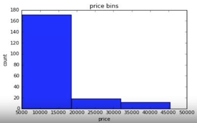

# Data Cleaning

## 1. Pre-processing Data in Python

Pre-processing data involves converting or mapping data from its initial raw form into another form to make it ready for further analysis. This process is often referred to as **data wrangling**. It’s like preparing for a big dinner: you start with various ingredients (data) that need to be cleaned, cut, or transformed to create a delicious meal (analyzed data).

> **'Wrangling'** : Traditionally refers to the act of managing or herding livestock, such as cattle or horses. When applied in the context of data, "data wrangling" involves gathering, cleaning, and transforming raw data into a structured and usable format for analysis.

## 2. Dealing with Missing values in Python

### 1) What is missing value?

Missing values occur when no data value is stored for a variable in an observation. Missing values are common in data and can arise due to various reasons, such as data entry errors, equipment failures, interruptions in the data collection process, etc.

They can be represented as "?", "N/A", "0" or simply a blank cell.

### 2) How to deal with missing values?

There are several ways to handle with missing values:

#### 1. *Check with the data collection source*

- Check if the person or group that collected the data can provide any information about the missing values.
- It's like calling a friend who gave you the recipe to ask about the missing ingredient.

#### 2. *Drop the missing values*

- Drop the variable
- Drop the data entry: If there are not many observations with missing data, dropping that particular entry is the best option.
- Think of it as skipping a dish entirely because you're missing a critical ingredient.
- Syntax:

    ```python
    dataframe.dropna(subset=["column-name"], axis=0, inplace=True)
    ```

  - `axis=0` : drops the entire row
  - `axis=1` : drops the entire column

- Examples:  

    ```python
    df.dropna(subset=["price"], axis=0, inplace=True)` # `inplace=True` writes the result back into the dataframe
    ```

    ```python
    df.dropna(subset=["price"], axis=0)` # This doesn't change the original dataframe
    ```

#### 3. *Replace the missing values*

- Replace the missing values with other(actual) values. e.g., the average, the most frequent value, etc.
- This is like subtituting one ingredient for another(best possible alternatives).
- Syntax:  

    ```python
    df["column-name"].replace(missing value, new-value)
    ```

- Example:

    ```python
    mean=df["normalized-losses"].mean() # Calculate the mean of the column
    ```

    and then,

    ```python
    df["normalized-losses"].replace(np.nan, mean, inplace=True) # Replace NaN(Not a Number, Python's default missing value marker) with the mean value // `inplace=True` writes the result back into the dataframe
    ```

#### 4. *Leave it as missing data*

- Sometimes, it's okay to leave a dish out if it's not essential to the dinner. ***Let it be~***.

## 3. Data Formatting in Python

Data is usually collected from different places and in different formats. It is important to standardize the data into a common format so that it can be easily understood and analyzed. It is similar to standardizing units of measurement in a dataset. So, Bringing data into a common standard of expression allows users to make meaningful comparisons(or look for ways to spot fraud)

### 1) Standardizing data

For example, **N.Y./Ny/NY/New York** to **NY** or Converting **mpg => L/100km**

- Applying calculations to an entire column
  - Example:  

    ```python
    df["city-mpg"]=235/df["city-mpg"] # Convert mpg to L/100km
    df.rename(columns={"city-mpg":"city-L/100km"}, inplace=True) # Rename the colum
    ```

### 2) Correcting data types

- Sometimes the wrong data type is assigned to a variable. Numerical variables should have type 'float' or 'int', and variables with strings such as categories should have type 'object'. For example, `price` might be assigned as a string, but it should be a float.

  *Step 1 : Check data types*

  - `df.dtype()` : Check the data type
  - `df.astype()` : Change the data type

  *Step 2 : Convert data types*

  - Example:  

    ```python
    df["price"]=df["price"].astype("float") # Convert the data type to float
    ```

    > **Data types in Pandas:**  
    > Objects : "A", "Hello" - String  
    > Int64 : 1, 2, 3 - Integer  
    > Float64 : 1.1, 2.2, 3.3 - Float  

## 4. Data Normalization in Python

- Normalization is the process of transforming values of several variables into a similar range. Typical normalizations include

  1. Scaling the variable so the variable average is 0
  2. Scaling the variable so the variance is 1
  3. Scaling the variable so the variable values range from 0 to 1

- For example,

    | age | income |
    |----------|----------|
    |   20  |   100000  |
    |   30  |   20000 |
    |   40  |   500000  |

    The table above shows the age and income of three people. Age ranges from 20 to 40, while income ranges from 20,000 to 500,000. Because income is much larger than the age, it will have a larger impact on the result. **The nature of the data biases the linear regression model to weigh income more heavily than age.** To avoid this, we need to normalize the data.

    After normalization:

    | age | income |
    |----------|----------|
    |   0.2  |   0.2  |
    |   0.3  |   0.04 |
    |   0.4  |   1.0  |

    Now, both age and income have the same impact on the result.

- Methods of normalizing data
  1. *Simple Feature Scaling*
  - Divides each value by the maximum value for that feature.
  - This makes the new values fall between 0 and 1.

      ```python
      df["length"]=df["length"]/df["length"].max()
      ```

  2. *Min-Max*
  - Subtracts the minimum value from each value, then divides by the range of the feature.
  - This also makes the new values fall between 0 and 1.

      ```python
      df["length"]=(df["length"]-df["length"].min())/(df["length"].max()-df["length"].min())
      ```

  3. *Z-score*
  - Subtracts the mean of the feature from each value and then divides by the standard deviation of the feature.
  - This typically makes the new values hover around zero and typically range between -3 and 3(though they can go beyond this range).

      ```python
      df["length"]=(df["length"]-df["length"].mean())/df["length"].std()
      ```

## 5. Binning in Python

Binning is a process of transforming continuous numerical variables into discrete categorical 'bins', for grouped analysis.

For example, consider the "price" of cars. "price" ranges from 5,000 to 45,500 :

| Price | Price-Binned |
|----------|-----|
| 13495 | Low |
| 16500 | Low |
| 18920 | Medium |
| 41315 | High |
| 5151 | Low |
| 6295 | Low |
| .... | .... |

In Python, you can perform binning with the following steps:

*Step 1 : Using NumPy*

- Use the NumPy function `linspace` to return the array bins that contains **equally spaced numbers** over the specified interval of the price.
  - Syntax:

    ```python
    np.linspace(start_value, end_value, number_of_bins+1)
    ```

  - Example:

    ```python
    bins=np.linspace(min(df["price"]), max(df["price"]), 4)
    ```

    - `min(df["price"])` : The minimum value of the price
    - `max(df["price"])` : The maximum value of the price
    - `4` : The number of dividers

*Step 2 : Using Pandas*

- Use the Pandas function `cut` to segment and sort the data values into bins.
  - Syntax:

    ```python
    group_names=["category1", "category2", "category3"]
    df["column-binned"]=pd.cut(df["column"], bins, labels=group_names, include_lowest=True)
    ```

  - Example:

    ```python
    group_names=["Low", "Medium", "High"]
    df["price-binned"]=pd.cut(df["price"], bins, labels=group_names, include_lowest=True)
    ```

    - `df["price"]` : The column we want to bin
    - `bins` : The bins we created
    - `labels` : The labels for the bins
    - `include_lowest=True` : Includes The leftmost edge of the bins

    > **In summary, the reason for using NumPy and Pandas together is:**
    >
    > - NumPy is used to create the bins.
    > - Pandas is used to create a new column that contains the binned values.

*Step 3 : Visualizing the Bins*

You can then use histograms to visualize the distribution of the data after it's been divided into bins :

```python
import matplotlib.pyplot as plt # Importing the library : `pyplot` is a submodule of 'matplotlib' that provides a collection of functions for generating plots and visualizations. `plt` is an alias for `pyplot`.
```
> **What is an alias?**
>
> An alias in programming is an alternative name or shorthand that you can use to refer to something, such as a module, function, or variable. It allows you to write shorter or more convenient code without changing the functionality.

```python
plt.hist(df["price-binned"], bins=3) # Draw histogram of attribute "price-binned" with 3 bins
```
```python
plt.xlabel("price") # Set the x-axis label
plt.ylabel("count") # Set the y-axis label
plt.title("price bins") # Set the title of the histogram
```

Then, you get the following histogram :



## 6. Turning Categorical Variables into Quantitative(Indicator or dummy) Variables in Python

Most statistical models cannot accept strings as input; they require numerical data for model training. Therefore, categorical variables need to be converted into quantitative(indicator or dummy(because the numbers themselves don't have inherent meaning)) variables. 

Consider an example of a categorical variable, **"weapon-type"** :

|Player|Weapon-type|
|------|-----------|
|1|Sword|
|2|Axe|
|3|Sword|
|4|Axe|

'Sword' and 'Axe' are categorical variables. For further analysis, you need to convert these categories into numerical values :

|Player|Weapon-type|
|------|-----------|
|1|1|
|2|0|
|3|1|
|4|0|

> This is called **"One-hot encoding"**. 
>
> - Syntax:
>
> ```python
> dummy_variable_1=pd.get_dummies(df["column"])
> ```
>
> - Example:
>
> ```python
> dummy_variable_1=pd.get_dummies(df["weapon-type"])  # Convert categorical variable into dummy/indicator variables
> df=pd.concat([df, dummy_variable_1], axis=1)  # Merge data frame "df" and "dummy_variable_1"
> df.drop("weapon-type", axis=1, inplace=True)  # Drop original column "weapon-type" from "df"
> ```

## 7. Summary

Data cleaning in Python involves several crucial steps to prepare raw data for analysis. **Pre-processing** includes transforming raw data into a usable format, often referred to as data wrangling. **Handling missing values** can be done by checking with the data source, dropping the missing data, replacing it with substitutes like the mean, or simply leaving it as is. **Data formatting** ensures consistency in data types and units, allowing for meaningful analysis. **Normalization** scales data to a common range, reducing bias in models, while **binning** groups numeric data into categories, making it easier to analyze. Finally, **turning categorical variables into quantitative variables** using techniques like one-hot encoding enables statistical models to process the data effectively. These steps are essential for ensuring that the data is clean, consistent, and ready for any subsequent analysis or modeling.
