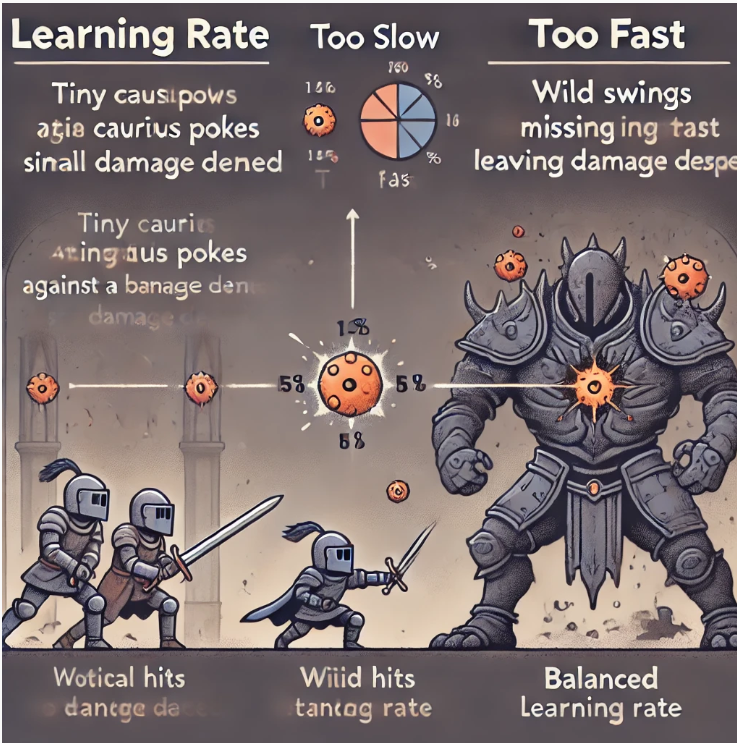
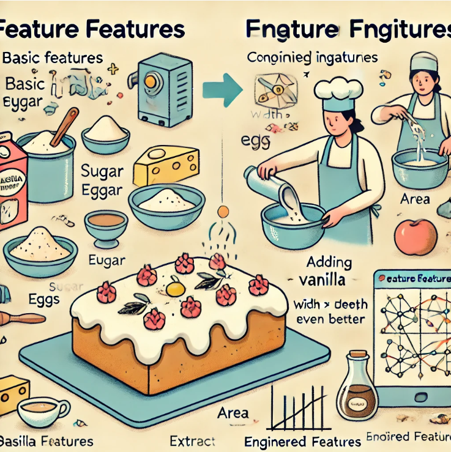

# Supervised Learning(7) - Multiple Linear Regression: Extending to More Features

Now, we're going to take what you've learned about linear regression and make it **faster** and **more powerful** by incorporating multiple features into our model.

## ***Moving Beyond One Feature***

In the basic version of linear regression, we used a **single feature** to predict the output. For example, you might have used $x$ (the size of the house) to predict $y$ (the price of the house). The model was written as:

$$
f_{w, b}(x) = w \cdot x + b
$$

But what if we had **more features** to help us predict the price? Features like the **number of bedrooms**, **number of floors**, and the **age of the house** could give us much more information. This leads us to **multiple linear regression**, where we use several features to make predictions.

You learned multiple linear regression in the previous chapter(***Data Analysis with Python***), but now we're going to take it a step further by introducing **vectorization**.

## ***Introducing Multiple Features***

Let’s introduce some new notation to handle multiple features. Suppose we have four features: 

- $x_1$: the size of the house (square feet),
- $x_2$: the number of bedrooms,
- $x_3$: the number of floors,
- $x_4$: the age of the house (years).

For simplicity, we’ll use $x_j$ to represent each feature, where $j$ can go from 1 to n (the total number of features). So, in this example, $n$ is 4.

We’ll also use $X^{(i)}$ to represent the **i-th training example**. This means $X^{(i)}$ is a **vector** that contains all the features of the **i-th** example. For instance, if the second training example has:

- 1416 square feet,
- 3 bedrooms,
- 2 floors,
- and is 40 years old,

then $X^{(2)} = [1416, 3, 2, 40]$.

### ***Referring to Individual Features***

If you want to refer to a specific feature of a training example, use $X^{(i)}_j$. For example, $X^{(2)}_3$ would be the number of floors in the second training example, which is 2. 


To make things easier to visualize, we sometimes draw an arrow on top of the vector $\vec X^{(i)}$ to emphasize that it’s a list of numbers, not just a single value. However, the arrow is optional and more of a visual aid.

> **Note**: The arrow notation is standard in linear algebra. It’s used to distinguish between **scalars** (single numbers) and **vectors** (lists of numbers). Vector includes direction and magnitude, while scalar only has magnitude. We will learn more about vectors in the next section, ***Mathematics for Machine Learning and Data Science with Python***.

## ***The Model with Multiple Features***

Now that we have **multiple features**, our model becomes more complex. Here’s what the model looks like with four features:

$$
f_{w, b}(X) = w_1 \cdot X_1 + w_2 \cdot X_2 + w_3 \cdot X_3 + w_4 \cdot X_4 + b
$$

Let’s make this concrete by looking at a possible model for predicting house prices:

$$
f_{w, b}(X) = 0.1 \cdot X_1 + 4 \cdot X_2 + 10 \cdot X_3 - 2 \cdot X_4 + 80
$$

### ***Interpreting the Parameters***

Each parameter $w_j$ has a specific meaning:

- $w_1 = 0.1$: For every additional square foot, the house price increases by $100** (since 0.1 times $1,000 equals $100).
- $w_2 = 4$: Each additional bedroom adds $4,000** to the price.
- $w_3 = 10$: Each additional floor adds $10,000**.
- $w_4 = -2$: For each additional year of age, the price **decreases** by $2,000**.
- $b = 80$: The base price starts at $80,000** (when all features are zero).

So, if you have **n** features, the model is written as:

$$
f_{w, b}(X) = w_1 X_1 + w_2 X_2 + ... + w_n X_n + b
$$

## ***A More Compact Notation***

To simplify things, let’s introduce **vector notation**. Instead of writing out each $w_j$ and $X_j$ individually, we’ll collect all the $w_j$'s** into a vector $W$. This vector contains the parameters $w_1, w_2, ..., w_n$. Similarly, we’ll represent the features $X_1, X_2, ..., X_n$ as a vector $X$.

Now, we can rewrite the model in a more compact way:

$$
f_{{\vec W}, {b}}(\vec X) = \vec W \cdot \vec X + b
$$

### ***What Is a Dot Product?***

The **dot product** is a mathematical operation that takes two vectors and multiplies their corresponding elements. After multiplying the elements, you **sum** the results. So:

$$
\vec W \cdot \vec X = w_1 X_1 + w_2 X_2 + ... + w_n X_n
$$

Then, we add the bias term $b$ to get the final prediction.

# What’s Next: Vectorization

Now that you understand multiple linear regression, the next step is to **optimize** how we implement it. There's a neat technique called **vectorization** that will make your code shorter, faster, and more efficient. It’s especially useful when working with large datasets and complex algorithms.

## ***Vectorization: The Key to Faster and More Efficient Machine Learning Code***

When implementing a machine learning algorithm, one powerful technique you should know about is **vectorization**. Using vectorization will not only make your code **shorter** and **easier to read**, but it will also make it run **much faster**. This is because vectorization allows you to take advantage of optimized numerical linear algebra libraries and even specialized hardware like **GPUs** (Graphics Processing Units), which are designed to handle large amounts of data quickly.

Let’s break down what vectorization means and how it works with a concrete example.

> **Note** : You may have heard of ***GPU, NVIDIA, CUDA***.   
> - **GPU** stands for Graphic Processing Unit, which is a specialized processor originally designed to accelerate rendering of complex graphics, especially for gaming and visual applications. However, GPUs are now widely used for parallel computing tasks due to their ability to perform many operations simultaneously.
> - **NVIDIA** is a leading company that designs and manufactures GPUs. They are well-known for their contributions to both gaming and general-purpose computing on GPUs (GPGPU), which includes applications like machine learning, scientific computation, and AI.
> - **CUDA**, which stands for Compute Unified Device Architecture, is a parallel computing platform and programming model created by NVIDIA. CUDA also makes it easy for developers to take advantage of all the latest GPU architecture innovations. 

## ***Example: Compute a Prediction with Parameters***

Imagine you have a model with parameters $W$ and $b$:

- $\vec W$ is a vector of numbers, let’s say it has three values: $w_1$, $w_2$, and $w_3$.
- $\vec X$ is another vector of features, also with three values: $X_1$, $X_2$, and $X_3$.

In this case, **n = 3**, meaning both $\vec W$ and $\vec X$ have 3 components. If you're writing the code in **Python**, you can use the popular **NumPy** library, which is great for numerical operations(And you already know about it from the previous chapter). Here's an example of how you might define these vectors in Python:

```python
import numpy as np
w = np.array([w1, w2, w3])
x = np.array([x1, x2, x3])
b = 50
```

## ***Non-Vectorized Implementation***

Now, let’s compute the prediction without using vectorization. In this case, for each $X_j$, you multiply it by the corresponding $X_j$ and sum the results. This can be done manually:

$$
f = w_0 \cdot X_0 + w_1 \cdot X_1 + w_2 \cdot X_2 + b
$$

But what if n is not 3? What if it's 1,000, or 100,000? Writing all those terms would be inefficient, not just for you as a coder, but also for the computer to process.

A more flexible way to do this without vectorization is by using a for loop:

```python
f = 0
for j in range(3):  
    f += w[j] * X[j]
f += b 
```

This code works for any **n**, but it's still not the most efficient. When **n** gets large, the computation slows down.

## ***Introducing Vectorization***

To speed things up, we can use vectorization. In mathematical terms, we are performing a dot product between the vectors $W$ and $X$, and then adding the bias $b$.

The formula looks like this:

 $$𝑓_{W,X}=W \cdot X +𝑏$$

But in Python, with NumPy, you can compute this in one line of code using the np.dot() function:

```python
f = np.dot(W, X) + b
```

This is the vectorized implementation of the same operation. It’s shorter and more efficient!

## ***Why Vectorization is Faster***

So, why is this single line of vectorized code so much faster than the for-loop code? The secret lies in how computers handle these operations behind the scenes. When you use vectorized functions like `np.dot()`, NumPy is able to take advantage of parallel processing.

Think of it like this: if you were trying to build a house, doing all the work yourself (sequentially) would take much longer than if you had a team of workers (parallel processing) each handling different tasks at the same time.

Even though your code is shorter, the real speedup comes from your computer’s ability to run multiple operations simultaneously. This is especially true if you're using a ***GPU***. ***GPUs*** were originally designed for rendering graphics quickly, but their architecture also makes them very good at performing many mathematical operations in parallel, like those needed for vectorized computations.

## ***Recap: The Benefits of Vectorization***

1. Shorter Code: With vectorization, you can replace a long, complex loop with a single, simple line of code. This makes your code easier to write and much more readable.

2. Faster Execution: Vectorized code runs much faster, especially for large datasets. This is because modern libraries like NumPy are optimized to take full advantage of your computer’s parallel processing capabilities.

3. Scalability: When n is small, the performance difference might not be noticeable. But as n grows, the performance boost from vectorization becomes significant.

## ***What Happens Behind the Scenes?***

Let’s first look at how a **for-loop** operates without vectorization. Imagine we’re iterating through 16 elements, from **j = 0** to **j = 15**. Without vectorization, the loop processes one element at a time. Here’s how it works in steps:

- At **time-step $t_0$, it processes the first element (index 0).
- At the next time-step, it moves to the next element (index 1), and so on.
- This continues until the 16th step when the final element is processed.

In other words, it computes everything **one step at a time**.

Now, let’s compare that with **vectorized code**. In a vectorized implementation, the computer can grab **all the elements of the vectors** (say, $W$ and $X$) and compute their values **in parallel**. The computer multiplies each pair of $W$ and $X$ elements at the same time. After that, it efficiently sums these values using specialized hardware.

This is the key reason why vectorized code is so much faster. Instead of processing each operation **sequentially**, the computer uses parallel processing to handle **all** operations in one step, making the entire process much quicker.

### ***Why Does This Matter?***

You might be thinking, "Why does this matter?" Well, it matters **a lot**, especially when you’re dealing with **large datasets** or **complex machine learning models**. Training these models requires a lot of calculations, and without vectorization, those calculations can take hours or even days or **forever**! But with vectorization, those same calculations might only take minutes!

That’s why using vectorization is essential to building efficient machine learning algorithms that can scale well to handle large amounts of data.

## ***Vectorization in Action: Linear Regression with Multiple Features***

Let’s now look at a **real-world example**: implementing multiple linear regression using vectorization. 

Imagine you have a dataset with **16 input features** and corresponding parameters $w_1$ through $w_16$ (the weights), as well as a parameter $b$ (the bias).

### ***Non-Vectorized Approach***

Without vectorization, you might compute the updates for each of the 16 parameters manually. For example, you would($d_j$ is derivative of the cost function):

- Update $w_1$ as: $w_1$ = $w_1$ - 0.1 * $d_1$
- Update $w_2$ as: $w_2$ = $w_2$ - 0.1 * $d_2$
- And so on, until you reach $w_{16}$.

This would be tedious to write and inefficient to run. You might use a **for-loop** to handle this:

```python
for j in range(16):  
    w[j] = w[j] - 0.1 * d[j]
```

This loop calculates each update step sequentially, which can slow things down if you have a lot of features or data.

### ***Vectorized Approach***

Now let’s look at the vectorized version. Instead of looping through each element, you can perform the entire operation in one step by writing:

```python
w = w - 0.1 * d
```

Here, $\vec W$ and $\vec d$ are both NumPy arrays, and the code runs much faster because it uses the computer’s parallel processing capabilities. Instead of updating each weight individually, the computer updates all 16 weights in parallel.

This difference in performance might not seem like a big deal for just 16 features, but imagine again you had thousands of features or were working with a large dataset. The speedup from vectorization could mean the difference between your code running in minutes or hours.

# Implementing Gradient Descent for Multiple Linear Regression with Vectorization

Now that you’ve learned about **gradient descent**, **multiple linear regression**, and **vectorization**, it’s time to bring all of these concepts together to implement **gradient descent for multiple linear regression using vectorization**.

## ***A Quick Review of Multiple Linear Regression***

Previously, we talked about multiple linear regression as having parameters $w_1$ through $w_n$ and a bias term $b$. Instead of thinking of $w_1$ through $w_n$ as separate parameters, we can **collect all the $w$ s into a vector**, which we’ll call $\vec W$. So, $\vec W$ is now a vector of length **n** (where **n** is the number of features). The bias term $b$ remains a single number.

Now, using vector notation, we can rewrite the model as:

$$
f_{\vec W,b}(\vec X) = \vec W \cdot \vec X + b
$$

Here, the "dot" symbol (·) represents the **dot product** between the vector $\vec W$ and the vector $\vec X$ (the features).

## ***Vectorized Cost Function***

Our cost function, previously written as $J(w_1, w_2, ..., w_n, b)$, can now be written more compactly as $J_{\vec W, b}$. Instead of **n** separate parameters, we now have a single vector $\vec W$ and the number $b$. The function $J_{\vec W, b}$ still outputs a single number (the cost), but it now takes a vector as input.

## ***Gradient Descent for Multiple Features***

Here’s what **gradient descent** looks like for multiple linear regression:

- Repeatedly update each parameter $w_j$ using the update rule:

$$
w_j = w_j - \alpha \cdot \frac{\partial J_{\vec W, b}}{\partial w_j}
$$

$$
b = b - \alpha \cdot \frac{\partial J_{\vec W, b}}{\partial b}
$$

Where **α** is the learning rate, and $\frac{\partial J_{\vec W, b}}{\partial w_j}$ is the derivative of the cost function **J** with respect to $w_j$.

## ***Derivatives for Gradient Descent***

Let’s look at how the derivative terms work for multiple features. When we had only **one** feature, the update rule for **w** looked like this:

$$
w = w - \alpha \cdot \frac{\partial J}{\partial w}
$$

Now that we have **multiple features**, the update rule becomes:

$$
w_j = w_j - \alpha \cdot \frac{\partial J}{\partial w_j}
$$

For each **j** (from 1 to **n**), we need to update each $w_j$ using its corresponding derivative. The main difference is that $\vec W$ and $\vec X$ are vectors. 

The general rule is that we update **all parameters $w_1$, $w_2$, ..., $w_n$ and then update $b$, the bias term, in each iteration of gradient descent.

## ***Vectorization in Gradient Descent***

With **vectorization**, we don’t need to update each $w_j$ one at a time. Instead, we can use vectorized operations to update **all the weights** at once. This makes the code more concise and much faster to run.

In **vectorized form**, the gradient descent update rule for all $w$ becomes:

$$
w_n = w_n - \alpha \frac{1}{m} \sum_{i=1}^{m} \left( f_{\vec{w}, b}(\vec{x}^{(i)}) - y^{(i)} \right) x_n^{(i)}
$$

And for **b**, the update is similar:

$$
b = b - \alpha \frac{1}{m} \sum_{i=1}^{m} \left( f_{\vec{w}, b}(\vec{x}^{(i)}) - y^{(i)} \right)
$$

Simultaneously update $w_j$ (for j = 1, ...,  n)** and $b$ in each iteration.  

## ***The Normal Equation: An Alternative to Gradient Descent***

Before we move on, it’s important to note that there’s another method for finding **w** and **b** in linear regression, called the **normal equation**. While **gradient descent** is a powerful method for minimizing the cost function $J_{\vec W, b}$, the **normal equation** offers a different approach.

The **normal equation** is a formula that allows us to solve for $w$ and $b$ in one step, without using an iterative process like gradient descent. This is possible because linear regression has an exact solution that can be found using advanced linear algebra techniques.

Using a **linear algebra library**, we can compute $w$ and $b$ directly by solving the normal equation.

However, the **normal equation** has some limitations:

- It only works for **linear regression**. It **cannot** be generalized to other algorithms like **logistic regression** or **neural networks**.
- The normal equation is slow when the number of features is very large. This is because solving it involves inverting a matrix, which becomes computationally expensive as the number of features grows.

## ***Feature Scaling and Gradient Descent: Why Scaling Matters***

When building machine learning models, one common challenge is handling features that have very different ranges of values. This can cause problems with optimization methods like gradient descent. So, we'll talk about a technique called **feature scaling** that speeds up gradient descent and makes it more effective.

### ***A Real-World Example: Predicting House Prices***

Imagine you're trying to predict the price of a house. Two features you might use are:

- $x_1$: The size of the house in square feet (usually ranges from 300 to 2,000 $feet^2$).
- $x_2$: The number of bedrooms (ranges from 0 to 5 bedrooms).
- $y$: The price of the house (in dollars).

Then, you can write the model as:

$$
\hat {price} = w_1 x_1 + w_2 x_2 + b
$$

Now, consider a house with:

- 2,000 square feet,
- 5 bedrooms,
- a price of $500,000(=$500K)

In machine learning, we want to find the best values for the parameters (weights) associated with these features, say $w_1$ (for square feet) and $w_2$ (for bedrooms), as well as the bias $b$. These parameters help the model predict house prices based on the features.

Let's look at two possible sets of parameters:

1. $w_1$ = 50**, $w_2$ = 0.1**, and $b$ = 50**.

    In this case, the model predicts:

    $\hat {price}$ = 50 * 2,000 ($feet^2$) + 0.1 * 5 (bedrooms) + 50
   
    This results in a predicted price of $100,050.5**, which is **way off** from the actual price of $500,000. Clearly, this isn't a good set of parameters.

2. $w_1$ = 0.1**, $w_2$ = 50**, and $b$ = 50**.

    Now the model predicts:

    $\hat {price}$ = 0.1 * 2,000 ($feet^2$) + 50 * 5 (bedrooms) + 50
    
    This results in a predicted price of $500,000**, which is the correct price. In this case, the parameter values seem much more reasonable.

### ***Understanding Why This Happens***

When you look at the range of the features, you’ll notice that $x_1$ (size in square feet) can have very large values, up to 2,000, while $x_2$ (number of bedrooms) has much smaller values, between 0 and 5.

Because $x_1$ is large, the model needs a **small** parameter value, like 0.1, to avoid making overly large predictions. On the other hand, $x_2$ is much smaller, so the model needs a **large** parameter value, like 50, to have a noticeable impact on the prediction.

### ***Gradient Descent and Feature Scaling***

Now, let’s connect this to gradient descent. Gradient descent is an optimization algorithm that tries to minimize the cost function, which tells us how bad the model’s predictions are(or how good). However, when the features have very different ranges of values, gradient descent can struggle.

Imagine a scatter plot where the **x-axis** represents $x_1$ (square feet) and the y-axis represents $x_2$ (number of bedrooms). The values of $x_1$ are spread out much more widely than those of $x_2$. 

As a result, the cost function’s contour plot looks like an **elongated oval** rather than a **circle**. This creates a problem for gradient descent.

Here’s a metaphor to help explain: Imagine you’re hiking in a narrow valley with steep sides. Instead of walking straight downhill, you might zigzag back and forth, making slow progress. This is what gradient descent does when the features aren’t scaled properly—it "zigzags" a lot and takes a long time to reach the bottom, or the optimal solution.

## ***Feature Scaling: Leveling the Playing Field***

The solution to this problem is **feature scaling**. When we scale the features, we transform them so that they all take on similar ranges of values. 

For example, we can rescale $x_1$ (size in square feet) and $x_2$ (number of bedrooms) to both range from **0 to 1**. After scaling, the cost function’s contour plot looks more like a **circle**. In this case, gradient descent can take a more direct path to the minimum, making it **much faster and more efficient**.

And you can think of it like this: when the features are scaled, the valley becomes wider and shallower, making it easier to walk straight downhill. 

In other words, computer can handle the data more efficiently when the data is divided into smaller chunks.

### ***How to Perform Feature Scaling***

There are several ways to scale your features:

- **Normalization**: Rescale the values of each feature to range between 0 and 1.
- **Standardization**: Transform the features so they have a mean of 0 and a standard deviation of 1.

> **Note**:  
> ***Normalization*** is very important in ***Deep Learning***, and also in our life! When we observe the data, events, or anything, we need to normalize them to understand them better. We normalize everything in our life to make them easier to understand. For example, when we see the temperature, We can say that the temperature is hot or cold. However, we need to **denormalize** to get the exact temperature. **Denormalization** is an important skill we should learn: we need to  simplify things to make sense of them, but we also need to go back to the real values to understand them fully.

By scaling your features, you can avoid the slow zigzagging of gradient descent and reach the best solution faster.

One simple way to scale features is to **divide by the maximum value** of each feature. For instance:

- **Scaling $x_1$: If $x_1$ ranges from 3 to 2,000, you can divide each value of $x_1$ by 2,000 (the maximum value). The scaled $x_1$ will now range from approximately **0.0015 to 1**.
  
- **Scaling $x_2$: Since $x_2$ ranges from 0 to 5, you can divide each value of $x_2$ by 5. The scaled $x_2$ will now range from **0 to 1**.

If you plot the scaled $x_1$ and $x_2$ on a graph, the data points will now appear more **compressed** and will have similar ranges, making gradient descent more efficient.

### ***Mean Normalization***

Another common method is **mean normalization**. Instead of just dividing by the maximum value, we can **center the features around zero**, so they have both **negative and positive values**. This often makes gradient descent work even better.

Here’s how mean normalization works:

1. **Calculate the mean (average)** of each feature. Let’s call the mean of $x_1$ as $\mu_1$.
2. **Subtract the mean** from each value of $x_1$, and then divide by the range of the feature (the maximum minus the minimum). For instance:

$$
x_1^{\text{normalized}} = \frac{x_1 - \mu_1}{2000 - 300}
$$

If $\mu_1$ is 600, then the mean normalized $x_1$ will now range from **-0.18 to 0.82**.

For $x_2$, you would do the same:

$$
x_2^{\text{normalized}} = \frac{x_2 - \mu_2}{5 - 0}
$$

If $\mu_2$ is 2.3, the normalized $x_2$ will range from **-0.46 to 0.54**.

Now, when you plot the data using the mean normalized features, the values will be centered around zero.

### ***Z-Score Normalization***

Another useful scaling technique is called **Z-score normalization**. This method uses the **mean** and **standard deviation** of each feature to rescale it. If you’ve heard of the **normal distribution** or the **bell curve**, Z-score normalization is based on similar principles.

Here’s how you perform Z-score normalization:

1. **Calculate the mean ($\mu$)** and the **standard deviation ($\sigma$)** for each feature.
2. For each value of $x_1$, subtract the mean and divide by the standard deviation:

$$
x_1^{\text{z-score}} = \frac{x_1 - \mu_1}{\sigma_1}
$$

For example, if $\mu_1 = 600$ and $\sigma_1 = 450$, the Z-score normalized $x_1$ will now range from **-0.67 to 3.1**.

Similarly, for $x_2$, if $\mu_2 = 2.3$ and $\sigma_2 = 1.4$, the normalized $x_2$ will range from **-1.6 to 1.9**.

## ***Practical Tips for Feature Scaling***

When you perform feature scaling, it’s usually a good idea to aim for a range between **-1 and +1** for each feature, though this range can vary slightly. For instance:

- If a feature ranges from **-0.3 to +0.3**, that’s perfectly fine.
- If a feature ranges from **0 to 3**, it’s also okay, though you might still choose to rescale it if needed.
- However, if a feature has a very large range, like **-100 to +100**, it’s usually a good idea to rescale it to something closer to **-1 to +1**.

## ***Examples of Feature Ranges***

Let’s consider a few examples to illustrate when you should re-scale:

- $x_3$: Suppose $x_3$ has values between **-100 and +100**. This is a wide range compared to other features, so you’d likely want to rescale it to make it comparable to the others.
  
- $x_4$: If $x_4$ has very small values, such as **-0.001 to 0.001**, this is also a case where rescaling would help.

- $x_5$: Suppose $x_5$ is a feature like body temperature, which ranges from **98.6 to 105 degrees Fahrenheit**. Although these numbers are fairly close to each other, they’re still large relative to scaled features, and this could cause **gradient descent** to run slowly. Rescaling $x_5$ would likely improve performance.

## ***Should We Always Scale Features?***

In general, there’s almost **no harm** in scaling features. If you’re unsure whether or not to scale, it’s usually better to just **go ahead and do it**. Feature scaling can significantly improve the speed of gradient descent, especially when your features have very different ranges.

However, there are a few cases where you might not need to scale features(You have learned these concepts in the previous chapter, ***Data Analysis with Python***, so you should now be able to grasp them easily):

- **Binary Features**: If a feature is binary (0 or 1), you don’t need to scale it. Binary features are already in a consistent range.

- **Ordinal Features**: If a feature is ordinal (like a rating from 1 to 5), you might not need to scale it. Ordinal features are often already in a consistent range.

- **Categorical Features**: If a feature is categorical (like colors or cities), you might not need to scale it. Categorical features are usually encoded as binary variables, so they don’t need scaling.

## ***Choosing the Right Learning Rate: How Fast Should Your Model Learn?***



In *Elden Ring*, mastering your movements and attacks is key to survival. If you attack too slowly, enemies will crush you. But if you attack recklessly without timing, you’ll miss your target or get hit. In machine learning, the **learning rate** works similarly to timing your attacks. It controls how fast your model “learns” and finds the best solution. If the learning rate is set wrong, your model might move too slow to be useful or too fast and miss the target entirely.

Let’s dive into some common questions you might have about choosing the right learning rate for your machine learning algorithm.

### ***What is a Learning Rate?***

Think of the **learning rate** as your attack speed in *Elden Ring*. If you swing your sword (or cast your spells) too slowly, you’ll never finish off an enemy before they overwhelm you. But if you swing wildly without any control, you might miss and leave yourself wide open for a counterattack.

In machine learning, the "enemy" is the **cost function**—it tells us how far off our predictions are. The goal is to “defeat” the cost function by finding the right **parameters** to minimize the cost. And just like in a battle, the speed of your swings—the learning rate—makes a huge difference.

### ***What Happens if the Learning Rate is Too Small?***

Imagine you’re fighting one of the slower enemies in *Elden Ring*, but instead of attacking with a solid strike, you’re just poking at them lightly. It feels like it’s going to take forever to defeat them, right? That’s what happens when the learning rate is too small. Your model will eventually find the best solution, but it will take **way too long**.

If your learning rate is as tiny as a weak poke (e.g., 0.0001), your model will move in the right direction, but it will be **so slow** that you might lose patience before it reaches the optimal solution. This is why we don’t want the learning rate to be too small—just like in *Elden Ring*, you need a balance between safety and speed.

### ***What Happens if the Learning Rate is Too Big?***

Now picture yourself fighting a boss like **Malenia**. You charge in full force, but instead of precisely timing your hits, you swing wildly without any strategy. You end up rolling past her, leaving yourself vulnerable to her attacks. That’s what happens when the learning rate is too large—it’s like your model is “overshooting” the best solution and bouncing around aimlessly.

In machine learning, when the learning rate is too high, the model doesn’t settle at the best solution. Instead, it **jumps around** wildly, just like dodging too far in a boss fight, never quite finding the right spot to land a hit. Sometimes, the cost function might even get worse instead of better!

### ***How Do You Know if the Learning Rate is Too Big or Too Small?***

Here’s how you can check if your learning rate is as off as a bad roll against a boss in *Elden Ring*:

1. **Plot the cost function over time**: If you see the cost function going **up and down**, it’s like your model is panic-rolling through a fight, not getting anywhere. This means the learning rate is too high.

2. **Try a really small learning rate**: Set the learning rate super low (like 0.0001), just as you might take slow, careful swings in a boss fight. If the cost function steadily decreases without going up, you know that your gradient descent (the learning process) is working properly, but it’s **too slow** for efficient training.

### ***How Can You Choose a Good Learning Rate?***

You don’t want to fight a boss with wild swings or with hesitant pokes—you want something in between. The same goes for your learning rate: start slow and then pick up the pace as you get more comfortable.

Here’s how you can find the best learning rate:

1. **Start with a small learning rate**: Begin cautiously, like 0.001, as if you’re observing the boss’s attack patterns before making a move.
   
2. **Increase gradually**: Once you get a sense of the battlefield, try speeding things up—go from 0.001 to 0.003, then 0.01, and see how your model reacts.

3. **Watch the cost function**: After each round of testing, check if the cost function is going down consistently, without “overshooting.” Pick the learning rate that gives you the best balance, just like choosing the right moment to dodge and counterattack.

By testing different learning rates and gradually increasing, you’ll find the speed that lets your model “defeat the boss” without crashing.

### ***What if the Cost Function Keeps Increasing?***

If your cost function keeps going up (like the boss's health bar in *Elden Ring* stays the same), it could mean two things:
- **Your learning rate is too high**. You’re being too aggressive, just like swinging too wildly at a boss. Dial it down.
- **There’s a bug in your code**. Maybe you’re accidentally rolling toward the boss instead of away from their attacks. In gradient descent, a common mistake is forgetting to add a negative sign in the update rule, which makes the model move in the wrong direction.

## ***Feature Engineering : Creating New Features for Better Taste***



Imagine you are trying to bake a cake. You have a recipe that tells you to use flour, sugar, eggs, and butter. But what if you knew that adding a little vanilla extract could make the cake taste even better? That’s kind of what **feature engineering** does in machine learning.

In machine learning, just like adding vanilla extract to improve your cake, we can create new features from the ones we already have to help our model make better predictions.

But let’s break it down a bit more to really understand what’s going on.

### ***What Are Features in Machine Learning?***

Features are like the ingredients in a recipe. They are the pieces of information we give to the machine learning algorithm to help it make predictions. For example, if we are trying to predict the price of a house, some features could be:
- The size of the house (in square feet)
- The number of bedrooms
- The number of bathrooms

These are the "ingredients" of the prediction recipe. The more meaningful the features, the better your model can understand the data and make accurate predictions.

### ***Why Do We Need Feature Engineering?***

Imagine you're trying to figure out how fast someone is driving, but all you know is how far they traveled and how long it took. If you just give your model the "distance" and the "time" separately, it might not be super helpful. But if you **combine** those two features into something new—speed, which is distance divided by time—now your model can make much better guesses about what’s happening.

Feature engineering is when you **create new features** by combining, transforming, or breaking down the existing ones to help the algorithm understand the problem better. It’s like turning raw ingredients into something more useful, like flour into dough.

### ***How Does Feature Engineering Work? (House Price Example)***

Let’s go back to predicting house prices. Suppose we have two features for each house:
1. The width of the land (frontage)
2. The depth of the land

These two features seem useful, but what if the **area** of the land is actually more important than the width or depth by themselves? The area is the width multiplied by the depth, right? So, we can create a new feature that represents the total area of the land.

Now, instead of just using "width" and "depth," we have a new feature—**area**—which might help our model predict house prices more accurately.

This is what feature engineering is all about: finding ways to make your data more useful by combining or transforming the information you already have.

### ***Can You Always Trust the Features You Start With?***

Think about playing a video game(I love Elden Ring). At first, you might only have a few basic tools to help you complete the level. But as you go along, you can combine tools or unlock new abilities that make beating the level easier. Features in machine learning are like that.

You can start with basic features, but by **engineering new ones**—combining or changing the features you have—you can make it much easier for your machine learning algorithm to "win" by making accurate predictions.

In some cases, the features you start with might not be enough, or they might even mislead the algorithm. By creating new, more useful features, you're giving the model better "tools" to work with.

### ***How Does Feature Engineering Help Models Fit Non-Linear Data?***

Imagine you're trying to fit a straight line through a bunch of points on a graph. If the points are arranged in a curve, no matter how hard you try, you can’t fit a straight line to them perfectly.

In machine learning, many problems are like this. The relationships between the features and the thing you’re trying to predict aren’t always a straight line—they can be more complex or **non-linear**.

Through feature engineering, you can help your model deal with these curvy, non-linear relationships. For example, if you notice that a feature and the target are related in a way that forms a curve, you can **transform** the feature to better match that curve. This might mean squaring a feature, taking its logarithm, or multiplying two features together(You also already learned this in the previous chapter, ***Data Analysis with Python***).

### ***What Are Some Common Techniques in Feature Engineering?***

Here are a few ways we can engineer features:

1. **Interaction Terms**: Creating new features by multiplying or dividing existing ones. For example, if we have two features, "width" and "depth," multiplying them gives us a new feature: "area."
   
2. **Polynomial Features**: Sometimes you need to capture more complex patterns. This is like adding powers of features (e.g., $x^2$, $x^3$) to help your model understand curves in the data.

3. **Binning**: Imagine you have a feature like age. Instead of using raw numbers, you can group ages into categories like "teen," "young adult," "middle-aged," and "senior." This can sometimes help the model make better sense of the data.

4. **Logarithmic Transformations($log(x)$)**: This can help if your data has a lot of very small or very large values, which might confuse the model. Taking the logarithm of a feature can compress the range of values and make the data easier to handle.

### ***When Should You Do Feature Engineering?***

You should consider feature engineering when:
- **The model isn’t performing well** with the features you started with.
- **There’s a clear relationship** between some features that you think could be combined to make a more powerful feature.
- **You have some domain knowledge** about the problem that could help guide the creation of new features. For instance, if you're predicting house prices, knowing that "area" is more useful than "width" and "depth" separately is valuable insight.

### ***Is There a Downside to Feature Engineering?***

Feature engineering is powerful, but it can also be tricky. If you create too many features or unnecessary ones, you can actually **confuse** the model. It’s like giving someone too many clues to solve a mystery—it might just make things more complicated. So, it’s important to carefully test whether the features you create are actually helping.

### ***In Summary:***

Feature engineering is like taking the basic ingredients of a recipe and combining or transforming them to make something even better. It’s one of the most important tools in machine learning because the right features can determine whether your model succeeds or fails. By thinking creatively and using domain knowledge(your horizon!), you can create new features that make it easier for your algorithm to see the patterns in the data, leading to better predictions.