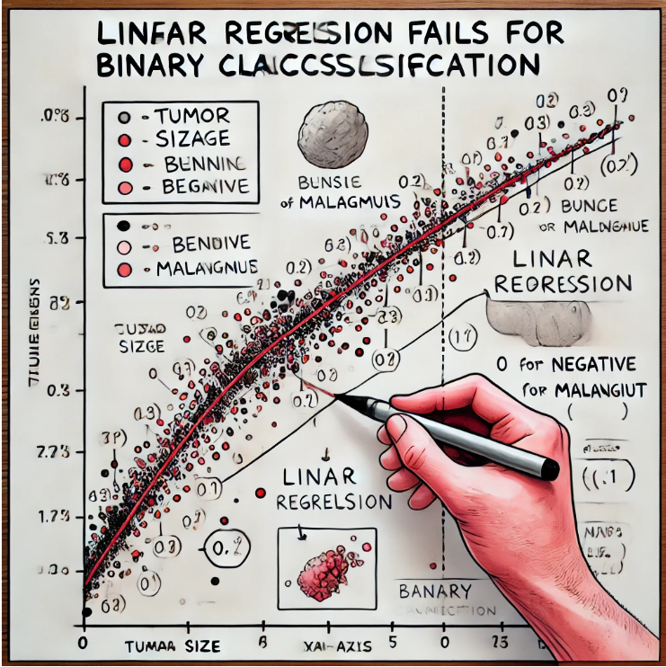
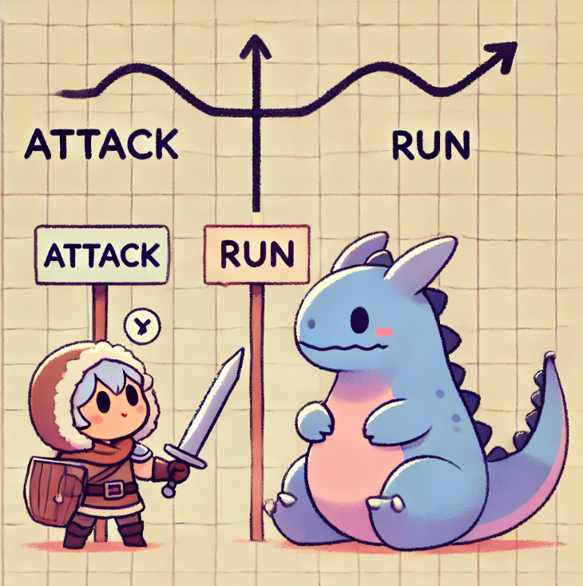

# Introduction to Logistic Regression: A Simple Guide with a Dash of Elden Ring

Linear Regression is a powerful tool to predict numbers—like figuring out the price of a house based on its size. However, when it comes to deciding between two options, linear regression doesn't do the job very well. This is where logistic regression comes into play. 

I'm going to explain why logistic regression is the right tool for classification, and I'll even sprinkle in some references to *Elden Ring* to make things more fun.

Imagine you're playing *Elden Ring*, and you're facing off against a tough boss. You have to decide whether to attack or run away. It's a yes or no decision. That’s what we call a binary classification problem. 

Similarly, we often needs to categorize things into one of two categories—like whether an email is spam or not, or whether a tumor is malignant or benign. For these types of problems, we use **logistic regression**.

## Why Linear Regression Isn't Enough for Classification

Let’s start with linear regression and why it’s not the best fit for classification. Linear regression works by fitting a straight line through the data, predicting values that can be anything from negative numbers to positive numbers. 

That’s great if you’re trying to predict a continuous value, like the damage your weapon might deal in *Elden Ring*. But what if you need a definite answer, like "is this email spam? Yes or no?"?

If we try to use linear regression for this 'yes/no' problem, it can give us predictions like “-0.5” or “1.7,” which don’t really make sense when we only want to know if something is 0 (no) or 1 (yes). We could try to solve this by setting a threshold—like saying any value above 0.5 is a "yes" and anything below is a "no." 

But this approach has problems. Imagine an enemy showing up way off in the distance, and suddenly, all your decisions about attacking or defending get messed up just because that far-off enemy exists. That’s what happens to linear regression when you add data that’s very different from the rest — it shifts the whole line in a way that doesn’t make sense for classification.

## Logistic Regression to the Rescue

Now let’s bring in logistic regression. In *Elden Ring* terms, it’s like having a special talisman that helps you decide more wisely whether to attack or run away based on the enemy's behavior or attack power, health bar, etc. But with a twist. 

Logistic regression uses a special function called the **sigmoid function** that takes any input value and squashes it into a range between 0 and 1. Think of it like having a probability meter in *Elden Ring* that tells you the likelihood of success if you choose to attack right now. This probability is always between 0 and 1, which makes it perfect for answering yes/no questions.

The sigmoid function looks a bit like an S-shaped curve, which ensures that even if we get some extreme data, the prediction will always be between 0 and 1. In our classification problem, we can interpret this value as a probability—if it’s closer to 1, the answer is likely "yes," and if it’s closer to 0, the answer is "no." 

Logistic regression helps us build a decision boundary, which is like drawing a magic line on the battlefield: on one side, we decide to attack, and on the other, we decide to run away. It doesn’t get confused by extreme values like linear regression might, because it’s always considering the result as a probability.

## Why Logistic Regression is Better for Classification

Logistic regression isn’t just about drawing a straight line and hoping for the best. It can handle complex data relationships better because it doesn’t assume that everything follows a straight path. Instead, it’s flexible enough to recognize that sometimes the data isn’t linear, and it shapes its decision-making boundary accordingly.

Another advantage is that logistic regression can provide insights into the probability of an outcome, giving us more information than just a simple yes or no. 

For example, if you're facing an enemy and logistic regression tells you there's a 90% chance you should run away, that's valuable information that can change the way you play the game.

## Conclusion

In summary, while linear regression is great for predicting continuous values, it’s not reliable for classification. Logistic regression is designed to handle these yes/no decisions more effectively, thanks to the sigmoid function that limits the output to a range between 0 and 1. So next time you’re playing *Elden Ring* and deciding whether to attack or run away, think of it like logistic regression—helping you make the best choice based on the situation at hand.

# Understanding Logistic Regression: Guide to Smart Classification

In this section, we'll explore **Logistic Regression**, one of the most widely used algorithms for **classification**. Classification problems are about making decisions—whether something belongs to one group or another. Think of deciding whether an email is spam or not, or whether a tumor is malignant or benign. These are **yes/no** or **0/1** type decisions. This is where **Logistic Regression** comes in handy.

If you're familiar with **Linear Regression**, you already know how it helps predict continuous values, like the price of a house or the temperature tomorrow. However, classification problems—where the goal is to decide between two options—need something a bit more specialized.

Let’s break it down step by step, using analogies and a little math!

## Why Linear Regression Doesn't Work for Classification

Imagine you're in a video game, like *Elden Ring*, and you have to decide whether to **attack a boss** or **run away**. You want a clear answer. 

Now, suppose you're trying to figure out if a tumor is **malignant (cancerous)** or **benign (non-cancerous)**. You might be tempted to use **Linear Regression** to help you. But here's the catch—Linear Regression isn’t great at yes/no decisions.

### Quick Example:

Let’s say we’re predicting whether a tumor is malignant (1) or benign (0). Here’s how Linear Regression fails:
- For small tumors, it might predict -0.2 (which doesn’t make sense).
- For large tumors, it might predict 1.4 (which also doesn’t make sense, since probabilities should be between 0 and 1).

This is where **Logistic Regression** comes in to save the day.

## Logistic Regression

### The Sigmoid Function

The key tool in Logistic Regression is something called the **Sigmoid function**. This function takes any number (positive or negative) and **squashes** it into a value between **0 and 1**. It looks like an **S-shaped curve**.

Here’s the formula for the Sigmoid function:

$$
g(z) = \frac{1}{1 + e^{-z}}
$$

Where:
- $z = w \cdot x + b$ (just like in Linear Regression, $w$ and $b$ are the weights and bias of the model).
- $e$ is a mathematical constant, approximately 2.718 (the base of natural logarithms).

Let’s break this down with an example. Suppose we have a tumor size, and our Logistic Regression model calculates $z$ = 2. Using the Sigmoid function:

$$
g(2) = \frac{1}{1 + e^{-2}} \approx 0.88
$$

This means that with this tumor size, the model predicts an **88% chance** that the tumor is malignant. So the closer the Sigmoid function output is to **1**, the more likely it is that the tumor is malignant (1 = "yes"). Similarly, if $z$ = -2:

$$
g(-2) = \frac{1}{1 + e^{2}} \approx 0.12
$$

This means there’s only a **12% chance** that the tumor is malignant, or more likely benign (closer to 0).

### How the Sigmoid Function Helps

The Sigmoid function helps Logistic Regression by ensuring the output is always between **0 and 1**. This makes it much easier to interpret the results as **probabilities**.

For example:
- A Sigmoid output of **0.8** means there’s an 80% chance the tumor is malignant.
- A Sigmoid output of **0.3** means there’s a 30% chance the tumor is malignant.

Logistic Regression uses this function to convert its linear predictions into **probabilities** that we can understand and use for decision-making.

## Making a Decision: Thresholds and Categories

Once we have the probability from the Sigmoid function, how do we make a decision? Logistic Regression uses a **threshold** (usually **0.5**) to decide between the two categories:
- If the output is **0.5 or higher**, we classify the result as **1** (yes, malignant).
- If the output is **less than 0.5**, we classify the result as **0** (no, benign).

You can think of this threshold as a line drawn in the sand. On one side of the line, we say “yes,” and on the other side, we say “no.”

### Visualizing the Decision Boundary

In a 2D plot where the **x-axis** represents tumor size and the **y-axis** represents whether the tumor is malignant (1) or benign (0), the Logistic Regression model creates an **S-shaped curve**. This curve represents the probability that the tumor is malignant based on its size.

The point where the curve crosses **0.5** is the **decision boundary**. It’s the point where the model can’t decide—it’s 50/50 whether the tumor is malignant or not. Everything above that point gets classified as malignant, and everything below as benign.

## Logistic Regression: Beyond Just 0 or 1

While Logistic Regression is often used for yes/no decisions, it gives more than just a binary answer. It provides us with **probabilities**, which means we can assess the **confidence** of our predictions.

For example, if the model outputs **0.7**, we know there’s a **70% chance** the tumor is malignant. This is much more useful than just saying “yes” or “no” because it allows us to make decisions with more nuance.

In fact, in real-world scenarios like **medical diagnostics** or **advertising**, this probability-based output is critical. Doctors or marketers don’t just need a yes/no answer—they need to know **how confident** the model is in its prediction.

## Conclusion

To sum up, Logistic Regression is like your **smart companion** in *Elden Ring*. It helps you decide between two options—whether to **attack or run**, or in our case, whether a tumor is **malignant or benign**. By using the **Sigmoid function**, Logistic Regression ensures that its outputs are **probabilities**, making it perfect for classification problems.

Remember, it’s built on the same foundation as Linear Regression (with the formula **$f_{w,b}=wx + b$**), but its clever use of the sigmoid function makes it far more useful when you need clear yes/no answers. 

# Decision Boundaries: the line that divides the data

In this section, we're going to explore what decision boundaries are, how they work in logistic regression, and how they help us classify data in simple and complex ways—much like deciding whether to attack or run away.

## What is Logistic Regression?

Logistic regression starts by computing a value called **$z$**. The formula for $z$ looks like this:

$$
z = w \cdot x + b
$$

Here, **$w$** and **$x$** are vectors, so they should be represented as $\vec{W}$ and $\vec{X}$. This means they contain multiple values. **$b$** is called the bias.

After calculating **$z$**, logistic regression passes this value into the **Sigmoid function** to map it to a value between 0 and 1, which looks like this:

$$
g(z) = \frac{1}{1 + e^{-z}}
$$

If **$g(z)$** is greater than 0.5, we predict that attacking is a good idea; otherwise, we predict that running away is the better option. The value 0.5 is our threshold, the point at which the model switches between predicting one category or the other.

## Decision Boundaries: Drawing the Line

The **decision boundary** is the line or curve that divides our feature space into regions where we make different predictions. In the *Elden Ring* analogy, it’s like deciding when to attack the boss or when to run away based on various conditions. In logistic regression, the decision boundary is defined by the equation:

$$
z = 0 
$$

This equation helps us find the point at which the model is unsure about the prediction (i.e., **$g(z) = 0.5$**). For example, if we only have one feature (**$x$**), the decision boundary is simply a point on a line. If we have two features (**$x_1$** and **$x_2$**), the decision boundary becomes a straight line on a 2D plane.

### Example with One Feature

Let’s say we have only one feature, like the size of the boss. The **z** value is calculated as:

$$
z = \vec{W} \cdot \vec{X} + b
$$

If **$z = 0$**, then **$g(z) = 0.5$**. This means there is an equal chance of attacking or running away. The decision boundary here is simply the value of **$x$** at which **$z = 0$**, which tells us where the model switches from one prediction to another.

### More Complex Boundaries: The Power of Polynomials

Sometimes, like in *Elden Ring*, the decision isn’t as simple as deciding whether to attack based solely on the size of the boss. Perhaps there’s an entire circular area of conditions where attacking makes sense, and it takes more than a simple threshold to determine the best course of action. This is where **polynomial features** come in.

In the earlier content, we discussed a more complex **$z$** function involving polynomial features:

$$
z = w_1 \cdot x_1^2 + w_2 \cdot x_2^2 + b
$$

In this case, the decision boundary is no longer a straight line but a circle. Let's say $w_1 = 1$, $w_2 = 1$, and $b = -1$. Then the decision boundary is defined by the equation:

$$
x_1^2 + x_2^2 = 1
$$

This kind of decision boundary can divide data into categories in a much more nuanced way. Just as in *Elden Ring*, where attacking a boss might depend on multiple conditions forming a circular pattern around certain thresholds, logistic regression with polynomial features can identify and create circular decision boundaries to classify data that follows such patterns.

## Real-world examples

### Complex Decision Boundaries with Polynomial Features

In some real-world scenarios, the relationship between features and the target variable is not linear, and a simple straight line cannot effectively separate the classes. This is where polynomial features come into play, allowing logistic regression to create more complex decision boundaries.

### Example: Customer Churn Prediction

Consider a telecommunications company trying to predict customer churn—whether a customer will leave the service. The decision to churn might depend on multiple factors such as:

- **Monthly Charges**: The amount a customer is billed each month.
- **Contract Length**: The duration of the customer's contract.
- **Customer Service Calls**: The number of times a customer has called customer service.

In this scenario, the relationship between these features and churn might not be linear. For instance, customers with both high monthly charges and frequent customer service calls might be more likely to churn, forming a circular decision boundary in the feature space.

By using polynomial features, logistic regression can model this complex relationship. For example, a decision boundary might be defined by a polynomial equation like:

$$
w_1 \cdot (\text{Monthly Charges})^2 + w_2 \cdot (\text{Customer Service Calls})^2 + b = 0
$$

This allows the model to capture the interaction between features and create a circular or elliptical decision boundary, effectively dividing customers who are likely to churn from those who are not.

## How Logistic Regression Makes Decisions

In summary, logistic regression works by calculating **$z$**, passing it through the **Sigmoid function**, and using a decision boundary to divide the data into categories. When **$z$** is computed from a simple linear combination of features, the decision boundary is a straight line. 

However, if we use polynomial features, the decision boundary can become a curve or even a complex shape, allowing the model to handle more complex data distributions.

Just like deciding whether to attack or run away from a boss in *Elden Ring*, decision boundaries help our model determine the correct action. With more features or more complex feature transformations, the model can better understand and map out the intricate boundaries in the data, just as you might learn to evaluate the different factors affecting whether you should face a powerful enemy or retreat to fight another day.

But don't be confused! More features and more complex decision boundaries don't always lead to better predictions. It depends on the data and the problem you're trying to solve. This is related to a problem called "overfitting," which we will discuss later.

## Conclusion

Hopefully, this exploration has helped make the concept of logistic regression and decision boundaries more intuitive. Remember, the key idea is that logistic regression draws a boundary—simple or complex—to help classify data into different categories, much like our Tarnished deciding between fight or flight in a dangerous world.