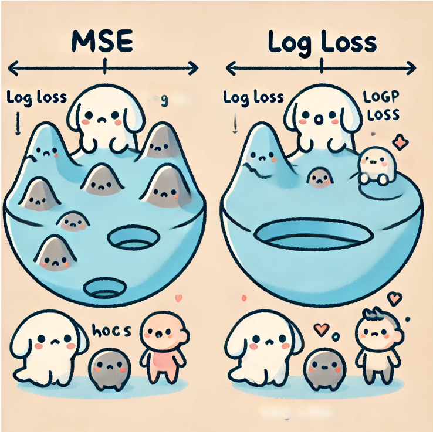

# Why Do We Use Another Cost Function Instead of MSE in Logistic Regression?

To begin with, it's important to note that we use different cost function for Linear Regression and Logistic Regression.

When you learn about Logistic Regression, you might wonder, "Why do we use a different cost function instead of the one (MSE) we used for Linear Regression?" Before we dive into that, it's important to understand that Logistic Regression outputs values between 0 and 1, which can be interpreted as probabilities rather than continuous numeric predictions. 

This difference brings challenges if we try to use MSE (Mean Squared Error) as the cost function, leading to inefficiencies and poor performance. 

In this section, I'll explain why another cost function is a better choice, focusing on the questions you might have.

## Loss Function vs. Cost Function

### Loss Function

1. **Definition**: The loss function quantifies the error for **a single training example**. It measures how well the model’s prediction matches the actual target value for that specific example.

2. **Purpose**: To evaluate the discrepancy between the predicted value and the true value for one data point.

### Cost Function

1. **Definition**: The cost function aggregates the loss over all training examples. It often computes the average of the individual losses.

2. **Purpose**: To evaluate the model's overall performance on the entire training dataset. It provides a single scalar value representing the total error of the model.

### The Cost Function as an Evaluation Metric for the Entire Model

- Global Performance Measure: The cost function evaluates how well the model performs across all training data, not just individual instances.  

- Optimization Objective: During training, we adjust the model parameters to minimize the cost function. This process is known as minimizing the cost function, and it aims to improve the model's predictions on the entire dataset.

- Indicator of Model Accuracy: A lower cost function value indicates that, on average, the model's predictions are closer to the true values, reflecting better overall model performance.

### Why Minimize the Cost Function? 

By minimizing the cost function, we aim to find the model parameters that result in the lowest possible **total error** on the training data.

Role in Training: The cost function is integral to training algorithms like gradient descent, which update the model parameters in the direction that reduces the cost.

OK. Now let's get back to the topic.

## Differences Between Linear Regression and Logistic Regression

First, let's talk about how Linear Regression and Logistic Regression are different. Linear Regression is used when we want to predict continuous numeric values.

Think about predicting the price of a house based on its size. Here, we use a cost function called MSE, which measures how far off our predictions are from the actual values by taking the squared difference and averaging it. The goal is to make this value as small as possible, meaning our model is doing a great job.

On the other hand, Logistic Regression is used for binary classification problems, which means we want to predict one of two possible outcomes—like whether a patient has cancer or does not have cancer. Instead of predicting a continuous value, Logistic Regression predicts a value between 0 and 1, which can be interpreted as a probability. This value tells us how likely it is that the answer is true (like the patient having cancer).

## Why Not Use MSE in Logistic Regression?

At first glance, it might seem logical to use MSE for Logistic Regression too. But it turns out that this creates a big problem. Let me explain why.

Imagine you're hiking in the mountains, and your goal is to reach the lowest point in a valley. If the valley is shaped like a smooth bowl, it's easy to walk down and reach the bottom—this is like how MSE works in Linear Regression: it's a convex function, which means it's shaped like a bowl. No matter where you start, if you keep walking downhill (which is like using gradient descent), you will eventually reach the bottom, or the global minimum.

But when we use MSE with Logistic Regression, the landscape changes. The cost function graph now looks more like a series of hills and valleys, rather than a smooth bowl. This is because the sigmoid function (which Logistic Regression uses to calculate the value which can be interpreted as probabilities) is a non-linear function. 

When combined with MSE, it makes the cost function non-convex—full of local minima. This means that, instead of smoothly walking down to the lowest point, you could easily get stuck in one of the smaller valleys along the way, never reaching the true lowest point. This is why using MSE in Logistic Regression makes it hard for the algorithm to find the best solution; it keeps getting stuck in the wrong places.

## A Better Loss Function for Logistic Regression

To solve this problem, we use another form of loss function called **Cross-Entropy Loss**. This function is specially designed to work well with the sigmoid function and helps the model learn in a more effective way. Let's see how it works.

### Understanding Loss function with Graphs

In Logistic Regression, we want our model to predict the value which can be interpreted as probabilities that are as close as possible to the actual outcomes. To do this, particular loss function assigns a penalty depending on how far off the prediction is from the true value.

When the actual value $y$ is 1 (let's say the patient has cancer), the loss function is $-\log(f(x))$, where $f(x)$ is the predicted probability. If the model predicts $f(x) = 1$ (which means it’s almost certain the patient has cancer), then $-\log(1)$ equals $0$. This means the loss is $0$, which is exactly what we want—no penalty for a correct prediction.

However, if $f(x)$ is $0.1$ (the model predicts only a $10\%$ chance of cancer), then $-\log(0.1)$ results in a high loss value, meaning the model gets a strong penalty for being so wrong. The further the prediction is from the true value, the larger the penalty.

Similarly, when $y = 0$ (the patient does not have cancer), we use $-log(1 - f(x))$. If $f(x)$ is close to 0, the loss is small, indicating a good prediction. But if $f(x)$ is close to 1, the penalty becomes very large, discouraging the model from making such incorrect predictions.

### Advantage of Using This Loss Function

Using this function makes the cost function convex again—meaning it’s shaped like a smooth bowl. This way, when we use gradient descent, we can reliably find the global minimum, ensuring our model finds the best possible parameters for accurate predictions.

Think of this loss function like a very strict teacher. If the model is even a little bit wrong, it gets a big penalty, pushing it to improve. This is different from MSE, which can sometimes be more forgiving in the context of classification, leading the model to get confused and stuck in the wrong places.

## Summary: Why particular Loss Function Works for Logistic Regression

To summarize, the reason we use particular loss function comes down to how this loss function interacts with the sigmoid function:

- Squared Error loss function combined with the sigmoid function leads to a cost function with multiple peaks and valleys (local minima), making it difficult for the model to find the best solution.
- On the other hand, particular loss function creates a smooth, bowl-shaped cost function, making it easier for the model to learn and converge to the best possible parameters.
- particular loss function uses the properties of $-log(f(x))$ and $-log(1 - f(x))$ to ensure that the model gets rewarded for correct predictions and heavily penalized for incorrect ones. This helps the model become more accurate and reliable, especially in classification tasks.

## Mathematical Explanation of Log Loss

To further understand why particular loss function is a better choice, let’s dive into the math behind it and visualize it with relevant graphs. First, recall that Logistic Regression uses the **sigmoid function** to map predictions to probabilities:

$$
f_{\vec W, b}(\vec X) = \frac{1}{1 + e^{-(\vec W \cdot \vec X + b)}}
$$

The sigmoid function takes in the weighted sum of input features and outputs a value that can be interpreted as a probability. Now, to evaluate how well the predicted probability $f_{\vec W, b}(\vec X)$ aligns with the actual binary label $y$, in one training example, we use particular loss function which is defined as:

$$
\text{Loss}(f_{\vec W, b}(\vec X ^ {(i)}), y^{(i)}) = - \left[ y^{(i)} \log(f_{\vec W, b}(\vec X^{(i)})) + (1 - y^{(i)}) \log(1 - f_{\vec W, b}(\vec X^{(i)})) \right]
$$

This function penalizes incorrect predictions, and its shape ensures convexity, which is important for gradient-based optimization algorithms like **Gradient Descent** to work effectively.

### Case 1: When $y = 1$

If the true label is 1, we want the predicted probability $f(\vec X)$ to be as close to 1 as possible. In this case, the Log Loss function simplifies to:

$$
\text{Loss} = - \log(f(\vec X))
$$

- If $f(\vec X) = 1$, the model predicts correctly, and $- \log(1) = 0$. This is what we want—no penalty for a correct prediction.
- If $f(\vec X) = 0.1$, the model predicts that the probability of the positive class is 10%, but the true label is 1. In this case, the loss is:

$$
\log(0.1) \approx 2.3
$$

This is a large penalty, indicating that the prediction is very wrong.

### Case 2: When $y = 0$

When the true label is 0, the Log Loss function becomes:

$$
\text{Loss} = - \log(1 - f(\vec X))
$$

- If $f(\vec X) = 0$, the model predicts correctly, and $- \log(1 - 0) = 0$.
- If $f(\vec X) = 0.9$, the model predicts a high probability for the positive class (90%), but the true label is 0. In this case, the loss becomes:

$$
\log(1 - 0.9) = - \log(0.1) \approx -2.3
$$

Again, this is a large penalty for making an incorrect prediction.

## Convexity of Cost Function

One of the key reasons why the particular loss function is preferred in Logistic Regression is that its cost function is **convex**. A convex function has a single global minimum, meaning gradient descent can reliably converge to the best solution. This is not the case when using MSE cost function with the sigmoid function, which results in a non-convex cost function with multiple local minima, making optimization difficult.

Graphically, the cost function with the particular loss function looks like a smooth bowl. No matter where the optimization algorithm starts, it will move towards the global minimum, ensuring the model finds the best possible parameters. 

In contrast, MSE with Logistic Regression would result in a jagged surface with many peaks and valleys, causing the algorithm to get stuck in suboptimal solutions.

# Simplifying the Loss and Cost Function for Logistic Regression

Now that we understand why the particular loss function is a better choice than Squared Error for logistic regression, let's take a closer look at how we can write the loss and cost functions.

## Revisiting the Loss Function

The loss function for logistic regression is designed to handle two possible outcomes: $y = 1$ and $y = 0$. The formula is:

$$
\text{Loss}(f_{\vec W, b}(\vec X ^ {(i)}), y^{(i)}) = - \left[ y^{(i)} \log(f_{\vec W, b}(\vec X^{(i)})) + (1 - y^{(i)}) \log(1 - f_{\vec W, b}(\vec X^{(i)})) \right]
$$

- If $y = 1$: The loss is $-\log(f(\vec X))$, where $f(\vec X)$ is the predicted probability that $y = 1$.
- If $y = 0$: The loss is $-\log(1 - f(\vec X))$, where $1 - f(\vec X)$ is the predicted probability that $y = 0$.

## The Cost Function: Averaging the Losses

Once we have the loss function for a single data point, we need to extend this to the entire dataset. The **cost function** (also called the **objective function**) is simply the average of the loss over all the training examples. If we have $m$ examples, the cost function $J(\theta)$ is written as:

$$
J(\theta) = \frac{1}{m} \sum_{i=1}^{m} \text{Loss}(f(\vec X^{(i)}), y^{(i)})
$$

In the case of logistic regression, this becomes:

$$
J(\theta) = -\frac{1}{m} \sum_{i=1}^{m} \left[ y^{(i)} \log(f(\vec X^{(i)})) + (1 - y^{(i)}) \log(1 - f(\vec X^{(i)})) \right]
$$

This equation may look a little intimidating at first, but it’s just the average of the individual losses for all the training examples. What’s important to note here is that this cost function is **convex**, meaning it has a single global minimum. This is a very desirable property because it ensures that when we apply **gradient descent** to minimize the cost function, we will converge to the best possible solution without getting stuck in local minima.

### Here's why we divide by $m$ in the cost function:

1. Average Loss Calculation: Dividing by $m$ allows us to compute the average loss per data point. This makes it possible to compare the model's performance regardless of the dataset size. In other words, whether the dataset is large or small, the value of the cost function remains consistent.

2. Scaling: By using the average instead of the total loss, we can more fairly evaluate the model's performance across datasets of different sizes. This is particularly useful when comparing multiple models or datasets.

3. Stability in Gradient Descent: Using the average helps optimization algorithms like gradient descent operate more stably. This is especially important when setting the learning rate. If the loss magnitude varies with dataset size, it might require adjusting the learning rate, but using the average loss helps mitigate this issue.

In summary, dividing by $m$ to calculate the average loss ensures consistent evaluation of model performance and enhances stability during the optimization process.

## For Deeper Understanding: Maximum Likelihood Estimation (MLE)

While understanding the loss and cost functions is crucial for implementing logistic regression, it's worth diving into the statistical foundation behind these functions for a deeper understanding. The concept of **Maximum Likelihood Estimation (MLE)** underpins why we use the particular loss and cost functions in logistic regression.

### What is MLE?

Maximum Likelihood Estimation is a statistical method used to estimate the parameters of a model by finding the values that make the observed data most probable. 

In the context of logistic regression, MLE helps us determine the optimal parameters (denoted by $\theta$) that best explain the relationship between the input data $\vec X$ and the binary output $y$.

The key idea behind MLE is to maximize the **likelihood function**, which represents the probability of the observed data given the model parameters. However, instead of directly maximizing the likelihood (which can involve complex multiplication), it's often easier to maximize the **logarithm of the likelihood function**, also known as the **log likelihood**. This is because taking the log turns the products in the likelihood function into **sums**, simplifying calculations.

### How MLE Leads to the Loss Function

The log likelihood for logistic regression can be expressed as follows:

$$
\log L(\theta) = \sum_{i=1}^{m} \left[ y^{(i)} \log(f(\vec X^{(i)})) + (1 - y^{(i)}) \log(1 - f(\vec X^{(i)})) \right]
$$

This formula shows how likely the model is to predict the correct class for each training example. The goal of logistic regression is to find the parameters $\theta$ that maximize this log likelihood function.

However, in optimization problems, it's often more convenient to **minimize** a function rather than maximize it. Therefore, we take the negative of the log likelihood, which becomes the **loss function** used in logistic regression:

$$
\text{Loss}(f(\vec X^{(i)}), y^{(i)}) = - \left[ y^{(i)} \log(f(\vec X^{(i)})) + (1 - y^{(i)}) \log(1 - f(\vec X^{(i)})) \right]
$$

By minimizing this loss function, we are effectively maximizing the likelihood of the observed data, which is the core idea of MLE.

### Why MLE Matters for Logistic Regression

Maximum Likelihood Estimation gives us a powerful theoretical framework for choosing the right loss function. It ensures that the parameters learned by the model are statistically sound and lead to the best possible predictions based on the data. 

Furthermore, because the cost function derived from MLE is convex, we can confidently use gradient descent to find the global minimum, avoiding local minima traps.

Understanding MLE is not strictly necessary to apply logistic regression in practice, but it provides valuable insight into **why** we use the log loss and what makes it an optimal choice for binary classification problems. If you're interested in delving deeper into the statistical foundations of machine learning, MLE is a key concept to explore.

## Moving Towards Gradient Descent

Now that we've simplified the cost function for logistic regression, we’re ready to apply **gradient descent** to optimize the model's parameters. Gradient descent works by iteratively adjusting the parameters in the direction that reduces the cost function, ultimately finding the values of the parameters that minimize the overall cost. In the next section, we'll dive deeper into how gradient descent works in logistic regression and how we calculate the gradients using the simplified cost function.