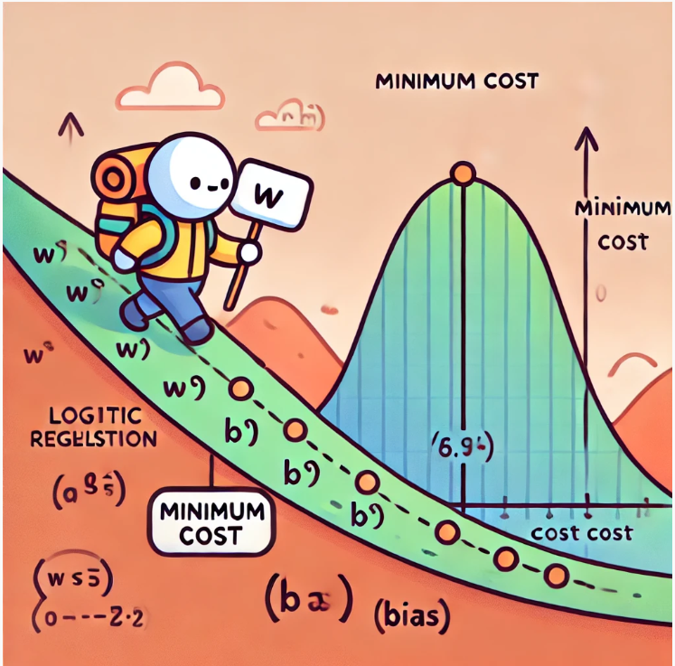

# Gradient Descent for Logistic Regression



Let's recap what we've learned about gradient descent. Imagine you’re hiking down a mountain, but you can't see the bottom because of fog. The only way to reach the lowest point is to feel your way down the slope step by step. You check how steep the ground is under your feet and take a step in the direction that goes down. Each step brings you closer to the valley, but you have to be careful not to rush because too big a step could cause you to miss the valley altogether. This is the basic idea behind **gradient descent**.

## ***What is Gradient Descent(for logistic regression)?***

The "mountain" here is a mathematical function called the **cost function**. The goal of gradient descent is to minimize the cost function, which measures how far off our predictions are from the actual outcomes. By finding the lowest point (the minimum of the cost function), we can make our predictions as accurate as possible.

For logistic regression, the cost function helps measure how good our model is at predicting probabilities (from 0 to 1) for binary classification problems. For example, predicting whether a tumor is benign or malignant, or whether an email is spam or not.

## ***Parameters: $w$ and $b$***

In logistic regression, we have two main parameters that we adjust to minimize the cost function:

- **$w$**: This is a vector, like a collection of dials, one for each feature (input) in our dataset. Adjusting these dials changes how much weight we give to each feature when making predictions. So, we can also represent $w$ as a vector, $\vec W$.
- **$b$**: This is a scalar, like a single dial that adjusts the overall bias or "baseline" of our predictions.

## ***How Gradient Descent Works(in logistic regression)***

Just like the hiker checks the slope to decide which direction to step in, gradient descent uses calculus to calculate the "slope" of the cost function at a certain point. If the slope is positive, we know we need to decrease our parameters; if it's negative, we need to increase them. The gradient tells us how to adjust both $w$ and $b$ to move closer to the minimum cost.

The update rule for gradient descent looks like this:

$$
w_j := w_j - \alpha \cdot \frac{\partial J(\vec W, b)}{\partial w_j}
$$

$$
b := b - \alpha \cdot \frac{\partial J(\vec W, b)}{\partial b}
$$

Here’s what’s happening in simpler terms:
- $w_j$ and $b$ are the parameters we’re trying to optimize.
- $\alpha$ is the learning rate, or how big a step we take at each iteration. Too big, and we might overshoot the minimum; too small, and we might take too long to get there.
- $\frac{\partial J(\vec W,b)}{\partial w_j}$ and $\frac{\partial J(\vec W,b)}{\partial b}$ are the slopes (gradients) for $w_j$ and $b$, telling us how much to change each parameter.

## ***The Difference Between $w$ and $b$***

You might wonder, "Why are we treating $w$ and $b$ differently?" Great question! The difference lies in how each affects the prediction:

- **$w_j$**: This controls how much influence each individual feature (e.g., a person’s age or tumor size) has on the prediction. When we calculate the gradient for $w_j$, we multiply by the feature value $x_j$, because we want to know how much that specific feature is affecting the prediction error.
- **$b$**: The bias term doesn’t depend on any specific feature. It’s like a general adjustment we make across all predictions, so its gradient doesn’t get multiplied by any feature value.

In simpler terms, you can think of $w_j$ as adjusting each ingredient in a recipe (e.g., more sugar, less salt), while $b$ is like adjusting the overall temperature of the oven.

## ***What Are We Minimizing?***

For logistic regression, we are minimizing the difference between the predicted probabilities (which range from 0 to 1) and the actual values (which are either 0 or 1). This difference is captured by the **logistic loss function**, also known as **cross-entropy loss**. When the prediction is very close to the actual value (for example, a prediction of 0.95 for an actual value of 1), the cost is small. When the prediction is far off (for example, predicting 0.3 when the actual value is 1), the cost is much higher.

In summary, the cost function we’re minimizing is the average of all these individual costs over the dataset.

## ***How Does It Compare to Linear Regression?***

The gradient descent process is very similar in linear regression, but there’s a key difference in what we’re predicting. In linear regression, we’re predicting a continuous value (e.g., the price of a house), and the prediction error is just the difference between the predicted and actual values. In contrast, in logistic regression, we’re predicting probabilities between 0 and 1, and the error is the difference between the predicted probability and the actual binary outcome (0 or 1).

Although the equations for the gradients look similar in both cases, the predicted values are very different. In linear regression, predictions are just numbers. In logistic regression, predictions are probabilities, and they come from the sigmoid function, which "squashes" any input to a value between 0 and 1. This difference affects how the cost function behaves, and ultimately how we calculate the gradients.

## ***Mathematical Version***

In logistic regression, we aim to find the optimal parameters $w$ (weights) and $b$ (bias) that minimize the cost function, which measures how well the model is predicting the probabilities for binary classification.

### ***Logistic Regression Hypothesis***

The hypothesis (or prediction) function in logistic regression uses the sigmoid function to convert the linear combination of features into a probability:

```math
f_{\vec W, b}(\vec X) = \sigma(\vec W \cdot \vec X + b)
```

Where:

- $\sigma(z) = \frac{1}{1 + e^{-z}}$ is the sigmoid function.
- $\vec W$ is the weight vector.
- $\vec X$ is the feature vector.
- $b$ is the bias (a scalar).
- $P(y=1|\vec X; \vec W, b)$ is the probability that the output is 1.

### ***Cost Function for Logistic Regression***

The cost function for logistic regression is based on **logistic loss** (or cross-entropy loss). This measures how well the predicted probabilities $f_{\vec W, b}(\vec X)$ match the actual labels $y$. For an entire dataset with $m$ training examples, the total cost function is the average of the individual costs:

```math
J(\vec W, b) = -\frac{1}{m} \sum_{i=1}^{m} \left[ y^{(i)} \log(f_{\vec W, b}(\vec X^{(i)})) + (1 - y^{(i)}) \log(1 - f_{\vec W, b}(\vec X^{(i)})) \right]
```

This function is derived from Maximum Likelihood Estimation.  By maximizing the likelihood of the observed data under the logistic model, we arrive at this specific form of the cost function, which penalizes the discrepancy between the predicted probabilities and the actual labels.

Where:

- $y^{(i)}$ is the actual label for the $i$-th training example.
- $f_{\vec W, b}(x^{(i)})$ is the predicted probability for the $i$-th example.

### ***Gradient Descent Algorithm***

The goal of gradient descent is to minimize the cost function $J(\vec W, b)$ by adjusting $\vec W$ and $b$. We do this by calculating the gradient of $J(\vec W, b)$ with respect to each parameter, and then updating the parameters step-by-step.

The general update rule for gradient descent is:

```math
\theta := \theta - \alpha \frac{\partial J(\vec W, b)}{\partial \theta}
```

Where:

- $\theta$ represents the parameters we’re optimizing (in our case, $w_j$ and $b$).
- $\alpha$ is the learning rate, controlling the size of the steps we take.
- $\frac{\partial J(\vec W, b)}{\partial \theta}$ is the gradient of the cost function with respect to the parameters.

### ***Gradients for $w_j$ and $b$***

For logistic regression, the gradients with respect to the parameters $w_j$ and $b$ are calculated as follows:

- **Gradient with respect to $w_j$**:

```math
\frac{\partial J(\vec W, b)}{\partial w_j} = \frac{1}{m} \sum_{i=1}^{m} \left( f_{\vec W, b}(\vec X^{(i)}) - y^{(i)} \right) x_j^{(i)}
```

- **Gradient with respect to $b$**:

```math
\frac{\partial J(\vec W, b)}{\partial b} = \frac{1}{m} \sum_{i=1}^{m} \left( f_{\vec W, b}(\vec X^{(i)}) - y^{(i)} \right)
```

Here:

- $f_{\vec W, b}(x^{(i)}) = \sigma(\vec W \cdot \vec X^{(i)} + b)$ is the predicted probability for the $i$-th training example.
- $y^{(i)}$ is the true label for the $i$-th example (0 or 1).
- $x_j^{(i)}$ is the $j$-th feature of the $i$-th training example.

### ***Parameter Updates***

Using the gradients we computed, we update the parameters $w_j$ and $b$ according to the gradient descent rule:

```math
w_j := w_j - \alpha \cdot \frac{1}{m} \sum_{i=1}^{m} \left( f_{\vec W, b}(\vec X^{(i)}) - y^{(i)} \right) x_j^{(i)}
```

```math
b := b - \alpha \cdot \frac{1}{m} \sum_{i=1}^{m} \left( f_{\vec W, b}(\vec X^{(i)}) - y^{(i)} \right)
```

Where:

- $\alpha$ is the learning rate.
- $m$ is the number of training examples.

And you should update parameters simultaneously. 

#### ***Calculating All Gradients First***

When we say "simultaneous updates," it doesn't literally mean that all parameters change at the exact same instant in time (like magic). What actually happens is that we **calculate the gradients for all the parameters** first.

For example, if we have parameters $w_1, w_2, \dots, w_n $ (for weights) and $b $ (for bias), we calculate their gradients independently:

- Gradient for each $w_j $:
```math
  \frac{\partial J}{\partial w_j} = \frac{1}{m} \sum_{i=1}^{m} \left( f_{\vec W, b}(\vec X^{(i)}) - y^{(i)} \right) x_j^{(i)}
```
  
- Gradient for $b $:
```math
  \frac{\partial J}{\partial b} = \frac{1}{m} \sum_{i=1}^{m} \left( f_{\vec W, b}(\vec X^{(i)}) - y^{(i)} \right)
```

At this stage, we haven't updated any parameters yet. We've just calculated the gradients — like figuring out how much each parameter needs to change.

#### ***Simultaneous Parameter Updates***

Once all the gradients are calculated, we then **update all the parameters at the same time**. That means each parameter is updated using the gradients calculated from the **previous step**, not the newly updated values of other parameters.

Here’s how we update them:

- For weights $w_j $:

```math
w_j := w_j - \alpha \cdot \frac{\partial J}{\partial w_j}
```
  
- For the bias $b$:

```math
b := b - \alpha \cdot \frac{\partial J}{\partial b}
```

In other words, **all parameters are updated together** using the gradients we just calculated. None of the parameters use the "new" values from the other parameters during this step. This is what we mean by "simultaneous updates."

#### ***Why Is This Important?***

If we didn’t update all the parameters at the same time, and instead updated them one by one, it would mess up the optimization process. Here’s why:

- The cost function $J(w, b) $ depends on **all the parameters**. So, if you update $w_1 $ first, the cost function changes. When you then update $w_2 $, the cost function is no longer the same as when you calculated the gradient for $w_2 $.
- This means the updates wouldn't be correct, and the optimization could be slow, inaccurate, or even fail to find the best solution.

By calculating all the gradients first and then updating all the parameters **at once**, we ensure that we are making consistent updates across the entire set of parameters. This helps the optimization process work more efficiently.

#### ***Using Vectorization for Efficiency***

In practical terms, when coding, we often use a technique called **vectorization** to make this process faster and more efficient. Instead of updating each parameter separately, we treat all the parameters $w $ as one vector (a collection of values), and update them in one go.

For example, instead of looping through each parameter $w_j $, we can update all of them like this:

```math
w_j := w_j - \alpha \cdot \frac{1}{m} \vec X^T (f_{\vec W, b}(\vec X) - y)
```

This equation performs the update for all parameters at once using matrix operations, which is much faster and more efficient in programming. Libraries make this easy by handling the math behind the scenes.

### ***Comparison with Linear Regression***

The structure of the gradient descent update for logistic regression looks similar to that of linear regression, but the key difference lies in the prediction function:

- **Linear regression**: The prediction is a continuous value, $f_{\vec W, b}(x) = \vec W \cdot \vec X + b$.
- **Logistic regression**: The prediction is a probability, $f_{\vec W, b}(x) = \sigma(\vec W \cdot \vec X + b)$, where $\sigma$ is the sigmoid function.

While the gradients for both logistic and linear regression involve calculating the difference between predicted and actual values, in logistic regression, the predicted values are probabilities (from 0 to 1), not raw numbers.

## ***Conclusion***

Gradient descent is a powerful technique for minimizing the cost function in logistic regression. By iteratively adjusting the parameters $w_j$ and $b$ based on the gradients of the cost function, we can find the optimal values that best fit our training data and make accurate predictions on new, unseen data. This process allows us to build a logistic regression model that performs well on binary classification tasks.
