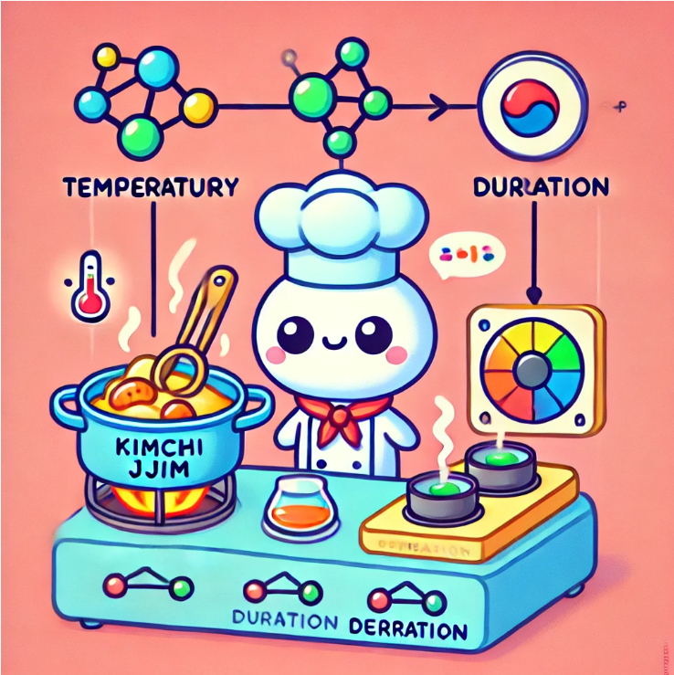

# Neural Networks and TensorFlow



## ***Introduction to TensorFlow***

TensorFlow is one of the leading frameworks for implementing deep learning algorithms. It's an open-source library initially developed by Google, designed to handle large-scale machine learning tasks efficiently. 

Another popular alternative is PyTorch, which is favored for its ease of use and dynamic computation graph. However, for this book, we will focus on TensorFlow.

> PyTorch, developed by Meta, is nowadays more popular than TensorFlow, I think.

In this section, let's take a look at how to implement inference code using TensorFlow. Inference refers to the process of making predictions using a trained neural network model.

One of the remarkable features of neural networks is their versatility: the same fundamental algorithm can be applied to numerous distinct applications. To illustrate the concept of inference, I'm going to use a simplified example from a personal hobby of mine - cooking **kimchi jjim**.

Sometimes, I like to make kimchi jjim at home. 

> Actually, I don't make kimchi jjim at home. I just use it as an example😂

This led me to wonder — "can machine learning help optimize the cooking process to improve the flavor of kimchi jjim?" When you're cooking kimchi jjim, two primary parameters determine the outcome: the **temperature** at which you braise the kimchi and the **duration** for which it is cooked. In this simplified example, we have gathered datasets with various cooking temperatures and durations, labeled with whether the resulting kimchi jjim was delicious or not.

Imagine plotting these data points: if the kimchi jjim was good, we mark it with a positive cross (y = 1), and if it was bad, we mark it with a negative cross (y = 0). It seems that only within a certain range of temperatures and cooking times do we get good kimchi jjim—a delicate balance between undercooking and overcooking. Neural networks can help us find the sweet spot.

Given a feature vector `x` that contains the temperature and duration, say **180 degrees Celsius** for **90 minutes**, how do we use our neural network to predict whether this combination will yield good kimchi jjim?

### ***Setting Up a Neural Network in TensorFlow***

In TensorFlow, we represent our input features as an array. For instance, `x` could be represented as `[180, 90]`. Let's break down how to construct a neural network to process this input.

1. **Input Layer**: We start by defining the input, `x`, which is an array of two values—the temperature and the duration.

2. **Hidden Layer 1**: We'll create our first hidden layer, which in TensorFlow is known as a `Dense` layer. This layer will have three units (neurons) and will use the sigmoid activation function.

    ```python
    import tensorflow as tf
    Layer1 = tf.keras.layers.Dense(units=3, activation='sigmoid')
    a1 = Layer1(x)
    ```

    What we're doing here is passing the input `x` through the first layer to calculate the activations $\vec a^{[1]}$, which might be a list of values like `[0.2, 0.7, 0.3]`. These activations represent how much each neuron in the first layer "fired" in response to the input.

3. **Hidden Layer 2**: Next, we add another hidden layer, which has just one unit. Again, we'll use the sigmoid activation function.

    ```python
    Layer2 = tf.keras.layers.Dense(units=1, activation='sigmoid')
    a2 = Layer2(a1)
    ```

    Here, `a2` represents the output from the second layer after applying it to the activations of the previous layer(=$\vec a^{[2]}$). For example, `a2` might be `0.8`.

4. **Output**: Finally, if we wish to make a decision about the output—whether the kimchi jjim is good or not—we can apply a threshold to `a2`. If `a2` is greater than 0.5, we classify it as `y_hat = 1` (good kimchi jjim), otherwise as `y_hat = 0` (bad kimchi jjim).

    ```python
    y_hat = 1 if a2 >= 0.5 else 0
    ```

This simple model uses two dense layers to map our input features to a prediction about kimchi jjim quality. Although it’s a simplified example, machine learning has indeed been used to optimize various cooking processes in professional kitchens.

### ***Understanding Data in TensorFlow and NumPy***

One aspect that's important when working with TensorFlow is understanding how data is represented. This is where TensorFlow's concept of **tensors** comes in. You might think of a tensor as a generalization of matrices to higher dimensions.

To help you visualize, let's think about **matrices** for a moment. A matrix is simply a 2D array of numbers. For example, you might have a matrix with **2 rows and 3 columns**:

```python
x = np.array([[1, 2, 3], 
              [4, 5, 6]])
```

Here, `x` is a **2 x 3** matrix. The dimension of a matrix is always given by its rows followed by its columns. Now, TensorFlow uses **tensors** to handle similar data structures but can work with higher dimensions.

In our kimchi jjim example, our input `x` can be represented as a **1 x 2** matrix (one row, two columns). Using NumPy, this would look like:

```python
x = np.array([[180, 90]])
```

The double square brackets denote a matrix, whereas a single set of brackets would denote a **1D array** or vector. TensorFlow prefers data to be represented as matrices because it is optimized for batch operations, which are essential for efficiently handling large datasets.

### ***Converting Between NumPy and TensorFlow***

Sometimes, you may need to convert between **NumPy arrays** and **TensorFlow tensors**. Here’s an example of how to convert a NumPy array to a TensorFlow tensor:

```python
tensor = tf.convert_to_tensor(x)
```

And if you need to convert a TensorFlow tensor back to a NumPy array, you can use:

```python
array = tensor.numpy()
```

These conversions are often necessary because TensorFlow and NumPy have different internal data structures, a legacy of how they were independently developed. It’s a small inconvenience, but understanding it will make your coding experience much smoother.

### ***Putting It All Together***

Let’s summarize how we can use these concepts to build a neural network using TensorFlow’s **Sequential API**. Previously, we manually created layers and passed data through them. However, TensorFlow provides a more streamlined way to build models:

```python
model = tf.keras.Sequential([
    tf.keras.layers.Dense(units=3, activation='sigmoid'),
    tf.keras.layers.Dense(units=1, activation='sigmoid')
])
```

This is equivalent to creating each layer individually and stringing them together. With `model.compile()` and `model.fit()`, TensorFlow takes care of training the network for you.

```python
# Compile the model
model.compile(optimizer='adam', loss='binary_crossentropy', metrics=['accuracy'])

# Train the model on your data (replace X_train and y_train with your datasets)
model.fit(X_train, y_train, epochs=10)

# Make a prediction on new input data
y_pred = model.predict(new_input)
```

This way, TensorFlow handles forward propagation and makes predictions, all with minimal code.

### ***A Look Under the Hood***

While it's great to build powerful models with just a few lines of code, it's also crucial to understand what’s happening beneath the surface. In the following sections, we'll take a deeper dive into the mechanics of **forward propagation** and implement it from scratch in Python. This will give you a more comprehensive understanding of how neural networks process data and how each parameter influences the final outcome. Knowing the details allows you to troubleshoot more effectively and optimize your models to their fullest potential.

## ***Implementing Forward Propagation from Scratch in Python***

If you ever wondered how to implement forward propagation yourself from scratch in Python, you're in the right place. 

Not only will this give you a better understanding of what goes on under the hood of libraries like TensorFlow and PyTorch, but it might also inspire you to think beyond them. 

Now, let me guide you through the process of implementing forward propagation, step by step, and demystify the operations that modern frameworks automate. I’ll go through a fair bit of code here, but don’t worry about memorizing every line. For now, just focus on understanding what each part does. 

Forward propagation is the mechanism by which we take an input feature vector `x` (say, `[180, 90]` for temperature and cooking duration of kimchi jjim) and use our trained neural network to calculate the output prediction. The idea here is to get to the result step-by-step, calculating each layer's activation value, using what is called a feed-forward process. So, let’s dive in.

### ***Manual Forward Propagation with Python***

In our example, we start by representing `x` as a simple 1D array. This is equivalent to the feature vector we're passing to our model:

```python
x = [180, 90]  # Temperature and duration
```

The first step in our neural network is to compute the activations for the first hidden layer. Let’s say we have three neurons in the first hidden layer, and we’re using the sigmoid activation function, `g(z)`. To compute the first neuron’s activation, `a1_1`, we calculate the linear combination of the input values with their corresponding weights and bias:

```python
w1_1 = [1, 2]  # Weights for the first neuron
b1_1 = -1  # Bias for the first neuron
z1_1 = w1_1[0] * x[0] + w1_1[1] * x[1] + b1_1
# Apply sigmoid activation
a1_1 = 1 / (1 + np.exp(-z1_1))
```

This process continues for the remaining neurons in the first layer. Each neuron computes its `z` value (a linear combination of weights, inputs, and bias), then passes it through the activation function to get the final activation `a`. So, for all three neurons in the first hidden layer, we calculate:

```python
w1_2 = [-3, 4]  # Weights for the second neuron
b1_2 = 1  # Bias for the second neuron
z1_2 = w1_2[0] * x[0] + w1_2[1] * x[1] + b1_2
a1_2 = 1 / (1 + np.exp(-z1_2))

w1_3 = [0.5, -1.5]  # Weights for the third neuron
b1_3 = 0  # Bias for the third neuron
z1_3 = w1_3[0] * x[0] + w1_3[1] * x[1] + b1_3
a1_3 = 1 / (1 + np.exp(-z1_3))
```

After computing the activations for all three neurons, we group them together into an array to represent the output of the first layer:

```python
a1 = np.array([a1_1, a1_2, a1_3])
```

Now that we have the activations from the first hidden layer, we can move on to the next layer. We repeat a similar process, but instead of using `x` as our input, we use `a1`, the output from the first hidden layer. This flow continues until we compute the output of the final layer, `a2`, and ultimately our prediction `y_hat`.

### ***Generalizing Forward Propagation***

The manual approach we just walked through works, but it can become cumbersome if you have a large network with many neurons and layers. That’s why we typically use generalized functions to streamline the process.

Here’s where we introduce a more scalable way—a function called `dense()`. This function takes in the activation from the previous layer and the parameters (weights and biases) for the current layer, and outputs the activations for that layer. Here’s how the function is defined:

```python
def dense(a_prev, W, b):
    units = W.shape[1]  # Number of units (neurons) in this layer
    a = np.zeros(units)  # Initialize the activations for this layer
    
    for j in range(units):
        w = W[:, j]  # Extract the weights for the j-th neuron
        z = np.dot(w, a_prev) + b[j]  # Calculate z
        a[j] = 1 / (1 + np.exp(-z))  # Apply the sigmoid activation
    
    return a
```

In simpler terms:

The dense function takes in the output from the previous layer (a_prev), the weights (W), and the biases (b) for the current layer.

It then calculates the output of the current layer by looping through each neuron, calculating the weighted sum (z), and applying the sigmoid activation function to get the final output (a).

With the dense() function, we can now compute forward propagation in a more organized way, without hard coding each step. Let’s say we have input features x, weights for the first layer W1, and biases b1. We can compute the activations for the first layer as:

```python
a1 = dense(x, W1, b1)
```

And then we continue for the second layer, third layer, and so on, like this:

```python
a2 = dense(a1, W2, b2)
a3 = dense(a2, W3, b3)
```

Finally, the output `f(x)` is simply the activations of the last layer. This approach allows us to scale up to networks with many layers and many neurons per layer, making it suitable for more complex models.

### ***Understanding Forward Propagation: Why It Matters***

At this point, you might wonder, "Why go through all this trouble if libraries like TensorFlow and PyTorch can do it for me?" The answer lies in understanding what is really happening during the learning process. Machine learning often involves trial and error, and things don’t always work as planned—sometimes your network might not converge, or you might face strange bugs or poor performance. When those things happen, understanding the mechanics of forward propagation will give you the insight to debug effectively!

It's a bit like cooking—you could follow a recipe without really understanding why each ingredient is used or why certain techniques are applied. But if something goes wrong in the kitchen, or if you want to create your own recipe, understanding the science behind cooking becomes invaluable. Similarly, understanding forward propagation helps you get a true feel for how your neural networks behave, empowering you to create better models and solve issues faster.

Remember, being proficient in the tools is great, but understanding the core principles that these tools automate is what will set you apart as an exceptional machine learning practitioner.

## Vectorization: Scaling Up Neural Networks Efficiently

One of the key reasons that deep learning researchers have been able to scale up neural networks significantly in recent years is due to a technique called **vectorization**. Simply put, vectorization allows us to perform calculations involving large sets of numbers simultaneously, rather than looping through them one by one. This enables neural networks to be implemented in a highly efficient way, making use of **matrix multiplications** that can be executed extremely quickly by modern parallel computing hardware, like GPUs(Graphics Processing Units).

Let's break down how this works and why it's such a game-changer for deep learning.

### From Loops to Matrices: The Vectorized Approach

Imagine you are trying to perform forward propagation in a neural network. Traditionally, you might loop through each neuron, calculating the weighted sum of inputs and applying an activation function to determine the output. While this approach works, it quickly becomes cumbersome and slow as the size of your network grows.

Consider an input layer with multiple features that need to be processed through multiple neurons in a hidden layer. In a naive implementation, you might write a loop to calculate the sum of products for each neuron, one by one. This would look something like:

```python
# Naive implementation (non-vectorized)
for i in range(num_neurons):
    z[i] = np.dot(weights[i], inputs) + bias[i]
    a[i] = sigmoid(z[i])
```

Now, imagine doing this for millions of neurons, over multiple layers! The repetitive nature of this loop is very resource-intensive, and it's exactly where **vectorization** comes in to make the process efficient.

### The Power of Matrix Multiplications

In a vectorized implementation, instead of using loops, we leverage matrix operations. Matrices (essentially 2D arrays of numbers) allow us to perform these same calculations all at once. This means we can represent all the weights for a given layer as a matrix and all the inputs as a vector. By multiplying these two together, we achieve the same outcome as running through a loop, but in a fraction of the time.

Here's how we can write the same forward propagation in a **vectorized form**:

```python
# Vectorized implementation
Z = np.matmul(X, W) + b
A = sigmoid(Z)
```

- `X` is the input matrix.
- `W` is the weight matrix, with each column representing the weights for a different neuron.
- `b` is the bias, which is added element-wise.
- `Z` represents the weighted sum, and `A` is the result after applying the activation function (like a sigmoid).

With vectorization, you achieve the same result as before, but using far fewer lines of code and achieving a much faster execution speed.

### Why Vectorization Matters

Without these vectorization concepts, deep learning wouldn't be able to scale to the size we see today. Processing millions of neurons across hundreds of layers requires vast computational resources, and doing it with simple loops would make training deep learning models impractically slow. By converting operations into **matrix multiplications**, GPUs can utilize their highly optimized parallel computing capabilities, speeding up these calculations significantly.

To help visualize this, imagine you are a chef in a kitchen tasked with chopping a mountain of vegetables. If you chop them one by one, it could take all day. But if you have a food processor that can chop a whole batch at once, you can get through the task in minutes. Similarly, vectorization is like that food processor for our neural network calculations.

### The Role of GPUs and Parallel Computing

Modern GPUs are specifically designed to perform such matrix operations in parallel, meaning they can handle thousands of operations simultaneously. This is why GPUs are so critical in the field of deep learning. CPUs also have vectorized instructions that make them capable of handling large matrix operations, but GPUs take it to another level by providing many more cores, each capable of performing smaller tasks in parallel. 

### Putting It All Together

To summarize, **vectorization** enables deep learning frameworks like TensorFlow to efficiently handle the massive amount of computations required in training and using neural networks. By replacing repetitive loops with matrix operations, we drastically reduce the time complexity of these calculations, allowing us to tackle far larger problems than we could otherwise.

## Neural Network Training

In this section, we’re going to dive into how to **train** a neural network from scratch. Training a model with your own data can be incredibly rewarding, almost like teaching a new skill to a friend. And I promise, once you see the magic of your model learning from data, you’ll start to realize just how much power these algorithms have.

To help us understand training better, let’s continue using our running example: **handwritten digit recognition**. Specifically, we’re recognizing whether an image is a '0' or a '1' — a simpler, binary classification problem to help you get the hang of the basics. We’re going to use the same neural network architecture from last week: an input \(X\), two hidden layers (the first with 25 units, the second with 15 units), and finally, one output unit.

Think of this network like a group of people in a game of **telephone**, where each layer is a person passing a message to the next. The input layer is the first person getting the original message, and each hidden layer processes it before passing it on, hopefully preserving the meaning. The better trained our people (or units) are, the clearer and more accurate the final message (or prediction) becomes.

So how do we train this network? Let me explain step by step.

### Step 1: Specify the Model

The first step in training is specifying the model—or, in our analogy, defining our team of **telephone** players. Here, you’re telling TensorFlow how the messages (inputs) should flow through the network. You specify the number of units in each layer, the type of activation function (in our case, sigmoid), and how each layer should connect. In TensorFlow, this is done with code that "strings together" the layers, so they can work in sequence. You’re essentially creating the skeleton of the network—its bones and joints—but they don’t know how to work together yet.

```python
import tensorflow as tf
from tensorflow.keras.models import Sequential
from tensorflow.keras.layers import Dense

# Step 1: Specify the model
model = Sequential([
    Dense(25, activation='sigmoid'),  
    # First hidden layer with 25 units
    Dense(15, activation='sigmoid'),                     
    # Second hidden layer with 15 units
    Dense(1, activation='sigmoid')                       
    # Output layer with 1 unit
])
```

### Step 2: Compile the Model

Once our network skeleton is ready, it’s time to compile the model. This is where we tell TensorFlow **how** it should learn. To do that, we need **a loss function**—We have already learned about the loss function in the previous section, but if you don't remember, don't worry. 

Think of this as a way to measure how good or bad our model's predictions are. We’re using something called **binary cross-entropy** as the loss function here. Imagine our network making a prediction and someone in the background pointing out exactly how far off that prediction is, giving a number to quantify the error. This loss value will help guide our network toward making better predictions by making small changes to the model's parameters.

To compile the model, we also need to choose an optimizer, which is like picking the strategy for fixing errors. A common strategy is **gradient descent**(We've learned about this in the previous section, too😁). Picture our model standing on a hillside. Our goal is to reach the lowest point in the valley—that's where our model makes the least error. Gradient descent helps us figure out which direction to step in, slowly guiding us down the slope to the bottom.

It’s important to take small, careful steps (determined by the learning rate) because if we jump too far, we might overshoot or stumble around and never actually reach the bottom.

```python
# Step 2: Compile the model
model.compile(loss=BinaryCrossentropy())
```

> The name **BinaryCrossentropy()** comes from statistical mechanics, where it is used to measure the difference between two probability distributions. In our case, it measures the difference between the predicted probability distribution and the actual probability distribution.

If your model is a **regression(tasks that predict a number)**, you can use **MeanSquaredError()** as the loss function, code below:

```python
model.compile(loss=MeanSquaredError())
```

### Step 3: Train the Model(Gradient Descent)

Now comes the part where the real magic happens: training the model. In this step, we feed the training data (images of zeros and ones, plus their correct labels) into our network. We use the **fit** function, which tells TensorFlow, "Hey, take these data and start adjusting your weights and biases until you minimize the loss." It’s like telling our telephone players to keep practicing until they get the message right with minimal distortion.

We repeat this process over and over for multiple **epochs** (rounds of training). If an epoch is one full pass over the data, think of it as practicing the same song over and over until you can play it without any mistakes. Each time we go through the data, the model learns a bit more, just like you get better at a song each time you practice it.

```python
# Step 3: Train the model
model.fit(X, y, epochs=100)
```

### A Look Back at Logistic Regression

Before we dive into more detail on how these steps work, let’s recall how we trained a simpler model: **logistic regression**. In that case, you also specified an input-output mapping, a loss function, and then used gradient descent to optimize the model. 

Neural networks work similarly, but instead of just one layer mapping inputs to outputs, there are multiple layers, and each layer transforms the input a bit before passing it on.

To put it simply, training a neural network is like logistic regression but with **more layers of complexity**, which allows it to solve more complex problems. In logistic regression, you only had one equation to deal with, but with neural networks, it's like having multiple equations, each solving a piece of the overall puzzle.

### Why All This Matters

The real goal here isn’t just to learn how to call a few functions in TensorFlow and have a model that works. It’s about truly understanding **why** these steps matter. 

Imagine driving a car: you could learn to press the gas, brake, and turn the wheel, but if you don't understand how the engine works, you might be helpless if something breaks. 

Similarly, understanding how neural networks are trained, what the loss function does, or how gradient descent optimizes helps you troubleshoot and improve your models in the future.

Next, we’re going to explore each of these steps in more detail, breaking down exactly what happens under the hood when you train a neural network. We’ll see why using **different activation functions** can make the network much more powerful and why sometimes we need to adapt our learning rate, just like how you might adjust your pace while hiking on steep versus flat terrain.

Let’s keep pushing forward—I’ll see you in the next section, where we’ll unravel some of the more technical aspects of these processes, always keeping in mind the big picture of what we’re trying to achieve!