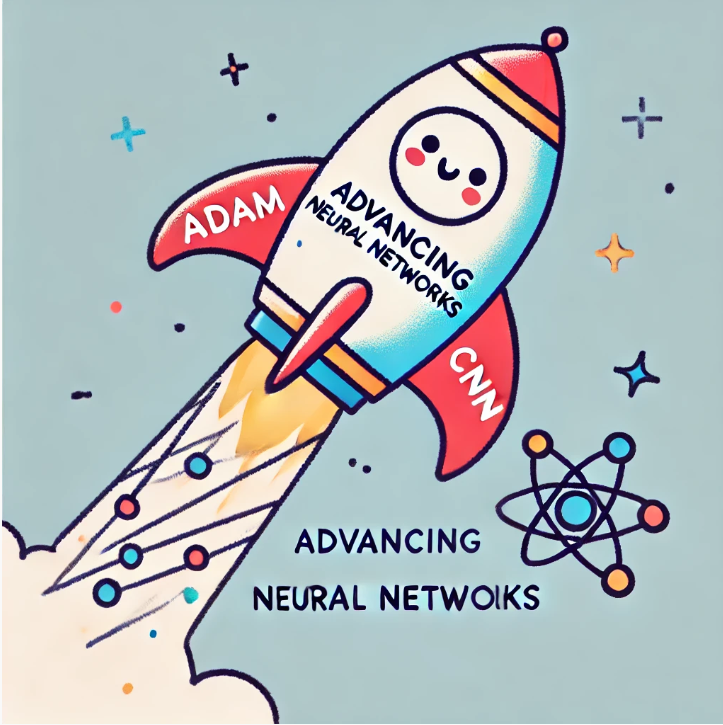

# Advancing Neural Network Concepts



## ***Adam: A Smarter Way to Update Neural Network Parameters***

**Imagine you’re navigating through a complex landscape**: your neural network’s loss function is like a landscape full of peaks and valleys. Standard gradient descent helps you move downhill—toward lower loss—by taking steps proportional to how steep the slope is at your current position. 

But sometimes, gradient descent can be too simple. It might get stuck moving slowly through long, flat valleys, or it might overshoot its target, zigzagging back and forth.

This is where **Adam (Adaptive Moment Estimation)** comes in. Think of Adam as a more sophisticated guide. It doesn’t just look at the current slope; it also keeps track of what’s been happening recently. In other words, Adam gathers “memories” of the gradients you’ve seen so far. By doing this, it can adjust how confidently it steps in different directions, smoothing out oscillations and speeding up progress through flat terrain.

### ***The Core Idea Behind Adam***

**Two running averages—or “moments”—drive Adam’s behavior:**

1. **First Moment (Mean of Gradients)**: This tracks the average direction and strength of the gradients. If your network’s parameters keep telling you to move in a similar direction, Adam notes that direction as more “reliable.”

2. **Second Moment (Mean of Gradient Squares)**: This keeps track of how wildly the gradients vary. If the slope is fluctuating a lot, the second moment records this uncertainty, and Adam responds by taking more cautious steps in that direction.

By combining these two pieces of information, Adam scales each update so that if a parameter consistently points in a stable direction, the effective step size is larger, helping you move faster in that direction. Conversely, if a parameter’s gradients are all over the place, Adam automatically takes smaller, safer steps there.

### ***Why Adam Works Better Than Plain Gradient Descent***

**Traditional gradient descent** uses the same learning rate for every parameter and every update. This uniform step size might be too small in some directions (wasting time) and too large in others (causing you to overshoot).

**Adam, on the other hand, customizes the update step for each parameter**. Parameters with stable, trustworthy signals get a relatively bigger push, while those with noisy, high-variance signals get a gentler nudge. Over time, this leads to:

- Faster Learning in Stable Directions: Adam takes advantage of consistent gradient directions to speed up training.
- More Stable Convergence: Adam reduces erratic, zigzagging behavior by adapting to the volatility of the gradient.
- Less Need for Manual Tuning: Since Adam is good at adapting on its own, you often spend less time fiddling with learning rates and hyperparameters.

### ***Using Adam in Code***

Here’s how you might use Adam in a TensorFlow/Keras model:

```python
model.compile(
    optimizer=tf.keras.optimizers.Adam(learning_rate=1e-3),
    loss='binary_crossentropy',
    metrics=['accuracy']
)
```

A learning rate of `1e-3` is a common starting point. While you can still experiment with different rates, Adam often gives decent results right out of the box.

### ***Key Takeaways***

- **Adaptive Steps**: Adam automatically adjusts each parameter’s update step using the history of gradients.
- **Reduced Manual Tuning**: Less guesswork is needed compared to vanilla gradient descent.
- **Smooth and Efficient**: Adam typically converges faster and more reliably, making it a go-to optimizer for many deep learning tasks.

## ***Convolutional Layers: A Different Way to Process Data***

So far, we’ve focused mostly on dense layers, where every neuron connects to all inputs from the previous layer. **Convolutional layers** take a more focused, localized approach. Instead of every unit looking at the entire input, convolutional layers use small **windows(filters)** that sweep across the data, examining one small region at a time.

Think of it as trying to understand a huge painting: rather than staring at the entire canvas at once, you study it piece by piece—analyzing small patches to understand details like colors, shapes, and edges. As these patches are scanned one after another, you build up a comprehensive understanding of the whole image.

#### ***Who is Yann LeCun?***

While multiple researchers contributed to the development and popularization of convolutional neural networks(CNNs), Yann LeCun is indeed one of the most influential figures in bringing CNNs into the mainstream. His work in the late 1980s and early 1990s, particularly on the LeNet architecture, provided a practical and effective way to apply convolutional layers to tasks like handwritten digit recognition.

A bit more context:

- Early Roots (1980s): Before LeCun, Japanese researcher Kunihiko Fukushima introduced the “Neocognitron” in the early 1980s, which featured a hierarchical, layered architecture that influenced later CNN designs. However, the Neocognitron wasn’t trained with backpropagation(we'll talk about this in the next chapter) and wasn’t widely adopted due to computational and data limitations at the time.

- Yann LeCun’s Contributions (Late 1980s–1990s): Yann LeCun, while at AT&T Bell Labs, introduced CNNs trained with backpropagation. His LeNet-5 model, published in the 1990s, efficiently processed image data—particularly handwritten digits (like those in the MNIST dataset)—and achieved groundbreaking accuracy. This was a critical milestone because it demonstrated that CNNs could solve real-world problems more effectively than traditional methods. LeCun’s consistent advocacy, practical demonstrations, and improvements to training algorithms helped legitimize CNNs as a go-to method for image-related tasks.

- Later Popularization (2010s Onward): Though LeCun’s work seeded CNNs in research circles, it was the explosion of GPU computing, larger datasets, and the success of models like AlexNet (by Alex Krizhevsky, Ilya Sutskever, and Geoffrey Hinton in 2012) that truly propelled CNNs into the spotlight. Still, the foundations laid by LeCun’s earlier work were instrumental in making this breakthrough possible.

***Yann LeCun is currently the Chief AI Scientist at Meta(Facebook), where he continues to advance the field of AI through research and development.***

### ***How Convolutional Layers Work***

A convolutional layer typically consists of multiple small filters (often just a few pixels wide and tall in image tasks) that slide over the input data. Each filter acts like a pattern detector, responding strongly when it encounters something it’s learned to recognize—like an edge or a specific texture.

- **Local Focus**: Instead of connecting to every input, each filter connects to a small, localized area. This drastically cuts down on the number of parameters compared to dense layers.
- **Shared Weights**: The same filter (set of weights) is applied across all regions of the input. This means a filter that detects vertical edges in one part of an image will detect them anywhere else in the image too.

By doing this, the network can learn filters that specialize in detecting meaningful features. The outputs of these filters are then combined and fed into subsequent layers, allowing the network to build more and more complex representations.

### ***Why Use Convolutional Layers?***

- **Improved Efficiency**: Since each filter only focuses on a small region, the network uses fewer parameters than a dense layer trying to process the entire input at once. This not only speeds up computation but also helps the model train faster.
- **Better Generalization**: Fewer parameters mean the model is less likely to memorize the training data. Instead, it learns patterns that generalize more effectively to new, unseen inputs.
- **Robust Feature Detection**: Convolutional filters are great at identifying patterns like edges, shapes, and textures—key building blocks for image recognition. Over multiple layers, the network can learn increasingly complex patterns, from simple edges to entire objects.

### ***Beyond Images: Convolution for Sequential Data***

Convolutional layers aren’t just for images. They’re also extremely useful for analyzing time-series or sequential data (like audio signals or heartbeats in an EKG(Electro Cardio Gram)). The idea is the same: filters now slide over sequences, detecting patterns that occur over spans of time instead of areas in an image.

For example, if you have an EKG signal recorded over 100 time steps:

- The first convolutional layer could apply filters that look at 20-step segments of the signal, detecting characteristic shapes that might indicate a heart rhythm issue.
- Deeper layers can then combine these detected patterns, building a more complete understanding of the signal and helping you classify whether there’s a heart condition or not.

### ***Key Parameters to Tune***

When working with convolutional layers, you have a few settings to play with:

- **Filter Size (Window Size)**: How wide or tall each filter is. Smaller filters capture fine details; larger filters capture broader patterns.
- **Stride**: How far the filter moves after each step. A larger stride can skip over data more quickly but might miss subtle details.
- **Number of Filters**: How many different patterns you want the network to learn at once. More filters mean more potential features, but also more computation.

Tuning these parameters allows you to shape the model’s ability to detect patterns at different scales and complexities.

### ***Looking Ahead***

Convolutional layers have transformed how we handle images, audio, and many other data types by focusing on localized features. They’re just one example of how specialized layers can help neural networks solve specific problems more effectively.

As you continue exploring advanced architectures—like recurrent layers for sequences, or attention and transformer layers for understanding context—you’ll gain an even richer toolbox. Each layer type has its strengths, and choosing the right combination can lead to more powerful and versatile models. **This allows the network to “observe” and “recognize” critical elements more effectively, rather than blindly guess.**

By understanding convolutional layers, you’re taking a step into a world where neural networks aren’t just brute-force pattern matchers; they’re skilled observers that learn to spot meaningful details in whatever data you give them.