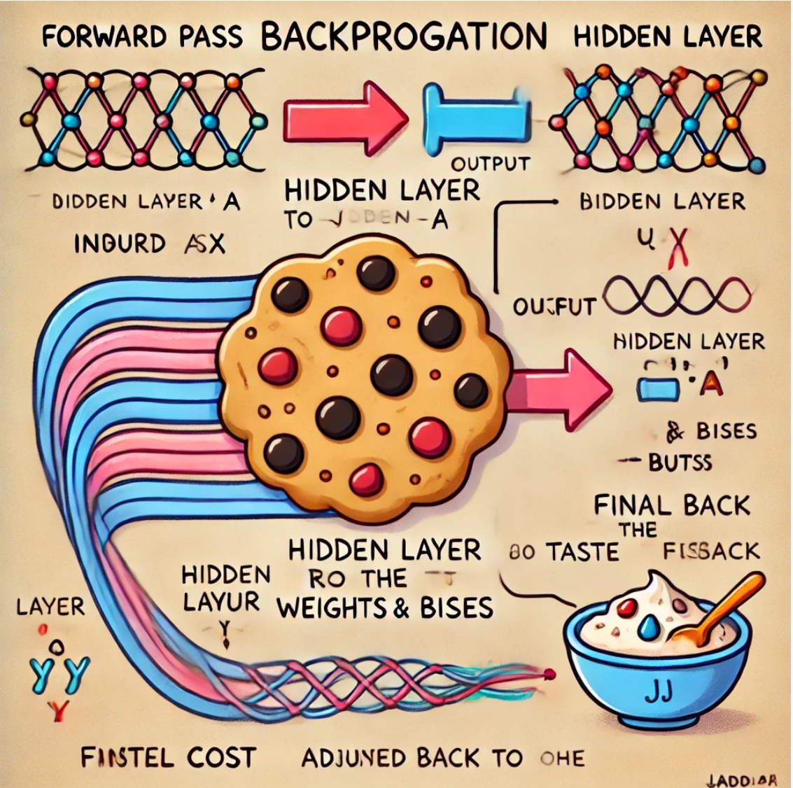

# Backpropagation: Learning to Move Forward by Going Backwards

## The Role of Computation Graphs

To understand backpropagation, we have to start with **computation graphs**. Think of a computation graph as a blueprint or a map that shows how all the pieces of a function fit together. Each node in this graph represents a single, simple operation—like adding two numbers or multiplying a weight by an input. The edges show how the results of one operation flow into the next, like a series of pipes carrying water through a machine.

For example, consider a simple linear function in a neural network layer:

$$a = w \cdot x + b$$

In a computation graph, you’d have nodes for $w$, $x$, and $b$, plus nodes for the multiplication $w \cdot x$ and the addition $w \cdot x + b$. **Forward propagation** is like pressing “go” on the machine: you pour in the inputs $x$ and parameters $w, b$, let the operations run through the graph, and out comes the result $a$.

It’s like following a cooking recipe: you start with basic ingredients and combine them step-by-step until you get a final dish. The computation graph keeps everything organized, showing exactly how each ingredient and operation contributes to the final output.

---

## Backpropagation: Tracing the Path Backwards

Once you have an output and a corresponding **cost function** $J$ that tells you how far off your prediction is, you want to adjust your parameters to make better predictions next time. This is where **backpropagation** comes into play.

Backpropagation starts from the end (the cost $J$) and moves backward through the graph. It uses the **chain rule** of calculus, which tells us how to handle the derivative of a function composed of multiple steps. If the cost $J$ depends on an intermediate variable $a$, and $a$ depends on a parameter $w$, the chain rule says:

$$\frac{\partial J}{\partial w} = \frac{\partial J}{\partial a} \cdot \frac{\partial a}{\partial w}$$

This process is like looking back at your finished cake and deciding how to tweak the ingredients. If the cake is too dry, you can trace this dryness back to the ratio of flour to liquid, then adjust that ingredient accordingly. Similarly, backpropagation helps you understand how changing each parameter $w, b,$ etc. affects the final cost $J$.

By methodically applying the chain rule from the output layer all the way back to the input layer, backpropagation calculates the gradient of the cost function with respect to every parameter in your network. You then use these gradients to update the parameters, typically using gradient descent or a similar optimization algorithm, nudging them in a direction that reduces the cost.

---

## The Efficiency of Backpropagation

Without backpropagation, you might try to understand each parameter’s influence on the cost by brute force—tweaking one parameter at a time and recomputing the entire function. That would be wildly inefficient.

Backpropagation, however, is like a smart detective who, after building a detailed map of the crime scene, can pinpoint how each piece of evidence connects to the final outcome without starting from scratch every time.

Mathematically, if there are $n$ nodes and $p$ parameters, a naive approach might take $O(n \times p)$ operations. Backpropagation reuses intermediate computations, bringing this down to about $O(n + p)$. This efficiency makes training large, complex neural networks practical.

---

## Activation Functions: The Special Spices

Neural networks often include **activation functions**, which introduce nonlinearity. Think of these as special spices that give your dish (the network) its unique flavor. Each activation function has its own derivative, which affects how gradients flow backward.

**ReLU (Rectified Linear Unit)**:

$$\text{ReLU}(z) = \max(0, z)$$

Its derivative:

$$\frac{d}{dz}\text{ReLU}(z) = \begin{cases} 1 & \text{if } z > 0 \\ 0 & \text{otherwise} \end{cases}$$

This is like adding spice only if the dish has a certain base flavor (i.e., if $z > 0$).

**Sigmoid**:

$$\sigma(z) = \frac{1}{1 + e^{-z}}$$

Its derivative:

$$\sigma'(z) = \sigma(z)(1 - \sigma(z))$$

This activation function behaves like a mild seasoning that becomes strongest around a certain “sweet spot” (values near 0.5) and fades near the extremes.

During backpropagation, you multiply the gradient coming from the output side by the derivative of the activation function. This ensures that each layer’s parameters receive an appropriately scaled gradient, guiding them toward better values.

---

## A Real-World Analogy: Retracing Your Steps in the Mountains

Imagine you’re hiking up a mountain to find the highest peak. Going forward, you just climb and see where you end up. When you realize you might not be at the top, you look back at your steps—where did you turn left when you should’ve gone right?

Backpropagation is like reviewing your trail choices after the fact. By understanding how each turn influenced your final position, you can choose a better path next time. Over many attempts, this iterative feedback loop helps you find a better route, just as repeated backpropagation steps lead your neural network’s parameters closer to the optimal values.

---

## Why Backpropagation Matters

Backpropagation isn’t just a clever math trick. It’s the backbone of neural network training. Because of it, we can build models that recognize images, translate languages, recommend movies, and perform countless other tasks at or beyond human-level proficiency.

By breaking down a complex problem into simpler parts, moving forward to produce a result, and then moving backward to understand what caused that result, backpropagation ensures your network continuously learns and improves. It transforms a static computation into a dynamic, feedback-driven learning process.

In short, backpropagation is the reason modern deep learning is possible. Understanding it empowers you to design, train, and refine neural networks effectively, taking you from a blind guesser to a knowledgeable explorer of complex computational landscapes.

## Understanding Backpropagation on a Larger Neural Network

In this final section for backpropagation, let’s consider how the computation works in a slightly more complex neural network, one that has a single hidden layer with just one hidden unit and a single output unit. While this still might sound small, it’s a step up from the simplest examples and helps illustrate how backprop scales to bigger networks.

We’ll continue with a single training example, where:
- **Input (x)**: 1
- **Target (y)**: 5

We’ll use ReLU activation functions defined as:  
**g(z) = max(0, z)**

And for the sake of example, suppose we have:
- **Parameters**:  
  - $w_1 = 2$, $b_1 = 0$  
  - $w_2 = 3$, $b_2 = 1$

## Forward Propagation (Forwardprop) Example

Let's walk through the forward pass step-by-step:

1. **Compute a₁**:  
   $a₁ = g(w_1 \cdot x + b_1)$  
   Here: $w_1 \cdot x + b_1 = 2 \cdot 1 + 0 = 2$  
   Since $2 > 0$, $g(2) = 2$, thus $a₁ = 2$.

2. **Compute a₂**:  
   $a₂ = g(w_2 \cdot a_1 + b_2)$  
   $w_2 \cdot a_1 + b_2 = 3 \cdot 2 + 1 = 7$  
   Again, $7 > 0$, so $g(7) = 7$, giving $a₂ = 7$.

3. **Cost Function**:  
   We’ll use a simple squared error:  
   $J(w, b) = (1/2) \cdot (a₂ - y)² = (1/2) \cdot (7 - 5)² = (1/2) \cdot 4 = 2$.

At this point, we have a clear forward pass:
- Input → Hidden → Output: 1 → 2 → 7  
- Final cost $J = 2$.

If we represent this with a computation graph, we see a chain of operations: starting from $x$ and parameters ($w_1, b_1, w_2, b_2$), we go through multiplications, additions, and ReLU steps to end up with a final cost $J$.

## Intuition for Backpropagation

Backpropagation is essentially the application of the chain rule of calculus to compute how sensitive the cost function $J$ is to each parameter. It tells us:  
- If we nudge $w_1$ slightly (say $w_1 → w_1 + ε$), how much will $J$ change?  
- If we nudge $w_2$ slightly, how does $J$ respond?  
- And similarly for $b_1$ and $b_2$.

In the example above, it turns out that if you increase $w_1$ by a small amount (ε), $J$ goes up by about 6 times ε. This suggests that $\frac{\partial J}{\partial w_1} = 6$. In other words, $w_1$ has a partial derivative (or gradient) of about 6 with respect to $J$.

This is no coincidence. By working through the chain rule, backprop efficiently computes these derivatives without having to repeatedly re-run forward passes for each parameter.

### Why Is Backprop Efficient?

Imagine you have a huge neural network with millions of parameters. If you were to compute gradients by brute force “bump and check” numerical approximations—i.e., increase each parameter by a tiny amount, run the forward pass, measure the cost change, then restore and move to the next parameter—you’d need to do on the order of *2P forward passes*, where **P** is the number of parameters (assuming a central difference scheme that evaluates J(w+ε) and J(w-ε)). Each forward pass might be expensive, and doing this P times would result in immense computational cost, roughly proportional to N×P where N is the number of operations or nodes in your network.

Backprop changes the game. With backprop, you only do a forward pass **once**, and then a backward pass that reuses computations (like partial derivatives) to get all parameter gradients in about **N + P** steps, not N×P. For large networks, this efficiency is the difference between a feasible training run and an impossible one.

### Historical Perspective

Before the rise of frameworks like TensorFlow or PyTorch, researchers had to manually compute derivatives by hand, a tedious process prone to error. Thanks to backprop and autodiff (automatic differentiation), the modern workflow lets you define your network and simply let the library handle the calculus. Over time, the “calculus barrier” for training neural networks has dropped significantly, making it easier for everyone—both researchers and practitioners.

## Using Questions & Answers as an Example

To check your understanding, consider these Q&A examples that might appear in a quiz section after you’ve read the chapter:

**Quiz 1:**
- **Question:** Given $x=1$, $y=5$, $w_1=2$, $b_1=0$, $w_2=3$, $b_2=1$ in a network with ReLU activations, what are $a_2$ and the cost $J$?
- **Answer:**  
  $a_1 = g(2 \cdot 1 + 0) = 2$  
  $a_2 = g(3 \cdot 2 + 1) = 7$  
  $J = 1/2(7-5)^2 = 2$

**Quiz 2:**
- **Question:** If increasing $w_1$ by a tiny ε leads to $J$ increasing roughly by 6ε, what is this 6 representing?
- **Answer:** It’s the partial derivative $\frac{\partial J}{\partial w_1}$. In other words, the gradient with respect to $w_1$ is 6.

**Quiz 3:**
- **Question:** Without backprop, if we use numerical approximations (like J(w+ε) and J(w-ε)) for each parameter, what inefficiency arises?
- **Answer:** For each parameter, you’d perform multiple forward passes. With P parameters, that’s about 2P forward passes if you use central difference. Each forward pass costs you time proportional to N (the number of computational nodes). Thus, the total cost is about N×P operations, which becomes enormous for large networks. Backprop avoids this massive overhead by efficiently computing gradients in roughly N+P steps.

### A Handy Analogy

Think of **forward passes** as baking cookies. Each forward pass is like baking one batch. If you had to adjust each ingredient separately, bake a batch to see if it’s better, then revert and do it again, you’d bake and bake until exhausted. That’s the brute force approach—taste one cookie per ingredient tweak.

**Backprop** is like a clever taste test that, after you bake one batch, tells you how changing the sugar, flour, butter, or chocolate chips independently would have affected the taste—without having to bake again for each ingredient. You get the full recipe adjustments from just one smart analysis of the finished batch. Imagine how much time you save, especially if you’re dealing with giant industrial ovens (i.e., huge neural networks)!

---

In summary, understanding how backprop scales to larger networks and why it’s more efficient than naive numerical differentiation not only helps you appreciate the tools you have but also gives you a deeper intuition about what’s happening under the hood of today’s modern deep learning frameworks.