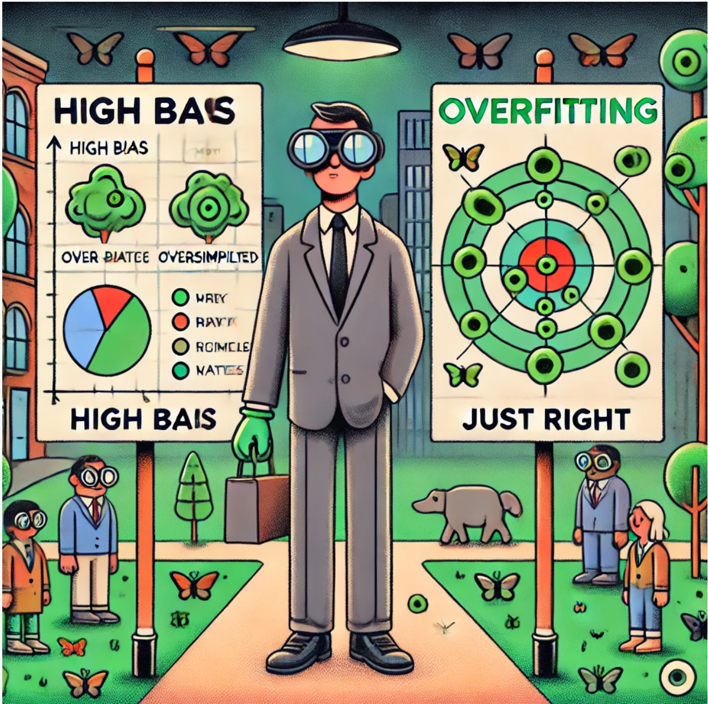

# Bias and Variance

One of the most important questions in **machine learning** is figuring out **why** your model isn’t performing as well as you’d like. Is it because it doesn’t match the training data well enough (high bias / underfitting)? Or is it because it memorized the training data too closely and doesn’t generalize (high variance / overfitting)? Understanding **bias** and **variance** will help you decide **what to do next** to improve your model.

---

## ***Diagnosing Bias and Variance***

### ***1. What Are Bias and Variance?***

- **High Bias (Underfitting)**:  
  - The model doesn’t capture the underlying trend well enough.  
  - As a result, it performs **poorly** even on the **training set**.  
  - In other words, the model is **too simple**.  

- **High Variance (Overfitting)**:  
  - The model matches the training data **very closely**, sometimes capturing noise or random fluctuations.  
  - It does great on training data but **fails** when presented with **new** (unseen) data.  
  - In other words, the model is **too complex**.  

Think of **bias** like a **bad pair of glasses** that blurs everything you see—you consistently see things incorrectly (the model is too simple, so it misses important details).  
Think of **variance** like an **overly tight glove** that fits your hand so precisely it can’t fit any hand that’s even slightly different (the model is so specifically tailored to the training data that it doesn’t fit new data well).

---

### ***2. Diagnosing Bias vs. Variance***

To **systematically** tell if your model has high bias or high variance, we look at **two errors**:

1. **Training Error** ($J_{\text{train}}$): How well the model does on the **same data** it was trained on.  
2. **Cross-Validation Error** ($J_{\text{cv}}$): How well the model does on **new** examples it hasn’t seen during training (the cross-validation set).

#### ***High Bias Signature***
- $J_{\text{train}}$ is **high**.  
- $J_{\text{cv}}$ is also **high** (and usually close to $J_{\text{train}}$).  
- Interpretation: The model can’t even learn the training data well → **underfitting**.

#### ***High Variance Signature***
- $J_{\text{train}}$ is **low**.  
- $J_{\text{cv}} \gg J_{\text{train}}$ (much higher than training error).  
- Interpretation: The model memorizes the training data but fails on new data → **overfitting**.

#### ***Just Right (Low Bias, Low Variance)***
- $J_{\text{train}}$ is **low**.  
- $J_{\text{cv}}$ is also **low** and **close** to $J_{\text{train}}$.  
- Interpretation: The model fits the data well **and** generalizes well.

---

### ***3. Visualizing Bias and Variance***

Imagine you’re predicting **house prices** based on **size**:
- **Low-Degree Polynomial** (e.g., a **straight line**, $d=1$):  
  - Likely **high bias**. The line is too simple to capture the housing data’s real pattern.  
  - You’ll see both $J_{\text{train}}$ and $J_{\text{cv}}$ are **high**.

- **High-Degree Polynomial** (e.g., $d=4$ or $d=10$):  
  - Likely **high variance**. The curve may wiggle around to fit training points perfectly, but fails on new data.  
  - You’ll see $J_{\text{train}}$ is very **low** but $J_{\text{cv}}$ is **much higher**.

- **Moderate-Degree Polynomial** (e.g., $d=2$):  
  - Often a **good balance** between too simple and too complex.  
  - Both $J_{\text{train}}$ and $J_{\text{cv}}$ can be relatively **low**.

If you plotted **training error** ($J_{\text{train}}$) and **cross-validation error** ($J_{\text{cv}}$) against the **degree of the polynomial** $d$:
- $J_{\text{train}}$ will typically **go down** as $d$ increases (complex model fits training data better).  
- $J_{\text{cv}}$ will **go down** at first (the model is getting more expressive), but after a certain point, it **goes back up** (overfitting).  
- The **ideal** $d$ is often somewhere in the middle, where $J_{\text{cv}}$ is minimized.

---

### ***4. Can You Have Both High Bias and High Variance?***

In simpler models like linear regression in 1D, you typically see **either** high bias **or** high variance, not both. However, in more complex models (e.g., large neural networks), it’s possible to be **underfitting** some parts of the data and **overfitting** other parts at the same time.  
- You might see:
  - $J_{\text{train}}$ is **high** (some parts underfit)  
  - $J_{\text{cv}} \gg J_{\text{train}}$ (also overfit in other regions).  

This case is less common in basic polynomial regression but more plausible in complicated or very large models.

---

### ***5. Why This Matters for Improving Your Model***

- **If your model has high bias** (underfits):  
  1. **Add more features** (more information might help it learn better).  
  2. **Increase model complexity** (e.g., try a higher polynomial degree or deeper neural network).  
  3. **Reduce regularization** (so the model can better fit the training data).

- **If your model has high variance** (overfits):  
  1. **Collect more training data** (the model has more examples to generalize from).  
  2. **Add regularization** (e.g., increase $\lambda$ so the model doesn’t rely too heavily on training points).  
  3. **Reduce model complexity** (try a lower polynomial degree or simpler neural network).

By checking **$J_{\text{train}}$** and **$J_{\text{cv}}$**, you can **diagnose** which direction to go.

---

### ***6. Key Takeaways***

1. **High Bias (Underfitting)**:  
   - $J_{\text{train}}$ ≈ **High**  
   - $J_{\text{cv}}$ ≈ **High** (close to $J_{\text{train}}$)  
   - **Action**: Increase complexity, gather more relevant features, reduce regularization.

2. **High Variance (Overfitting)**:  
   - $J_{\text{train}}$ ≈ **Low**  
   - $J_{\text{cv}} \gg J_{\text{train}}$ (much bigger)  
   - **Action**: More data, more regularization, reduce model complexity.

3. **Neither**:  
   - $J_{\text{train}}$ ≈ **Low**  
   - $J_{\text{cv}}$ ≈ **Low** (similar to $J_{\text{train}}$)  
   - **Action**: Your model might be **“just right”**.

4. **Both**: Rare in simple problems, possible in very complex models.  
   - $J_{\text{train}}$ is **high**  
   - $J_{\text{cv}} \gg J_{\text{train}}$  
   - **Action**: Might need both more capacity **and** more data/regularization, depending on the part of the data you’re not fitting well.

By understanding bias and variance, you gain a **compass** for how to improve your model. In the next sections, we’ll see how **regularization** can shift the balance between these two types of error.

---

## ***Regularization and Bias/Variance***

So far, we’ve seen how the **degree of a polynomial** (model complexity) can impact bias and variance. Another powerful way to control bias and variance is **regularization**, often implemented using a **regularization parameter** $\lambda$.

---

### ***1. What Is Regularization?***

When you train a model—like a **polynomial regression**—you often minimize a cost function:

$$
J(\mathbf{\vec w}, b) = \frac{1}{2m}\sum_{i=1}^{m} \bigl(f_{\mathbf{\vec w},b}(x^{(i)}) - y^{(i)}\bigr)^2
+
\frac{\lambda}{2m}\sum_{j=1}^{n} w_j^2.
$$

- The **first term** (mean squared error) measures how well your model fits the data.  
- The **second term** (regularization term) **penalizes** large weights $\mathbf{w}$.  
- $\lambda$ is the regularization parameter that **balances** these two objectives.

A **bigger** $\lambda$ puts more emphasis on keeping weights small (less complex curves). A **smaller** $\lambda$ allows the model to fit training data more flexibly (potentially more complex curves).

---

### ***2. Extreme Cases of $\lambda$***

1. **$\lambda$ is very large** (e.g., $\lambda = 10,000$):  
   - The algorithm **strongly** penalizes large weights.  
   - Most $\mathbf{w}$ become **very close to 0**, leaving the model almost like $f_{\mathbf{\vec w},b}(x) \approx b$, a **constant** function.  
   - This typically leads to **high bias (underfitting)** because the model is too simple to capture important data trends.  
   - You’ll notice:
     - $J_{\text{train}}$ is **large** (it doesn’t even fit the training data well).  
     - $J_{\text{cv}}$ also tends to be **large**.

2. **$\lambda$ is very small** (e.g., $\lambda = 0$):  
   - **No** regularization term is added, so the model can freely adjust weights to fit the training data.  
   - The model can become overly complex—like the **wiggly** polynomial that **overfits**.  
   - You’ll see:
     - $J_{\text{train}}$ is **very small** (fits training data almost perfectly).  
     - $J_{\text{cv}}$ is **much larger** than $J_{\text{train}}$ (poor generalization).

3. **Intermediate $\lambda$**:  
   - A moderate penalty on large weights.  
   - Often finds a **balance** between underfitting and overfitting.  
   - Both $J_{\text{train}}$ and $J_{\text{cv}}$ can be **relatively low**.

---

### ***3. Using Cross-Validation to Choose $\lambda$***

Just like you **chose** the best polynomial degree $d$ by trying different values and checking the **cross-validation (CV)** error, you can do the **same** for $\lambda$:

1. Pick a **range** of $\lambda$ values (e.g., $0, 0.01, 0.02, 0.04, 0.08, \dots, 10$).  
2. For each $\lambda$, **train** your model → get $(\mathbf{w}^{\langle \lambda \rangle}, b^{\langle \lambda \rangle})$.  
3. Compute the **cross-validation error** $J_{\text{cv}}\bigl(\mathbf{w}^{\langle \lambda \rangle}, b^{\langle \lambda \rangle}\bigr)$.  
4. **Choose** the $\lambda$ that gives you the **lowest** CV error.  
5. **Finally**, confirm by looking at the **test set** to estimate generalization error.

This method ensures you **don’t** overfit the test set by using it repeatedly to pick $\lambda$. Instead, the test set is only used **once** at the end, to validate your final choice.

---

### ***4. Bias and Variance as $\lambda$ Changes***

If you **plot** how $J_{\text{train}}$ and $J_{\text{cv}}$ change as $\lambda$ increases:

- **When $\lambda$ is small** (near 0), the model is free to become very flexible → **overfits** →  
  - $J_{\text{train}}$ **low**  
  - $J_{\text{cv}}$ **high** (high variance)
- **When $\lambda$ is large**, the model becomes almost too simple → **underfits** →  
  - $J_{\text{train}}$ **high**  
  - $J_{\text{cv}}$ **high** (high bias)
- **Somewhere in the middle**, there’s a **sweet spot** where both $J_{\text{train}}$ and $J_{\text{cv}}$ are **relatively low**.

Visually, you might see a **U-shaped curve** for $J_{\text{cv}}$ across increasing $\lambda$. The **minimum** of that curve is your **best** $\lambda$.

---

### ***5. Comparing to Polynomial Degree***

This procedure mirrors what we saw with **polynomial degree** $d$:
- On one axis (polynomial degree), going from low $d$ (high bias) to high $d$ (high variance).  
- On the other axis (regularization $\lambda$), going from high $\lambda$ (high bias) to low $\lambda$ (high variance).  
- In **both** cases, there’s a middle ground that balances bias and variance.

---

### ***6. Key Takeaways***

1. **Regularization** adds a penalty for large weights, helping to **reduce variance** (overfitting).  
2. **Large $\lambda$** → strong regularization → simpler model → higher bias risk.  
3. **Small $\lambda$** → weak regularization → model can overfit → higher variance risk.  
4. Use **Cross-Validation** to systematically find a **good** $\lambda$.  
5. After choosing $\lambda$, check the **test set** for a fair measure of real-world performance.

By tuning $\lambda$, you can often **shift** your model between **high bias** and **high variance** regimes, aiming for the sweet spot where you achieve **low** training **and** cross-validation errors. This gives you another powerful tool (alongside model complexity, features, etc.) for improving your machine learning systems.

---

## ***Establishing a Baseline Level of Performance***

When you’re trying to figure out if your model has **high bias** or **high variance**, one essential idea is to compare your training and cross-validation errors against a **baseline**. This baseline is often a **target** or **reference** level of performance, such as:

- **Human-Level Performance**: Especially useful for tasks like speech recognition, image recognition, or natural language understanding, where humans generally do very well.
- **Existing/Competing Algorithm**: If there’s a known system or competitor’s model, its performance can serve as a baseline.
- **Practical Best-Guess**: Sometimes you can establish a baseline through prior experience or domain knowledge.

### ***1. Why a Baseline Helps***

In some tasks (like speech recognition), **zero error** is impossible because the input data can be very noisy (e.g., muffled audio, background sounds). Even **humans** make mistakes. So, if humans have, say, a **10.6%** error rate, it’s not realistic to expect your algorithm to do **much better** than 10.6%.

This insight changes how we interpret something like a **10.8%** training error. Without context, 10.8% might sound “bad.” But if the **human error** rate is 10.6%, your algorithm is actually **close to human-level** on the training set. That suggests you may **not** have a severe bias (underfitting) problem.

### ***2. Comparing Errors***

Let’s define:
- $J_{\text{baseline}}$: The baseline (e.g., human-level) error.
- $J_{\text{train}}$: Training set error.
- $J_{\text{cv}}$: Cross-validation set error.

You can examine **two** gaps:

1. **Gap A**: $J_{\text{train}} - J_{\text{baseline}}$
   - If **Gap A** is **large**, your model is doing much worse on the training set than the baseline. 
   - This implies a **bias** problem (the model isn’t fitting even the training data up to the level of human or known performance).

2. **Gap B**: $J_{\text{cv}} - J_{\text{train}}$
   - If **Gap B** is **large**, the model performs well on training but much worse on new data.
   - This implies a **variance** problem (overfitting).

#### ***Example 1: Speech Recognition***
- $J_{\text{baseline}} = 10.6\%$ (human-level performance)
- $J_{\text{train}} = 10.8\%$
- $J_{\text{cv}} = 14.8\%$

  - **Gap A** = $10.8\% - 10.6\% = 0.2\%$ (small gap)  
    - The model is almost as good as humans on the training set → **no major bias** issue.
  - **Gap B** = $14.8\% - 10.8\% = 4\%$ (large gap)  
    - The model does significantly worse on the cross-validation set → **variance** (overfitting) issue.

#### ***Example 2: Another Scenario***
- $J_{\text{baseline}} = 10.6\%$  
- $J_{\text{train}} = 15.0\%$  
- $J_{\text{cv}} = 17.0\%$

  - **Gap A** = $15.0\% - 10.6\% = 4.4\%$ (large gap)  
    - The model is much worse than humans even on training data → **high bias** (underfitting).
  - **Gap B** = $17.0\% - 15.0\% = 2.0\%$ (relatively small)  
    - Overfitting isn’t the main problem here → **lower** variance issue.

### ***3. High Bias and High Variance Together***

In **rare** but more complex cases, you might have:
- A **large** Gap A (training error much higher than baseline) → **high bias**  
- A **large** Gap B (cross-validation error much higher than training error) → **high variance**

This means your model underfits some parts of the data **and** overfits others. It can happen in complex models (e.g., large neural networks), though it’s less common for simpler models.

### ***4. Key Takeaways***

1. **Always Compare Against a Baseline**  
   - A “high” training error should be judged against the best you can **reasonably** achieve (e.g., human or competitor performance).

2. **Look at Two Gaps**  
   - **Gap A** ($J_{\text{train}} - J_{\text{baseline}}$) → Bias Indicator  
   - **Gap B** ($J_{\text{cv}} - J_{\text{train}}$) → Variance Indicator

3. **Plan Your Next Steps**  
   - **High Bias**: Add features, increase model complexity, or reduce regularization.  
   - **High Variance**: Get more data, add regularization, or simplify the model.

By establishing a realistic **baseline** and analyzing these gaps, you get a clearer picture of **why** your model may be underperforming, which helps you decide **how to improve** it.

---

## ***Learning Curves***

Learning curves show you how **training** and **cross-validation** errors change as a function of the **training set size**. They can give powerful insights into whether your model suffers from **high bias** (underfitting) or **high variance** (overfitting)—and whether gathering **more data** is likely to help.

---

### ***1. What Are Learning Curves?***

Imagine you have a **knitting project**: if you have just a bit of yarn (a **small** training set), it might be **easy** to create a tiny knitted patch (low training error) because you’re only matching a few stitches. But as your **project** (training set) grows, it becomes **harder** to keep everything perfect—there’s more to manage, so your **training error** can **increase**. 

Meanwhile, your **cross-validation error** **decreases** because the more data you see while training, the better your model **generalizes**.

Concretely, you plot two curves:

- $J_{\text{train}}(m)$: Training error when you train on $m$ examples.
- $J_{\text{cv}}(m)$: Cross-validation error when you train on $m$ examples, then measure on a **held-out** CV set.

On the **horizontal axis**, you have the number of training examples $m$.  
On the **vertical axis**, you have the **error** (e.g., mean squared error, or classification error).

---

### ***2. Typical Shapes of Learning Curves***

1. **High Bias (Underfitting)**

   - **Training Error** ($J_{\text{train}}$): Starts low when $m$ is **very small** (fitting just a few points is easy) but **quickly** goes up as you add more data. It eventually **flattens** at a relatively **high** value because the model (e.g., a simple linear function) can’t fit the complexity of the data.  
   - **Cross-Validation Error** ($J_{\text{cv}}$): Starts **high** (with few examples, the model is poorly estimated) but also **flattens** to a relatively **high** level.  
   - **Result**: Both curves plateau well above any “desired” performance (e.g., human-level). Simply adding **more** data **won’t** fix underfitting because the model is too simple. 
   
   > **Analogy**: Imagine person B standing on a hill, admiring a breathtaking panorama of rolling hills and winding rivers. Person A, who can’t see it directly, is trying to draw the same view on a canvas—solely based on B’s detailed descriptions. Yet, here’s the catch: A only has big, rigid and straight rulers to mark lines. Even if B provides volumes of rich, precise detail—every bend in the river, every curve of the hills—A’s drawing will remain a collection of straight edges. The limitation isn’t the amount of information; it’s that the “tools” (the rulers) are fundamentally incapable of capturing the gentle arcs and contours. Likewise, a model that’s too simple (rigid rulers) will never fully represent the complexities of a dataset, regardless of how large or detailed that dataset (the description) might be.

2. **High Variance (Overfitting)**

   - **Training Error** ($J_{\text{train}}$): Typically **very low** (the model can perfectly fit a small training set). As $m$ grows, $J_{\text{train}}$ slightly **increases** but may remain lower than the cross-validation error.  
   - **Cross-Validation Error** ($J_{\text{cv}}$): Starts **much higher** than $J_{\text{train}}$ (big gap), but **goes down** as $m$ increases. Because the model is overfitting, it can’t generalize well to new data.  
   - **Result**: In many cases, adding **more data** helps reduce overfitting because the model sees more variety and can learn to generalize better.

   > **Analogy**: Think of an overly tailored suit: it’s cut to hug every inch of your body perfectly. As a result, it looks impeccable on you—but if anyone else tries it on, it’s too tight in some places or baggy in others. In the same way, a model that’s overfitted is perfectly tailored to the training data and performs poorly on new, unseen data. By adding more data, you give the “tailor” more measurements and patterns to work from, making the suit’s cut less rigid so that it fits a broader range of body shapes—in other words, it generalizes better.

---

### ***3. Interpreting Learning Curves***

- **If $J_{\text{train}}$ is already high (underfitting)**:
  - More data **won’t** drastically change the shape—both training and CV errors remain high.
  - You likely need a **more complex model**, **more features**, or **less regularization** to reduce bias.

- **If $J_{\text{train}}$ is very low but $J_{\text{cv}}$ is much higher (overfitting)**:
  - The gap between training and CV errors can **shrink** if you add more data or **increase** regularization.
  - The model is memorizing training examples rather than learning the general patterns.

---

### ***4. Practical Steps***

1. **Plot** or **estimate** your learning curves:
   - Train with small subsets (e.g., 100, 200, 300 examples), record $J_{\text{train}}$ and $J_{\text{cv}}$.
   - Increase to bigger subsets (e.g., 500, 1000, …) and measure errors again.
   - Observe how the errors evolve.

2. **Decide** on your next move:
   - If curves **plateau** at a **high** level (both are similar, both high) → **High bias** → Try a more complex model or add features.
   - If there’s a **big gap** (low training error, high CV error) → **High variance** → Gather more data, use regularization, or simplify the model.

3. **Consider computational cost**:
   - Training multiple models on different subset sizes can be expensive. Still, even a **rough** sampling of the data can give insight.

---

### ***5. Key Takeaways***

- **Learning curves** illustrate how training and CV errors behave as you increase training examples:
  1. **High Bias**: Both curves end up high; more data doesn’t help much.  
  2. **High Variance**: Large gap between curves; more data often helps close the gap.
- **Visualizing** these curves helps you make **strategic decisions**:
  - “Do I invest in more data?”  
  - “Should I pick a more flexible model?”  
  - “Is regularization needed?”  
- They provide a **mental model** of how your algorithm responds to additional data and how the **trade-off** between bias and variance unfolds.

If your learning curve suggests **high bias**, focus on **model complexity** or features. If it suggests **high variance**, focus on **regularization** or **data**. By understanding these patterns, you can **optimize** where to invest your time and resources for the best performance gains.

---

## ***Deciding What to Try Next (Revisited)***

After identifying whether your model has **high bias** or **high variance** (e.g., by comparing $J_{\text{train}}$ and $J_{\text{cv}}$, or examining learning curves), the next step is deciding **how to improve** your model’s performance. Let’s revisit an example scenario: you have implemented a **regularized linear regression** to predict housing prices, but you’re getting **unacceptably large** prediction errors. 

Here are **six** common ideas you might try:

1. **Get more training examples**  
2. **Try a smaller set of features**  
3. **Try getting additional features**  
4. **Try adding polynomial features**  
5. **Try decreasing $\lambda$** (the regularization parameter)  
6. **Try increasing $\lambda$**  

But **which** should you choose? Each approach is well-suited to either **high variance** or **high bias**.

---

### ***1. Fixes for High Variance***

If your model is **overfitting** (i.e., it fits the training set almost perfectly but struggles with new data), try:

- **Get more training examples**  : More data helps reduce variance by letting the model see a broader range of examples.
- **Try a smaller set of features**  : This curbs the model’s complexity, so it can’t produce overly “wiggly” fits.
- **Try increasing $\lambda$**  
  - In the cost function  
    $$
    J(\mathbf{\vec w}, b) \;=\; \frac{1}{2m}\sum_{i=1}^{m}\bigl(f_{\mathbf{\vec w},b}(x^{(i)}) - y^{(i)}\bigr)^2 \;+\; \frac{\lambda}{2m} \sum_{j=1}^{n} w_j^2,
    $$
    a **larger** $\lambda$ forces the model to **“shrink”** parameters $\mathbf{\vec w}$, reducing overfitting.  

---

### ***2. Fixes for High Bias***

If your model is **underfitting** (i.e., it doesn’t even do well on training data), try:

- **Try getting additional features**  : Adding more relevant details helps your model capture the true patterns.

- **Try adding polynomial features**  : If a straight line can’t fit the data, maybe a curve will. By adding $x_1^2, x_1x_2,$ etc., your model can represent more complex shapes.  

- **Try decreasing $\lambda$**  
  - If regularization is **too strong**, it may oversimplify the model (high bias).  
  - A **smaller** $\lambda$ lets the model adjust the parameters more freely to better fit the training data.

---

### ***3. A Caution on “Reducing Training Set Size”***

- If you have **high bias**, you might notice that **fewer** training examples can produce a lower training error—because the model has fewer points to “satisfy.”  
- **However**, discarding data generally hurts your cross-validation or test performance. It’s almost never the correct strategy to “fix” high bias by throwing out data.

---

### ***4. Key Takeaways***

1. **Identify** whether you have high bias or high variance:
   - **High bias**: Poor training performance; model is too simple.  
   - **High variance**: Great on training, poor on cross-validation; model is too complex or too flexible.

2. **Choose** the correct strategy:
   - **High bias fixes**: Add features, polynomial terms, or decrease $\lambda$.  
   - **High variance fixes**: More data, fewer features, or increase $\lambda$.

3. **Practice** these concepts repeatedly:
   - Bias and variance become clearer with experience and real-world examples.

With these guidelines, you can **systematically** decide **what to try next** for improving your learning algorithm. Next, we’ll see how bias and variance ideas apply to **neural networks**, which can have even more knobs to tune. 

---

## ***Bias/Variance and Neural Networks***

Neural networks have changed the way we tackle **bias** (underfitting) and **variance** (overfitting). Traditionally, one would carefully **trade off** complexity to balance high bias and high variance. But large neural networks—especially trained on **big data**—can often **reduce both** bias and variance if designed and regularized correctly! Let’s see how.

---

### ***1. The Classic Bias-Variance Tradeoff***

In simpler models (like polynomial regression):
- **Low-Degree Polynomial** → **High Bias** (underfits)  
- **High-Degree Polynomial** → **High Variance** (overfits)

You’d pick a **middle ground** (e.g., 2nd-order polynomial) to minimize **cross-validation** error. This tradeoff has long been a central theme in machine learning.

---

### ***2. How Large Neural Networks Shift the Picture***

**Big neural networks** can act as **“low bias” machines**:
- Because they have **many parameters** (layers, units), they can **almost always** fit the training data well (assuming you have at least a moderate dataset).
- The model capacity is so large that **underfitting** is much less common—**unless** you simply don’t have enough data or you choose an architecture that’s still too small.

**However**, more parameters can mean a **higher** risk of **overfitting**. This is where **regularization** and/or **more data** come in.

---

### ***3. A Simple Recipe for Neural Network Training***

1. **Train a (potentially large) neural network.**  
2. **Check $J_{\text{train}}$ (training error).**  
   - If training error is too high, you have a **high bias** problem.  
   - **Solution**: use an even **bigger** network (more layers or units), or more complex architecture. 
3. **Check $J_{\text{cv}}$ (cross-validation error).**  
   - If CV error $\gg$ training error, you have a **high variance** problem.  
   - **Solution**:  
     - **Get more data** (expose the model to more variety).  
     - **Increase regularization** (L2, dropout, etc.).  
     - Possibly **reduce** the network’s complexity (if extremely large).  
4. **Iterate**  
   - Each time you fix one issue, you may create or notice another. For instance, making a network bigger fixes bias but may introduce variance. Gather more data or add stronger regularization to handle that variance.

---

### ***4. “Bigger Networks Rarely Hurt” — With a Caveat***

> **It almost never hurts to have a bigger neural network,** provided you regularize properly.

- **Bigger** means more layers or more units per layer.  
- With proper regularization (L2, dropout, etc.), the network won’t necessarily overfit.  
- **The main downside**: computational cost — training a huge model can be **much slower** and require specialized hardware (GPUs - "GPU is new gold", TPUs).

---

### ***5. Neural Network Regularization***

Just like in linear/logistic regression, we can **penalize** large weights:

$$
J(W,B) \;=\; \frac{1}{m} \sum_{i=1}^{m} L\bigl(f_{W,B}(x^{(i)}),\,y^{(i)}\bigr)
\;+\;
\frac{\lambda}{2m}\sum_{\text{all weights } w} w^2.
$$

- Often called **L2 regularization** (a.k.a. weight decay).  
- We typically do **not** regularize biases $b$, though in practice it makes little difference.  
- In frameworks like **TensorFlow**, you can add a **kernel_regularizer** parameter to each layer.

---

### ***6. Putting It All Together***

1. **Large Neural Networks** → powerful enough to reduce **bias** dramatically.  
2. **Regularization + More Data** → tame **variance**.  
3. **Iterative Process** →  
   - Check if $J_{\text{train}}$ is **too high** → bigger network.  
   - Check if $J_{\text{cv}}$ is **too high** relative to $J_{\text{train}}$ → gather data, tune regularization.  
4. **Computational Limits** → your hardware (GPUs, TPUs) may be the practical bottleneck.

---

### ***7. Key Takeaways***

- **Bias/Variance** still matters in neural networks, but the approach changes:
  1. **High Bias**: Make the network **larger** (more layers, more units).  
  2. **High Variance**: Add data or **regularize** more strongly.  
- Modern hardware and large datasets **free** us from the strict tradeoff constraints of simpler models.  
- **Nevertheless**, diagnosing bias or variance is still crucial: it **guides** whether we should “go bigger” or “regularize more” (or both).  

In short, **deep learning** has shifted the bias-variance conversation. Rather than meticulously balancing model size, many practitioners default to a **bigger network** and rely on regularization and data to handle variance. Just keep an eye on **computational feasibility**, and let the **bias/variance** checks guide your next moves.
