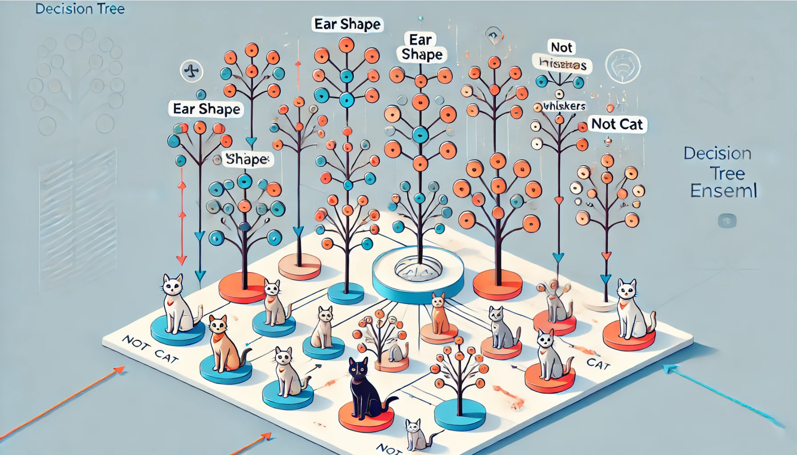

# Decision Tree Ensemble  



## ***Using Multiple Trees***

**Have you ever wondered why one tiny tweak in the training data can flip a decision tree’s top split—changing the entire tree—and what we can do to make our model more stable?**

---

### ***1. Motivation: Sensitivity of a Single Tree***  

A single decision tree can be **highly sensitive** to slight changes in the dataset. For example, if you have a cat labeled with *pointy ears* and then suddenly change it to *floppy ears*—just *one* record in your entire training set—your decision tree’s **root split** might switch from using **ear shape** to using **whiskers**. This leads to a **completely different** arrangement of nodes and branches.  

> **Analogy**: Imagine building a house of cards. One small adjustment (like nudging a single card) can cause the entire structure to collapse or change its shape dramatically. A **single** decision tree is similarly fragile because a minor data change can **reshape** it from the root down.  

---

### ***2. The Idea of Multiple Trees***  

To handle this instability, we **don’t** rely on just one tree. Instead, we build **many** decision trees—collectively known as an **ensemble**. Each tree might look slightly different because:

- They’re trained on **variations** of the data (e.g., by sampling).  
- They may split on different features first.  

By combining (or **aggregating**) these multiple trees, we can create a **more robust** classifier.  

---

### ***3. Ensemble Voting***  

When we have a **new** example to classify (like deciding whether an animal is a *cat* or *not cat*), we run it through all our trees and let each **vote**:

1. **Tree A**: Says “Cat.”  
2. **Tree B**: Says “Not cat.”  
3. **Tree C**: Says “Cat.”  

The ensemble’s **final** prediction is decided by the **majority vote**. In this case, 2 out of 3 say “Cat,” so the overall answer becomes “Cat.”  

> **Key Insight**: A single unusual tree is **outvoted** by the others. This makes the final verdict more **stable** and less vulnerable to noise or minor changes in the data.

---

### ***4. Why Ensembles Are More Robust***  

- **Reduced Sensitivity**  
  Each individual tree has its own quirks. If Tree A is overly biased by one example, Tree B and Tree C may be *less* affected.  
- **Distribution of Errors**  
  It’s unlikely that all trees make the same mistake on the same example (unless the data truly points that way).  
- **Less Overfitting**  
  Averaging multiple rough opinions often yields a stronger consensus than any *single* opinion alone.

> **Analogy**: If you ask a group of friends for movie suggestions, you might avoid picking a terrible movie if only *one* friend recommends it—while the others propose better options. By going with the **majority**, you’re more likely to end up with a decent movie choice.

---

### ***5. Building Different Trees: Sampling with Replacement***  

One puzzle remains: **How** do we create multiple, distinct trees from the *same* dataset?

- **Bootstrapping** (“Sampling with Replacement”):  
  1. Draw a random sample of your training set *with* replacement (some examples may appear multiple times; others might be left out).  
  2. Train the first tree on this “bootstrapped” dataset.  
  3. Draw another random sample (again with replacement) and train the second tree.  
  4. Repeat until you have as many trees as you want.  

Each tree sees a **slightly different** version of the data, so it learns a **slightly different** set of decision rules.

---

### ***6. Additional Example: Email Spam Detection***  

- **Single Tree**: Might rely heavily on whether the subject contains the word “FREE.” A small adjustment in the training set (like re-labeling one borderline email) could cause it to ignore “FREE” and instead focus on “Has an attachment?” for the first split.  
- **Multiple Trees**:  
  - **Tree 1**: Emphasizes suspicious words like “WINNER,” “FREE,” or “LIMITED.”  
  - **Tree 2**: Focuses on sender domain or link presence.  
  - **Tree 3**: Looks at specific attachment file types.  

When a new email arrives, each tree votes “Spam” or “Not Spam.” The majority decision is typically **more reliable** than any single tree’s guess.

---

### ***7. Key Takeaways***  

1. **Fragility of One Tree**  
   - Even a minor data tweak can flip the top split and cascade into a **completely different** structure.  

2. **Tree Ensemble**  
   - A **collection** of decision trees, each slightly different, often yields higher accuracy and **better stability**.  

3. **Majority Vote**  
   - Each tree provides one vote; the **ensemble** typically adopts the majority, diluting the impact of any one oddball tree.

4. **Sampling for Diversity**  
   - Techniques like **bootstrapping** ensure that each tree sees a **distinct** snapshot of data, so they don’t all learn the *exact* same splits.  

5. **More Robust Model**  
   - Combining multiple trees reduces overfitting risk and improves **overall** prediction reliability.  

---

### ***8. Looking Ahead***  

Building multiple trees and letting them **vote** is the foundation of powerful algorithms like **Random Forests** and **Bagging**. They not only handle minor variations better but also excel at capturing complex patterns in data. Up next, we’ll dive into **how** bootstrapping precisely works and how these ensembles turn into some of the most **accurate** classification (and regression) methods in modern machine learning.  

So, if you’ve ever wanted a single model that doesn’t break down just because one training example changed, **tree ensembles** are your go-to solution. Prepare to see how these “forest” methods can transform noisy, unpredictable data into steady, **reliable** predictions.

---

## ***Sampling with Replacement***

**Have you ever wondered how we can create multiple “different” training sets from the *same* original data—without inventing new animals or emails out of thin air?** This is where a method called **sampling with replacement** comes in, allowing us to build multiple data samples that power our ensemble of decision trees.

---

### ***1. What Does “Sampling with Replacement” Mean?***  

Imagine you have a set of tokens in four colors: red, yellow, green, and blue. If you want to create a **random draw** of four tokens from this set, you might think of picking one token at a time. But “with replacement” means that each time you draw a token, you **put it back** before drawing the next one. As a result:

- You could **draw the same token** more than once.  
- You might **never** draw a certain color.

In practice, this randomness ensures each draw of four tokens can be **unique**, even though they come from the same source.  

> **Analogy**: Think of a bag of marbles—red, green, yellow, blue. With replacement, each time you pick a marble, you place it **back** in the bag, mix them up, and draw again. You might end up with multiple reds and zero blues. This “reshuffling” after every draw is key to keeping each outcome different.

---

### ***2. Why Use This for Decision Trees?***  

When building an **ensemble** of trees, we want each tree to be trained on a **slightly different** version of the dataset. But how do we get these variations from the *same* original data?

1. **Place All Examples in a “Bag”**  
   - Suppose you have 10 animals in your training set.  
   - Conceptually, put those 10 “training examples” into an imaginary bag (don’t worry, no real cats or dogs are harmed!😸).

2. **Draw an Example (With Replacement)**  
   - Randomly pick *one* animal’s data.  
   - Put that data example **back** into the bag.  
   - Shuffle and pick again, until you have drawn 10 times.

3. **Result: A Bootstrapped Dataset**  
   - You now have a new set of 10 examples, but some might be **repeats** and some from the original 10 might be **missing**.  
   - Train **Tree #1** on this new set.

4. **Repeat**  
   - For **Tree #2**, draw another 10 examples (with replacement) from the same original 10.  
   - Again, you’ll get a different combination.  

By the end, each tree sees a **slightly different** training set. This helps ensure the trees **won’t** all look identical—and that variation is exactly what gives the ensemble its power.

---

### ***3. Detailed Example: Cats and Dogs***  

1. **Original Data (10 Animals)**  
   - Ear Shape (Pointy/Floppy)  
   - Face Shape (Round/Not Round)  
   - Whiskers (Present/Absent)  
   - Label: Cat (1) or Not Cat (0)

2. **Sampling with Replacement**  
   - Draw 1: You get an animal with Pointy ears, Round face, Whiskers present.  
   - Put it back.  
   - Draw 2: You get the same or a different animal.  
   - Draw 3, 4, … up to 10.  

3. **Outcome**  
   - Some animals might appear **twice** (or more).  
   - Others might **never** appear in this bootstrapped set.  

4. **Train the Tree**  
   - Even though this new set is still size 10, it’s not exactly the same distribution.  
   - That difference encourages your tree to learn *slightly* different rules.

> **Fun Fact**: On average, about **63.2%** of the original data appears at least once in a bootstrapped set. The rest is “skipped” by chance. That leftover portion is sometimes used as a “test” for each tree, called the **out-of-bag** (OOB) samples.

---

### ***4. Additional Example: Email Classification***  

Think of training an email spam filter with 500 emails labeled as “Spam” or “Not Spam.” If you **sample with replacement**:

- **Bag #1** might have 500 picks, some emails appearing multiple times while others never appear.  
- **Bag #2** is a different random combination of 500 picks.

Each bag trains a **different** tree. One tree might learn that “presence of the word FREE” is crucial, while another might emphasize “sender address.” Because each sees a slightly **different** set of emails, each develops its own perspective.  

---

### ***5. Why This Matters***  

- **Diversity**: Trees that train on slightly different data tend to make **different** mistakes. An ensemble can then “average out” those mistakes.  
- **Stability**: If the original dataset changes a bit, you’re *already* robust to variation because each tree was used to seeing only a subset or repeated samples.  
- **Foundation for Ensembles**: This method (often called **bootstrapping**) is a key step in building more advanced techniques like **Random Forests**, where you also randomly pick which features each tree sees.

> **Key Insight**: Repeatedly sampling the dataset with replacement may sound redundant—why would we want duplicates? Paradoxically, *allowing duplicates* is exactly what introduces randomness and variability among the trees, which then boosts the overall model’s performance.

---

### ***6. Next Steps***  

Now that we’ve seen **how** to create these bootstrapped training sets via sampling with replacement, we can use them to train multiple trees. The **next** piece of the puzzle is understanding **how** these trees combine to make a single, more powerful predictor—often by **majority vote** or by **averaging** in the case of regression.  

Remember, **sampling with replacement** is the engine that drives the creation of each tree’s unique viewpoint. Once you master this concept, you’re well on your way to harnessing the power of ensemble methods, which often outperform single models in accuracy and robustness. So let’s continue exploring the magic of **ensemble learning**—one sampled dataset at a time!

---

## ***Random Forests***

**Have you ever wondered if there’s a way to push the “multiple trees” idea even further—so that each tree not only sees a different data sample, but also chooses different features to split on?**

---

### ***1. From “Bagged Trees” to “Random Forests”***  
Previously, we saw how **sampling with replacement** (often called *bootstrapping*) can create multiple training sets—each a bit different from the original. Then, by training one decision tree on each bootstrapped set, we get a collection of trees, sometimes called a **bagged decision tree** ensemble.  

However, sometimes even this procedure can lead to many trees making very **similar** decisions, especially if one feature is overwhelmingly important. This is where we add an extra dose of **randomness** to further diversify the trees, creating a **Random Forest**.

---

### ***2. The Random Forest Algorithm***

1. **Bootstrap the Data**  
   - Given a training set of size $M$, for $b = 1$ to $B$ (where $B$ might be 100), sample *with replacement* $M$ times to form a “bootstrapped” dataset.  

        ```python
        for b in range(1, B+1):
        ```

   - Train one decision tree on **each** bootstrapped dataset.

2. **Randomly Select a Subset of Features at Each Split**  
   - Normally, a decision tree looks at *all* available features to decide the **best** split at a node.  
   - **Random Forest** restricts the tree: at every split, pick only **$k$ features** (out of $n$ total) *at random*.  
   - From these $k$ features, choose the one with the **highest information gain** (or Gini reduction, etc.).  
   - A common rule of thumb is to set $k = \sqrt{n}$ (the square root of the total number of features).

3. **Repeat Until You Have $B$ Trees**  
   - Each tree is slightly different because  
     1) The *data* is different (due to bootstrapping), and  
     2) The *feature choices* are randomized.

4. **Final Prediction**  
   - When you need a prediction (e.g., “Cat” or “Not Cat”), run the new example through **all** $B$ trees.  
   - Use **majority vote** (classification) or **average** (regression) to get the final answer.

---

### ***3. Why Randomly Selecting Features Helps***  
Even with multiple bootstrapped datasets, if one feature (like “Whiskers”) is extremely powerful, it could dominate the **root split** of every tree. While that might not seem bad at first, it can reduce variety among the trees, limiting the overall benefit of having an ensemble.  

By forcing each split to consider only a **random subset** of features, some trees might start with “Ear shape,” while others pick “Face shape” or “Whiskers.” This creates **more** diversity, making the final vote **stronger** and **less** sensitive to any single feature’s quirks.

> **Analogy**: Think of a basketball team. If the same star player always has the ball, the other players don’t develop their skills. Randomly rotating who handles the ball can lead to a *more balanced* team overall. Likewise, random feature selection balances out how heavily each feature is used.

---

### ***4. Practical Considerations***

1. **How Many Trees ($B$)?**  
   - Often, 64, 100, or 128 trees is enough. Making $B$ larger rarely *hurts* performance, but after a point, improvements become minimal, and your computation time grows.  
2. **Choice of $k$**  
   - For classification problems with many features, $k = \sqrt{n}$ is a common rule of thumb.  
   - For regression or very large $n$, sometimes $k = \mathrm{log}_2(n)$ or other heuristics are used.  
3. **Speed vs. Accuracy**  
   - Training more trees can increase accuracy (up to a point) but also slow down inference if you need real-time results.

---

### ***5. Additional Example: Movie Recommendations***  
Imagine you’re building a movie recommender system with features like:

- **Genre** (Action, Comedy, Sci-Fi…)  
- **Lead actor** (varies)  
- **Production year**  
- **User’s past rating** of similar films  
- … and many more.

A **single tree** might always rely on “User’s past rating” because it’s so predictive. That’s great, but you might never see the nuanced effect of “Genre” or “Lead actor.”  

In a **Random Forest**, each tree can only pick from a **random** subset of features at each split. Some trees might discover patterns like “Comedy + well-known comedic actor” is highly correlated with high ratings. Others might rely more on “Production year.” When you **average** them all, you get a more **balanced** and **robust** recommender that performs better overall.

---

### ***6. Why Random Forests Work So Well***

1. **Reduced Overfitting**  
   By averaging many diverse trees, random fluctuations or overfitting of any **single** tree are smoothed out.  

2. **Less Sensitivity to Tiny Data Changes**  
   Each tree sees a *slightly different* dataset, and at each node, it chooses from a random subset of features. Minor tweaks in the data are less likely to flip *all* trees’ predictions.  

3. **Handles High-Dimensional Data**  
   The random feature selection is particularly useful if you have **many** features. A single tree might pick the same top features repeatedly, but a random forest explores more of the feature space.

---

### ***7. Putting It All Together***  

- **Bagging**: We sample with replacement to generate multiple “bootstrapped” sets, train a tree on each.  
- **Random Feature Subset**: At each split, we only allow a random subset of $k$ features.  
- **Ensemble Voting**: For classification, each tree votes, and we pick the majority. For regression, we average.  

The result is a **Random Forest**—a powerful and often top-performing model that’s relatively easy to understand (still made of trees), yet significantly more **robust** than a single decision tree.

---

### ***8. One More Thing…***

Random forests truly are a **fantastic** choice for many real-world problems, from medical diagnoses to movie recommendations and beyond. If you need something *even* stronger, the next step often involves **boosted trees**, which build trees in a sequential manner. But for now, you have the main idea of how **random forests** add that extra bit of randomness at both the data and feature levels—making your ensemble tougher, more accurate, and more resistant to overfitting.

---

## ***XGBoost***

**Have you ever wondered if there’s a way to train trees so that each new tree specifically targets the mistakes of the previous ones—much like a tutor who zeroes in on a student’s weak spots?** That’s the core intuition behind **boosted trees**, and one of the most popular implementations of this idea is **XGBoost** (eXtreme Gradient Boosting).

---

### ***1. Why Boosting?***  
In previous sections, we saw how **bagging** and **random forests** create multiple trees by sampling the dataset with replacement, then combining all trees’ predictions. This “averaging” approach makes the final model more stable. However, **boosting** takes a more **iterative** approach:  
- Train one tree.  
- See which examples it misclassifies (or fits poorly).  
- Train **another** tree that pays *special* attention to those errors.  

By **focusing** on the data points we’re still getting wrong, boosting can improve more quickly in each subsequent tree.

---

### ***2. “Deliberate Practice”***  
Think of learning a musical instrument. If you’re playing a 5-minute piano piece and you mess up certain bars, the fastest way to improve is to **practice exactly those tricky bars**. That’s far more efficient than replaying all 5 minutes every time.  

Boosting follows the same logic. It looks at the *specific* examples the current set of trees is messing up, then invests extra effort (i.e., weighting them higher or sampling them more often) in the **next** tree’s training. Over iterations, the model hones in on stubborn errors.

---

### ***3. How XGBoost Works (Conceptually)***

1. **Initial Tree**  
   - Train the first decision tree (like we do in bagging).  
   - Note which examples it classifies correctly vs. incorrectly.

2. **Focus on Misclassified Examples**  
   - For the second tree, **increase** the likelihood of sampling (or weighting) the examples that the first tree got wrong.  
   - This ensures Tree #2 tries to “fix” those mistakes.

3. **Build More Trees**  
   - Recalculate errors with the ensemble of the first two trees.  
   - Make the third tree focus even more on the remaining **hard** examples.  
   - Continue this process for $B$ total trees.

4. **Combine Predictions**  
   - In classification, the final prediction can be a **weighted vote** of all trees.  
   - In regression, predictions might be **summed** with different weights.  

> **Note**: While the concept can be explained with “sampling with replacement,” XGBoost internally uses **weights** on each example instead of literally resampling them. But the end result is similar: each new tree targets **where** the current model is still flawed.

---

### ***4. Additional Example: Detecting Defects in Products***  
Imagine you have a factory producing items, and you want to catch any **defects**. Your first decision tree might catch 80% of obvious defects, but fail on certain subtle ones. The second tree **focuses** on those subtle defects. By the time you’ve trained multiple boosted trees, many “difficult” cases that were once missed are now flagged correctly. This step-by-step improvement can often yield higher accuracy than training a bunch of trees independently (like in random forests).

---

### ***5. Why XGBoost Is Popular***  
1. **Efficiency and Speed**  
   - XGBoost is known for its **fast** implementation, which can handle large datasets more efficiently than many other methods.  
2. **Built-in Regularization**  
   - It helps prevent **overfitting** by adding terms that penalize overly complex trees.  
3. **Well-Chosen Defaults**  
   - Out of the box, XGBoost has sensible defaults for splitting criteria and stopping conditions.  
4. **Dominance in Competitions**  
   - In many **machine learning competitions** (e.g., Kaggle), XGBoost often places at or near the top.  

---

### ***6. Using XGBoost in Practice***  
Even though the internal math of XGBoost can be **complex**, it’s straightforward to use thanks to open-source libraries:

#### ***Classification***
```python
from xgboost import XGBClassifier

model = XGBClassifier()
model.fit(X_train, y_train)
y_pred = model.predict(X_test)
```

#### ***Regression***
```python
from xgboost import XGBRegressor

model = XGBRegressor()
model.fit(X_train, y_train)
y_pred = model.predict(X_test)
```

That’s it! XGBoost handles the **boosting** logic under the hood.

---

### ***7. Key Takeaways***  
1. **Boosting** is like “deliberate practice”: each new tree focuses on **previous mistakes**.  
2. **XGBoost** refines this process with **efficient** code, good defaults, and built-in **regularization**.  
3. By combining many sequentially improved trees, XGBoost can outperform methods that train all trees **independently** (like plain bagging).  
4. It’s widely used in both **academic** and **industrial** contexts, from Kaggle competitions to commercial analytics.

---

### ***8. Conclusion***  
If you ever wanted a model that **improves iteratively**, zeroing in on the toughest errors, XGBoost might be your best bet. It’s a shining example of **boosted trees**: fast, flexible, and powerful. Whether you’re classifying spam emails or predicting house prices, XGBoost often delivers strong results—without requiring weeks of parameter tuning.  

Now that we’ve explored **XGBoost**, we have a solid sense of how boosted trees can lead to major performance gains. In essence, boosting is all about constant refinement—each step focusing more on what the model still gets wrong until it becomes highly adept at handling even the trickiest examples.

---

## ***When to use Decision Trees***

**Have you ever looked at a giant spreadsheet of data and wondered which AI method might handle it best—decision trees or neural networks?** Let’s explore some guiding ideas to help you decide when to reach for a tree-based method versus a neural network.

---

### ***1. Great for “Spreadsheet-Style” Data***  
If your features resemble rows and columns in a **spreadsheet**—like house size, number of bedrooms, floors, age—then **decision trees** (including ensembles) often shine. That’s because they handle **tabular (structured)** data effectively:
- **Categorical inputs** (e.g., “Yes/No,” “Red/Green/Blue”)  
- **Numeric inputs** (e.g., “Age = 10,” “Size = 2000 sq. ft.”)  
- **Tasks**: Both classification and regression

> **Analogy**: If you have a well-organized set of facts—like an organized bookshelf—decision trees can quickly sort through it. Each split is like deciding “Does this book go on the top shelf or middle shelf?” based on a feature.

---

### ***2. Not Ideal for “Unstructured” Data***  
Images, audio, and text don’t usually fit neatly into rows and columns:
- A picture is a grid of pixels, **not** easily broken into simple numeric columns.  
- Audio is a **waveform** over time; text is a **sequence** of words.  
- Neural networks (especially **deep learning** models) tend to outperform trees for these tasks.  

> **Key Insight**: If your data is more like a messy puzzle (images or audio), neural networks often have specialized layers (like **convolutional** layers for images) that handle these patterns better than decision trees.

---

### ***3. Speed and Iterative Development***  
Decision trees (and their ensembles) are usually **fast** to train:
- They can handle more examples quickly.  
- This speed helps you **improve** your model through rapid testing (train → evaluate → adjust).

Neural networks can sometimes be **slower**, especially if they’re **large**. They require more computation—like training with many layers or big datasets.

> **Analogy**: Imagine you want to improve your cooking skills. If a recipe takes 2 hours each time you try it, progress is slow. But if it only takes 10 minutes, you can experiment and refine quickly. Decision trees often have that “10-minute recipe” feel compared to some big neural networks.

---

### ***4. Interpretability (Sometimes)***  
- **Small Trees** can be printed out and understood by humans (e.g., “If `Ear Shape = Pointy` then … else …”).  
- **Large Ensembles** with hundreds of trees, each having many nodes, become harder to interpret by just looking at them.  
- Neural networks, especially deep ones, can be even **less** transparent in their raw form, though there are special techniques to visualize how they work.

---

### ***5. Cost vs. Performance***  
- **Single Tree**: Very fast and simple but might not be as accurate as an ensemble.  
- **Tree Ensemble**: More accurate, but also a bit costlier to run than a single tree. Yet in modern practice, we often pick ensembles because the boost in performance is worth the extra compute.  
- **Neural Networks**: Potentially very high performance on **all** data types, especially unstructured. But they might require **longer** training time and bigger compute resources.

---

### ***6. Neural Networks for Unstructured Data & Transfer Learning***  
Neural networks:
- Handle **images, audio, text** extremely well.  
- Can use **transfer learning** to leverage large pre-trained models (e.g., a model trained on millions of images can help with your smaller image dataset).  
- Might be slower and more complex, but they’re often **unbeatable** for tasks like object recognition or speech transcription.

---

### ***7. Which Should *You* Pick?***  
- **Tabular Data**: Decision trees (ensembles like XGBoost) are a great first choice. They’re fast, handle categories and numbers well, and give strong results.  
- **Unstructured Data** (images, audio, text): Neural networks are usually the **go-to**. Decision trees generally aren’t recommended.  
- **Mixed Data**: If you have a blend (e.g., numeric columns + attached images), you might use a **hybrid** approach or lean toward neural networks (since they can handle both with some creativity).

> **Real-World Example**:  
> - **House price prediction**: A random forest or XGBoost might excel—your data is all in columns (square footage, location, etc.).  
> - **Identifying animals in photos**: A convolutional neural network is far more suitable.  

---

### ***8. Final Thoughts***  
Decision trees and neural networks both have shining moments:
1. **Decision trees**: Quick to train, great for structured data, can be relatively straightforward to interpret (at least when small).  
2. **Neural networks**: Powerful for **unstructured** data, capable of learning complex patterns, leverage transfer learning, but might demand more computational power.

You now have a clearer picture of **when** to reach for a decision tree (or ensemble) and **when** to go for a neural network. By picking the right tool, you’ll solve problems more efficiently, and who knows—you might just build the next breakthrough in data-driven insights!