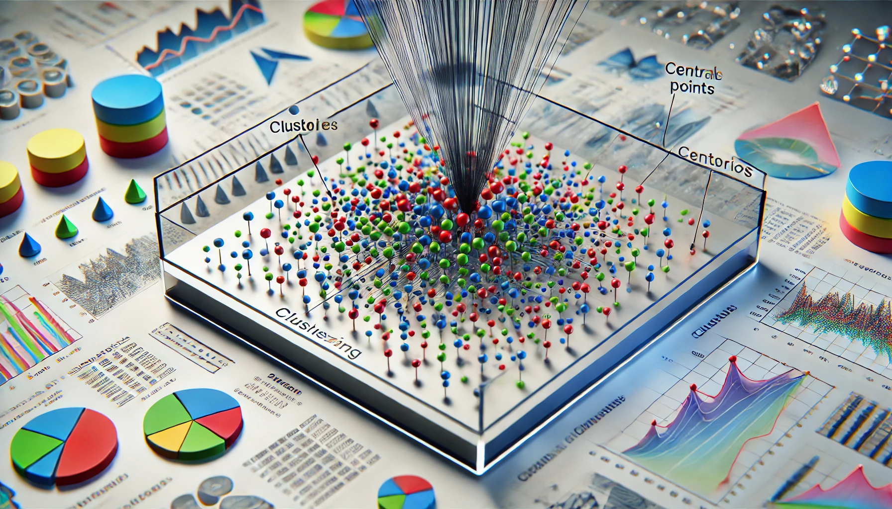

# ***Beyond Supervised Learning (1) - Clustering***



## ***What Is Clustering?***
Have you ever tried to sort your socks after doing laundry but had no labels or pairs to guide you? That’s essentially what **clustering** does. It groups items (or data points) that naturally belong together based on their shared characteristics, without relying on any predefined labels. In other words, **clustering** is an **unsupervised learning** technique: it looks at the data and uncovers hidden structures or patterns on its own.

---

### ***Clustering vs. Supervised Learning***
In **supervised learning** (for example, classification), you train a model on input features $x$ and known labels $y$. Imagine you have a box of animal pictures labeled “cat” or “dog.” A supervised learning model learns from these labels to classify new pictures.

**Clustering** is different. You only have input features $x$ (no labels), and your task is to discover how data points group together naturally. If you plotted the data on a graph, you’d see dots scattered around. A clustering algorithm tries to see where those dots form tight groups. It’s like walking into a party full of strangers: no one has a nametag, but you quickly notice different circles forming—maybe sports fans in one area, music lovers in another.

---

### ***What Does Clustering Do?***
A clustering algorithm looks for hidden structures in the data:
- It finds groups (“clusters”) that are more similar internally than they are to other groups.
- Each cluster contains data points that share certain characteristics, whether that’s size, color, location, or some other property.

For example, if you feed an algorithm the brightness and size of stars in space, it might group them into small stars, medium stars, and giant stars—completely on its own. You didn’t need to tell it what labels to look for; it just discovered these groups by analyzing the similarities.

---

### ***Applications of Clustering***

1. **Grouping News Articles**  
   - Imagine a cluttered news feed covering pandas, space travel, and tech gadgets. A clustering algorithm can neatly group similar stories, helping you browse articles related to the same topic in one place.

2. **Market Segmentation**  
   - Businesses can use clustering to split customers into groups. For instance:  
     - Group 1: Shoppers who love electronics.  
     - Group 2: Shoppers focused on fashion.  
   - Once these groups are identified, companies can tailor promotions or emails for each segment.

3. **DNA Data Analysis**  
   - Geneticists use clustering to find patterns in genetic data. It can reveal how certain genes group together or help identify sub-populations based on shared traits.

4. **Astronomy**  
   - Astronomers use clustering to classify celestial bodies. Whether it’s galaxies, constellations, or clusters of stars, these algorithms help them see structure in the vastness of space.

5. **Image Segmentation**  
   - In computer vision, clustering can group pixels that have similar colors or textures. If you take a photo of a landscape, clustering might divide it into separate regions for sky, mountains, and trees.

---

### ***Why Is Clustering Useful?***
Clustering uncovers **natural structures** in data that might otherwise go unnoticed:

- **In medicine**, clustering patient data can reveal new disease subtypes, paving the way for better-targeted treatments.  
- **In e-commerce**, clustering can group customers with similar purchase histories, making it easier to recommend products they’re likely to buy.

Essentially, clustering helps you see “the big picture.” It’s like discovering that a library’s unmarked books naturally form sections—mystery novels in one pile, biographies in another—just by scanning their contents and noticing the similarities.

---

### ***What’s Next?***
Having a grasp of what clustering is and why it’s powerful, our next step might be to explore specific clustering algorithms. One of the most popular methods is **k-means**, which partitions the data into a user-defined number of clusters. As you dive deeper, you’ll learn how k-means starts with random guesses and iteratively refines the cluster assignments until it finds a good fit.

Clustering is a fascinating way to shine a light on the underlying patterns in your data, whether you’re studying galaxies, customer trends, or even socks without labels. By letting the data speak for itself, you can discover structures and insights that open the door to new understanding and innovation.

---

## ***K-means Intuition***

### ***Have you ever wondered how machines group data points into clusters automatically?***

**K-means** is a popular clustering algorithm that takes an unlabeled dataset and splits it into meaningful groups (clusters). Here’s the process in simple terms:

---

### ***Step 1: Initialize Cluster Centroids***

Imagine you have a dataset of 30 data points. K-means first **randomly** places the initial cluster centroids (the centers of the clusters). For instance, if you want 2 clusters, the algorithm might drop a **red cross** and a **blue cross** somewhere on your plot—purely as a guess.

> These initial guesses don’t have to be perfect; they just give the algorithm a starting point.

---

### ***Step 2: Assign Points to the Nearest Centroid***

Next, each data point is assigned to the centroid it’s closest to:
- Points nearer the **red cross** become part of the **red** cluster.
- Points nearer the **blue cross** become part of the **blue** cluster.

> Conceptually, you’d “paint” each point red or blue based on which centroid is closest.

---

### ***Step 3: Update the Centroids***

After the initial assignment, the centroids are recalculated by taking the **average position** of the points in each cluster:
- The **red** centroid moves to the average location of all the red points.
- The **blue** centroid moves to the average location of all the blue points.

> This step makes the centroids better represent the clusters they belong to.

---

### ***Step 4: Repeat the Process***

Because the centroids have moved, the algorithm needs to **reassign** each point to its closest centroid again. Then it **recomputes** the centroids. This loop continues until the cluster assignments stop changing significantly—meaning the algorithm has **converged**.

It's like a game "둥글게둥글게" in Korea. Do you know "오징어 게임(Squid Game)"?😊

---

### ***Key Insights***

1. **Iterative Refinement**  
   K-means bounces back and forth between **assigning points** to the nearest centroid and **updating centroids** to match their assigned points. This process refines the clusters step by step.

2. **Convergence**  
   The algorithm stops when no further changes occur. In other words, the points remain in the same clusters, or the centroids no longer move.

3. **Final Output**  
   In our example, the dataset might end up split into two clusters (red and blue), each containing points that are close together in space.

---

### **What Makes K-means Powerful?**

- **Simple and Intuitive**  
  K-means is straightforward to understand and implement.
  
- **Fast and Efficient**  
  It handles a variety of datasets without being too computationally heavy.

- **Widely Used**  
  From **image compression** to **market segmentation**, K-means is a go-to algorithm for many clustering tasks.

---

### **Optional: A Peek at the Math**

If you’re curious, K-means tries to minimize the sum of squared distances from each point $x_i$ to its assigned centroid $\mu_k$. Mathematically, it seeks to solve:

$$
\min \sum_{k=1}^{K} \sum_{x_i \in C_k} \|x_i - \mu_k\|^2.
$$

At each iteration:

1. **Assign each point** to the cluster whose centroid it’s nearest to (in Euclidean distance):  

$$
C_k^{(t)} = \{ x_i \mid \arg\min_{1 \le j \le K} \|x_i - \mu_j^{(t)}\|^2 = k \}.
$$

2. **Recalculate each centroid** by taking the mean of all points in its cluster:  

$$
\mu_k^{(t+1)} = \frac{1}{\lvert C_k^{(t)} \rvert} \sum_{x_i \in C_k^{(t)}} x_i.
$$

This process repeats until convergence.

---

In summary, K-means transforms a **completely unlabeled** dataset into well-organized clusters by iteratively assigning points to the nearest centroid and then moving the centroids to the average position of their assigned points. Over multiple rounds, the clusters become more cohesive and meaningful—revealing hidden structures in the data.

---

## ***K-means Algorithm***

### ***Ever wondered how machines uncover groups in unlabeled data?***

**K-means** is one of the most popular clustering algorithms, and it excels at grouping data points—even when no predefined labels exist. Here’s an overview of the steps it follows.

---

### ***Step 1: Randomly Initialize Cluster Centroids***

We start by choosing $K$ cluster centroids ($\mu_1, \mu_2, \dots, \mu_K$) at random. Each centroid is a vector matching the dimension of the input data points.

- For instance, if each data point has two features ($n = 2$), each centroid is also a 2D vector:
  - Example: In customer segmentation, a data point might be $(age, income)$ = $(25, 50000)$
  - The centroid would also be a pair of numbers, like $(30, 45000)$, representing the average age and income of a cluster
  - These points can be visualized on a 2D plot where:
    - X-axis represents the first feature (age)
    - Y-axis represents the second feature (income)

Common examples of 2D feature pairs include:
- Height and weight for size clustering
- Latitude and longitude for geographic clustering
- Price and square footage for real estate clustering
- Temperature and humidity for weather pattern clustering

> **Note**: While we often visualize K-means in 2D for simplicity, the algorithm works just as well with higher dimensions ($n > 2$). For instance, Netflix might cluster movies using hundreds of features!
- These initial centroids are guesses for where each cluster’s center might lie.

---

### ***Step 2: Assign Points to the Nearest Centroid***

For every data point $x^{(i)}$, determine its closest centroid by minimizing the squared distance:

$$
c^{(i)} = \arg\min_k \| x^{(i)} - \mu_k \|^2
$$

Where:
- $\| x^{(i)} - \mu_k \|^2$ is the squared distance between point $x^{(i)}$ and centroid $\mu_k$.
- $c^{(i)}$ indicates which centroid $x^{(i)}$ is assigned to.

> **Example**: If $x^{(1)}$ is closest to centroid 1, then $c^{(1)} = 1$. If $x^{(12)}$ is closest to centroid 2, then $c^{(12)} = 2$.

---

### ***Step 3: Update the Centroids***

Once all points have been assigned, recalculate each centroid by taking the average of the points in its cluster. For centroid $\mu_k$, this update rule is:

#### ***Detailed Calculation Process***

1. **For Each Cluster**
   - **Red Cluster**: Calculate the mean coordinates of all red points
   - **Blue Cluster**: Calculate the mean coordinates of all blue points

2. **Mathematical Expression**  
   For each centroid $\mu_k$:
   ```
   μₖ = (x₁ + x₂ + ... + xₙ) / n
   ```
   where x₁, x₂, ..., xₙ are the points in cluster k, and n is the number of points.

3. **Example Calculation**
   If cluster 1 contains three 2D points:
   - Point 1: (1, 2)
   - Point 2: (2, 4)
   - Point 3: (3, 0)
   
   The new centroid would be:
   - X coordinate: (1 + 2 + 3) / 3 = 2
   - Y coordinate: (2 + 4 + 0) / 3 = 2
   - Therefore, new centroid = (2, 2)

In other words, $\mu_k$ moves to the mean position of its assigned points.

> **Special Case**: If a cluster receives no points, you can remove it (reducing the count to $K - 1$) or reinitialize its centroid randomly.

---

### ***Step 4: Repeat Until Convergence***

Repeat Steps 2 and 3—reassigning points and updating centroids—until the centroids stabilize (i.e., they no longer move substantially) or the cluster memberships don’t change.

### ***Convergence***

At convergence:
- No points shift from one cluster to another.
- Centroids stay fixed because they are already at the average of their assigned points.

---

### ***How K-means Handles Various Data Distributions***

K-means performs well on data that’s either clearly separated or somewhat overlapping.

#### ***1. Well-Separated Clusters***
If the data falls neatly into groups, K-means is very effective. For instance, if you specify $K = 3$ for a dataset with three natural clusters, it usually finds those three groups accurately.

#### ***2. Overlapping Clusters***
In real-world data, clusters often aren't perfectly separated—they tend to overlap. Let's understand this with some practical examples:

**Clothing Sizes Example:**
- Imagine plotting people's height (x-axis) and weight (y-axis)
- You'll see that people's measurements form continuous clouds of points
- Even though there's overlap, K-means can still create useful size categories:
  - Small: People clustering around 160cm/55kg
  - Medium: People clustering around 170cm/70kg
  - Large: People clustering around 180cm/85kg

**Why It Still Works:**
1. K-means draws boundaries between overlapping groups by finding the midpoint between centroids
2. Even with overlap, the algorithm identifies the "most likely" group for each point
3. The resulting clusters are still practical for business decisions

**Real-World Applications with Overlap:**
- Age groups in marketing (young adult, middle-aged, senior)
- Income brackets (low, medium, high income)
- Customer engagement levels (occasional, regular, frequent buyers)

> **Note**: While overlap might seem like a problem, it often reflects the natural continuity in real data. K-means handles this gracefully by creating clear decision boundaries.

---

### ***What If K-means Produces Empty Clusters?***

An edge case arises if one cluster gets no points during an iteration. Possible solutions:
- **Option 1**: Remove the cluster, decreasing $K$ by 1.
- **Option 2**: Randomly reinitialize its centroid and continue.

---

### ***Key Takeaways***

1. **Main Steps**  
   - Randomly choose centroids.  
   - Assign each point to the closest centroid.  
   - Recompute centroids based on these assignments.  
   - Iterate until convergence.

2. **Simple Yet Effective**  
   - K-means is straightforward but powerful for many real-world applications, from segmenting customers to compressing images.

3. **Adapts to Various Data**  
   - Works for both clearly separated and moderately overlapping clusters.

In the next section, we’ll explore the **cost function** that K-means optimizes, revealing why it converges and how it achieves a good clustering solution. Stay tuned!

---

## ***Optimization Objective***

### ***Have you ever wondered how we measure the “goodness” of clusters in K-means?***

When we talk about clustering, we often focus on **grouping unlabeled data** into natural clusters. But there’s an important question: **How do we know if the clusters we end up with are actually good?** In earlier lessons on supervised learning, we discussed **cost functions**—like measuring errors between predictions and true labels—to guide the training process. Interestingly, **K-means** also uses a special cost function (sometimes called the “distortion function”) to measure how well it has grouped the data. By understanding this cost function, you’ll see **why** K-means converges and **how** it updates cluster assignments and centroids.

---

### ***1. Revisiting K-means in Simple Terms***

Before diving into the math, let’s recall how **K-means** works:

1. **Pick K random centroids** (the initial “centers” of your clusters).
2. **Assign each point** to the closest centroid.
3. **Move the centroids** to the average position of the points in each cluster.
4. **Repeat** until nothing changes (or changes very little).

While this might sound straightforward—almost like a game of repeatedly shuffling and repositioning—K-means is actually trying to **minimize** something specific: a cost function that measures how “far apart” points in each cluster are from their respective centroid.

---

### ***2. The K-means Cost Function (“Distortion”)***

Let’s say we have:
- $m$ data points (e.g., $x^{(1)}, x^{(2)}, \dots, x^{(m)}$).
- $K$ clusters, with cluster **centroids** labeled $\mu_1, \mu_2, \dots, \mu_K$.
- $c^{(i)}$ denotes the **cluster index** that data point $x^{(i)}$ is assigned to. For example, if $c^{(i)} = 2$, it means $x^{(i)}$ belongs to cluster 2, whose centroid is $\mu_2$.

The cost function $J$ (sometimes called **distortion**) is:

$$J = \frac{1}{m} \sum_{i=1}^{m} \| x^{(i)} - \mu_{c^{(i)}} \|^2$$

**What does it mean?**  
- For each data point $x^{(i)}$, measure its distance to its cluster’s centroid $\mu_{c^{(i)}}$.
- Square that distance, then add all of these squared distances up.
- Finally, take the average by dividing by $m$.

This number tells us **how tightly** each cluster’s points are huddled around their centroid. **Lower** is better—tight clusters mean the algorithm has done a good job grouping similar points together.

#### ***Analogy: Organizing Your Room***

Imagine you’re cleaning your room and you have piles of different items: books, clothes, and toys. Each pile is like a **cluster**, and the “centroid” is a designated spot where that pile belongs (a bookshelf, a closet, or a toy bin). The cost function measures **how far** each item is from its designated spot. The **better** you organize, the **smaller** the **total distance** (or “mess”) in your room. 

---

### ***3. Why the Two Steps of K-means Minimize This Cost***

#### ***Step 1: Assign Each Point to the Nearest Centroid***

- **Goal**: Fix the centroids, and figure out the best cluster for each point.
- By assigning every point to its **closest** centroid, you make each term $\| x^{(i)} - \mu_{c^{(i)}} \|^2$ as small as possible.  

**Example**  
Imagine you have two possible “spots” (centroids) to place a book—on the **top shelf** (centroid 1) or the **bottom shelf** (centroid 2). If the book is physically closer to the bottom shelf, you’d minimize the distance by assigning it to the **bottom shelf**. It’s the same logic: **choose the nearest centroid** to lower that part of the cost.

#### ***Step 2: Move the Centroids to the Mean of Their Assigned Points***

- **Goal**: Fix which cluster each point belongs to, and figure out the best place to put the centroid.
- The **mean** (average) position of the points in a cluster **minimizes** the total squared distance from each point to the centroid.

**Example**  
Suppose two points are at positions `1` and `11` on a number line, and your centroid can be placed anywhere along that line.  
- If you place it at position `2`, the sum of squared distances might be big (since the distance to `11` is large).  
- If you place it at `11`, the distance to `1` is large.  
- If you put the centroid **exactly in the middle** (position `6`), you minimize these total squared distances.  

Similarly, in more dimensions (like 2D or 3D), the centroid that **minimizes** the sum of squared distances is the **mean** of all the points in that cluster.

---

### ***4. Convergence: Why K-means Eventually Stops***

Each time you alternate between:
1. **Assigning points** to their nearest centroid.
2. **Recomputing centroids** as the average of their assigned points.

…the total cost $J$ either **gets smaller or stays the same**. It **can’t increase** because each step is designed to reduce or keep the cost unchanged. Eventually, the cost stops changing and you have **convergence**.

- **No more shifting** of points between clusters.
- **Centroids** stay fixed where they are because they’re already at the best spot for that cluster.

#### ***When to Stop Early?***
In practice, if $J$ is decreasing **very slowly**, we might decide it’s “good enough” and stop to save time. This is similar to **stopping early** in gradient descent when the improvements become tiny.

---

### ***5. Checking for Good Clusters: Using Multiple Initializations***

K-means can sometimes get stuck if it starts with “unlucky” random centroids. One practical trick is:
1. **Run K-means multiple times** with different random initial centroids.
2. **Compute the cost $J$** for each run.
3. **Choose the result** with the **lowest** final cost.

This approach often finds **better** clusters. Think of it like trying multiple ways to organize your room until you find the layout that feels tidiest (i.e., smallest total mess).

---

### ***6. Extra Examples to Spark Understanding***

1. **Grouping Candies**
   - Points = individual candies (each candy’s “features” might be sugar level, color, size).
   - Centroids = average candy in each cluster.
   - Cost function $J$ = how close each candy is to its cluster’s “representative candy.”

2. **Sorting Library Books**
   - Points = books (features could be topic relevance, number of pages).
   - Clusters = shelves or sections.
   - Minimizing $J$ = placing each book near a shelf “center” that best represents its theme or content.

3. **Classifying Animals by Traits**
   - Points = animals, with features like weight, height, diet.
   - Centroids = “typical” animal in each group.
   - A lower $J$ means animals are well-grouped (e.g., birds in one group, large mammals in another).

---

### ***7. Key Takeaways***

1. **Cost Function (Distortion) Matters**  
   - $J = \frac{1}{m} \sum_{i=1}^{m} \| x^{(i)} - \mu_{c^{(i)}} \|^2$ measures how well points are grouped around their centroids.

2. **Two-Step Algorithm Minimizes $J$**  
   - **Assign** each point to the nearest centroid (reduces distance).  
   - **Recompute** centroid by averaging the assigned points (further reduces distance).

3. **Guaranteed Convergence**  
   - Cost cannot go up, so eventually, the algorithm settles into a stable solution.

4. **Multiple Initializations**  
   - Helps avoid “bad starts” and find the best overall clustering.

By seeing how **K-means** uses a **cost function** at its core, you gain insight into *why* the algorithm converges, *why* its two-step process makes sense, and *how* to check if it’s performing well. Whether you’re clustering candies, books, or cosmic objects, the idea remains the same: **group things by bringing similar items close together**, and keep refining until no further improvement can be made.

---

## ***Initializing K-means***

### ***Have you ever wondered how we pick the starting points (centroids) for K-means?***

In K-means clustering, **random initialization** is the very first step. Instead of picking centroids arbitrarily, we can **randomly select** some of our data points and place centroids there. This might seem like a small detail, but it has a **major** effect on the clusters you end up with. If you place the centroids in “unfortunate” spots, you can wind up with **less optimal** clusters. On the other hand, choosing them wisely—often by **trying multiple random placements**—can lead to **better** results.

> **Remember**: We typically set $K < m$, meaning the number of centroids $K$ should be less than the number of data points $m$. Otherwise, we’d have more centroids than data points, which wouldn’t make much sense!

---

### ***1. Randomly Choosing Initial Centroids***

One common approach is:
1. **Randomly pick $K$ examples** from your dataset.
2. **Set those examples** as your initial centroids $\mu_1, \mu_2, \dots, \mu_K$.

Think of it like **plucking** a few items out of a big collection and calling them the “reference points” for your clusters. Then, the K-means algorithm proceeds as usual:
- Assign each data point to its **closest** centroid.
- **Update** each centroid to the average position of its assigned points.
- **Repeat** until everything settles.

#### ***Analogy: Decorating a Room***
- You have $m$ decorations and want $K$ different “zones” (like “painting zone,” “flower zone,” etc.).
- If you **randomly place** your first few decorations in different spots, those are your “zones.” Then you add similar decorations near each zone and keep rearranging to minimize overall clutter.

---

### ***2. The Risk of Unlucky Starts***

Just because we pick random points as centroids doesn’t mean they’ll be **good**. Sometimes the random picks can clump together, producing **lopsided** or **overlapping** clusters. This happens if:
- Two (or more) centroids end up close to each other in the same region.
- A centroid gets placed far away from where most data points are.

In these cases, K-means might **converge** to a **local minimum**—a situation where the clusters stabilize but aren’t the best possible grouping.

> **Example**  
> - If you place your “flower zone” and “painting zone” both in the same corner of a room, you might never properly separate the “painting” items from the “flower” items. You end up with a **local** arrangement that’s not as organized as it could be.

---

### ***3. Multiple Random Initializations***

To avoid getting stuck with one bad arrangement, a **simple trick** is to run K-means **multiple times** with **different** random starts:
1. **Initialize** centroids randomly and **run** K-means to convergence (get a final clustering and cost $J$).
2. **Repeat** this process many times (50, 100, or even 1,000 times).
3. **Compare** the final cost $J$ for each run.
4. **Pick** the clustering that gives the **lowest** cost (i.e., the tightest clusters).

This boosts your chances of finding a **better** or even the **best** local minimum.

#### ***Analogy: Multiple Room Layouts***
- You rearrange your room **multiple times** with different ideas for where the main items should go.
- After each attempt, you measure how “messy” or “cramped” the space still feels.
- You **choose** the arrangement (initial placement + final layout) that gives the **most comfortable** or **spacious** feel.

---

### ***4. Tying It All Together***

1. **Pick Initial Centroids Carefully**  
   - Even though it’s random, ensure $K < m$ and consider multiple tries.

2. **Be Aware of Local Minima**  
   - A single random attempt might give a *subpar* clustering.

3. **Run Multiple Times**  
   - Quickly re-run K-means with different starts.  
   - Pick the **lowest-cost** result.

4. **Better Clusters Overall**  
   - This approach often yields **more natural** groupings and avoids “unlucky” initial placements.

By understanding how **random initialization** shapes the outcome of K-means, you’ll be better prepared to **find** good clusters. Rather than settling for the first result, **run it multiple times**—it’s a simple yet powerful way to uncover clearer patterns in your data.

---

## ***Choosing the Number of Clusters***

### ***Have you ever wondered how many clusters you actually need?***

When applying K-means, one of the **toughest questions** is deciding the right number of clusters $K$. Should you use 2, 3, 5, or 10? Because there are **no labels** guiding you (as in supervised learning), there’s no absolute answer. Different people could look at the **same dataset** and see either 2 clusters or 4 clusters—and both can be valid from different perspectives. In other words, **clustering is naturally ambiguous!**

---

### ***1. Why 'K' Is Ambiguous***

1. **No “Correct” Labeling**  
   In supervised learning, you compare predictions to known labels. In clustering, there’s **no ground truth** telling you the “right” number of clusters. If you show the same scatter plot to 10 people, you might get 10 different answers.

2. **Data Complexity**  
   Real-world data can have overlapping or vague boundaries. Two clusters might appear to be a single broader cluster, or you could split one large group into smaller sub-clusters. There’s **no universal rule** saying one approach is better than the other.

---

### ***2. The Elbow Method***

A commonly mentioned approach to choosing $K$ is the **elbow method**:
1. **Run K-means** for several values of $K$ (e.g., 1 to 8).
2. **Plot** the cost function $J$ (distortion) against $K$.
3. **Look** for an “elbow” or **bend** in the plot—where $J$ stops decreasing rapidly and begins to level off.

```text
   Cost J
     |     \
     |      \
     |       \   <-- elbow around K=3
     |        \
     |         \
     +-------------------
         1  2  3  4  5 ...
            # of clusters
```

- If there’s a **clear elbow**, that $K$ might be a sensible choice.
- But often, the plot **decreases smoothly**, with **no** obvious elbow point. Or you might see multiple subtle bends.

> **Key Caution**: Simply **minimizing** $J$ pushes you to choose **larger** $K$ (because more clusters nearly always lower the distortion). This doesn’t necessarily yield the **most useful** grouping!

---

### ***3. Why Minimizing 'J' Alone Isn’t Enough***

If you only want the **smallest possible** cost $J$, you could just **increase** $K$ until each point is nearly its own cluster. But that defeats the purpose of finding **meaningful** clusters. More clusters:
- **Reduces** $J$ but
- Can **complicate** your interpretation or application (e.g., you might not want 30 different categories if 3 main ones suffice).

---

### ***4. Tailoring 'K' to Your Needs***

Because there’s no perfect formula, the **best** approach is to **evaluate K-means in 'context'**—that is, see how well different values of $K$ serve your ultimate goal (the “downstream purpose” of clustering).

#### ***T-shirt Sizing Example***
- Suppose you cluster people by height and weight to decide **t-shirt sizes**.
- $K=3$ might give you **S, M, L**.
- $K=5$ might give you **XS, S, M, L, XL** for a more precise fit.
- **Trade-off**:  
  - Fewer sizes (3) simplifies manufacturing but might fit fewer people perfectly.  
  - More sizes (5) fits more people well but **increases cost** and complexity.

In this scenario, you’d compare the **benefits** (better fit) vs. the **drawbacks** (production cost of more sizes) and choose the $K$ that works best for your business.

#### ***Image Compression Example***
- If you cluster colors in an image, you can **compress** it by storing only the **cluster centroid colors**.
- **Lower $K$** means fewer colors, higher compression, but the image might look blotchy.
- **Higher $K$** keeps more color details but makes the file bigger.  
- You’d try different $K$ values to see which **balance** of quality vs. file size suits your needs.

---

### ***5. Key Takeaways***

1. **Ambiguity is Normal**  
   There isn’t a single “correct” $K$. Different clusterings can all make sense depending on how you view the data.

2. **Elbow Method Can Guide You, But...**  
   - You might **not** see a clear elbow in many practical datasets.  
   - Minimizing $J$ alone often suggests an overly large $K$.

3. **Downstream Purpose**  
   - Ask yourself: *Why* am I clustering?  
   - **Use** that purpose (e.g., t-shirt sizing, image compression) to decide if having fewer clusters (simple) or more clusters (detailed) is more beneficial.

By considering **both** the data’s structure and your practical goals, you can **experiment** with different $K$ values to discover the right balance for your clustering task. After all, in unsupervised learning, **what matters most** is whether your chosen clusters serve your real-world purpose—whether it’s making better t-shirt sizes, compressing images, or revealing hidden patterns you want to explore.