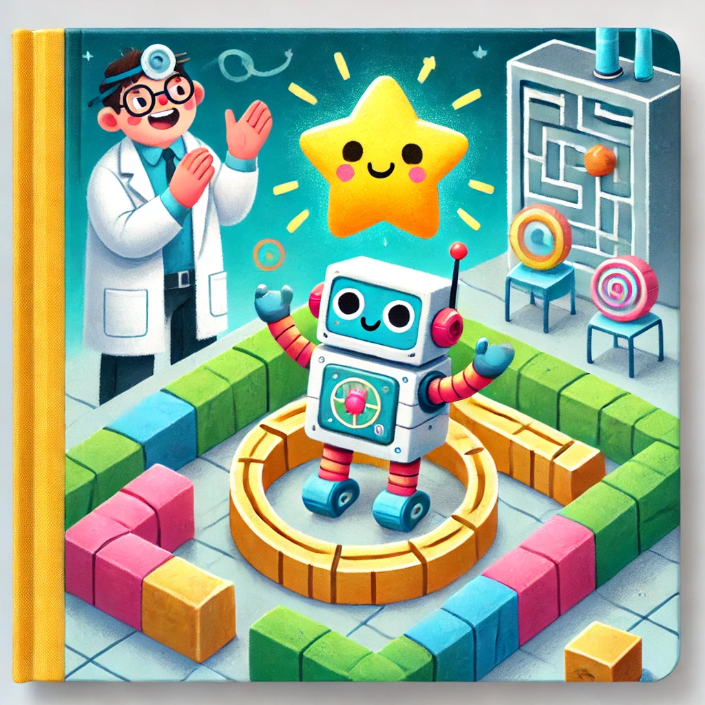

# ***Beyond Supervised Learning (17) - Reinforcement Learning Introduction***  

## ***A Story: Leo the Learning Robot***

Once upon a time, in a world not so different from ours, there was a curious little robot named **Leo**. Leo lived in a laboratory full of gadgets and wires, but his greatest desire was to explore the outside world. However, there was a big problem: Leo didn’t know how to move or navigate without bumping into walls or getting stuck. 

One day, the scientist who created Leo had an idea. “Leo, you’re going to learn through a method called **Reinforcement Learning**!” she said excitedly.

Leo tilted his metal head. “Reinforcement Learning? What’s that?” he asked in his robotic voice.

The scientist explained, “It’s simple. Every time you do something good, like moving closer to your goal, I’ll give you a reward. But if you do something bad, like crashing into a wall, you’ll get a penalty. Over time, you’ll figure out how to make the best choices.”

Leo’s eyes lit up. “I want to try!”

### The First Step

The scientist set up a maze for Leo. At the end of the maze was a shiny golden star—Leo’s reward. She explained, “Leo, your goal is to reach the star. If you move closer to it, you’ll get points. But if you hit a wall, you’ll lose points.”

Leo started exploring. At first, he bumped into walls and spun in circles. The scientist gently said, “That’s okay, Leo. Every mistake is a chance to learn.”

Then something magical happened. After many trials, Leo began to understand the rules of the maze. He avoided walls, took smarter turns, and finally reached the golden star.

The scientist clapped. “Great job, Leo! You’ve just used Reinforcement Learning to figure out the best way through the maze.”

### Flying High

As Leo grew more confident, the scientist gave him bigger challenges. One day, she showed Leo a small helicopter. “Leo, can you learn to fly this?”

Leo was nervous. “Flying is so hard! What if I crash?”

The scientist smiled. “Don’t worry. If you fly well, you’ll earn rewards. If you tilt too much or lose control, you’ll get penalties. Over time, you’ll learn to balance and even do tricks.”

Leo climbed into the helicopter and took the controls. At first, it was a disaster. The helicopter wobbled, spun, and crashed into a soft pile of cushions the scientist had prepared. But Leo didn’t give up. Each time, he learned a little more.

After weeks of practice, something incredible happened. Leo hovered steadily in the air. Then he flew in a straight line. And finally, he performed a loop-the-loop, earning the scientist’s cheers.

### The Mars Adventure

One day, the scientist brought Leo a new challenge. “Leo, we’ve been invited to help explore Mars! There’s a rover that needs to collect valuable rocks, but it doesn’t know where to go. Can you teach it?”

Leo eagerly agreed. Together, they programmed the rover to use Reinforcement Learning. The scientist explained, “Some rocks are more valuable than others. The rover will get a big reward for finding the rarest rocks and smaller rewards for less interesting ones. But if it wastes time or goes in circles, it will lose points. We’ll train it by letting it explore and learn.”

The rover began its mission. At first, it wandered aimlessly, collecting random rocks. But after many tries, it figured out the best routes to find the most valuable samples. Thanks to Leo and the scientist, the rover completed its mission and sent back amazing discoveries from Mars.

### The Lesson

Leo had learned so much through Reinforcement Learning. Whether it was navigating mazes, flying helicopters, or helping a rover on Mars, the process was always the same:

1. **Try different actions** (even if they lead to mistakes).
2. **Learn from rewards and penalties**.
3. **Keep improving until the best solution emerges**.

Leo realized that mistakes weren’t failures—they were stepping stones to success. And the scientist smiled, knowing that Leo’s journey was just the beginning of what Reinforcement Learning could achieve.

## The Moral of the Story

**Reinforcement Learning teaches us that every mistake is a chance to grow**. By trying, learning, and adapting, we can solve even the hardest problems—just like Leo the Learning Robot. So next time you face a challenge, remember Leo’s lesson: keep exploring, and the rewards will come!

---

**Have you ever seen a self-driving robot navigate a maze or a computer program learn to master a video game, and wondered how it figures everything out on its own?** That’s the magic of **Reinforcement Learning (RL)**. Instead of training on labeled examples (like in supervised learning), RL algorithms learn by **trying different actions** and **receiving rewards or penalties**. Think of it like training a puppy: give it a treat when it does something good, gently correct it when it misbehaves, and over time it’ll figure out how to behave properly.  

In this guide, we’ll explore the basics of RL and see how it can handle complex tasks—like making a helicopter fly upside down!

---

## ***What is Reinforcement Learning?***

Reinforcement learning is a **branch of machine learning** in which an agent (like a robot, a game-playing program, or even a stock-trading bot) interacts with an **environment** and tries to maximize some notion of **cumulative reward**.

1. **No Labeled Data**  
   - Unlike supervised learning (where you might have images labeled “cat” or “dog”), RL doesn’t rely on labeled examples.  
   - Instead, it works through **trial and error**.

2. **Rewards and Penalties**  
   - If the agent does something beneficial (like balancing a robot so it doesn’t fall), it gets a **reward**.  
   - If it does something undesirable (like crashing a drone), it gets a **penalty** (negative reward).

3. **Goal**  
   - The agent’s goal is to **maximize** the total reward over time. This leads it to discover clever strategies—sometimes strategies we humans never explicitly programmed.

Think of how an **animal** learns. A mouse in a maze might stumble around until it finds cheese (reward). Over repeated attempts, it remembers which corridors lead to cheese faster, refining its behavior on each trial.

---

## ***Flying a Helicopter with RL***

### **1. Why Helicopters are Challenging**

Helicopters are notoriously **hard to control**:
- They have multiple controls (two joysticks, collective pitch, tail rotor, etc.).
- Small mistakes can escalate, leading to crashes.
- The flight environment (wind, weather, terrain) is **unpredictable**.

### **2. Supervised vs. Reinforcement Approach**

- **Supervised Learning**:  
  - You’d have to gather a large dataset of “correct” joystick movements from a **human pilot** in countless scenarios.  
  - But real flight data may be incomplete or ambiguous—nobody can demonstrate precisely every possible mid-air situation.  

- **Reinforcement Learning**:  
  - The helicopter’s onboard computer tries different joystick movements (actions).  
  - It measures how well it’s doing (reward for stable flight, penalty for unsafe maneuvers).  
  - Over time, it **discovers** how to keep itself steady, and eventually, it might learn advanced maneuvers like loops or flying upside down.

It’s like calibrating a **complex machine**. In classical engineering, you might try to write a huge control equation. In RL, you let the machine “twiddle its knobs,” see what works (reward) or not (penalty), and converge on a robust solution.

---

## ***Mars Rover Example: A Simpler RL Scenario***

Let’s consider a more down-to-earth (or rather, *out-of-earth*) example: a **Mars rover** that can be in one of six states (positions on the Martian surface).

- **States 1 through 6**:  
  - *State 1*: Contains very valuable rocks ($\text{reward} = 100$).  
  - *State 6*: Has moderately valuable rocks ($\text{reward} = 40$).  
  - *States 2–5*: Not much interesting science to gain ($\text{reward} = 0$).

### **1. Actions**
- From each state, the rover can **move left** or **move right** (if possible).
- Once it reaches **State 1** or **State 6** (the *terminal* states), the day’s mission ends.

### **2. Decision-Making**
- If starting at **State 4**, the rover can either go left (possibly reach State 1 for 100 points) or right (possibly reach State 6 for 40 points).
- A **greedy** approach would lead it to prefer left if it’s not too far away from State 1.

We can see this as a **graph** with nodes (states) connected by edges (left/right moves). The rover chooses paths that yield the highest final “score,” reminiscent of shortest-path or maximum-flow problems—except it’s maximizing reward rather than minimizing distance.

---

## ***The Return in Reinforcement Learning***

### **1. Why We Use a Discount Factor**

Sometimes, an agent gets a reward **immediately**, sometimes it might only get it **far into the future**. RL uses a concept called the **return**, which is a **sum** of rewards over time, but **discounted** so that rewards received sooner are considered more valuable.  

$$
G = R_1 + \gamma R_2 + \gamma^2 R_3 + \dots
$$

- $R_t$: reward at time $t$.  
- $\gamma$: discount factor, typically $0 \le \gamma < 1$. A smaller $\gamma$ places less importance on long-term rewards.

In **economics**, a dollar **today** is worth more than a dollar next year. The discount factor is like interest or inflation: it encourages the agent to value **immediate** gains more than distant ones—but not to completely ignore future rewards.

---

## ***Policies: How Agents Choose Actions***

A **policy** ($\pi$) tells the agent what to do in each state:  

$$
\pi(s) = a
$$

- For state $s$, the policy picks action $a$.  
- In the Mars rover example:
  - $\pi(\text{State 2})$: go left.  
  - $\pi(\text{State 5})$: go right.

### **Finding the Best Policy**

The entire goal of RL is to figure out the policy that **maximizes** the expected return. Sometimes, the best policy might do “nothing” for a few steps to avoid dangers; other times, it might take a risky move if it yields a bigger reward in the long run.

An **animal** might choose to rest or hide (safe, small reward) vs. searching for food in dangerous territory (risky, but big potential reward). The “optimal policy” balances these strategies to maximize survival (long-term reward).

---

## ***Applications of Reinforcement Learning***

1. **Robotics**  
   - Teaching a robot dog to climb stairs.  
   - Manipulating objects with robotic arms, learning by trial which angle and force to apply.

2. **Game Playing**  
   - Algorithms that beat humans at chess, Go, or Atari games.  
   - They explore moves, see which yield wins (rewards), and refine strategies.

3. **Factory Optimization**  
   - Scheduling machines, routing parts along assembly lines.  
   - Minimizing downtime or resource usage can be framed as a reward.

4. **Finance**  
   - Deciding how to allocate assets or execute trades.  
   - Rewards can be profit, and penalties can be losses or transaction costs.

5. **Energy Management**  
   - RL can control HVAC systems in large buildings to minimize energy while maintaining comfort.  
   - Rewards: energy savings, occupant satisfaction.

RL is used to control **fusion reactors** in research settings, adjusting magnetic fields in real time to keep plasma stable—a highly complex environment that’s very hard to program by hand.

---

## ***Enriching the Helicopter Example***

Let’s revisit the helicopter:

1. **State** ($s$):  
   - 3D position, orientation, rotational speeds, wind velocity, etc.

2. **Actions** ($a$):  
   - Adjust each joystick axis: pitch, roll, throttle, collective, tail rotor pitch, etc.

3. **Reward Function** (R(s)):  
   - Large positive reward for stable or desired flight paths (like hovering or flipping correctly).  
   - Negative reward (penalty) for drifting off course, losing altitude unexpectedly, or crashing.

Over many practice flights (virtual simulations or carefully monitored real flights), the RL algorithm correlates which joystick maneuvers consistently lead to **fewer crashes** and **more stable flight**. Eventually, it can learn extremely advanced aerobatics—sometimes even surpassing what a **human pilot** can do consistently.

The environment can be seen as a **Markov Decision Process (MDP)**, where each next state depends only on the current state and action. RL’s job is to find a policy that **maximizes** the sum of discounted rewards in that MDP.

---

## ***Why Reinforcement Learning is So Exciting***

- **General-Purpose**: In principle, RL can learn **any** task that can be framed with states, actions, and rewards—even if we can’t analytically solve it.  
- **Adaptability**: If conditions change (a new environment or new constraints), the RL system can continue learning.  
- **Surprising Solutions**: RL agents sometimes come up with creative or **unexpected** strategies that humans might never have envisioned.

However, it’s not always the default choice:
- **Data Hungry**: RL may need many trials (which can be expensive or dangerous—like crashing helicopters).  
- **Complex Reward Design**: Designing a good reward function is tricky. If the reward signal is poorly defined, the agent might “cheat” or learn unintended behaviors.  
- **Stability and Convergence**: RL algorithms can be unstable or slow to converge, especially in high-dimensional or continuous-action spaces.

RL can be seen as a powerful iterative method that might require a lot of “samples” from the environment—akin to a **Monte Carlo** approach. If the environment is complex, you need many samples to approximate the best policy reliably.

---

## ***Key Takeaways***

1. **Reinforcement Learning**: A method where agents learn by **interacting** with an environment—receiving rewards or penalties, no labeled “correct” answers needed.  
2. **States, Actions, Rewards**: The building blocks of RL.  
3. **Return and Discount Factor**: Helps agents evaluate sequences of rewards over time, prioritizing near-term gains but not ignoring future benefits.  
4. **Policies**: The agent’s “strategy”—a map from states to actions—that aims to **maximize** total (discounted) reward.  
5. **Broad Applications**: Robotics, games, finance, energy, and beyond—any scenario with trial, feedback, and a measurable notion of success.

**Reinforcement Learning** breaks free from the constraints of supervised data, letting machines discover behaviors we might not anticipate. Whether it’s a Mars rover, a robotic puppy, or a helicopter pilot, RL teaches them step by step—through successes and mistakes—until they triumph in their tasks. The field continues to evolve rapidly, promising ever more sophisticated, **self-taught** machines and robots in the future.