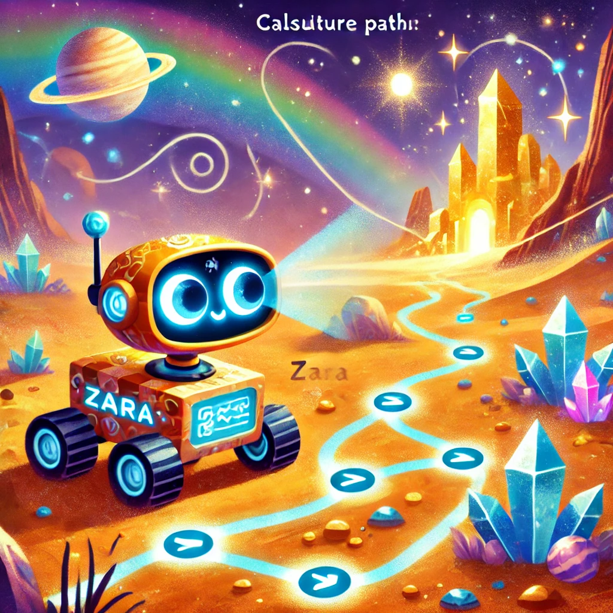

# ***Beyond Supervised Learning (18) - Reinforcement Learning: State-Action Value Function***

## ***A Story: Zara the Curious Explorer***

Once upon a time, in a faraway galaxy, there was a small, adventurous rover named Zara. Zara lived on Planet Exploreon, where every day was a chance to uncover hidden treasures. But Zara had a problem: she didn’t know how to make the best choices to collect the most valuable treasures. 

One day, her creator, Professor Bright, decided to teach her about something called the **state-action value function**. “Zara,” the professor said with a smile, “I’m going to show you how to think ahead and choose the best actions. This way, you’ll always know which paths lead to the biggest rewards.”

### ***The Big Decision***

Planet Exploreon had six special locations:
1. **Crystal Cave** (state 1): A place full of sparkling crystals worth 100 points.
2. **Golden Cliff** (state 6): Shiny but not as valuable, worth 40 points.
3. Four other states (2, 3, 4, 5): They were just ordinary plains with no immediate treasure (0 points).

Professor Bright explained, “Zara, at each location, you can either move left or right. But not all paths are equally good. Your job is to figure out which direction leads to the highest rewards, not just immediately, but in the long run.”

Zara nodded. “How do I decide, Professor?”

### ***The Magic of Q-Values***

“I’ll teach you about **Q-values**,” the professor replied. “Think of them as your guide to the future. Each Q-value tells you how good it is to take a certain action from a certain place.”

Professor Bright pulled out a glowing chart and said, “Let’s calculate an example. Suppose you’re in state 2 and can go left or right:

- If you go **Left**, you’ll reach the Crystal Cave (state 1) quickly, earning 100 points.
- If you go **Right**, you’ll wander around and eventually end up at the Golden Cliff (state 6) for only 40 points.

Which path do you think is better?”

Zara’s gears whirred as she thought. “Going left to the Crystal Cave seems better because 100 points is more than 40.”

“Exactly!” said the professor. “And here’s how we calculate the Q-values for these choices:”

“The higher the Q-value, the better the action!”

### ***Zara Learns to Decide***

Professor Bright set Zara loose on the plains to practice. At first, Zara hesitated at every decision point, unsure which way to go. But as she calculated more Q-values, her choices became smarter:

- In state 2, she always went left to reach the Crystal Cave.
- In state 4, she sometimes considered going right if the Golden Cliff was closer.

Zara realized that every decision depended not just on the immediate reward but also on what lay ahead. “I’m learning to think about the future, Professor!” she exclaimed.

### ***The Unexpected Storm***

One day, a dust storm swept across Exploreon, making Zara’s movements unpredictable. Sometimes when she tried to move left, the wind pushed her right instead. Zara panicked. “What do I do now?”

The professor reassured her. “This is what we call a stochastic environment. **Our life is full of uncertainties**. Your actions don’t always have predictable results, but you can still make good decisions by thinking about probabilities.”

With this new knowledge, Zara adapted to the storm. Even when the wind pushed her off course, she adjusted her strategy and kept moving toward the Crystal Cave or Golden Cliff.

### ***The Lesson of the Q-Function***

By the end of the day, Zara had collected treasures from both the Crystal Cave and the Golden Cliff. She returned to Professor Bright, who beamed with pride. “Zara, you’ve learned the Q-function. Now you know how to make the best decisions, even in uncertain conditions!”

Zara smiled. “Thank you, Professor. I’ve learned that every choice I make isn’t just about where I am now, but where it will lead me in the future.”

---

## ***Definition of State-action Value Function***

**Have you ever wondered how a robot (or a game-playing program) decides *not just* how good a situation is, but also how good an *action* is from that situation?** That’s where the **state-action value function** (often called the **Q-function**) comes in. It’s a core concept in reinforcement learning (RL), helping an agent figure out which action leads to the best long-term payoff.

Below, we’ll explore what $Q(s,a)$ really means and how it helps us pick optimal actions. Along the way, we’ll use analogies from physics, engineering, biology, and more to make it clear why the Q-function is so powerful.

---

### 1. What is $Q(s,a)$?

In reinforcement learning, an agent lives in some environment, experiencing **states** $s$ and taking **actions** $a$. The **Q-function** answers the question:

> **“If I start in state $s$, take action $a$ once, and *then* act optimally from that point onward, what total return (sum of discounted rewards) can I expect?”**

Mathematically, we write:

$Q(s,a) =$ Expected return if:
- we **start** in state $s$,
- **take** action $a$ exactly once,
- **then** follow the best possible policy afterward.

Think of each **state** $s$ as a position in space, and each **action** $a$ as giving a “push” or “force.” $Q(s,a)$ measures how much total “energy” (future reward) you’ll accumulate if you push in that way once and then continue with the perfect motion strategy.

---

### ***2. Why the Definition Feels Circular***

You might notice a “chicken-or-egg” problem:  
- We define $Q(s,a)$ based on **behaving optimally** afterward.  
- But how do we know what **optimal** means if we don’t yet know the Q-function or the best policy?

**Good news**: Although it sounds circular, there are specific RL algorithms (like **Dynamic Programming**, **Q-Learning**, **SARSA**, etc.) that systematically **estimate** the Q-function *and* discover optimal policies. The “optimal behavior” part gets nailed down through iterative updates, so the process converges even though the definition seems to rely on knowledge we don’t have at first.

Consider **evolution**. The “optimal species design” might be unknown initially, but through many small changes (mutations), the population **discovers** better traits over time. Similarly, RL algorithms refine the Q-function, step by step, until it converges to near-optimal values—even if we didn’t start out knowing what “optimal” looks like.

---

### 3. Concrete Example: Mars Rover with Discount $\gamma=0.5$

Recall the **Mars rover** scenario with 6 possible states:  
- **State 1**: Terminal state with reward 100.  
- **State 6**: Terminal state with reward 40.  
- **States 2, 3, 4, 5**: Non-terminal states with 0 reward.

We introduced a policy:  
- **Go Left** in states 2, 3, 4.  
- **Go Right** in state 5.

Under discount factor $\gamma = 0.5$, we can calculate $Q(s,a)$ for each state–action pair. For instance:

1. $Q(2,\text{Right})$:  
   - If at **state 2** and you go **Right**, you move to **state 3** with 0 immediate reward.  
   - From there (assuming you then follow the “optimal” approach) you eventually reach state 1 (reward 100), but it takes extra steps.  
   - Return: $0 + 0.5^1 \times 0 + 0.5^2 \times 0 + 0.5^3 \times 100 = 12.5.$  

2. $Q(2,\text{Left})$:  
   - If at **state 2** and you go **Left**, you quickly get to state 1.  
   - Return: $0 + 0.5 \times 100 = 50.$

Hence:  
- $Q(2,\leftarrow) = 50$,  
- $Q(2,\rightarrow) = 12.5$.

By similar reasoning:
- $Q(4,\leftarrow) = 12.5$,
- $Q(4,\rightarrow) = 10$,  
  and so forth for the other states and actions.

Imagine a **production line** with multiple stations (states). Each station can route products left or right. $Q(s,a)$ is like the net profit if you choose that routing once, *then* route future items in the best possible way. That net profit might differ if you choose a suboptimal immediate step.

---

### 4. Using $Q(s,a)$ to Pick Actions

If you have the complete Q-function, you can instantly figure out the best action in each state:  

$\pi^*(s) = \arg \max_{a} Q(s,a).$

- In **state 2**, compare $Q(2,\leftarrow) = 50$ vs. $Q(2,\rightarrow) = 12.5$.  
  - The best action is **Left** because 50 > 12.5.  
- In **state 4**, compare 12.5 (left) vs. 10 (right).  
  - The best action is **Left** again because 12.5 > 10.

Hence, once you know $Q(s,a)$ for *all* $s$ and $a$, you choose whichever action yields the highest Q-value. That becomes your **optimal policy**.

If you have a **function** $f(x)$ and want the maximum, you take the derivative and find the critical points. In RL terms, the “derivative” is the difference in Q-values, telling you which action has the highest “peak.”

---

### 5. Why $Q$-Functions are Useful

- **Guiding Action Choices**: As we saw, you can pick the action with the maximum $Q$-value in each state.  
- **Storing More Information**: The Q-function is more detailed than just a state-value function $V(s)$. It specifically tells you how good *each action* is, rather than how good the state is in general.  
- **Framework for Learning**: Many RL algorithms, like **Q-Learning**, revolve around updating estimates of $Q(s,a)$ based on observed rewards and transitions.

Think of an **animal’s brain** that must decide “Which path do I take next?” The Q-function is the knowledge that path A leads to bigger food rewards than path B does, so it picks A if it wants to maximize survival chances.

---

### 6. Optimal $Q$-Function ($Q^*$)

Sometimes you’ll see $Q^*(s,a)$ in textbooks, also called the **optimal Q-function**. It’s the final, best-possible version of $Q(s,a)$ once you know the maximum return for each state-action choice.

- In some references, they might simply write $Q$ instead of $Q^*$.  
- Either way, the concept is the same:  
  $Q^*(s,a) =$ highest possible discounted return if you start in $s$, take $a$, then act optimally.

---

### ***7. Recap and Intuition***

1. **Definition**: $Q(s,a)$ = expected return from state $s$ if you take action $a$ once and then follow the optimal strategy.  
2. **Choosing Actions**: The best action in any state is the one that **maximizes** $Q(s,a)$.  
3. **Implementation**: In practice, we don’t start off knowing optimal behavior. We **learn** it—often by trial-and-error—until the Q-values converge to near-optimal estimates.

It’s as though you want to find the best “force vector” for your next step. The Q-function is a “lookup table” telling you, from any position (state), how applying a certain force (action) once will lead to a trajectory that yields a certain “energy” (reward) if you continue with perfect control.

---

### ***8. Key Takeaways***

- **State-Action Value Function** $Q(s,a)$ is the **return** you can expect by starting in state $s$, doing action $a$, and then continuing optimally.  
- **Finding $\max_a Q(s,a)$** in each state gives us the **optimal policy**—the action that leads to the highest long-term reward.  
- **Solves Action Ambiguity**: Unlike a simple value function $V(s)$, which only tells you how good a *state* is, the Q-function tells you how good a *state-action pair* is, clarifying exactly which action to take.  
- **Crucial for RL Algorithms**: Methods like Q-learning revolve around iteratively learning and refining $Q(s,a)$, even if we don’t initially know the “optimal” path.

That’s the foundation of the **state-action value function** (the Q-function). Next time you see a reinforcement learning agent picking moves in a complicated world—like a rover on Mars or a game-playing AI—it’s using something like $Q(s,a)$ behind the scenes to figure out, “Which action gets me the biggest payoff?” Once we can calculate or approximate the Q-function, we unlock the power to choose optimal actions in any state.

---

## ***State-action Value Function Example***

**What if you could actually *tinker* with the Mars rover problem—changing rewards or the discount factor—and see how it alters the Q-function and the rover’s strategy?** Below, we’ll explore how modifying certain parameters (like the **terminal rewards** or the **discount factor** $\gamma$) can lead to dramatic changes in the rover’s behavior and in the values of $Q(s,a)$.

---

### ***1. Setting Up***

We have:

- **States**: 1 through 6 (with State 1 and State 6 as terminal).
- **Rewards**:
  - Terminal left reward = 100 (State 1).
  - Terminal right reward = 40 (State 6).
  - Intermediate states’ reward = 0.
- **Discount factor**: $\gamma = 0.5$ (initially).
- **Two actions**: Left or Right.

---

### ***2. Experiment: Lowering the Terminal Right Reward***

1. **Change** the terminal right reward from 40 to **10**.
2. **Re-Calculate** the Q-function.

Now you’ll see that for **state 5**, going **Left** might yield a higher $Q$-value (like 6.25) compared to going Right (5).  
- Intuitively, the rover no longer finds the right-side reward appealing enough, so it chooses to trek back left for 100.  
- In fact, the *optimal policy* might become “Go left from *every* state,” because 10 is too small to justify traveling to the right.

---

### 3. Experiment: Increasing the Discount Factor to $\gamma=0.9$

Let’s revert the right reward to 40 but **change** $\gamma$ from 0.5 to **0.9**. A larger $\gamma$ means the rover is **more patient**—it cares more about future rewards.

- After re-calculating the Q-function, you might see:
  - In **state 5**, going **Left** to aim for 100 is better than picking 40 to the right.  
  - The rover is willing to take more steps because **future** rewards aren’t discounted as harshly.  

You might notice values like $36$ for going **Right** in state 5 (which is roughly $0.9 \times 40$), versus something bigger (say $65.61$) for going Left eventually to get 100.

---

### 4. Experiment: Making $\gamma=0.3$

Now let’s make the rover **extremely impatient**. Set $\gamma=0.3$:

- Re-calculate the Q-function.  
- Notice how in **state 4**, it might no longer want to go all the way left to get 100. Instead, it picks the “quick” 40 on the right side.  
- Because $0.3^n$ gets small *very* quickly, the rover doesn’t see much benefit in traveling further for a larger reward.

---

### ***5. Observing Q-function Changes and Optimal Policies***

Through these experiments, you can see:
1. **How $Q(s,a)$ shifts** when you alter rewards or $\gamma$.  
2. **Which actions** become optimal in each state under the new conditions.  

---

### ***6. Sharpening Your Reinforcement Learning Intuition***

By playing with:
- **Terminal rewards** (like setting them to 100 vs. 10 vs. 40),
- **Discount factor** ($\gamma$ close to 1 vs. close to 0),

…you’ll gain a deeper sense of how the rover’s **state-action values** and **optimal policy** can flip dramatically. This hands-on tinkering is one of the best ways to build an **intuitive grasp** of why RL agents make certain choices.

---

## ***Bellman Equation***

**Have you ever wondered how a reinforcement learning agent figures out the right balance between immediate rewards and future gains—mathematically?** That’s where the **Bellman equation** steps in. It breaks down the total return from a particular state and action into two logical parts: the **reward you get right away** plus the **discounted return** from whatever next state you end up in (assuming you behave optimally from there on out). Below, we’ll explore this crucial equation and see how it underpins RL algorithms.

---

### ***1. Recap: Q-Function and the Need for Bellman***

Recall we have a **state-action value function** $Q(s,a)$:

- **Definition**: $Q(s,a)$ = the return if you start in state $s$, take action $a$ **once**, and then behave **optimally** thereafter.  
- If we know $Q(s,a)$ for **all** $s,a$, we can **choose** the best action in any state by picking $\max_a Q(s,a)$.

**But how do we compute $Q(s,a)$?** That’s where the **Bellman equation** enters. It offers a direct formula to relate $Q(s,a)$ at the current step to $Q$-values at the **next** step.

---

### ***2. The Bellman Equation***

The Bellman equation states:  

$$
Q(s,a) = R(s) + \gamma \max_{a'} Q(s',a').
$$

Where:
- $s$: current state  
- $a$: current action  
- $s'$: the **next** state after taking action $a$ in state $s$  
- $a'$: the action you might choose in state $s'$  
- $R(s)$: the *immediate reward* for being in state $s$  
- $\gamma$: discount factor (between 0 and 1)  

> **Interpretation**:  
> 1. **$R(s)$** is what you earn **now** (immediate reward).  
> 2. Then you move to state $s'$, from which you behave optimally. The best possible return from $s'$ is $\max_{a'} Q(s',a')$.  
> 3. Because future rewards are discounted, we multiply by $\gamma$.  

Hence, $Q(s,a) = R(s) + \gamma \max_{a'}Q(s',a')$.

---

### ***3. Concrete Example: Mars Rover***

Let’s apply the Bellman equation to our 6-state Mars rover with $\gamma = 0.5$.

#### **(a) $Q(2,\rightarrow)$**

- **Current state**: $s=2$  
- **Action**: $a=\text{Right}$  
- **Next state**: $s'=3$  

Then:  

$$
Q(2,\rightarrow) = R(2) + 0.5 \max_{a'} Q(3,a').
$$

- $R(2)=0$.  
- The possible actions in state 3 (left or right) yield $Q(3,\text{Left})=25$ and $Q(3,\text{Right})=6.25$.  
- The maximum is 25.  

So,  

$$
Q(2,\rightarrow) = 0 + 0.5 \times 25 = 12.5.
$$

#### **(b) $Q(4,\leftarrow)$**

- **Current state**: $s=4$  
- **Action**: $a=\text{Left}$  
- **Next state**: $s'=3$  

By the same logic:  

$$
Q(4,\leftarrow) = R(4) + 0.5 \max_{a'} Q(3,a') 
= 0 + 0.5 \times 25 = 12.5.
$$

---

### ***4. Intuition Behind the Equation***

Why does this formula make sense?

1. **Immediate Reward** $R(s)$: The agent gets some reward *right away* for being in (or entering) state $s$.  
2. **Future Return** $\gamma \max_{a'} Q(s',a')$: After your first action, you land in the next state $s'$. From there, you’ll act **optimally**, yielding $\max_{a'} Q(s',a')$. But that future reward is **discounted** by $\gamma$ because it arrives **later**(You may also think of it as a "One bird in hand is worth two in the bush" analogy!).

You measure the immediate **profit** now, then add the **best-case** discounted profit from the new “configuration” you wind up in. The Bellman equation merges these two chunks of profit into a single measure.

---

### ***5. Terminal States***

If $s$ is a **terminal** state (like state 1 or 6 in the example):
- $Q(s,a)$ basically becomes $R(s)$, since there’s no “next state” to continue with.  
- So the Bellman equation simplifies: $Q(s,a) = R(s)$.

---

### ***6. Rewriting Returns as Two Parts***

In reinforcement learning, the **return** is the sum of discounted rewards:  

$$
G = R_1 + \gamma R_2 + \gamma^2 R_3 + \dots
$$

The Bellman equation says you can split this into:

- **First step**: $R_1$ (i.e., R(s)).  
- **All future steps**: $\gamma (R_2 + \gamma R_3 + \dots)$.  

That second portion is exactly $\gamma \cdot \max_{a'}Q(s',a')$ if you keep acting optimally from $s'$ onward.

---

### ***7. Don’t Panic Over the Math***

If this equation feels circular, remember that RL algorithms systematically **approximate** these $Q$-values until they converge. You don’t need to perfectly memorize every step as long as you understand:

- The **immediate reward** is $R(s)$.  
- The **future** is $\gamma \max_{a'} Q(s',a')$.  
- Summed together, they define $Q(s,a)$.

Once you adopt that perspective, the Bellman equation becomes the **logical** stepping stone for many RL algorithms (like **Q-learning**).

---

### ***8. Key Takeaways***

1. **Bellman Equation**:  

$$
Q(s,a) = R(s) + \gamma \max_{a'} Q(s',a')
$$  

2. **Immediate Reward + Discounted Future**: The fundamental structure of RL is to break down the **total return** into these two components.  
3. **Terminal States**: If $s$ is terminal, $Q(s,a)=R(s)$ (no next state).  
4. **Building Block**: This equation forms the backbone of how RL algorithms update and solve for $Q(s,a)$.

**In short**: The Bellman equation elegantly encodes the idea that **optimal future value** depends on the **best** actions you’ll take from the next state, and it’s discounted by $\gamma$. This formula is the foundation of most RL algorithms—once you grasp it, you’re well on your way to understanding *how* these agents learn to make decisions.

---

## ***Stochastic Environment***

**Have you ever told a robot to move left—only to watch it slip and slide right instead?** In many real-world scenarios, actions aren’t always 100% reliable. The wheel might slip, the wind might blow, or the terrain might cause unexpected shifts. Such environments are called **stochastic**: even if you take the same action in the same state, you might land in **different** next states. Let’s see how this changes the Reinforcement Learning (RL) setup.

---

### ***1. Actions Aren’t Guaranteed: A Mars Rover Example***

In the deterministic case (where going left means you *always* end up in the left state), we had a simple mapping from `(state, action)` to a single “next state.” Now consider a **misstep probability**. For instance:

- **If you command “Left”** (from state 4 to state 3):
  - With **90%** chance (0.9), the rover **goes left** to state 3.  
  - With **10%** chance (0.1), it **slips** and moves right to state 5.

- **If you command “Right”** (from state 4 to state 5):
  - With **90%** chance (0.9), it **goes right** to state 5.  
  - With **10%** chance (0.1), it **slips** left to state 3.

#### **Implications**  
Even if you follow the *same* policy each time, the rover might traverse **different** paths due to random events. Hence, the total reward from a single run is no longer a fixed sum—it’s a **random variable!**

---

### ***2. Expected Return***

Because outcomes vary each time you run the rover, we focus on the **average** of possible rewards. In other words, we want to **maximize** the **expected** sum of discounted rewards:  

$$
\text{Expected Return} = \mathbb{E}\bigl[R_1 + \gamma R_2 + \gamma^2 R_3 + \dots\bigr]
$$

You can think of each run as drawing from a **probability distribution** of possible trajectories. We care about the *mean* performance over many such draws.

---

### ***3. Policy Goal in a Stochastic MDP***

A **policy** $\pi$ maps each state $s$ to an action $a$. But now:
- When you take an action, you might **end up** in one of several next states, each with some probability.
- The **goal**: Find the policy $\pi^*$ that **maximizes** the **expected** total reward (not just a single deterministic reward sum).

---

### ***4. Modified Bellman Equation***

Previously, the Bellman equation was:  

$$
Q(s,a) = R(s) + \gamma \max_{a'} Q(s',a').
$$

But in a **stochastic** environment, $s'$ depends on **probabilities**. So more precisely:  

$$
Q(s,a) = R(s) + \gamma \mathbb{E} \bigl[\max_{a'} Q\bigl(s',a'\bigr)\bigr].
$$

Here:
- $s'$ is **random**, and we take an expectation $\mathbb{E}$ over all possible next states the rover might land in.
- We still look for the **best** action $a'$ from the new state $s'$.

> **Note**: The immediate reward $R(s)$ is still the same (for the current state), but now the future part is an *expected* value over possible next states.

---

### ***5. Continuous or Larger State Spaces***

So far, we used a small grid of 6 states. In real applications:
- You might have **thousands** or **millions** of states,
- Or a **continuous** space (e.g., real-valued robot positions).

The next step in RL is to see how we handle these large or continuous state spaces. But the principle remains: compute or approximate $Q(s,a)$ (which now includes expectations over random transitions) and choose actions to **maximize** the expected return.

---

### ***6. Key Takeaways***

1. **Stochastic Transitions**: Even the best-chosen action might not yield the same next state *every* time.  
2. **Expected Return**: We aim to maximize the *average* outcome over all possible random outcomes.  
3. **Expected Bellman Equation**: Now includes an **expectation** over next states:  

$$
Q(s,a) = R(s) + \gamma \mathbb{E} \bigl[\max_{a'} Q(s',a')\bigr]
$$  

4. **Misstep Probability**: Tuning how likely the rover is to “slip” reveals how robust our policy and Q-values are in uncertain conditions.

By embracing **stochastic** environments, we capture the messiness of real robotics, gaming, and decision-making in the wild. It may lower your control, but it also paves the way to building RL systems that can handle unpredictability—**a crucial skill** in the real world!

This is like our life. We can't predict the future. But if we embrace the uncertainty, we can make a best choice for the future😊