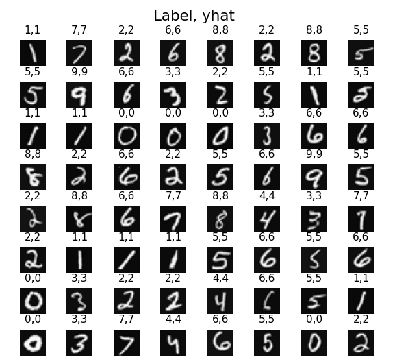

# ***1. Scenario***

As a data scientist at a company focused on improving security for physical devices, I have been tasked with developing a system that can automatically recognize handwritten digits used in secure access codes. Unlike traditional numeric keypads, where each pressed digit is reliably registered, handwritten input can be more natural and less prone to physical tampering—but it also introduces the challenge of variable handwriting styles and qualities.

To address this, I will build and train a neural network capable of distinguishing between all ten digits (0 through 9). This multi-class classification problem serves as an essential stepping stone for more sophisticated real-world applications, such as secure door lock systems, smart safes, or advanced authentication mechanisms. By working through this project, I aim to gain practical insights into data preprocessing, neural network architecture selection, training procedures, and evaluation metrics—fundamental steps that will be invaluable as I refine and scale the solution.

# ***2. Steps***

## ***Step 1 : Importing Required Libraries***

First, let's run the cell below to import all the packages that we will need during this project.

- [numpy](https://numpy.org/) is the fundamental package for scientific computing with Python.
- [matplotlib](http://matplotlib.org) is a popular library to plot graphs in Python.
- [tensorflow](https://www.tensorflow.org/) a popular platform for machine learning.

```python
import numpy as np
import tensorflow as tf
from tensorflow.keras.models import Sequential
from tensorflow.keras.layers import Dense
from tensorflow.keras.activations import linear, relu, sigmoid
%matplotlib widget
import matplotlib.pyplot as plt
plt.style.use('./deeplearning.mplstyle')

import logging
logging.getLogger("tensorflow").setLevel(logging.ERROR)
tf.autograph.set_verbosity(0)

from public_tests import * 

from autils import *
from lab_utils_softmax import plt_softmax
np.set_printoptions(precision=2)
```

## ***Step 2 : Dataset***

I will start by loading the dataset for this task. 
- The `load_data()` function shown below loads the data into variables `X` and `y`

- The data set contains 5,000 training examples of handwritten digits $^1$.  

    - Each training example is a 20-pixel x 20-pixel grayscale image of the digit(Remember our last project)

$$X = 
\left(\begin{array}{cc} 
--- (x^{(1)}) --- \\
--- (x^{(2)}) --- \\
\vdots \\ 
--- (x^{(m)}) --- 
\end{array}\right)$$ 

- The second part of the training set is a 5,000 x 1 dimensional vector `y` that contains labels for the training set
    - `y = 0` if the image is of the digit `0`, `y = 4` if the image is of the digit `4` and so on.

$^1$<sub> This is a subset of the MNIST handwritten digit dataset (http://yann.lecun.com/exdb/mnist/)</sub>

```python
X, y = load_data()
```

If you want to get more familiar with the dataset, you can print the first element in the variable `X` and `y`.

```python
print('The first element in X is: ', X[0])
```

## ***Step 3 : Softmax Activation Function***

The neural network I will use in this project:

- This has two dense layers with ReLU activations followed by an output layer with a linear activation. 
    - Recall that our inputs are pixel values of digit images.
    - Since the images are of size $20\times20$, this gives us $400$ inputs  

- The parameters have dimensions that are sized for a neural network with $25$ units in layer 1, $15$ units in layer 2 and $10$ output units in layer 3, one for each digit.

    - Recall that the dimensions of these parameters is determined as follows:
        - If network has $s_{in}$ units in a layer and $s_{out}$ units in the next layer, then 
            - $W$ will be of dimension $s_{in} \times s_{out}$.
            - $b$ will be a vector with $s_{out}$ elements
  
    - Therefore, the shapes of `W`, and `b`,  are 
        - layer1: The shape of `W1` is (400, 25) and the shape of `b1` is (25,)
        - layer2: The shape of `W2` is (25, 15) and the shape of `b2` is: (15,)
        - layer3: The shape of `W3` is (15, 10) and the shape of `b3` is: (10,)

Below, using Keras Sequential model and Dense Layer with a ReLU activation to construct the three layer network described above.

```python
tf.random.set_seed(1234) # ***for consistent results***
model = Sequential(
    [
        Dense(25, input_shape=(400,), activation=relu),
        Dense(15, activation=relu),
        Dense(10, activation=linear)
    ], name = "my_model"
)
```

```python
model.summary()
```

output:
```
Model: "my_model"
_________________________________________________________________
 Layer (type)                Output Shape              Param # ***  ***
=================================================================
 dense (Dense)               (None, 25)                10025     
                                                                 
 dense_1 (Dense)             (None, 15)                390       
                                                                 
 dense_2 (Dense)             (None, 10)                160       
                                                                 
=================================================================
Total params: 10,575
Trainable params: 10,575
Non-trainable params: 0
_________________________________________________________________
```

## ***Step 4 : Define the Cost Function***

The following code:

* defines a loss function, `SparseCategoricalCrossentropy` and indicates the softmax should be included with the  loss calculation by adding `from_logits=True`)

* defines an optimizer. A popular choice is Adaptive Moment (Adam).

```python
model.compile(
    loss=tf.keras.losses.SparseCategoricalCrossentropy(from_logits=True),
    optimizer=tf.keras.optimizers.Adam(learning_rate=0.001),
)

history = model.fit(
    X,y,
    epochs=40
)
```

output:
```
Epoch 1/40
157/157 [==============================] - 1s 1ms/step - loss: 1.7094
Epoch 2/40
157/157 [==============================] - 0s 2ms/step - loss: 0.7480
Epoch 3/40
157/157 [==============================] - 0s 2ms/step - loss: 0.4428
Epoch 4/40
157/157 [==============================] - 0s 2ms/step - loss: 0.3463
Epoch 5/40
157/157 [==============================] - 0s 2ms/step - loss: 0.2977
Epoch 6/40
157/157 [==============================] - 0s 2ms/step - loss: 0.2630
Epoch 7/40
157/157 [==============================] - 0s 2ms/step - loss: 0.2361
Epoch 8/40
157/157 [==============================] - 0s 2ms/step - loss: 0.2131
Epoch 9/40
157/157 [==============================] - 0s 2ms/step - loss: 0.2004
Epoch 10/40
157/157 [==============================] - 0s 2ms/step - loss: 0.1805
Epoch 11/40
157/157 [==============================] - 0s 2ms/step - loss: 0.1692
Epoch 12/40
157/157 [==============================] - 0s 2ms/step - loss: 0.1580
Epoch 13/40
157/157 [==============================] - 0s 2ms/step - loss: 0.1507
Epoch 14/40
157/157 [==============================] - 0s 2ms/step - loss: 0.1396
Epoch 15/40
157/157 [==============================] - 0s 1ms/step - loss: 0.1289
Epoch 16/40
157/157 [==============================] - 0s 2ms/step - loss: 0.1255
Epoch 17/40
157/157 [==============================] - 0s 2ms/step - loss: 0.1154
Epoch 18/40
157/157 [==============================] - 0s 2ms/step - loss: 0.1102
Epoch 19/40
157/157 [==============================] - 0s 2ms/step - loss: 0.1016
Epoch 20/40
157/157 [==============================] - 0s 2ms/step - loss: 0.0970
Epoch 21/40
157/157 [==============================] - 0s 2ms/step - loss: 0.0926
Epoch 22/40
157/157 [==============================] - 0s 2ms/step - loss: 0.0891
Epoch 23/40
157/157 [==============================] - 0s 2ms/step - loss: 0.0828
Epoch 24/40
157/157 [==============================] - 0s 2ms/step - loss: 0.0785
Epoch 25/40
157/157 [==============================] - 0s 2ms/step - loss: 0.0755
Epoch 26/40
157/157 [==============================] - 0s 2ms/step - loss: 0.0713
Epoch 27/40
157/157 [==============================] - 0s 2ms/step - loss: 0.0701
Epoch 28/40
157/157 [==============================] - 0s 2ms/step - loss: 0.0617
Epoch 29/40
157/157 [==============================] - 0s 2ms/step - loss: 0.0578
Epoch 30/40
157/157 [==============================] - 0s 2ms/step - loss: 0.0550
Epoch 31/40
157/157 [==============================] - 0s 2ms/step - loss: 0.0511
Epoch 32/40
157/157 [==============================] - 0s 2ms/step - loss: 0.0499
Epoch 33/40
157/157 [==============================] - 0s 2ms/step - loss: 0.0462
Epoch 34/40
157/157 [==============================] - 0s 2ms/step - loss: 0.0437
Epoch 35/40
157/157 [==============================] - 0s 2ms/step - loss: 0.0422
Epoch 36/40
157/157 [==============================] - 0s 2ms/step - loss: 0.0396
Epoch 37/40
157/157 [==============================] - 0s 2ms/step - loss: 0.0366
Epoch 38/40
157/157 [==============================] - 0s 2ms/step - loss: 0.0344
Epoch 39/40
157/157 [==============================] - 0s 2ms/step - loss: 0.0312
Epoch 40/40
157/157 [==============================] - 0s 2ms/step - loss: 0.0294
```

### ***Epochs and batches***

In the `fit` statement above, the number of epochs was set to 40. This specifies that the entire data set should be applied during training 40 times. During training, you see output describing the progress of training that looks like this:

```
Epoch 1/40
157/157 [==============================] - 0s 1ms/step - loss: 2.2770
```

The first line, Epoch 1/40, describes which epoch the model is currently running. For efficiency, the training data set is broken into 'batches'. The default size of a batch in Tensorflow is 32. There are 5,000 examples in our data set or roughly 157 batches. The notation on the 2nd line 157/157 [==== is describing which batch has been executed.

### ***Loss  (cost)***

In the previous chapter, we learned to track the progress of gradient descent by monitoring the cost. Ideally, the cost will decrease as the number of iterations of the algorithm increases. Tensorflow refers to the cost as `loss`. Above, you saw the loss displayed each epoch as `model.fit` was executing. The [.fit](https://www.tensorflow.org/api_docs/python/tf/keras/Model) method returns a variety of metrics including the loss. This is captured in the `history` variable above. This can be used to examine the loss in a plot as shown below.

## ***Step 5 : Prediction***

To make a prediction, use Keras `predict`. Below, X[1015] contains an image of a two.

```python
image_of_two = X[1015]
display_digit(image_of_two)

prediction = model.predict(image_of_two.reshape(1,400))  # ***prediction***

print(f" predicting a Two: \n{prediction}")
print(f" Largest Prediction index: {np.argmax(prediction)}")
```

output:
```
predicting a Two: 
[[ -7.99  -2.23   0.77  -2.41 -11.66 -11.15  -9.53  -3.36  -4.42  -7.17]]
 Largest Prediction index: 2
```

The largest output is prediction[2], indicating the predicted digit is a '2'. If the problem only requires a selection, that is sufficient. Use NumPy to select it. If the problem requires a probability, a softmax is required:

```python
prediction_p = tf.nn.softmax(prediction)

print(f" predicting a Two. Probability vector: \n{prediction_p}")
print(f"Total of predictions: {np.sum(prediction_p):0.3f}")
```

output:
```
 predicting a Two. Probability vector: 
[[1.42e-04 4.49e-02 8.98e-01 3.76e-02 3.61e-06 5.97e-06 3.03e-05 1.44e-02
  5.03e-03 3.22e-04]]
Total of predictions: 1.000
```

To return an integer representing the predicted target, you want the index of the largest probability. This is accomplished with the Numpy function.

```python
yhat = np.argmax(prediction_p)
print(f"np.argmax(prediction_p): {yhat}")
```

output:
```
np.argmax(prediction_p): 2
```

## ***Step 6 : Comparing the prediction vs the labels for a random sample***

```python
import warnings
warnings.simplefilter(action='ignore', category=FutureWarning)

m, n = X.shape

fig, axes = plt.subplots(8,8, figsize=(5,5))
fig.tight_layout(pad=0.13,rect=[0, 0.03, 1, 0.91]) #[left, bottom, right, top]
widgvis(fig)
for i,ax in enumerate(axes.flat):
    # Select random indices
    random_index = np.random.randint(m)
    
    # Select rows corresponding to the random indices and
    # reshape the image
    X_random_reshaped = X[random_index].reshape((20,20)).T
    
    # Display the image
    ax.imshow(X_random_reshaped, cmap='gray')
    
    # Predict using the Neural Network
    prediction = model.predict(X[random_index].reshape(1,400))
    prediction_p = tf.nn.softmax(prediction)
    yhat = np.argmax(prediction_p)
    
    # Display the label above the image
    ax.set_title(f"{y[random_index,0]},{yhat}",fontsize=10)
    ax.set_axis_off()
fig.suptitle("Label, yhat", fontsize=14)
plt.show()
```

output:  


Let's check the some of the errors.

```python
print(f"{display_errors(model,X,y)} errors out of {len(X)} images")
```

output:  
```
15 errors out of 5000 images
```

# ***3. Conclusion***

In this project, I successfully implemented and trained a neural network to recognize handwritten digits (0 to 9), demonstrating a solid approach to the multi-class classification problem. By utilizing TensorFlow and Keras, I efficiently built, tuned, and evaluated the model, achieving reliable classification results on the given dataset.

This experience not only reinforced my understanding of core techniques—such as data normalization, model architecture design, and softmax-based output probabilities—but also highlighted areas for potential improvement. For instance, I can explore deeper networks, regularization methods, and data augmentation to enhance model performance further.

With this strong foundation established, I am now prepared to tackle more challenging real-world scenarios that involve larger datasets, varying handwriting styles, or additional security features. The insights and skills gained here will help guide the development of robust, production-ready digit recognition systems that can significantly enhance the security and user experience on physical access devices.