# ***1. Scenario***

I’m a Data Scientist at a small tech startup that wants to **experiment** with various machine learning techniques—everything from polynomial regression to neural network classification. I’ve pulled together a **prototype dataset** that lets me easily test out different ideas without the constraints of a large-scale production environment. My main goal is to **learn and confirm** which modeling strategies, data splitting methods, and evaluation metrics yield the best insights before I tackle more complex, real-world data.

1. **Purpose of the Experiments**  
   - **Validate Understanding**: By conducting controlled experiments, I can directly see how models behave when I tweak parameters (e.g., polynomial degree, regularization strength).  
   - **Refine ML Concepts**: Concepts like **bias**, **variance**, **underfitting**, **overfitting**, and **precision/recall** become more concrete by hands-on testing.  
   - **Build a Reproducible Framework**: Once I settle on the best practices (e.g., how to do cross-validation splits or tune hyperparameters), the code and processes will serve as a template for future, larger-scale projects.

2. **Data Setup**  
   - **Synthetic Data Generation**: To keep things flexible, I generate synthetic data for tasks such as fitting a **polynomial function** or performing a **multi-class classification**. This approach lets me systematically introduce complexities (like noise or outliers) as needed.  
   - **Splitting into Train/Validation/Test**: I carefully partition data into three sets:
     - **Training** (to fit the model parameters),
     - **Cross-Validation** (to adjust hyperparameters or model structure),
     - **Test** (to evaluate final performance and ensure generalization).
   - **Skewed Data**: I also experiment with artificially **imbalanced** classes (e.g., a rare event like fraud or a rare disease) to explore precision-recall metrics.

3. **Experiment Flow**  
   1. **Polynomial Regression Trials**:  
      - Generate a small dataset (e.g., points following a polynomial trend with added noise).  
      - Test degrees from 1 to 10, watch how training error plummets (overfitting) and cross-validation error eventually spikes.  
      - Learn how to interpret bias/variance trade-offs.
   2. **Classification Exploration**:  
      - For multi-class tasks, I split data into five or six classes, each representing a different cluster.  
      - Compare simple vs. complex neural networks:
        - **Simple Model**: Fewer layers/units → risk of **underfitting**.  
        - **Complex Model**: Many layers/units → risk of **overfitting**.  
      - Evaluate using metrics like **categorization error**, **precision**, **recall**, **F1 score**, and see which model best handles new validation data.
   3. **Regularization Tuning**:  
      - Introduce regularization (Ridge or L2 for neural networks).  
      - Track how the model’s decision boundaries evolve with changing lambda ($\lambda$) and note improved generalization on cross-validation sets.

4. **Observations and Lessons**  
   - **Overfitting vs. Underfitting**: By observing error curves (training vs. CV), I can pinpoint when a model grows too complex or remains too simple.  
   - **Threshold Adjustments**: For classification, adjusting decision thresholds reveals the **precision–recall** trade-off. I see how domain context (e.g., the “cost” of a false positive vs. false negative) should guide the threshold choice.  
   - **Importance of Data Splits**: Using separate training, CV, and test sets prevents me from fooling myself with good results that don’t generalize.

5. **Takeaways for Real Projects**  
   - **Prototype-First**: Running these small-scale trials with synthetic or carefully curated data helps me refine workflows before tackling large or sensitive datasets (e.g., health records, e-commerce logs).  
   - **Continuous Tuning**: Whether working with polynomial degrees or neural network layer counts, iterative fine-tuning and cross-validation are crucial for balancing performance.  
   - **Clear Metrics**: Knowing precisely when to use MSE, classification error, or precision/recall **helps communicate** results effectively to both technical peers and non-technical stakeholders.

Now that I've outlined my experimental framework and key considerations, it's time to put these concepts into practice. By starting with controlled experiments and synthetic data, I can build a strong foundation for more complex machine learning projects. Remember that each experiment, whether successful or not, provides valuable insights that will shape my understanding and improve my approach to real-world machine learning challenges. Let's begin my journey of practical machine learning experimentation with confidence and curiosity.

# ***2. Steps***

## ***Step 1 : Importing Required Libraries***

First, I will import all the packages that are needed for this project.

- [numpy](https://numpy.org/) is the fundamental package for scientific computing Python.
- [matplotlib](http://matplotlib.org) is a popular library to plot graphs in Python.
- [scikitlearn](https://scikit-learn.org/stable/) is a basic library for data mining
- [tensorflow](https://www.tensorflow.org/) a popular platform for machine learning.

```python
import numpy as np
%matplotlib widget
import matplotlib.pyplot as plt
from sklearn.linear_model import LinearRegression, Ridge
from sklearn.preprocessing import StandardScaler, PolynomialFeatures
from sklearn.model_selection import train_test_split
from sklearn.metrics import mean_squared_error
import tensorflow as tf
from tensorflow.keras.models import Sequential
from tensorflow.keras.layers import Dense
from tensorflow.keras.activations import relu,linear
from tensorflow.keras.losses import SparseCategoricalCrossentropy
from tensorflow.keras.optimizers import Adam

import logging
logging.getLogger("tensorflow").setLevel(logging.ERROR)

from public_tests_a1 import * 

tf.keras.backend.set_floatx('float64')
from assigment_utils import *

tf.autograph.set_verbosity(0)
```

## ***Step 2 : Evaluating a Learning Algorithm(Polynomial Regression)***

### ***2.1 Splitting my data set***

I will reserve 20-40% of my dataset for testing. Using an `sklearn` function [train_test_split](https://scikit-learn.org/stable/modules/generated/sklearn.model_selection.train_test_split.html), I'll split the data. After running the following cell, we should verify the shapes of the resulting arrays.

```python
# Generate some data
X,y,x_ideal,y_ideal = gen_data(18, 2, 0.7)
print("X.shape", X.shape, "y.shape", y.shape)

#split the data using sklearn routine 
X_train, X_test, y_train, y_test = train_test_split(X,y,test_size=0.33, random_state=1)
print("X_train.shape", X_train.shape, "y_train.shape", y_train.shape)
print("X_test.shape", X_test.shape, "y_test.shape", y_test.shape)
```

output:  
```
X.shape (18, 2) y.shape (18,)
X_train.shape (12, 2) y_train.shape (12,)
X_test.shape (6, 2) y_test.shape (6,)
```

### ***2.2 Error calculation for model evaluation, linear regression***

When *evaluating* a linear regression model, I average the squared error difference of the predicted values and the target values.

$$ J_{test}(\mathbf{\vec w},b) = \frac{1}{2m_{test}}\sum_{i=0}^{m_{test}-1} ( f_{\mathbf{\vec w},b}(x^{(i)}_{test}) - y^{(i)}_{test} )^2 $$

Creating a function to evaluate the error on a data set for a linear regression model.

```python
def eval_mse(y, yhat):
    """ 
    Calculate the mean squared error on a data set.
    Args:
      y    : (ndarray  Shape (m,) or (m,1))  target value
      yhat : (ndarray  Shape (m,) or (m,1))  predicted value
    Returns:
      err: (scalar)             
    """
    m = len(y)
    err = 0.0
    for i in range(m):
        err_i  = ( (yhat[i] - y[i])**2 ) 
        err   += err_i                                                                
    err = err / (2*m)
    
    return(err)
```

### ***2.3 Compare performance on training and test data***

I will build a high degree polynomial model to minimize training error. This will use the linear_regression functions from `sklearn`. The code is in the imported utility file if you would like to see the details. The steps below are:
* create and fit the model. ('fit' is another name for training or running gradient descent).
* compute the error on the training data.
* compute the error on the test data.

```python
# create a model in sklearn, train on training data
degree = 10
lmodel = lin_model(degree)
lmodel.fit(X_train, y_train)

# predict on training data, find training error
yhat = lmodel.predict(X_train)
err_train = lmodel.mse(y_train, yhat)

# predict on test data, find error
yhat = lmodel.predict(X_test)
err_test = lmodel.mse(y_test, yhat)
```

The computed error on the training set is substantially less than that of the test set. 

```python
print(f"training err {err_train:0.2f}, test err {err_test:0.2f}")
```

output:  
```
training err 58.01, test err 171215.01
```

The following plot shows why this is. The model fits the training data very well. To do so, it has created a complex function. The test data was not part of the training and the model does a poor job of predicting on this data.
This model would be described as 1) is overfitting, 2) has high variance 3) 'generalizes' poorly.

```python
# plot predictions over data range 
x = np.linspace(0,int(X.max()),100)  # predict values for plot
y_pred = lmodel.predict(x).reshape(-1,1)

plt_train_test(X_train, y_train, X_test, y_test, x, y_pred, x_ideal, y_ideal, degree)
```

output:  
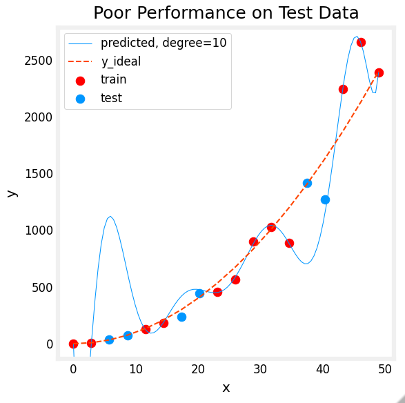

The test set error shows this model will not work well on new data. If I use the test error to guide improvements in the model, then the model will perform well on the test data. But the test data was meant to represent new data. I need yet another set of data to test new data performance.

I will separate the datasets into three groups. The distribution of training, cross-validation and test sets shown in the below table is a typical distribution, but can be varied depending on the amount of data available.

| data             | % of total | Description |
|------------------|:----------:|:---------|
| training         | 60         | Data used to tune model parameters $w$ and $b$ in training or fitting |
| cross-validation | 20         | Data used to tune other model parameters like degree of polynomial, regularization or the architecture of a neural network.|
| test             | 20         | Data used to test the model after tuning to gauge performance on new data |


I will generate three datasets below. I will use `train_test_split` from `sklearn` but will call it twice to get three splits:

```python
# Generate data
X,y, x_ideal,y_ideal = gen_data(40, 5, 0.7)
print("X.shape", X.shape, "y.shape", y.shape)

#split the data using sklearn routine 
X_train, X_, y_train, y_ = train_test_split(X,y,test_size=0.40, random_state=1)
X_cv, X_test, y_cv, y_test = train_test_split(X_,y_,test_size=0.50, random_state=1)
print("X_train.shape", X_train.shape, "y_train.shape", y_train.shape)
print("X_cv.shape", X_cv.shape, "y_cv.shape", y_cv.shape)
print("X_test.shape", X_test.shape, "y_test.shape", y_test.shape)
```

output:  
```
X.shape (40,) y.shape (40,)
X_train.shape (24,) y_train.shape (24,)
X_cv.shape (8,) y_cv.shape (8,)
X_test.shape (8,) y_test.shape (8,)
```

## ***Step 3 : Bias and Variance***

Above, it was clear the degree of the polynomial model was too high. How can I choose a good value? It turns out, as shown in the diagram, the training and cross-validation performance can provide guidance. By trying a range of degree values, the training and cross-validation performance can be evaluated. As the degree becomes too large, the cross-validation performance will start to degrade relative to the training performance. I'll try this on my example.

### ***3.1 Plotting the train, CV, Test***

I can see below the datapoints that will be part of training (in red) are intermixed with those that the model is not trained on (test and cv).

```python
fig, ax = plt.subplots(1,1,figsize=(4,4))
ax.plot(x_ideal, y_ideal, "--", color = "orangered", label="y_ideal", lw=1)
ax.set_title("Training, CV, Test",fontsize = 14)
ax.set_xlabel("x")
ax.set_ylabel("y")

ax.scatter(X_train, y_train, color = "red",           label="train")
ax.scatter(X_cv, y_cv,       color = dlc["dlorange"], label="cv")
ax.scatter(X_test, y_test,   color = dlc["dlblue"],   label="test")
ax.legend(loc='upper left')
plt.show()
```

output:  
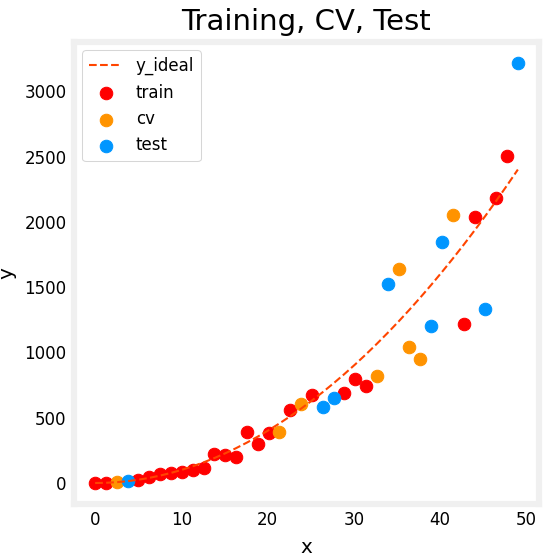

### ***3.2 Finding the optimal degree***

I'll train the model repeatedly, increasing the degree of the polynomial each iteration. Here, I'm going to use the [scikit-learn](https://scikit-learn.org/stable/modules/generated/sklearn.linear_model.LinearRegression.html#sklearn.linear_model.LinearRegression) linear regression model for speed and simplicity.

```python
max_degree = 9
err_train = np.zeros(max_degree)    
err_cv = np.zeros(max_degree)      
x = np.linspace(0,int(X.max()),100)  
y_pred = np.zeros((100,max_degree))  #columns are lines to plot

for degree in range(max_degree):
    lmodel = lin_model(degree+1)
    lmodel.fit(X_train, y_train)
    yhat = lmodel.predict(X_train)
    err_train[degree] = lmodel.mse(y_train, yhat)
    yhat = lmodel.predict(X_cv)
    err_cv[degree] = lmodel.mse(y_cv, yhat)
    y_pred[:,degree] = lmodel.predict(x)
    
optimal_degree = np.argmin(err_cv)+1
```

output:  
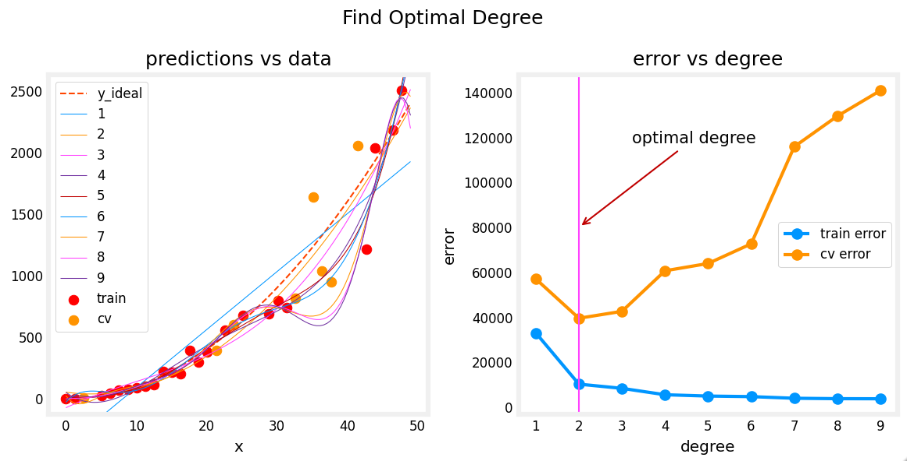

The graph above shows how I can detect underfitting or overfitting by splitting our data into two groups: training data and validation data. In this example, I created various models ranging from underfitting to overfitting by increasing the polynomial degree.

On the left plot, the solid lines represent the predictions from these models. A polynomial model with degree 1 produces a straight line that intersects very few data points, while the maximum degree hews very closely to every data point.

On the right:
- the error on the trained data (blue) decreases as the model complexity increases as expected
- the error of the cross-validation data decreases initially as the model starts to conform to the data, but then increases as the model starts to over-fit on the training data (fails to generalize).

### ***3.3 Tuning Regularization***

I have utilized *regularization* to reduce overfitting. Similar to degree, one can use the same methodology to tune the regularization parameter lambda ($\lambda$).

Let's demonstrate this by starting with a high degree polynomial and varying the regularization parameter.

```python
lambda_range = np.array([0.0, 1e-6, 1e-5, 1e-4,1e-3,1e-2, 1e-1,1,10,100])
num_steps = len(lambda_range)
degree = 10
err_train = np.zeros(num_steps)    
err_cv = np.zeros(num_steps)       
x = np.linspace(0,int(X.max()),100) 
y_pred = np.zeros((100,num_steps))  #columns are lines to plot

for i in range(num_steps):
    lambda_= lambda_range[i]
    lmodel = lin_model(degree, regularization=True, lambda_=lambda_)
    lmodel.fit(X_train, y_train)
    yhat = lmodel.predict(X_train)
    err_train[i] = lmodel.mse(y_train, yhat)
    yhat = lmodel.predict(X_cv)
    err_cv[i] = lmodel.mse(y_cv, yhat)
    y_pred[:,i] = lmodel.predict(x)
    
optimal_reg_idx = np.argmin(err_cv) 
```
```python
plt.close("all")
plt_tune_regularization(X_train, y_train, X_cv, y_cv, x, y_pred, err_train, err_cv, optimal_reg_idx, lambda_range)
```

output:  
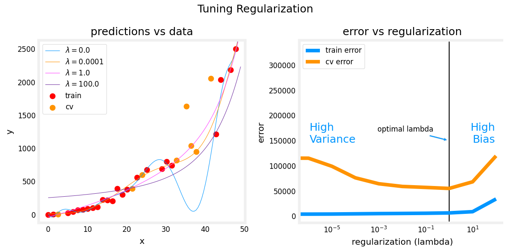

Above, the graphs show that as regularization increases, the model moves from a high variance (overfitting) model to a high bias (underfitting) model. The vertical line in the right plot shows the optimal value of lambda. In this example, the polynomial degree was set to 10.

### ***3.4 Getting more data: Increasing Training Set Size (m)***

When a model is overfitting (high variance), collecting additional data can improve performance. 

```python
X_train, y_train, X_cv, y_cv, x, y_pred, err_train, err_cv, m_range,degree = tune_m()
plt_tune_m(X_train, y_train, X_cv, y_cv, x, y_pred, err_train, err_cv, m_range, degree)
```

output:  
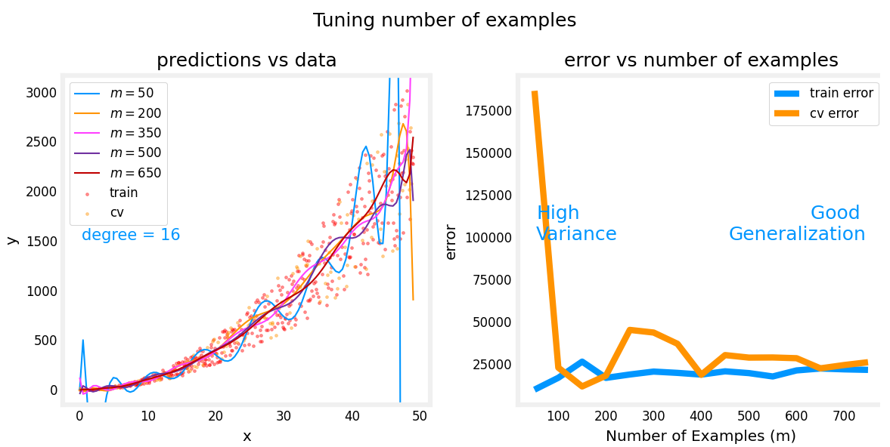

The above plots show that when a model has high variance and is overfitting, adding more examples improves performance. 

Note the curves on the left plot. The final curve with the highest value of 𝑚 is a smooth curve that is in the center of the data. 

On the right, as the number of examples increases, the performance of the training set and cross-validation set converge to similar values. More data improves generalization.

## ***Step 4 : Evaluating a Learning Algorithm(Neural Network)***

Above, I tuned aspects of a polynomial regression model. Here, I will work with a neural network model. 

### ***4.1 Data Set***

I will generate a data set and split it into training, cross-validation (CV) and test sets. In this example, I am increasing the percentage of cross-validation data points for emphasis.

```python
# Generate and split data set
X, y, centers, classes, std = gen_blobs()

# split the data. Large CV population for demonstration
X_train, X_, y_train, y_ = train_test_split(X,y,test_size=0.50, random_state=1)
X_cv, X_test, y_cv, y_test = train_test_split(X_,y_,test_size=0.20, random_state=1)
print("X_train.shape:", X_train.shape, "X_cv.shape:", X_cv.shape, "X_test.shape:", X_test.shape)
```

output:  
```
X_train.shape: (400, 2) X_cv.shape: (320, 2) X_test.shape: (80, 2)
```

```python
plt_train_eq_dist(X_train, y_train,classes, X_cv, y_cv, centers, std)
```

output:  
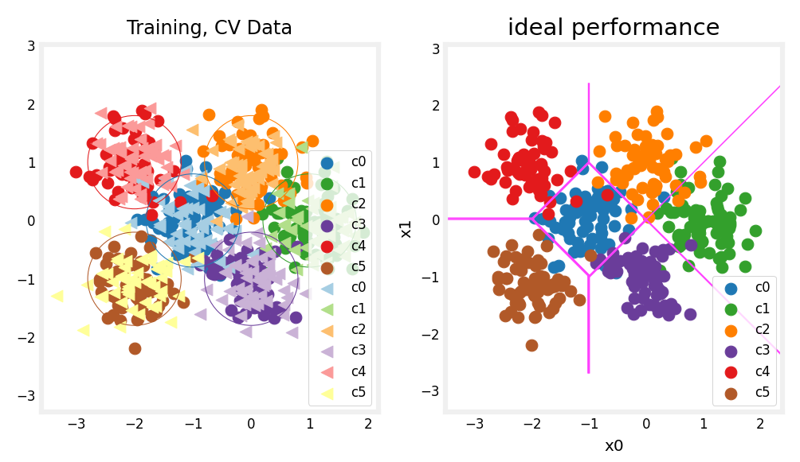

Above, I can see the data on the left. There are six clusters identified by color. Both training points (dots) and cross-validataion points (triangles) are shown. The interesting points are those that fall in ambiguous locations where either cluster might consider them members. 

What would I expect a neural network model to do? What would be an example of overfitting? underfitting?
On the right is an example of an 'ideal' model, or a model one might create knowing the source of the data. 

The lines represent 'equal distance' boundaries where the distance between center points is equal. It's worth noting that this model would "misclassify" roughly 8% of the total data set.

### ***4.2 Evaluating categorical model by calculating classification error***

The evaluation function for categorical models used here is simply the fraction of incorrect predictions:

$$ J_{cv} =\frac{1}{m}\sum_{i=0}^{m-1} 
\begin{cases}
    1, & \text{if $\hat{y}^{(i)} \neq y^{(i)}$}\\
    0, & \text{otherwise}
\end{cases}
$$

```python
def eval_cat_err(y, yhat):
    """ 
    Calculate the categorization error
    Args:
      y    : (ndarray  Shape (m,) or (m,1))  target value of each example
      yhat : (ndarray  Shape (m,) or (m,1))  predicted value of each example
    Returns:|
      cerr: (scalar)             
    """
    m = len(y)
    incorrect = 0
    for i in range(m):
        if yhat[i] != y[i]:    
            incorrect += 1     
    cerr = incorrect/m         
    
    return(cerr)
```
```python
y_hat = np.array([1, 2, 0])
y_tmp = np.array([1, 2, 3])
print(f"categorization error {np.squeeze(eval_cat_err(y_hat, y_tmp)):0.3f}, expected:0.333" )
y_hat = np.array([[1], [2], [0], [3]])
y_tmp = np.array([[1], [2], [1], [3]])
print(f"categorization error {np.squeeze(eval_cat_err(y_hat, y_tmp)):0.3f}, expected:0.250" )
```

output:  
```
categorization error 0.333, expected:0.333
categorization error 0.250, expected:0.250
```

## ***Step 5 : Model Complexity***

Below, I will build two models. A complex model and a simple model. I will evaluate the models to determine if they are likely to overfit or underfit.

### ***5.1 Building a complex model***

I will compose a three-layer model.

* Dense layer with 120 units, relu activation
* Dense layer with 40 units, relu activation
* Dense layer with 6 units and a linear activation (not softmax)  
Compile using
* loss with `SparseCategoricalCrossentropy`, remember to use  `from_logits=True`
* Adam optimizer with learning rate of 0.01.

```python
import logging
logging.getLogger("tensorflow").setLevel(logging.ERROR)

tf.random.set_seed(1234)
model = Sequential(
    [
        Dense(120, activation = 'relu', name = "L1"),      
        Dense(40, activation = 'relu', name = "L2"),         
        Dense(classes, activation = 'linear', name = "L3")         
    ], name="Complex"
)
model.compile(
    loss=tf.keras.losses.SparseCategoricalCrossentropy(from_logits=True),          
    optimizer=tf.keras.optimizers.Adam(0.01),   
)

model.fit(
    X_train,y_train,
    epochs=1000
)
```
```python
model.summary()

model_test(model, classes, X_train.shape[1])
```

output:  
```
Model: "Complex"
_________________________________________________________________
 Layer (type)                Output Shape              Param #   
=================================================================
 L1 (Dense)                  (None, 120)               360       
                                                                 
 L2 (Dense)                  (None, 40)                4840      
                                                                 
 L3 (Dense)                  (None, 6)                 246       
                                                                 
=================================================================
Total params: 5,446
Trainable params: 5,446
Non-trainable params: 0
```
```python
#make a model for plotting routines to call
model_predict = lambda Xl: np.argmax(tf.nn.softmax(model.predict(Xl)).numpy(),axis=1)
plt_nn(model_predict,X_train,y_train, classes, X_cv, y_cv, suptitle="Complex Model")
```

output:  
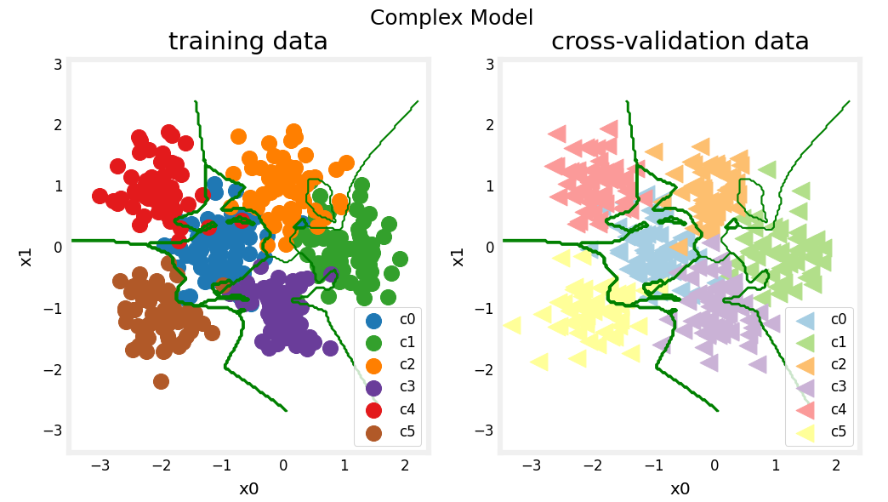

This model has worked very hard to capture outliers of each category. As a result, it has miscategorized some of the cross-validation data. I'll calculate the classification error

```python
training_cerr_complex = eval_cat_err(y_train, model_predict(X_train))
cv_cerr_complex = eval_cat_err(y_cv, model_predict(X_cv))
print(f"categorization error, training, complex model: {training_cerr_complex:0.3f}")
print(f"categorization error, cv,       complex model: {cv_cerr_complex:0.3f}")
```

output:  
```
categorization error, training, complex model: 0.007
categorization error, cv,       complex model: 0.113
```

### ***5.2 Building a simple model***

I will compose a two-layer model:

* Dense layer with 6 units, relu activation
* Dense layer with 6 units and a linear activation. 
Compile using
* loss with `SparseCategoricalCrossentropy`, remember to use  `from_logits=True`
* Adam optimizer with learning rate of 0.01.

```python
# UNQ_C4
# GRADED CELL: model_s

tf.random.set_seed(1234)
model_s = Sequential(
    [
        ### START CODE HERE ### 
        Dense(6, activation = 'relu', name="L1"),            # @REPLACE
        Dense(classes, activation = 'linear', name="L2")     # @REPLACE        
        ### END CODE HERE ### 
    ], name = "Simple"
)
model_s.compile(
    ### START CODE HERE ### 
    loss=tf.keras.losses.SparseCategoricalCrossentropy(from_logits=True),     # @REPLACE
    optimizer=tf.keras.optimizers.Adam(0.01),     # @REPLACE
    ### START CODE HERE ### 
)
model_s.fit(
    X_train,y_train,
    epochs=1000
)                            
```
```python
model_s.summary()

model_test(model_s, classes, X_train.shape[1])
```

output:  
```
Model: "Simple"
_________________________________________________________________
 Layer (type)                Output Shape              Param #   
=================================================================
 L1 (Dense)                  (None, 6)                 18       
                                                                 
 L2 (Dense)                  (None, 6)                 42        
                                                                 
=================================================================
Total params: 60
Trainable params: 60
Non-trainable params: 0
```

```python
#make a model for plotting routines to call
model_predict_s = lambda Xl: np.argmax(tf.nn.softmax(model_s.predict(Xl)).numpy(),axis=1)
plt_nn(model_predict_s,X_train,y_train, classes, X_cv, y_cv, suptitle="Simple Model")
```

output:  
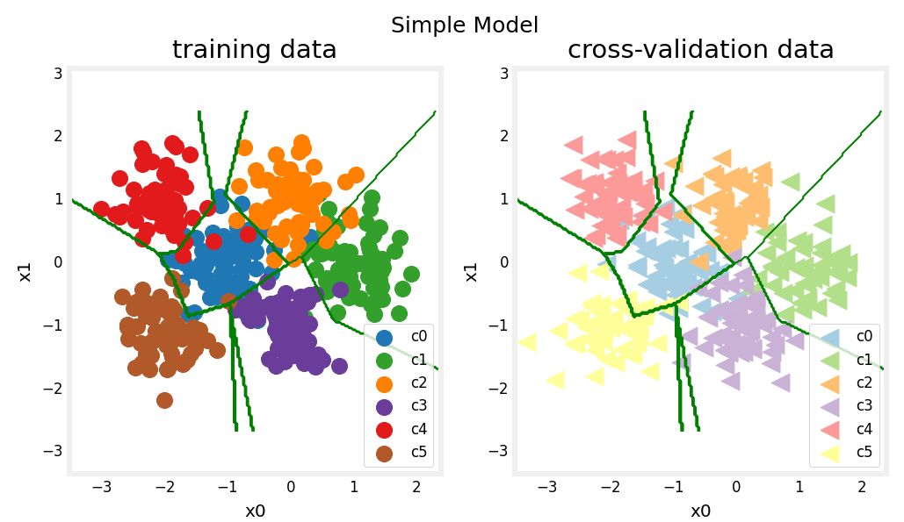

This simple models does pretty well. Let's calculate the classification error.

```python
training_cerr_simple = eval_cat_err(y_train, model_predict_s(X_train))
cv_cerr_simple = eval_cat_err(y_cv, model_predict_s(X_cv))
print(f"categorization error, training, simple model, {training_cerr_simple:0.3f}, complex model: {training_cerr_complex:0.3f}" )
print(f"categorization error, cv,       simple model, {cv_cerr_simple:0.3f}, complex model: {cv_cerr_complex:0.3f}" )
```

output:  
```
categorization error, training, simple model, 0.062, complex model: 0.007
categorization error, cv,       simple model, 0.087, complex model: 0.113
```

## ***Step 6 : Regularization***

As in the case of polynomial regression, one can apply regularization to moderate the impact of a more complex model. 

I'll reconstruct my complex model, but this time include regularization.

Below, compose a three-layer model:
* Dense layer with 120 units, relu activation, `kernel_regularizer=tf.keras.regularizers.l2(0.1)`
* Dense layer with 40 units, relu activation, `kernel_regularizer=tf.keras.regularizers.l2(0.1)`
* Dense layer with 6 units and a linear activation. 
Compile using
* loss with `SparseCategoricalCrossentropy`, remember to use  `from_logits=True`
* Adam optimizer with learning rate of 0.01.

```python
tf.random.set_seed(1234)
model_r = Sequential(
    [
        Dense(120, activation = 'relu', kernel_regularizer=tf.keras.regularizers.l2(0.1), name="L1"), 
        Dense(40, activation = 'relu', kernel_regularizer=tf.keras.regularizers.l2(0.1), name="L2"),  
        Dense(classes, activation = 'linear', name="L3")          
    ], name= None
)
model_r.compile(
    loss=tf.keras.losses.SparseCategoricalCrossentropy(from_logits=True), 
    optimizer=tf.keras.optimizers.Adam(0.01),                             
)
model_r.fit(
    X_train,y_train,
    epochs=1000
)                           
```

```python
model_r.summary()

model_test(model_r, classes, X_train.shape[1])
```

output:  
```
Model: "Sequential"
_________________________________________________________________
 Layer (type)                Output Shape              Param #   
=================================================================
 L1 (Dense)                  (None, 120)               360       
                                                                 
 L2 (Dense)                  (None, 40)                4840      
                                                                 
 L3 (Dense)                  (None, 6)                 246       
                                                                 
=================================================================
Total params: 5,446
Trainable params: 5,446
Non-trainable params: 0
```

```python
#make a model for plotting routines to call
model_predict_r = lambda Xl: np.argmax(tf.nn.softmax(model_r.predict(Xl)).numpy(),axis=1)
 
plt_nn(model_predict_r, X_train,y_train, classes, X_cv, y_cv, suptitle="Regularized")
```

output:  
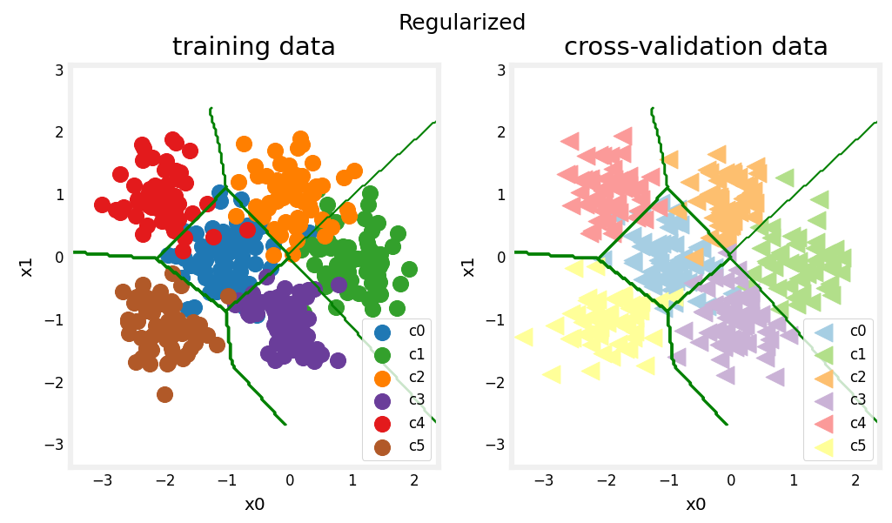

The results look very similar to the 'ideal' model. 

```python
training_cerr_reg = eval_cat_err(y_train, model_predict_r(X_train))
cv_cerr_reg = eval_cat_err(y_cv, model_predict_r(X_cv))
test_cerr_reg = eval_cat_err(y_test, model_predict_r(X_test))
print(f"categorization error, training, regularized: {training_cerr_reg:0.3f}, simple model, {training_cerr_simple:0.3f}, complex model: {training_cerr_complex:0.3f}" )
print(f"categorization error, cv,       regularized: {cv_cerr_reg:0.3f}, simple model, {cv_cerr_simple:0.3f}, complex model: {cv_cerr_complex:0.3f}" )
```

output:  
```
categorization error, training, regularized: 0.065, simple model, 0.062, complex model: 0.007
categorization error, cv,       regularized: 0.056, simple model, 0.087, complex model: 0.113
```

The simple model is a bit better in the training set than the regularized model but worse in the cross validation set.

## ***Step 7 : Iterate to find optimal regularization value***

```python
tf.random.set_seed(1234)
lambdas = [0.0, 0.001, 0.01, 0.05, 0.1, 0.2, 0.3]
models=[None] * len(lambdas)

for i in range(len(lambdas)):
    lambda_ = lambdas[i]
    models[i] =  Sequential(
        [
            Dense(120, activation = 'relu', kernel_regularizer=tf.keras.regularizers.l2(lambda_)),
            Dense(40, activation = 'relu', kernel_regularizer=tf.keras.regularizers.l2(lambda_)),
            Dense(classes, activation = 'linear')
        ]
    )
    models[i].compile(
        loss=tf.keras.losses.SparseCategoricalCrossentropy(from_logits=True),
        optimizer=tf.keras.optimizers.Adam(0.01),
    )

    models[i].fit(
        X_train,y_train,
        epochs=1000
    )
    print(f"Finished lambda = {lambda_}")
```
```python
plot_iterate(lambdas, models, X_train, y_train, X_cv, y_cv)
```

output:  
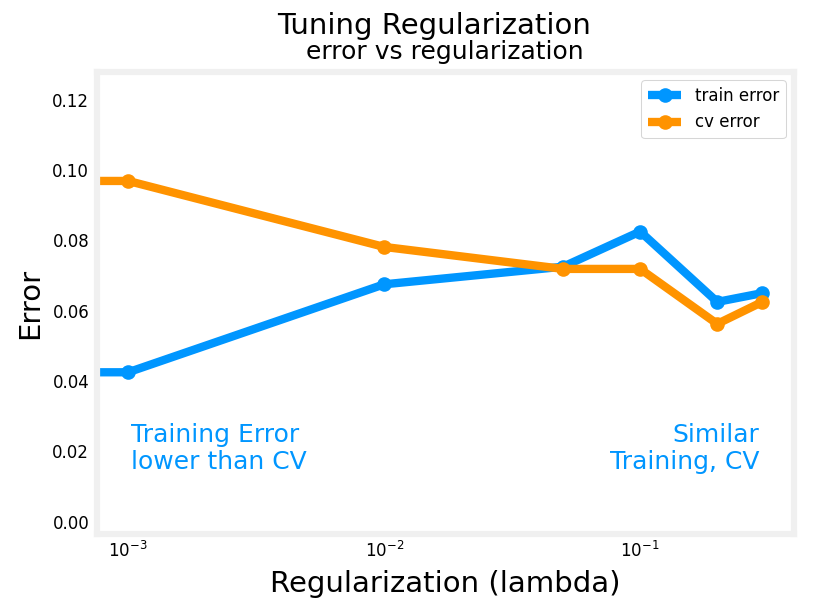

As regularization is increased, the performance of the model on the training and cross-validation data sets converge. For this data set and model, lambda > 0.01 seems to be a reasonable choice.

### ***7.1 Testing the model***

```python
plt_compare(X_test,y_test, classes, model_predict_s, model_predict_r, centers)
```

output:  
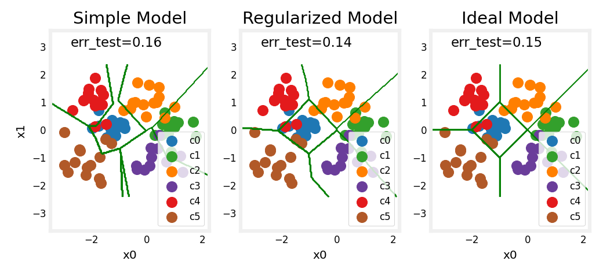

My test set is small and seems to have a number of outliers so classification error is high. However, the performance of our optimized models is comparable to ideal performance.

# ***3. Conclusion***

I have become familiar with important tools to apply when evaluating my machine learning models. Namely:  
* splitting data into trained and untrained sets allows me to differentiate between underfitting and overfitting
* creating three data sets, Training, Cross-Validation and Test allows me to
    * train my parameters $W,B$ with the training set
    * tune model parameters such as complexity, regularization and number of examples with the cross-validation set
    * evaluate my 'real world' performance using the test set.
* comparing training vs cross-validation performance provides insight into a model's propensity towards overfitting (high variance) or underfitting (high bias)