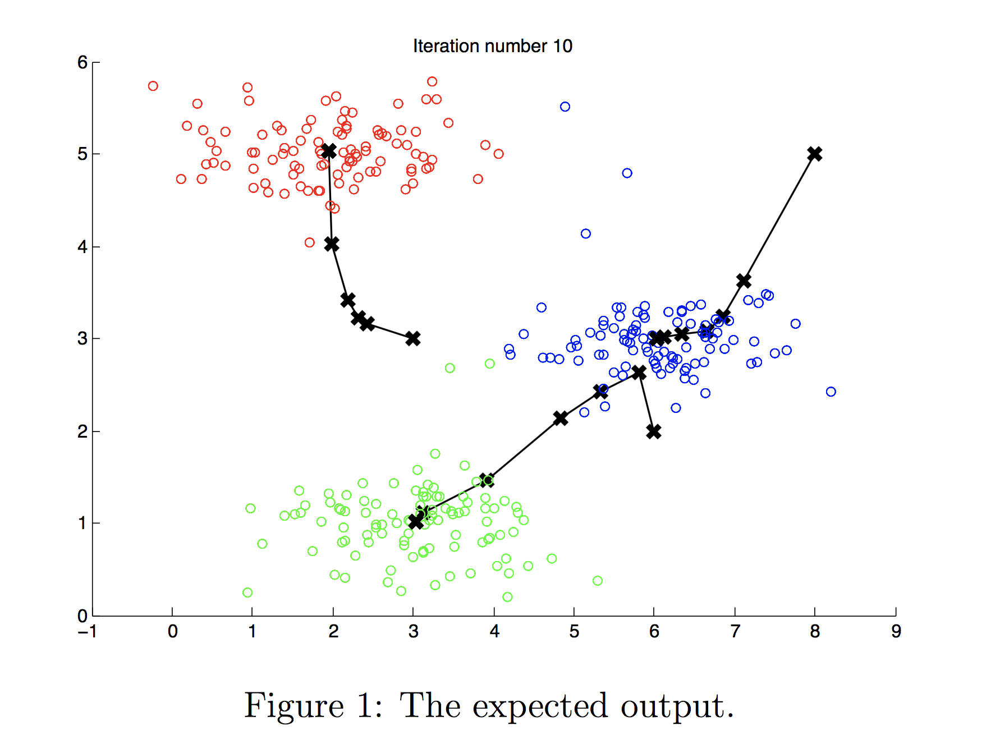
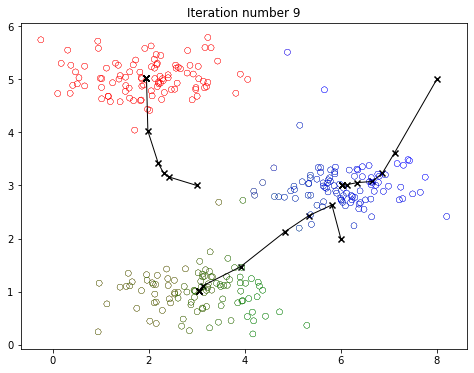
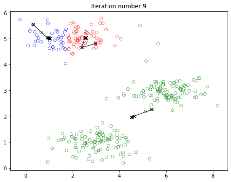

# ***1. Scenario***

Imagine you’ve collected data about **customer locations and spending habits** for a new retail startup. Each point in your dataset represents a single customer, measured on two dimensions: for example, the x-axis could be **average monthly spending** and the y-axis **distance to your nearest store**. You suspect there are **clusters** of customers with similar shopping behaviors, and you want to group them automatically.

This is where **K-means clustering** comes in. By running K-means on this 2D dataset:
- I’ll **partition** customers into clusters (e.g., “high spending, short travel distance” vs. “moderate spending, longer travel distance”).
- I’ll then **examine** each cluster to decide how best to tailor my marketing, product selection, or store placement.

Using K-means, I can also **experiment** with different numbers of clusters and initial centroid placements. This helps me confirm that the **patterns** I discover are consistent and meaningful. Ultimately, these insights will guide strategic decisions—such as opening a new store location closer to a high-spend cluster or offering delivery incentives for a group with higher travel distances.

---

# ***2. Steps***

## ***Step 1 : Importing Required Libraries***

Import the packages needed in this Project:

- [numpy](https://numpy.org/) is the fundamental package for scientific computing with Python.
- [matplotlib](http://matplotlib.org) is a popular library to plot graphs in Python.
- `utils.py` contains helper functions for this assignment. You do not need to modify code in this file.

```python
import numpy as np
import matplotlib.pyplot as plt
from utils import *

%matplotlib inline
```

## ***Step 2 : Implementing K-means***

The K-means algorithm is a method to automatically cluster similar data points together. Concretely, Grouping the data into a few cohesive “clusters”, given a training set $\{x^{(1)}, ..., x^{(m)}\}$.

K-means is an iterative procedure that
  * Starts by guessing the initial centroids, and then 
  * Refines this guess by 
    * Repeatedly assigning examples to their closest centroids, and then 
    * Recomputing the centroids based on the assignments.
         

* In pseudocode, the K-means algorithm is as follows:

``` python
# Initialize centroids
# K is the number of clusters
centroids = kMeans_init_centroids(X, K)

for iter in range(iterations):
    # Cluster assignment step: 
    # Assign each data point to the closest centroid. 
    # idx[i] corresponds to the index of the centroid 
    # assigned to example i
    idx = find_closest_centroids(X, centroids)

    # Move centroid step: 
    # Compute means based on centroid assignments
    centroids = compute_centroids(X, idx, K)
```

* The inner-loop of the algorithm repeatedly carries out two steps: 
  1. Assigning each training example $x^{(i)}$ to its closest centroid, and
  2. Recomputing the mean of each centroid using the points assigned to it. 
      
* The K-means algorithm will always converge to some final set of means for the centroids. 

* However, the converged solution may not always be ideal and depends on the initial setting of the centroids.
    * Therefore, in practice the K-means algorithm is usually run a few times with different random initializations. 
    * One way to choose between these different solutions from different random initializations is to choose the one with the lowest cost function value (distortion).

I will implement the two phases of the K-means algorithm separately
in the next sections. 
* I will start by completing `find_closest_centroid` and then proceed to complete `compute_centroids`.

### ***2.1 : Finding closest centroids***

In the “cluster assignment” phase of the K-means algorithm, the
algorithm assigns every training example $x^{(i)}$ to its closest
centroid, given the current positions of centroids. 

Complete the code in `find_closest_centroids`. 

* This function takes the data matrix `X` and the locations of all
centroids inside `centroids` 
* It should output a one-dimensional array `idx` (which has the same number of elements as `X`) that holds the index  of the closest centroid (a value in $\{0,...,K-1\}$, where $K$ is total number of centroids) to every training example. 
* Specifically, for every example $x^{(i)}$ we set
$$c^{(i)} := j \quad \mathrm{that \; minimizes} \quad ||x^{(i)} - \mu_j||^2,$$

where 
* $c^{(i)}$ is the index of the centroid that is closest to $x^{(i)}$ (corresponds to `idx[i]` in the starter code), and 
* $\mu_j$ is the position (value) of the $j$’th centroid. (stored in `centroids` in the starter code)
* $||x^{(i)} - \mu_j||$ is the L2-norm
 
```python
def find_closest_centroids(X, centroids):
    # Set K
    K = centroids.shape[0]
    idx = np.zeros(X.shape[0], dtype=int)
    for i in range(X.shape[0]):
        distance = [] 
        for j in range(centroids.shape[0]):
            norm_ij = np.linalg.norm(X[i] - centroids[j])
            distance.append(norm_ij)
        idx[i] = np.argmin(distance)
    return idx
```

```python
# Load an example dataset that we will be using
X = load_data()
```
```python
print("First five elements of X are:\n", X[:5]) 
print('The shape of X is:', X.shape)
```

output:
```
First five elements of X are:
  [[1.84207953 4.6075716 ]
  [5.65858312 4.79996405]
  [6.35257892 3.2908545 ]
  [2.90401653 4.61220411]
  [3.23197916 4.93989405]]
The shape of X is: (300, 2)
```
```python
# Select an initial set of centroids (3 Centroids)
initial_centroids = np.array([[3,3], [6,2], [8,5]])

# Find closest centroids using initial_centroids
idx = find_closest_centroids(X, initial_centroids)

# Print closest centroids for the first three elements
print("First three elements in idx are:", idx[:3])
```

output:
```
First three elements in idx are: [0 2 1]
```

### ***2.2 : Computing centroid means***

Given assignments of every point to a centroid, the second phase of the
algorithm recomputes, for each centroid, the mean of the points that
were assigned to it.

Complete the `compute_centroids` below to recompute the value for each centroid

* Specifically, for every centroid $\mu_k$ we set
$$\mu_k = \frac{1}{|C_k|} \sum_{i \in C_k} x^{(i)}$$ 

where 
* $C_k$ is the set of examples that are assigned to centroid $k$
* $|C_k|$ is the number of examples in the set $C_k$
* Concretely, if two examples say $x^{(3)}$ and $x^{(5)}$ are assigned to centroid $k=2$,
then you should update $\mu_2 = \frac{1}{2}(x^{(3)}+x^{(5)})$.

```python
def compute_centroids(X, idx, K):
    m, n = X.shape
    centroids = np.zeros((K, n))
    for k in range(K):   
        points = X[idx == k] 
        centroids[k] = np.mean(points, axis = 0)
    return centroids
```
```python
K = 3
centroids = compute_centroids(X, idx, K)
print("The centroids are:", centroids)
```

output:
```
The centroids are: 
[[2.42830111 3.15792418]
 [5.81350331 2.63365645]
 [7.11938687 3.6166844 ]]
```

### ***2.3 : K-means on a sample dataset***

The next step is to run the K-means algorithm on a toy 2D dataset to help you understand how K-means works. 

* At the end, my figure should look like the one displayed in Figure 1.
* The final centroids are the black X-marks in the middle of the colored clusters.
* I can see how these centroids got to their final location by looking at the other X-marks connected to it.




```python
def run_kMeans(X, initial_centroids, max_iters=10, plot_progress=False):
    """
    Runs the K-Means algorithm on data matrix X, where each row of X
    is a single example
    """
    
    # Initialize values
    m, n = X.shape
    K = initial_centroids.shape[0]
    centroids = initial_centroids
    previous_centroids = centroids    
    idx = np.zeros(m)
    plt.figure(figsize=(8, 6))

    # Run K-Means
    for i in range(max_iters):
        
        #Output progress
        print("K-Means iteration %d/%d" % (i, max_iters-1))
        
        # For each example in X, assign it to the closest centroid
        idx = find_closest_centroids(X, centroids)
        
        # Optionally plot progress
        if plot_progress:
            plot_progress_kMeans(X, centroids, previous_centroids, idx, K, i)
            previous_centroids = centroids
            
        # Given the memberships, compute new centroids
        centroids = compute_centroids(X, idx, K)
    plt.show() 
    return centroids, idx
```

```python
# Load an example dataset
X = load_data()

# Set initial centroids
initial_centroids = np.array([[3,3],[6,2],[8,5]])

# Number of iterations
max_iters = 10

# Run K-Means
centroids, idx = run_kMeans(X, initial_centroids, max_iters, plot_progress=True)
```

output:
```
K-Means iteration 0/9
K-Means iteration 1/9
K-Means iteration 2/9
K-Means iteration 3/9
K-Means iteration 4/9
K-Means iteration 5/9
K-Means iteration 6/9
K-Means iteration 7/9
K-Means iteration 8/9
K-Means iteration 9/9
```



## ***Step 3 : Random initialization***

In practice, a good strategy for initializing the centroids is to select random examples from the training set.

* The code first randomly shuffles the indices of the examples (using `np.random.permutation()`). 
* Then, it selects the first $K$ examples based on the random permutation of the indices. 
* This allows the examples to be selected at random without the risk of selecting the same example twice.

```python
def kMeans_init_centroids(X, K):
    """
    This function initializes K centroids that are to be 
    used in K-Means on the dataset X
    
    Args:
        X (ndarray): Data points 
        K (int):     number of centroids/clusters
    
    Returns:
        centroids (ndarray): Initialized centroids
    """
    
    # Randomly reorder the indices of examples
    randidx = np.random.permutation(X.shape[0])
    
    # Take the first K examples as centroids
    centroids = X[randidx[:K]]
    
    return centroids
```

I will run K-Means again but this time with random initial centroids. I will run the cell below several times and observe how different clusters are created based on the initial points chosen.

```python
# Run this cell repeatedly to see different outcomes.

# Set number of centroids and max number of iterations
K = 3
max_iters = 10

# Set initial centroids by picking random examples from the dataset
initial_centroids = kMeans_init_centroids(X, K)

# Run K-Means
centroids, idx = run_kMeans(X, initial_centroids, max_iters, plot_progress=True)
```

output:
```
K-Means iteration 0/9
K-Means iteration 1/9
K-Means iteration 2/9
K-Means iteration 3/9
K-Means iteration 4/9
K-Means iteration 5/9
K-Means iteration 6/9
K-Means iteration 7/9
K-Means iteration 8/9
K-Means iteration 9/9
```



# **3. Conclusion**

In this demonstration, I successfully **implemented** the core logic of K-means clustering and observed how it **iteratively** refines the centroids until convergence. Specifically, I:

1. **Defined** a function to **assign** each data point to its closest centroid.  
2. **Computed** updated centroids by taking the mean of each cluster’s points.  
3. **Repeated** the assignment and update steps until cluster boundaries stabilized.

Through **visualizations**, I watched K-means **progress** from randomly initialized centroids to a structured set of clusters. I also tested **random initializations**, which showed how the final clusters can differ based on where the algorithm starts. Despite these variations, the central idea remained the same: **minimize** the overall distance from data points to their assigned centroids.

Armed with a **working understanding** of K-means, I can now apply this method to more complex scenarios—such as segmenting customers, detecting patterns in images, or compressing color palettes. K-means remains a **powerful** yet **easy-to-understand** algorithm for many real-world clustering tasks.
