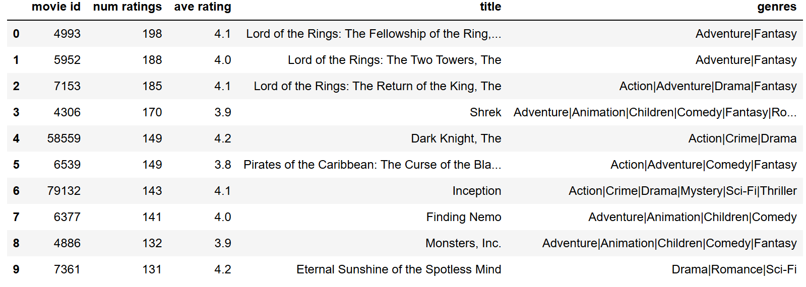
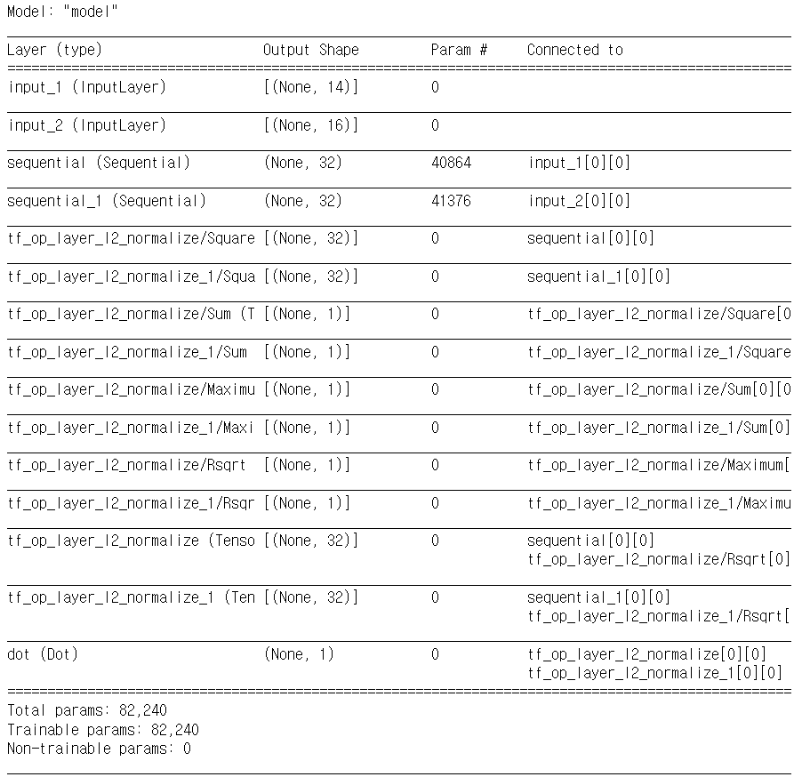
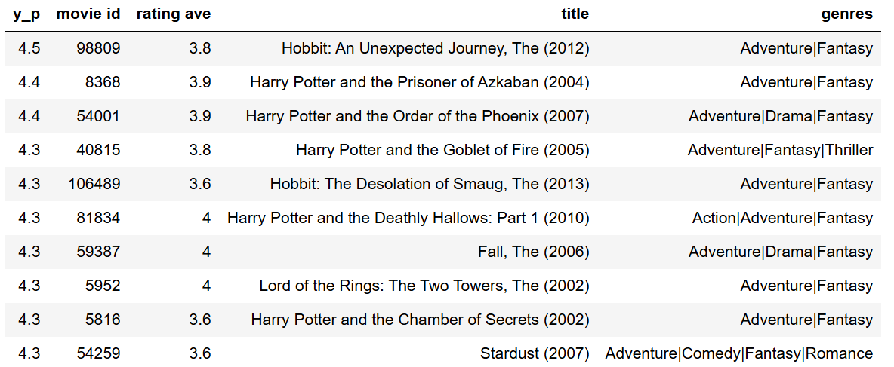
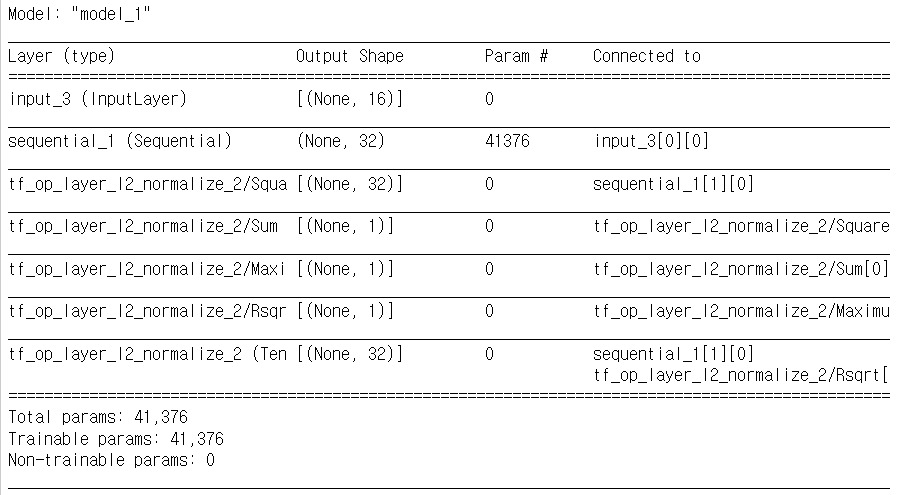

# ***1. Scenario***

I am a data scientist at a large streaming service company. My main objective is to help users discover movies and series that match their personal tastes. Recently, the leadership team decided to take personalization to the next level. They’ve asked me to design and implement a brand-new recommendation system that leverages the wealth of data the company has accumulated.

The platform logs **user ratings** (from 0.5 to 5 stars) along with limited user information, while the **movie metadata** includes titles, genres, release years, and average ratings. One big challenge is the diversity of users' preferences:

- Some users might love action/thriller but never touch romance.
- Others might be obsessed with animation or fantasy, ignoring other categories.

I realize that capturing these nuanced tastes requires a method to quantify how each user feels about different genres. After some brainstorming, I decide on a **content-based filtering** approach using neural networks. This approach will focus on:
- **Movie content**: one-hot genre vectors, release years, average ratings, etc.
- **User content**: engineered features like average rating by genre, which help to describe a user’s preference in a more fine-grained way.

My plan involves building a neural network that produces two kinds of vectors:
1. A **user vector (v_u)** summarizing a user’s preferences.
2. A **movie vector (v_m)** summarizing a movie’s characteristics.

I then compute the dot product of $v_u$ and $v_m$ to predict how much the user will like that movie. Higher dot products mean the user and the movie are more aligned in preference. This structure is flexible—I can feed new data sources (e.g., user demographics, watch-time patterns) into the pipeline later, if needed.

Here’s a simplified breakdown of the process:

1. **Data Preparation**  
   - Load and clean the user–movie ratings dataset.  
   - Convert movie genre data into a one-hot vector (e.g., 14 genres).  
   - For each user, calculate average ratings per genre. These become part of the user features.  
   - Standardize and scale the numerical features to ensure stable training.

2. **Model Design**  
   - Build two separate neural networks (one for users, one for movies), each with layers like `Dense -> Dense -> Dense`.  
   - Normalize the final 32-dimensional outputs so each vector has a unit norm.  
   - Take the dot product of those normalized vectors to get the predicted rating.

3. **Training and Evaluation**  
   - Use **Mean Squared Error (MSE)** as the loss function, optimize with **Adam**.  
   - Split into training and test sets, ensuring no severe overfitting.  
   - Check if training and test losses are reasonably close—if yes, it indicates the model generalizes to unseen data.

4. **Practical Usage**  
   - For a **new user**, you can infer their potential genre preferences and see which movies the model rates highly for them.  
   - For an **existing user** (already in the training set), compare predicted ratings with the user’s historical data to assess accuracy.  
   - Leverage the learned 32-dimensional **movie embeddings** to find other films that are “similar” to a user’s favorite title—handy for “If you liked X, you might also like Y” recommendations.

# ***2. Steps***

## ***Step 1 : Library Imports***

```python
import numpy as np
import numpy.ma as ma
import pandas as pd
import tensorflow as tf
from tensorflow import keras
from sklearn.preprocessing import StandardScaler, MinMaxScaler
from sklearn.model_selection import train_test_split
import tabulate
from recsysNN_utils import *
pd.set_option("display.precision", 1)
```

## ***Step 2 : Loading and Displaying the Data***

The data set is derived from the [MovieLens ml-latest-small](https://grouplens.org/datasets/movielens/latest/) dataset. 

[F. Maxwell Harper and Joseph A. Konstan. 2015. The MovieLens Datasets: History and Context. ACM Transactions on Interactive Intelligent Systems (TiiS) 5, 4: 19:1–19:19. <https://doi.org/10.1145/2827872>]

The original dataset has roughly 9000 movies rated by 600 users with ratings on a scale of 0.5 to 5 in 0.5 step increments. The dataset has been reduced in size to focus on movies from the years since 2000 and popular genres. The reduced dataset has $n_u = 397$ users, $n_m= 847$ movies and 25521 ratings. 

For each movie, the dataset provides a movie title, release date, and one or more genres. For example "Toy Story 3" was released in 2010 and has several genres: "Adventure|Animation|Children|Comedy|Fantasy". This dataset contains little information about users other than their ratings. This dataset is used to create training vectors for the neural networks described below. 

Let's learn a bit more about this data set. The table below shows the top 10 movies ranked by the number of ratings. These movies also happen to have high average ratings. How many of these movies have you watched? 

```python
top10_df = pd.read_csv("./data/content_top10_df.csv")
bygenre_df = pd.read_csv("./data/content_bygenre_df.csv")
top10_df
```

output:  


The next table shows information sorted by genre. The number of ratings per genre vary substantially. Note that a movie may have multiple genre's so the sum of the ratings below is larger than the number of original ratings.


```python
bygenre_df
```

output:  


## ***Step 3 : Content-based filtering with a neural network***

Content-based filtering generates a user and movie feature vector but recognizes there may be other information available about the user and/or movie that may improve the prediction. The additional information is provided to a neural network which then generates the user and movie vector

### ***3.1 Training Data***

The movie content provided to the network is a combination of the original data and some 'engineered features'. The original features are the year the movie was released and the movie's genre's presented as a one-hot vector. There are 14 genres. The engineered feature is an average rating derived from the user ratings. 

The user content is composed of engineered features. A per genre average rating is computed per user. Additionally, a user id, rating count and rating average are available but not included in the training or prediction content. They are carried with the data set because they are useful in interpreting data.

The training set consists of all the ratings made by the users in the data set. Some ratings are repeated to boost the number of training examples of underrepresented genre's. The training set is split into two arrays with the same number of entries, a user array and a movie/item array.  

Below, let's load and display some of the data.

```python
# Load Data, set configuration variables
item_train, user_train, y_train, item_features, user_features, item_vecs, movie_dict, user_to_genre = load_data()

num_user_features = user_train.shape[1] - 3  # remove userid, rating count and ave rating during training
num_item_features = item_train.shape[1] - 1  # remove movie id at train time
uvs = 3  # user genre vector start
ivs = 3  # item genre vector start
u_s = 3  # start of columns to use in training, user
i_s = 1  # start of columns to use in training, items
print(f"Number of training vectors: {len(item_train)}")
```

output:  
```
Number of training vectors: 50884
```

Let's look at the first few entries in the user training array.


```python
pprint_train(user_train, user_features, uvs,  u_s, maxcount=5)
```

output:  


Some of the user and item/movie features are not used in training. In the table above, the features in brackets "[]" such as the "user id", "rating count" and "rating ave" are not included when the model is trained and used.
Above you can see the per genre rating average for user 2. Zero entries are genre's which the user had not rated. The user vector is the same for all the movies rated by a user.  
Let's look at the first few entries of the movie/item array.


```python
pprint_train(item_train, item_features, ivs, i_s, maxcount=5, user=False)
```

output:  


Above, the movie array contains the year the film was released, the average rating and an indicator for each potential genre. The indicator is one for each genre that applies to the movie. The movie id is not used in training but is useful when interpreting the data.

```python
print(f"y_train[:5]: {y_train[:5]}")
```

output:
```
y_train[:5]: [4.  3.5 4.  4.  4.5]
```

The target, y, is the movie rating given by the user. 

Above, we can see that movie 6874 is an Action/Crime/Thriller movie released in 2003. User 2 rates action movies as 3.9 on average. MovieLens users gave the movie an average rating of 4. 'y' is 4 indicating user 2 rated movie 6874 as a 4 as well. A single training example consists of a row from both the user and item arrays and a rating from y_train.

### ***3.2 Preparing the training data***

We'll scale the input features using the [scikit learn StandardScaler](https://scikit-learn.org/stable/modules/generated/sklearn.preprocessing.StandardScaler.html). Below, the inverse_transform is also shown to produce the original inputs. We'll scale the target ratings using a Min Max Scaler which scales the target to be between -1 and 1. [scikit learn MinMaxScaler](https://scikit-learn.org/stable/modules/generated/sklearn.preprocessing.MinMaxScaler.html)

```python
# scale training data
item_train_unscaled = item_train
user_train_unscaled = user_train
y_train_unscaled    = y_train

scalerItem = StandardScaler()
scalerItem.fit(item_train)
item_train = scalerItem.transform(item_train)

scalerUser = StandardScaler()
scalerUser.fit(user_train)
user_train = scalerUser.transform(user_train)

scalerTarget = MinMaxScaler((-1, 1))
scalerTarget.fit(y_train.reshape(-1, 1))
y_train = scalerTarget.transform(y_train.reshape(-1, 1))
#ynorm_test = scalerTarget.transform(y_test.reshape(-1, 1))

print(np.allclose(item_train_unscaled, scalerItem.inverse_transform(item_train)))
print(np.allclose(user_train_unscaled, scalerUser.inverse_transform(user_train)))
```

output:
```
True
True
```

To allow us to evaluate the results, I will split the data into training and test sets. Here I will use [sklean train_test_split](https://scikit-learn.org/stable/modules/generated/sklearn.model_selection.train_test_split.html) to split and shuffle the data. Note that setting the initial random state to the same value ensures item, user, and y are shuffled identically.

```python
item_train, item_test = train_test_split(item_train, train_size=0.80, shuffle=True, random_state=1)
user_train, user_test = train_test_split(user_train, train_size=0.80, shuffle=True, random_state=1)
y_train, y_test       = train_test_split(y_train,    train_size=0.80, shuffle=True, random_state=1)
print(f"movie/item training data shape: {item_train.shape}")
print(f"movie/item test data shape: {item_test.shape}")
```

output:
```
movie/item training data shape: (40707, 17)
movie/item test data shape: (10177, 17)
```

The scaled, shuffled data now has a mean of zero.

```python
pprint_train(user_train, user_features, uvs, u_s, maxcount=5)
```

output:  


## ***Step 4 : Neural Network for content-based filtering***

Now, let's construct a neural network as described in the figure above. It will have two networks that are combined by a dot product. I will construct the two networks. And they will be identical. Note that these networks do not need to be the same. 

If the user content was substantially larger than the movie content, you might elect to increase the complexity of the user network relative to the movie network. In this case, the content is similar, so the networks are the same.

- Using a Keras sequential model
  - The first layer is a dense layer with 256 units and a relu activation.
  - The second layer is a dense layer with 128 units and a relu activation.
  - The third layer is a dense layer with `num_outputs` units and a linear or no activation.   
    
I'll use the Keras [functional api](https://keras.io/guides/functional_api/). This format allows for more flexibility in how components are interconnected.

```python
num_outputs = 32
tf.random.set_seed(1)
user_NN = tf.keras.models.Sequential([
  tf.keras.layers.Dense(256, activation='relu'),
  tf.keras.layers.Dense(128, activation='relu'),
  tf.keras.layers.Dense(num_outputs),
])

item_NN = tf.keras.models.Sequential([
  tf.keras.layers.Dense(256, activation='relu'),
  tf.keras.layers.Dense(128, activation='relu'),
  tf.keras.layers.Dense(num_outputs),
])

# create the user input and point to the base network
input_user = tf.keras.layers.Input(shape=(num_user_features))
vu = user_NN(input_user)
vu = tf.linalg.l2_normalize(vu, axis=1)

# create the item input and point to the base network
input_item = tf.keras.layers.Input(shape=(num_item_features))
vm = item_NN(input_item)
vm = tf.linalg.l2_normalize(vm, axis=1)

# compute the dot product of the two vectors vu and vm
output = tf.keras.layers.Dot(axes=1)([vu, vm])

# specify the inputs and output of the model
model = tf.keras.Model([input_user, input_item], output)

model.summary()
```

output:  


I will use a mean squared error loss and an Adam optimizer.

```python
tf.random.set_seed(1)
cost_fn = tf.keras.losses.MeanSquaredError()
opt = keras.optimizers.Adam(learning_rate=0.01)
model.compile(optimizer=opt,
              loss=cost_fn)
```
```python
tf.random.set_seed(1)
model.fit([user_train[:, u_s:], item_train[:, i_s:]], y_train, epochs=30)
```

Evaluate the model to determine loss on the test data. 

```python
model.evaluate([user_test[:, u_s:], item_test[:, i_s:]], y_test)
```

output:
```
0.08146006993124337
```

It is comparable to the training loss indicating the model has not substantially overfit the training data.

## ***Step 5 : Predictions***
Below, I will use the model to make predictions in a number of circumstances. 

### ***5.1 - Predictions for a new user***
First, I will create a new user and have the model suggest movies for that user.  

```python
new_user_id = 5000
new_rating_ave = 0.0
new_action = 0.0
new_adventure = 5.0
new_animation = 0.0
new_childrens = 0.0
new_comedy = 0.0
new_crime = 0.0
new_documentary = 0.0
new_drama = 0.0
new_fantasy = 5.0
new_horror = 0.0
new_mystery = 0.0
new_romance = 0.0
new_scifi = 0.0
new_thriller = 0.0
new_rating_count = 3

user_vec = np.array([[new_user_id, new_rating_count, new_rating_ave,
                      new_action, new_adventure, new_animation, new_childrens,
                      new_comedy, new_crime, new_documentary,
                      new_drama, new_fantasy, new_horror, new_mystery,
                      new_romance, new_scifi, new_thriller]])
```

The new user enjoys movies from the adventure, fantasy genres. Let's find the top-rated movies for the new user.  

Below, I will use a set of movie/item vectors, `item_vecs` that have a vector for each movie in the training/test set. This is matched with the new user vector above and the scaled vectors are used to predict ratings for all the movies.

```python
# generate and replicate the user vector to match the number movies in the data set.
user_vecs = gen_user_vecs(user_vec,len(item_vecs))

# scale our user and item vectors
suser_vecs = scalerUser.transform(user_vecs)
sitem_vecs = scalerItem.transform(item_vecs)

# make a prediction
y_p = model.predict([suser_vecs[:, u_s:], sitem_vecs[:, i_s:]])

# unscale y prediction 
y_pu = scalerTarget.inverse_transform(y_p)

# sort the results, highest prediction first
sorted_index = np.argsort(-y_pu,axis=0).reshape(-1).tolist()  #negate to get largest rating first
sorted_ypu   = y_pu[sorted_index]
sorted_items = item_vecs[sorted_index]  #using unscaled vectors for display

print_pred_movies(sorted_ypu, sorted_items, movie_dict, maxcount = 10)
```

output:  


### ***5.2 - Predictions for an existing user***

Let's look at the predictions for "user 2", one of the users in the data set. I can compare the predicted ratings with the model's ratings.

```python
uid = 2 
# form a set of user vectors. This is the same vector, transformed and repeated.
user_vecs, y_vecs = get_user_vecs(uid, user_train_unscaled, item_vecs, user_to_genre)

# scale our user and item vectors
suser_vecs = scalerUser.transform(user_vecs)
sitem_vecs = scalerItem.transform(item_vecs)

# make a prediction
y_p = model.predict([suser_vecs[:, u_s:], sitem_vecs[:, i_s:]])

# unscale y prediction 
y_pu = scalerTarget.inverse_transform(y_p)

# sort the results, highest prediction first
sorted_index = np.argsort(-y_pu,axis=0).reshape(-1).tolist()  #negate to get largest rating first
sorted_ypu   = y_pu[sorted_index]
sorted_items = item_vecs[sorted_index]  #using unscaled vectors for display
sorted_user  = user_vecs[sorted_index]
sorted_y     = y_vecs[sorted_index]

#print sorted predictions for movies rated by the user
print_existing_user(sorted_ypu, sorted_y.reshape(-1,1), sorted_user, sorted_items, ivs, uvs, movie_dict, maxcount = 50)
```

output:  


The model prediction is generally within 1 of the actual rating though it is not a very accurate predictor of how a user rates specific movies. This is especially true if the user rating is significantly different than the user's genre average. You can vary the user id above to try different users. Not all user id's were used in the training set.

### ***5.3 - Finding Similar Items***
The neural network above produces two feature vectors, a user feature vector $v_u$, and a movie feature vector, $v_m$. These are 32 entry vectors whose values are difficult to interpret. However, similar items will have similar vectors. This information can be used to make recommendations. For example, if a user has rated "Toy Story 3" highly, one could recommend similar movies by selecting movies with similar movie feature vectors.

A similarity measure is the squared distance between the two vectors $\mathbf{v_m^{(k)}}$ and $\mathbf{v_m^{(i)}}$ :  

$$
\left\Vert \mathbf{v_m^{(k)}} - \mathbf{v_m^{(i)}} \right\Vert^2 = \sum_{l=1}^{n}(v_{m_l}^{(k)} - v_{m_l}^{(i)})^2
$$

I will write a function to compute the square distance.

```python
def sq_dist(a,b):
    d = np.sum(np.square(a - b))
    return d
```

```python
a1 = np.array([1.0, 2.0, 3.0]); b1 = np.array([1.0, 2.0, 3.0])
a2 = np.array([1.1, 2.1, 3.1]); b2 = np.array([1.0, 2.0, 3.0])
a3 = np.array([0, 1, 0]);       b3 = np.array([1, 0, 0])
print(f"squared distance between a1 and b1: {sq_dist(a1, b1):0.3f}")
print(f"squared distance between a2 and b2: {sq_dist(a2, b2):0.3f}")
print(f"squared distance between a3 and b3: {sq_dist(a3, b3):0.3f}")
```

output:
```
squared distance between a1 and b1: 0.000    
squared distance between a2 and b2: 0.030   
squared distance between a3 and b3: 2.000
```

A matrix of distances between movies can be computed once when the model is trained and then reused for new recommendations without retraining. The first step, once a model is trained, is to obtain the movie feature vector, $v_m$, for each of the movies. To do this, I will use the trained `item_NN` and build a small model to allow me to run the movie vectors through it to generate $v_m$.

```python
input_item_m = tf.keras.layers.Input(shape=(num_item_features))    # input layer
vm_m = item_NN(input_item_m)                                       # use the trained item_NN
vm_m = tf.linalg.l2_normalize(vm_m, axis=1)                        # incorporate normalization as was done in the original model
model_m = tf.keras.Model(input_item_m, vm_m)                                
model_m.summary()
```

output:  


Once I have a movie model, I can create a set of movie feature vectors by using the model to predict using a set of item/movie vectors as input. `item_vecs` is a set of all of the movie vectors. It must be scaled to use with the trained model. The result of the prediction is a 32 entry feature vector for each movie.

```python
scaled_item_vecs = scalerItem.transform(item_vecs)
vms = model_m.predict(scaled_item_vecs[:,i_s:])
print(f"size of all predicted movie feature vectors: {vms.shape}")
```

output:  
```
size of all predicted movie feature vectors: (847, 32)
```

Let's now compute a matrix of the squared distance between each movie feature vector and all other movie feature vectors.

I can then find the closest movie by finding the minimum along each row. I will make use of [numpy masked arrays](https://numpy.org/doc/1.21/user/tutorial-ma.html) to avoid selecting the same movie. The masked values along the diagonal won't be included in the computation.

```python
count = 50  # number of movies to display
dim = len(vms)
dist = np.zeros((dim,dim))

for i in range(dim):
    for j in range(dim):
        dist[i,j] = sq_dist(vms[i, :], vms[j, :])
        
m_dist = ma.masked_array(dist, mask=np.identity(dist.shape[0]))  # mask the diagonal

disp = [["movie1", "genres", "movie2", "genres"]]
for i in range(count):
    min_idx = np.argmin(m_dist[i])
    movie1_id = int(item_vecs[i,0])
    movie2_id = int(item_vecs[min_idx,0])
    disp.append( [movie_dict[movie1_id]['title'], movie_dict[movie1_id]['genres'],
                  movie_dict[movie2_id]['title'], movie_dict[movie1_id]['genres']]
               )
table = tabulate.tabulate(disp, tablefmt='html', headers="firstrow")
table
```

The results show the model will generally suggest a movie with similar genre's.

## ***3. Conclusion***

I used **MovieLens rating data** plus **engineered user and movie features** to demonstrate a **content-based filtering** technique with neural networks. Here are the key takeaways:

1. **Data Preprocessing & Feature Engineering**  
   - Proper scaling (e.g., StandardScaler, MinMaxScaler) and careful selection of user/movie features greatly influence the predictive power.  
   - Computing per-genre averages for users helps capture nuanced tastes that improve predictions.

2. **Neural Network Embeddings**  
   - Each neural network (user NN, movie NN) yields a **32-dimensional embedding** that is `l2_normalize`d.  
   - The dot product of these embeddings gives the predicted rating. This approach is flexible—if you later want to incorporate more features, you can adjust the network structure without major redesign.

3. **Training & Validation**  
   - Monitoring **MSE** during training and comparing it on both training and test sets helps detect overfitting.  
   - If the test MSE stays close to the training MSE, it implies the model has captured meaningful patterns rather than memorizing the training data.

4. **Recommendations & Item Similarity**  
   - With the final trained model, you can quickly predict ratings for new users by constructing a vector of their potential preferences.  
   - For existing users, you can see how close the predictions align with their actual ratings.  
   - The 32-dimensional movie embeddings also let you measure distance (e.g., Euclidean or cosine) between movies, enabling a “find similar movies” function—crucial in most recommendation systems.

In a real-world production environment, you’d likely combine this method with **collaborative filtering**, extensive **user behavior logs**, and a robust **inference architecture** that scales to millions of predictions per second. But this exercise effectively demonstrates the core idea of content-based neural network recommendations and how they capture both user preferences and movie attributes.
