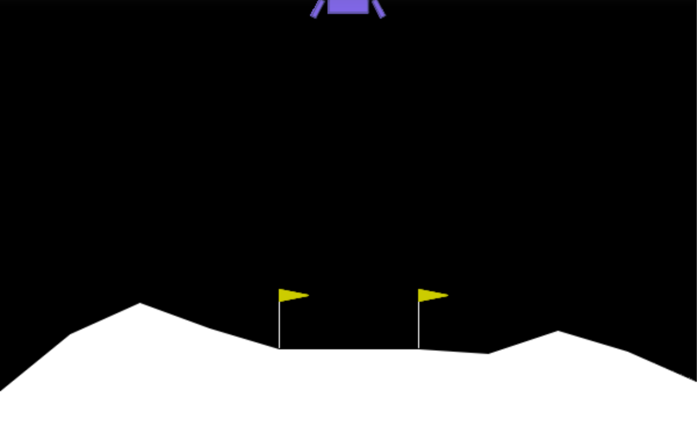
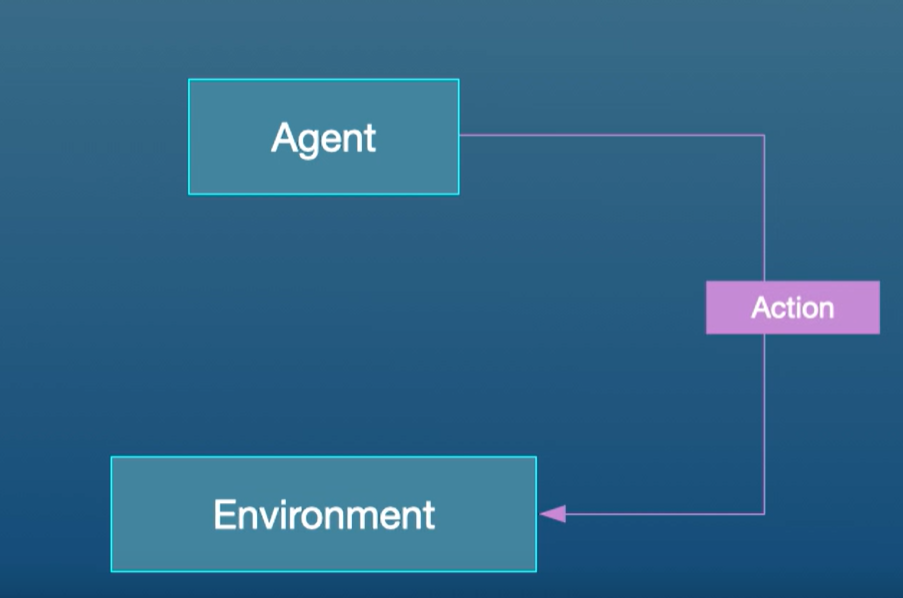
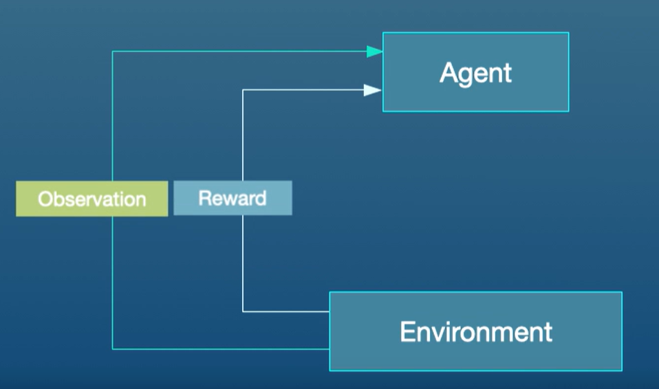
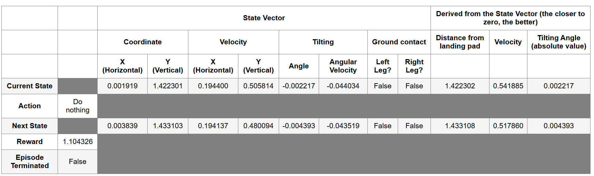
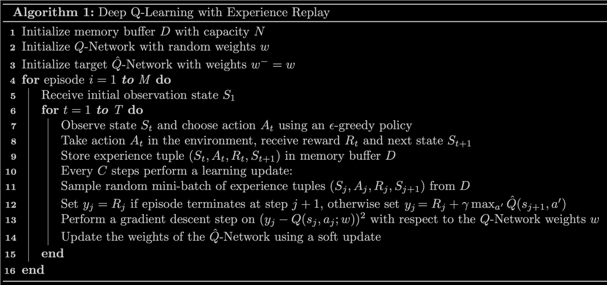

# ***1. Scenario***

I'm on a mission to train an autonomous Lunar Lander to touch down smoothly on the Moon's surface—right between two flagpoles marking the landing pad. The lander starts each episode near the top of the screen, with a bit of random force nudging it sideways. It has four discrete actions (do nothing, fire right thruster, fire left thruster, or fire the main thruster), and I want to figure out the best way to use them so that the lander doesn't crash or drift off-screen. 

To do this, I'll apply a Deep Q-Network (DQN) approach. My agent will observe an 8-dimensional state (positions, velocities, angle, and which legs are grounded), receive rewards based on stable landings or crashes, and learn by iteratively updating a neural network that approximates the action-value function $Q(s, a)$. I'll use:
- **Experience Replay** (storing past transitions in a buffer and sampling random mini-batches).
- A **Target Network** (a slowly-updated copy of my Q-network) to stabilize training.
- An **$\epsilon$-greedy** policy so the agent explores actions beyond its initial guesses.

Once trained, the agent should discover a strategy that maximizes rewards (safe landings) and minimizes penalties (crashes, excessive fuel usage). In essence, it’s learning a policy to go from random thruster firing to a controlled descent, culminating in a soft, precise touchdown on the lunar surface.

---

# ***2. Steps***

## Step 1: Library Imports

I'll make use of the following packages:
- `deque` will be my data structure for my memory buffer.
- `namedtuple` will be used to store the experience tuples.
- The `gym` toolkit is a collection of environments that can be used to test reinforcement learning algorithms. I'll use `gym` version `0.24.0`.
- `PIL.Image` and `pyvirtualdisplay` are needed to render the Lunar Lander environment.
- I'll use several modules from the `tensorflow.keras` framework for building deep learning models.

```python
import time
from collections import deque, namedtuple

import gym
import numpy as np
import PIL.Image
import tensorflow as tf

from pyvirtualdisplay import Display
from tensorflow.keras import Sequential
from tensorflow.keras.layers import Dense, Input
from tensorflow.keras.losses import MSE
from tensorflow.keras.optimizers import Adam
```
```python
# Set up a virtual display to render the Lunar Lander environment.
Display(visible=0, size=(840, 480)).start();

# Set the random seed for TensorFlow
tf.random.set_seed(utils.SEED)
```

## Step 2: Hyperparameters

```python
MEMORY_SIZE = 100_000     # size of memory buffer
GAMMA = 0.995             # discount factor
ALPHA = 1e-3              # learning rate  
NUM_STEPS_FOR_UPDATE = 4  # perform a learning update every C time steps
```

## Step 3: The Lunar Lander Environment

In this project, I will be using [OpenAI's Gym Library](https://www.gymlibrary.dev/). The Gym library provides a wide variety of environments for reinforcement learning. To put it simply, an environment represents a problem or task to be solved.

The goal of the Lunar Lander environment is to land the lunar lander safely on the landing pad on the surface of the moon. The landing pad is designated by two flag poles and its center is at coordinates `(0,0)` but the lander is also allowed to land outside of the landing pad. The lander starts at the top center of the environment with a random initial force applied to its center of mass and has infinite fuel. The environment is considered solved if I get `200` points. 

### 3.1 Action Space

The agent has fmy discrete actions available:

* Do nothing.
* Fire right engine.
* Fire main engine.
* Fire left engine.

Each action has a corresponding numerical value:

```python
Do nothing = 0
Fire right engine = 1
Fire main engine = 2
Fire left engine = 3
```

### 3.2 Observation Space

The agent's observation space consists of a state vector with 8 variables:

* Its $(x,y)$ coordinates. The landing pad is always at coordinates $(0,0)$.
* Its linear velocities $(\dot x,\dot y)$.
* Its angle $\theta$.
* Its angular velocity $\dot \theta$.
* Two booleans, $l$ and $r$, that represent whether each leg is in contact with the ground or not.

### 3.3 Rewards

After every step, a reward is granted. The total reward of an episode is the sum of the rewards for all the steps within that episode.

For each step, the reward:
- is increased/decreased the closer/further the lander is to the landing pad.
- is increased/decreased the slower/faster the lander is moving.
- is decreased the more the lander is tilted (angle not horizontal).
- is increased by 10 points for each leg that is in contact with the ground.
- is decreased by 0.03 points each frame a side engine is firing.
- is decreased by 0.3 points each frame the main engine is firing.

The episode receives an additional reward of -100 or +100 points for crashing or landing safely respectively.

### 3.4 Episode Termination

An episode ends (i.e the environment enters a terminal state) if:

* The lunar lander crashes (i.e if the body of the lunar lander comes in contact with the surface of the moon).

* The absolute value of the lander's $x$-coordinate is greater than 1 (i.e. it goes beyond the left or right border)

I can check out the [Open AI Gym documentation](https://www.gymlibrary.dev/environments/box2d/lunar_lander/) for a full description of the environment. 

## Step 4: Load the Environment

I start by loading the `LunarLander-v2` environment from the `gym` library by using the `.make()` method. I can read about its version history in the [Open AI Gym documentation](https://www.gymlibrary.dev/environments/box2d/lunar_lander/#version-history).

```python
env = gym.make('LunarLander-v2')
```

Once I load the environment, I use the `.reset()` method to reset the environment to the initial state. The lander starts at the top center of the environment and I can render the first frame of the environment by using the `.render()` method.

```python
env.reset()
PIL.Image.fromarray(env.render(mode='rgb_array'))
```

output:  


In order to build my neural network later on, I need to know the size of the state vector and the number of valid actions. I can get this information from my environment by using the `.observation_space.shape` and `action_space.n` methods, respectively.

```python
state_size = env.observation_space.shape
num_actions = env.action_space.n

print('State Shape:', state_size)
print('Number of actions:', num_actions)
```

output:
```
State Shape: (8,)
Number of actions: 4
```

## Step 5: Interacting with the Gym Environment

The Gym library implements the standard “agent-environment loop” formalism:




In the standard “agent-environment loop” formalism, an agent interacts with the environment in discrete time steps t=0,1,2,.... At each time step $t$, the agent uses a policy $\pi$ to select an action $A_t$ based on its observation of the environment's state $S_t$. The agent receives a numerical reward $R_t$ and on the next time step, moves to a new state $S_{t+1}$.

### 5.1 Exploring the Environment's Dynamics

In Open AI's Gym environments, I use the `.step()` method to run a single time step of the environment's dynamics. In the version of `gym` that I are using the `.step()` method accepts an action and returns fmy values:

* `observation` (**object**): an environment-specific object representing Ir observation of the environment. In the Lunar Lander environment this corresponds to a numpy array containing the positions and velocities of the lander as described in section [3.2 Observation Space](#3.2).


* `reward` (**float**): amount of reward returned as a result of taking the given action. In the Lunar Lander environment this corresponds to a float of type `numpy.float64` as described in section [3.3 Rewards](#3.3).


* `done` (**boolean**): When done is `True`, it indicates the episode has terminated and it’s time to reset the environment. 


* `info` (**dictionary**): diagnostic information useful for debugging. I won't be using this variable in this notebook but it is shown here for completeness.

To begin an episode, I need to reset the environment to an initial state. I do this by using the `.reset()` method. 

```python
# Reset the environment and get the initial state.
current_state = env.reset()
```

Once the environment is reset, the agent can start taking actions in the environment by using the `.step()` method. Note that the agent can only take one action per time step. 

In the cell below I can select different actions and see how the returned values change depending on the action taken. Remember that in this environment the agent has fmy discrete actions available and I specify them in code by using their corresponding numerical value:

```python
Do nothing = 0
Fire right engine = 1
Fire main engine = 2
Fire left engine = 3
```

```python
# Select an action
action = 0

# Run a single time step of the environment's dynamics with the given action.
next_state, reward, done, _ = env.step(action)

# Display table with values.
utils.display_table(current_state, action, next_state, reward, done)

# Replace the `current_state` with the state after the action is taken
current_state = next_state
```

output:


In practice, when I train the agent I use a loop to allow the agent to take many consecutive actions during an episode.

## Step 6: Deep Q-Learning

In cases where both the state and action space are discrete I can estimate the action-value function iteratively by using the Bellman equation:  

$$
Q_{i+1}(s,a) = R + \gamma \max_{a'}Q_i(s',a')
$$  

This iterative method converges to the optimal action-value function $Q^*(s,a)$ as $i \to \infty$. This means that the agent just needs to gradually explore the state-action space and keep updating the estimate of $Q(s,a)$ until it converges to the optimal action-value function $Q^*(s,a)$. However, in cases where the state space is continuous it becomes practically impossible to explore the entire state-action space. Consequently, this also makes it practically impossible to gradually estimate $Q(s,a)$ until it converges to $Q^*(s,a)$.

In the Deep $Q$-Learning, I solve this problem by using **a neural network** to estimate the action-value function $Q(s,a)\approx Q^*(s,a)$. I call this neural network a $Q$-Network and it can be trained by adjusting its weights at each iteration to minimize the mean-squared error in the Bellman equation.

Unfortunately, using neural networks in reinforcement learning to estimate action-value functions has proven to be highly unstable. Luckily, there's a couple of techniques that can be employed to avoid instabilities. These techniques consist of using a ***Target Network*** and ***Experience Replay***. I will explore these two techniques in the following sections.

### 6.1 Target Network

I can train the $Q$-Network by adjusting it's weights at each iteration to minimize the mean-squared error in the Bellman equation, where the target values are given by:  

$$
y = R + \gamma \max_{a'}Q(s',a';w)
$$

where $w$ are the weights of the $Q$-Network. This means that I am adjusting the weights $w$ at each iteration to minimize the following error:  

$$
\overbrace{\underbrace{R + \gamma \max_{a'}Q(s',a'; w)}_{\rm {y~target}} - Q(s,a;w)}^{\rm {Error}}
$$

Notice that this forms a problem because the $y$ target is changing on every iteration. Having a constantly moving target can lead to oscillations and instabilities. To avoid this, I can create a separate neural network for generating the $y$ targets. I call this separate neural network the **target $\hat Q$-Network** and it will have the same architecture as the original $Q$-Network. By using the target $\hat Q$-Network, the above error becomes:  

$$
\overbrace{\underbrace{R + \gamma \max_{a'}\hat{Q}(s',a'; w^-)}_{\rm {y~target}} - Q(s,a;w)}^{\rm {Error}}
$$

where $w^-$ and $w$ are the weights of the target $\hat Q$-Network and $Q$-Network, respectively.

In practice, I will use the following algorithm: every $C$ time steps I will use the $\hat Q$-Network to generate the $y$ targets and update the weights of the target $\hat Q$-Network using the weights of the $Q$-Network. I will update the weights $w^-$ of the the target $\hat Q$-Network using a **soft update**. This means that I will update the weights $w^-$ using the following rule:  

$$
w^-\leftarrow \tau w + (1 - \tau) w^-
$$

where $\tau\ll 1$. By using the soft update, I are ensuring that the target values, $y$, change slowly, which greatly improves the stability of my learning algorithm.

In this project, I will create the $Q$ and target $\hat Q$ networks and set the optimizer. Remember that the Deep $Q$-Network (DQN) is a neural network that approximates the action-value function $Q(s,a)\approx Q^*(s,a)$. It does this by learning how to map states to $Q$ values.

To solve the Lunar Lander environment, I am going to employ a DQN with the following architecture:

* An `Input` layer that takes `state_size` as input.

* A `Dense` layer with `64` units and a `relu` activation function.

* A `Dense` layer with `64` units and a `relu` activation function.

* A `Dense` layer with `num_actions` units and a `linear` activation function. This will be the output layer of my network.

Lastly, I should set `Adam` as the optimizer with a learning rate equal to `ALPHA`. Recall that `ALPHA` was defined in the [Hyperparameters](#2) section. I should note that for this exercise I should use the already imported packages:

```python
from tensorflow.keras.layers import Dense, Input
from tensorflow.keras.optimizers import Adam
```

```python
# Create the Q-Network
q_network = Sequential([
    Input(shape=state_size),                      
    Dense(units=64, activation='relu'),            
    Dense(units=64, activation='relu'),            
    Dense(units=num_actions, activation='linear'),
    ])

# Create the target Q^-Network
target_q_network = Sequential([
    Input(shape=state_size),                       
    Dense(units=64, activation='relu'),            
    Dense(units=64, activation='relu'),            
    Dense(units=num_actions, activation='linear'), 
    ])
    ])

optimizer = Adam(learning_rate=ALPHA)                                  
```

### 6.2 Experience Replay

When an agent interacts with the environment, the states, actions, and rewards the agent experiences are sequential by nature. If the agent tries to learn from these consecutive experiences it can run into problems due to the strong correlations between them. To avoid this, I employ a technique known as **Experience Replay** to generate uncorrelated experiences for training my agent. Experience replay consists of storing the agent's experiences (i.e the states, actions, and rewards the agent receives) in a memory buffer and then sampling a random mini-batch of experiences from the buffer to do the learning. The experience tuples $(S_t, A_t, R_t, S_{t+1})$ will be added to the memory buffer at each time step as the agent interacts with the environment.

For convenience, I will store the experiences as named tuples.

```python
# Store experiences as named tuples
experience = namedtuple("Experience", field_names=["state", "action", "reward", "next_state", "done"])
```

By using experience replay I avoid problematic correlations, oscillations and instabilities. In addition, experience replay also allows the agent to potentially use the same experience in multiple weight updates, which increases data efficiency.

## Step 7: Deep Q-Learning Algorithm with Experience Replay

Now that I know all the techniques that I am going to use, I can put them together to arrive at the Deep Q-Learning Algorithm With Experience Replay.

I will compute the loss between the $y$ targets and the $Q(s,a)$ values.  

$$
\begin{equation}
    y_j =
    \begin{cases}
      R_j & \text{if episode terminates at step  } j+1\\
      R_j + \gamma \max_{a'}\hat{Q}(s_{j+1},a') & \text{otherwise}\\
    \end{cases}       
\end{equation}
$$

Here are a couple of things to note:

* The `compute_loss` function takes in a mini-batch of experience tuples. This mini-batch of experience tuples is unpacked to extract the `states`, `actions`, `rewards`, `next_states`, and `done_vals`. I should keep in mind that these variables are *TensorFlow Tensors* whose size will depend on the mini-batch size. For example, if the mini-batch size is `64` then both `rewards` and `done_vals` will be TensorFlow Tensors with `64` elements.


* Using `if/else` statements to set the $y$ targets will not work when the variables are tensors with many elements. However, notice that I can use the `done_vals` to implement the above in a single line of code. To do this, recall that the `done` variable is a Boolean variable that takes the value `True` when an episode terminates at step $j+1$ and it is `False` otherwise. Taking into account that a Boolean value of `True` has the numerical value of `1` and a Boolean value of `False` has the numerical value of `0`, I can use the factor `(1 - done_vals)` to implement the above in a single line of code. Here's a hint: notice that `(1 - done_vals)` has a value of `0` when `done_vals` is `True` and a value of `1` when `done_vals` is `False`. 

Lastly, compute the loss by calculating the Mean-Squared Error (`MSE`) between the `y_targets` and the `q_values`. To calculate the mean-squared error I should use the already imported package `MSE`:

```python
from tensorflow.keras.losses import MSE
```

```python
def compute_loss(experiences, gamma, q_network, target_q_network):
    """ 
    Calculates the loss.
    
    Args:
      experiences: (tuple) tuple of ["state", "action", "reward", "next_state", "done"] namedtuples
      gamma: (float) The discount factor.
      q_network: (tf.keras.Sequential) Keras model for predicting the q_values
      target_q_network: (tf.keras.Sequential) Keras model for predicting the targets
          
    Returns:
      loss: (TensorFlow Tensor(shape=(0,), dtype=int32)) the Mean-Squared Error between
            the y targets and the Q(s,a) values.
    """

    # Unpack the mini-batch of experience tuples
    states, actions, rewards, next_states, done_vals = experiences
    
    # Compute max Q^(s,a)
    max_qsa = tf.reduce_max(target_q_network(next_states), axis=-1)
    
    # Set y = R if episode terminates, otherwise set y = R + γ max Q^(s,a).
    y_targets = rewards + (gamma * max_qsa * (1 - done_vals))
    
    # Get the q_values and reshape to match y_targets
    q_values = q_network(states)
    q_values = tf.gather_nd(q_values, tf.stack([tf.range(q_values.shape[0]),
                                                tf.cast(actions, tf.int32)], axis=1))
        
    # Compute the loss
    loss = MSE(y_targets, q_values)
    
    return loss
```

## Step 8: Update the Network Weights

I will use the `agent_learn` function. The `agent_learn` function will update the weights of the $Q$ and target $\hat Q$ networks using a custom training loop. Because I am using a custom training loop I need to retrieve the gradients via a `tf.GradientTape` instance, and then call `optimizer.apply_gradients()` to update the weights of my $Q$-Network. Note that I am also using the `@tf.function` decorator to increase performance. Without this decorator my training will take twice as long. If I would like to know more about how to increase performance with `@tf.function` take a look at the [TensorFlow documentation](https://www.tensorflow.org/guide/function).

The last line of this function updates the weights of the target $\hat Q$-Network.

```python
@tf.function
def agent_learn(experiences, gamma):
    """
    Updates the weights of the Q networks.
    
    Args:
      experiences: (tuple) tuple of ["state", "action", "reward", "next_state", "done"] namedtuples
      gamma: (float) The discount factor.
    
    """
    
    # Calculate the loss
    with tf.GradientTape() as tape:
        loss = compute_loss(experiences, gamma, q_network, target_q_network)

    # Get the gradients of the loss with respect to the weights.
    gradients = tape.gradient(loss, q_network.trainable_variables)
    
    # Update the weights of the q_network.
    optimizer.apply_gradients(zip(gradients, q_network.trainable_variables))

    # update the weights of target q_network
    utils.update_target_network(q_network, target_q_network)
```

## Step 9: Train the Agent

I am now ready to train my agent to solve the Lunar Lander environment. In the cell below I will implement the algorithm line by line:



* **Line 1**: I initialize the `memory_buffer` with a capacity of $N =$ `MEMORY_SIZE`. Notice that I am using a `deque` as the data structure for my `memory_buffer`.

* **Line 2**: I skip this line since I already initialized the `q_network`.

* **Line 3**: I initialize the `target_q_network` by setting its weights to be equal to those of the `q_network`.

* **Line 4**: I start the outer loop. Notice that I have set $M =$ `num_episodes = 2000`. This number is reasonable because the agent should be able to solve the Lunar Lander environment in less than `2000` episodes using this notebook's default parameters.

* **Line 5**: I use the `.reset()` method to reset the environment to the initial state and get the initial state.

* **Line 6**: I start the inner loop. Notice that I have set $T =$ `max_num_timesteps = 1000`. This means that the episode will automatically terminate if the episode hasn't terminated after `1000` time steps.  

* **Line 7**: The agent observes the current `state` and chooses an `action` using an $\epsilon$-greedy policy. my agent starts out using a value of $\epsilon =$ `epsilon = 1` which yields an $\epsilon$-greedy policy that is equivalent to the equiprobable random policy. This means that at the beginning of my training, the agent is just going to take random actions regardless of the observed `state`. As training progresses I will decrease the value of $\epsilon$ slowly towards a minimum value using a given $\epsilon$-decay rate. I want this minimum value to be close to zero because a value of $\epsilon = 0$ will yield an $\epsilon$-greedy policy that is equivalent to the greedy policy. This means that towards the end of training, the agent will lean towards selecting the `action` that it believes (based on its past experiences) will maximize $Q(s,a)$. I will set the minimum $\epsilon$ value to be `0.01` and not exactly 0 because I always want to keep a little bit of exploration during training. If I want to know how this is implemented in code I encourage I to take a look at the `utils.get_action` function in the `utils` module.


* **Line 8**: I use the `.step()` method to take the given `action` in the environment and get the `reward` and the `next_state`. 

* **Line 9**: I store the `experience(state, action, reward, next_state, done)` tuple in my `memory_buffer`. Notice that I also store the `done` variable so that I can keep track of when an episode terminates. 

* **Line 10**: I check if the conditions are met to perform a learning update. I do this by using my custom `utils.check_update_conditions` function. This function checks if $C =$ `NUM_STEPS_FOR_UPDATE = 4` time steps have occured and if my `memory_buffer` has enough experience tuples to fill a mini-batch. For example, if the mini-batch size is `64`, then my `memory_buffer` should have more than `64` experience tuples in order to pass the latter condition. If the conditions are met, then the `utils.check_update_conditions` function will return a value of `True`, otherwise it will return a value of `False`.

* **Lines 11 - 14**: If the `update` variable is `True` then I perform a learning update. The learning update consists of sampling a random mini-batch of experience tuples from my `memory_buffer`, setting the $y$ targets, performing gradient descent, and updating the weights of the networks. I will use the `agent_learn` function I defined in [Section 8](#8) to perform the latter 3.

* **Line 15**: At the end of each iteration of the inner loop I set `next_state` as my new `state` so that the loop can start again from this new state. In addition, I check if the episode has reached a terminal state (i.e I check if `done = True`). If a terminal state has been reached, then I break out of the inner loop.

* **Line 16**: At the end of each iteration of the outer loop I update the value of $\epsilon$, and check if the environment has been solved. I consider that the environment has been solved if the agent receives an average of `200` points in the last `100` episodes. If the environment has not been solved I continue the outer loop and start a new episode.

Finally, I wanted to note that I have included some extra variables to keep track of the total number of points the agent received in each episode. This will help us determine if the agent has solved the environment and it will also allow us to see how my agent performed during training. I also use the `time` module to measure how long the training takes. 

```python
start = time.time()

num_episodes = 2000
max_num_timesteps = 1000

total_point_history = []

num_p_av = 100    # number of total points to use for averaging
epsilon = 1.0     # initial ε value for ε-greedy policy

# Create a memory buffer D with capacity N
memory_buffer = deque(maxlen=MEMORY_SIZE)

# Set the target network weights equal to the Q-Network weights
target_q_network.set_weights(q_network.get_weights())

for i in range(num_episodes):
    
    # Reset the environment to the initial state and get the initial state
    state = env.reset()
    total_points = 0
    
    for t in range(max_num_timesteps):
        
        # From the current state S choose an action A using an ε-greedy policy
        state_qn = np.expand_dims(state, axis=0)  # state needs to be the right shape for the q_network
        q_values = q_network(state_qn)
        action = utils.get_action(q_values, epsilon)
        
        # Take action A and receive reward R and the next state S'
        next_state, reward, done, _ = env.step(action)
        
        # Store experience tuple (S,A,R,S') in the memory buffer.
        # I store the done variable as well for convenience.
        memory_buffer.append(experience(state, action, reward, next_state, done))
        
        # Only update the network every NUM_STEPS_FOR_UPDATE time steps.
        update = utils.check_update_conditions(t, NUM_STEPS_FOR_UPDATE, memory_buffer)
        
        if update:
            # Sample random mini-batch of experience tuples (S,A,R,S') from D
            experiences = utils.get_experiences(memory_buffer)
            
            # Set the y targets, perform a gradient descent step,
            # and update the network weights.
            agent_learn(experiences, GAMMA)
        
        state = next_state.copy()
        total_points += reward
        
        if done:
            break
            
    total_point_history.append(total_points)
    av_latest_points = np.mean(total_point_history[-num_p_av:])
    
    # Update the ε value
    epsilon = utils.get_new_eps(epsilon)

    print(f"\rEpisode {i+1} | Total point average of the last {num_p_av} episodes: {av_latest_points:.2f}", end="")

    if (i+1) % num_p_av == 0:
        print(f"\rEpisode {i+1} | Total point average of the last {num_p_av} episodes: {av_latest_points:.2f}")

    # I will consider that the environment is solved if I get an
    # average of 200 points in the last 100 episodes.
    if av_latest_points >= 200.0:
        print(f"\n\nEnvironment solved in {i+1} episodes!")
        q_network.save('lunar_lander_model.h5')
        break
        
tot_time = time.time() - start

print(f"\nTotal Runtime: {tot_time:.2f} s ({(tot_time/60):.2f} min)")
```

---

# ***3. Conclusion***

In this project, I combined fundamental reinforcement learning methods with practical enhancements to tackle the Lunar Lander environment:

- **Neural Network Approximation**: I replaced the classical tabular $Q$-learning with a deep network that handles the continuous range of positions, velocities, and angles.
- **Stability Techniques**: Experience Replay and a Target Network helped me smooth out learning, reducing instability from constantly shifting targets.
- **Exploration vs. Exploitation**: An $\epsilon$-greedy strategy ensured my agent tried new actions while gradually focusing on the best-known moves.
- **Hyperparameter Tuning**: Adjustments like mini-batch size, learning rate, and discount factor all played crucial roles in successfully landing the agent.

After enough episodes, my agent should reach near-optimal behaviors: gently adjusting thrusters to reduce speed, angle, and horizontal drift, then gracefully settling onto the landing pad. This project illustrates how combining classic RL principles (like the Bellman equation) with deep learning can solve dynamic control tasks, paving the way for more advanced applications in robotics, simulation, and beyond.