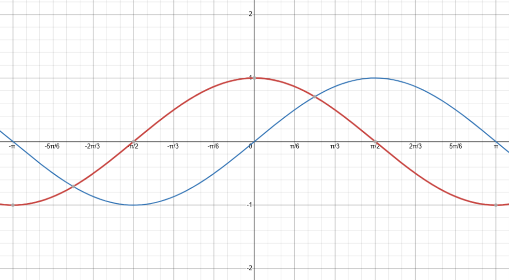
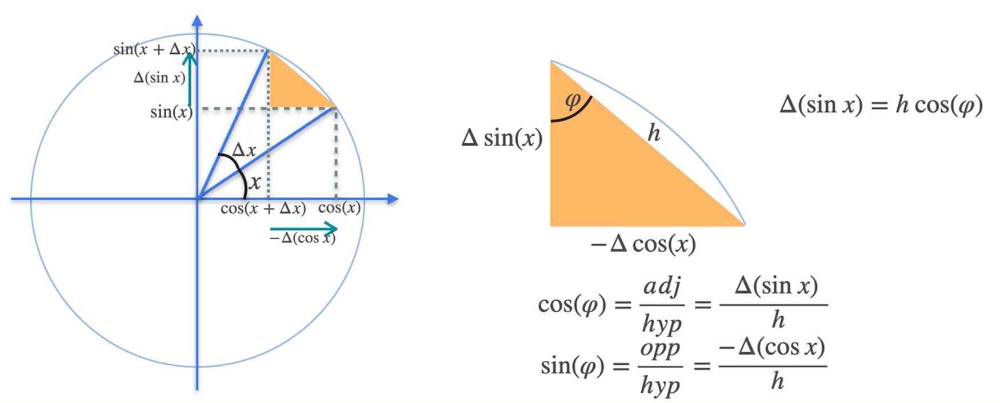
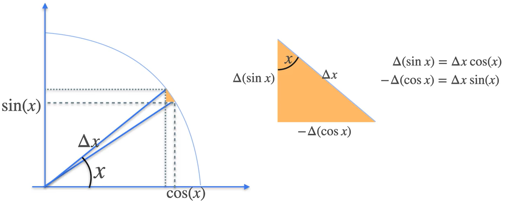
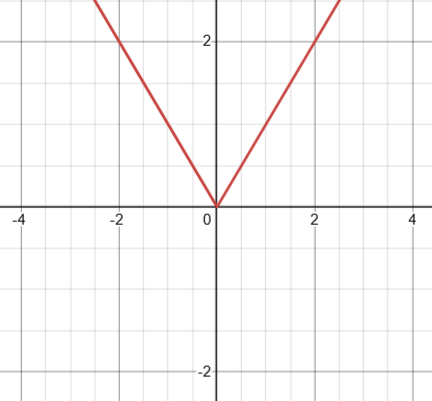
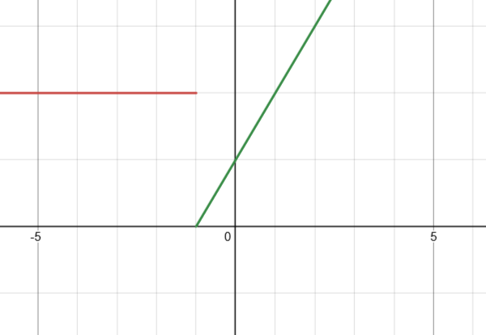
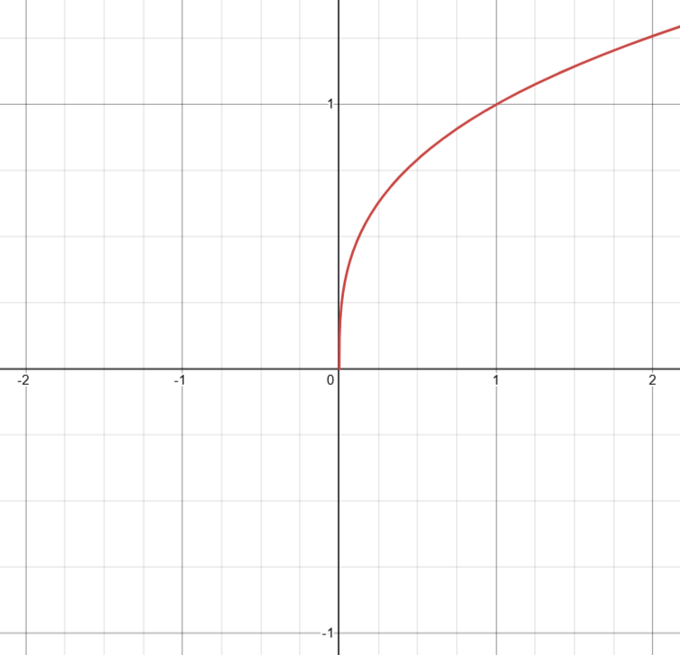

# ***Calculus for ML and DS(1)_Derivatives***

## **Motivation to Derivatives**

> **Have you ever tried to measure exactly how fast you’re going at one precise moment?** 

Imagine driving a car on a long, straight highway. Your dashboard might show your speed at any instant, but what if that speedometer breaks?😂 You can still keep track of the total distance traveled over certain time intervals, yet determining your speed at one exact second becomes tricky. This search for an “instantaneous” speed is at **the heart of derivatives**.

### From Average Speed to Instant Speed

Let’s start with something simpler: **average speed**. If you drive 100 kilometers in 1 hour, your average speed is 100 km/h. But within that hour, you might have gone faster or slower at different points (maybe you even stopped for a few seconds). The speedometer on the dashboard tells you how fast you’re going at each instant, but average speed over a large interval hides **those** ups and downs.

A **derivative** is a way to move from that broader average speed to the exact “instantaneous” speed at a single moment. It’s like zooming in on a small slice of time until you can measure what’s happening right then and there.

### A Simple Example: Distance vs. Time
   
1. **Collecting Data:**  
   Suppose you have an app that records how far you’ve **traveled** every few seconds. Over one minute, you get a table of time vs. distance. By looking at how distance changes from one measurement to the next, you can figure out average speeds between those intervals.

2. **Observing Changing Speeds:**  
   If the distance covered between seconds 10 and 15 is different from the distance covered between seconds 15 and 20, that already tells you your average speed was**n’t constant**. Maybe from 10 to 15 seconds, you traveled more meters, so your average speed there was higher.

3. **Narrowing Down the Interval:**  
   But what if you want to know your speed exactly at time 12.5 seconds? If you only know the distance at 10 seconds and at 15 seconds, you can calculate an **average** over that 5-second window. This average might be close, but it’s not necessarily the real speed right at 12.5 seconds. You might have sped up or slowed down within that interval.

4. **Refining the Estimate:**  
   What if you measure every second instead of every five seconds? Then you can look at distances at 12 seconds and 13 seconds, so your average speed calculation over that 1-second interval may be closer to the true speed at 12.5 seconds.

5. **Going Further:**  
   In principle, if you make the interval smaller and smaller—say from 12.49 to 12.51 seconds, or even narrower—you get closer and closer to **the exact speed at 12.5 seconds**. **The idea of taking smaller and smaller intervals until they become “infinitesimally” small leads us to the definition of the derivative.**

### Thinking in Terms of Slopes

A handy way to think about speed is by using a **slope** on a distance-time graph. When you plot distance on the vertical axis and time on the horizontal axis:

- **Average speed** between two times $t_1$ and $t_2$ is the slope of the line connecting the points $(t_1, \text{distance}_1)$ and $(t_2, \text{distance}_2)$, which is  

$$
\text{Average speed} = \frac{\Delta \text{distance}}{\Delta \text{time}} = \frac{\text{distance}_2 - \text{distance}_1}{t_2 - t_1}
$$

- **Instantaneous speed** at a specific time $t$ is **the slope of the curve** at that exact point. Instead of drawing a line through two distinct points, you imagine a line that just “touches” the curve at that single point. This is called the **tangent** line. Its slope is the derivative.

### An Analogy: The Camera vs. The Security Footage

Think of it like taking pictures with a camera versus watching a detailed security video:

- **Average speed** is like capturing two photos—one at the start of your trip, one at the end. You can see the overall difference, but not the details in between.
- **Derivative** (instantaneous speed) is more like zooming in on the security footage at one specific second, seeing exactly how fast you were going in that moment.

No matter how detailed the photos are, they are still snapshots of different times. Only when you reduce the gap between snapshots to nearly zero do you approach that single “instant” that the derivative represents.

### Why It Matters for Machine Learning

In many areas of machine learning and data science, we want to understand how a small change in one quantity affects another—often referred to as **gradient**(you've learned about in the previous chapter) or **slope**. This is crucial in **optimization**, where we adjust parameters in a model to improve performance.

- **Rate of Change**: Derivatives tell us **how fast something changes** with respect to something else (e.g., how a cost function changes as we tweak a model parameter).
- **Refining Our Predictions**: Just as we refined our speed estimate by looking at smaller intervals, in machine learning we often **refine our parameter estimates** by looking at derivatives.

### Key Takeaways

1. **Average speed** gives us an overall rate of change over a set interval.  
2. **Instantaneous speed** (derivative) measures the rate of change at a single point in time.  
3. By shrinking the time interval, the average speed becomes a better approximation of the instantaneous speed.  
4. In a distance-time graph, this corresponds to the slope of the tangent line at a point.  

We’ve seen how the concept of derivatives emerges naturally from our desire to find an exact velocity at a single instant. Next, we’ll dive into the formal definition of derivatives and learn the notations and rules that make them so important in both mathematics and machine learning.

---

## **Derivatives and Tangents**

> **Have you ever tried to pinpoint the exact angle at which a curve bends at a single spot?** 

Think of a roller coaster track: sometimes it’s steep, sometimes it’s shallow, and at each point along the track, the angle (or slope) can be different. In mathematics, **derivatives capture** that precise “slope” at any given point on a curve.

### From Average Slope to Instantaneous Slope

Previously, we saw how the **average velocity** between two points in time is like the slope of the line connecting those two points on a distance-time graph. If you want the **instantaneous velocity** (the rate of change at one exact moment), you’d zoom in until the interval is practically nonexistent.

1. **Pick a Point of Interest**  
   Let’s say you’re curious about the velocity at $t = 12.5$ seconds. If you only have the distance at $t = 12$ and $t = 13$, you can calculate an average slope (speed) over that 1-second interval.

2. **Narrow the Interval**  
   Now, imagine you pick a point closer to $12.5$—say at $12.6$ seconds. Then you calculate the slope between $12.5$ and $12.6$. This slope will be closer to the true velocity at $12.5$ seconds.

3. **Take It to the Limit**  
   As you bring that second point closer and closer to $12.5$, the slope you measure becomes the slope of a line that **just touches** the curve at $12.5$. In math terms, this is taking a limit until the difference in time $\Delta t$ is infinitesimally small.  
   The result is an instantaneous rate of change, written as $\frac{dx}{dt}$, which is the **derivative** at $t = 12.5$.

### The Tangent Line

A helpful way to picture the derivative is through a **tangent line** on a graph. If you plot distance on the vertical axis and time on the horizontal axis:

- When you connect two distant points on the curve, you’re looking at an **average slope**.  
- When you shrink the gap between those two points until it’s basically one point, you’re left with the **tangent line**—the line that grazes the curve exactly at that point. Its slope is the instantaneous rate of change, or **derivative**.

This process can be applied to any function, not just distance-time relationships. Whether it’s **the slope of a profit curve in business** or the gradient of a loss function in machine learning, the idea remains the same: a derivative measures how quickly one quantity changes in response to another, at a specific moment.

### An Analogy: Sharpening Your Vision

Imagine you’re trying to read a tiny label on a distant billboard:

- **Average Slope**: Viewing from far away is like looking at the slope between two large points—blurry and generalized.  
- **Derivative (tangent line)**: When you zoom in with a powerful telescope (reducing the distance between points), your vision sharpens, revealing the **exact** slope at a single spot.

Just as a telescope helps you see distant objects clearly, taking the limit of increasingly small intervals allows you to see the “exact rate of change” at one point.

### Why It Matters

Understanding derivatives is crucial because:

- **In Machine Learning**, we often talk about gradients—derivatives of cost functions with respect to model parameters. These gradients guide how we adjust the model to minimize error.
- **In Data Science**, derivatives help us interpret how a small change in one variable (like temperature) might affect another (like energy consumption), at a specific value.

Learning to see tangents as snapshots of instantaneous change is the first big leap into the world of calculus—an essential tool in advanced mathematics and machine learning alike.

### Key Takeaways

- **Derivatives** measure the instantaneous rate of change at a single point.  
- **Tangents** on a graph represent the derivative visually (their slope is the derivative).  
- By shrinking the interval for an average rate of change, you approach the **instantaneous** rate of change.  

---

## **Slopes, Maxima, and Minima**

> **Have you ever noticed how a roller coaster slows down right at the top before rushing down again?** 

At that highest point, its speed is momentarily zero—this is a perfect illustration of how “stopping” and “extreme points” (like maxima or minima) are connected.

### Zero Slope Means Zero Velocity

Imagine looking at a distance-time graph of a car’s motion:

- When the **tangent line** on the graph is **horizontal**, it has a slope of **zero**.  
- A slope of zero in a distance-time graph means no change in distance—so the car’s velocity is **zero** at that moment.

For example, if at $t=19$ seconds the distance is $265$ meters, and at $t=20$ seconds it’s also $265$ meters, the **change in distance** $\Delta x$ is $265 - 265 = 0$. Over a $\Delta t$ of $1$ second, the slope is  

$$
\frac{0}{1} = 0
$$

No rise, no change—so the velocity is zero.

### Linking Velocity and Position Extremes

Now, let’s say the car’s distance from its starting point goes up and down over time: it moves forward, then stops, maybe even goes backward at some intervals. If you plot this on a distance-time graph:

- **Where is the distance at its highest?** That’s a **maximum** point for the distance function.  
- **Where is the distance at its lowest?** That’s a **minimum** point (which could be the car’s starting point or even behind it if it reverses).

**Notice something special:** these maximum or minimum points often occur exactly where the car’s velocity is **zero**. In other words, the derivative of the distance function (the velocity) is zero at these extreme points.

Why is that? When you’re at the highest point (say, a hill on a roller coaster), you must momentarily stop going higher before heading back down. That tiny pause—where you switch from going up to going down—is where velocity hits zero.

### An Analogy: Hiking to the Peak

Think of a mountain hike:

- As you go uphill, your slope (effort) is positive—you’re moving to higher ground.  
- You eventually reach the mountaintop, where for a moment you **stop** going any higher. Right there, the slope is **zero**—your climb transitions to a descent if you keep walking.  

- Similarly, if you reach the bottom of a valley, your slope becomes zero at the lowest point before you go back up.

In math terms, when a function (like distance from the starting point) hits its highest or lowest value, the **derivative** (the slope) is zero at that moment.

### Why It Matters for AI

The concept of **maxima** and **minima** is critical because:

- **Optimization**: Many machine learning methods involve finding the **minimum** of a cost function, which is a point where the derivative of that cost function is zero.
- **Model Tuning**: When you train a neural network, you adjust parameters by moving “downhill” in a high-dimensional error surface toward a minimum error.

Understanding that the derivative hitting zero means you’re at a potential “peak” (maximum) or “valley” (minimum) is key to grasping how we make machine learning models better.

### Key Takeaways

1. **Slope = 0** means a **velocity** of 0 when looking at a distance-time graph.  
2. **Maxima and Minima** in a function commonly occur where its derivative is 0.  
3. This insight forms the basis of **optimization**, a fundamental concept in AI and beyond.

---

## **Derivatives and Notation**

Just as we can say “car” or “automobile” in English, mathematicians often have multiple ways to express the concept of a derivative. In this section, we’ll see two of the most common notations: **Leibniz’s** and **Lagrange’s**.

### From Average to Instant Slope (Recap)

Remember how we started by calculating an **average slope** using differences like $\Delta x$ and $\Delta t$? We gradually shrank those intervals until we got an **instantaneous slope**, written as $dx$ over $dt$. This switch from finite $\Delta$ (“delta”) to infinitesimal $d$ is key to understanding derivative notation.

1. **Big Intervals**: $\Delta x / \Delta t$  
2. **Tiny Intervals**: $dx / dt$

When those intervals become incredibly small, we say we’re looking at the **derivative**—the slope of the tangent line at a single point.

### Leibniz’s Notation

One of the first ways to express a derivative is often attributed to **Gottfried Wilhelm Leibniz** (pronounced “Lye-bnitz”). In his notation:

- $y = f(x)$ is our function, where $x$ is the input and $y$ is the output.
- The **derivative** of $y$ with respect to $x$ is written as $\frac{dy}{dx}$ = $\frac{d}{dx}f(x)$

This notation is handy because it reminds us that $dy$ and $dx$ are “infinitesimally” small changes in $y$ and $x$. It’s like saying:

> “How much does $y$ change when we nudge $x$ by an incredibly small amount?”

A helpful way to think of this is like a super-precise speedometer: $dx$ is the tiniest possible shift in time (if $x$ were time), and $dy$ is the corresponding microscopic change in distance.

### Lagrange’s Notation

Another popular way to write derivatives comes from **Joseph-Louis Lagrange**. Here, we say:

- $y = f(x)$ is our function.
- The **derivative** of $f$ at $x$ is $f'(x)$ (pronounced “f prime of x”).

This is called **Lagrange’s notation**. It’s more compact than Leibniz’s notation, but it doesn’t explicitly show the variables in the fraction-like form $\frac{dy}{dx}$.

### An Analogy: Two Names for the Same Recipe

Imagine you have a favorite chocolate chip cookie recipe:

- **Leibniz’s Notation**: Writing out a detailed ingredient list, emphasizing each small “piece” that goes into the recipe (like $dx$ and $dy$). You see clearly how small changes in ingredients affect the final cookie.
- **Lagrange’s Notation**: A simpler label, like “CookiePrime,” to indicate a special version of the recipe. It’s quicker to note down, but doesn’t show all the details of ingredient changes.

In both cases, you end up with a wonderful cookie (the concept of a derivative), just expressed in different ways.

### Switching Between Notations

There’s no strict rule that says you must use one notation all the time. Mathematicians and scientists frequently switch between:

- **Leibniz**: $\frac{d}{dx} f(x)$ or $\frac{dy}{dx}$  
- **Lagrange**: $f'(x)$

depending on which form is more convenient. For instance:

- **Leibniz** - $\frac{dy}{dx}$ - is especially useful for emphasizing which variable we’re differentiating with respect to, and it’s great for applying certain rules (like the chain rule) step by step.
- **Lagrange** - $f'(x)$ - is more compact, which can be nice for writing less cluttered equations.

### Why It Matters for AI and Data Science

In **machine learning** and **data science**, you’ll see both notations used. For example:

- **Gradient Calculations**: It’s common to see $\frac{\partial}{\partial x}$ - a partial derivative, which is a close cousin to $\frac{d}{dx}$ - when working with several variables.
- **Optimization Problems**: You’ll read texts that say “take the derivative of $f$,” written as $f'(x)$, to find a function’s minimum or maximum.

Whichever notation you spot, rest assured you’re looking at the same fundamental idea: how a function changes at each point.

### Key Takeaways

1. **Leibniz’s Notation**: $\frac{dy}{dx}$ highlights tiny changes in $x$ and $y$.  
2. **Lagrange’s Notation**: $f'(x)$ is a compact way of saying “the derivative of $f$ at $x$.”  
3. **They Both Represent the Same Concept**: The instantaneous rate of change or slope of the tangent line.  
4. **Use What’s Convenient**: Mathematicians switch between notations to make solving problems easier.

Derivatives might look a little different depending on the notation, but under the hood, they’re describing the same idea: the rate at which something changes with respect to something else—one of the most fundamental concepts in all of mathematics, physics, and machine learning.

---

## Some Common Derivatives

### Lines

> **Have you ever taken a walk on a path that’s perfectly flat?** 

Think about a boardwalk at the beach (completely level) versus a steady uphill ramp. Those are real-life examples of **constant** and **linear** functions. In math, these correspond to lines whose slopes are either zero or a fixed number—and figuring out their derivatives is surprisingly straightforward.

#### The Constant Function

A **constant function** is like a perfectly flat walkway. No matter where you stand on it, the height never changes.

- **Mathematically**, a constant function can be written as $f(x) = c$, where $c$ is any constant (e.g., $c = 5$, or $c = -173.5$, etc.).  
- **Slope is Zero**: If you try to find the slope between any two points on a flat line, the change in height (the “rise”) is always zero, so  

$$
\frac{\Delta y}{\Delta x} = \frac{c - c}{x_1 - x_0} = \frac{0}{x_1 - x_0} = 0
$$

- **Derivative**: Because the slope never changes, the derivative of a constant function is **always 0**. In notation:  

$$
\frac{d}{dx} c = 0 \quad \text{and} \quad f'(x) = 0
$$

**Analogy**: Imagine driving on a highway with zero incline—your “change in elevation” never changes, so the “rate of change of height” is 0.

#### The Linear Function

A **linear function** is a slanted line that goes up or down at a steady rate. You can write it as:  

$$
f(x) = ax + b
$$

where:
- $a$ = the slope (how steep the line is),
- $b$ = the $y$-intercept (the height at $x=0$).

Consider two points on this line: $(x, ax + b)$ and $(x + \Delta x, a(x + \Delta x) + b)$.

- **Slope (Average Rate of Change)**:  

$$
\frac{\Delta y}{\Delta x} = \frac{\bigl[a(x+\Delta x) + b\bigr] - \bigl[ax + b\bigr]}{\Delta x} = \frac{ax + a \Delta x + b - ax - b}{\Delta x} = \frac{a \Delta x}{\Delta x} = a
$$

No matter how close together the two points are, the slope is always $a$.

- **Derivative**: Because the slope of a linear function doesn’t change, the derivative everywhere is just $a$. In other words:  

$$
\frac{d}{dx} [ax + b] = a \quad \text{and} \quad f'(x) = a
$$

**Analogy**: Think of a straight ramp on a driveway—whether you start at the bottom, the middle, or near the top, the incline (slope) is the same. The rate of change of height with respect to distance is constant.

#### Why This Matters in AI and Beyond

- **Simplicity**: Constant and linear functions are the building blocks of more complicated functions.  
- **Linear Models**: In machine learning, simple linear models ($y = ax + b$) are often the first step. Even though real-world problems are more complex, understanding linear derivatives gives you a grounding in how more advanced models work.  
- **Foundations for Polynomial Derivatives**: Once we see how to handle lines, we can extend that logic to quadratics, higher-degree polynomials, and beyond.

#### Key Takeaways

1. **Constant Function** $f(x) = c$: Derivative is 0.  
2. **Linear Function** $f(x) = ax + b$: Derivative is $a$.  
3. **Intuitive Meaning**: A constant function never “rises” or “falls,” so its slope is zero. A linear function has a steady slope—**so the derivative is that same slope everywhere.**

### Quadratics

> **Have you ever noticed how, when you toss a ball into the air, it slows down as it rises, pauses at the peak, then speeds up on the way down?** 

That gentle arc is a classic example of a **quadratic** function in motion. Quadratics have a “U” shape (or an inverted “U”) when graphed, and discovering how their slopes change as you move along the curve is our next step in understanding derivatives.

#### The Simplest Quadratic: $y = x^2$

Let’s consider the most basic quadratic function:  

$$
f(x) = x^2
$$

When we graph $y = x^2$, we get a parabola that opens upward.  
- For $x < 0$, the slope appears negative (the curve is heading downward).  
- For $x > 0$, the slope appears positive (the curve is heading upward).  
- Right at $x = 0$, the slope is zero (the bottom of the parabola).

**How do we find the exact slope at any point?** We use the idea of shrinking the gap in a “rise over run” calculation - from $\Delta x$ to an infinitesimally small $dx$.

#### Estimating the Slope at a Specific Point

Take $x = 1$. We can do a few **secant slope** calculations—each one using a small horizontal change $\Delta x$, and seeing how $\Delta y$ compares:

1. **$\Delta x = 1$**  
   - Initial $x = 1 \Rightarrow f(1) = 1$  
   - Second point $x = 2 \Rightarrow f(2) = 4$  
   - $\Delta f = 4 - 1 = 3$  
   - Slope $= \frac{\Delta f}{\Delta x} = \frac{3}{1} = 3$

2. **$\Delta x = \tfrac{1}{2}$**  
   - Second point $x = 1.5 \Rightarrow f(1.5) = 2.25$  
   - $\Delta f = 2.25 - 1 = 1.25$  
   - Slope $= \frac{1.25}{0.5} = 2.5$

3. **$\Delta x = \tfrac{1}{4}$**  
   - Second point $x = 1.25 \Rightarrow f(1.25) \approx 1.5625$  
   - $\Delta f \approx 1.5625 - 1 = 0.5625$  
   - Slope $= \frac{0.5625}{0.25} = 2.25$

As we keep shrinking $\Delta x$ (like $\tfrac{1}{8}, \tfrac{1}{16}, \dots$), our slope approaches **2**. That suggests the **instantaneous slope** at $x = 1$ for $f(x) = x^2$ is 2.

#### The Formal Derivative of $x^2$

To see why it’s **2x** for every $x$, let’s use the definition of the derivative:  

$$
\frac{d}{dx}[x^2] = \lim_{\Delta x \to 0} \frac{(x + \Delta x)^2 - x^2}{\Delta x}
$$

Expanding:  

$$
(x + \Delta x)^2 - x^2 = x^2 + 2x (\Delta x) + (\Delta x)^2 - x^2 = 2x (\Delta x) + (\Delta x)^2
$$

Divide by $\Delta x$:  

$$
\frac{2x (\Delta x) + (\Delta x)^2}{\Delta x} = 2x + \Delta x
$$

Now, **take the limit** as $\Delta x \to 0$:  

$$
2x + \Delta x \quad \Longrightarrow \quad 2x \quad (\text{because } \Delta x \to 0)
$$

So, the derivative of $x^2$ is:  

$$
\frac{d}{dx}\bigl[x^2\bigr] = 2x
$$

#### An Analogy: The Skateboard Ramp

Think of a **U-shaped skateboard ramp**:
- At the bottom-where $x = 0$, the slope is flat, so the skateboard momentarily stops accelerating up or down.

- As you move to the right side of the ramp - $x>0$, the slope becomes steeper and more positive the further you go.
- As you move to the left side - $x<0$, the slope is negative (descending).

In a parabola $x^2$, the “steepness” is described by $2x$. If $x$ is large and positive, the slope is large and positive. If $x$ is large and negative, the slope is large and negative.

#### Why Quadratics Matter in AI and Data Science

- **Loss Functions**: Many machine learning models use quadratic-like loss functions (for example, mean squared error). Knowing how they behave and how to compute derivatives is crucial for gradient-based optimization.
- **Estimation and Curves**: Quadratic functions often serve as a simple model for curved relationships in data, so understanding their derivatives helps you reason about growth, acceleration, or curvature in real-world scenarios. You may have heard of the "exponential growth" in various fields, which are related to quadratics.

#### Key Takeaways

1. **Quadratic Example**: $f(x) = x^2$  
2. **Derivative**: $f'(x) = 2x$  
3. **How We Found It**:  
   - By calculating slopes over increasingly small intervals.  
   - By using the limit definition of the derivative.  
4. **Intuitive Meaning**: The slope at any point $x$ depends on where you are on the parabola, and for $x^2$, it’s $2x$.

Quadratics form the next level of complexity after linear functions. Next, we’ll see how these derivative concepts extend to even higher-degree polynomials—paving the way for us to tackle a wide range of functions in mathematics and machine learning.

### Higher Degree Polynomials

> **Have you ever watched a car drive along a curvy road and wondered how its acceleration changes at different points?**

A **cubic** or **higher-degree polynomial** can capture that kind of curvy motion. In this section, we’ll see how to find the derivative for such functions, expanding on what we learned with squares and quadratics.

#### The Case of Cubics: $y = x^3$

Let’s start with the simplest cubic:  

$$
f(x) = x^3
$$

If you plot $x^3$, you’ll notice that it dips below the axis for negative $x$, crosses through zero, then rises sharply for positive $x$. At each point $x$, the slope (tangent) can be different, so we want to find a formula for the **instantaneous rate of change**.

##### Estimating Slopes at a Point

Say you’re interested in the slope at $x = 0.5$. We can:

1. Take a small horizontal step $\Delta x$.  
2. Compute how much $f(x)$ changes (that is, $\Delta f$).  
3. Find the **average slope** $\frac{\Delta f}{\Delta x}$.  
4. Shrink $\Delta x$ closer and closer to zero to approach the **instantaneous** slope at $x = 0.5$.

As you make $\Delta x$ smaller (like going from $1$ to $\tfrac{1}{2}$ to $\tfrac{1}{4}$ and so on), the slopes converge to about $0.75$. It turns out that’s **exactly** $3 \times (0.5)^2$.

##### The Formal Derivative of $x^3$

Just like with quadratics, we use the limit definition:  

$$
\frac{d}{dx} x^3 = \lim_{\Delta x \to 0} \frac{(x + \Delta x)^3 - x^3}{\Delta x}
$$

We can expand $(x + \Delta x)^3$:  

$$
(x + \Delta x)^3 = x^3 + 3x^2 \Delta x + 3x (\Delta x)^2 + (\Delta x)^3
$$

Subtract $x^3$, then divide by $\Delta x$:  

$$
\frac{x^3 + 3x^2 \Delta x + 3x (\Delta x)^2 + (\Delta x)^3 - x^3}{\Delta x} = 3x^2 + 3x \Delta x + (\Delta x)^2
$$

As $\Delta x \to 0$, the terms with $\Delta x$ and $(\Delta x)^2$ vanish, leaving:  

$$
3x^2
$$

So,  

$$
\frac{d}{dx} x^3 = 3x^2
$$

#### General Rule: $x^n$

Even more broadly, **any** power of $x$ follows a clear pattern:  

$$
\frac{d}{dx} x^n = n x^{n-1}
$$

This is one of the most important rules in basic calculus. Cubics ($n=3$) are just one example. If you had $x^4$, the derivative would be $4x^3$, and so on.

#### An Analogy: “Peeling Off” One Layer

Imagine $x^n$ as a tower with $n$ floors. When you take its derivative, you’re **peeling off** the top floor:

- **The number of floors left** is now $n-1$.  
- **The peeled-off floor** goes out front as a multiplier $n$.

For $x^3$:

- Start with 3 floors.  
- Peel off the top floor, leaving 2 floors.  
- That peeled-off floor is 3, which multiplies $x^2$.

#### Applying to Polynomials

A **polynomial** is just a sum of terms like $a_n x^n + a_{n-1} x^{n-1} + \cdots + a_1 x + a_0$. Thanks to the linearity of derivatives, you can take the derivative of each term separately:
   
$$
\frac{d}{dx} a_n x^n = a_n \cdot n x^{n-1}
$$

and so on down the line. Each term’s exponent “peels down” by 1, multiplied by its original exponent.

#### Why Polynomials Matter in AI

- **Complex Models**: Polynomials are among the simplest examples of “non-linear” models, serving as stepping stones to more complex curves in machine learning.  
- **Cost Functions**: In optimization, polynomial-like loss functions can appear. Knowing how to differentiate them is key for **gradient-based** methods (like gradient descent).  
- **Data Fitting**: Sometimes, a polynomial can approximate real-world data well. Understanding how the slope changes across the function is vital for prediction and analysis.

#### Key Takeaways

1. **Cubic Example**: $f(x) = x^3$ has a derivative $f'(x) = 3x^2$.  
2. **General Power Rule**: For $f(x) = x^n$, $f'(x) = n x^{n-1}$.  
3. **Polynomials**: The derivative is found by applying the power rule term by term.  
4. **Insight**: As you move from linear to quadratic to cubic and beyond, the math is consistent—just keep peeling off that top “layer” of the exponent.

With these rules, you can quickly find the slope of all kinds of polynomial functions, whether you’re dealing with simple quadratics or high-degree polynomials. Next, we’ll look at other power functions (like $x^{-1}$ or fractional powers) to round out your toolkit for finding derivatives of many common functions.

### Other Power Functions

> **Have you ever wondered how quickly something changes when you’re dealing with “inverse” relationships—like dividing by $x$?** 

For example, the graph of $y = \frac{1}{x}$ looks like two mirrored arcs (a hyperbola), bending sharply near $x = 0$. Figuring out the slope of such curves might seem tricky at first, but a simple pattern emerges once we consider the power rule.

#### The Case of $f(x) = \frac{1}{x}$

A function like $\frac{1}{x}$ can be written as $x^{-1}$. When $x$ is positive and large, $\frac{1}{x}$ becomes very small. When $x$ is very close to zero, the function’s value soars (or dives, depending on the side). This makes for interesting slopes:

1. **Example at $x = 1$**  
- $y = 1$ (since $1/1 = 1$).  
- Trying a small horizontal step $\Delta x$:  
   - If $\Delta x = 1$, the function changes from $1$ to $\frac{1}{2}$, a drop of $0.5$.  
   - The slope is $\frac{-0.5}{1} = -0.5$.  
- As we shrink $\Delta x$, the slope gets closer and closer to $-1$.  

2. **Limit Definition**  

- We formally write:  
   
$$
\frac{d}{dx} [\frac{1}{x}] = \lim_{\Delta x \to 0} \frac{\frac{1}{x+\Delta x} - \frac{1}{x}}{\Delta x}
$$

- With algebra (and a bit of cancellation), we find it simplifies to  

$$
-\frac{1}{x^2}
$$

So, **the slope of $\frac{1}{x}$** at any point $x$ is **$-\frac{1}{x^2}$**.

#### The General Power Rule

We’ve now seen:

- $\frac{d}{dx}[x^2] = 2x$
- $\frac{d}{dx}[x^3] = 3x^2$
- $\frac{d}{dx}[\frac{1}{x}] = \frac{d}{dx}[x^{-1}] = -x^{-2}$

So the pattern we've seen is the same **for $x^n$, the exponent $n$ comes down in front, and then we subtract 1 from $n$.** Formally:  

$$
\frac{d}{dx}[x^n] = nx^{n - 1}
$$

This works for **all** real $n$, including negative and fractional exponents. For example:

- $x^5$ becomes $5x^4$.  
- $x^{-2}$ becomes $-2x^{-3}$.  
- $x^{100}$ becomes $100x^{99}$.  

As long as $x \neq 0$ (for the negative exponents), this rule applies neatly.

#### Why Negative and Other Powers Matter

- **Inverse Functions in AI**: Functions like $\frac{1}{x}$ or $x^{-2}$ can appear in machine learning algorithms (for example, in certain cost functions or regularization terms).  
- **Fractional Powers**: Derivatives of $\sqrt{x} = x^{1/2}$ and others also follow the same rule, enabling us to handle many real-world relationships (such as growth rates, decay, or physical laws involving inverse squares).

#### Key Takeaways

1. **Inverse Function Example**: $f(x) = \frac{1}{x} = x^{-1}$ has the derivative $f'(x) = -x^{-2}$.  
2. **Power Rule**: $\frac{d}{dx}x^n = nx^{n-1}$, valid for any real exponent $n$.  
3. **Algebraic Simplicity**: Once you see the power rule, dealing with negative or fractional exponents is just as simple as dealing with integers—just be mindful of domain issues (like $x=0$ for negative exponents).

Armed with the power rule, you’re now able to differentiate a wide variety of functions—from basic polynomials to negative or fractional powers. This is a cornerstone for tackling more advanced functions and for applying calculus in areas such as physics, engineering, and machine learning.

---

## The Inverse Function and Derivatives

> **Have you ever wished you could “undo” a mathematical operation just as easily as putting something on and taking it off?** 

That’s exactly the idea behind **inverse functions**. If a function $f$ transforms an input $x$ into some output $f(x)$, then its inverse function $g$ - often written as $f^{-1}$ - transforms $f(x)$ back into $x$. This “undoing” relationship connects both the functions **and** their derivatives in a beautiful, reciprocal way.

### Inverses: The “Hat On, Hat Off” Metaphor

Imagine you place a “hat” on someone’s head—this is like applying a function $f$. The **inverse** function would then be taking that hat off, returning the person to their original appearance. Symbolically:

- If $f$ turns $3$ into $5$,  
- Then its inverse $g$ turns $5$ back into $3$.

In math notation, we often write $g = f^{-1}$. Importantly, $f^{-1}(x)$ does **not** mean $\frac{1}{f(x)}$; it just denotes “the function that reverses $f$.”

### A Classic Example: Squaring vs. Square Root

- **Forward Operation**: $f(x) = x^2$.  
- **Inverse Operation**: $g(y) = \sqrt{y}$ (assuming $x \geq 0$ so we take the positive root).

Here, if you start with $x$, square it to get $f(x)$, and then apply $\sqrt{\cdot}$, you end up back at $x$. For instance, $f(2) = 4$ and $g(4) = 2$.

### Graphical View: A Reflection Across $y = x$

When you graph $f(x) = x^2$ (with $x \ge 0$) and $g(y) = \sqrt{y}$ on separate axes:

- Every point $(a, b)$ on $f$ reflects to $(b, a)$ on $g$.  
  - For instance, $(1.5, 2.25)$ on $f$ becomes $(2.25, 1.5)$ on $g$.  
- This reflection means the roles of $x$ and $y$ switch.

Now, think about the **slope** of the tangent line (the derivative). A slope on the $f$-graph will have a reciprocal slope on the $g$-graph, because we’ve effectively flipped axes in the reflection.

### Derivative of the Inverse: Why It’s a Reciprocal

1. **Secant Lines First**:  
   - On the $f$-graph, the slope of a secant line is $\Delta f / \Delta x$.  
   - On the $g$-graph, the slope of a similar secant line is $\Delta g / \Delta y$.  
   - Due to the reflection, $\Delta g$ on the right graph corresponds to $\Delta x$ on the left, and $\Delta y$ on the right corresponds to $\Delta f$ on the left.  
   - So $\frac{\Delta g}{\Delta y} = \frac{\Delta x}{\Delta f}$.  
2. **Shrinking the Interval**:  
   - As $\Delta x \to 0$, the secant becomes a **tangent** on $f$, and $\frac{\Delta f}{\Delta x}$ becomes $f'(x)$.  
   - As $\Delta y \to 0$, the secant becomes a **tangent** on $g$, and $\frac{\Delta g}{\Delta y}$ becomes $g'(y)$.  
3. **Relationship**:  

$$
g'(y) = \frac{1}{f'(x)}
\quad\text{if } y = f(x) \text{ and } x = g(y)
$$

In words, **the derivative of the inverse function at a point $y$ is the reciprocal of the derivative of the original function at the corresponding point $x$.**

### Concrete Example: $f(x) = x^2$ and $g(y) = y^{1/2}$

- **Derivative of $f$**: $f'(x) = 2x$.  
- **Derivative of $g$**: $g'(y) = \frac{1}{2 \sqrt{y}}$. (which you can also derive using the power rule)

Let’s see how they match up at specific points:

1. **At $x = 1$** (which corresponds to $y = f(1) = 1$):  
   - $f'(1) = 2 \cdot 1 = 2$.  
   - $g'(1) = \frac{1}{2\sqrt{1}} = \frac{1}{2}$.  
   - Indeed, $g'(1) = \frac{1}{f'(1)} = \frac{1}{2}$.

2. **At $x = 2$** (which corresponds to $y = f(2) = 4$):  
   - $f'(2) = 2 \cdot 2 = 4$.  
   - $g'(4) = \frac{1}{2\sqrt{4}} = \frac{1}{4}$.  
   - Again, $g'(4) = \frac{1}{f'(2)} = \frac{1}{4}$.

### An Analogy: Door Locks and Keys

- **Forward Function** $(f)$: A lock that closes the door (e.g., squaring a number).  
- **Inverse Function** $(g)$: The matching key that opens it again (e.g., taking a square root).  
- **Slopes**: If turning the lock handle takes a certain amount of force (slope) one way, turning the key from the other side might require the **reciprocal** of that force.

### Why It Matters for AI and Beyond

- **Inverse Functions in Machine Learning**: Sometimes, you invert transformations (like log or exponential) to interpret results. Knowing how derivatives invert helps with sensitivity analysis and certain algorithm designs.  
- **Efficiency**: If you already know $f'(x)$, you can quickly find the slope of its inverse without re-doing all the limit calculations—just **take the reciprocal** at the corresponding points.

### Key Takeaways

1. **Inverse Functions**: $f^{-1}$ undoes whatever $f$ does.  
2. **Geometric Reflection**: The graph of $f^{-1}$ is the reflection of $f$ across the line $y = x$.  
3. **Derivative Link**: If $f$ and $f^{-1}$ are inverses, then  

$$
(f^{-1})'(y) = \frac{1}{f'(x)}
\quad\text{where}\quad y = f(x)
$$

4. **Reciprocal Slopes**: At corresponding points, the slopes of inverse functions multiply to 1.

Learning this relationship provides a powerful shortcut for finding derivatives of inverse functions—no matter if you’re dealing with square roots, logarithms, or any invertible transformation.

---

## The Trigonometric Functions and Derivatives

> **Have you ever tried to guess how a wave’s height changes as it moves along the ocean?** 

Trigonometric functions like $\sin(x)$ and $\cos(x)$ are essentially “wave functions,” and understanding their derivatives tells us how fast (and in which direction) those waves are rising or falling at every point.

### A Quick Tour of Sine and Cosine

Let’s recall two of the most famous trigonometric functions:

- **Sine**, written as $\sin(x)$  
- **Cosine**, written as $\cos(x)$

When you plot $\sin(x)$, it oscillates between $-1$ and $+1$. The same is true for $\cos(x)$, just shifted slightly along the $x$-axis.

$\sin(x)$: Blue line  
$\cos(x)$: Red line  

### Observing Slopes at Key Points

If we examine **slopes** of $\sin x$ at certain notable angles:

- **At $x = 0$**: $\sin 0 = 0$, and the slope (derivative) is $1$.  
- **At $x = \frac{\pi}{2}$**: $\sin\left(\frac{\pi}{2}\right) = 1$, but the slope here is $0$.  
- **At $x = \pi$** or $x = -\pi$: $\sin(\pm\pi) = 0$, but the slope is $-1$ or $1$ depending on the direction.

Curiously, these slope values match the values of $\cos x$ at the same points! That’s our first hint that  

$$
\frac{d}{dx} [\sin x] = \cos x
$$

Conversely, if you check the slope of $\cos x$ at those angles, you’ll notice it mirrors $-\sin x$. In fact,  

$$
\frac{d}{dx} [\cos x] = -\sin x
$$

### A Geometric Reason: The Unit Circle

We’ll start from the very definitions of $\sin(x)$ and $\cos(x)$ on the **unit circle** and build up to the final limit argument.

#### Defining Sine and Cosine via the Unit Circle

1. **Unit Circle Setup**  
   - Draw a circle with **radius 1** centered at the origin (0, 0) in the plane.  
   - When you pick an angle $x$ (in radians), measure it from the positive $x$-axis, counterclockwise.  
2. **Coordinates of a Point on the Circle**  
   - By definition, the point on the unit circle at angle $x$ has coordinates $(\cos(x), \sin(x))$.  
     - $\cos(x)$ is the **$x$-coordinate** on the circle.  
     - $\sin(x)$ is the **$y$-coordinate** on the circle.  

**Why these definitions?** Historically, $\sin(x)$ and $\cos(x)$ arose from right-triangle ratios, but the unit-circle definition is a modern, clean way to handle all angles (positive, negative, or beyond $2\pi$).

#### Incrementing the Angle by $\Delta x$

1. **Original Angle**  
   - Suppose our initial angle is $x$. The coordinates on the unit circle are then $(\cos(x), \sin(x))$.  
2. **Small Increase**  
   - Now increase the angle by a small amount $\Delta x$.  
   - The **new angle** is $(x + \Delta x)$. On the unit circle, this corresponds to the point $(\cos(x + \Delta x), \sin(x + \Delta x))$.  

We are interested in how $\sin(x)$ and $\cos(x)$ **change** as $x$ changes slightly by $\Delta x$. This small change will guide us to the derivative.

##### Visualizing the Change Using Small Triangles

1. **Horizontal and Vertical “Projections”**  
   - The **horizontal coordinate** changes from $\cos(x)$ to $\cos(x + \Delta x)$.  
   - The **vertical coordinate** changes from $\sin(x)$ to $\sin(x + \Delta x)$.  
2. **Draw the Tiny Triangles**  
   - If you connect the points $(\cos x, \sin x)$ and $(\cos(x + \Delta x), \sin(x + \Delta x))$, you form a small **chord** on the circle.  
   - Break that chord into horizontal and vertical pieces:  
     - $\Delta(\sin(x)) = \sin(x + \Delta x) - \sin(x)$ (the vertical leg).  
     - $\Delta(\cos(x)) = \cos(x + \Delta x) - \cos(x)$ - the horizontal leg, but note it might be negative if $\cos(x + \Delta x)<\cos(x)$.
3. **Approximate Each Leg**  
   - Geometrically, that chord can be related to an **arc** of the circle of length approximately $\Delta x$ (because on the unit circle, the arc length corresponding to an angle $\Delta x$ is $\Delta x \times 1 = \Delta x$).  
   - Careful analysis of those small right triangles shows that:  
   
$$
\Delta(\sin(x)) \approx \Delta x \cos(x), 
\quad
\Delta(\cos(x)) \approx -\Delta x \sin(x)
$$

   The negative sign in $\Delta(\cos x)$ appears because **increasing** $x$ typically **decreases** $\cos x$ when $x$ is in certain quadrants.

#### From the Small Change to the Derivative

Recall that the **derivative** of a function $f(x)$ at $x$ is:  

$$
f'(x) = \lim_{\Delta x \to 0} \frac{f(x + \Delta x) - f(x)}{\Delta x} = \lim_{\Delta x \to 0} \frac{\Delta f}{\Delta x}
$$

1. **Derivative of $\sin x$**  
- We have:  
   
$$
\Delta(\sin x) = \sin(x + \Delta x) - \sin x \approx \Delta x \cos x
$$
   - Thus,  
   
$$
\frac{\Delta(\sin x)}{\Delta x} \approx \cos x
$$
   
   - As $\Delta x \to 0$, the approximation becomes exact in the limit, so  
   
$$
\frac{d}{dx}[\sin x] = \cos x
$$

2. **Derivative of $\cos x$**  
- Similarly,  
   
$$
\Delta(\cos x) = \cos(x + \Delta x) - \cos x \approx -\Delta x \sin x
$$

- Hence,  
   
$$
\frac{\Delta(\cos x)}{\Delta x} \approx -\sin x
$$

- Taking $\Delta x \to 0$ gives the precise derivative:  
   
$$
\frac{d}{dx}[\cos x] = -\sin x
$$

#### Putting It All Together

- **Key Results**:  

$$
\frac{d}{dx}[\sin(x)] = \cos(x),
\quad
\frac{d}{dx}[\cos(x)] = -\sin(x)
$$

- **Intuitive Picture**:  
  - On the unit circle, $\sin(x)$ (the vertical coordinate) changes in a way that is “in sync” with $\cos(x)$.  
  - Conversely, $\cos(x)$ changes in a way that is “in sync” with $-\sin(x)$ (notice the negative).  

A convenient way to remember is that **$\sin(x)$** and **$\cos(x)$** are “partners” that shift and flip signs as you differentiate them over and over, reflecting their **circular** or **wave-like** nature.

#### Why This Matters

1. **Harmonic Motion**: In physics, these derivatives describe how velocity and acceleration behave in oscillatory systems (like springs, pendulums, or waves).  
2. **Signal Processing**: Trig functions represent periodic signals, so their derivatives are crucial for analyzing frequency, phase, and amplitude changes.  
3. **Foundational in Math**: Many other trig derivatives (e.g., $\tan x$, $\sec x$) build from these two core results.

**In short**, by starting with the **unit circle definition** of $\sin(x)$ and $\cos(x)$, examining a **small angle increase** $\Delta x$, forming **tiny right triangles**, and finally taking the **limit** as $\Delta x \to 0$, we arrive at the derivatives that underpin much of trigonometry, physics, and engineering.

A beautiful way to see why these derivatives take these forms involves the **unit circle** (a circle of radius 1):

1. **Coordinates on the Circle**  
   - For an angle $x$, the point on the unit circle has coordinates $(\cos(x), \sin(x))$.
2. **Shifting the Angle by $\Delta x$**  
   - Move the angle from $x$ to $x + \Delta x$.  
   - The new coordinates become $(\cos(x+\Delta x), \sin(x+\Delta x))$.
3. **Little Triangles Appear**  
   - As you move the angle slightly, the “horizontal” change relates to $\cos(x)$ and the “vertical” change relates to $\sin(x)$.  
   - By analyzing these tiny right triangles (see the orange sections in the diagram), you can show that  

### An Analogy: Two Dancing Partners

Imagine **sine** and **cosine** as dance partners who are always in sync, but one leads slightly ahead or behind the other. The derivative of **sine** steps exactly where **cosine** is currently standing. Meanwhile, the derivative of **cosine** is just like sine’s steps—except moving in the opposite direction (the negative sign).

### Key Takeaways

1. **$\sin(x)$ Derivative**: $\frac{d}{dx}[\sin(x)] = \cos(x)$.  
2. **$\cos(x)$ Derivative**: $\frac{d}{dx}[\cos(x)] = -\sin(x)$.  
3. **Geometric Insight**: On the unit circle, small angle changes show how sine’s rate of change is tied to cosine, and vice versa.  
4. **Practical Uses**: Integral to studying waves, oscillations, and periodic phenomena in math, physics, and engineering.

These results are elegant examples of how geometry (via the unit circle) and calculus (via limits) combine to reveal deep, useful patterns in mathematics.

---

## The Exponential (e)

> **Have you ever wondered why a certain mysterious number keeps appearing in finance, probability, and even population growth formulas?** 

Meet **Euler’s number**, commonly called **$e$**. It’s about **2.71828182…** and holds a special place in mathematics as the base of the **natural exponential function**. Let’s see how it arises and why it’s so important.

### Defining $e$

#### Numerical Definition

- **Approximation**: $e \approx 2.71828182$.  
- **Irrational**: Like $\pi$, the decimals of $e$ never terminate or repeat.

#### Limit Definition

A classic way to define $e$ is:  

$$
e = \lim_{n \to \infty} (1 + \frac{1}{n})^{n}
$$

If you compute $(1 + \tfrac{1}{n})^{n}$ for larger and larger $n$, the values creep closer and closer to $2.71828182\ldots$.

### A Banking Metaphor

**Imagine you have $1 and want to earn interest over the course of one year.**

1. **Bank 1**: Pays you "100% interest" all at once at the end of the year.  
   - Start with $1.  
   - After 1 year, you get **another** $1 (100% of your principal).  
   - Total = $2.  
   - Symbolically: $(1 + 1)^1$ = 2.

2. **Bank 2**: Pays you "50% interest" **twice** a year.  
   - Start with $1.  
   - After 6 months, you now have \$1 + \$0.50 = \$1.50.  
   - After another 6 months, you earn 50% of \$1.50 = \$0.75 more.  
   - Total = \$2.25.  
   - Symbolically: $(1 + \tfrac{1}{2})^2 = 2.25$.

3. **Bank 3**: Pays you "33% interest" **three** times a year.  
   - Start with \$1.  
   - Every 4 months, you earn one-third of whatever you currently have.  
   - By the end of the year, you have about \$2.37.  
   - Symbolically: $\bigl(1 + \tfrac{1}{3}\bigr)^3 \approx 2.37$.

Notice how your money grows more **when the interest is paid in smaller intervals** but **more frequently**. This is called **compounding**.

#### The Magic of Compound Interest

This fascinating phenomenon, **where money grows exponentially** through compounding, has been called the "eighth wonder of the world." Here's why it's magical:

1. **Snowball Effect**
   - Each time interest is paid, it's calculated on both your original investment **and** previously earned interest
   - Like a snowball rolling downhill, your money grows faster and faster over time

2. **Time is Your Friend**
   - The longer you let compound interest work, the more dramatic its effects become
   - Example: \$1,000 invested at 10% annual compound interest becomes:
     - After 10 years: \$2,593.74
     - After 20 years: \$6,727.50
     - After 30 years: \$17,449.40

3. **Einstein's Quote**
   - Albert Einstein allegedly said: "Compound interest is the eighth wonder of the world. He who understands it, earns it; he who doesn't, pays it."
   - This highlights both the power and the potential danger of compound growth

This magical growth pattern appears not just in finance, but in many natural phenomena, from population growth to radioactive decay, making $e$ and exponential functions fundamental to understanding our world.

### The Ultimate Bank: “Bank Infinity”

- **Bank $n$**: Divides the year into $n$ intervals, paying you $\frac{1}{n}$ of your current balance each interval.  
- Symbolically, your final amount is $\displaystyle \Bigl(1 + \frac{1}{n}\Bigr)^n$.

What if $n$ goes to **infinity**? That’s like receiving an **infinitesimal** fraction of your money infinitely often:  

$$
\lim_{n \to \infty} \Bigl(1 + \frac{1}{n}\Bigr)^n = e
$$

Numerically, as $n$ grows larger (365 for days, 1,000 for minutes, or more), you approach about **2.71828182**. That limit is precisely **Euler’s number, $e$**.

### Why Is $e$ Special?

1. **Compound Growth**: In finance, $e$ describes the maximum growth you can get from continuously compounding interest.  
2. **Natural Exponential**: The function $e^x$ has a unique property—its **derivative** is itself:  

$$
\frac{d}{dx}\bigl[e^x\bigr] = e^x
$$

3. **Appearances in Science**: You’ll find $e$ in probability (e.g., normal distributions), physics (decay processes), biology (population growth), and more.

### A Metaphor: The “Perfect Growth Rate”

Think of **$e$** as the **“golden speed”** of growth—if you continuously reinvest (no downtime in between), you hit this magical limit where the rate of increase feeds back on itself in the most efficient way possible.

### Key Takeaways

- **$e$ is irrational**, about 2.7183, and **arises naturally** from continuous compounding.  
- By **compounding** more and more frequently, we approach $e$.  
- The **exponential function** $e^x$ is critical in calculus, having the **same derivative as itself**.  

With $e$ introduced, we’re ready to explore why the exponential function is so essential, not just for pure math, but for modeling phenomena where growth or decay happens continuously.

---

## The Derivative of $e^x$

> **Is there a function whose graph looks the same no matter how you “zoom in”?** 

In other words, could the rate of increase of a function be exactly the same as the function’s own value at every point? **Yes!** That’s precisely what happens with the exponential function $e^x$. In this section, we’ll see why the function $e^x$ is so unique and how we can confirm its special property that  

$$
\frac{d}{dx}\bigl[e^x\bigr] = e^x
$$

### A Recap: Why $e^x$ Stands Out

From our exploration of **Euler’s number** $e \approx 2.7182818...$, we learned that $e^x$ grows in a way that is tied directly to its current value. This constant ratio of “value to rate of growth” leads to the remarkable fact that **its derivative (slope) is exactly the same as the function itself**.

In more practical terms:  
- **$e^x$ at $x=0$** is 1.  
- Its **slope at $x=0$** is also 1.  
- Moving to other points - like $x=1$ or $x=2$ - you’ll see that the slope keeps matching the function’s own height.

### A Numerical Check at $x = 2$

One way to convince yourself is by approximating the **derivative** using **secant lines**—just like we did for polynomials and other functions.

1. **Pick $x = 2$**  
- The function’s value is $e^2 \approx 7.389$.  
- So the point on the graph is $(2, 7.389)$.

2. **Compute Slopes of Secant Lines**  
- We choose a small interval $\Delta x$ to the right of $x=2$.  
- Then:  

$$
\Delta f = e^{(2 + \Delta x)} - e^2,
\quad
\text{slope} = \frac{\Delta f}{\Delta x}
$$

- Below is how the slope changes as $\Delta x$ gets smaller:  

$$
\Delta x = 1, \Delta f = e^{2 + 1} - e^2 = e^3 - e^2 \approx 12.6965
$$  

$$
\frac{\Delta f}{\Delta x} = \frac{12.6965}{1} = 12.6965
$$  

$$
\Delta x = 0.5, \Delta f = e^{2 + 0.5} - e^2 = e^{2.5} - e^2 \approx 4.7934
$$  

$$
\frac{\Delta f}{\Delta x} = \frac{4.7934}{0.5} = 9.5868
$$  

$$
\Delta x = 0.25, \Delta f = e^{2 + 0.25} - e^2 = e^{2.25} - e^2 \approx 2.0986
$$  

$$
\frac{\Delta f}{\Delta x} = \frac{2.0986}{0.25} = 8.3944
$$  

$$
\Delta x = 0.125, \Delta f = e^{2 + 0.125} - e^2 = e^{2.125} - e^2 \approx 0.9838
$$  

$$
\frac{\Delta f}{\Delta x} = \frac{0.9838}{0.125} = 7.8704
$$  

$$
\Delta x = 0.0625, \Delta f = e^{2 + 0.0625} - e^2 = e^{2.0625} - e^2 \approx 0.4765
$$  

$$
\frac{\Delta f}{\Delta x} = \frac{0.4765}{0.0625} = 7.624
$$  

$$
\Delta x = 0.001, \Delta f = e^{2 + 0.001} - e^2 = e^{2.001} - e^2 \approx 0.00739
$$  

$$
\frac{\Delta f}{\Delta x} = \frac{0.00739}{0.001} = 7.39
$$

- As $\Delta x \to 0$, these slope values get closer to **$7.39$**—which is exactly **$e^2$**.

3. **Interpretation**  
- This means the **instantaneous slope** (the derivative) at $x=2$ is $e^2$.  
- In symbols,  

$$
\frac{d}{dx} [e^x] = e^2
$$

But $2$ is arbitrary—you can repeat this check at $x=1$, $x=3$, or any other point and you’ll find the slope always equals the function value at that point.

### An Analogy: “A Function That Grows at Its Own Pace”

Imagine a plant that grows in proportion to its current height:

- If it’s short, it grows slowly.  
- If it’s tall, it grows quickly (because there’s more “plant” to feed and expand).  
- The rate of growth (derivative) exactly matches how tall the plant already is.  

That’s $e^x$ in a nutshell. As $x$ increases, the function’s height and slope accelerate *in sync*.

### Why $e^x$ Matters Everywhere

- **Continuous Growth**: Whenever something grows *proportional* to its current value—like populations, radioactive decay, or continuously compounded interest — $e^x$ and its relatives show up.  
- **Calculus Friendly**: Because $e^x$ remains the same under differentiation or integration, it greatly simplifies solving differential equations in physics, chemistry, and beyond.  
- **Basis for Logarithms**: The **natural log** function $\ln x$ is the inverse of $e^x$, and it, too, has simple derivatives and properties vital to higher math.

### Key Takeaways

1. **$\frac{d}{dx}[e^x] = e^x$**.  
2. **Verification**: Numerically, by checking slopes of secant lines for small intervals. 
3. **Uniqueness**: $e^x$ is the only real function that equals its own derivative for all $x$.  

Armed with this knowledge, you can tackle a wide range of natural processes where growth or decay is “self-reinforcing” and continuous—making $e^x$ a true cornerstone of calculus and many applied fields.

---

## The Derivative of $\log(x)$

> **Have you ever unlocked something by perfectly reversing another action—like twisting a key in the exact opposite direction?** 

That’s what happens with **logarithms** and **exponentials**. In this section, we’ll see how $\log(x)$ is the “inverse function” of $e^x$ and use that fact to derive its slope (derivative).

### Understanding $\log(x)$

1. **Definition**: $\log(x)$ is the number $y$ such that $e^y = x$.  
   - For instance, if $e^2 = 7.389\ldots$, then $\log(7.389\ldots) = 2$.  
2. **Natural Logarithm**: In this course, we use the **natural** log, $\ln(x)$, which is $\log_e(x)$. This base $e$ is about $2.71828\ldots$.

### The Inverse Relationship

- **Exponential**: $f(x) = e^x$.  
- **Logarithm**: $g(y) = \log(y)$.  

If $f$ and $g$ are inverses, then $f(g(y)) = y$ and $g(f(x)) = x$.  

For example, 
   - $f(g(2)) = e^{\log(2)} = 2$
   - $g(f(2)) = \log(e^2) = 2$
   - Applying $e^x$ to the result of $\log$ returns the original value and applying $\log$ to the result of $e^x$ returns the original value

Graphically, the graph of $g(y) = \log(y)$ is a **reflection** of $f(x) = e^x$ across the line $y = x$.
- On the $e^x$ graph, the point $(2, e^2)$ might appear as $(2, 7.389)$.  
- On the $\log$ graph, that point swaps to $(7.389, 2)$.

### A Quick Refresher: The Inverse Function Rule

We learned that if $f$ and $g$ are inverses, then:  

$$
g'(y) = \frac{1}{f'(x)} \quad \text{where} \quad y = f(x)
$$

Intuitively, since one graph is a reflection of the other, **the slopes** (tangents) at corresponding points are **reciprocals** of each other.

### Applying This to $\log(x)$

**Step 1**: Identify $f(x) = e^x$. We know its derivative:  

$$
f'(x) = e^x
$$

**Step 2**: Recognize the inverse is $g(x) = \log(x)$.  

**Step 3**: Pick a point on the exponential graph.  
- At $x = 2$, $f(2) = e^2 \approx 7.389$.  
  - Slope there is $f'(2) = e^2 \approx 7.389.$

**Step 4**: Corresponding point on the log graph is $(7.389, 2)$.  
- By the inverse relationship, the slope at $(7.389, 2)$ must be the reciprocal of $7.389$, or $\frac{1}{e^2}$.

**Step 5**: Generalize the slope at $\log(x)$:  
- If $y = e^x$, then $x = \log(y)$.  
- Slope on the log curve at $y$ is $\frac{1}{f'(x)} = \frac{1}{e^x}$. But $e^x = y$.  
- So $g'(y) = \frac{1}{y}$.

### Result: $\frac{d}{dx}[\log(x)] = \frac{1}{x}$

Putting it more succinctly:  

$$
\frac{d}{dx}[\log(x)] = \frac{1}{x}
$$

This formula holds for $x>0$, since $\log(x)$ is only defined for positive $x$.

### An Analogy: The “Perfect Undo” Action

- **Exponent**: Putting a “hat” on a number—making it grow into $e^x$.  
- **Logarithm**: Removing that “hat,” restoring the original number.  

When you look at the speed (derivative) of this “hat removal” ($\log x$), it is $\frac{1}{x}$—a rate that steadily **slows down** as $x$ grows (because the bigger $x$ is, the less “impactful” a small change becomes).

### Why It Matters

1. **Modeling Growth**: In many growth/decay models, logs show up when we invert exponential processes. Their **derivatives** help us understand rates of change in reverse (e.g., unraveling time in half-life problems).  
2. **Integration & Differentiation**: We’ll see that $\log(x)$ integrates and differentiates in ways that simplify a host of calculus problems.  
3. **Everyday Uses**: Logarithms appear in measuring **pH** in chemistry, **decibels** in sound, and the **Richter scale** for earthquakes—knowing how they change is crucial for interpreting real-world phenomena.

### Key Takeaways

1. **Inverse Relationship**: $\log(x)$ and $e^x$ are inverses.  
2. **Slope Reciprocity**: Slopes at corresponding points on inverse functions are reciprocals.  
3. **Core Formula**: $\frac{d}{dx}[\log(x)] = \frac{1}{x}$.  

With this, we’ve unlocked another powerful derivative. Armed with the knowledge that $\log$ and $e^x$ are deeply connected, you’ll be ready to tackle the many places where they appear in math, science, and engineering.

---

## Existence of The Derivative

> **Have you ever tried to draw a line so smooth that it never forms a sharp corner, jumps, or becomes perfectly vertical?** 

That requirement—no corners, no jumps, no vertical tangents—captures the essence of differentiability in mathematics. In this section, we’ll see why functions sometimes **do not** have a derivative at certain points and how to recognize those scenarios visually.

### What Does “Differentiable” Mean?

Recall that to find the **derivative** at a point, we draw the **tangent line** at that point and measure its slope.  
- If a function has a **unique** tangent line (well-defined slope) at each point in an interval, we say it’s **differentiable** (or has a derivative) at every point in that interval.  
- If at some point the slope cannot be defined (no unique tangent line), the function **fails** to be differentiable there.

### Corners and Cusps

A **corner** or **cusp** is a sharp point on the graph. Instead of smoothly bending, the graph suddenly changes direction.  
- **Example: $f(x) = |x|$**  

  - For $x > 0$, $f(x) = x$ 
  - For $x < 0$, $f(x) = -x$
  - At $x = 0$, the function forms a “V” shape—there is no single tangent line that fits.  
  

- **Result**: The derivative does **not** exist at $x=0$.

**Metaphor**: Imagine walking along a path that suddenly takes a perfect 90° turn. You can’t smoothly “keep going” in the same direction; it’s an abrupt change—no single gentle slope exists at that point.

### Jump Discontinuities

A **jump discontinuity** means the function literally “jumps” from one value to another without connecting.  
- **Example**:  

$$
f(x) = \begin{cases}
2 & x < -1\\
x + 1 & x \ge -1 \end{cases}
$$  

  At $x = -1$, the function leaps from $y=2$ down to $y=0$.  
- Since there’s a “gap,” there’s no way to draw a **single tangent** that fits both sides.

**Metaphor**: Think of a road that ends abruptly, and then you have to teleport to another nearby road. At that teleport point, there’s no smooth way to continue!

### Vertical Tangents

Sometimes, the function is continuous and has no sharp corners, yet at some point the tangent line becomes **vertical** (parallel to the $y$-axis).  
- **Example**: $f(x) = x^{\tfrac{1}{3}}$ (the cube root of $x$).  
  - The graph is smooth, but at $x = 0$, the slope is infinitely steep—a vertical line.  
  - A vertical slope is undefined (we might say “infinite slope”), so the derivative does not exist there.

**Metaphor**: Picture a roller coaster climbing steeper and steeper until it’s going straight up. The idea of “run over rise” breaks down; you no longer have a run to measure.

### Quick Recap

1. **Corners/Cusps**: Where the graph has a sharp turn - like $|x|$.  
2. **Jump Discontinuities**: Where the function “breaks” and instantly moves to another value (piecewise definitions).  
3. **Vertical Tangents**: Where the slope becomes infinite - like $x^{1/3}$ at $x=0$.

At any of these points, the notion of a well-defined **tangent slope** fails, so **the derivative does not exist**.

### Key Takeaways

- A function must be **continuous** and **smooth** (no corners, no infinite slopes) at every point to be differentiable there.  
- **Corners** and **cusps** break the requirement for a unique tangent.  
- **Jump discontinuities** break continuity, hence break differentiability.  
- **Vertical tangents** give “infinite” slopes, so no real-valued derivative.

Recognizing these pitfalls is crucial for understanding where a function can be differentiated—and where calculus tools like slopes and instantaneous rates of change simply don’t apply.

---

## Properties of The Derivative: Multiplication by Scalars

> **Have you ever noticed how turning up the volume on a song makes everything louder, but the melody stays the same?** 

In math, there’s a similar principle when you multiply a function by a constant “scalar.” The overall shape gets stretched vertically, but the structure of its slope remains the same—just scaled up (or down) by that constant. This is exactly what the **multiplication by a scalar** rule for derivatives is all about.

### Statement of the Rule

If $f(x)$ is a function and $c$ is any constant, then:  

$$
\frac{d}{dx} [c \cdot f(x)] = c \cdot \frac{d}{dx}[f(x)]
$$

In simpler words:  
> “To find the derivative of $c \times f(x)$, just take $c$ times the derivative of $f(x)$.”

### A Numerical Example

1. **Starting Function**: Let’s pick $g(x) = x^2$  
   - We know $\frac{d}{dx}[x^2] = 2x$.  
2. **Multiplying by 2**: Now define $f(x) = 2x^2$  
   - Visually, every point on $x^2$ gets **doubled** in the vertical direction.  

Let’s see how that affects the slope:

- **Original Slope** - $g$: If you take two points on $g(x)=x^2$ and compute the slope of the secant line, the change in $y$ (rise) depends on $g(x)$.  
- **New Slope** - $f$: Now the same two $x$-values give a rise that’s **twice** as large (because the function’s height at each $x$ is doubled). The run - difference in $x$-values - stays the same. Result? The slope also doubles.

When you let the points get infinitely close (to find the **instantaneous slope**), the same doubling persists. So  

$$
\frac{d}{dx}[2x^2] = 2 \times \frac{d}{dx}[x^2] = 2 \times (2x) = 4x
$$

### An analogy: Vertical “Stretching”

Imagine you drew a mountain landscape on a stretchy sheet of rubber:

- **Original Drawing**: The landscape has certain slopes at each point.  
- **Stretch It Vertically by Factor $c$**: Every height is multiplied by $c$.  
  - If you had a gentle slope on the original, that same shape is now taller, so the slope at each point is scaled by $c$.  

In algebraic terms, if $y = f(x)$ has slope $f'(x)$, then $y = c \times f(x)$ has slope $c \times f'(x)$.

### Why It Matters for AI and Data Science

- **Linear Transformations**: Many steps in machine learning involve scaling inputs or outputs - like normalizing data. Understanding how scaling affects **rates of change** helps interpret model sensitivities.  
- **Building Complex Models**: You might start with known derivatives - like $\sin x$, $x^2$, $e^x$ - and then combine them with scaling factors. This rule ensures it’s easy to handle constant multipliers without re-deriving everything from scratch.

### Key Takeaways

1. **If $f(x)$ has derivative $f'(x)$, then $c \times f(x)$ has derivative $c \times f'(x)$.**  
2. **Geometric Interpretation**: Multiplying a function by $c$ **vertically stretches** (or compresses) its graph by a factor of $c$. The slopes all scale by $c$.  
3. **Simple But Crucial**: This rule, combined with others (like the Sum Rule and Product Rule), allows us to handle more complex expressions in calculus efficiently.

Now that we know how to handle constant factors, we’re ready to move on to other properties that will let us differentiate sums, products, and even composite functions.

---

## Properties of the Derivative: Sum Rule

> **Have you ever stacked two processes on top of each other and wondered how their individual rates add up?** 

Think of one person walking on a moving walkway: the walkway moves, and the person moves relative to it. The **sum rule** for derivatives states that if you add two functions, their **rates of change** add up as well.

### Statement of the Rule

If we have two functions $g(x)$ and $h(x)$, and we define  

$$
f(x) = g(x) + h(x)
$$

then the derivative of $f$ can be found by adding the derivatives of $g$ and $h$:  

$$
\frac{d}{dx} \bigl[g(x) + h(x)\bigr] = g'(x) + h'(x)
$$

In words:
> “The derivative of a sum is the sum of the derivatives.”

### A Metaphor: A Child on a Moving Boat

1. **Position**:  
   - Let $x_B$ represent the distance the boat travels (relative to the water).  
   - Let $x_C$ represent how far the child moves **within** the boat.  
   - Then the child’s total distance with respect to the shore, $x_{\text{Total}}$, is simply  
   
$$
x_{\text{Total}} = x_B + x_C
$$

2. **Velocity**:  
   - If the boat’s speed is $v_B$ and the child’s speed inside the boat is $v_C$, and both move in the same direction, the child’s speed relative to the shore is  
   
$$
v_{\text{Total}} = v_B + v_C
$$

This parallels the **sum rule**: if positions add, their velocities (the derivatives) add as well.

### Graphical Interpretation

1. **Separate Functions**: On a distance-time graph, imagine one curve for the boat’s position $g(t)$ and another for the child’s position inside the boat $h(t)$.  
2. **Combined Function**: The total position $f(t) = g(t) + h(t)$ is a new curve that sits “above” the others if they’re traveling in the same direction.  
3. **Slopes Add**:  
   - The slope of $g(t)$ at time $t$ is $g'(t)$.  
   - The slope of $h(t)$ at time $t$ is $h'(t)$.  
   - The slope of $f(t) = g(t) + h(t)$ at time $t$ is $f'(t) = g'(t) + h'(t)$.

### Why It Matters

- **Building Complex Functions**: In machine learning, you often have multiple terms added in a loss function (like regularization terms plus a core error measure). The sum rule lets you quickly find how each piece contributes to the overall rate of change.  
- **Physical Processes**: In physics or engineering, you might add up distances, forces, or energies, and their rates of change also add accordingly.

### Key Takeaways

1. **Sum Rule**: $(f_1 + f_2)' = f_1' + f_2'$.  
2. **Analogy**: If you add two “positions,” you add their “velocities” as well.  
3. **Intuitive Picture**: On a graph, the **vertical** distances add; hence their **slopes** (derivatives) also add.
****
With **scalar multiplication** and now the **sum rule** under your belt, you can tackle even more complicated expressions. Next, we’ll explore **product** and **chain** rules, which handle multiplication and composition of functions.

---

## Properties of The Derivative: Product Rule

> **Have you ever tried to figure out how quickly two changing factors affect a final outcome—like two growing dimensions of a rectangle?** 

That’s the essence of the **Product Rule**: if you have a function defined as the product of two separate functions, its rate of change depends on how **both** factors are changing.

### Statement of the Product Rule

Suppose $f(x) = u(x) \times v(x)$, where $u$ and $v$ are functions of $x$. Then the **Product Rule** says:  

$$
\frac{d}{dx} [u(x) \cdot v(x)] = u'(x)v(x) + u(x)v'(x)
$$

In words:
> “The derivative of a product is the first function times the derivative of the second **plus** the second function times the derivative of the first.”

### A Step-by-Step Example

Let’s see how it works with a concrete case:

#### Example: $f(x) = (x^2) \cdot (\sin x)$

1. **Identify the pieces**:  
   - $u(x) = x^2$  
   - $v(x) = \sin x$

2. **Compute the individual derivatives**:  
   - $u'(x) = 2x$  
   - $v'(x) = \cos x$

3. **Apply the Product Rule**:  

$$
f'(x) = u'(x)v(x) + u(x)v'(x) = (2x)\sin x + (x^2)\cos x
$$

Thus,  

$$
\frac{d}{dx}[x^2 \sin x] = 2x \sin x + x^2 \cos x
$$

### A Metaphor: Two Growing Dimensions

Imagine a **rectangle** whose length $u(x)$ and width $v(x)$ both change over time $x$:

- **Rectangle’s Area**: $A(x) = u(x) \times v(x)$.  
- As $x$ increases, $u$ grows (maybe lengthening) and $v$ changes (maybe widening).  
- The **rate of change** of the area is influenced by **both** how quickly $u$ is growing **and** how quickly $v$ is growing.  

Specifically:  
- If $u$ grows while $v$ stays the same, area changes as though $v$ is constant.  
- If $v$ grows while $u$ stays the same, area changes as though $u$ is constant.  
- **Both** can grow simultaneously, so you add the effects.

### Geometric/Graphical Understanding

When you plot $u(x) \cdot v(x)$ as a single curve, each small change $\Delta x$ affects **both** factors:

1. **$\Delta x$ changes $u(x)$**, altering part of the product.  
2. **$\Delta x$ also changes $v(x)$**, contributing another piece to the change.  

In the limit as $\Delta x \to 0$, these two effects add up exactly to **$u'(x)v(x) + u(x)v'(x)$**.

### Why It Matters

- **Physics**: If you have two varying quantities (like pressure and volume in thermodynamics), the product rule tells you how their product (e.g., energy) changes over time.  
- **Machine Learning**: When you differentiate a product of parameters or features, the product rule is essential for computing gradients.  
- **Everyday Calculus**: From growth models to cost functions with multiple factors, the product rule is a core building block in taking derivatives.

## Key Takeaways

1. **Formula**: $[u(x)v(x)]' = u'(x)v(x) + u(x)v'(x)$.  
2. **Interpretation**: Each factor’s rate of change contributes to the total derivative.  
3. **Applications**: Useful whenever you have a product of two (or more) separate changing functions.

With the **Product Rule** in hand—alongside the **Sum Rule** and **Scalar Multiplication** rule—you can handle many real-world expressions. Next, you’ll see how combining these insights leads naturally into the **Chain Rule**, which handles compositions of functions.

---

## Properties of The Derivative: The Chain Rule

> **Have you ever adjusted the temperature in your car by turning a small knob?** 

Notice that turning the knob affects the airflow, which in turn affects the temperature inside the car. This **chain of cause and effect** is exactly what the **Chain Rule** captures in calculus: when one quantity depends on a second, which in turn depends on a third, their rates of change “chain” together.

### Statement of the Chain Rule

Suppose you have two functions:

- $h(t)$, which depends on $t$.  
- $g(h)$, which depends on $h$.

Then the **composition** is $g(h(t))$. The Chain Rule says:  

$$
\frac{d}{dt}[g(h(t))] = g'(h) \cdot h'(t) = \frac{dg}{dh} \cdot \frac{dh}{dt}
$$

- $h'(t)$ is how $h$ changes with respect to $t$.  
- $g'(h)$ is how $g$ changes with respect to $h$.  
- You **evaluate** $g'$ at $h(t)$ and **multiply** by $h'(t)$.

### Why “Chain” Rule?

You can keep chaining functions:  

$$
f(g(h(t)))
$$

- If you know $h'(t)$, $g'(h)$ and $f'(g)$, then the derivative of this triple composition w.r.t. $t$ is:  

$$
\frac{d}{dt} [f (g(h(t)))] = \frac{df}{dg} \cdot \frac{dg}{dh} \cdot \frac{dh}{dt}
$$

In general, **every new layer** of function adds one more link to the chain, and you **multiply** each link’s rate of change.

### Different Notations

1. **Leibniz Notation**:  
   - $\frac{dT}{dt} = \frac{dT}{dh} \times \frac{dh}{dt}$  
   - This form is particularly intuitive if you think of “canceling” the $dh$ terms in a fraction-like way.

2. **Lagrange Notation**:  
   - $(g \circ h)'(t) = g'(h) \cdot h'(t)$  

### A Metaphor: Temperature, Height, and Time

Imagine driving up a mountain:

- **Height vs. Time**: $h(t)$ (your altitude changes as time passes).  
- **Temperature vs. Height**: $T(h)$ (the higher you go, generally the colder it gets).  

Now, the **Temperature vs. Time** relationship is the **composition** $T\bigl(h(t)\bigr)$.

- Rate of change of **height** with respect to time: $\frac{dh}{dt}$  
- Rate of change of **temperature** with respect to height: $\frac{dT}{dh}$  
- Chain Rule: $\frac{dT}{dt} = \frac{dT}{dh} \times \frac{dh}{dt}$

In simpler words, *“As time goes on, your height changes, which in turn changes the temperature.”* The product of those two derivatives captures how quickly temperature shifts as time advances.

### Visualizing the Chain in 3D

1. **Axes**: time $(t)$, height $(h)$, and temperature $(T)$.  
2. **Tiny Increments**:  
   - A small time step $\Delta t$ causes a small change in height $\Delta h$.  
   - That small change in height causes a change in temperature $\Delta T$.  
3. **Proportions**:  

$$
\frac{\Delta T}{\Delta t} = \frac{\Delta h}{\Delta t} \times \frac{\Delta T}{\Delta h}
$$  

As $\Delta t \to 0$, this becomes the precise statement of the Chain Rule.

### Example

1. $y=e^{2x}$
   - Identify the outer and inner functions:
     - $f(x)=e^x$
     - $g(x)=2x$
   - Apply the chain rule:
     - $y'=f'(g(x)) \cdot g'(x)$
     - $f'(g(x))=e^{2x}$
     - $g'(x)=2$
   - So, $y'=2 \cdot e^{2x}$

2. $y=e^{x^2-3x+1}$
   - Identify the outer and inner functions:
     - $f(x)=e^x$
     - $g(x)=x^2-3x+1$
   - Apply the chain rule:
     - $y'=f'(g(x)) \cdot g'(x)$
     - $f'(g(x))=e^{x^2-3x+1}$
     - $g'(x)=2x-3$
   - So, $y'= (2x-3) \cdot (e^{x^2-3x+1})$

3. $y=e^{sin(x)}$
   - Identify the outer and inner functions:
     - $f(x)=e^x$
     - $g(x)=sin(x)$
   - Apply the chain rule:
     - $y'=f'(g(x)) \cdot g'(x)$
     - $f'(g(x))=e^{sin(x)}$
     - $g'(x)=cos(x)$
   - So, $y'=cos(x) \cdot e^{sin(x)}$

4. $y=\frac {1}{e^{3x}}=e^{-3x}$
   - Identify the outer and inner functions:
     - $f(x)=e^x$
     - $g(x)=-3x$
   - Apply the chain rule:
     - $y'=f'(g(x)) \cdot g'(x)$
     - $f'(g(x))=\frac {1}{e^{3x}}=e^{-3x}$
     - $g'(x)=-3$
   - So, $y'=-3 \cdot e^{-3x}$

### Why It Matters

- **Multi-Step Processes**: In physics, engineering, economics, or biology, one variable often depends on another, which depends on yet another. The Chain Rule ties these rates together.  
- **Machine Learning**: Backpropagation in neural networks is effectively the Chain Rule in high dimensions—computing how small changes in weights affect the final output.  
- **Everyday Calculus**: From mixing fluids to controlling speed in cars, composition of functions (like “distance as a function of speed, which is a function of time”) is ubiquitous.

### Key Takeaways

1. **Chain Rule**: $\frac{d}{dt}[g(h(t))] = g'(h) \cdot h'(t)$  
2. **Intuition**: Small changes propagate through each “link” in the chain.  
3. **Leibniz vs. Lagrange**: Both notations convey the same idea—just keep track of where to evaluate each derivative.  