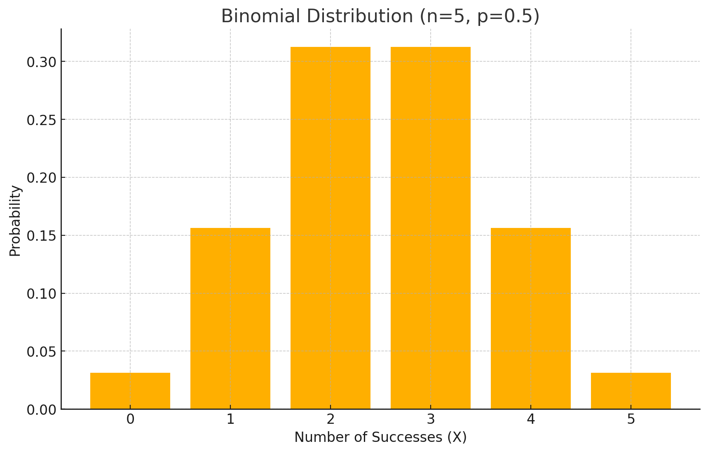
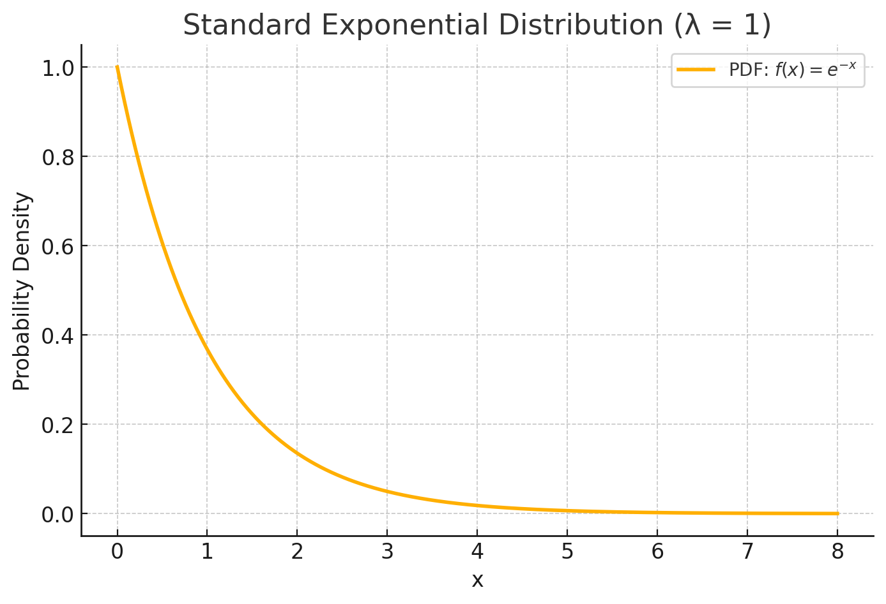
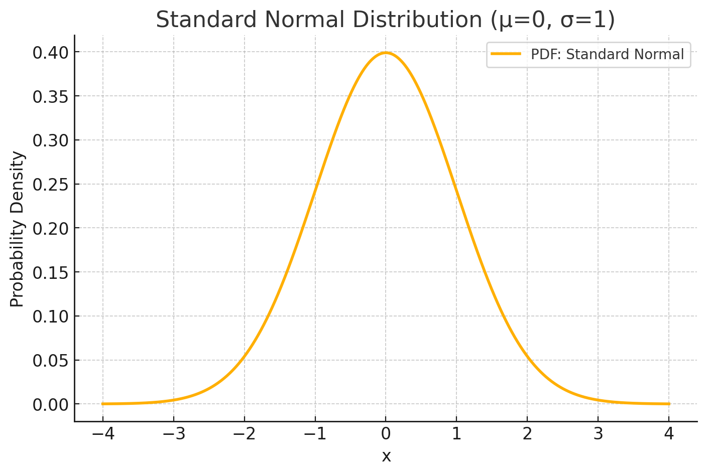
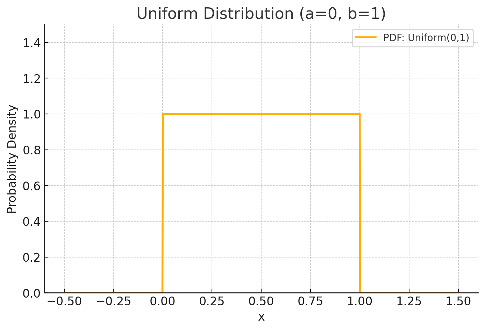
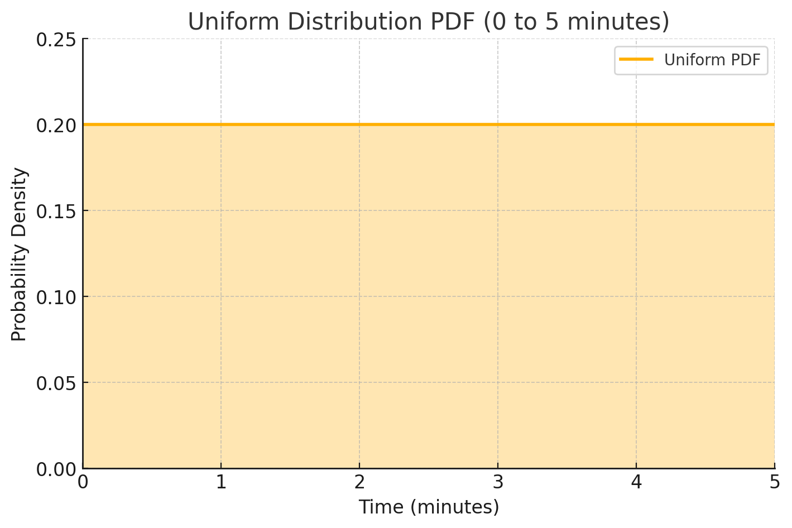
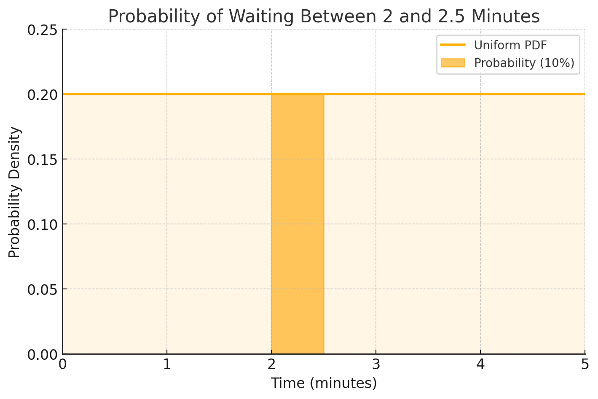
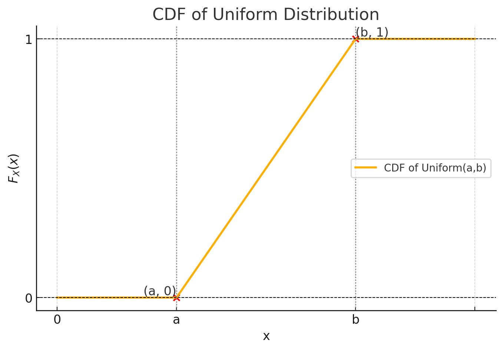
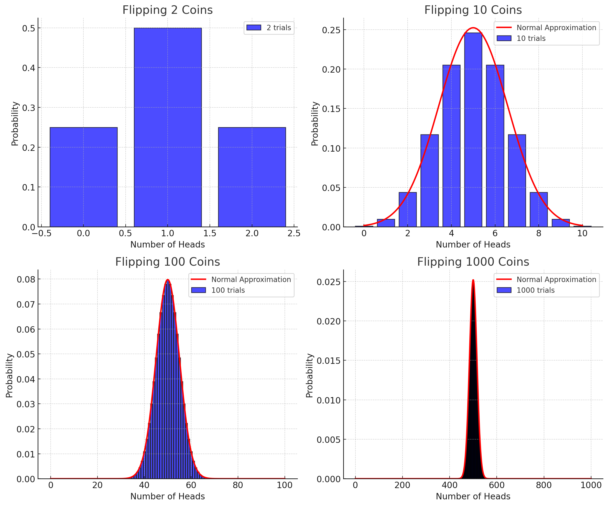
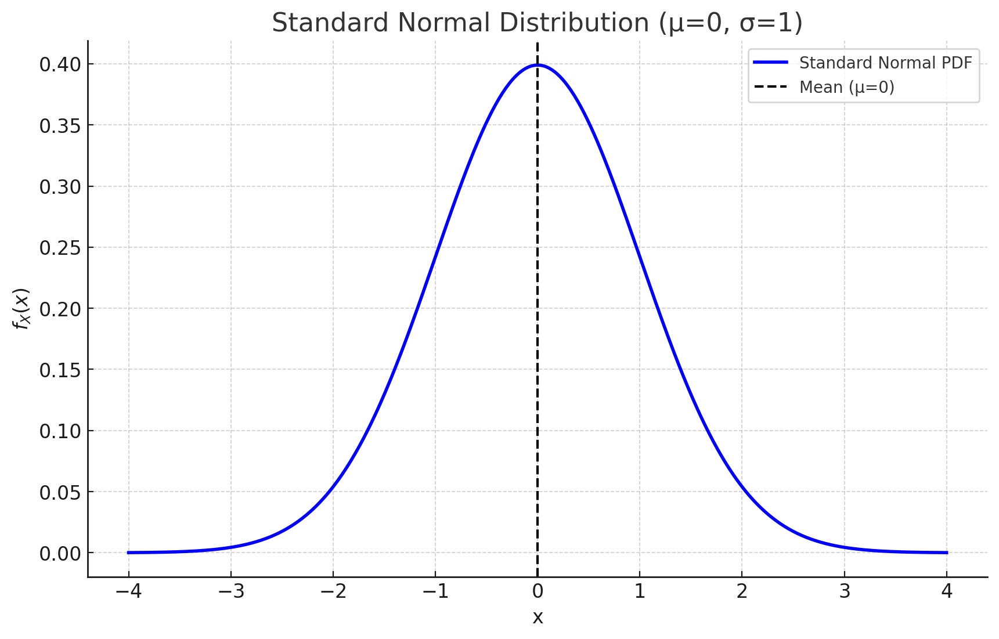

# Probability and Statistics for ML and DS(2)_Probability Distributions

## Random Variables: When Numbers Play Games of Chance

> *Have you ever wondered why weather forecasts say there's a "70% chance of rain" instead of just "it will rain" or "it won't rain"? Or why stock market predictions come with uncertainty? The answer lies in one of the most powerful concepts in probability theory: random variables.*

### Random Variables as Objects

Let's think of variables in an object-oriented way. In most programming and mathematics you've encountered before, **variables** behave like simple containers:

```
class DeterministicVariable:
    def __init__(self, value):
        self.value = value
        
    def get_value(self):
        return self.value  # Always returns the same value
```

But random variables are a different class entirely:

```
class RandomVariable:
    def __init__(self, possible_values, probabilities):
        self.possible_values = possible_values
        self.probabilities = probabilities
        
    def get_value(self):
        # Returns different values with different probabilities!
        return random_choice(self.possible_values, weights=self.probabilities)
```

This fundamental difference is what makes random variables so special - they're not just containers for a single value, but rather objects that model **uncertainty**(Oh! beautiful uncertainty!) itself!

### Random Variables vs. Deterministic Variables

This distinction is crucial to understand. Let's compare:

**Deterministic Variables**

- Definition: Variables that always have the same value once defined

- Examples:
  - x = 2 in algebra
  - f(x) = x² in calculus (for any specific input)
  - Constants like π or e

- Behavior: Completely predictable and fixed

- Purpose: Model known, certain quantities

**Random Variables**

- Definition: Variables that can take different values according to probability distributions

- Examples:
  - Number of heads in 10 coin flips
  - Tomorrow's temperature
  - Time until your next text message arrives

- Behavior: Unpredictable for individual outcomes, but with predictable patterns over many repetitions

- Purpose: Model uncertainty and variability

The fundamental difference is **certainty versus uncertainty**. If I define a deterministic variable x = 3, then every time I reference x, it equals 3. No exceptions. 

But with a random variable X representing a die roll, each time I "sample" X, I might get 1, 2, 3, 4, 5, or 6 - with each having a 1/6 probability.

From an object-oriented perspective, deterministic variables are like simple immutable objects, while random variables are complex objects with internal probability machinery that produces different outcomes each time they're accessed.

This is why we often use capital letters, like $X$, for random variables in probability theory, to distinguish them from deterministic variables, like $x$, in algebra.

### The Coin Flip: Random Variables in Action

Let's start with something familiar: flipping a fair coin. 

Imagine we define a random variable X as "the number of heads obtained in a single coin flip." What are the possible values? Since we can only get heads (1) or tails (0), our X can only take values 0 or 1:

- P(X = 1) = 0.5 (probability of getting heads)
- P(X = 0) = 0.5 (probability of getting tails)

This may seem trivial, but the power becomes apparent when we extend to more complex scenarios.

### Multiple Coin Flips: Patterns Emerge

What if we flip a coin 10 times and define X as "the number of heads obtained"? Now our random variable X can take values ranging from 0 to 10.

The probability calculations become more interesting:
- $P(X = 0) = 0.5^{10}$ (probability of getting all tails)
- $P(X = 10) = 0.5^{10}$ (probability of getting all heads)
- But what about $P(X = 5)$ or other values in between?

When we run this experiment many times, we see a fascinating pattern emerge. The distribution forms what mathematicians call a "binomial distribution" - with values in the middle (around 5 heads) being much more likely than extreme values (0 or 10 heads).

### Random Variables Are Everywhere

Once you understand the random variable concept, you'll see them everywhere:

- **Discrete Random Variables**: Take countable values
  - Number of heads in coin flips
  - Sum of dice rolls
  - Number of defective products in a shipment
  - Number of emails you receive daily

- **Continuous Random Variables**: Take values in a continuous range
  - Wait time for the next bus
  - Height of a person
  - Amount of rainfall in a month
  - Temperature tomorrow

### The Key Distinction: Discrete vs. Continuous

What's the fundamental difference between discrete and continuous random variables? It's not just about finite vs. infinite possible values.

The true distinction:
- **Discrete random variables** take values that can be counted or listed (even if infinite)
- **Continuous random variables** take values from an interval where no listing is possible

Think of discrete variables as dots on a number line, while continuous variables cover **entire segments of the line** with no gaps.

### Random Variables vs. Deterministic Variables

Random variables are different from deterministic variables.

- Deterministic variables always take the same value.
- Random variables take different values with different probabilities.

### Why This Matters for AI and Machine Learning

In AI systems, uncertainty is everywhere. When a facial recognition system is 95% confident about a match, it's working with random variables. When a recommendation system suggests products you might like, it's modeling your preferences as random variables.

Random variables are the foundation for:
- Neural network weight initialization
- Reinforcement learning reward functions
- Probabilistic predictions in language models
- Uncertainty estimation in decision-making algorithms

### The Object-Oriented View

Thinking of random variables as objects helps us understand their behavior:
- They have properties (possible values and their probabilities)
- They can be transformed (through mathematical operations)
- They can interact with each other (through joint distributions)
- They inherit characteristics from their "parent" probability spaces
- They can be specialized into different types (discrete, continuous, mixed)

This object-oriented perspective isn't just a metaphor - it's how modern probabilistic programming languages actually implement these concepts!

## Key Takeaway

The magic of random variables is that they let us model uncertainty in a mathematical framework. Instead of saying "I don't know what will happen," we can precisely quantify the possibilities and their likelihoods. This is the foundation that makes modern AI systems possible.

---

## Probability Distributions: The Shape of Uncertainty

> *Have you ever noticed how different weather forecasts are in different seasons?*

In summer, temperatures might vary between 20-40°C, while winter temperatures might range from -20-0°C. What if we could create a "shape" that shows not just what's possible, but what's likely? That's exactly what probability distributions do!

### From Individual Outcomes to Complete Distributions

In our probability journey, we've learned to calculate individual probabilities and perform operations with them. Now we're ready to take a giant leap forward: looking at the entire "landscape" of possibilities at once.

Think of a probability distribution as a map of uncertainty. Just as a topographical map shows the shape of a landscape, a probability distribution shows the "shape" of randomness.

### Discovering the Patterns in Coin Flips

Let's explore this with a simple experiment: flipping three fair coins. We'll define our random variable X as "the number of heads obtained."

What values can X take? Obviously 0, 1, 2, or 3 heads. But here's where it gets interesting - some of these outcomes are more likely than others!

#### Breaking Down the Possibilities:

For X = 0 (no heads):
- Only one way this happens: TTT (all tails)
- P(X = 0) = 1/8

For X = 1 (one head):
- Three different ways: HTT, THT, TTH
- P(X = 1) = 3/8

For X = 2 (two heads):
- Three different ways: HHT, HTH, THH
- P(X = 2) = 3/8

For X = 3 (all heads):
- Only one way: HHH
- P(X = 3) = 1/8

If we visualize this as a histogram, we get our first glimpse of a probability distribution:

```
   3/8|    ___ ___
      |   |   |   |
   2/8|   |   |   |
      |   |   |   |
   1/8|___|   |   |___
      |
     0| 0   1   2   3
       Number of Heads
```

### The Object-Oriented View of Distributions

When we think about probability distributions from an object-oriented perspective, we can view them as specialized extensions of random variables. 

A probability distribution inherits all properties of a random variable (possible values and their associated probabilities), but adds functionality specifically designed for analyzing the entire probability landscape at once. 

With a probability distribution object, we can visualize the shape of uncertainty through plotting methods, query the likelihood of specific outcomes with probability lookup functions, and analyze ranges of possibilities by calculating the probability of values falling within certain bounds. 

This object-oriented approach helps us encapsulate all the mathematical operations and analytical tools associated with distributions into a coherent conceptual framework, making it easier to understand how distributions behave and interact with other probabilistic concepts.

### Scaling Up: More Coins, More Complex Patterns

What happens when we flip 4 coins instead of 3? Our random variable X (number of heads) can now take values from 0 to 4.

Let's count the possibilities:
- X = 0: Only one way (TTTT) → P(X = 0) = 1/16
- X = 1: Four ways (HTTT, THTT, TTHT, TTTH) → P(X = 1) = 4/16
- X = 2: Six ways (HHTT, HTHT, HTTH, THHT, THTH, TTHH) → P(X = 2) = 6/16
- X = 3: Four ways (HHHT, HHTH, HTHH, THHH) → P(X = 3) = 4/16
- X = 4: Only one way (HHHH) → P(X = 4) = 1/16

And with 5 coins:
- X = 0: P(X = 0) = 1/32
- X = 1: P(X = 1) = 5/32
- X = 2: P(X = 2) = 10/32
- X = 3: P(X = 3) = 10/32
- X = 4: P(X = 4) = 5/32
- X = 5: P(X = 5) = 1/32

Notice how the distribution becomes more "bell-shaped" as we increase the number of coins. This emerging pattern hints at something profound that we'll explore later: the Central Limit Theorem.

### The Probability Mass Function (PMF)

This mapping of values to probabilities has a special name: the Probability Mass Function (or PMF). For a discrete random variable X, the PMF tells us P(X = x) for each possible value x.

Think of the PMF as a lookup table for probabilities:

```
PMF for 3-coin experiment:
p(0) = 1/8
p(1) = 3/8
p(2) = 3/8
p(3) = 1/8
```

From an object-oriented perspective, the PMF is like a method of our distribution class that returns the probability for a specific value.

### Rules of a Valid PMF

Not just any function can be a PMF. For it to properly represent probabilities, it must satisfy:

1. **Non-negativity**: All probabilities must be ≥ 0
   - p(x) ≥ 0 for all possible values x

2. **Total probability = 1**: The sum of all probabilities must equal 1
   - Σ p(x) = 1 (summing over all possible values x)

These rules ensure our PMF actually represents a valid probability distribution.

### A Pattern Emerges: The Binomial Distribution

You might notice that our examples (3, 4, and 5 coin flips) follow a similar pattern. There's actually a mathematical model that captures this pattern perfectly: the Binomial Distribution.

When we have:
- A fixed number of trials (n)
- Each trial has two possible outcomes (success/failure)
- The probability of success is constant (p)
- Trials are independent

Then the number of successes follows a Binomial Distribution.

In our coin-flipping examples:
- n = number of coins
- "Success" = getting heads
- p = 0.5 (for a fair coin)

This is why the patterns look so similar - they're instances of the same distribution "family"!

### Why This Matters for AI

In machine learning, probability distributions are everywhere:
- Classification algorithms output probability distributions over possible categories
- Generative AI models (like those that create images or text) sample from complex distributions
- Reinforcement learning agents model uncertain outcomes using distributions

Understanding distributions is crucial for understanding how AI systems represent and reason about uncertainty.

### Connecting to Real-World AI Applications

Consider a facial recognition system. For each person in its database, it doesn't just say "match" or "no match" - it assigns probabilities. These probabilities form a distribution across all possible identities, and the system might choose the most likely match.

Or think about language models like ChatGPT. When generating text, these models don't just pick any word - they sample from a probability distribution over the vocabulary, where more contextually appropriate words have higher probabilities.

In the next section, we'll explore how to calculate with these distributions and introduce special distributions that appear frequently in AI applications.

---

## The Binomial Distribution: When Does Randomness Follow Patterns?

> *Have you ever wondered why games of chance feel so... unpredictable, yet strangely consistent? Why do casino games like slot machines feel random in the moment, but casinos can reliably predict their profits over time? Or why, when you flip a coin multiple times, you're more likely to get a mix of heads and tails rather than all heads or all tails?*

These questions lead us to one of the most fascinating concepts in probability theory: distributions. Today, we're going to explore one of the simplest yet most powerful distributions - the binomial distribution.

### The Mystery of Repeated Events

Imagine you're flipping a coin five times in a row. What's more likely: getting exactly 2 heads or getting all 5 heads? Your intuition probably tells you that 2 heads is more likely than 5 heads, but why? And can we calculate exactly how much more likely it is?

This is where the binomial distribution comes into play. It's like a special lens that helps us see the hidden patterns in random events when they repeat multiple times.

### The Binomial Distribution as an Object

Let's think about the binomial distribution as an object in our world of probability. Like any well-designed object, it has:

1. **Properties** (what defines it)
2. **Methods** (what it can do)
3. **Instances** (specific examples of it)

#### Properties of the Binomial Distribution

Our binomial distribution object has two essential properties:
- `n`: The number of trials (like how many times we flip a coin)
- `p`: The probability of success in a single trial (like the probability of getting heads on one flip)

These properties completely define our distribution object. Change either of these values, and you create a different instance of the binomial distribution.

#### Methods of the Binomial Distribution

Our distribution object can answer important questions through its methods:
- It can calculate the probability of getting exactly `x` successes
- It can find the most likely number of successes
- It can measure how spread out the possible outcomes are

### Creating Binomial Distribution Instances

Let's create some specific instances of our binomial distribution object:

**Instance 1: Five Fair Coin Flips**
```
CoinFlipDistribution = BinomialDistribution(n=5, p=0.5)
```

This instance represents flipping a fair coin five times. The number of heads we'll get is distributed according to this binomial distribution.

**Instance 2: Ten Dice Rolls Looking for Ones**
```
DiceRollDistribution = BinomialDistribution(n=10, p=1/6)
```

This instance represents rolling a six-sided die ten times and counting how many ones we get.

### The Probability Formula: Our Object's Core Method

How does our binomial distribution object calculate probabilities? It uses this formula:  

$$
P(X = x) = \binom{n}{x} p^x (1-p)^{n-x}
$$

Where:
- $X$ is our random variable (the number of successes)
- $x$ is the specific value we're interested in
- $\binom{n}{x}$ is the binomial coefficient, which counts the number of ways to get $x$ successes in $n$ trials

Let's break this down:
1. $p^x$ represents the probability of getting $x$ successes
2. $(1-p)^{n-x}$ represents the probability of getting $(n-x)$ failures
3. $\binom{n}{x}$ counts all the different ways these successes and failures can be arranged

### The Binomial Coefficient: Counting Possibilities

The binomial coefficient $\binom{n}{x}$ (read as "n choose x") is like a counting machine inside our distribution object. It calculates how many different ways we can get exactly $x$ successes in $n$ trials.

$\binom{n}{x} = \frac{n!}{x!(n-x)!}$

This is equivalent to:
- Start with all possible ways to arrange $n$ events ($n!$)
- Divide by the number of ways the $x$ successes can be rearranged among themselves ($x!$)
- Also divide by the number of ways the $(n-x)$ failures can be rearranged among themselves ($(n-x)!$)

### Example 1: Five Coin Flips

Let's use our `CoinFlipDistribution` object to answer: What's the probability of getting exactly 2 heads in 5 coin flips?

1. First, we calculate the binomial coefficient:  

$$
\binom{5}{2} = \frac{5!}{2!(5-2)!} = \frac{5!}{2!3!} = \frac{120}{12} = 10
$$

- This tells us there are 10 different ways to get exactly 2 heads in 5 flips.

2. Now we use our probability formula:  

$$
P(X = 2) = \binom{5}{2} \times (0.5)^2 \times (1-0.5)^{5-2} = 10 \times 0.25 \times 0.125 = 0.3125
$$

- So there's approximately a 31% chance of getting exactly 2 heads.

### Example 2: Dice Rolls

Let's use our `DiceRollDistribution` object to solve: What's the probability of rolling a die 5 times and getting exactly 3 ones?

Here, we're creating a new instance with n=5 and p=1/6:
```
FiveDiceRollDistribution = BinomialDistribution(n=5, p=1/6)
```

1. The binomial coefficient:  

$$
\binom{5}{3} = \frac{5!}{3!(5-3)!} = \frac{5!}{3!2!} = \frac{120}{12} = 10
$$

2. The probability calculation:  

$$
P(X = 3) = \binom{5}{3} \times (1/6)^3 \times (5/6)^{5-3} = 10 \times (1/6)^3 \times (5/6)^2
$$

- Let's calculate this step by step:
   - $(1/6)^3 = 1/216$
   - $(5/6)^2 = 25/36$
   - $10 \times (1/216) \times (25/36) = 10 \times 25 / (216 \times 36) = 250 / 7776 \approx 0.0322$

- So there's approximately a 3.22% chance of getting exactly 3 ones in 5 dice rolls.

### The Shape of Probability: Visualizing Our Distribution

Our binomial distribution object takes a specific shape when we visualize it. For a fair coin (p=0.5), the distribution is symmetrical, like a bell. For a biased coin or a die (p≠0.5), the distribution becomes skewed.

For our `CoinFlipDistribution` (n=5, p=0.5), the probabilities look like:
- P(X=0) = 0.03125 (3.125%)
- P(X=1) = 0.15625 (15.625%)
- P(X=2) = 0.31250 (31.25%)
- P(X=3) = 0.31250 (31.25%)
- P(X=4) = 0.15625 (15.625%)
- P(X=5) = 0.03125 (3.125%)



Notice how the most likely outcomes are in the middle (2 or 3 heads), and the extremes (0 or 5 heads) are least likely.

### Different Instances, Same Class

Let's compare our different binomial distribution instances:

1. `CoinFlipDistribution(n=5, p=0.5)`: A fair coin flipped 5 times
2. `DiceRollDistribution(n=10, p=1/6)`: A die rolled 10 times, counting ones

These are different instances of the same binomial distribution class. They behave according to the same rules (their methods are identical), but their specific behaviors differ based on their properties (n and p).

This is exactly like how in object-oriented programming, all instances of a class share methods but have different property values!

### The Binomial Distribution in Machine Learning

In machine learning, the binomial distribution helps us model many real-world scenarios:

- Email spam detection (spam vs. not spam decisions)
- Medical testing (positive vs. negative results)
- Customer behavior (purchase vs. no purchase decisions)

These are all examples of binary outcomes happening multiple times, which is exactly what our binomial distribution models.

### Conclusion: The Power of Object-Oriented Thinking

By thinking of the binomial distribution as an object with properties and methods, we gain powerful insights:

1. We can create different instances to model different scenarios
2. We understand that the underlying pattern remains the same across these instances
3. We can predict and calculate probabilities with precision
4. We recognize that seemingly random events follow structured patterns

This object-oriented approach helps us see that probability distributions aren't just mathematical formulas - they're models of how randomness behaves in structured ways, which is a concept fundamental to understanding machine learning and AI.

In our next section, we'll explore how multiple binomial distribution objects can interact and how they relate to other distribution families in our probability universe.

---

## Bernoulli Distribution: The Building Block of Randomness

### The Two-Outcome Pattern

Imagine you're holding a coin in your hand. Before you flip it, the universe of possibilities contains exactly two outcomes: heads or tails. This simple scenario—where an experiment has exactly two possible outcomes—is incredibly common in our world:

- Will it rain today? (Yes/No)
- Did the student pass the test? (Pass/Fail)
- Is the email spam? (Spam/Not Spam)
- Will this customer make a purchase? (Buy/Don't Buy)

All of these scenarios share a fundamental pattern. From an object-oriented perspective, they're all instances of the same class: the **Bernoulli distribution**.

### The Bernoulli Distribution as an Object

Let's think about the Bernoulli distribution not as a formula or equation, but as an object with properties, methods, and instances:

**Bernoulli Distribution**
- **Properties**: 
  - Parameter $p$: the probability of success
  - Complementary probability $(1-p)$: the probability of failure
  
- **Methods**:
  - Calculate probability of success: Returns $p$
  - Calculate probability of failure: Returns $(1-p)$
  
- **Instances**:
  - Coin flip: Success = Heads $p=0.5$, Failure = Tails $1-p=0.5$
  - Die roll for "1": Success = Roll "1" $p=1/6$, Failure = Roll "2 to 6" $1-p=5/6$
  - Patient diagnosis: Success = Sick $p$ varies, Failure = Healthy $1-p$

From this perspective, when we're working with a Bernoulli distribution, we're not just applying a formula—we're creating an instance of a probability object with specific properties.

### Creating Bernoulli Instances

Let's walk through some examples to see how we can create different instances of the Bernoulli distribution by setting the parameter $p$ and defining what we consider a "success":

#### Instance 1: Coin Flip
- Random variable $X$ = number of heads
- Success: $X = 1$ (Heads)
- Failure: $X = 0$ (Tails)
- Parameter: $p = 0.5$ (for a fair coin)
- Probability of success: $P(X=1) = 0.5$
- Probability of failure: $P(X=0) = 0.5$

#### Instance 2: Die Roll
- Random variable $X$ = number of times you roll a 1
- Success: $X = 1$ (Roll shows "1")
- Failure: $X = 0$ (Roll shows anything but "1")
- Parameter: $p = 1/6$
- Probability of success: $P(X=1) = 1/6$
- Probability of failure: $P(X=0) = 5/6$

#### Instance 3: Patient Diagnosis
- Random variable $X$ = number of sick patients
- Success: $X = 1$ (Patient is sick)
- Failure: $X = 0$ (Patient is healthy)
- Parameter: $p$ (varies depending on the disease prevalence)
- Probability of success: $P(X=1) = p$
- Probability of failure: $P(X=0) = 1-p$

### The Power of Object Thinking

Once you understand the Bernoulli distribution class, you can quickly apply it to any two-outcome situation(This is the power of object-oriented thinking). The underlying structure remains the same, even when the specific context changes.

Whether you're modeling coin flips, disease diagnoses, or spam detection, you're working with instances of the same fundamental object. This is why probability experts can move so easily between different fields—they recognize that despite surface differences, these problems share the same underlying structure.

### Why "Bernoulli"?

The distribution is named after Jacob Bernoulli, a Swiss mathematician from the late 17th century. He was one of the first to formalize this pattern in probability theory, though people had been dealing with two-outcome scenarios long before giving it a formal name.

### Beyond Simple Cases

While this may seem elementary now, the Bernoulli distribution is the building block for many more complex probability patterns.

### Key Takeaways

- The Bernoulli distribution models experiments with exactly two outcomes: success - with probability $p$ and failure - with probability $1-p$
- From an object-oriented perspective, it's a class with a single parameter $p$ and different instances (coin flips, die rolls, diagnoses)
- Despite different contexts, all Bernoulli experiments share the same underlying structure
- Understanding the Bernoulli distribution as an object makes it easier to apply across different domains

Did you notice how seeing the Bernoulli distribution as an object made the pattern clearer? This is the power of object-oriented thinking in probability—it helps us see connections tha

---

## Continuous Probability Distributions: When Reality Flows Beyond Countable Outcomes

> *Have you ever wondered why we measure rain in inches or centimeters instead of counting individual drops?😂 Or why we track time in seconds rather than counting discrete events?*

Many natural phenomena don't come in neat, countable packages—they flow continuously. This fundamental difference creates an interesting challenge in probability that we'll explore through our object-oriented lens.

### The Continuous vs. Discrete Divide

In our previous exploration of the Bernoulli distribution, we worked with outcomes we could count and list: 0 heads or 1 head, sick or healthy, spam or not spam. But not everything in life fits into such tidy categories.

Think about these questions:
- How long will you wait for your next bus?
- What will your exact body temperature be tomorrow morning?
- How much rain will fall during next week's storm?

The answers could be any value within a range—they flow continuously rather than jumping between discrete values.

### Distribution Objects: Two Different Classes

From an object-oriented perspective, we can think of probability distributions as belonging to one of two parent classes:

**DiscreteDistribution**
- **Properties**: 
  - Outcomes form a countable list (0, 1, 2, 3...)
  - Each outcome has a probability mass
  - Sum of all probability masses equals 1
  
- **Methods**:
  - Find probability of specific outcome
  - Calculate expected value
  - Sum probabilities across outcomes
  
- **Examples (Subclasses)**:
  - Bernoulli: Two outcomes with probabilities p and 1-p
  - Binomial: Count of successes in n Bernoulli trials
  - Poisson: Count of events in fixed time interval

**ContinuousDistribution**
- **Properties**: 
  - Outcomes form an uncountable interval (any real number in a range)
  - Described by a probability density function (curve)
  - Area under curve equals 1
  
- **Methods**:
  - Find probability within a range (area under curve)
  - Calculate expected value
  - Cannot find probability of exact value (always 0)
  
- **Examples (Subclasses)**:
  - Normal (Bell curve): Heights, measurement errors
  - Exponential: Waiting times, lifetimes
  - Uniform: Equal probability across an interval

### Why Exact Values Have Zero Probability in Continuous Distributions

Let's imagine you're on hold with customer service. The question "What's the probability your call will last exactly 2 minutes?" seems reasonable, but it reveals a fundamental property of continuous distributions.

With continuous distributions, the probability of any single exact value is zero. Why? Because there are infinitely many possible values in any interval. If your call could last any duration between 0 and 5 minutes, the possible durations include:
- 2 minutes
- 2.000001 minutes
- 2.000000001 minutes
- 2.π minutes
- ...and infinitely more values

When probability must be spread across infinitely many values while still summing to 1, each individual value must receive zero probability.

### From Bars to Curves: The Birth of Density Functions

So how do we work with continuous distributions if exact values have zero probability? We shift our focus to ranges instead of single points.

Instead of asking "What's the probability of waiting exactly 2 minutes?", we ask "What's the probability of waiting between 1.5 and 2.5 minutes?"

To visualize this transition from discrete to continuous thinking:

1. **Start with wide intervals**: Divide the waiting time into 1-minute intervals (0-1, 1-2, 2-3, 3-4, 4-5). For each interval, measure the probability of waiting that long.

2. **Increase granularity**: Refine to 30-second intervals, then 15-second intervals, then 1-second intervals, and so on.

3. **At the limit**: As intervals become infinitesimally small, the histogram bars become so numerous and narrow that they form a smooth curve—our probability density function.

The key insight: In continuous distributions, probability is represented by area under the curve, **not height**. The total area equals 1, just as probabilities in discrete distributions sum to 1.

### The Density Function Object

The probability density function (PDF) is a core property of any continuous distribution:

- **What it is**: A function that maps each possible value to its relative likelihood
- **What it isn't**: A direct measure of probability (the height at a point is not its probability)
- **How to use it**: Calculate area under the curve to find probability of a range of values
- **Constraint**: The total area under the curve equals 1

### Real-World Continuous Distribution Examples

**Waiting Time (Exponential Distribution)**
- **Random variable**: Time waiting for a bus
- **Range**: Any positive real number
- **Density pattern**: Higher near zero, decreasing as time increases
- **Interpretation**: Most buses arrive soon, but some take much longer


**Measurement Error (Normal Distribution)**
- **Random variable**: Deviation from true value when measuring height
- **Range**: Any real number (positive or negative)
- **Density pattern**: Bell-shaped, symmetric around zero
- **Interpretation**: Small errors are common, large errors are rare


**Manufacturing Tolerance (Uniform Distribution)**
- **Random variable**: Width of a machined part
- **Range**: Between specified minimum and maximum values
- **Density pattern**: Flat line (equal density everywhere in range)
- **Interpretation**: Any width within tolerance is equally likely


### Key Takeaways

- Continuous distributions handle random variables that can take any value within a range
- The probability of any exact value in a continuous distribution is zero
- We work with ranges and areas instead of individual outcomes and their probabilities
- The probability density function shows relative likelihood across the range
- Area under the curve gives probability for a specific interval

### Bridging to Machine Learning

In machine learning, continuous distributions are essential for:
- Modeling sensor readings and measurements
- Representing uncertainty in predictions
- Generating synthetic data
- Understanding noise in training data

When a self-driving car estimates the distance to an obstacle or a weather model predicts tomorrow's temperature, they're working with continuous distributions. Understanding these objects gives you the foundation to appreciate how AI systems handle uncertainty in a continuous world.

By thinking of probability distributions as objects with properties and methods, you can more easily recognize which class of distribution fits a particular problem, and how to correctly interpret and use it.

---

## Probability Density Functions: How Continuous Distributions Describe Reality

> *Have you ever wondered how statisticians calculate the exact probability of a basketball player making a shot from 23.7 feet away? Or how weather forecasters determine there's a 70% chance of rain tomorrow? In these scenarios, we're dealing with continuous values—distances, times, temperatures—and we need a special tool to work with them. That tool is the probability density function.*

### From Counting to Measuring: A New Way to Think About Probability

In our previous discussion, we saw that continuous distributions describe random variables that can take any value within a range. But how do we actually work with these distributions in practice? 

Let's extend our object-oriented framework:

```
ContinuousDistribution {
    Properties:
        - domain (the range of possible values)
        - pdf() (the probability density function)
    
    Methods:
        - calculateProbability(start, end) (finds area between two points)
        - getExpectedValue()
        - getVariance()
}
```

The probability density function (PDF) is a core property of any continuous distribution object. Unlike its discrete cousin (the Probability Mass Function), the PDF doesn't directly give probabilities—it gives us a way to calculate them through areas.

### Understanding the PDF Through Objects

Think of the PDF as a method that takes a value and returns the "density" of probability at that point:

```
pdf(x) → returns the density at point x
```

But what exactly is this "density"? Let's explore through an example.

### The Uniform Distribution: Equal Probability Everywhere

Let's create an instance of a simple continuous distribution: the uniform distribution. Imagine a call center where your waiting time could be anywhere between 0 and 5 minutes, with every possible waiting time equally likely.

**Uniform Distribution**
- **Domain**: 0 to 5 minutes
- **PDF**: A constant value across the entire domain
- **Total area under PDF**: Must equal 1

Since we need the area to equal 1, and we're covering a range of 5 minutes with the same height everywhere, that height must be 1/5 = 0.2 for our PDF.



### Calculating Probabilities: It's All About Area

To find the probability of waiting between 2 and 3 minutes:
- We need the area under the PDF curve between x=2 and x=3
- For our uniform distribution, this is: (height) × (width) = 0.2 × 1 = 0.2 or 20%

What about the probability of waiting between 2 and 2.5 minutes?
- Area = 0.2 × 0.5 = 0.1 or 10%



Did you notice something? As our interval gets smaller (from 1 minute to 0.5 minutes), the probability gets proportionally smaller. This illustrates a fundamental property: probability scales with the width of the interval.

### Why Exact Values Have Zero Probability

Now, what's the probability of waiting exactly 2 minutes? We'd need to calculate:
- Area = 0.2 × 0 = 0

The width of a single point is zero, so the area (probability) is zero! This confirms what we learned earlier—in continuous distributions, the probability of any exact value is always zero.

### Density vs. Probability: A Critical Distinction

This is why we call it a "density" function rather than a probability function. The value of the PDF at a point doesn't give the probability of that point—it gives the "density" of probability around that point.

Think of it like population density on a map. If a city has 1,000 people per square mile, that doesn't mean there are 1,000 people at any specific point (that would be impossible!). Rather, it tells you how concentrated the population is around that area.

Similarly, the value of our PDF (0.2 in our example) tells us how concentrated the probability is around each point.

### Requirements for a Valid PDF

For a function to be a valid PDF, it must meet three requirements:

1. **Non-negative**: The function must be greater than or equal to zero for all possible values. (Probability can't be negative!)

2. **Defined everywhere**: The function must be defined for all real numbers, even if it equals zero in some regions.

3. **Total area equals 1**: The total area under the curve must equal exactly 1, representing the total probability of all possible outcomes.

### Beyond Uniform: Different Shapes for Different Phenomena

While the uniform distribution is the simplest continuous distribution, most real-world phenomena don't follow uniform patterns. This is where different subclasses of continuous distributions come in, each with its own uniquely shaped PDF:

**Normal Distribution (Bell Curve)**
- **PDF Shape**: Symmetric bell curve, highest in the middle
- **Application**: Heights of people, measurement errors, natural phenomena
- **Property**: Most values cluster around the mean

**Exponential Distribution**
- **PDF Shape**: Highest at zero, decreasing exponentially
- **Application**: Waiting times, equipment lifetimes
- **Property**: More likely to get smaller values than larger ones

**Beta Distribution**
- **PDF Shape**: Various shapes depending on parameters, confined to [0,1]
- **Application**: Probabilities, proportions, ratings
- **Property**: Flexible shape that can model many different patterns

### Comparing Discrete and Continuous Distributions

Let's summarize the key differences between our two main distribution classes:

**DiscreteDistribution**:
- Domain: Countable values (like 0, 1, 2, 3...)
- Probability method: Probability Mass Function (PMF)
- Calculation: P(X = a) directly gives probability
- Sum of all probabilities equals 1

**ContinuousDistribution**:
- Domain: Uncountable values (any point in an interval)
- Probability method: Probability Density Function (PDF)
- Calculation: P(a ≤ X ≤ b) requires calculating area
- Area under the entire curve equals 1

### Practical Application: Weather Forecasting

When a meteorologist says there's a 30% chance of rain tomorrow, they're working with continuous distributions:
- Temperature follows approximately a normal distribution
- Precipitation amounts follow different distributions depending on climate
- Wind speeds might follow a Weibull distribution

The forecaster uses historical data to create distribution objects, then calculates the area under specific regions of these distributions to determine probabilities of different weather events.

### Key Takeaways

- The probability density function (PDF) is a defining property of continuous distributions
- Unlike discrete distributions, we calculate probabilities through areas, not direct values
- The PDF shows the relative concentration of probability around each point
- Valid PDFs must be non-negative, defined everywhere, and have total area equal to 1
- Different continuous distribution subclasses have different PDF shapes to model different phenomena

### Looking Ahead

Understanding probability distributions as objects with properties like PDFs gives us a powerful framework for modeling uncertainty in the real world. In the next chapter, we'll explore some of the most important continuous distributions in detail and see how they're used in AI and machine learning to make predictions based on uncertain information.

Remember: when working with continuous distributions, think areas, not heights!

---

## Cumulative Distribution Functions: A New Method for Our Distribution Objects

> *Have you ever wondered why we sometimes need to calculate the probability of an event happening *before* a certain point, rather than exactly at that point? For example, what's the probability that a customer service call will end within 3 minutes, rather than lasting exactly 3 minutes?*

### From PDF to CDF: Why We Need Both

In our previous explorations, we've discovered that probability distributions are powerful objects in our statistical toolkit. We've learned about:

1. Discrete distributions (like the Bernoulli and Binomial) that handle countable outcomes
2. Continuous distributions that model uncountable, smooth outcomes
3. Probability Density Functions (PDFs) that describe how probability is distributed across possible values

But there's a challenge with PDFs, especially for continuous distributions. Remember that for continuous distributions, finding probabilities requires calculating areas under the curve? This is mathematically represented as integration, which can be inconvenient and computationally expensive.

This is where our distribution objects need another method - the **Cumulative Distribution Function (CDF)**.

### What is a Cumulative Distribution Function?

Think of the CDF as a new method that our distribution objects can implement, one that gives us a different way to access their probability information:

```
ContinuousDistribution {
    // Properties
    parameters: {...}
    
    // Methods
    pdf(x): returns the probability density at point x
    cdf(x): returns the probability that a random value is ≤ x
}
```

The CDF at a point `x` tells us the probability that our random variable takes on a value less than or equal to `x`. In formal notation, if our random variable is X, then:  

$$
F(x) = P(X ≤ x)
$$

Where F(x) is our CDF. This is exactly what a distribution object needs when we want to know the total probability accumulated up to a certain point.

### Our Call Center Example: Revisited

Let's revisit our call center example to illustrate this concept. 

Imagine we first modeled call durations as a discrete distribution with possible values in minute intervals: 0-1 minutes, 1-2 minutes, 2-3 minutes, and so on.

For this discrete distribution, the CDF at any point is simply the sum of probabilities for all values less than or equal to that point:  

$$
F(2) = P(X ≤ 2) = P(X = 0) + P(X = 1) + P(X = 2)
$$

In the continuous case, instead of adding individual probabilities, the CDF represents the area under the PDF curve from the beginning up to the point x:  

$$
F(x) = ∫(from -∞ to x) f(t) dt
$$

Where f(t) is the PDF. This gives us the probability that our random variable is less than or equal to x.

### Properties of CDF Objects

All CDF implementations, regardless of which distribution class they belong to, share these common properties:

1. **Range Constraint**: F(x) is always between 0 and 1 (inclusive), because it represents a probability
2. **Left Endpoint**: F(-∞) = 0, meaning the probability of a value less than the smallest possible outcome is zero
3. **Right Endpoint**: F(∞) = 1, meaning the probability of a value less than the largest possible outcome is one
4. **Monotonically Increasing**: The function never decreases as x increases, because we're accumulating probability

### Discrete vs. Continuous CDFs: Implementation Differences

Just like PDFs, CDFs are implemented differently depending on whether they belong to a discrete or continuous distribution:

#### For Discrete Distributions:
- The CDF has "jumps" at each possible value
- The height of each jump equals the probability mass at that value
- Between possible values, the function remains flat (horizontal)

#### For Continuous Distributions:
- The CDF is a smooth, continuous curve
- There are no jumps since no single point has any probability mass
- The slope of the CDF at any point is equal to the PDF value at that point

### Why CDFs Are Often More Convenient

CDFs offer several advantages over PDFs:

1. **Direct Probability Reading**: You can directly read the probability that X ≤ x from the CDF value
2. **No Integration Needed**: No need to calculate areas under curves for continuous distributions
3. **Unified Approach**: Works similarly for both discrete and continuous distributions
4. **Interval Probabilities**: Easily find P(a < X ≤ b) as F(b) - F(a)

### The PDF-CDF Relationship: Two Sides of the Same Object

The PDF and CDF are simply different methods of the same distribution object, giving us different ways to access its probability information:

- The PDF tells us the rate at which probability accumulates at each point
- The CDF tells us the total probability accumulated up to each point

For continuous distributions, the PDF is the derivative of the CDF, and the CDF is the integral of the PDF. This is a classic example of polymorphism in our distribution class hierarchy - each distribution implements these methods differently, but they serve the same conceptual purpose.

### Why This Matters for AI and Machine Learning

In AI and machine learning, we frequently need to:

1. Generate random samples from specific distributions
2. Calculate probabilities of outcomes falling within certain ranges
3. Compare observed data to theoretical distributions

The CDF is particularly useful for comparing distributions and generating random samples through a technique called inverse transform sampling (something we'll explore in future chapters).

### Thinking in Objects: The Complete Distribution Interface

Let's update our mental model of distribution objects to include this new CDF method:

```
Distribution {
    // Properties specific to the distribution type
    parameters
    
    // Methods
    calculate_probability() // PMF for discrete, PDF for continuous
    cumulative_probability() // CDF for all distributions
    expected_value()
    variance()
    generate_random_sample()
}
```

By understanding both PDFs and CDFs, we now have a more complete interface to our distribution objects, allowing us to interact with them in more flexible and powerful ways.

---

## The Uniform Distribution: Our First Continuous Distribution Object

> *Have you ever arrived at a bus stop without knowing the schedule? You might wonder: what's the probability that you'll wait exactly 3 minutes? Or less than 5 minutes? How would we model this mathematically?*

### Introducing the Uniform Distribution

After examining the general concepts of PDFs and CDFs, we're ready to look at our first concrete implementation of a continuous distribution object: the **Uniform Distribution**.

The uniform distribution is the simplest continuous distribution and serves as an excellent starting point for understanding how abstract distribution concepts manifest in specific implementations. It's like the "Hello World" program of probability distributions!

### What Makes a Distribution "Uniform"?

A uniform distribution represents a scenario where all possible values within a specific range have an *equal* chance of occurring. Think about it this way:

- If you arrive randomly at a bus stop and buses come exactly every 10 minutes
- But you don't know the schedule
- Your waiting time could be anywhere from 0 to 10 minutes
- Every possible waiting time (3.2 minutes, 5.7 minutes, 9.1 minutes, etc.) has an equal probability

This "equal probability across a range" is the defining characteristic of the uniform distribution. No value in the allowed range is more likely than any other.

### The Uniform Distribution Object

Let's define our uniform distribution object:

```
UniformDistribution extends ContinuousDistribution {
    // Properties
    a: lower bound of the interval
    b: upper bound of the interval
    
    // Methods
    pdf(x): returns 1/(b-a) if a ≤ x ≤ b, 0 otherwise
    cdf(x): returns 0 if x < a, (x-a)/(b-a) if a ≤ x ≤ b, 1 if x > b
    expected_value(): returns (a+b)/2
    variance(): returns (b-a)²/12
}
```

> The denominator of the variance is 12, which comes from a mathematical derivation. For a uniform distribution over [a,b], the variance can be calculated using the integral:
> Var(X) = ∫(x - (a+b)/2)² · 1/(b-a) dx  (from a to b)
> When we solve this integral and simplify the expression, we get (b-a)²/12.

> Another way to understand this: the standard deviation of a uniform distribution is (b-a)/(2√3). When we square this to get the variance, we get (b-a)²/12.
> This value appears in many statistical applications. For example, the variance of a uniform distribution over [0,1] is 1/12

This uniform distribution object inherits all the general properties of continuous distributions, but it implements its methods in a specific way.

### The Uniform Distribution's PDF Method

The PDF (probability density function) for a uniform distribution has a remarkably simple implementation:  

$$
f_X(x) = \begin{cases}
\frac{1}{b-a} & \text{if } a < x < b \\
0 & \text{otherwise}
\end{cases}
$$

This means:
- Inside the interval [a,b], the density is constant: 1/(b-a)
- Outside the interval, the density is zero

Why 1/(b-a)? Remember that the total area under any PDF must equal 1. If we have a rectangle with width (b-a) and height h, then:
- Area = width × height = (b-a) × h = 1
- Solving for h: h = 1/(b-a)

The uniform distribution's PDF is just a flat line over the interval [a,b]. The height of this line decreases as the interval gets wider, and increases as the interval gets narrower. This ensures the area always equals 1.

### The Uniform Distribution's CDF Method

The CDF for a uniform distribution is equally straightforward:  

$$
F_X(x) = \begin{cases}
0 & \text{if } x < a \\
\frac{x-a}{b-a} & \text{if } a \leq x \leq b \\
1 & \text{if } x > b
\end{cases}
$$

Graphically, this looks like:
- A horizontal line at 0 for x < a
- A straight line from point (a,0) to point (b,1)
- A horizontal line at 1 for x > b

This makes sense because:
- Before the interval starts (x < a), no probability has accumulated yet
- Inside the interval, probability accumulates at a constant rate
- After the interval ends (x > b), all probability has accumulated



### A Real-World Example: Call Center Wait Times

Imagine a call center where wait times are uniformly distributed between 0 and 15 minutes. After that, calls are automatically disconnected.

In this scenario:
- Our uniform distribution has parameters a=0 and b=15
- The PDF is a constant line at height 1/15 = 0.067 between 0 and 15
- The CDF increases linearly from (0,0) to (15,1)

Let's answer some practical questions:

1. **What's the probability of waiting exactly 7 minutes?**
   Since this is a continuous distribution, the probability of any exact value is 0.

2. **What's the probability of waiting less than 5 minutes?**
   Using the CDF: F(5) = (5-0)/(15-0) = 5/15 = 1/3

3. **What's the probability of waiting between 10 and 12 minutes?**
   F(12) - F(10) = 12/15 - 10/15 = 2/15

4. **What's the expected wait time?**
   (0+15)/2 = 7.5 minutes

### Implementation in Code

If we were to implement this distribution in code, it might look like:

```python
class UniformDistribution:
    def __init__(self, a, b):
        self.a = a
        self.b = b
        
    def pdf(self, x):
        if self.a <= x <= self.b:
            return 1 / (self.b - self.a)
        else:
            return 0
            
    def cdf(self, x):
        if x < self.a:
            return 0
        elif x > self.b:
            return 1
        else:
            return (x - self.a) / (self.b - self.a)
            
    def expected_value(self):
        return (self.a + self.b) / 2
        
    def variance(self):
        return ((self.b - self.a) ** 2) / 12
```

### Applications in AI and Machine Learning

The uniform distribution might seem simple, but it plays several important roles in AI and machine learning:

1. **Random Initialization**: Many AI models start with uniformly distributed random values for parameters.

2. **Exploration in Reinforcement Learning**: Agents often use uniform distributions to explore their environment randomly.

3. **Data Augmentation**: Uniform distributions help create random perturbations in training data.

4. **Base Distribution for Complex Models**: Many sampling algorithms start with uniform distributions and transform them.

5. **Prior Distributions**: In Bayesian models, uniform distributions often represent "no prior knowledge" about parameters.

### The Uniform Distribution as a Building Block

While the uniform distribution is simple, it serves as a foundation for understanding more complex distributions. It demonstrates key concepts:

- How parameters define a distribution object's behavior
- How PDF and CDF methods implement specific patterns
- How to calculate probabilities for continuous ranges
- How the expected value relates to the distribution's shape

The elegant simplicity of the uniform distribution makes it a perfect starting point for our exploration of probability in AI. As we continue, we'll see how other distributions inherit some concepts from the uniform distribution while implementing their own unique behaviors.

In the next section, we'll examine another fundamental continuous distribution: the Normal (or Gaussian) distribution, which forms the backbone of many statistical methods in AI.

---

## The Normal Distribution: Nature's Favorite Pattern

> *Have you ever wondered why so many things in our world seem to follow a "bell-shaped" pattern? Return rates of stocks, heights of people, test scores in a large class, measurement errors, even the velocities of gas molecules – they all tend to cluster around a central value with fewer and fewer occurrences as you move away from the center. What universal principle could possibly connect such diverse phenomena?*

### The Most Important Distribution in the Universe

After exploring the uniform distribution, we're ready to examine what is arguably the most important probability distribution in statistics, science, and machine learning: the **Normal Distribution** (also called the Gaussian distribution, after mathematician Carl Friedrich Gauss).

While the uniform distribution is the simplest continuous distribution, the normal distribution is nature's favorite – appearing almost magically in countless natural and human-made systems. Understanding this distribution is like having a master key that unlocks patterns across the universe.

### From Coin Flips to Bell Curves: An Emergent Pattern

Let's start with something surprising. Remember our binomial distribution from earlier chapters? Something remarkable happens when you increase the number of trials.

Imagine flipping 2 coins and counting the number of heads. The probability mass function has three possible values (0, 1, or 2 heads). Now imagine flipping 10 coins... then 100... then 1,000. As the number of flips increases, the shape of the distribution begins to look like a bell curve!



This transformation from discrete binomial distributions to a continuous bell curve demonstrates a profound mathematical principle called the **Central Limit Theorem** – which we'll explore more fully in later sections. For now, just know that this bell-shaped curve is our normal distribution, and it emerges naturally when many random effects combine.

### The Normal Distribution Object

Let's define our normal distribution object:

```
NormalDistribution extends ContinuousDistribution {
    // Properties
    μ: mean (center of the bell curve)
    σ: standard deviation (spread of the bell curve)
    
    // Methods
    pdf(x): returns the probability density at point x
    cdf(x): returns the probability that a random value is ≤ x
    expected_value(): returns μ
    variance(): returns σ²
    standardize(x): transforms x to standard normal form
}
```

The normal distribution is parameterized by two values:
- **μ (mu)**: The mean or average value, which defines where the bell curve is centered
- **σ (sigma)**: The standard deviation, which defines how wide or narrow the bell curve is

### The Bell Curve: Understanding the PDF Method

The PDF for a normal distribution is more complex than our uniform distribution, but its elegant formula captures the essence of the bell curve:  

$$
f_X(x) = \frac{1}{\sigma\sqrt{2\pi}}e^{-\frac{1}{2}(\frac{x-\mu}{\sigma})^2}
$$

This might look intimidating, but let's break it down into understandable components:

1. **The Bell Shape**: The $e^{-\frac{1}{2}(\frac{x-\mu}{\sigma})^2}$ part creates the basic bell shape
2. **Centering the Curve**: The $(x-\mu)$ part centers the bell at μ
3. **Controlling the Width**: The division by σ in $(\frac{x-\mu}{\sigma})$ controls how wide the bell is
4. **Ensuring Total Area = 1**: The $\frac{1}{\sigma\sqrt{2\pi}}$ part is a scaling factor that ensures the total area equals 1

Let's see how we can build this curve step by step:

1. Start with $e^{-x^2/2}$ (a basic bell shape centered at 0)
2. To center it at μ, replace x with $(x-μ)$
3. To adjust the width to match σ, replace $(x-μ)$ with $(x-μ)/σ$
4. Finally, multiply by $\frac{1}{\sigma\sqrt{2\pi}}$ to ensure the area equals 1

### Properties of the Normal Distribution

The normal distribution has several important properties:

1. **Symmetry**: The curve is perfectly symmetrical around its mean μ
2. **Mean = Median = Mode**: These three measures of central tendency are all equal
3. **Range**: Theoretically extends from -∞ to +∞ (though values far from the mean are extremely unlikely)
4. **68-95-99.7 Rule**: Approximately 68% of values fall within 1σ of the mean, 95% within 2σ, and 99.7% within 3σ. This is the incredible rule of understanding the world. 

### The Standard Normal Distribution: A Special Instance

When μ = 0 and σ = 1, we get a special case called the **Standard Normal Distribution**. This is like the "canonical instance" of our normal distribution class – a standardized version that makes calculations and comparisons easier.

The standard normal PDF simplifies to:  

$$
f_X(x) = \frac{1}{\sqrt{2\pi}}e^{-\frac{x^2}{2}}
$$



### Standardization: A Powerful Method

One of the most useful methods in our normal distribution object is the ability to standardize values. This transforms any normal distribution into the standard normal form through a simple operation:  

$$
z = \frac{x - \mu}{\sigma}
$$

Where:
- x is the original value
- z is the standardized value (also called a z-score)

For example, if your height is 175cm and the average height is 170cm with a standard deviation of 5cm, your z-score would be:  

$$
z = \frac{175 - 170}{5} = \frac{5}{5} = 1
$$

This means you're about 1 standard deviation above the mean height.

Standardization is incredibly useful because:
1. It allows us to compare values from different distributions
2. It lets us calculate probabilities using standard normal tables (historically) or functions (computationally)
3. It helps us understand how unusual or extreme a value is

### The CDF of the Normal Distribution

While the PDF of the normal distribution gives us the familiar bell curve, the corresponding CDF doesn't have a simple formula that we can write down. Instead, it's defined by an integral:  

$$
F_X(x) = \int_{-\infty}^{x} \frac{1}{\sigma\sqrt{2\pi}}e^{-\frac{1}{2}(\frac{t-\mu}{\sigma})^2} dt
$$

This integral can't be evaluated in terms of elementary functions. Historically, people used pre-computed tables of values. Today, we use numerical approximation algorithms in software.

The CDF of a normal distribution looks like an S-shaped curve that:
- Starts near 0 for very small values
- Equals 0.5 when x = μ (half the probability is below the mean)
- Approaches 1 for very large values

### Implementation in Code

A simplified implementation of the normal distribution might look like:

```python
import math

class NormalDistribution:
    def __init__(self, mu, sigma):
        self.mu = mu
        self.sigma = sigma
        
    def pdf(self, x):
        return (1 / (self.sigma * math.sqrt(2 * math.pi))) * \
               math.exp(-0.5 * ((x - self.mu) / self.sigma) ** 2)
    
    def standardize(self, x):
        return (x - self.mu) / self.sigma
    
    def cdf(self, x):
        # This is an approximation since the true CDF requires numerical integration
        z = self.standardize(x)
        # Using a common approximation algorithm
        return 0.5 * (1 + math.erf(z / math.sqrt(2)))
    
    def expected_value(self):
        return self.mu
    
    def variance(self):
        return self.sigma ** 2
```

### Real-World Examples

The normal distribution appears in countless real-world scenarios:

1. **Human Characteristics**: Heights, weights, and IQ scores tend to follow normal distributions
2. **Measurement Errors**: When measuring anything precisely, errors typically follow a normal distribution
3. **Natural Phenomena**: Velocities of gas molecules, thermal noise in electronics
4. **Financial Markets**: Some aspects of stock price movements (though with important caveats)
5. **Test Scores**: Results from large standardized tests usually approximate a normal distribution

### Why Is the Normal Distribution So Common?

The ubiquity of the normal distribution is explained by the Central Limit Theorem, which states that when a large number of independent random variables are added together, their sum tends toward a normal distribution, regardless of the original distributions of the variables.

This means whenever an outcome is influenced by many small, independent factors, we're likely to see a normal distribution. For example:

- Heights are influenced by countless genetic and environmental factors
- Measurement errors come from many small sources of imprecision
- Test scores reflect many aspects of knowledge and test-taking ability

### The Normal Distribution in AI and Machine Learning

In AI and machine learning, the normal distribution is everywhere:

1. **Gaussian Processes**: Used for regression, classification, and time-series analysis
2. **Bayesian Neural Networks**: Prior distributions over weights are often normal
3. **Noise Modeling**: Additive noise in data is commonly modeled as normally distributed
4. **Feature Normalization**: Data is often transformed to have a normal distribution
5. **Variational Autoencoders**: Use normal distributions to model latent spaces
6. **Natural Language Processing**: Word embeddings often follow multivariate normal distributions

### Beyond the Basic Normal: Extended Family

Our normal distribution object is actually part of a larger family:

1. **Multivariate Normal Distribution**: For modeling multiple correlated variables
2. **Log-Normal Distribution**: When the logarithm of a variable is normally distributed
3. **Truncated Normal Distribution**: A normal distribution with restricted range

These are like specialized subclasses of our normal distribution, inheriting its core properties while implementing their own specific behaviors.

### Connecting to the Uniform Distribution

Remember our uniform distribution from the previous section? There's an interesting connection between the two:

If we take a random variable $X$ with a standard normal distribution and compute $Y = Φ(X)$, where $Φ$ is the CDF of the standard normal, then $Y$ follows a uniform distribution between 0 and 1!

This relationship is fundamental to many simulation and sampling algorithms in AI, including the important technique called "inverse transform sampling."

### Summary: The Power of the Normal Distribution

The normal distribution is truly a master key for understanding our world. By modeling this distribution as an object with properties and methods, we gain powerful tools for:

1. Understanding natural patterns
2. Standardizing and comparing different measurements
3. Calculating probabilities for uncertain events
4. Building more sophisticated AI and machine learning models

As we continue our journey into probability, statistics, and AI, the normal distribution will reappear constantly, serving as a fundamental building block for more complex models and algorithms.