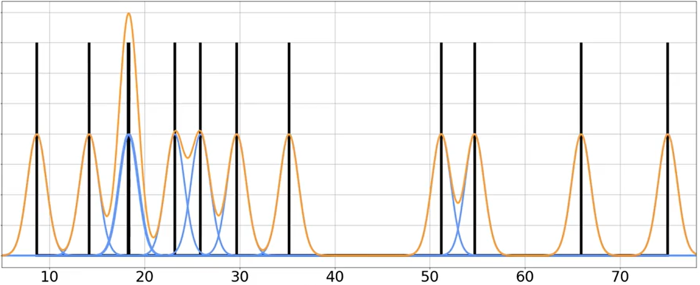
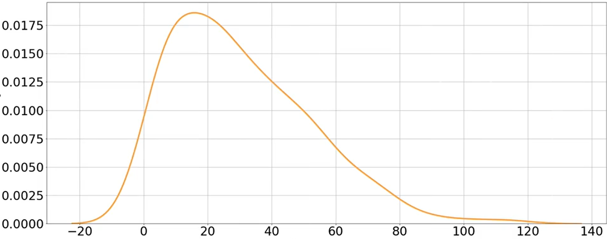
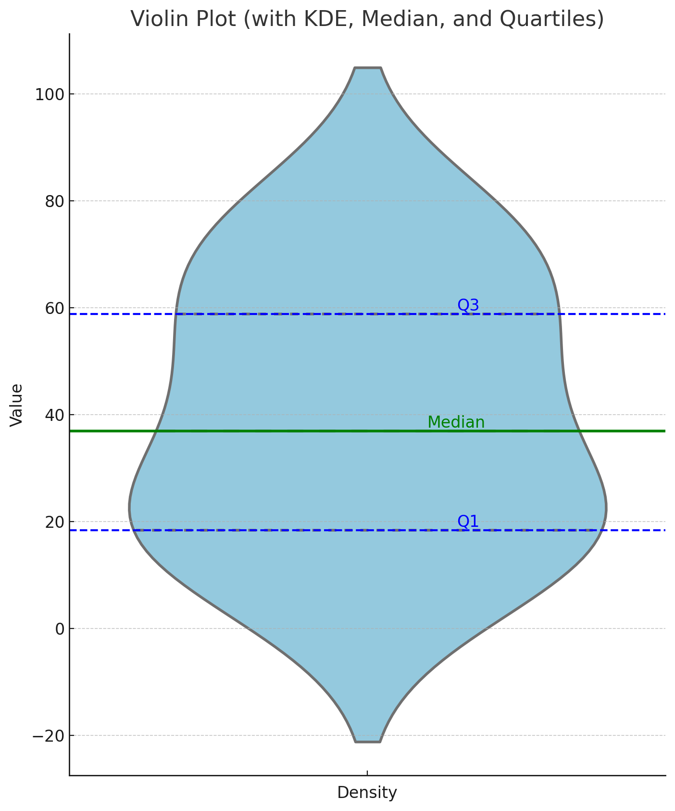

# Probability and Statistics for ML and DS(3)_Describing Distributions

## Expected Value: Finding the Balance Point of Distribution Objects

> *Have you ever wondered how casinos always seem to make money in the long run, even though some players win big? Or why insurance companies can reliably predict their profits despite unpredictable events like accidents and natural disasters? The secret lies in a powerful property of probability distributions called the "expected value" - and understanding this concept unlocks a deeper insight into how probability works in everything from games of chance to business decisions.*

### From Center of Mass to Expected Value

Imagine you have a seesaw on a playground. If you place weights at different positions along the seesaw, there's exactly one point where you can balance it - **the center of mass**. This balancing point is a perfect analogy for understanding **expected value**.

Let's start with a simple example. Think about 10 fox kits of different ages:
- 3 kits are 0 years old
- 2 kits are 1 year old
- 4 kits are 2 years old
- 1 kit is 3 years old

If we wanted to find the "average" age, we could use the formula we're all familiar with:  

$$
\text{Mean} = \frac{\text{Sum of all values}}{\text{Number of values}}
$$

So we get:  

$$
\text{Mean} = \frac{3 \times 0 + 2 \times 1 + 4 \times 2 + 1 \times 3}{10} = \frac{13}{10} = 1.3
$$

But there's another way to look at this. Instead of thinking about individual kits, we can think about the probability distribution of ages:
- Probability of age 0: $\frac{3}{10} = 0.3$
- Probability of age 1: $\frac{2}{10} = 0.2$
- Probability of age 2: $\frac{4}{10} = 0.4$
- Probability of age 3: $\frac{1}{10} = 0.1$

Now we can rewrite our calculation:  

$$
\text{Mean} = 0 \times 0.3 + 1 \times 0.2 + 2 \times 0.4 + 3 \times 0.1 = 1.3
$$

What we've just calculated is actually the expected value of the probability distribution! It's the **weighted** average of all possible values, where the weights are the probabilities.

### The Expected Value as a Distribution Object Property

Let's apply our object-oriented framework to formalize this concept. Remember how we've been thinking about probability distributions as objects with properties and methods? The expected value is one of the most important properties any distribution object has:

```python
DiscreteDistribution {
    // Properties
    possible_values: [x₁, x₂, ..., xₙ]
    pmf: function(x) { ... }  // Probability mass function
    
    // Methods
    expected_value: function() {
        let sum = 0;
        for each value x in possible_values:
            sum += x * pmf(x);
        return sum;
    }
}
```

This is a fundamental property that every probability distribution implements, though the implementation details differ between discrete and continuous distributions (we'll get to continuous distributions shortly).

### Expected Value in Action: Fair Games and Decision Making

Let's examine a practical application. Imagine a simple coin-flip game:
- If the coin lands heads, you win $10
- If it lands tails, you win nothing
- The coin is fair (50% chance of heads)

How much would you be willing to pay to play this game? To answer this, we need the expected value.

We have a discrete probability distribution with two outcomes:
- Outcome 1: Win $10 with probability 0.5
- Outcome 2: Win $0 with probability 0.5

Using our expected_value method:  

$$
E(X) = 10 \times 0.5 + 0 \times 0.5 = 5
$$

So the expected value is $5. This means that, on average, you'd win $5 per game if you played many times. Therefore, $5 is the "fair price" to play this game - any less and you have an advantage, any more and the game host has an advantage.

### Visualizing Expected Value as a Balance Point

Let's visualize our fox kit example again, but this time thinking of each age as a position on a number line, with the number of kits as weights:

```
Number of kits: 3    2     4     1
Ages:           0    1     2     3
                |    |     |     |
                ▼    ▼     ▼     ▼
                ●●●  ●●    ●●●●  ●
                
                     Balance point = 1.3
```

The balance point sits at 1.3, which is precisely our expected value. This visualization works for any probability distribution:

1. The possible values represent positions on a number line
2. The probabilities represent weights at those positions
3. The expected value is where the distribution would balance

### Expected Value for Binomial Distribution

Remember our binomial distribution from previous sections? Let's apply our understanding of expected value to it.

If you flip 3 fair coins and count the number of heads, what's the expected number of heads? Using our binomial distribution object:

```python
BinomialDistribution {
    // Properties
    n: 3              // Number of trials
    p: 0.5            // Probability of success
    
    // Methods
    pmf: function(k) {
        return combinations(n, k) * p^k * (1-p)^(n-k);
    }
    
    expected_value: function() {
        return n * p;
    }
}
```

For the binomial distribution, there's actually a simple formula for the expected value: $E(X) = n \times p$. In our case, that's $3 \times 0.5 = 1.5$.

We can verify this using the general formula:  

$$
E(X) = 0 \times P(X=0) + 1 \times P(X=1) + 2 \times P(X=2) + 3 \times P(X=3)
$$  

$$
= 0 \times \frac{1}{8} + 1 \times \frac{3}{8} + 2 \times \frac{3}{8} + 3 \times \frac{1}{8} = 1.5
$$

This makes intuitive sense too - if you flip 3 fair coins, you'd expect half of them to come up heads, which is 1.5 coins on average.

### Continuous Distributions and Expected Value

For continuous distributions, the principle is the same, but the implementation differs. Instead of summing discrete values, we **integrate** over the probability density function:

```python
ContinuousDistribution {
    // Properties
    pdf: function(x) { ... }  // Probability density function
    
    // Methods
    expected_value: function() {
        // Integration of x * pdf(x) over the entire domain
        // Implementation details depend on the specific distribution
    }
}
```

For example, for a uniform distribution between a and b, the expected value is simply $\frac{a + b}{2}$ - the midpoint of the interval.

### Expected Value as a Long-Term Average

Another way to think about expected value is as the long-term average outcome if you repeated an experiment many times.

For instance, if you played our coin-flip game thousands of times:
- Sometimes you'd win $10
- Sometimes you'd win $0
- But on average, you'd win about $5 per game

This makes expected value incredibly useful for:
- Casinos designing games with a slight advantage
- Insurance companies setting premiums
- Investors evaluating potential returns
- AI systems making optimal decisions under uncertainty

### Common Misconceptions

It's important to note that **the expected value isn't necessarily the most likely outcome !** In our coin-flip example, the expected value is $5, but that amount is never actually won in a single game! Similarly, the expected number of heads when flipping 3 coins is 1.5, but you can't actually get 1.5 heads - you can only get 0, 1, 2, or 3 heads.

Also, the expected value (mean) is not the same as the median (middle value when sorted) or the mode (most common value). We'll explore these differences in the next section.

### Applying Expected Value in AI and Machine Learning

In machine learning, expected value plays a crucial role in how AI systems make decisions:

1. **Reinforcement Learning**: AI agents learn to take actions that maximize expected future rewards
2. **Decision Trees**: Branches are evaluated based on expected outcomes
3. **Loss Functions**: Models are trained to minimize the expected prediction error
4. **Bayesian Methods**: Prior beliefs are updated based on expected values of posterior distributions

By understanding expected value, you're grasping one of the fundamental tools that enables AI systems to make optimal decisions in uncertain environments.

### Summary

Expected value is a fundamental property of any probability distribution object that represents its "balance point" or long-term average. Every distribution implements an expected_value() method, though the implementation differs between discrete and continuous distributions.

Whether you're analyzing games of chance, making business decisions, or building AI systems, the expected value provides crucial information about what to expect "on average" from a random process. It's one of the most powerful tools in probability theory, enabling us to make rational decisions even in the face of uncertainty.

---

## Beyond the Average: When Distribution Objects Need Multiple Ways to Find Their Center

> *Have you ever been in a class where the teacher announced that the class average on a test was a B+, but when you looked around, most students actually got Cs? Or heard about the "average" home price in a neighborhood that seems way higher than what most homes actually sell for? These situations make us wonder: is the average (mean) always telling the truth about what's typical?*

### When the Mean Misleads: The Lottery Winner Effect

Let's explore a fascinating real-world example. Imagine a small town called Riverdale with 1,000 residents, where the average household income was reported as $75,000 last year - significantly higher than the national average of $45,000 for similar small towns.

Was Riverdale really that prosperous? Not exactly. This statistical anomaly happened because one resident, Mrs. Garcia, won a $30 million lottery jackpot that year, dramatically skewing the average upward!

Most Riverdale residents earned around $45,000, but Mrs. Garcia's enormous windfall pulled the average far from what was typical. This phenomenon reveals a fundamental limitation in our `expected_value()` method - it can be heavily influenced by **outliers**.

### Distribution Objects Need Multiple Ways to Find Their Center

This is why our distribution objects need more than just the `expected_value()` method. They need additional ways to measure their "center" or typical values. Let's add two more important methods to our distribution objects:

```python
Distribution {
    // Properties we've seen before
    
    // Methods we already know
    expected_value() { ... }  // The mean/average
    
    // New methods for finding the center
    median() { ... }          // The middle value
    mode() { ... }            // The most common/likely value
}
```

Each of these methods tells us something different about where the "typical" values in our distribution lie.

### The Median Method: Finding the Middle Value

If we return to the Riverdale example, let's arrange all residents by income:

$35,000 - 38,000 - 42,500 - ... - 48,000 - ... - 30,000,000 (Mrs. Garcia)$

The median is simply the middle value in this **ordered list**. If there's an odd number of values, it's the exact middle; if there's an even number, it's the average of the two middle values.

Unlike the mean, the median isn't pulled by extreme values. Mrs. Garcia's lottery winnings count as just one data point at the end of the list, regardless of how large it is. This makes the median much closer to what a typical resident actually earned - around $45,000.

In our object-oriented framework, we can implement the median method like this:

```python
DiscreteDistribution {
    // Other properties and methods...
    
    median() {
        // Find the value where cumulative probability reaches 0.5
        // This is the point that divides the distribution in half
    }
}
```

For a distribution object, the median is the value where the cumulative probability first reaches or exceeds 0.5. It's the point where half the probability mass is below and half is above.

### The Mode Method: Finding the Most Likely Value

Remember our call center example from earlier section? If we plot the waiting times, some values occur **more frequently** than others. The mode is simply the value that occurs most often - the highest point on our probability distribution.

```python
Distribution {
    // Other properties and methods...
    
    mode() {
        // Return the value(s) where the PMF/PDF reaches its maximum
    }
}
```

For discrete distributions, the mode is the value with the highest probability mass. For continuous distributions, it's the value where the probability density function reaches its maximum height.

Unlike the mean and median, a distribution can have multiple modes (we call these "multimodal distributions"). Some distributions, like the uniform distribution, have infinitely many modes since all values have equal probability.

### Three Methods, Three Perspectives: How They Behave in Different Distribution Objects

Let's see how these three center-finding methods behave for different distribution objects:

#### Symmetric Binomial Distribution

For a binomial distribution with 5 coin flips and a fair coin (p=0.5):

```python
BinomialDistribution(n=5, p=0.5) {
    expected_value() → 2.5   // Balance point
    median() → 2.5           // Middle point 
    mode() → [2, 3]          // Most likely outcomes
}
```

This distribution is symmetric around 2.5, so the mean and median align perfectly. However, the mode identifies the two most likely outcomes: getting exactly 2 or 3 heads.

#### Asymmetric Binomial Distribution

For a binomial distribution with 5 coin flips but a biased coin (p=0.3):

```python
BinomialDistribution(n=5, p=0.3) {
    expected_value() → 1.5   // Balance point
    median() → 1             // Middle point
    mode() → 1               // Most likely outcome
}
```

In this skewed distribution, all three measures give different insights! The expected value is 1.5, but the most likely outcome (mode) is exactly 1 head, and the median is also 1.

#### Normal Distribution: Perfect Alignment

For a normal distribution, something special happens - all three measures perfectly align:

```python
NormalDistribution(μ, σ) {
    expected_value() → μ
    median() → μ
    mode() → μ
}
```

This alignment is why the normal distribution is so important in statistics. Its perfect symmetry means that all three ways of measuring the center give the same result.

### Choosing the Right Method for Your Question

Each of these methods offers a different lens for understanding a distribution's center:

- **expected_value()**: The mathematical average or balance point
- **median()**: The middle value that divides the probability equally
- **mode()**: The most likely outcome(s)

Like tools in a toolbox, different situations call for different measures:

- When working with symmetric distributions like a normal distribution, all three will be similar.
- When dealing with skewed data or outliers (like the Lottery Winner effect), the median often provides a better sense of what's "typical."
- When you specifically want to know the most likely outcome, the mode is your best choice.

### Beyond Central Tendency: What's Next?

Understanding the center of a distribution is just the beginning. Distributions also differ in how spread out they are. In the next section, we'll explore variance and standard deviation - properties that tell us about the spread or dispersion of a distribution.

### Summary

Distribution objects can implement multiple methods to find their center, each providing a different perspective on what constitutes a "typical" value:

1. The `expected_value()` method gives us the mean - the balance point of the distribution.
2. The `median()` method finds the middle value that divides the distribution in half.
3. The `mode()` method identifies the most likely value(s).

By understanding all three measures and when to use each one, we gain a more complete picture of any probability distribution we encounter - especially important when dealing with real-world data that might have outliers or asymmetry. 

---

## Expected Value of Functions: Teaching Distribution Objects New Tricks

> *Have you ever wondered how insurance companies calculate premiums for different risk profiles? Or how gaming companies determine the perfect balance for in-game rewards? These industries rely on a powerful extension of expected value - the ability to calculate the expected value of *functions* of random variables. This seemingly small extension unlocks extraordinary analytical power, and with our object-oriented approach, it's surprisingly intuitive to understand!*

### Beyond Simple Averages: A New Challenge

Imagine you're designing a mobile game where players roll a virtual die and win virtual coins equal to the *square* of what they roll. So rolling a 1 gives 1 coin, rolling a 2 gives 4 coins, rolling a 3 gives 9 coins, and so on. How many coins should you expect to give out per roll, on average? 

This isn't asking for the expected value of the die roll itself - it's asking for the expected value of a function (specifically, the square) of the die roll. Let's explore how our distribution objects can handle this new challenge.

### Extending Our Distribution Objects

In our object-oriented framework, we can add a new method to our distribution objects that calculates the expected value of any function applied to the random variable:

```python
Distribution {
    // Properties and methods we've seen before
    expected_value() { ... }
    median() { ... }
    mode() { ... }
    
    // Our new method
    expected_value_of_function(g) {
        // Calculate E[g(X)]
        // Implementation depends on distribution type
    }
}
```

For discrete distributions, the implementation would look something like this:

```python
DiscreteDistribution {
    // Other properties and methods...
    
    expected_value_of_function(g) {
        let sum = 0;
        for each possible value x:
            sum += g(x) * pmf(x);
        return sum;
    }
}
```

What's beautiful about this approach is that the method follows exactly the same pattern as our original `expected_value()` method - we're still doing a weighted average, but now we're applying the function $g(x)$ to each possible value before weighting it.

### The Dice Game Example: Putting It to Work

Let's return to our dice game example. We have a discrete distribution (the die roll) with six equally likely outcomes:

```python
DiceDistribution {
    // Properties
    possible_values: [1, 2, 3, 4, 5, 6]
    pmf(x) { return 1/6; }  // Each outcome has probability 1/6
    
    // Methods
    expected_value() {
        return (1 + 2 + 3 + 4 + 5 + 6) / 6 = 3.5;
    }
    
    expected_value_of_function(g) {
        return (g(1) + g(2) + g(3) + g(4) + g(5) + g(6)) / 6;
    }
}
```

To find the expected value of the square, we define g(x) = x² and calculate:

```python
g(x) = x²
expected_value_of_function(g) = (1² + 2² + 3² + 4² + 5² + 6²) / 6
                              = (1 + 4 + 9 + 16 + 25 + 36) / 6
                              = 91 / 6
                              ≈ 15.17
```

So on average, you'd expect to give out about 15.17 coins per roll. That's quite a bit more than the expected value of the die roll itself (3.5), which makes sense because squaring amplifies larger values much more than smaller ones.

### The Power of Linearity: A Special Property

Now let's consider a slightly different game. You roll a die and win twice the number rolled, but you have to pay $5 to play. Your net winnings would be:

2 × (die roll) - 5

For example:
- Roll a 1: Win 2 × 1 - 5 = -3 (you lose $3)
- Roll a 2: Win 2 × 2 - 5 = -1 (you lose $1)
- Roll a 3: Win 2 × 3 - 5 = 1 (you win $1)
And so on...

We could calculate this using our expected_value_of_function method with g(x) = 2x - 5:

```python
g(x) = 2x - 5
expected_value_of_function(g) = (g(1) + g(2) + g(3) + g(4) + g(5) + g(6)) / 6
                              = (-3 + (-1) + 1 + 3 + 5 + 7) / 6
                              = 12 / 6
                              = 2
```

So your expected net winnings are $2 per game.

But there's a powerful shortcut here! Notice:  

$$
E[2X - 5] = 2 × E[X] - 5 = 2 × 3.5 - 5 = 7 - 5 = 2
$$

This remarkable property is called **linearity of expectation**. For any constants $a$ and $b$:  

$$
E[aX + b] = a × E[X] + b
$$

This means our distribution objects actually have a simplified method for linear functions:

```python
Distribution {
    // Other methods...
    
    expected_value_of_linear_function(a, b) {
        return a * this.expected_value() + b;
    }
}
```

This property saves us from having to recompute the entire distribution when dealing with linear transformations, which are extremely common in practical applications.

### Beyond Linear Functions: The Full Power

While linear functions have this nice shortcut, our `expected_value_of_function` method works for ANY function $g(x)$, no matter how complex:

- Expected value of squares: $E[X²]$
- Expected value of exponentials: $E[e^X]$
- Expected value of trigonometric functions: $E[sin(X)]$
- Expected value of custom game payoff functions: $E[complicated\_payoff\_formula(X)]$

This flexibility is what makes the expected value of functions so powerful in real-world applications.

### Real-World Applications

This concept has countless applications:

1. **Insurance**: Calculating expected claim costs based on risk factors
2. **Gaming**: Balancing rewards in games with random elements
3. **Finance**: Computing expected returns of investment strategies
4. **Machine Learning**: Loss functions that quantify prediction errors
5. **Engineering**: Reliability analysis of complex systems

### A General Pattern Emerges

Notice how naturally the expected value of functions fits into our object-oriented framework. The distribution object already knows its probability structure through its PMF or PDF. By adding the `expected_value_of_function` method, we're essentially teaching our distribution object new ways to analyze itself and answer more complex questions.

This pattern of extending objects with new methods that leverage their existing properties is a fundamental principle in object-oriented thinking, and it's especially powerful when analyzing probability distributions.

### Summary

The expected value of a function $g(X)$ is calculated by applying $g$ to each possible value of $X$, then taking the weighted average using the original probabilities. In our object-oriented framework, this is simply a new method that our distribution objects can implement.

For linear functions of the form $aX + b$, we can use the linearity property to compute the expected value directly from the original expected value: $E[aX + b] = a × E[X] + b$.

This extension of expected value gives us a powerful tool for analyzing transformed random variables and solving real-world problems involving complex payoff structures and risk assessments.

---


## Sum of Expectations: When Simple Patterns Solve Complex Problems

> *Have you ever wondered how sports analysts predict team performance despite all the randomness in games? Or how video game designers balance character abilities when there are countless variables at play? The answer lies in a powerful property called the linearity of expectation – a fundamental method that distribution objects implement regardless of their complexity.*

### The Linearity Superpower

Distribution objects have a remarkable property: when you add them together, their expected values add together too. This might seem obvious, but it's a mathematical superpower that works regardless of whether the distributions are related or independent.

```python
(X + Y).expected_value() = X.expected_value() + Y.expected_value()
```

This property works universally, whether X and Y are independent, correlated, or even directly influence each other!

### Fantasy Game Character Design

Imagine you're designing characters for a new fantasy role-playing game. You've created a character class called "Enchanter" with three different magical abilities:

1. **Frost Nova**: Deals 2-10 damage (uniform distribution, average 6)
2. **Lightning Strike**: Has a 30% chance to deal 20 damage, otherwise nothing
3. **Mana Surge**: Adds a damage bonus equal to the player's remaining mana (which averages 5)

How much damage can players expect this character to deal with a full combination attack?

Instead of calculating the complex combined probability distribution (which would require considering all possible combinations), we can use the linearity of expectation:

```python
Total_Damage.expected_value() = Frost_Nova.expected_value() + Lightning_Strike.expected_value() + Mana_Surge.expected_value()
                              = 6 + (0.3 × 20) + 5
                              = 6 + 6 + 5
                              = 17
```

So players can expect to deal about 17 damage with a full combination attack, even though the actual damage might vary significantly in any given attempt.

### The Basketball Team Puzzle

Here's a more surprising application: Consider a basketball team with 12 players. In each game, a player has a certain probability of scoring based on their position:

- Guards (5 players): Each has a 40% chance of scoring at least 15 points
- Forwards (5 players): Each has a 25% chance of scoring at least 15 points  
- Centers (2 players): Each has a 20% chance of scoring at least 15 points

Before an important game, the coach wants to know: what's the expected number of players who will score 15+ points?

Using our linearity property, we can solve this elegantly:

```python
Total_High_Scorers.expected_value() = ∑ Player_i.expected_value()

For guards: 5 players × 0.4 = 2.0
For forwards: 5 players × 0.25 = 1.25
For centers: 2 players × 0.2 = 0.4

Total expected high scorers = 2.0 + 1.25 + 0.4 = 3.65
```

So the coach can expect about 3-4 players to score 15+ points in the game, even though the actual number might vary from 0 to 12.

### The Birthday Problem Twist

Here's a twist on the "birthday problem": In a classroom of 30 students, what's the expected number of "birthday twins" (pairs of students sharing a birthday)?

For each possible pair of students (there are 435 possible pairs with 30 students), the probability of sharing a birthday is 1/365. Using linearity:

```python
Expected_Birthday_Twins.expected_value() = ∑ Pair_i.expected_value()
                                         = 435 × (1/365)
                                         = 1.19
```

So in a class of 30, you can expect about 1 pair of students to share a birthday!

### Why This Property Is Amazing

The linearity of expectation is powerful because:

1. **It works regardless of dependencies** - When calculating expected values, we don't need to worry about whether events affect each other
2. **It simplifies complex calculations** - Break problems into simple parts instead of handling overwhelming combinations
3. **It reveals surprising patterns** - Sometimes the answer is much simpler than we might initially think

### Real-World Applications

This principle has practical applications across many fields:

- **Game design**: Balancing character abilities and game mechanics
- **Sports analytics**: Predicting team performance and optimizing strategy
- **Financial planning**: Calculating expected returns from diverse investments
- **Computer networks**: Estimating traffic loads across multiple connections
- **Artificial intelligence**: Evaluating expected rewards in reinforcement learning

### Object-Oriented Perspective

From an object-oriented view, we can see distributions as objects with an `expected_value()` method. When we add these objects together, their expected values add together too, regardless of how complex their internal implementations might be. This consistent behavior across different distribution classes exemplifies polymorphism – different objects implementing the same interface in ways that preserve essential properties.

By understanding that distribution objects implement this linearity property, we gain a powerful tool that makes complex probability problems tractable. This is especially valuable in modern AI systems, where engineers often need to work with complicated probability distributions but can rely on this fundamental property to simplify their calculations.

---

## Variance: Why Averages Only Tell Half the Story

> *Have you ever wondered why some bets feel riskier than others, even when they offer the same average payoff?*

Imagine two friends invite you to play a coin-flipping game. Elon musk offers a game where you win $1 for heads and lose $1 for tails. Meanwhile, Bill Gates offers a game where you win $100 for heads and lose $100 for tails. Both games have the same expected value ($0), but they're clearly not the same! Which would you rather play?

This example highlights why our distribution objects need more than just an `expected_value()` method to fully describe them. In this section, we'll explore the `variance()` method - a crucial property that measures the spread of possible outcomes around the average.

### Beyond the Balance Point: Measuring the Spread

Remember how we visualized expected value as the balance point of a distribution? While that tells us where the distribution is centered, it doesn't tell us how the weight is distributed around that point.

Distribution objects need a second fundamental method called `variance()` that measures how spread out the possible outcomes are. This method quantifies how far values typically deviate from the expected value.

### Why Average Deviation Doesn't Work

You might think the natural way to measure spread would be to calculate how far each outcome is from the mean, then average these deviations. Let's try this with Elon Musk's game:

- Mean: $0 = \frac{1 + (-1)}{2}$
- Outcome 1: $1$, deviation from mean: $1$
- Outcome 2: $-1$, deviation from mean: $-1$
- Average deviation: $1 + (-1) = 0$

Wait, that can't be right! The average deviation is always zero because the positive and negative deviations cancel each other out. This happens because the expected value is precisely the point where deviations balance.

### Squaring the Deviations: The Variance Method

To solve this problem, distribution objects implement variance by squaring the deviations before averaging them. This ensures all values are positive and gives more weight to larger deviations:

```python
variance() = expected_value_of((X - expected_value())²)
```

More intuitively, this calculation involves four steps:
1. Find the expected value (mean)
2. Calculate how far each possible outcome is from that mean
3. Square these deviations
4. Find the weighted average of these squared deviations

Let's implement this for our coin-flipping games:

**Elon Musk's Game**:
- Outcome 1: +1$ with probability 0.5
- Outcome 2: -1$ with probability 0.5
- Expected value: 0$
- Deviations: +1, -1
- Squared deviations: (+1)², (-1)² = 1, 1
- Variance: 0.5(1) + 0.5(1) = 1

**Bill Gates's Game**:
- Outcome 1: +100$ with probability 0.5
- Outcome 2: -100$ with probability 0.5
- Expected value: 0$
- Deviations: +100, -100
- Squared deviations: (+100)², (-100)² = 10,000, 10,000
- Variance: 0.5(10,000) + 0.5(10,000) = 10,000

Now we can see quantitatively that Bill Gates's game has much higher variance, reflecting its much greater volatility! (I'm not saying it's a bad game or risky, just that it's more volatile. It's very important concept to understand for modern finance and investment)

### A Computational Shortcut: Alternative Method Implementation

Distribution objects often implement an alternative method to calculate variance, which is sometimes easier to use:

```python
variance() = expected_value_of(X²) - (expected_value())²
```

Let's verify this works for Elon Musk's game:
- Expected value of X²: 0.5(1²) + 0.5((-1)²) = 0.5(1) + 0.5(1) = 1
- Square of expected value: (0)² = 0
- Variance: 1 - 0 = 1

This gives us the same answer as before, confirming both formulas are valid implementations of the variance method.

### Variance and Linear Transformations

Distribution objects have another important property: when you transform a distribution by multiplying by a constant or adding a constant, the variance changes in a specific way:

If $Y = aX + b$, then:

```python
Y.variance() = a² * X.variance()
```

Notice that adding a constant (b) doesn't affect the variance at all - it just shifts the distribution without changing its spread. But multiplying by a constant (a) squares that constant's effect on the variance.

### An Illustrative Example: The Dice Game

Let's see this property in action with a dice game:
- You roll a fair six-sided die (X)
- You win twice the amount shown
- The game costs $5 to play
- Your net winnings (Y) = 2X - 5

The variance of a fair die roll can be calculated as:

```python
X.variance() = expected_value_of(X²) - (expected_value())²
             = (1² + 2² + 3² + 4² + 5² + 6²)/6 - (3.5)²
             = 91/6 - 12.25
             = 15.17 - 12.25
             = 2.92
```

Using our transformation property, the variance of our game's winnings is:

```python
Y.variance() = 2² * X.variance()
             = 4 * 2.92
             = 11.68
```

This means the squared deviations in our new game are 4 times larger than in the original die roll, which makes sense because all the deviations have been multiplied by 2.

### Same Variance, Different Expected Values

Interestingly, two distributions can have the same variance but different expected values. Consider these games:

**Game A**:
- Heads: Win $2
- Tails: Lose $2
- Expected value: $0
- Variance: $4

**Game B**:
- Heads: Win $3
- Tails: Lose $1
- Expected value: $1
- Variance: $4

Despite Game B having a higher expected value (which makes it objectively better), both games have the same variance because the spread from their respective means is identical.

### Variance in the Real World

Understanding variance is crucial in many fields:
- **Investment**: Higher-variance investments are more volatile, even with the same expected return
- **Quality control**: Manufacturers prefer processes with low variance to ensure consistent products
- **Insurance**: Companies use variance to assess risk and set premiums
- **AI systems**: Models evaluate not just expected rewards but also their variance to make robust decisions
- **Game design**: Balancing randomness requires careful consideration of variance

### Variance as a Distribution Method

From an object-oriented perspective, variance is simply another method that all distribution objects implement. Just as distributions have an `expected_value()` method that tells us their central tendency, they also have a `variance()` method that tells us their spread.

This fits naturally into our framework where:
- Each distribution type (binomial, normal, uniform, etc.) is a different class
- All implement the same core methods like `expected_value()` and `variance()`
- Each distribution implements these methods differently based on their specific properties

### Connection to Standard Deviation

In our next discussion, we'll explore standard deviation - another method of distribution objects that's simply the square root of variance. This gives us a measure of spread in the same units as our original data, making it even more intuitive to interpret.

By understanding both the expected value (balance point) and variance (spread) of a distribution object, we gain a much more complete picture of its behavior. These two methods together form the foundation for analyzing probability distributions and making informed decisions in uncertain situations.

---

## Standard Deviation: Making Sense of Spread in the Real World

> *How can we measure the consistency of Olympic athletes' performances in a way that's actually meaningful?*

Imagine you're analyzing Olympic long jump results. The variance tells you that athletes' jumps vary by 0.25 **square meters** from their average. But what does that actually mean? A "square meter" isn't something we can visualize easily when thinking about jump distances!

This highlights a fundamental challenge with our distribution object's `variance()` method: it returns values in squared units. To solve this problem, distribution objects implement another essential method called `standard_deviation()`, which returns the spread in the same units as our original data.

### Why We Need Standard Deviation

Our distribution objects implement variance as:

```python
variance() = expected_value_of((X - expected_value())²)
```

When X represents measurements like heights, weights, or distances, the variance gives us values in **squared units**:
- Heights in meters → variance in $\text{meters}^2$
- Weights in kilograms → variance in $\text{kilograms}^2$
- Test scores in points → variance in $\text{points}^2$

These **squared units** make intuitive interpretation difficult. Standard deviation solves this by bringing us back to our original units:  

$$
\text{standard deviation} = \sqrt{\text{variance}}
$$


This simple method allows us to express the spread of our distribution in the same units as our data, making it much more intuitive to understand and apply.

### Standard Deviation in the Object Oriented Framework

From the object-oriented perspective, standard deviation is simply another method that distribution objects implement:

```python
class Distribution:
    def expected_value(self):
        # Implementation depends on distribution type
        pass
        
    def variance(self):
        # Implementation depends on distribution type
        pass
        
    def standard_deviation(self):
        return math.sqrt(self.variance())
```

Notice how `standard_deviation()` is implemented the same way across all distribution classes - it's always the square root of variance. This is a perfect example of code reuse through inheritance in our object-oriented framework!

### The Power of Standard Deviation in Normal Distributions

Standard deviation is particularly meaningful when working with normal distributions. If you visualize a normal distribution as a bell curve:

- The mean (`expected_value()`) tells us where the balance point of the bell is located
- The standard deviation (`standard_deviation()`) tells us how wide the bell is

In normal distributions, standard deviation gives us precise information about the probability of values falling within certain ranges:

1. Approximately 68% of values fall within 1 standard deviation of the mean
2. Approximately 95% of values fall within 2 standard deviations of the mean
3. Approximately 99.7% of values fall within 3 standard deviations of the mean

This is often called the "68-95-99.7 rule" or the "empirical rule."

### Seeing Standard Deviation in Action

Let's apply this to our Olympic long jumpers example:

Imagine the mean long jump distance is 8.2 meters with a standard deviation of 0.5 meters. This tells us:

- About 68% of jumps fall between 7.7 and 8.7 meters (±1 standard deviation)
- About 95% of jumps fall between 7.2 and 9.2 meters (±2 standard deviations)
- About 99.7% of jumps fall between 6.7 and 9.7 meters (±3 standard deviations)

Now we have a clear picture of the typical range of performance we can expect! Jesus, this is so cool!

Another example?

Imagine the distribution of stock investors' total return rates. In my opinion, the mean of investors' return rates is likely -30% and the standard deviation is about 50%. This means that 68% of investors will experience returns between -80% and 20%. Furthermore, 95% of investors will see returns between -130% and 70%, and 99.7% will have returns between -180% and 120%.

This is the reason that I say that standard deviation is the **cheat key** for understanding the world!

### Inflection Points and Visual Interpretation

Another fascinating property of normal distributions is that the standard deviation marks where the bell curve changes its shape (the inflection points). If you look at a normal curve:

- At exactly 1 standard deviation away from the mean (in either direction), the curve changes from "bending downward" to "bending upward"
- These points are precisely at μ±σ (mean ± standard deviation)

This gives us a visual way to estimate standard deviation by looking at a bell curve - it's the distance from the center to where the curve changes its bending direction.

### Standard Deviation in Different Contexts

The meaning of standard deviation changes depending on what our distribution represents:

**Heights of Adult Women:**
- Mean: 163 cm
- Standard deviation: 7 cm
- Interpretation: Most women's heights (68%) are within 7 cm of the average (156-170 cm)

**Delivery Times for Pizza:**
- Mean: 30 minutes
- Standard deviation: 5 minutes
- Interpretation: Most deliveries (68%) arrive within 5 minutes of the average time (25-35 minutes)

**Test Scores:**
- Mean: 75 points
- Standard deviation: 10 points
- Interpretation: Most students (68%) score within 10 points of the average (65-85 points)

A small standard deviation indicates consistency and predictability, while a large one indicates variability and less predictability.

### Standard Deviation as a Measure of Risk(In modern finance theory)

In modern finance theory, standard deviation is often used as a measure of **risk**(Really? let that sink in):

- A stock with high standard deviation of returns is considered volatile or risky
- A stock with low standard deviation is considered stable or less risky

Two investments might have the same expected return, but the one with lower standard deviation would generally be preferred by risk-averse investors.

### Beyond Normal Distributions

While standard deviation is most informative in normal distributions, it's still a useful descriptive statistic for any distribution. However, we should be careful about applying the 68-95-99.7 rule to non-normal distributions, as it may not hold true.

Different distribution classes may implement additional methods that provide more appropriate measures of spread for their specific shapes, but standard deviation remains a universal method all distribution objects support.

### Standard Deviation in Machine Learning

In modern AI systems, standard deviation is crucial for:
- Normalizing data (by dividing values by the standard deviation)
- Detecting outliers (typically values beyond 3 standard deviations)
- Assessing model uncertainty (through prediction intervals)
- Evaluating performance consistency across different models

### A Practical Perspective

Think of standard deviation as answering the question: "How far from the average is typical?" It tells us the typical distance of values from the mean, in the same units as our original measurements.

By understanding both `expected_value()` and `standard_deviation()`, we gain tremendous insight into a distribution's behavior. These two methods together give us a compact, intuitive description of where the distribution is centered and how much it tends to spread out.

As you continue exploring probability and statistics, you'll find that these two properties form the foundation for countless other analyses and decision-making processes. They're essential methods in our distribution objects toolkit, allowing us to understand uncertainty and variability across virtually every domain of human knowledge.

---

## When Random Variables Add Up: The Magic of Gaussian Combinations

> *Have you ever wondered what happens when you add up two random variables? Like when you're tracking a package delivery with both warehouse processing time and shipping time? Or when you're baking something with both preparation time and oven time? What's the pattern of the total time you'll wait?*

### The Sum of Gaussians: A Beautiful Pattern Emerges

In our journey through the world of probability distributions, we've discovered that the normal (or Gaussian) distribution is nature's favorite pattern. But what makes this distribution truly special is what happens when you combine two or more of them.

Let's think about this from an object-oriented perspective. Each Gaussian distribution is an object with properties (mean, variance) and methods (like PDF, CDF, expected_value(), variance()). What happens when we create a new distribution object by adding two Gaussian distribution objects together?

### A Real-World Example: Package Delivery Time

Imagine you're analyzing the total time it takes for an online purchase to reach customers. This consists of two components:
1. **Warehouse processing time (T)**: Time taken to process, package, and prepare an order
2. **Shipping time (L)**: Time in transit from warehouse to customer

The total delivery time (R) is simply: R = T + L

Let's say our measurements show:
- Warehouse processing time follows a Gaussian distribution with $\mu = 10$ hours and $\sigma = 2$ hours
- Shipping time follows a Gaussian distribution with $\mu = 5$ hours and $\sigma = 1$ hour
- These two components are independent of each other (one doesn't affect the other)

### The Combined Distribution: Adding Two Gaussians

When we add these two Gaussian variables together, something remarkable happens - the result is still a Gaussian distribution! This is a special property not shared by all distribution types.

But what are the properties of this new Gaussian distribution object? Let's find out:

#### Finding the New Mean: Simple Addition

For the mean, we can use the linearity of expectation that we learned previously:

$E[R] = E[T + L] = E[T] + E[L] = 10 + 5 = 15$ hours

The mean of the sum equals the sum of the means - simple and intuitive!

#### Finding the New Standard Deviation: Not So Simple

For the standard deviation, the pattern is different. When we add independent Gaussian random variables, their variances add up (not their standard deviations):

$Var(R) = Var(T + L) = Var(T) + Var(L) = 4 + 1 = 5$

And since standard deviation is the square root of variance:

$\sigma_R = \sqrt{Var(R)} = \sqrt{5}$ hours

This is a fundamental pattern: when adding independent Gaussian objects, the new object has a variance equal to the sum of the component variances.

### Visualizing the Combination

If we were to track 10,000 package deliveries and record both time components, then add them together, we'd see a new bell curve centered at 15 hours with a standard deviation of about $\sqrt{5}$ hours. The new distribution maintains the bell-shaped curve characteristic of all Gaussian distributions, just with updated parameters.

### The General Rule: Linear Combinations of Gaussians

This pattern extends to any linear combination of independent Gaussian distributions. If we have:
- $X$ ~ Gaussian - $\mu_X$, $\sigma_X$
- $Y$ ~ Gaussian - $\mu_Y$, $\sigma_Y$
- $Z = aX + bY$ where $a$ and $b$ are constants

Then Z follows a Gaussian distribution with:
- Mean: $\mu_Z = a·\mu_X + b·\mu_Y$
- Variance: $Var(Z) = a^2·Var(X) + b^2·Var(Y)$
- Standard deviation: $\sigma_Z = \sqrt{a^2·σ_X^2 + b^2·σ_Y^2}$

### Why This Matters: The Power of Gaussian Combinations

This property is what makes Gaussian distributions so useful in real-world modeling:

1. **Supply Chain Optimization**: Companies can analyze each step in their delivery process separately, then combine them to predict overall delivery times.

2. **Project Management**: When estimating completion times for projects with multiple phases, each with some uncertainty, we can calculate the overall timeline distribution.

3. **Quality Control**: Manufacturing processes with multiple steps, each adding some variation, can be modeled to understand total variation in the final product.

4. **Medical Treatment**: When combining treatments with normally distributed effects, doctors can better predict the overall patient response.

### Class Inheritance in Action

From the object-oriented perspective, this demonstrates an important property inherited by all Gaussian distribution objects. Let's see how we might implement this as a method:

```
class GaussianDistribution(Continuous):
    def __init__(self, mean, standard_deviation):
        self.mean = mean
        self.standard_deviation = standard_deviation
        self.variance = standard_deviation ** 2
        
    def add(self, other_gaussian):
        """Combines this Gaussian with another independent Gaussian"""
        if isinstance(other_gaussian, GaussianDistribution):
            new_mean = self.mean + other_gaussian.mean
            new_variance = self.variance + other_gaussian.variance
            new_std = math.sqrt(new_variance)
            return GaussianDistribution(new_mean, new_std)
```

This `add` method is a perfect example of how objects can interact to create new objects with predictable properties.

### Connecting Back to Central Limit Theorem

Remember the Central Limit Theorem we discussed earlier? It states that the sum of many independent random variables tends toward a Gaussian distribution, regardless of their original distributions. What we've learned here is a special case: when the original variables are already Gaussian, their sum is exactly Gaussian, not just approximately.

### Practical Applications

This property helps explain why Gaussian distributions appear so frequently in nature and human systems. Many phenomena are the result of multiple independent factors added together:

- A person's height is influenced by many genetic and environmental factors
- Stock price movements result from countless independent decisions and events
- Measurement errors come from multiple independent sources of imprecision

By understanding the behavior of Gaussian combinations, we gain powerful tools for modeling complex systems as combinations of simpler components.

---

## Standardizing Distributions: Finding the Universal Form

> *Have you ever tried comparing two completely different measurements? Like comparing test scores across different subjects, or comparing the heights of men and women? It can be challenging when the scales are different. But what if there was a way to transform any distribution into a standard form that makes comparisons easier?*

### The Quest for a Universal Form

In our exploration of probability distributions, we've discovered that each distribution has its own unique shape, center, and spread. But what if we could transform any distribution into a **standard form** with a center at zero and a spread of exactly one unit? This would give us a universal language for comparing different distributions.

Let's approach this as the object-oriented problem. Every distribution object has properties like mean and standard deviation, and we want to create a transformation method that converts any distribution into its standardized form.

### A Real-World Example: Comparing Athletic Performance

Imagine a high school track team with both sprinters and long-distance runners. The sprinters run the 100-meter dash with times that follow a distribution with a mean of 12 seconds and a standard deviation of 0.8 seconds. The long-distance runners complete the 5000-meter run with times that follow a distribution with a mean of 18 minutes and a standard deviation of 1.5 minutes.

How can the coach fairly compare performances across these very different events? The raw times aren't directly comparable because they're on completely different scales.

### The Standardization Process: Two Simple Steps

Standardizing a distribution involves two transformations:

#### Step 1: Centering - Moving the Mean to Zero

First, we subtract the mean from every value in our distribution. If our original variable is X with mean μ, then our centered variable is:  

$$
X_{centered} = X - μ
$$

Why does this work? Let's use the linearity of expectation:  

$$
E[X_{centered}] = E[X - μ] = E[X] - E[μ] = μ - μ = 0
$$

Since $μ$ is a constant, its expectation is just $μ$ itself. The result is a new distribution with the exact **same shape** but now centered at zero.

For our sprinters, we'd transform each time $t$ into $t - 12$, giving us values centered around 0 seconds.

#### Step 2: Scaling - Making the Standard Deviation One

Next, we divide our centered variable by its standard deviation. If our centered variable has standard deviation $σ$, then our standardized variable is:  

$$
X_{standardized} = \frac{X - μ}{σ}
$$

Why does this give us a standard deviation of exactly 1? Remember that when we multiply or divide a random variable by a constant $c$, its variance gets multiplied by $c²$:  

$$
Var(cX) = c² \cdot Var(X)
$$

Why? Let's break it down:  

$$
Var(X) = E[(X - E[X])²] = E[X² - 2X \cdot E[X] + E[X]²] \\
= E[X²] - 2E[X] \cdot E[X] + E[X]² = E[X²] - E[X]²
$$

And when we multiply by a constant $c$:  

$$
Var(cX) = E[(cX - E[cX])²] = E[c² \cdot X² - 2c \cdot X \cdot E[cX] + E[cX]²] \\
= E[c²X²] - 2c \cdot E[X] \cdot E[cX] + E[cX]² \\
= c² \cdot E[X²] - c² \cdot E[X]² \\
= c² \cdot (E[X²] - E[X]²) = c² \cdot Var(X)
$$

So:  

$$
Var(X_{standardized}) = Var((X - μ) / σ) = (1/σ)² \cdot Var(X - μ) = (1/σ)² \cdot σ² = 1
$$

And since standard deviation is the square root of variance:  

$$
σ_{X_{standardized}} = \sqrt{Var(X_{standardized})} = \sqrt{1} = 1
$$

For our sprinters, we'd take each centered time and divide by 0.8, resulting in values that represent "standard deviations from the mean."

### The Z-Score: Universal Language of Comparison

The standardized value of an individual measurement is commonly called a "z-score" and represents the number of standard deviations away from the mean. For example:
- A z-score of 0 means exactly at the mean
- A z-score of 1 means one standard deviation above the mean
- A z-score of -2 means two standard deviations below the mean

Now our track coach can compare performances across events! A sprinter with a z-score of 1.5 (well above average) and a long-distance runner with a z-score of -0.5 (slightly below average) can be directly compared, despite their events being completely different.

### Implementing Standardization in Our Object-Oriented Framework

In our object-oriented framework, we can implement standardization as a method that all distribution objects inherit:

```
class Distribution:
    def standardize(self, x):
        """Transform a value x to its standardized form (z-score)"""
        return (x - self.mean()) / self.standard_deviation()
        
    def standardized_distribution(self):
        """Return a new distribution object in standardized form"""
        # Implementation depends on the specific distribution type
        pass
```

Different distribution types would implement the `standardized_distribution()` method according to their specific properties. For instance, a Gaussian distribution with mean $μ$ and standard deviation $σ$, when standardized, becomes a Gaussian with mean 0 and standard deviation 1 (also known as the "standard normal distribution").

### The Power of Standardization

Standardization gives us tremendous power:

1. **Universal Comparison**: We can compare values from completely different distributions.

2. **Probability Calculations**: For many distributions, especially the Gaussian, standardizing simplifies probability calculations.

3. **Statistical Testing**: Many statistical tests require standardized values.

4. **Machine Learning**: Feature scaling through standardization is often essential before applying algorithms.

5. **Outlier Detection**: Z-scores provide a clear definition of what constitutes an unusually extreme value.

### The Standard Normal Distribution: A Special Case

When we standardize a Gaussian distribution, we get what's called the "standard normal distribution" - a Gaussian with mean 0 and standard deviation 1. This special distribution is so important that it has its own designation: $Z$ ~ $N(0,1)$.

The standard normal distribution serves as a reference point for all Gaussian distributions. Any probability or property we calculate for the standard normal can be transformed to apply to any other Gaussian distribution.

### Standardization in Practice

Let's return to our track team example. A sprinter who runs the 100m in 10.8 seconds would have a z-score of:  

$$
Z = \frac{10.8 - 12}{0.8} = -1.5
$$

This means the sprinter is 1.5 standard deviations faster than the mean (negative because lower times are better).

A long-distance runner who completes the 5000m in 16.5 minutes would have a z-score of:  

$$
Z = \frac{16.5 - 18}{1.5} = -1.0
$$

This runner is 1 standard deviation faster than the mean.

In this case, the sprinter's performance is relatively better (-1.5 vs -1.0), despite the events being very different.

### Conclusion: The Universal Language of Probability

Standardization transforms any distribution into a common language where $\mu = 0$ and $\sigma = 1$. This process doesn't change the essential shape or properties of the distribution - it just puts it into a standardized form that makes comparison and analysis easier.

By implementing standardization as a method in our distribution objects, we've added a powerful tool that helps us compare and analyze values across different contexts, scales, and distribution types.

Whether you're comparing test scores, athletic performances, investment returns, or any other random variables, standardization provides a universal framework for meaningful comparison.

---

## Beyond Mean and Variance: Exploring Distribution Shapes Through Skewness and Kurtosis

> *Have you ever noticed how some distributions aren't symmetrical? Or how some have more extreme values than you'd expect? What if two distributions have the same mean and variance but look completely different? How can we capture these differences mathematically?*

### The Limitations of Mean and Variance

So far in our journey, we've learned that distributions can be characterized by their mean (balance point) and variance (how spread out they are). But these two properties alone don't tell the complete story. Two distributions can have identical means and variances yet look dramatically different.

Let's approach this problem from our object-oriented perspective. We can think of each distribution as an object that needs more methods beyond just `mean()` and `variance()` to fully describe its shape.

### Distribution Moments: A Mathematical Fingerprint

Before we dive into the new properties we want to measure, let's introduce the concept of "moments" - a powerful way to characterize distributions.

#### What Are Moments?

In probability theory, moments are quantities that capture different aspects of a distribution's shape. They're like a mathematical fingerprint that uniquely identifies a distribution.

Let's understand moments with a simple example. Consider a random variable X that can take these values:
- Value -2 with probability 1/3
- Value 0 with probability 1/6
- Value 1 with probability 1/2

The kth moment of X is defined as $E[X^k]$ - the expected value of X raised to the power k.

- First moment (k=1): $E[X] = (-2)(1/3) + (0)(1/6) + (1)(1/2) = -2/3 + 0 + 1/2 = -1/6$
  This is simply the mean or expected value.

- Second moment (k=2): $E[X²] = (-2)²(1/3) + (0)²(1/6) + (1)²(1/2) = 4/3 + 0 + 1/2 = 11/6$
  This is related to the **variance**, $Var(X) = E[X²] - E[X]²$.

- Third moment (k=3): $E[X³] = (-2)³(1/3) + (0)³(1/6) + (1)³(1/2) = -8/3 + 0 + 1/2 = -13/6$
  This captures the distribution's **asymmetry**.

- Fourth moment (k=4): $E[X⁴] = (-2)⁴(1/3) + (0)⁴(1/6) + (1)⁴(1/2) = 16/3 + 0 + 1/2 = 18/3 = 6$
  This reveals information about the distribution's **tail behavior**.

In general, for a discrete random variable X with possible values $x₁, x₂, ..., xₙ$ and corresponding probabilities $p₁, p₂, ..., pₙ$, the kth moment is:  

$$
E[X^k] = ∑ pᵢ · (xᵢ)^k
$$

Now that we understand moments, let's use them to develop methods that capture the shape characteristics our distribution objects are missing.

### Skewness: Measuring Asymmetry

#### A Tale of Two Games: Lottery vs. Insurance

Imagine two financial scenarios with very different risk profiles but surprisingly similar statistics:

**Scenario 1: Playing the Lottery**
- You buy a $1 ticket
- With 1% probability, you win $99: paid 1 and receive 100
- With 99% probability, you lose $1

**Scenario 2: Selling Car Insurance**
- You collect a $1 premium
- With 99% probability, you keep the $1 (no accident)
- With 1% probability, you lose $99: paid 100 for repairs, collected 1 premium (We can understand why Warren Buffett loves insurance companies😂)

Visually, these scenarios are mirror images of each other:

```
Lottery:     -$1 (99%)                                      $99 (1%)
             ●                                                 ●
             |                                                 |
            -10   0   10   20   30   40   50   60   70   80   90  100

Insurance:     -$99 (1%)                                 $1 (99%)
                 ●                                        ●
                 |                                        |
            -100 -90 -80 -70 -60 -50 -40 -30 -20 -10   0   10
```

But are they really the same? Let's analyze them using our distribution methods:

1. **Mean (First Moment)**:
   - Lottery: $E[X₁] = (-1)(0.99) + (99)(0.01) = -0.99 + 0.99 = 0$
   - Insurance: $E[X₂] = (1)(0.99) + (-99)(0.01) = 0.99 - 0.99 = 0$

   Both have the same mean of zero!

2. **Variance (Based on Second Moment)**:
   - Lottery: $Var(X₁) = E[X₁²] - E[X₁]² = (-1)²(0.99) + (99)²(0.01) - 0² = 0.99 + 98.01 = 99$
   - Insurance: $Var(X₂) = E[X₂²] - E[X₂]² = (1)²(0.99) + (-99)²(0.01) - 0² = 0.99 + 98.01 = 99$

   Both have the same variance too!

Despite having identical means and variances, these two scenarios feel completely different. Don't ignore your intuition—it's important! Of course, sometimes our intuition lies, but when we understand it precisely, we can use our intuition to make better decisions. The lottery has a small chance of a big gain, while insurance has a small chance of a big loss. How can we mathematically distinguish them?

### The Third Moment: Capturing Asymmetry

This is where the third moment comes in. Let's calculate $E[X³]$ for both scenarios:

- Lottery: $E[X₁^3] = (-1)^3(0.99) + (99)^3(0.01) = -0.99 + 970,299(0.01) ≈ 9,702$
- Insurance: $E[X₂^3] = (1)^3(0.99) + (-99)^3(0.01) = 0.99 - 970,299(0.01) ≈ -9,702$

That's it! Now we see a clear difference! The lottery has a large positive third moment, while insurance has a large negative third moment.

### Standardized Skewness: A Proper Measure

To create a standardized measure that works for any distribution, we define **skewness** as:  

$$
Skewness = E[((X - μ)/σ)³]
$$

Where:
- $μ$ is the mean
- $σ$ is the standard deviation

This formula gives us:
- Positive values for distributions with a long right tail (positively skewed)
- Zero for perfectly symmetric distributions
- Negative values for distributions with a long left tail (negatively skewed)

In our object-oriented framework, we'd implement skewness as:

```
class Distribution:
    def skewness(self):
        """Calculate the standardized third moment of the distribution"""
        # Method to be implemented by each distribution class
        pass
```

### Visual Understanding of Skewness

Let's visualize what different skewness values look like:

```
   Negative Skewness          Zero Skewness         Positive Skewness
    (Left-tailed)              (Symmetric)           (Right-tailed)
    
                ▲                  ▲                    ▲
               ╱ ╲                ╱╲                   ╱ ╲
              ╱   ╲              ╱  ╲                 ╱   ╲
 ____________╱     ╲_       ____╱    ╲___          __╱     ╲_____________
                                                
           Skewness < 0        Skewness = 0         Skewness > 0
```

Skewness helps us understand which direction a distribution leans, capturing asymmetry that mean and variance miss entirely.

### Kurtosis: Measuring Tail Behavior

Now let's look at another pair of scenarios with identical means, variances, and even skewness, but very different risk profiles.

#### Another Tale of Two Games

**Game 1: Simple Coin Flip**
- With 50% probability, you win $1
- With 50% probability, you lose $1

**Game 2: Mixed Stakes Game**
- With 49.5% probability (100/202), you win $0.10
- With 49.5% probability (100/202), you lose $0.10
- With 0.5% probability (1/202), you win $10
- With 0.5% probability (1/202), you lose $10

Both games are symmetric around zero, but Game 2 has rare extreme outcomes. Let's analyze them:

1. **Mean (First Moment)**:
   - Game 1: $E[X₁] = (-1)(0.5) + (1)(0.5) = 0$
   - Game 2: $E[X₂] = (-0.1)(100/202) + (0.1)(100/202) + (-10)(1/202) + (10)(1/202) = 0$
   
   Both have a mean of zero.

2. **Variance (Based on Second Moment)**:
   - Game 1: $Var(X₁) = (-1)²(0.5) + (1)²(0.5) = 1$
   - Game 2: $Var(X₂) = (-0.1)²(100/202) + (0.1)²(100/202) + (-10)²(1/202) + (10)²(1/202) = 0.01(100/202) + 0.01(100/202) + 100(1/202) + 100(1/202) = 2/202 + 200/202 = 202/202 = 1$
   
   Both have a variance of 1!

3. **Skewness (Based on Third Moment)**:
   - Both distributions are symmetric around zero, so both have a skewness of 0.

Despite matching on all three metrics, these games feel very different(Don't ignore your intuition!). Game 2 has rare but extreme outcomes. How can we distinguish them mathematically?

#### The Fourth Moment: Measuring Tail Heaviness

Let's calculate the fourth moment for both games:

- Game 1: $E[X₁⁴] = (-1)⁴(0.5) + (1)⁴(0.5) = 1$
- Game 2: $E[X₂⁴] = (-0.1)⁴(100/202) + (0.1)⁴(100/202) + (-10)⁴(1/202) + (10)⁴(1/202) = 0.0001(100/202) + 0.0001(100/202) + 10,000(1/202) + 10,000(1/202) = 0.02/202 + 20,000/202 ≈ 99.01$

Now we see a massive difference! The fourth moment of Game 2 is much larger, revealing its tendency to produce extreme values.

### Standardized Kurtosis: A Proper Measure

To create a standardized measure, we define **kurtosis** as:  

$$
Kurtosis = E[((X - μ)/σ)⁴]
$$

Where:
- μ is the mean
- σ is the standard deviation

This gives us:
- Higher values for distributions with heavy tails (more extreme values)
- Lower values for distributions with light tails (fewer extreme values)

In our object-oriented framework:

```python
class Distribution:
    def kurtosis(self):
        """Calculate the standardized fourth moment of the distribution"""
        # Method to be implemented by each distribution class
        pass
```

### Visual Understanding of Kurtosis

Let's visualize what different kurtosis values look like:

```
Low Kurtosis                  Normal Kurtosis              High Kurtosis
(Light tails)                 (Normal tails)               (Heavy tails)
    
          ▲                           ▲                         ▲
         ╱╲                          ╱╲                        ╱╲
        ╱  ╲                        ╱  ╲                      ╱  ╲
       ╱    ╲                      ╱    ╲                    ╱    ╲
      ╱      ╲                    ╱      ╲                  ╱      ╲
     ╱        ╲                  ╱        ╲            ____╱        ╲____
____╱__________╲____            ╱__________╲          ╱__________________╲
```

The Gaussian (normal) distribution has a kurtosis of 3, which is often used as a reference point. In fact, we sometimes use **excess kurtosis** defined as $Kurtosis - 3$, so the normal distribution has an excess kurtosis of 0.

- Positive excess kurtosis: More extreme values than a normal distribution (leptokurtic)
- Zero excess kurtosis: Similar to a normal distribution (mesokurtic)
- Negative excess kurtosis: Fewer extreme values than a normal distribution (platykurtic)

### Distribution Shape Methods: The Complete Picture

By implementing skewness and kurtosis as methods, our distribution objects now have a comprehensive set of tools to describe their shapes:

```python
class Distribution:
    def mean(self):
        """Calculate the first moment - the center of the distribution"""
        # Implementation depends on distribution type
        
    def variance(self):
        """Calculate how spread out the distribution is"""
        # Implementation depends on distribution type
    
    def standard_deviation(self):
        """Calculate the square root of variance - in original units"""
        return math.sqrt(self.variance())
        
    def skewness(self):
        """Calculate asymmetry - which direction the distribution leans"""
        # Implementation depends on distribution type
        
    def kurtosis(self):
        """Calculate tail behavior - how frequent extreme values are"""
        # Implementation depends on distribution type
        
    def excess_kurtosis(self):
        """Calculate kurtosis relative to the normal distribution"""
        return self.kurtosis() - 3
```

### Practical Applications of Shape Measures

Understanding skewness and kurtosis has many practical applications:

#### Finance and Investment
- Skewness tells investors about the asymmetry of potential returns
- Kurtosis reveals the likelihood of extreme gains or losses
- Risk management relies heavily on understanding both measures

### Quality Control
- Manufacturing processes aim for zero skewness and controlled kurtosis
- Skewness can indicate systematic biases in production
- High kurtosis might signal occasional but severe defects

### Data Science
- Feature engineering often transforms variables to reduce skewness
- Outlier detection considers both skewness and kurtosis
- Model selection may depend on distributional properties

### Natural Phenomena
- Rainfall distributions often show positive skewness
- Earthquake magnitude distributions exhibit high kurtosis
- Wind speed distributions combine both skewness and kurtosis

### Standardization and Shape Measures

Remember our discussion about standardizing distributions? When we standardize a distribution by subtracting its mean and dividing by its standard deviation, we don't change its skewness or kurtosis. These shape measures remain invariant to linear transformations, which makes them particularly useful for comparing distributions with different scales.

### The Complete Shape Profile

With mean, variance, skewness, and kurtosis, we now have a comprehensive profile for any distribution:

- **Mean**: Where is it balanced?
- **Variance**: How spread out is it?
- **Skewness**: Which direction does it lean?
- **Kurtosis**: How frequent are extreme values?

For many common distributions, these four properties provide a nearly complete description:

**Normal Distribution**
- Mean: Any value (parameter μ)
- Variance: Any positive value (parameter σ²)
- Skewness: Always 0 (perfectly symmetric)
- Kurtosis: Always 3 (baseline for tail behavior)

**Exponential Distribution**
- Mean: Parameter λ
- Variance: λ²
- Skewness: Always 2 (consistently right-skewed)
- Kurtosis: Always 9 (consistently heavy-tailed)

**Uniform Distribution**
- Mean: (a+b)/2 (midpoint of range)
- Variance: (b-a)²/12
- Skewness: Always 0 (perfectly symmetric)
- Kurtosis: Always 1.8 (consistently light-tailed)

### Conclusion: The Shape of Distributions

By extending our distribution objects with skewness and kurtosis methods, we've dramatically improved our ability to distinguish between different distributions. Even when distributions have identical means and variances, they can behave very differently in practice.

Understanding these higher moments allows us to:
1. Better assess volatility in financial scenarios
2. More accurately model natural phenomena
3. Make more informed decisions in uncertain situations
4. Recognize subtle patterns in data that basic statistics might miss

In our object-oriented framework, we can now implement a rich set of methods for each distribution type, allowing us to fully characterize their behavior and make meaningful comparisons between different distributions.

Remember: The mean and variance tell us where a distribution is located and how spread out it is, but skewness and kurtosis reveal its true shape and character.

---

## Visualizing Data: The Picture That's Worth a Thousand Numbers

> *Have you ever wondered why data scientists always seem to be looking at colorful charts instead of spreadsheets full of numbers? Or why a simple graph can instantly reveal patterns that might be hidden in pages of statistics? Let's explore how we can transform raw numbers into visual insights using an object-oriented approach!*

This part is about how to visualize data. You've already learned about the quantile family, boxplot, histogram and so on([Ch002. Data Analysis with Python - 3. Exploratory Data Analysis](https://github.com/Atikers/Deep-Dive-into-Python-and-AI/blob/main/Ch%20002.%20Data%20Analysis%20with%20Python/3.%20Exploratory%20Data%20Analysis.md)). In this section,we will learn these concepts in our object-oriented framework.

### Data Visualization as Object Transformation

Think of data visualization as a transformation method that converts one object (raw numerical data) into another object (visual representation). Just like different classes can implement the same interface in different ways, various visualization techniques offer unique perspectives on the same underlying data.

#### The Quantile Family: Finding Strategic Data Dividers

Imagine you're browsing through a dataset of advertising budgets for different companies. You have numbers like:  

$$
8.7, 11.5, 18.3, 18.4, 25.9, 29.7, 44.2, 51.2, 54.7, 71.3, 72.5, 75.0
$$

These numbers alone don't tell us much about their distribution. What if we could create specialized objects that divide our data at strategic points?

Enter the **Quantile** object family. Quantiles are special values that split your data into equal-sized groups:

```
Quantile {
  properties:
    - percentile: where in the data this quantile sits
    - value: the actual data value at this position
  
  methods:
    - calculate(): finds the value at the given percentile
    - splitData(): divides data into groups
}
```

The most famous member of this family is the **Median** (50% quantile), which splits your data exactly **in half**. After sorting our advertising budgets, we find the median is $27.8.

But the Quantile family has many other important members:
- **First Quartile (Q1)**: The 25% quantile, leaving 25% of data below it ($18.35)
- **Third Quartile (Q3)**: The 75% quantile, leaving 75% of data below it ($52.95)

In general, the $k\%$ quantile is a value that leaves $k\%$ of data below it and $(100-k)\%$ above. Mathematically, if our dataset has $n$ points, and $N_k$ represents the number of points in the first $k\%$ of the data, then:  

$$
\frac{k}{100} = \frac{N_k}{N} = P(X \leq q_k)
$$

Where $q_k$ is the $k\%$ quantile, and $P(X \leq q_k)$ is the probability that a random value from our distribution is less than or equal to that quantile.

#### The BoxPlot: A Compact Distribution Object

What if we could create a single visual object that captures the essential properties of our data distribution? That's exactly what a **BoxPlot** does!

```
BoxPlot {
  properties:
    - minimum: lowest value (or Q1 - 1.5*IQR if there are outliers)
    - Q1: first quartile (25%)
    - median: second quartile (50%)
    - Q3: third quartile (75%)
    - maximum: highest value (or Q3 + 1.5*IQR if there are outliers)
    - IQR: interquartile range (Q3 - Q1)
    - outliers: points falling outside the whiskers
  
  methods:
    - draw(): creates the visual representation
    - identifyOutliers(): finds unusual data points
    - analyzeSkew(): determines if data leans left or right
}
```

To build a BoxPlot for our advertising data:
1. Calculate the three quartiles: $Q_1 = \$18.35$, median = $27.8$, $Q_3 = \$52.95$
2. Compute the interquartile range (IQR): $Q_3 - Q_1 = \$34.6$
3. Determine the whisker boundaries:
   - Lower whisker: $Q_1 - 1.5*IQR = -33.55$, compare with minimum value $8.7$
     Take Max(-33.55, 8.7) = $8.7
     - Why? Because the theoretical lower whisker is $Q_1 - 1.5*IQR$, but real data is not always so neat. So we take the maximum between the theoretical lower whisker and the minimum value of the data.
   - Upper whisker: $Q_3 + 1.5*IQR = 104.85$, compare with maximum value $75$
     Take Min(104.85, 75) = $75
     - Similarly, we take the minimum between the theoretical upper whisker and the maximum value of the data.
    
The resulting BoxPlot instantly tells us several things:
- The median is closer to $Q_1$ than $Q_3$, indicating our data is right-skewed
- The full range of values spans from \$8.7 to \$75
- The middle 50% of the data (the box) spans from \$18.35 to \$52.95

When examining a larger dataset, BoxPlots can also reveal outliers - values that fall outside the whiskers (defined as 1.5*IQR beyond the quartiles). These are data points that don't seem to belong to the same distribution as the rest.

#### The Histogram: Binning Data into Frequency Objects

While quantiles and BoxPlots give us strategic points in our data, they don't show us the complete shape. What if we want to see where data concentrates and where it thins out?

Enter the **Histogram**, which groups our data into bins and counts how many values fall into each bin:

```
Histogram {
  properties:
    - bins: containers for counting data points
    - binWidth: how wide each container is
    - frequencies: number of points in each bin
  
  methods:
    - createBins(): divides the range into equal intervals
    - count(): tallies data points in each bin
    - normalize(): converts counts to probabilities
}
```

A histogram approximates the underlying probability distribution by showing where data concentrates. Each bar represents a range of values, and its height shows how many data points fall in that range.

When normalized (so the total area equals 1), histograms can approximate the probability density function (PDF) of our data. However, they have limitations:
- The binning creates artificial discontinuities
- The shape depends heavily on how we choose bin sizes and boundaries
- With small datasets, they may not reveal the true underlying distribution

#### The Kernel Density Estimation: Smoothing Distribution Objects

What if we could create a smoother, more continuous representation of our data distribution? This is where **KernelDensityEstimation** (KDE) comes in:

```
KernelDensityEstimation {
  properties:
    - kernelFunction: the shape used for each data point (often Gaussian)
    - bandwidth: how wide each kernel spreads
    - dataPoints: original observations
  
  methods:
    - placeKernels(): positions a kernel at each data point
    - sumKernels(): combines all kernels into a smooth curve
    - normalize(): ensures total area equals 1
}
```

Rather than sorting data into bins, **KDE places a small probability distribution (kernel)** at each data point and then adds them all up. The process works like this:

1. Place each data point on a number line
2. Put a small "probability mountain" (usually a Gaussian curve) centered on each point
3. Add up all these little mountains and normalize so the total area equals 1




The result is a smooth curve that approximates the probability density function of our data. The bandwidth parameter controls how much each point influences its neighbors - too small and the curve becomes jagged; too large and important features get smoothed away.

#### The ViolinPlot: A Hybrid Visualization Object

Why choose between discrete summary statistics and continuous density estimation when you can have both? The **ViolinPlot** combines the best of BoxPlots and KDE:

```
ViolinPlot {
  properties:
    - kdeCurve: smooth density estimation
    - median: center line
    - quartiles: internal divisions
    - whiskers: extent of non-outlier data
  
  methods:
    - drawKDE(): renders the density curve
    - drawSummaryStats(): shows key statistics inside
    - mirror(): creates symmetric violin shape
}
```

A **ViolinPlot** shows the KDE curve mirrored to create a symmetric shape resembling a violin, with BoxPlot statistics embedded inside. This powerful visualization shows both the detailed shape of your distribution and its key summary statistics in one elegant display.



#### The QQPlot: Testing Distribution Object Inheritance

In object-oriented programming, we often want to check if an object belongs to a particular class. Similarly, in data analysis, we often want to know if our data follows a particular probability distribution - especially the normal (Gaussian) distribution.

The **QQPlot** (Quantile-Quantile Plot) does exactly this:

```
QQPlot {
  properties:
    - theoreticalDistribution: the distribution we're comparing against
    - dataQuantiles: quantiles from our actual data
    - theoreticalQuantiles: quantiles from the theoretical distribution
  
  methods:
    - standardizeData(): centers and scales the data
    - calculateQuantiles(): finds corresponding quantiles
    - plotComparison(): creates the visual assessment
}
```

To create a QQ plot for checking normality:

1. Standardize your data by subtracting the mean and dividing by the standard deviation
2. Calculate several quantiles from your standardized data
3. Calculate the same quantiles from a standard normal distribution
4. Plot these quantiles against each other

If your data perfectly follows a normal distribution, the points will fall along a straight diagonal line. Deviations from this line reveal ways in which your data differs from normality:
- Curves indicate skewness
- S-shapes suggest heavy or light tails
- Gaps or clusters may indicate multiple distributions

### Practical Applications: Why Visualization Matters

When working with AI and machine learning, understanding your data's distribution is crucial because:

1. **Model Assumptions**: Many algorithms (like linear regression, logistic regression, Gaussian Naïve Bayes) assume normally distributed data
2. **Feature Engineering**: Visualizations help identify transformations that might make your data more suitable for modeling
3. **Outlier Detection**: Unusual points can dramatically affect model performance
4. **Pattern Recognition**: Our visual system excels at detecting patterns that might be missed in numerical analysis

#### Example: Analyzing Advertising Data

Let's return to our advertising budget dataset. The budget histogram and QQ plot reveal that the data is right-skewed and doesn't follow a normal distribution. This is evident from the QQ plot where points deviate significantly from the diagonal line, especially in the tails.

In contrast, when we examine the sales data, both the histogram and QQ plot suggest a more bell-shaped, normal distribution. The QQ plot shows points closely following the diagonal reference line.

This insight is valuable because:
- Models assuming normality might work well for the sales data
- The budget data might benefit from a transformation (like logarithmic) before modeling
- The skew in budgets tells us most companies spend relatively small amounts, with a few spending much more

### Choosing the Right Visualization

Each visualization technique offers a different perspective on your data, like different methods in an object. Here's a quick guide to choosing the right one:

- **BoxPlots**: When you need a compact summary showing central tendency, spread, and outliers
- **Histograms**: When you want to see the overall shape and major modes in your data
- **KDE**: When you need a smooth approximation of the probability density function
- **ViolinPlots**: When you want both detailed shape and summary statistics together
- **QQPlots**: When you need to test if your data follows a particular distribution

### Conclusion

Data visualization transforms raw numbers into insights through specialized visual objects. Each visualization technique provides a different interface for understanding the same underlying data.

By thinking of data and visualizations as objects with properties and methods, we can choose the right tool for each analytical task, combining them as needed to gain a complete understanding of our data.

Remember, in AI and data science, **seeing is often believing** - and the right visualization can reveal patterns that might remain hidden in pages of numbers.