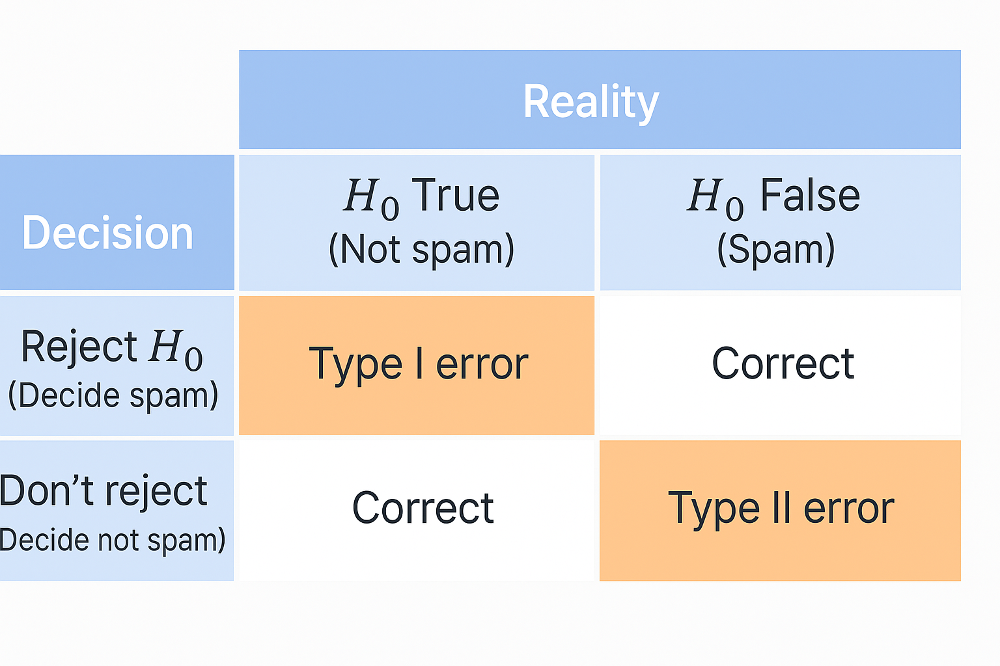

# Probability and Statistics for ML and DS(8)_Hypothesis Testing
---
## Hypothesis Testing: Making Data-Driven Decisions

> *Have You Ever Wondered How Your Spam Filter Works? Ever checked your email and noticed how most spam messages get filtered automatically? How does your email provider know which messages are genuine and which are trying to sell you something? This is where hypothesis testing comes into play—a powerful tool that helps us make decisions based on evidence.*

### Hypothesis Objects: Decision-Making Frameworks

In our object-oriented journey through statistics, we've explored probability distributions and how they help us understand randomness. Now, we'll see how to use these concepts to make decisions with confidence.

Hypothesis testing can be viewed as creating a decision-making framework with two competing hypothesis objects:

```
HypothesisTest {
    nullHypothesis: Hypothesis,      // The default assumption
    alternativeHypothesis: Hypothesis,  // What we're trying to prove
    evidenceThreshold: Number,        // How much evidence we need
    
    evaluateEvidence(data): Decision  // Method to reach a conclusion
}
```

Each hypothesis represents a possible state of reality, and our job is using data to choose between them.

### The Null and Alternative Hypotheses: Two Competing Objects

Let's define our two main hypothesis objects:

1. **Null Hypothesis $H_0$**: The default assumption or status quo. It's what we assume to be true until proven otherwise.

2. **Alternative Hypothesis $H_1$**: The competing claim we're investigating—often what we're actually interested in proving.

These two hypotheses have key properties:
- They must be mutually exclusive (they can't both be true)
- They must be exhaustive (one must be true)
- They must be testable with data

### The Email Spam Filter: Hypothesis Testing in Action

Consider a spam filter deciding whether an email is legitimate (ham) or unwanted (spam):

```
EmailClassifier {
    nullHypothesis: "Email is ham (legitimate)",
    alternativeHypothesis: "Email is spam (unwanted)",
    
    classifyEmail(emailContent): "Ham" or "Spam"
}
```

Notice something interesting here: the null hypothesis is that the email is legitimate (ham). Why? Because the consequences of incorrectly labeling a legitimate email as spam (losing important information) are usually worse than letting a spam email into your inbox.

### The Asymmetry in Hypothesis Decision-Making

Here's where hypothesis testing gets interesting—there's a fundamental asymmetry in how decisions are made:

1. If we gather sufficient evidence against $H_0$, we **reject it** and accept $H_1$
2. If we don't have enough evidence against $H_0$, we **fail to reject it**—**but this doesn't prove $H_0$ is true**

This asymmetry is similar to how our legal system works. A defendant is presumed innocent (null hypothesis) until proven guilty (alternative hypothesis) beyond reasonable doubt (evidence threshold).

Do you remember **the courtroom analogy**? Let's review it:

#### The Courtroom Analogy

Let's imagine a courtroom trial. In this trial, a person is prosecuted of committing a crime. Here's how the courtroom scenario relates to null hypothesis testing:  

- **Null Hypothesis, $H_0$**: In the courtroom, the default assumption is that the prosecuted person is innocent. This is like the null hypothesis in statistics, where we assume there's no effect or no difference between groups.

- **Alternative Hypothesis, $H_1$**: The prosecutor believes the prosecuted person is guilty and presents evidence to prove it. This is like the alternative hypothesis in statistics, where we believe there is an effect or a difference, and we try to provide evidence for it.

- **Evidence (Data)**: The prosecutor presents evidence to show that the prosecuted person is guilty. Similarly, in statistics, we collect data to test whether the null hypothesis should be rejected in favor of the alternative hypothesis.

- **The Judge/Jury (Statistical Test)**: The judge or jury evaluates the evidence. In null hypothesis testing, the statistical test evaluates the data to see if it's strong enough to reject the null hypothesis.

- **Decision (Reject or Fail to Reject)**: If the evidence is strong enough(=low P-value), the jury might decide the prosected person guilty. In statistics, this is like rejecting the null hypothesis and concluding there’s a significant effect or difference.

- If the evidence is not strong enough, the jury cannot convict, meaning the prosecuted person **remains** innocent. In statistics, this is like failing to reject the null hypothesis, meaning we don't have enough evidence to conclude there’s an effect or difference.

- **Important Note**: Just like in a courtroom, where a "not guilty" verdict doesn't necessarily mean the person is innocent (just that there wasn't enough evidence to prove guilt), **failing to reject the null hypothesis doesn't mean it's true. It just means there isn't enough evidence against it.**

- **Summary:**
  - The null hypothesis, $H_0$, is like assuming someone is innocent.
  - The alternative hypothesis, $H_1$, is like believing someone is guilty.
  - Evidence (data) is collected to test these assumptions.
  - The decision (reject or fail to reject) is based on whether the evidence is strong enough to change the assumption.

### Evidence Collection: The Heart of Hypothesis Testing

For our spam filter, evidence comes from examining the email's properties:
- Sender information
- Subject line content
- Email body text
- Presence of suspicious links
- Unusual formatting

When the email contains phrases like "earn extra cash," "risk free," "dear friend," or "act immediately," these serve as evidence against the null hypothesis, suggesting the email might be spam.

### Beyond Email: Hypothesis Testing Everywhere

This framework extends far beyond spam filtering:

**Medical Diagnosis:**
- H₀: Patient does not have the disease
- H₁: Patient has the disease
- Evidence: Test results, symptoms, medical history

**Quality Control:**
- H₀: The product batch meets quality standards 
- H₁: The product batch is defective
- Evidence: Sample testing results

**Financial Fraud Detection:**
- H₀: The transaction is legitimate
- H₁: The transaction is fraudulent
- Evidence: Transaction patterns, amount, location, timing

### Connecting to Our Previous Knowledge

Remember how we discussed probability distributions? They play a crucial role in hypothesis testing by helping us quantify the likelihood of our evidence under different hypotheses. When we calculate how likely or unlikely our observed data would be if the null hypothesis were true, we're using these distributions.

### The Hypothesis Testing Process

At its core, hypothesis testing follows these steps:

1. Define your null hypothesis, $H_0$, and alternative hypothesis, $H_1$
2. Collect data
3. Calculate how likely your data would be if $H_0$ were true
4. If this likelihood is below your threshold, reject $H_0$ in favor of $H_1$
5. Otherwise, fail to reject $H_0$

### Summary

Hypothesis testing is about making decisions under uncertainty, **not about proving absolute truth**. The null hypothesis is our default position, and **we only move away from it when the evidence is compelling enough.**

> **Remember: We assume the status quo until the data convinces us otherwise.**

---

## Type I and Type II Errors: The Cost of Being Wrong

### What Happens When Our Decision-Making System Makes a Mistake?

> ***Have you ever deleted an important email because your spam filter thought it was junk? Or perhaps found an obvious scam sitting in your inbox?***

These mistakes represent the two fundamental error types in hypothesis testing—and understanding them is crucial for making better decisions with data.

### The Error Object: Modeling Mistakes in Our Decision Framework

In our `HypothesisTest` object from before, we need to add an important property—the possibility of error:

```
HypothesisTest {
    nullHypothesis: Hypothesis,     // Default assumption
    alternativeHypothesis: Hypothesis, // What we're investigating
    evidenceThreshold: Number,      // Decision boundary
    
    possibleErrors: {
        typeI Error,    // Rejecting H₀ when it's true
        typeII Error    // Failing to reject H₀ when it's false
    },
    
    evaluateEvidence(data): Decision
}
```

Each error type represents a different kind of mistake our decision system can make.

### The Two Fundamental Errors: False Alarms and Missed Detections

Let's explore these two error types using our spam filter example:

1. **Type I Error (False Positive)**: Rejecting $H_0$ when it's actually true
   - In our spam example: Marking a legitimate email as spam
   - Also called a "false alarm"
   - Mathematical notation: P(Reject H₀ | H₀ is true)

2. **Type II Error (False Negative)**: Failing to reject H₀ when it's actually false
   - In our spam example: Letting a spam email into your inbox
   - Also called a "missed detection"
   - Mathematical notation: P(Fail to reject H₀ | H₀ is false)

### The Decision Matrix: Visualizing Errors

Looking at the decision matrix in the image:

- When reality is $H_0$ True (legitimate email) and we Reject $H_0$ (mark as spam), we make a **Type I error**
- When reality is $H_0$ False (spam email) and we Don't reject $H_0$ (mark as legitimate), we make a **Type II error**
- The other two combinations represent correct decisions
- Here is the image of the decision matrix table:



### Error Tradeoffs: You Can't Minimize Both

Here's the challenging part of hypothesis testing: there's an inherent tradeoff between **Type I and Type II errors**. It's like a seesaw—pushing down on one side raises the other.

If we make our spam filter extremely strict (low threshold for marking as spam):
- We'll catch almost all spam emails (low Type II error)
- But we'll also mark many legitimate emails as spam (high Type I error)

If we make our spam filter very lenient (high threshold for marking as spam):
- Almost all legitimate emails will reach the inbox (low Type I error)
- But many spam emails will also get through (high Type II error)

### Significance Level: Setting Our Error Tolerance

The maximum probability of making a Type I error that we're willing to accept is called the **significance level**, denoted by the Greek letter alpha $α$.

Common values include:
- $α = 0.05$ (5% chance of Type I error)
- $α = 0.01$ (1% chance of Type I error)

Setting $α$ is a critical design decision that balances the two types of errors for your specific application.

### Beyond Email: Error Types Across Domains

This error framework applies to countless decision scenarios:

**Medical Testing:**
- H₀: Patient doesn't have the disease
- Type I Error: Diagnosing a healthy person with the disease (false positive)
- Type II Error: Missing the disease in a sick patient (false negative)
- Which is worse? **It depends on the disease and treatment!**

**Criminal Justice:**
- $H_0$: Defendant is innocent
- Type I Error: Convicting an innocent person
- Type II Error: Letting a guilty person go free
- Our system is designed to minimize Type I errors ("innocent until proven guilty" - "무죄추정의 원칙")

**Quality Control:**
- $H_0$: Product batch meets standards
- Type I Error: Rejecting a good batch (wasting money)
- Type II Error: Accepting a defective batch (harming customers)
- The balance depends on the product and consequences of each error

### Object-Oriented Error Management Strategies

Error management involves implementing specific methods to control these error types:

1. **Sample Size Increase**: Larger samples generally reduce both error types
2. **Threshold Adjustment**: Moving the decision boundary to favor one error type over another
3. **Feature Engineering**: Finding better evidence to distinguish between hypotheses
4. **Cost Function Optimization**: Weighting errors according to their consequences

Remember our probability distributions? They help us calculate the likelihood of each error type. The area under the curve beyond our threshold represents our Type I error rate, while the overlap between distributions creates our Type II error rate.

This connects back to our concept of distributions as objects with methods to calculate probabilities—now we're using those probabilities to make decisions with quantified risks.

### The Practical Impact of Errors

In real systems, we often weight these errors based on their consequences:

- In email filtering: Missing a legitimate email (Type I) is usually worse than letting spam through (Type II)
- In cancer screening: Missing cancer (Type II) is usually worse than a false alarm (Type I)
- In fraud detection: The cost of investigating a legitimate transaction (Type I) versus the loss from fraud (Type II)

### Summary

Every time we make a decision based on limited data, we risk being wrong in one of two ways. **We can't eliminate both types of errors completely—reducing one typically increases the other**. The art of hypothesis testing is finding the right balance for your specific situation.

> **Remember: Every decision system must balance false alarms against missed detections—there is no perfect detector.**

---

## Right-Tailed, Left-Tailed, and Two-Tailed Tests: Directing Our Statistical Questions

> ***Have You Ever Wondered Which Direction to Look For Evidence?***

We were testing whether an email was spam or not—a simple either/or question. But what if our questions have **direction**? What if instead of asking "Has something changed?" we want to know "Has something increased?" or "Has something decreased?" This is where the concept of "tailed tests" comes into play—a powerful approach that shapes how we search for evidence.

### The HypothesisDirection Object: Giving Our Tests a Compass

In our object-oriented lens, we can think of hypothesis test direction as a specialized property that affects how our test behaves:

```
HypothesisTest {
    nullHypothesis: Hypothesis,
    alternativeHypothesis: Hypothesis,
    testDirection: "right-tailed" | "left-tailed" | "two-tailed",
    testStatistic: Function,   // What we measure in our sample
    observedValue: Number,     // Actual measurement from our sample
    
    evaluateEvidence(): Decision
}
```

The `testDirection` property fundamentally shapes how we interpret evidence and where we look for it.

### Height Example: Are Today's 18-Year-Olds Taller?

Let's explore a concrete example: historical data shows that **the mean height of 18-year-olds** in the US during the 1970s was 66.7 inches(=169.4 cm). You've collected data from ten 18-year-olds today and calculated their mean height as 68.442 inches(=173.9 cm).

The question is: Has the height of 18-year-olds increased since the 1970s?

Before diving into the test, let's consider an important prerequisite:

### Data Quality: The Foundation of Any Test

Like constructing a building, the quality of your materials determines the integrity of your structure. For hypothesis testing, your data must be:

1. **Representative** of the population (random sampling)
2. **Unbiased** (not systematically skewed)
3. **Sufficient** (generally 30+ samples is a good rule of thumb)

For our height example, we need to ensure we're not just measuring **basketball players** and that our sample size is adequate (our example with 10 samples is on the small side, but we'll proceed for illustration).

### Test Statistics: The Measuring Instrument

In our object-oriented lens, a test statistic is a method that extracts relevant information from our sample data about the parameter we're testing:

```
TestStatistic {
    calculateFrom(sample): Number,
    distribution: ProbabilityDistribution,
    criticalRegion(alpha): Region
}
```

For testing a population mean, we naturally use the sample mean, $\bar{x}$, as our test statistic. For other parameters, we would choose appropriate statistics:
- For proportions: sample proportion $\hat{p}$
- For variances: sample variance $s^2$
- For relationships: correlation coefficient $r$

### The Three Directions of Testing

Now, let's explore the three types of hypothesis tests, using our height example:

#### 1. Right-Tailed Test: Looking for Increases

**Question**: Has the mean height increased since the 1970s?

**Hypotheses**:
- $H_0$: $\mu = 66.7$ (mean height has not changed)
- $H_1$: $\mu > 66.7$ (mean height has increased)

Here, we reject $H_0$ if our sample mean is significantly larger than 66.7. We're looking for evidence in the "right tail" of the distribution.

**Potential Errors**:
- Type I: Concluding heights have increased when they haven't (True, but reject)
- Type II: Failing to detect a real increase in heights (False, but don't reject)

#### 2. Left-Tailed Test: Looking for Decreases

**Question**: Has the mean height decreased since the 1970s?

**Hypotheses**:
- $H_0$: $\mu = 66.7$ (mean height has not changed)
- $H_1$: $\mu < 66.7$ (mean height has decreased)

Here, we reject $H_0$ if our sample mean is significantly smaller than 66.7. We're looking for evidence in the "left tail" of the distribution.

**Potential Errors**:
- Type I: Concluding heights have decreased when they haven't (True, but reject)
- Type II: Failing to detect a real decrease in heights (False, but don't reject)

#### 3. Two-Tailed Test: Looking for Any Change

**Question**: Has the mean height changed (in either direction) since the 1970s?

**Hypotheses**:
- $H_0$: $\mu = 66.7$ (mean height has not changed)
- $H_1$: $\mu \neq 66.7$ (mean height has changed)

Here, we reject $H_0$ if our sample mean differs significantly from 66.7 in either direction. We're looking for evidence in both tails of the distribution.

**Potential Errors**:
- Type I: Concluding heights have changed when they haven't (True, but reject)
- Type II: Failing to detect a real change in heights (False, but don't reject)

### Visualizing Test Direction Using Object Inheritance

We can think of these three test types as subclasses of a general hypothesis test, each implementing specialized behavior:

```
HypothesisTest (abstract class)
  ↓
  ├── RightTailedTest
  │    rejectionRegion: "x̄ significantly > hypothesized value"
  │
  ├── LeftTailedTest
  │    rejectionRegion: "x̄ significantly < hypothesized value"
  │
  └── TwoTailedTest
       rejectionRegion: "x̄ significantly ≠ hypothesized value"
```

Each subclass inherits the basic testing framework but implements its own rejection criteria and error calculations.

### The Direction Determines Where We Look for Evidence

Think of hypothesis testing like searching for a lost item:
- In a right-tailed test, we're only looking to the right (increase)
- In a left-tailed test, we're only looking to the left (decrease)
- In a two-tailed test, we're looking in both directions (any change)

This directional focus affects how we calculate our critical regions and interpret our results.

### Beyond Height: Test Direction Across Domains

The concept of test direction applies across countless scenarios:

**Medical Research**:
- Right-tailed: Is the new drug more effective than the standard treatment?
- Left-tailed: Does the new treatment have fewer side effects?
- Two-tailed: Does the new treatment differ from the standard in effectiveness?

**Business**:
- Right-tailed: Has customer satisfaction increased after our service changes?
- Left-tailed: Has customer wait time decreased with our new system?
- Two-tailed: Has our rebranding changed customer perception?

**Environmental Science**:
- Right-tailed: Has the pollution level increased since new regulations?
- Left-tailed: Has the biodiversity decreased in the affected area?
- Two-tailed: Has the climate pattern changed in the region?

### Connection to Previous Concepts

This builds directly on our earlier discussions of hypothesis testing and errors. The test direction determines:

1. How we formulate our alternative hypothesis
2. Where we look for evidence in our probability distributions
3. How we calculate our p-values (which we'll explore next)
4. How we distribute our significance level $α$ across the distribution

Remember how we discussed probability distributions as objects with methods? Those same distribution objects help us determine the probability of observing our test statistic under the null hypothesis, which forms the foundation of our decision.

### Data-Driven Decision Making in Action

In our height example, our sample mean of 68.442 inches(=173.9 cm) is higher than the historical mean of 66.7 inches(=169.4 cm). But is this difference statistically significant or just random chance?

The answer depends on:
- The variation in our data (standard deviation)
- Our sample size (10 people)
- Our chosen significance level (typically 0.05)
- The direction of our test (right-tailed in this case)

In the next section, we'll learn exactly how to calculate this significance using **p-values**.

### Summary

When designing a hypothesis test, the direction matters just as much as the hypotheses themselves. Your choice of direction should be determined by the specific question you're trying to answer:

- Use a right-tailed test when looking for **increases**
- Use a left-tailed test when looking for **decreases**
- Use a two-tailed test when looking for **any change**

> **Remember: The direction of your hypothesis test determines where you look for evidence—right, left, or both sides.**

---

## p-Values: Measuring the Strength of Evidence

> ***Have You Ever Wondered How Scientists Know When Evidence Is "Strong Enough"?***

When researchers announce a new discovery, how do they decide their findings are significant? What's the threshold between "this could be random chance" and "this is a genuine effect"? The answer lies in a powerful concept called the **p-value**—a statistical tool that quantifies exactly how surprising our evidence is if nothing special is happening.

### The PValue Object: Quantifying Evidence Against the Null

In our object-oriented framework, we can conceptualize p-values as a property of our hypothesis test that measures evidence strength:

```
HypothesisTest {
    nullHypothesis: Hypothesis,
    alternativeHypothesis: Hypothesis,
    testDirection: "right-tailed" | "left-tailed" | "two-tailed",
    testStatistic: Function,
    observedValue: Number,
    significanceLevel: Number,  // Our α threshold
    
    calculatePValue(): Number,  // Method to compute evidence strength
    makeDecision(): Decision    // Uses p-value compared to α
}
```

The `calculatePValue()` method is the engine of modern hypothesis testing, translating our observed data into a probability that guides our decision.

### What Exactly Is a p-Value?

A p-value answers a very specific question:

> **Assuming the null hypothesis is true, what is the probability of observing a test statistic as extreme as or more extreme than what we actually observed?**

In essence, it measures **how surprising our data would be if nothing interesting were happening, if $H_0$ were true**.

### The Height Example Continued: Calculating p-Values

Let's return to our height example, where:
- Historical mean height (1970s): 66.7 inches(=169.4 cm)
- Standard deviation: 3 inches(=7.62 cm)
- Sample size: 10 people
- Our observed sample mean: 68.442 inches(=173.9 cm)

### Right-Tailed Test: Has Height Increased?

For a right-tailed test, $H_1$: $μ > 66.7$, the p-value is:  

$$
\text{p-value} = P(\bar{x} ≥ 68.442 | μ=66.7) = 0.0332
$$

This means if the true population mean were still 66.7 inches, we'd observe **a sample mean of 68.442 inches or higher** only **3.32%** of the time by random chance.

Since 0.0332 < 0.05=our significance level $α$, we reject $H_0$ and conclude that heights have increased.

### Two-Tailed Test: Has Height Changed?

For a two-tailed test, $H_1$: $μ \neq 66.7$, the p-value is:  

$$
\text{p-value} = P(|\bar{x} - 66.7| ≥ |68.442 - 66.7|) = 0.0663
$$

This means if the true population mean were still 66.7 inches, we'd observe a sample mean at least 1.742 inches away from 66.7 (in either direction) about 6.63% of the time.

Since 0.0663 > 0.05, we **fail to reject $H_0$** for the two-tailed test. We don't have sufficient evidence that heights have changed in either direction.

#### Left-Tailed Test: Has Height Decreased?

For a different sample with mean 64.252 inches, in a left-tailed test, $H_1$: $μ < 66.7$, the p-value is:  

$$
\text{p-value} = P(\bar{x} ≤ 64.252 | μ=66.7) = 0.0049
$$

This tiny p-value (less than 0.5%) tells us it would be extremely unlikely to observe such a low sample mean if the true mean were still 66.7 inches. We **reject $H_0$ and conclude heights have decreased**.

### The p-Value Object in Different Test Directions

The `calculatePValue()` method behaves differently depending on the test direction:

```
RightTailedTest.calculatePValue(): 
    return probabilityDistribution.probabilityGreaterThan(observedValue)

LeftTailedTest.calculatePValue():
    return probabilityDistribution.probabilityLessThan(observedValue)

TwoTailedTest.calculatePValue():
    deviation = Math.abs(observedValue - nullHypothesisValue)
    return probabilityDistribution.probabilityDeviationGreaterThan(deviation)
```

Each test direction implements the same interface but calculates the p-value in a direction-appropriate way.

### p-Values as Continuous Measures of Evidence

Unlike the binary decision (reject or don't reject), p-values provide a continuous measure of evidence strength:

- p < 0.001: Extremely strong evidence against $H_0$
- p < 0.01: Strong evidence against $H_0$
- p < 0.05: Substantial evidence against $H_0$
- p < 0.10: Weak evidence against $H_0$
- p > 0.10: Little to no evidence against $H_0$

This nuance helps scientists communicate not just whether a finding is significant, but how significant it is.

### The Standardized Approach: Z-Statistics

While we can calculate p-values directly from our sample mean, statisticians often convert to a standardized measure called the Z-statistic:  

$$
Z = \frac{\bar{x} - μ_0}{\frac{σ}{\sqrt{n}}}
$$

For our right-tailed test:  

$$
Z = \frac{68.442 - 66.7}{\frac{3}{\sqrt{10}}} = 1.837
$$

This transformation changes our distribution to the standard normal distribution (with mean 0 and standard deviation 1), making calculations more universal.

The p-value remains the same: 0.0332, because we're still measuring the same tail area, just on a standardized scale.

### p-Values Across Different Domains

The beauty of p-values is their consistent meaning across diverse applications:

**Medical Research**:
- "The p-value of 0.003 indicates the treatment group's improvement would be highly unlikely by chance alone."

**Quality Control**:
- "With a p-value of 0.08, the increased defect rate might be concerning but isn't yet statistically significant."

**Marketing**:
- "The A/B test yielded a p-value of 0.02, suggesting the new website design genuinely improves conversion rates."

### Common Misconceptions About p-Values

Despite their ubiquity, p-values are frequently misunderstood:

1. A p-value is **NOT** the probability that $H_0$ is true
2. A p-value is **NOT** the probability that your finding occurred by chance
3. A small p-value does **NOT** guarantee a practically important effect
4. A large p-value does **NOT** prove $H_0$ is true

### The Object-Oriented View of Statistical Decision Making

Bringing everything together, our hypothesis testing framework now has these key components:

```
StatisticalDecisionMaking {
    evidenceCollection: Function,  // Gathering data
    hypothesisFormulation: {       // Setting up testable claims
        null: Hypothesis,
        alternative: Hypothesis,
        direction: TestDirection
    },
    evidenceEvaluation: {          // Analyzing data
        testStatistic: Function,
        distribution: ProbabilityDistribution,
        pValueCalculation: Function
    },
    decisionRule: {                // Making decisions
        significanceLevel: Number,
        compare: Function          // p-value < α?
    }
}
```

Each piece inherits from broader statistical principles while implementing specific behaviors for the particular test we're conducting.

### Connecting Back to Distribution Objects

Now we can see probability distributions serve a crucial role in hypothesis testing:

1. They model the sampling distribution of our test statistic under $H_0$
2. They let us calculate exact p-values through their CDF methods
3. They connect our observed data to theoretical probability models

This connection illustrates how our object-oriented approach creates a unified framework across statistical concepts.

### Summary

The p-value quantifies the strength of evidence against the null hypothesis. It answers the question: "If nothing special were happening, how surprising would my data be?" The smaller the p-value, the stronger the evidence against $H_0$.

> **Remember: A p-value is the probability of seeing results at least as extreme as yours if the null hypothesis were true—it's how surprised you should be by your data if nothing interesting is happening.**

---

## Critical Values: Setting Decision Boundaries in Advance

> ***Have You Ever Wondered Where to Draw the Line? How do scientists decide exactly where to draw the line between "normal variation" and "significant finding"?*** 

While p-values tell us how surprising our specific observation is, we often want to know in advance: what's the threshold for calling something significant? This is where critical values come in—they're the statistical boundary lines that separate ordinary from extraordinary.

### The CriticalValue Object: Decision Boundaries in Statistical Space

In our object-oriented framework, we can conceptualize critical values as boundary objects that establish decision territories:

```
HypothesisTest {
    nullHypothesis: Hypothesis,
    alternativeHypothesis: Hypothesis,
    testDirection: "right-tailed" | "left-tailed" | "two-tailed",
    significanceLevel: Number,      // Our α threshold
    
    calculateCriticalValue(): Number,  // Finds the decision boundary
    decisionRule: Function            // Uses critical value for decisions
}
```

The `calculateCriticalValue()` method creates a threshold that we can establish *before* collecting any data, giving us a clear decision rule to follow once we have our observations.

### What Exactly Is a Critical Value?

A critical value is the threshold value of our test statistic that corresponds exactly to our significance level $α$. It answers the question:

> **What is the most extreme value we could observe that would still lead us to reject the null hypothesis?**

Critical values divide the sampling distribution into two regions:
- Rejection region: where we reject $H_0$
- Non-rejection region: where we fail to reject $H_0$

### Finding Critical Values for Our Height Example

Let's return to our height example:
- Historical mean height (1970s): 66.7 inches
- Standard deviation: 3 inches
- Sample size: 10 people
- Significance level (α): 0.05
- Test direction: right-tailed (Has height increased?)

### Right-Tailed Test Critical Value

For a right-tailed test with $α = 0.05$, the critical value, $k_{0.05}$, is the sample mean that leaves exactly 5% of the distribution to its right under $H_0$.

This corresponds to the $(1-α)$ quantile of the sampling distribution:  

$$
k_{0.05} = 66.7 + 1.645 × \frac{3}{\sqrt{10}} = 68.26 \text{inches}
$$

Our decision rule becomes:
- If $\text{observed mean} > 68.26$ inches → Reject $H_0$
- If $\text{observed mean} \leq 68.26$ inches → Fail to reject $H_0$

Since our observed mean was 68.442 inches (> 68.26), we reject $H_0$ and conclude heights have increased.

#### Understanding Critical Values Intuitively

Think of critical values as "decision boundaries" that help us distinguish between **random chance and real effects**:

1. **The Dividing Line Concept**: 
   - The critical value (68.26 inches) is like a boundary marker that says "anything beyond this point is too unusual to be just random chance"
   - Only 5% of sample means would randomly exceed this value if the null hypothesis were true

2. **Breaking Down the Formula**: 
   ```
   k₀.₀₅ = 66.7 + 1.645 × (3/√10) = 68.26 inches
   ```
   - 66.7: The null hypothesis value (historical mean height)
   - 1.645: The standardized z-score that cuts off the top 5% of a normal distribution
   - $\frac{3}{\sqrt{10}}$: The standard error - how much we expect sample means to naturally vary

3. **Decision Process**:
   - Imagine a spectrum where most random samples cluster around 66.7 inches
   - The critical value creates a clear dividing line at 68.26 inches
   - Our sample (68.442 inches) falls beyond this line, suggesting it's not just random variation

4. **The Power of Advance Planning**:
   - By setting this boundary **before seeing any data**, we create an objective decision rule
   - No matter what sample mean we observe, we have a clear, predetermined standard for significance

This approach transforms vague notions of "different enough" into precise statistical boundaries, allowing for objective, consistent decisions across different studies and researchers.

### Critical Values with Different Significance Levels

If we use a more stringent $α = 0.01$, our critical value becomes:  

$$
k_{0.01} = 66.7 + 2.326 × \frac{3}{\sqrt{10}} = 68.91 \text{inches}
$$

With this stricter threshold:
- If $\text{observed mean} > 68.91$ inches → Reject $H_0$
- If $\text{observed mean} \leq 68.91$ inches → Fail to reject $H_0$

Since our observed mean of 68.442 inches is less than 68.91, we fail to reject $H_0$ at the 0.01 significance level.

### Critical Values for Different Test Directions

Each test direction implements its own method for calculating critical values:

#### Right-Tailed Tests
```
RightTailedTest.calculateCriticalValue():
    return nullDistribution.quantile(1 - significanceLevel)
```
Decision rule: Reject $H_0$ if observed statistic > critical value

#### Left-Tailed Tests
```
LeftTailedTest.calculateCriticalValue():
    return nullDistribution.quantile(significanceLevel)
```
Decision rule: Reject $H_0$ if observed statistic < critical value

#### Two-Tailed Tests
```
TwoTailedTest.calculateCriticalValues():
    lowerCritical = nullDistribution.quantile(significanceLevel/2)
    upperCritical = nullDistribution.quantile(1 - significanceLevel/2)
    return [lowerCritical, upperCritical]
```
Decision rule: Reject $H_0$ if observed statistic < lowerCritical OR observed statistic > upperCritical

### The Critical Value Advantage: Planning Before Observing

One significant benefit of critical values is that they can be determined *before* collecting any data. This pre-established decision rule has several advantages:

1. It prevents the temptation to adjust your significance level after seeing results
2. It allows for precise planning of sample sizes needed for desired statistical power
3. It enables calculation of Type II error probabilities in advance
4. It creates a transparent decision framework that others can validate

### Critical Values in the Wild: Applications Across Domains

This boundary-setting approach appears in many fields:

**Medical Diagnostics**:
- Setting threshold values for blood tests to determine "normal" vs. "concerning"
- Establishing cutoff points for positive diagnoses

**Quality Control**:
- Determining acceptable limits for product measurements
- Setting rejection thresholds for manufacturing processes

**Environmental Monitoring**:
- Establishing regulatory thresholds for pollutant levels
- Creating alarm triggers for environmental sensors

### Object-Oriented Perspective: Critical Values as Boundary Objects

From an object-oriented perspective, critical values serve as boundary objects that divide the sampling distribution space:

```
SamplingDistribution {
    mean: Number,
    standardError: Number,
    distribution: ProbabilityDistribution,
    
    regions: {
        rejectionRegion: Region,
        nonRejectionRegion: Region
    },
    
    divideBySignificance(alpha): [Region, Region]
}
```

The critical value acts as **the boundary point** between these regions, creating a clean separation between outcomes.

### Critical Values vs. p-Values: Two Sides of the Same Coin

**Critical values and p-values** are complementary approaches to the same decision:

- **p-Value Approach**: Calculate how surprising our specific observation is, then compare to α
- **Critical Value Approach**: Determine the boundary for significance in advance, then see if our observation crosses it

These approaches will always lead to identical conclusions because they're based on the same mathematical foundation.

This connects directly to our discussions of:

1. **Probability Distributions**: Critical values are specific quantiles of sampling distributions
2. **Hypothesis Testing**: They create the decision boundaries for our tests
3. **Type I/II Errors**: They control our Type I error rate exactly at $α$
4. **p-Values**: They represent the observation that would yield a p-value exactly equal to $α$

### Practical Implementation: From Theory to Decision

In practice, finding a critical value requires:
1. Identifying the appropriate distribution under $H_0$
2. Determining the relevant quantile based on $α$ and test direction
3. Establishing a clear decision rule using this boundary

For our height example with the standard normal distribution:
- Right-tailed critical value: $z_{0.05} = 1.645$ (standard normal quantile)
- Translated to our sampling distribution: $66.7 + 1.645 × (3/√10) = 68.26$ inches

### Summary

Critical values set the decision boundaries for hypothesis tests, establishing in advance exactly where we'll draw the line between "reject" and "don't reject." They represent the threshold values of our test statistic that correspond precisely to our chosen significance level.

> **Remember: Critical values are the boundary lines between ordinary and extraordinary evidence—they tell us exactly how extreme our observation needs to be before we call it significant.**

---
