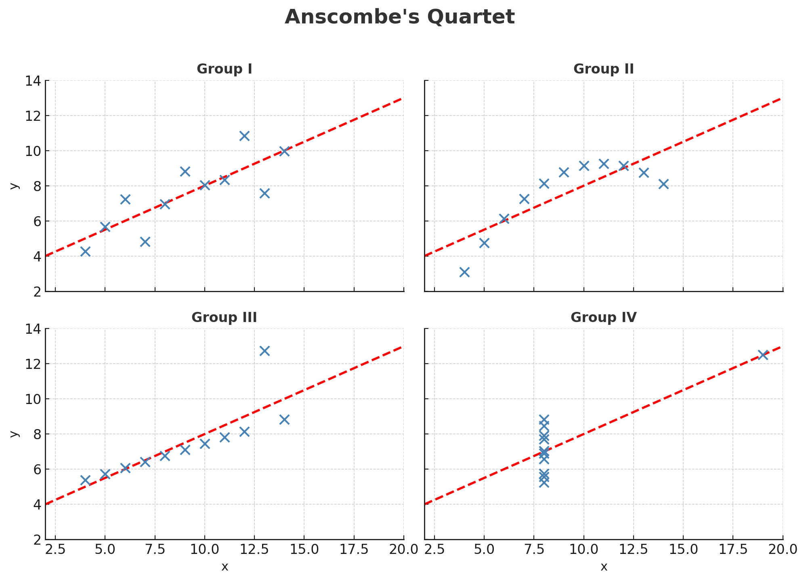
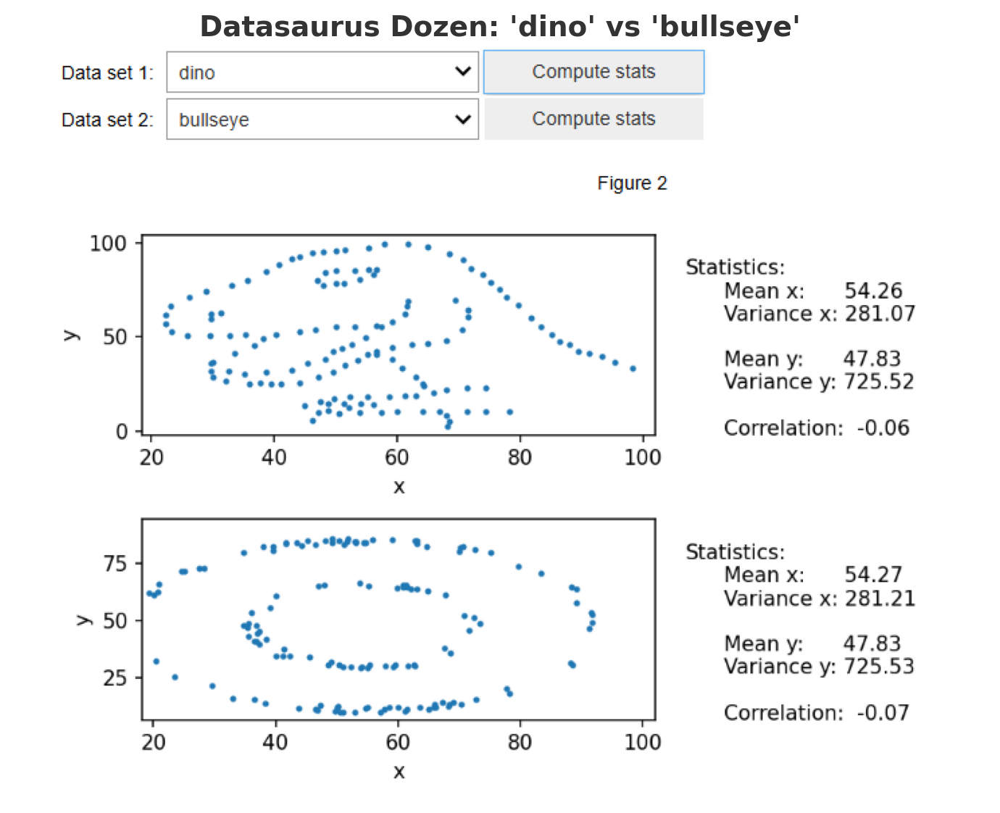

# When Statistics Lie: The Power of Visualization

> *Have you ever wondered if different datasets can tell the same statistical story but hide completely different realities? Let's explore this fascinating question through an object-oriented lens and discover why visualization is a crucial complement to statistical analysis.*

## Project Objective
In this project, we'll work with two famous datasets (Anscombe's quartet and the Datasaurus Dozen) to understand why summary statistics alone can be misleading when analyzing data.

## Required Libraries
Let's start by importing the necessary libraries:

```python
import numpy as np
import pandas as pd
import os
import matplotlib.pyplot as plt
import utils
%matplotlib widget
```

## Part 1: Anscombe's Quartet

This dataset was constructed by statistician **Francis Anscombe** to demonstrate both the importance of graphing data when analyzing it and the effect of outliers on statistical properties.

### Loading the Dataset

```python
# Read the dataset named 'df_anscombe.csv', which is stored in the same directory as this notebook
df_anscombe = pd.read_csv('df_anscombe.csv')

# Let's look at the first few rows of the data
df_anscombe.head()
```

This would display a table with columns for 'x', 'y', and 'group', showing the first five rows of data.

### Exploring the Number of Groups

```python
# Let's determine the number of groups present in this dataset
df_anscombe.group.nunique()
```

This dataset comprises four groups of data, each containing two variables - `x` and `y`.

### Analyzing Summary Statistics

Let's calculate the statistics for each group to see how similar they are:

```python
# Group the data by the 'group' column and calculate statistics
df_anscombe.groupby('group').describe()
```

This would display a comprehensive table showing that all four groups have remarkably similar statistics:
- Same mean for x (9.0) across all groups
- Same mean for y (approximately 7.5) across all groups
- Same standard deviation for x (approximately 3.32) across all groups
- Same standard deviation for y (approximately 2.03) across all groups

### Calculating Correlations

Let's check if the correlation between `x` and `y` is also similar across groups:

```python
df_anscombe.groupby('group').corr()
```

Remarkably, the correlation between `x` and `y` is also nearly identical (approximately 0.816) across all four groups!

From an object-oriented perspective, these four datasets appear to be instances of the same statistical class - they inherit the same statistical properties (mean, variance, correlation). However, we need to see if they implement these properties in the same way.

### Visualizing the Data

Now, let's plot these four groups to see if they really look the same:

```python
utils.plot_anscombes_quartet()
```

The visualization reveals something astonishing! Despite having nearly identical statistical properties, the four datasets look completely different:



1. **Group 1**: Shows a clear linear relationship between x and y
2. **Group 2**: Exhibits a non-linear (quadratic) relationship
3. **Group 3**: Shows a linear relationship with one extreme outlier
4. **Group 4**: Shows vertical alignment of points with one outlier

This demonstrates that while these four datasets are "instances" of the same "statistical class" (same mean, variance, correlation), they implement completely different visual patterns. From an object-oriented perspective, they share the same statistical interface but present entirely different visual interfaces.

## Part 2: Datasaurus Dozen Dataset

Taking this concept even further, let's explore the Datasaurus Dozen - a collection of datasets with radically different shapes but identical summary statistics.

### Loading the Dataset

```python
df_datasaurus = pd.read_csv("datasaurus.csv")
```

### Interactive Visualization

Now, let's use an interactive widget to compare different datasets from the Datasaurus Dozen:

```python
utils.display_widget()
```

This would display an interactive widget allowing you to select and compare different datasets, revealing shapes like:
- A dinosaur
- A star
- Circle patterns
- X-shaped patterns
- And many more...

For example, the 'dino' dataset, and the 'bullseye' dataset look like this:



All of these dramatically different shapes share nearly identical statistical properties!

### Understanding the Object-Oriented Implications

From an object-oriented perspective, this demonstrates a powerful concept: datasets are complex objects with multiple interfaces:

```
DatasetObject {
    // Statistical interface
    property mean: provides central tendency
    property variance: provides spread
    property correlation: provides relationship strength
    
    // Visual interface
    property shape: reveals actual pattern
    property clusters: reveals groupings
    property outliers: reveals anomalies
    
    // Methods
    method summarize(): returns statistical properties
    method visualize(): reveals actual structure
}
```

When we rely solely on summary statistics, we're only accessing **part of the dataset object's interface**. To fully understand the data, we need to use multiple object methods - both statistical and visual.

### Practical Implications

These examples teach us several important lessons:

1. **Stats Can Mask Reality**: Different data patterns can produce identical statistical properties
2. **Visualization Reveals Truth**: Plotting your data can reveal patterns that statistics hide
3. **Multiple Perspectives Matter**: Always approach data analysis from different angles
4. **Outliers Have Power**: A single outlier can significantly affect correlation and other statistics
5. **Object-Oriented Thinking**: View datasets as complex objects with multiple interfaces and methods

## Conclusion

The **Anscombe's Quartet** and **Datasaurus Dozen** demonstrate a fundamental principle in data science: statistics don't tell the whole story. Every dataset is a complex object that needs to be examined through multiple interfaces.

As statistician **John Tukey** once said, "The greatest value of a picture is when it forces us to notice what we never expected to see." This is why effective data scientists combine the analytical power of statistics with the perceptual power of visualization (Starting to feel like learning drawing, aren't you?😉)

To truly understand your data, you must both measure it AND see it!