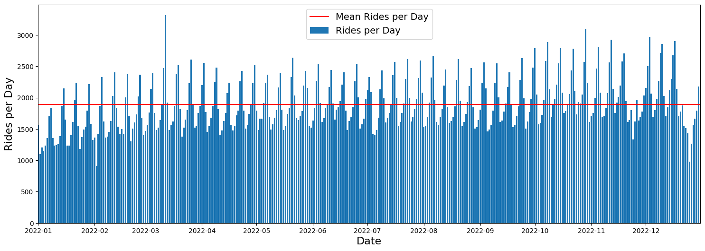
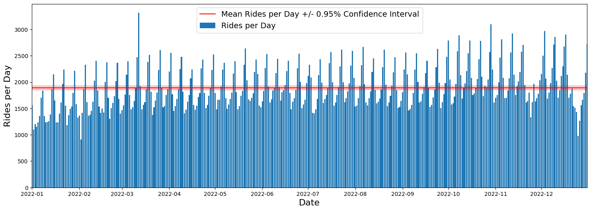
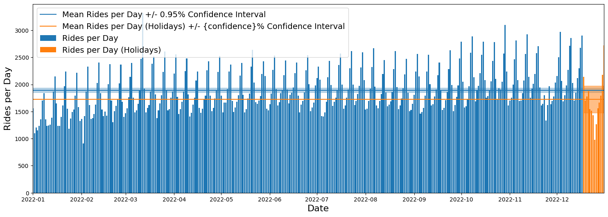
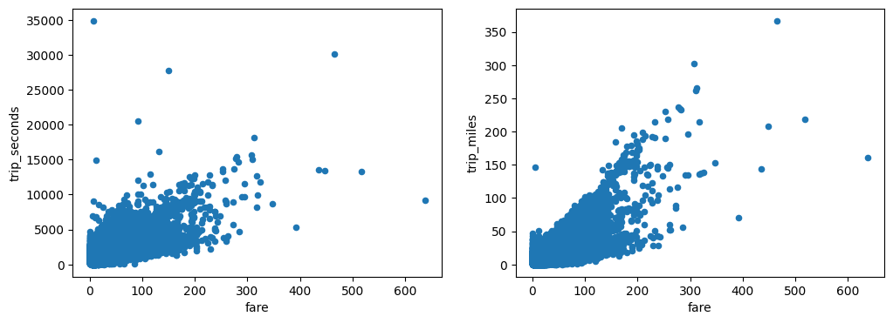
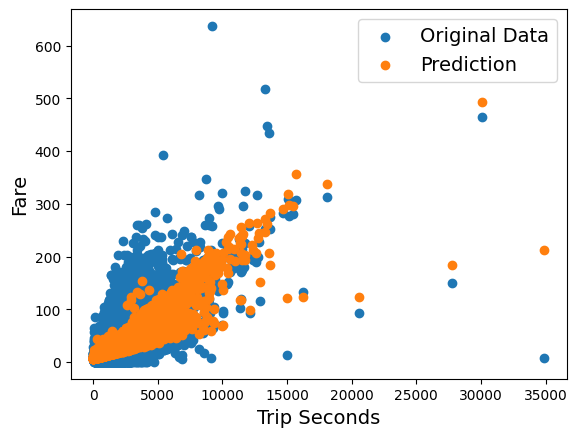

# Confidence Intervals and Hypothesis Testing(And Statistical Insights for Tesla's Robotaxi Service)

## How Certain Can We Be About Our Predictions?

> ***Have you ever wondered how rideshare companies like Uber or Lyft predict how many cars they'll need on a Friday night? Or how they determine their pricing?***

At the heart of these decisions are statistical tools that help them quantify uncertainty and make data-driven decisions. Today, we'll explore two powerful statistical concepts - confidence intervals and hypothesis testing - by analyzing real rideshare data from Chicago.

## What We'll Explore

When working with data in the real world, we're almost always dealing with samples rather than entire populations. This raises an important question: how confident can we be in our conclusions? In this project, we'll:

1. Analyze daily rideshare patterns throughout a year
2. Calculate confidence intervals to measure our certainty
3. Use hypothesis testing to determine if weekend rides significantly differ from weekday rides
4. Build a fare prediction model using linear regression

Let's approach these concepts as a detective might approach a mystery - with curiosity, systematic thinking, and **an object-oriented mindset!**

## Setting Up Our Investigation

First, we need to import the necessary libraries:

```python
import pandas as pd
import numpy as np
import matplotlib.pyplot as plt
import scipy
import statsmodels.formula.api as smf
```

Next, we'll load our dataset containing rideshare information from Chicago for the year 2022:

```python
# Open the dataset with dates properly parsed
df = pd.read_csv("data/rideshare_2022_cleaned.csv", parse_dates=['trip_start_timestamp', 'date'])
```

## Investigating Daily Ride Patterns

Let's start by examining how many rides occur each day throughout the year:

```python
# Calculate the daily number of rides
daily_rides = df.groupby('date').size().reset_index(name='daily_rides')

# Calculate the mean and standard deviation
mean_rides_per_day = daily_rides['daily_rides'].mean()
std_rides_per_day = daily_rides['daily_rides'].std()

print(f'Mean number of rides per day: {mean_rides_per_day:.2f}')
print(f'Standard deviation: {std_rides_per_day:.2f}')
```

When we run this code, we discover that the average number of rides per day is about 1893, with a standard deviation of around 404 rides.

Let's visualize this data to get a better understanding:

```python
plt.figure(figsize=(18,6))
plt.bar(daily_rides['date'], daily_rides['daily_rides'], label='Rides per Day')
plt.axhline(y=mean_rides_per_day, c='r', label=f'Mean Rides per Day')
plt.ylabel('Rides per Day', fontsize=16)
plt.xlabel('Date', fontsize=16)
plt.legend(fontsize=14)
plt.show()
```



Looking at this graph, we can see the daily fluctuations in ride numbers. 
**But a question arises**: how confident can we be that our calculated average of 1893 rides actually represents the true average for all rides in Chicago?

## Confidence Intervals: Quantifying Uncertainty

Think of a confidence interval as a range of values within which we believe the true population parameter lies, with a certain level of confidence. It's like a search area for finding the true value.

To calculate a 95% confidence interval for our mean number of rides:

```python
# Define the confidence level
confidence = 0.95

# Calculate the critical value using scipy
critical_value = scipy.stats.t.ppf(1 - (1 - confidence)/2, df=len(daily_rides)-1)

# Calculate the confidence interval
total_days = daily_rides['date'].count()
confidence_interval = critical_value * std_rides_per_day / np.sqrt(total_days)

print(f"With a {100 * confidence}% confidence you can say that your error will be no more than {confidence_interval:.4f} rides per day.")
```

This tells us that with 95% confidence, we can say the true mean number of daily rides is within about **±41.6 rides** of our calculated mean. Let's visualize this:

```python
plt.figure(figsize=(18,6))
plt.bar(daily_rides['date'], daily_rides['daily_rides'], label='Rides per Day')
plt.axhline(y=mean_rides_per_day, c='r', label=f'Mean Rides per Day +/- {confidence}% Confidence Interval')
plt.fill_between(daily_rides['date'], mean_rides_per_day-confidence_interval,
                 mean_rides_per_day+confidence_interval, color='r', alpha=0.2)
plt.ylabel('Rides per Day', fontsize=16)
plt.xlabel('Date', fontsize=16)
plt.legend(fontsize=14)
plt.show()
```



Notice how narrow our confidence interval is compared to the daily fluctuations. This might seem counterintuitive, but it makes sense when we consider it from an object-oriented perspective:

- The `DailyRideCount` objects have high variance (they fluctuate significantly)
- The `Mean` object, however, becomes more precise as we add more samples
- With 365 days of data, our estimation of the mean is much more precise than the individual daily values

## Comparing Holiday Season Rides

Looking at the data, we notice the number of rides drops during the holiday season. Let's investigate this by creating a separate analysis for the last two weeks of December:

```python
# Select the data only for holidays
daily_rides_holidays = daily_rides[daily_rides["date"] > "2022-12-17"]

# Compute sample mean and standard deviation for holidays
mean_rides_per_day_holidays = daily_rides_holidays['daily_rides'].mean()
std_rides_per_day_holidays = daily_rides_holidays['daily_rides'].std()

# Calculate the confidence interval
critical_value_holidays = scipy.stats.t.ppf(1 - (1 - confidence)/2, df=len(daily_rides_holidays)-1)
total_days_holidays = daily_rides_holidays['date'].count()
confidence_interval_holidays = critical_value_holidays * std_rides_per_day_holidays / np.sqrt(total_days_holidays)
```

When we compare these results, we see something fascinating:

```python
plt.figure(figsize=(18,6))
# Plot regular rides data
plt.bar(daily_rides['date'], daily_rides['daily_rides'], label='Rides per Day')
plt.axhline(y=mean_rides_per_day, color='C0', label=f'Mean Rides per Day +/- {confidence}% CI')
plt.fill_between(daily_rides['date'], mean_rides_per_day-confidence_interval,
                 mean_rides_per_day+confidence_interval, color='C0', alpha=0.3)

# Plot holiday season data
plt.bar(daily_rides_holidays['date'], daily_rides_holidays['daily_rides'], label='Rides per Day (Holidays)')
plt.axhline(y=mean_rides_per_day_holidays, color='C1', label='Mean Rides per Day (Holidays) +/- CI')
plt.fill_between(daily_rides_holidays['date'], mean_rides_per_day_holidays-confidence_interval_holidays,
                 mean_rides_per_day_holidays+confidence_interval_holidays, color='C1', alpha=0.5)

plt.ylabel('Rides per Day', fontsize=16)
plt.xlabel('Date', fontsize=16)
plt.legend(fontsize=14)
plt.show()
```



From an object-oriented perspective, this illustrates an important concept: 
- The `ConfidenceInterval` object for the holiday period is much wider than for the entire year
- This is because the `SampleSize` property of the holiday dataset (14 days) is much smaller than the full year (365 days)
- With fewer observations, our uncertainty increases (like having fewer puzzle pieces makes it harder to see the complete picture)

## Hypothesis Testing: Weekend vs. Weekday Rides

Looking at our data, we notice periodic peaks that occur every 7 days. This suggests there might be more rides on weekends. But how can we prove this statistically?

This is where hypothesis testing comes in. Think of it as a formal method to determine if an observed pattern is significant or just due to random chance.

Let's test whether there are significantly more rides on Fridays and Saturdays:

```python
# Create two samples
fridays_and_saturdays = daily_rides[daily_rides["weekday"].isin(["Friday", "Saturday"])]["daily_rides"]
other_days = daily_rides[daily_rides["weekday"].isin(["Monday", "Tuesday", "Wednesday", "Thursday", "Sunday"])]["daily_rides"]

# Perform a two-sample t-test
scipy.stats.ttest_ind(a=fridays_and_saturdays, b=other_days, alternative='greater')
```

The test returns a t-statistic of about 21.57 and a p-value that's extremely small, approximately **$2.66 × 10^{-67}$.** 

From an object-oriented perspective:
- The `HypothesisTest` object compares properties of two different groups (`WeekendRides` and `WeekdayRides`)
- The p-value property tells us the probability of observing our data if the null hypothesis were true
- In this case, the extremely low p-value indicates we can reject the null hypothesis
- We can confidently conclude that there are indeed more rides on Fridays and Saturdays

This kind of testing is similar to how weather forecasters might test if it rains more in spring than in summer, or how economists might test if one investment strategy outperforms another.

## Predicting Fares: Linear Regression

Finally, let's try to understand how ride fares are calculated based on trip duration and distance. First, we'll visualize the relationships:

```python
fig, ax = plt.subplots(1,2, figsize=(12,4))
df.plot.scatter('fare','trip_seconds', ax=ax[0])
df.plot.scatter('fare','trip_miles', ax=ax[1])
```



Now, let's build a linear regression model to predict fares:

```python
# Create and fit the model
model = smf.ols(formula='fare ~ trip_seconds + trip_miles', data=df)
result = model.fit()
```

From the model results, we can extract the pricing structure:

```python
starting_fare = result.params["Intercept"]
price_per_second = result.params["trip_seconds"]
price_per_mile = result.params["trip_miles"]

print(f"The starting fare is {starting_fare:.3} USD. In addition the ride costs {price_per_second*60:.3} USD per minute and {price_per_mile:.3} USD per mile.")
```

This gives us a pricing structure with a base fare of about \$6.46, plus \$0.34 per minute and \$0.87 per mile.

Let's visualize how well our model predicts fares:

```python
# Get the data and predictions
x_y = df[["trip_miles", "trip_seconds", "fare"]].dropna()
x_plot = x_y["trip_seconds"]
y_plot = x_y["fare"]
y_result = result.predict()

# Plot the data
plt.scatter(x_plot, y_plot, label="Original Data")
plt.scatter(x_plot, y_result, label="Prediction")
plt.xlabel("Trip Seconds", fontsize=14)
plt.ylabel("Fare", fontsize=14)
plt.legend(fontsize=14)
```



From an object-oriented perspective, our `LinearRegressionModel` is like a recipe that tells us how to combine ingredients (trip seconds and miles) to produce the expected fare.

## Real-World Applications

The techniques we've explored have countless applications:

1. **Business Strategy**: Rideshare companies use confidence intervals to predict demand and hypothesis testing to determine if new features actually improve user satisfaction.

2. **Medical Research**: Researchers use these methods to determine if a treatment is effective or if observed improvements are just due to chance.

3. **Quality Control**: Manufacturers analyze sample products to ensure the entire production meets quality standards.

4. **Marketing**: A/B testing (a form of hypothesis testing) helps determine which advertising campaign generates more clicks.

## Key Takeaways

1. **Confidence Intervals** help us quantify uncertainty about population parameters based on sample data. The larger our sample, the narrower our confidence interval becomes.

2. **Hypothesis Testing** provides a framework to determine if observed patterns are statistically significant or could be due to random chance.

3. **Linear Regression** allows us to model relationships between variables and make predictions.

> **Remember: small samples give wide confidence intervals (more uncertainty), while large samples give narrow intervals (more certainty). And when your p-value is tiny, your finding is likely not by chance!**

## Statistical Insights for Tesla's Robotaxi Service: An Object-Oriented Perspective

This project's statistical methodologies offer valuable insights for Tesla's Robotaxi service through an object-oriented lens:

### 1. Demand Forecasting with Confidence Intervals
- `DemandForecast` objects become more precise as their `DataPoints` property increases
- Each `GeographicZone` and `TimeWindow` inherits from the base `DemandPattern` class but implements unique demand behaviors
- The `ConfidenceInterval` property narrows with increased data collection, following the same pattern we observed in our ride analysis
- `HolidayPeriod` objects, as specialized instances, initially possess wider `UncertaintyRange` properties, requiring more conservative resource allocation

### 2. Pattern Analysis through Hypothesis Testing
- Our project revealed `WeekendDemand` and `WeekdayDemand` as distinct classes with statistically different behaviors.
- The `HypothesisTestFramework` provides methods for validating the influence of `EventObject`, `WeatherCondition`, and `TrafficSituation` instances on demand patterns
- `ABTestingMethod` objects allow Tesla to measure how `PricingStrategy`, `RoutingAlgorithm`, and `UserInterface` implementations affect key performance metrics

### 3. Price Optimization with Regression Analysis
- `PricingModel` objects implement polymorphic methods to calculate fares based on varying conditions
- Each model inherits base pricing behavior but overrides methods to implement `DynamicPricing` based on `SupplyDemandRatio`, `TrafficCongestion`, and `EnergyCost` properties
- `FareEstimator` objects transform trip properties into price predictions, similar to our regression model that determined base fare and per-mile/minute rates

### 4. Benefits of Large-Scale Data Collection
- `AutonomousVehicle` objects produce `DataPoint` instances with higher consistency than their `HumanDriver` parent class
- The `StatisticalPrecision` property improves as the `DataCollection` object accumulates more samples, reducing uncertainty
- `ModelOptimization` objects implement continuous improvement methods that leverage the expanding dataset

### 5. Conclusion

Through this object-oriented approach, Tesla can conceptualize their Robotaxi network as a system of interacting classes - each with specialized properties and methods. This framework allows for modeling complex behaviors like demand fluctuation, pricing optimization, and fleet distribution as relationships between well-defined objects with inheritance hierarchies, polymorphic implementations, and encapsulated functionality.

By recognizing that **"every darn thing in this universe is an object,"** Tesla can build an efficient Robotaxi service that adapts to changing conditions while maximizing both customer satisfaction and business performance.