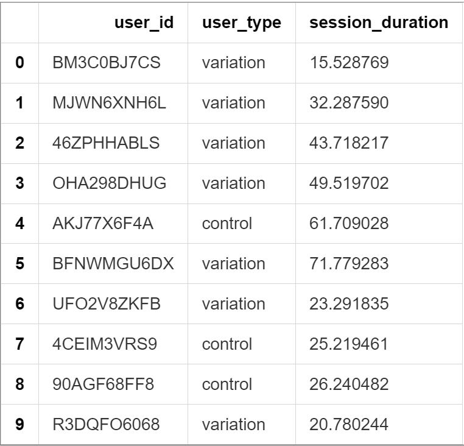

# AB Testing - Average Session Duration

> ***Have You Ever Wondered How Websites Know What Works Best? Have you ever visited a website and noticed that its design changed slightly from your last visit? Or perhaps you and a friend saw different versions of the same website at the same time?***

This isn't a coincidence—it's a powerful technique, **AB testing**. But how do companies determine which version of their website is truly better? And how can they be confident in their decisions when user behavior is so variable?

In this project, we'll explore AB testing through the lens of a website trying to increase user engagement. We'll discover how to make data-driven decisions when faced with uncertainty, using statistical tools to determine if changes actually make a difference or are just random noise.

## The Mystery of Website Engagement

Imagine you run a website that provides machine learning tutorials. You've read that changing your website's background color might increase the time users spend on your site. This change seems easy to implement, but before rolling it out to everyone, you want evidence that it actually works.

You decide to conduct an AB test where:
- Group A (control): Users see the original website design
- Group B (variation): Users see the website with the new background color

Your question: Does the new background color significantly increase average session duration?

## Object-Oriented Approach to AB Testing

When we approach AB testing, it helps to think in terms of objects with properties and behaviors:

- `Experiment` objects have properties like `control_group` and `variation_group`
- Each `Group` object contains a collection of `Session` objects
- Each `Session` object has properties like `duration`
- Our `HypothesisTesting` object will help us compare these groups

This object-oriented perspective makes the complex statistical concepts more intuitive by seeing them as relationships between well-defined objects.

## Setting Up Our Experiment

First, let's import the necessary tools:

```python
import math
import numpy as np
import pandas as pd
from scipy import stats
```

Now, let's load our experimental data and take a look:

```python
# Load the data from our AB test
data = pd.read_csv("background_color_experiment.csv")

# Preview the first few rows
data.head(10)
```



Our data has three columns:
- `user_id`: A unique identifier for each user
- `user_type`: Either "control" (original design) or "variation" (new background)
- `session_duration`: Time in minutes the user spent on the site

Let's separate our data into two groups for easier analysis:

```python
# Create separate groups for analysis
control_sd_data = data[data["user_type"]=="control"]["session_duration"]
variation_sd_data = data[data["user_type"]=="variation"]["session_duration"]

print(f"{len(control_sd_data)} users saw the original website with an average duration of {control_sd_data.mean():.2f} minutes\n")
print(f"{len(variation_sd_data)} users saw the new website with an average duration of {variation_sd_data.mean():.2f} minutes")
```

output:  

```
2069 users saw the original website with an average duration of 32.92 minutes

2117 users saw the new website with an average duration of 33.83 minutes
```

It looks like users who saw the new background color spent about 0.91 minutes more on the site on average. **But is this difference real, or just due to random chance?**

## The Detective's Framework: Hypothesis Testing

To answer this question, we need to become data detectives using a framework called hypothesis testing. This framework helps us determine if an observed difference is statistically significant or just random noise.

Through our object-oriented lens:
- We have a `NullHypothesis` object representing the idea that there's no real difference
- We have an `AlternativeHypothesis` object representing the idea that the new background increases session time
- We use evidence (our data) to decide which hypothesis is more likely

Mathematically, we write:
- Null hypothesis, $H₀$: $μ_v = μ_c$ (the means are equal, status quo)
- Alternative hypothesis, $H₁$: $μ_v > μ_c$ (variation mean is greater)

Where:
- $μ_c$ is the true average session duration for the control group
- $μ_v$ is the true average session duration for the variation group

## Step 1: Gathering Basic Statistics

First, let's create a function to calculate the key properties of each group:

```python
def get_stats(X):
    """
    Calculate basic statistics of a given data set.
    
    Parameters:
    X (numpy.array): Input data.
    
    Returns:
    tuple: A tuple containing:
        - n (int): Number of elements in the data set.
        - x (float): Mean of the data set.
        - s (float): Sample standard deviation of the data set.
    """
    
    # Get the group size
    n = len(X)
    # Get the group mean
    x = np.mean(X)
    # Get the group sample standard deviation
    s = np.std(X, ddof=1)
    
    return (n, x, s)
```

Let's apply this function to our groups:

```python
# Convert our pandas Series to numpy arrays
X_c = control_sd_data.to_numpy()
X_v = variation_sd_data.to_numpy()

# Get statistics for both groups
n_c, x_c, s_c = get_stats(X_c)
n_v, x_v, s_v = get_stats(X_v)

print(f"For control group:\n\tn_c = {n_c}, x_c = {x_c:.2f}, s_c = {s_c:.2f} ")
print(f"For variation group:\n\tn_v = {n_v}, x_v = {x_v:.2f}, s_v = {s_v:.2f} ")
```

This gives us:
```
For control group:
    n_c = 2069, x_c = 32.92, s_c = 17.54 
For variation group:
    n_v = 2117, x_v = 33.83, s_v = 18.24 
```

## Step 2: Calculating Degrees of Freedom

In statistics, when comparing two groups with different sizes and variations, we need to calculate "degrees of freedom" - a parameter that helps us account for these differences:

```python
def degrees_of_freedom(n_v, s_v, n_c, s_c):
    """Computes the degrees of freedom for two samples."""
    
    # Calculate intermediate values
    s_v_n_v = (s_v**2)/n_v
    s_c_n_c = (s_c**2)/n_c
    
    # Calculate numerator
    numerator = (s_v_n_v + s_c_n_c)**2
    
    # Calculate denominator
    denominator = (s_v_n_v**2)/(n_v-1) + (s_c_n_c**2)/(n_c-1)
    
    dof = numerator/denominator
    
    return dof
```

Let's calculate it:

```python
d = degrees_of_freedom(n_v, s_v, n_c, s_c)
print(f"The degrees of freedom for this test is: {d:.2f}")
```

This gives us about `4182.97` degrees of freedom, which is quite high due to our large sample sizes.

## Step 3: Computing the Test Statistic (t-value)

The t-value measures how many standard errors the difference between sample means is from zero:

```python
def t_value(n_v, x_v, s_v, n_c, x_c, s_c):
    """Computes the t-value for the two-sample t-test."""
    
    # Calculate intermediate values
    s_v_n_v = (s_v**2)/n_v
    s_c_n_c = (s_c**2)/n_c
    
    # Calculate numerator (difference between means)
    numerator = x_v - x_c
    
    # Calculate denominator (standard error of difference)
    denominator = np.sqrt(s_v_n_v + s_c_n_c)
    
    t = numerator/denominator
    
    return t
```

Let's calculate our t-value:

```python
t = t_value(n_v, x_v, s_v, n_c, x_c, s_c)
print(f"The t-value for this experiment is: {t:.2f}")
```

This gives us a t-value of `1.64`.

From an object-oriented perspective, the t-value is like a measurement of how far apart the two `Group` objects are, taking into account both their difference (`x_v - x_c`) and the uncertainty in this measurement (the denominator).

## Step 4: Computing the p-value

The p-value tells us the probability of observing our result (or something more extreme) if the null hypothesis were true:

```python
def p_value(d, t_value):
    """Computes the p-value for a right-tailed t-test."""
    
    # Create a t-distribution with d degrees of freedom
    t_d = stats.t(df=d)
    
    # Compute the p-value for a right-tailed test
    p = 1 - t_d.cdf(t_value)
    
    return p
```

Let's calculate our p-value:

```python
p = p_value(d, t)
print(f"The p-value for this experiment is: {p:.4f}")
```

This gives us a p-value of approximately `0.0505`.

## Step 5: Making a Decision

Now, based on our p-value, we can decide whether to reject the null hypothesis:

```python
def make_decision(X_v, X_c, alpha=0.05):
    """Makes a decision about the null hypothesis based on the data."""
    
    # Get statistics for both groups
    n_v, x_v, s_v = get_stats(X_v)
    n_c, x_c, s_c = get_stats(X_c)
    
    # Calculate degrees of freedom
    d = degrees_of_freedom(n_v, s_v, n_c, s_c)
    
    # Calculate t-value
    t = t_value(n_v, x_v, s_v, n_c, x_c, s_c)
    
    # Calculate p-value
    p = p_value(d, t)
    
    # Make decision based on p-value and significance level
    if p < alpha:
        return 'Reject H_0'
    else:
        return 'Do not reject H_0'
```

Let's test with different significance levels:

```python
alphas = [0.06, 0.05, 0.04, 0.01]
for alpha in alphas:
    print(f"For an alpha of {alpha} the decision is to: {make_decision(X_v, X_c, alpha=alpha)}")
```

This gives us:
```
For an alpha of 0.06 the decision is to: Reject H_0
For an alpha of 0.05 the decision is to: Do not reject H_0
For an alpha of 0.04 the decision is to: Do not reject H_0
For an alpha of 0.01 the decision is to: Do not reject H_0
```

Interestingly, our p-value (`0.0505`) is very close to the commonly used significance level of 0.05. With $α = 0.06$, we would reject the null hypothesis, but with $α = 0.05$, we would not.

## Understanding AB Testing Through Objects

Let's step back and think about what we've done from an object-oriented perspective:

1. We created two `Group` objects (control and variation) with session duration data
2. We measured properties of these groups (mean, standard deviation, size)
3. We created a `HypothesisTest` object with methods to:
   - Calculate the degrees of freedom
   - Compute the t-value
   - Determine the p-value
   - Make a decision based on a significance level

This approach helps us see statistical tests not as abstract formulas, but as processes for comparing properties of different objects.

## Ethical Considerations

When conducting AB tests, it's important to consider ethical implications:

- Is it fair to provide different experiences to different users?
- Could the variation negatively impact some users?
- How long should you run the test before making a decision?
- Should you inform users they're part of an experiment?

## Key Takeaways

- AB testing provides a scientific framework for making data-driven decisions
- The p-value represents the probability of observing your data (or something more extreme) if the null hypothesis were true
- The significance level, $α$, is the threshold you set for rejecting the null hypothesis
- Small p-values, less than $α$, suggest the observed difference is not due to random chance
- AB testing can be understood through object-oriented concepts, where we compare properties of different groups

When in doubt about whether an improvement is real or just random noise, remember this: collect enough data, test your hypothesis scientifically, and let the evidence guide your decisions!
