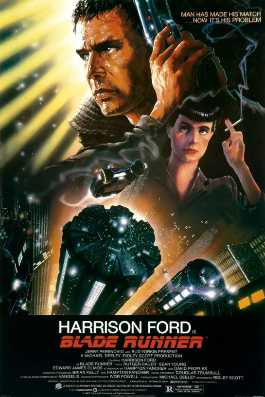

# Neural Networks and Deep Learning(1)_Introduction

---

## 1. Welcome to the World of Deep Learning

$$
\text{"I've seen things you people wouldn't believe...} \\
\text{Attack ships on fire off the shoulder of Orion...} \\
\text{I watched sea-beams glitter in the dark near the Tannhäuser Gate.} \\
\text{All those moments will be lost in time, like tears in rain...} \\
\text{Time to die." by the replicant, Roy Batty, as he's dying}
$$

### The New Power: How Deep Learning is Transforming Our World

> ***Have you ever wondered what would happen if computers could learn like humans do? What if they could see images, understand language, and make decisions without being explicitly programmed for each specific task? How would such technology transform our world?***

Welcome to the realm of **deep learning** – a revolutionary field that is already reshaping industries and creating possibilities that seemed like science fiction just a decade ago.

#### Deep Learning as a Transformative Object

To understand deep learning, let's think of it as a special type of transformative technology. Just as steam, electricity and the internet revolutionized the physical world, deep learning is now revolutionizing the cognitive world.

Electricity, when widely adopted about 100 years ago, fundamentally changed every major industry – from transportation and manufacturing to healthcare and communications. It wasn't just an improvement; it completely reimagined what was possible.

Today, deep learning has similar transformative potential. It inherits the revolutionary nature of steam, electricity and the internet but applies it to how machines perceive, decide, and act in the world. Where these technologies powered machines, deep learning powers intelligence itself.

#### Real-World Applications: Deep Learning in Action

Deep learning's transformative power is already evident across countless domains, with each application inheriting the same fundamental learning capabilities but implementing them in specialized ways:

**In healthcare**, deep learning models examine X-ray images with remarkable accuracy, often matching or exceeding skilled radiologists. These systems act as specialized diagnostic objects that inherit general pattern recognition abilities but apply them specifically to medical imagery.

**In education**, deep learning powers personalized learning systems that adapt to each student's needs. These systems inherit basic learning principles but implement specialized methods for tracking student progress and adjusting content difficulty.

**In agriculture**, deep learning helps farmers optimize crop yields by analyzing soil conditions, weather patterns, and plant health. These agricultural systems are specialized objects that detect plant diseases and predict harvests based on visual data.

**In transportation**, neural networks enable self-driving cars to interpret complex road scenes. These autonomous systems inherit basic visual processing capabilities but implement specialized methods for road navigation, obstacle avoidance, and traffic rule compliance.

What makes these applications possible is deep learning's unique ability to **recognize patterns** in vast amounts of data – patterns that might be too complex for humans to program explicitly or even recognize themselves.

#### The Architecture of Learning: Neural Networks

At the core of deep learning are **neural networks** – systems inspired by the human brain's structure. From an object-oriented perspective, these networks represent sophisticated hierarchical systems composed of simpler components.

A neural network consists of several interconnected layers: an input layer that receives raw data, one or more hidden layers that transform this information, and an output layer that produces predictions or decisions. This structure forms a natural object hierarchy, with each layer containing multiple neuron objects that perform simple calculations.

This layered architecture mimics how our own brains process information – starting with simple features and gradually building up to complex concepts. Early layers might detect basic patterns like edges or colors, middle layers might recognize shapes or textures, and deeper layers might identify complete objects or scenes.

#### Specialized Neural Networks: Inheritance in Action

The beauty of neural networks lies in how they implement inheritance principles. Different types of networks inherit the basic neural network structure but implement specialized behaviors for different tasks(Polymorphism):

**Convolutional Networks** specialize in processing visual data. They inherit the basic neural network properties but implement specialized methods for analyzing spatial relationships in images. These networks excel at tasks like image recognition, medical imaging analysis, and object detection.

**Recurrent Networks** are designed for sequential data. They inherit basic neural processing capabilities but add memory properties that allow them to remember previous inputs. This makes them particularly effective for tasks like language processing, speech recognition, and time-series analysis.

This polymorphism through inheritance allows neural networks to adapt to different problem domains while sharing fundamental learning principles.

#### The Learning Process: Methods of Neural Networks

Neural networks learn through a systematic process that adjusts their internal parameters, similar to how objects in object-oriented programming can modify their state:

First, the network processes input data through its layers, producing a prediction (the forward pass). Then it compares this prediction to the actual target value and calculates an error. Finally, it adjusts its internal connections to reduce this error in future predictions (the backward pass).

This process resembles how humans learn from experience – trying something, seeing how well it works, and adjusting our approach for better results. Each adjustment modifies the state of the neural network object, gradually improving its performance on the task.

#### AI Family Tree: The Inheritance Hierarchy

If we were to visualize the AI family as an inheritance hierarchy, deep learning would be situated within a clear lineage:

At the root is **Artificial Intelligence** – the broadest category encompassing all technologies that enable computers to simulate intelligent behavior. From this parent class, **Machine Learning** inherits the goal of creating intelligent systems but specifically implements the ability to learn from data without explicit programming. **Deep Learning**, in turn, inherits these learning capabilities but implements them using multi-layered neural networks, enabling more complex pattern recognition.

This hierarchy extends further, with specialized networks inheriting from the general deep learning approach – convolutional networks for vision tasks, recurrent networks for sequential data, and other specialized architectures for specific applications.

#### Your Learning Journey: A Structured Path

As you explore deep learning, you'll progress through increasingly specialized knowledge, with each topic building on previous understanding:

You'll start with **Basic Neural Networks**, learning their core architecture and how they learn. Next, you'll discover **Practical Techniques** for making networks perform well in real-world situations. From there, you'll explore **Project Organization** principles that help structure complex deep learning systems effectively. Then you'll dive into **Computer Vision** with specialized convolutional networks, and finally, you'll master **Sequential Data Processing** through recurrent networks and related architectures.

Each topic inherits concepts from previous ones while adding new specialized knowledge, creating a natural learning progression from fundamentals to advanced applications.

#### The Societal Impact: Building an AI-Powered World

The widespread adoption of deep learning will likely create an **"AI-powered society"** where intelligent systems augment human capabilities across virtually every domain.

Do you know "Blade Runner" movie? It's a compelling example of a dystopian AI-powered society😭. Our challenge is to create a more positive reality! 

Like electricity a century ago, deep learning is enabling new applications, industries, and ways of living that were previously unimaginable.

This transformation brings both opportunities and responsibilities. The decisions we make about how to apply these technologies will shape the world for generations to come.

### Summary

Deep learning represents a fundamental shift in computing – from explicit programming to learning from examples. By viewing deep learning through an object-oriented lens, we see how neural networks inherit common principles while specializing for specific tasks. 

> **Remember: The neural networks at the heart of deep learning are hierarchical systems that process information through layers, gradually transforming raw data into sophisticated outputs. This approach has already revolutionized industries and will continue to create new possibilities as we build an increasingly intelligent technological world.**
