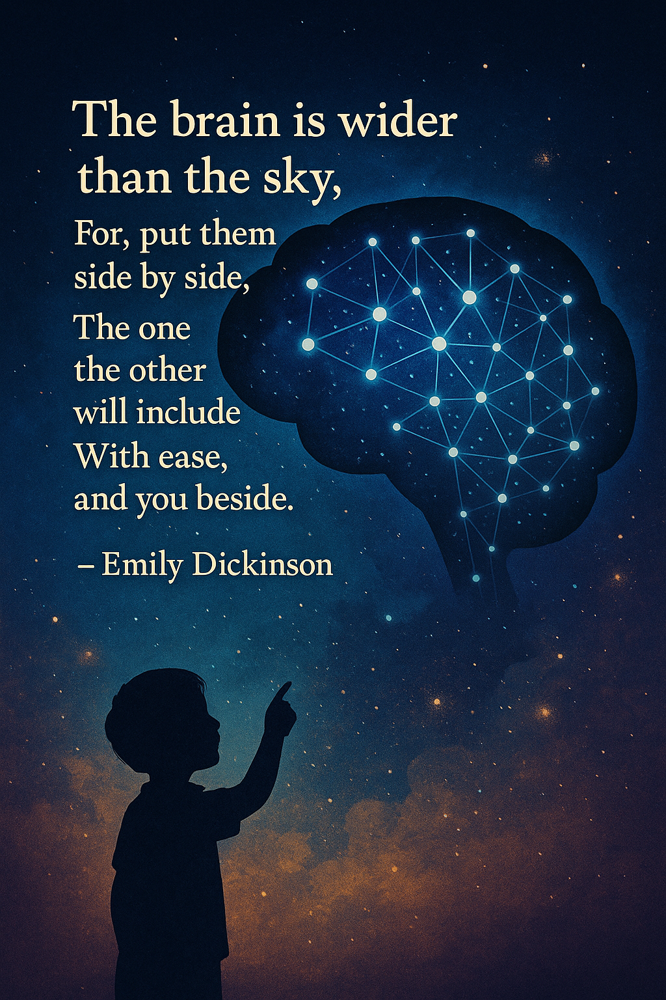

# Neural Networks and Deep Learning(1)_Introduction

---

## 1. Welcome to the World of Deep Learning

  

> ***"I've seen things you people wouldn't believe... Attack ships on fire off the shoulder of Orion... I watched sea-beams glitter in the dark near the Tannhäuser Gate. All those moments will be lost in time, like tears in rain... Time to die."***
>
> ***― The replicant, Roy Batty, as he's dying***

### The New Power: How Deep Learning is Transforming Our World

> ***Have you ever wondered what would happen if computers could learn like humans do? What if they could see images, understand language, and make decisions without being explicitly programmed for each specific task? How would such technology transform our world?***

Welcome to the realm of **deep learning** – a revolutionary field that is already reshaping industries and creating possibilities that seemed like science fiction just a decade ago.

#### Deep Learning as a Transformative Object

To understand deep learning, let's think of it as a special type of transformative technology. Just as steam, electricity and the internet revolutionized the physical world, deep learning is now revolutionizing the cognitive world.

Electricity, when widely adopted about 100 years ago, fundamentally changed every major industry – from transportation and manufacturing to healthcare and communications. It wasn't just an improvement; it completely reimagined what was possible.

Today, deep learning has similar transformative potential. It inherits the revolutionary nature of steam, electricity and the internet but applies it to how machines perceive, decide, and act in the world. Where these technologies powered machines, deep learning powers intelligence itself.

#### Real-World Applications: Deep Learning in Action

Deep learning's transformative power is already evident across countless domains, with each application inheriting the same fundamental learning capabilities but implementing them in specialized ways:

**In healthcare**, deep learning models examine X-ray images with remarkable accuracy, often matching or exceeding skilled radiologists. These systems act as specialized diagnostic objects that inherit general pattern recognition abilities but apply them specifically to medical imagery.

**In education**, deep learning powers personalized learning systems that adapt to each student's needs. These systems inherit basic learning principles but implement specialized methods for tracking student progress and adjusting content difficulty.

**In agriculture**, deep learning helps farmers optimize crop yields by analyzing soil conditions, weather patterns, and plant health. These agricultural systems are specialized objects that detect plant diseases and predict harvests based on visual data.

**In transportation**, neural networks enable self-driving cars to interpret complex road scenes. These autonomous systems inherit basic visual processing capabilities but implement specialized methods for road navigation, obstacle avoidance, and traffic rule compliance.

What makes these applications possible is deep learning's unique ability to **recognize patterns** in vast amounts of data – patterns that might be too complex for humans to program explicitly or even recognize themselves.

#### The Architecture of Learning: Neural Networks

At the core of deep learning are **neural networks** – systems inspired by the human brain's structure. From an object-oriented perspective, these networks represent sophisticated hierarchical systems composed of simpler components.

A neural network consists of several interconnected layers: an input layer that receives raw data, one or more hidden layers that transform this information, and an output layer that produces predictions or decisions. This structure forms a natural object hierarchy, with each layer containing multiple neuron objects that perform simple calculations.

This layered architecture mimics how our own brains process information – starting with simple features and gradually building up to complex concepts. Early layers might detect basic patterns like edges or colors, middle layers might recognize shapes or textures, and deeper layers might identify complete objects or scenes.

#### Specialized Neural Networks: Inheritance in Action

The beauty of neural networks lies in how they implement inheritance principles. Different types of networks inherit the basic neural network structure but implement specialized behaviors for different tasks(Polymorphism):

**Convolutional Networks** specialize in processing visual data. They inherit the basic neural network properties but implement specialized methods for analyzing spatial relationships in images. These networks excel at tasks like image recognition, medical imaging analysis, and object detection.

**Recurrent Networks** are designed for sequential data. They inherit basic neural processing capabilities but add memory properties that allow them to remember previous inputs. This makes them particularly effective for tasks like language processing, speech recognition, and time-series analysis.

This polymorphism through inheritance allows neural networks to adapt to different problem domains while sharing fundamental learning principles.

#### The Learning Process: Methods of Neural Networks

Neural networks learn through a systematic process that adjusts their internal parameters, similar to how objects in object-oriented programming can modify their state:

First, the network processes input data through its layers, producing a prediction (the forward pass). Then it compares this prediction to the actual target value and calculates an error. Finally, it adjusts its internal connections to reduce this error in future predictions (the backward pass).

This process resembles how humans learn from experience – trying something, seeing how well it works, and adjusting our approach for better results. Each adjustment modifies the state of the neural network object, gradually improving its performance on the task.

#### AI Family Tree: The Inheritance Hierarchy

If we were to visualize the AI family as an inheritance hierarchy, deep learning would be situated within a clear lineage:

At the root is **Artificial Intelligence** – the broadest category encompassing all technologies that enable computers to simulate intelligent behavior. From this parent class, **Machine Learning** inherits the goal of creating intelligent systems but specifically implements the ability to learn from data without explicit programming. **Deep Learning**, in turn, inherits these learning capabilities but implements them using multi-layered neural networks, enabling more complex pattern recognition.

This hierarchy extends further, with specialized networks inheriting from the general deep learning approach – convolutional networks for vision tasks, recurrent networks for sequential data, and other specialized architectures for specific applications.

#### Your Learning Journey: A Structured Path

As you explore deep learning, you'll progress through increasingly specialized knowledge, with each topic building on previous understanding:

You'll start with **Basic Neural Networks**, learning their core architecture and how they learn. Next, you'll discover **Practical Techniques** for making networks perform well in real-world situations. From there, you'll explore **Project Organization** principles that help structure complex deep learning systems effectively. Then you'll dive into **Computer Vision** with specialized convolutional networks, and finally, you'll master **Sequential Data Processing** through recurrent networks and related architectures.

Each topic inherits concepts from previous ones while adding new specialized knowledge, creating a natural learning progression from fundamentals to advanced applications.

#### The Societal Impact: Building an AI-Powered World

The widespread adoption of deep learning will likely create an **"AI-powered society"** where intelligent systems augment human capabilities across virtually every domain.

Do you know "Blade Runner" movie? It's a compelling example of a dystopian AI-powered society😭. Our challenge is to create a more positive reality! 


Like electricity a century ago, deep learning is enabling new applications, industries, and ways of living that were previously unimaginable.

This transformation brings both opportunities and responsibilities. The decisions we make about how to apply these technologies will shape the world for generations to come.

### Summary

Deep learning represents a fundamental shift in computing – from explicit programming to learning from examples. By viewing deep learning through an object-oriented lens, we see how neural networks inherit common principles while specializing for specific tasks. 

> **Remember: The neural networks at the heart of deep learning are hierarchical systems that process information through layers, gradually transforming raw data into sophisticated outputs. This approach has already revolutionized industries and will continue to create new possibilities as we build an increasingly intelligent technological world.**

---

## 2. What is a Neural Network?

  

> ***"The brain is wider than the sky, For, put them side by side, The one the other will include With ease, and you beside."***
> 
> ***― Emily Dickinson***

### From Simple Patterns to Complex Intelligence

> ***Have you ever watched a child learn to recognize animals?***

At first, they might call every four-legged creature a "dog." Then gradually, they learn to distinguish cats, horses, and cows by recognizing patterns of features. Neural networks learn in a remarkably similar way - starting with simple patterns and gradually building up to complex understanding. But what exactly is a neural network, and how does it actually work?

#### Neural Networks: Objects That Learn

Remember our earlier discussion about housing price prediction? We used linear regression to draw a straight line through data points of house sizes and prices. That was a simple mathematical model - an object with basic behavior. Neural networks take this concept much further, creating objects that can learn far more complex patterns.

Let's revisit that housing example, but with a neural network perspective.

#### A Single Neuron: The Fundamental Object

Imagine you have data on house sizes and their prices. With linear regression, you'd fit a straight line. But house prices can't be negative, right? So instead of continuing that straight line into negative territory for very small houses, we might want our prediction to "bend" and flatten at zero for tiny houses.

This simple bending behavior - predicting zero for very small sizes and then following a linear trend for larger houses - is exactly what a single neuron in a neural network can do. It inherits the basic concept of a prediction function but implements it with a special twist. Yes, this is a kind of **polymorphism**.

The function that creates this behavior is called a **ReLU (Rectified Linear Unit)**, which simply means it takes the maximum of zero or the input value. If we describe this as an object:

A **Neuron** object has:
- Properties: Input connections, weight for each connection, bias value
- Methods: 
  - Calculate weighted sum: multiply inputs by weights and add bias
  - Apply activation: take maximum of zero or the weighted sum
  - Output result: send the activated value forward

This single neuron is essentially the smallest possible neural network - a building block that inherits from basic mathematical functions but implements a slightly non-linear behavior.

#### Building Complexity Through Composition

Neural networks gain their power through composition - combining multiple neurons into layers, and multiple layers into networks. This is similar to how complex objects in the real world are composed of simpler objects.

Let's expand our housing price example. Rather than just using the size of a house, we might also consider:
- Number of bedrooms
- Zip code (postal code)
- Neighborhood wealth

Each of these features might influence different aspects of what makes a house valuable:
- Size and bedrooms might determine if the house fits a family's needs
- Zip code might indicate walkability of the neighborhood
- Zip code and wealth might correlate with school quality

In a neural network, we can create multiple neurons that each process these inputs differently. Some neurons might activate strongly for houses that are good for families, others for houses in walkable areas, and still others for houses near good schools.

#### Neural Networks: Hierarchical Object Systems

From an object-oriented perspective, neural networks represent a perfect example of hierarchical object systems:

1. **Neurons** are the fundamental objects, each performing a simple calculation
2. **Layers** are collections of neurons that process information at the same level
3. **Networks** are organized groups of layers that transform inputs into outputs

Each level inherits capabilities from the lower level but implements more complex behaviors through composition and connection.

#### Dense Connections: Full Information Flow

An important characteristic of most neural networks is that they are **densely connected** - meaning each neuron receives input from all neurons in the previous layer. This is different from our intuitive example where we suggested specific features might determine specific intermediate values.

In reality, neural networks work more like this:
- Every input feature connects to every neuron in the first hidden layer
- The network itself determines which connections matter through learning
- Intermediate neurons don't necessarily represent clear concepts like "family size" or "walkability"

This is a powerful property - the network can **discover(recognize) patterns and relationships** we might not have recognized ourselves!

#### Connecting to Our Previous Learning

If you recall our earlier discussions on supervised learning, regression and classification, neural networks are essentially a more powerful extension of those concepts. A neural network with no hidden layers (just input directly to output) would be equivalent to the linear regression and logistic regression models we studied earlier.

What makes neural networks special is their ability to learn intermediate representations - the hidden layers that transform raw inputs into increasingly useful features before making a final prediction.

Remember the housing price prediction graph we looked at in regression? That straight line fit was just the simplest case. Neural networks can learn far more complex relationships, creating curves and decision boundaries that capture subtle patterns in the data.

#### The Magic of Learning

The truly remarkable thing about neural networks is that **they learn all these transformations automatically**(This is why we call it "Artificial Intelligence"). You don't need to specify that certain combinations of features indicate "good for families" or "highly walkable" - the network recognizes these patterns itself, given enough examples of inputs and their corresponding outputs.

This **learning** process happens through the same gradient descent approach we discussed earlier, but applied across many more parameters - the weights and biases of all neurons in the network.

### Summary

Neural networks are hierarchical object systems composed of simple computing units called neurons. 

Each neuron inherits basic mathematical capabilities but implements non-linear transformations through activation functions like ReLU. 

When combined in layers and trained on examples, these networks can discover complex patterns and relationships in data, making them incredibly powerful for problems like our housing price prediction example. 

> **Remember: The power of neural networks lies not in complex individual components, but in the emergent behavior that arises from their connections and learning process. Like ants in a colony, neural networks achieve complexity through the collective behavior of simple components.**

---

## 3. Supervised Learning with Neural Networks


In our journey through machine learning, we've explored how algorithms like linear regression can predict house prices and how logistic regression can classify emails as spam or ham. Now, it's time to see how **neural networks** take these same supervised learning principles and amplify them to solve problems that seemed impossible just a decade ago.

### The Economic Engine: Where Neural Networks Create Value

Remember our exploration of supervised learning? We defined it as learning where we have **input features (x)** and **labeled outputs (y)**, with the goal of finding the mapping function between them. Neural networks excel at finding these complex mappings.

Let's look at the applications where neural networks are transforming industries:

| Input (x) | Output (y) | Application | Neural Network Type |
|-----------|------------|-------------|---------------------|
| Home features | Price | Real Estate | Standard NN |
| Ad and user info | Click prediction (0/1) | Online Advertising | Standard NN |
| Image | Object identity (1...1000) | Photo tagging | CNN |
| Audio | Text transcript | Speech recognition | RNN |
| English text | Korean text | Machine translation | RNN |
| Image + Radar data | Position of other cars | Autonomous driving | Custom/Hybrid |

Each of these applications follows our supervised learning framework, but with neural networks handling the heavy lifting of finding patterns in complex, high-dimensional data.

### The Neural Network Zoo: Different Architectures for Different Problems

Just as we wouldn't use a hammer to tighten a screw, different types of neural networks are designed for specific types of problems:

> **Standard Neural Networks**: Like the ones we glimpsed in our housing price example, these networks excel at processing tabular, structured data where the relationships between inputs and outputs don't depend on time or spatial arrangement.

> **Convolutional Neural Networks (CNNs)**: These specialized networks shine when dealing with images. They've revolutionized computer vision by automatically learning to detect edges, shapes, textures, and higher-level patterns in visual data.

> **Recurrent Neural Networks (RNNs)**: When data comes as a sequence—like words in a sentence or notes in a melody—RNNs process information with a sense of order and memory, making them ideal for language, speech, and time-series data.

For the most challenging problems like autonomous driving, engineers often create **hybrid architectures** that combine elements from different network types to process multiple data streams simultaneously.

### Structured vs. Unstructured Data: Breaking Down Barriers

Neural networks have dramatically changed what computers can achieve with data, particularly in the realm of **unstructured data**:

**Structured data** lives in neat tables with clearly defined features:
- Housing databases with **columns** for square footage, bedrooms, and price
- User profiles with age, location, and purchase history
- Financial records with transaction amounts, dates, and categories

**Unstructured data** lacks this organized format:
- Images (just pixels with color values)
- Audio recordings (just amplitude values over time)
- Text documents (just sequences of words)

Historically, computers excelled with structured data but struggled with unstructured data—the domain where human intelligence shines. The breakthrough of modern neural networks is their ability to process unstructured data at near-human levels of understanding.

This capability has unlocked applications that were previously in the realm of science fiction:
- Conversations with virtual assistants
- Real-time translation of spoken language
- Self-driving vehicles navigating complex environments
- Medical imaging systems detecting diseases from X-rays and MRIs

### The Object-Oriented View: Neural Networks as Composition

From an object-oriented perspective, neural networks represent a beautiful example of **composition and abstraction**. Each network is composed of layers, which are composed of neurons, which implement simple mathematical operations.

This composition creates powerful emergent behavior:

```
NeuralNetwork
  ├── Layer
  │     ├── Neuron
  │     │     ├── Weights
  │     │     ├── Bias
  │     │     └── ActivationFunction
  │     └── ... (more neurons)
  └── ... (more layers)
```

Through this structure, complex problems are broken down into simpler, manageable components—each neuron making a small contribution to the overall learning process.

### Building on Foundations: From Linear Models to Neural Networks

The neural networks we're exploring aren't completely new—they're extensions of concepts we've already covered:

- A single neuron with a linear activation is essentially performing **linear regression**
- A single neuron with a sigmoid activation is performing **logistic regression**
- What makes neural networks powerful is their ability to **combine many of these operations** in layers, allowing them to learn incredibly complex patterns

Remember our cost functions and gradient descent from previous chapters? These same principles power neural networks, just applied to more parameters across multiple layers.

### The Puzzle of Timing: Why Now?

An intriguing aspect of neural networks is that many of the core ideas have existed for decades. The perceptron, a precursor to modern neural networks, was invented in the 1950s. Many of the algorithms we use today were developed in the 1980s and 1990s.

So why are neural networks transforming our world now, rather than 30 years ago?

The answer lies in a perfect storm of three factors:
1. **Data**: The digital revolution has created unprecedented amounts of training data
2. **Computation**: GPU hardware has made complex neural networks practical to train
3. **Algorithms**: Key innovations in network design have overcome previous limitations

In our next exploration, we'll dive deeper into these enabling factors and understand how they've combined to unleash the neural network revolution.

---

## 4. The Perfect Storm: Why Deep Learning is Revolutionizing AI


> ***Have you ever wondered why deep learning has suddenly exploded in popularity? What changed in recent years that made these neural networks—based on decades-old ideas—suddenly become the driving force behind the AI revolution? Could understanding these forces help you identify where AI can transform your own world?***

Deep learning isn't new. Many of the fundamental concepts have been around since the 1980s. Yet something remarkable happened in the last decade that transformed these interesting academic concepts into the most powerful technological force of our generation. To understand this transformation, we need to look at the world through an object-oriented lens and see how three core elements—data, computation, and algorithms—created the perfect storm for deep learning's ascendance.

### The Scale Property: How Size Changes Everything

In object-oriented thinking, one of the most fascinating principles is how objects can transform completely when they reach certain scales. Think about water—at small scales, it behaves as individual molecules, but at larger scales, it develops entirely new properties like waves, currents, and tides.

Neural networks operate under a similar "scale property." When neural networks were small (limited parameters) and trained on small datasets, they performed similarly to traditional algorithms. But as both the networks and datasets grew larger, something magical happened—they began outperforming everything else, revealing their true potential.

Traditional learning algorithms like Support Vector Machines (SVMs) and logistic regression can be viewed as objects with a fundamental **scale limitation property**. Like a cup that can only hold so much water before overflowing, these algorithms can only improve so much with additional data before plateauing:

```
TraditionalAlgorithm {
    learnFromData(data) {
        if (data.size < THRESHOLD) {
            return improvePerformance(proportionalTo(data.size));
        } else {
            return PLATEAU_PERFORMANCE; // Cannot improve further
        }
    }
}
```

Neural networks, however, implement a different interface. They're more like expanding containers that continue to grow with more data:

```
NeuralNetwork {
    size: small | medium | large
    
    learnFromData(data) {
        return improvePerformance(proportionalTo(this.size * data.size));
        // Performance keeps improving with more data AND larger network
    }
}
```

### The Digital Transformation: Creating Data Objects at Scale

Why does this scale property matter now? Because our world has undergone a profound digital transformation. Virtually every human activity now creates digital footprints:

- Your morning commute generates location data
- Your shopping habits create transaction data
- Your social media usage produces interaction data
- Sensors and IoT devices constantly stream environmental data

This digitization has transformed our world into a massive data generator. Twenty years ago, obtaining a million labeled examples for a task was nearly impossible. Today, companies routinely work with billions of data points.

This transformation is similar to how the agricultural revolution created food surpluses that enabled civilization. The digital revolution has created data surpluses that enable advanced AI.

### The Three Drivers: An Object-Oriented View

Let's examine the three core drivers behind deep learning's rise, viewing each as an object with specific properties and behaviors that interact to create the deep learning ecosystem:

#### 1. DataEnvironment Object

Our digital environment now naturally produces vast amounts of labeled data. When we tag friends in photos, rate products, or click on search results, we're creating labeled data that neural networks can learn from.

Traditional algorithms evolved in a data-scarce environment, like desert plants adapted to conserve water. Neural networks are like rainforest species—seemingly wasteful with resources but extraordinarily efficient when those resources are abundant.

The key insight: **Neural networks' seemingly "wasteful" approach of using many parameters becomes an advantage in data-rich environments.**

#### 2. ComputationalPower Object

Moore's Law gave us faster CPUs, while specialized hardware like GPUs (Graphics Processing Units - ***NVIDIA***) provided massive parallel processing capabilities perfectly suited to neural network operations. 

Think of computation as the engine driving deep learning:
- Traditional algorithms: like efficient four-cylinder engines—good enough for most tasks
- Neural networks: like powerful jet engines—require more fuel (data and electricity) but can achieve far greater performance

The computational advancement particularly benefits deep learning because of how neural networks naturally parallelize across thousands of cores, something traditional algorithms often can't exploit.

#### 3. AlgorithmicInnovation Object

While scale has been crucial, algorithmic breakthroughs have also played a vital role. Consider the shift from sigmoid activation functions to ReLU (Rectified Linear Unit). This seemingly simple change transformed learning speed by addressing the "vanishing gradient" problem.

Imagine the sigmoid function as a narrow mountain pass—traffic (gradient information) moves slowly. The ReLU function creates a multi-lane highway, allowing information to flow much faster during training.

Other innovations like better initialization techniques, normalization methods, and optimization algorithms have continuously improved neural networks' ability to learn effectively.

### The Virtuous Cycle: How These Objects Interact

What's particularly powerful is how these three drivers form a virtuous cycle:

1. Faster computation → Quicker experiments → More algorithmic innovations
2. Better algorithms → More efficient use of data and computation
3. More data → Higher potential performance ceiling

This cycle creates an environment where progress accelerates over time rather than plateauing. When you can test an idea in minutes instead of months, innovation naturally accelerates.

### Real-World Applications Across Domains

This scale-driven advantage appears across numerous domains:

- **In healthcare**: Large neural networks can identify patterns in medical images that even experienced radiologists might miss
- **In transportation**: Self-driving vehicles use massive neural networks trained on millions of driving hours
- **In language**: Models like GPT learn from billions of text examples to generate human-like writing
- **In biology**: AlphaFold predicts protein structures by learning from vast biological datasets

In each case, the same pattern emerges—**the more data and computational resources available, the more advantages neural networks demonstrate over traditional approaches.**

### A Future Perspective: The Continuing Acceleration

Perhaps most exciting is that all three drivers continue to strengthen:

- Our digital footprint continues to grow exponentially
- Specialized AI hardware becomes more powerful and energy-efficient
- Algorithmic innovations continue at a breathtaking pace

This suggests we're still in the early phases of the deep learning revolution, with many breakthroughs still ahead.

### Summary: The Scale Law of Deep Learning

The remarkable rise of deep learning can be understood through a single principle: **Neural networks uniquely benefit from scale in ways traditional algorithms cannot.** When data and computational resources were limited, neural networks offered little advantage. 

> **Remember:In our data-rich, computationally powerful world, they reveal their true potential—and this advantage grows stronger every day.**