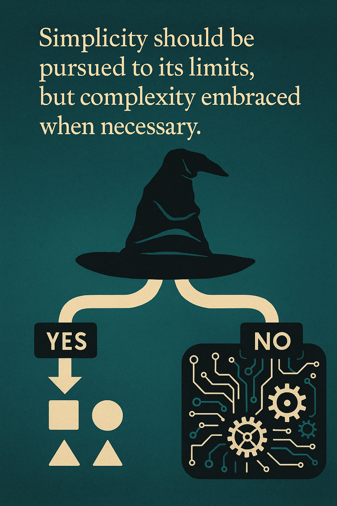
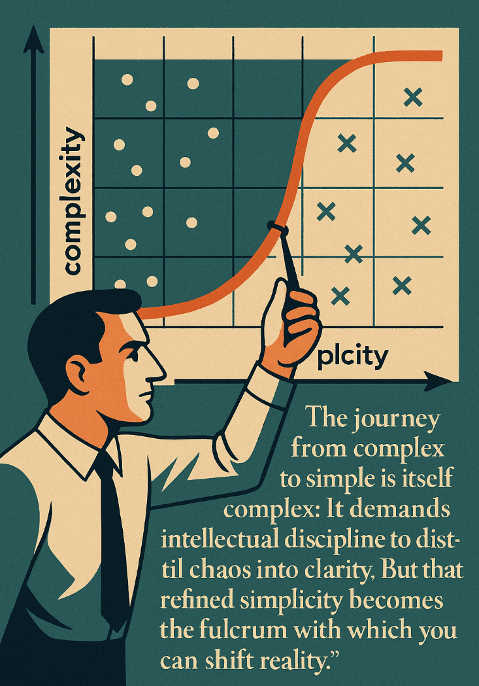
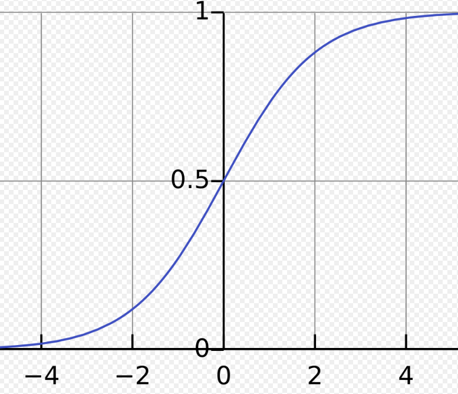

# Neural Networks and Deep Learning(2)_Logistic Regression as a Neural Network

---

## The Sorting Hat: Understanding Binary Classification



> ***Have you ever wondered how your phone recognizes whether your fingerprint matches yours?***

These everyday technological marvels all rely on a fundamental concept called binary classification—the digital world's version of a sorting hat.

Binary classification is the simplest form of classification in machine learning—a decision-making process that sorts data into one of two categories. It's like a fork in the road with only two possible paths: yes or no, 1 or 0, cat or not-cat. Though simple in concept, this powerful technique forms the foundation for many advanced AI systems, and understanding it will unlock your journey into neural networks.

### The Object-Oriented View of Binary Classification

In previous chapter, [Ch006. Hello! Machine Learning - 008. Supervised Learning(8) Classification with Logistic Regression](https://github.com/Atikers/Deep-Dive-into-Python-and-AI/blob/main/Ch%20006.%20Hello!%20Machine%20Learning/008.%20Supervised%20Learning(8)%20-%20Classification%20with%20Logistic%20Regression.md), we explored logistic regression as a powerful tool for classification. Now, let's reframe this through an object-oriented lens to see how it connects to neural networks. Binary classification can be viewed as a specialized object that implements a specific interface:

```
BinaryClassifier {
    predict(input) → {0 or 1}
    train(examples) → updates internal model
}
```

This means any binary classifier, including logistic regression and neural networks, must implement two core behaviors:
1. **Predicting** a binary outcome when given input data
2. **Learning** from examples to improve future predictions

Logistic regression, which we've previously studied, is one polymorphic implementation of this interface. Neural networks are another—more powerful—implementation of the same interface.

### Digital Images: Portraits in Numbers

To understand how binary classification works with images, let's peek behind the digital curtain to see how computers actually "see" images.

Imagine a photograph as a giant paint-by-numbers canvas. Instead of paintbrushes and palettes, computers use matrices of numbers to represent images. Each point on the canvas (a pixel) has three numerical values representing the intensity of red, green, and blue colors.

#### The RGB Color Object

Every color in a digital image can be represented as an object with three properties:
- Red intensity (0-255)
- Green intensity (0-255)
- Blue intensity (0-255)

A vibrant red pixel might be represented as `{red: 255, green: 0, blue: 0}`, while a deep purple could be `{red: 128, green: 0, blue: 128}`.

#### From Canvas to Numbers: How Images Become Data

For a 64×64 pixel image (tiny by today's standards), we have:
- 64×64 = 4,096 pixel locations
- 3 color channels per pixel (RGB)
- Total of 12,288 numbers to represent one image

In computing terms, this creates three 64×64 matrices—one each for red, green, and blue intensities. Think of these as three transparent layers that, when stacked, create the full-color image you recognize.

#### Vectorization: Flattening the Digital Canvas

To process this image, we must transform these structured matrices into a format our algorithms can **digest**. This is where **vectorization** comes in—a process you can visualize as "unrolling" the image.

Imagine you have three sheets of grid paper (one for each color), each filled with numbers. To vectorize them:

1. Start at the top-left corner of the red grid
2. Read each number from left to right, row by row
3. When you finish the red grid, continue to the green grid
4. After the green grid, move to the blue grid
5. By the end, you have one long list of 12,288 numbers

This long list becomes our feature vector **x**, with a dimension of $n_x = 12,288$. This transformation turns the structured image into raw numerical data that our classification algorithms can process.

### The Training Data Object: Building Your Digital Library

In machine learning, we never work with just one example—we need collections of labeled examples from which our algorithms can learn patterns. Let's organize these examples in an object-oriented way.

#### The TrainingExample Object

Each training example can be viewed as an object with two key properties:
- **x** - The input feature vector (our unrolled image)
- **y** - The output label (1 for "cat," 0 for "not-cat")

```
TrainingExample {
    x: Vector<float> (dimension nx)
    y: 0 or 1
}
```

#### The Dataset Collection

Your complete training dataset is a collection of these `TrainingExample` objects. If you have $m$ training examples, your collection looks like:

```
TrainingDataset {
    examples: Array<TrainingExample> (length m)
    size: m
    featureDimension: nx
}
```

### Notation: The Language of Neural Networks

Throughout this chapter, we'll use specific notation that might seem abstract at first, but actually helps organize our thinking in a structured way. Think of notation as the grammar of machine learning—mastering it will make everything else clearer.

#### Individual Examples

We represent a single training example as a pair: $(x, y)$
- $x \in \mathbb{R}^{n_x}$ - The input feature vector in n-dimensional space
- $y \in \{0, 1\}$ - The binary output label

#### The Complete Training Set

Our full training set consists of $m$ examples:  

$$
\{(x^{(1)}, y^{(1)}), (x^{(2)}, y^{(2)}), ..., (x^{(m)}, y^{(m)})\}
$$

The superscripts in parentheses, like $^{(1)}$, $^{(2)}$, ..., $^{(m)}$, indicate example numbers, not exponents. This is a crucial distinction in machine learning notation!

#### Matrix Representation: The Library Catalog

This is where our notation takes an interesting turn. Instead of working with individual examples separately, we organize them into matrices—similar to how a library organizes books in shelves rather than scattered individually.

We define matrix $X$ by stacking all input vectors as columns:  

$$
X = \begin{bmatrix} 
| & | & & | \\
x^{(1)} & x^{(2)} & \cdots & x^{(m)} \\
| & | & & | \\
\end{bmatrix} \in \mathbb{R}^{n_x \times m}, \quad X.shape = (n_x, m)
$$

This creates a matrix of shape $(n_x, m)$ where:
- Each column represents one complete example
- The height is $n_x$ (the dimension of each example)
- The width is $m$ (the number of examples)

Similarly, we create a matrix $Y$ for all the labels:  

$$
Y = [y^{(1)} y^{(2)} ... y^{(m)}]
$$

This creates a matrix of shape $(1, m)$ since each $y$ is a single binary value.

#### Why This Organization Matters

You might wonder: "Why arrange examples in columns rather than rows?"

This organizational choice offers tremendous advantages when implementing neural networks:

1. **Vectorized Operations**: It allows us to process entire datasets without explicit loops
2. **Efficient Computation**: Modern hardware can process columns more efficiently
3. **Clean Gradient Calculations**: Makes backpropagation math more elegant

Think of this as the difference between:
- Processing students one at a time through multiple stations (inefficient)
- Setting up stations where all students can be processed simultaneously (efficient)

### Making The Connection: Logistic Regression as a Proto-Neural Network

In earlier chapters, we explored logistic regression with a familiar formula:  

$$
\hat{y} = σ(w·x + b)
$$

Where:
- $σ$ is the sigmoid function: $σ(z) = 1/(1+e^{-z})$
- $w$ represents the weight vector
- $b$ is the bias term

This exact same formula can be reinterpreted as the simplest possible neural network—one with:
- An input layer (x)
- No hidden layer
- A single output unit using the sigmoid activation function

This reinterpretation is powerful because it allows us to see logistic regression not as a separate algorithm, but as a special case within the neural network family. As we add layers and units in future sections, we'll build upon this foundation to create increasingly powerful models.

### Real-World Perspective: Why Binary Classification Matters

Binary classification powers countless technologies that impact our daily lives:
- **Healthcare**: Is this cell malignant or benign?
- **Finance**: Is this transaction fraudulent or legitimate?
- **Security**: Is this person authorized or unauthorized?
- **Content Filtering**: Is this message appropriate or inappropriate?

In each case, we're making a single yes/no decision based on complex input data—exactly what binary classification excels at.

### Summary

Binary classification transforms the messy, continuous world into clear yes/no decisions. By representing inputs as feature vectors and organizing our training data into matrices, we lay the groundwork for building and training neural networks.

As we move forward, remember that neural networks—no matter how complex—build upon this fundamental framework. The powerful deep learning systems that recognize faces, translate languages, and even drive cars all stem from this basic ability to divide the world into two categories.

> ***Remember: "Binary classification may seem simple, but it's the building block from which the most sophisticated AI systems emerge—just as the 0s and 1s of binary code form the foundation of all digital technology."***

---

## The Decision Maker: Understanding Logistic Regression



> ***Have you ever been faced with a yes-or-no decision where you needed to consider multiple factors? Imagine trying to decide whether to carry an umbrella today. You don't just flip a coin—you look at the clouds, check the humidity, consider the forecast, and combine all these clues to make your decision. What if we could teach computers to make decisions the same way?***

In the previous section, we explored binary classification—the task of sorting inputs into one of two categories. Now, let's dive into logistic regression, a powerful algorithm that serves as both a standalone classification tool and the fundamental building block of neural networks.

### Logistic Regression: The Probability Estimator

Think of logistic regression as a special object that transforms a collection of clues (features) into a probability—specifically, the probability that something belongs to the "yes" category (class 1) rather than the "no" category (class 0).

```
LogisticRegression {
    parameters: {
        weights: Vector<float> (dimension nx)
        bias: float
    }
    
    predict(x) {
        z = weights·x + bias
        return sigmoid(z)  // Probability between 0 and 1
    }
}
```

At its core, logistic regression estimates $P(y=1|x)$—the probability that the correct answer is "yes" given the input features $x$. This probability is always between 0 and 1, making it perfect for binary decisions.

### Why Not Linear Regression for Classification?

In our exploration of regression in previous chapters, we used models that output any numeric value. But for classification, this approach breaks down. Let's see why through an analogy:

Imagine trying to answer the question "What percentage of the sky is covered by clouds?" Any percentage from 0% to 100% makes sense—this is a regression problem.

Now imagine trying to answer "Will it rain today?" with a percentage from 0% to 100%. If our model outputs 120% or -30%, how do we interpret that? These values don't make sense as probabilities!

This is exactly why we can't use a simple linear function:

```
ŷ = w·x + b  // ⚠️ Problem: This can output values outside [0,1]
```

This formula might give us values like 1.5 or -0.3, which cannot be interpreted as probabilities. **We need a function that always outputs values between 0 and 1, no matter what input it receives**.

### The Sigmoid Function: The Probability Transformer

This is where the sigmoid function comes to the rescue. Think of the sigmoid function as a special transformation that can take any real number (positive or negative, small or large) and squish it into a value **between 0 and 1**.

The sigmoid function is defined as:  

$$
\sigma(z) = \frac{1}{1 + e^{-z}}
$$

To understand this function intuitively, imagine a spring-loaded mechanism:

1. When $z$ is a large **positive** number, the sigmoid function pushes the output very close to 1
2. When $z$ is a large **negative** number, it pulls the output very close to 0
3. When $z$ is around 0, the output sits at 0.5



Look at how the sigmoid function behaves:
- As $z$ → $+∞$, $\sigma(z)$ → 1
- As $z$ → $-∞$, $\sigma(z)$ → 0
- When $z$ = 0, $\sigma(z)$ = 0.5

This S-shaped curve is perfect for classification because it naturally expresses the idea of a threshold. As evidence $z$ accumulates in favor of a positive classification, the probability smoothly increases toward 1. As evidence points toward a negative classification, the probability decreases toward 0.

### The Logistic Regression Model: Putting It All Together

To build a complete logistic regression model, we combine two steps:

1. **Linear Combination**: First, we compute a weighted sum of the input features plus a bias term:  

$$
z = w·x + b
$$
   
   This is similar to the linear regression formula we saw earlier, where:
   - $w$ is a vector of weights of dimension $n_x$
   - $x$ is our input feature vector also of dimension $n_x$
   - $b$ is a bias term (a single real number)
   - $·$ represents the **dot product**(Do you remember this from the previous chapter?😊) between vectors $w$ and $x$

2. **Probability Transformation**: Then, we pass this sum through the sigmoid function to get our final prediction:
   
   $$\hat{y} = \sigma(z) = \sigma(w·x + b)$$

This two-step process allows logistic regression to transform raw feature values into a probability estimate. It's like having a panel of experts (each feature) whose opinions are weighted differently (by w), combined (summed together), and then transformed into a final probability judgment (by the sigmoid).

### Object-Oriented Interpretation: Parameters as Properties

From an object-oriented perspective, a logistic regression model has two key properties:

1. **Weights (w)**: These determine how much each feature influences the prediction. A positive weight means that higher values of the corresponding feature increase the probability of a positive classification. A negative weight means the opposite—higher values of that feature decrease the probability.

2. **Bias (b)**: This acts like a threshold adjustment. A positive bias makes the model more likely to classify **inputs as positive**, while a negative bias makes the model **more conservative**, requiring stronger evidence to give a positive classification.

These parameters define the behavior of our logistic regression object, and training the model means finding the optimal values for these parameters.

### Real-World Analogy: The Weather Predictor

Let's make this concrete with a weather prediction example. Imagine you're trying to predict whether it will rain today $(y=1)$ or not $(y=0)$ based on three features:
- $x_1$: Humidity percentage (0-100%)
- $x_2$: Cloud cover percentage (0-100%)
- $x_3$: Barometric pressure (normalized to be between -1 and 1)

A trained logistic regression model might have:
- w = [0.05, 0.03, -2.0] (weights for each feature)
- b = -4.0 (bias term)

To make a prediction:

1. For a day with 80% humidity, 90% cloud cover, and -0.5 barometric pressure:  

$$
z = 0.05 \times 80 + 0.03 \times 90 + (-2.0) \times (-0.5) - 4.0 \\
z = 4.0 + 2.7 + 1.0 - 4.0 = 3.7
$$

2. Apply the sigmoid function:  

$$
\hat{y} = \sigma(3.7) \approx 0.98
$$

3. Interpretation: There's a 98% chance of rain today!

The weights tell us that decreasing barometric pressure (negative w₃) is the strongest indicator of rain, followed by humidity and cloud cover. The negative bias (-4.0) means that in the absence of other evidence, the default prediction is "no rain."

### Connecting to Neural Networks: The First Building Block

While logistic regression may seem simple, it actually represents the fundamental building block of neural networks. In fact, a single-layer neural network for binary classification is exactly equivalent to logistic regression!

```
SingleNeuron {
    weights: w
    bias: b
    activationFunction: sigmoid
    
    forwardPropagation(x) {
        z = weights·x + bias
        return sigmoid(z)
    }
}
```

As we move forward to multi-layer neural networks, you'll see how we stack multiple layers of these simple operations together. Each neuron in these networks will compute a weighted sum of its inputs and then apply an activation function—just like in logistic regression.

### A Note on Notation: Keeping Parameters Separate

In our book, we'll keep the weights $w$ and bias $b$ as separate parameters. Some other books combine them into a single parameter vector $\theta = [b, w_1, w_2, ..., w_{n_x}]$ by adding a constant feature $x_0 = 1$ to the input vector.

While mathematically equivalent, keeping $w$ and $b$ separate will make our neural network implementations cleaner and **more intuitive**. This separation also makes it easier to understand the distinct roles these parameters play in the model.

### Summary

Logistic regression serves as both a powerful standalone algorithm for binary classification and the foundational building block of neural networks. By applying the sigmoid function to a weighted sum of features, it transforms raw inputs into probability estimates.

The beauty of logistic regression lies in its simplicity and interpretability. With just a set of weights and a bias term, we can build a model that makes reasonable predictions for complex binary classification problems.

In the next section, we'll explore how to train these models by defining a cost function that measures how well our predictions match the true labels. But even as we build more complex neural networks, the core ideas of logistic regression will remain central to our understanding.

> ***Remember: "Logistic regression isn't just a stepping stone to neural networks—it's their atomic unit, the fundamental operation from which all deep learning emerges."***