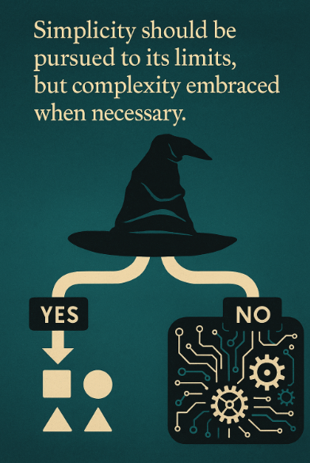

# Neural Networks and Deep Learning(2)_Logistic Regression as a Neural Network

---

## The Sorting Hat: Understanding Binary Classification



> ***Have you ever wondered how your phone recognizes whether your fingerprint matches yours?***

These everyday technological marvels all rely on a fundamental concept called binary classification—the digital world's version of a sorting hat.

Binary classification is the simplest form of classification in machine learning—a decision-making process that sorts data into one of two categories. It's like a fork in the road with only two possible paths: yes or no, 1 or 0, cat or not-cat. Though simple in concept, this powerful technique forms the foundation for many advanced AI systems, and understanding it will unlock your journey into neural networks.

### The Object-Oriented View of Binary Classification

In previous chapter, [Ch006. Hello! Machine Learning - 008. Supervised Learning(8) Classification with Logistic Regression](https://github.com/Atikers/Deep-Dive-into-Python-and-AI/blob/main/Ch%20006.%20Hello!%20Machine%20Learning/008.%20Supervised%20Learning(8)%20-%20Classification%20with%20Logistic%20Regression.md), we explored logistic regression as a powerful tool for classification. Now, let's reframe this through an object-oriented lens to see how it connects to neural networks. Binary classification can be viewed as a specialized object that implements a specific interface:

```
BinaryClassifier {
    predict(input) → {0 or 1}
    train(examples) → updates internal model
}
```

This means any binary classifier, including logistic regression and neural networks, must implement two core behaviors:
1. **Predicting** a binary outcome when given input data
2. **Learning** from examples to improve future predictions

Logistic regression, which we've previously studied, is one polymorphic implementation of this interface. Neural networks are another—more powerful—implementation of the same interface.

### Digital Images: Portraits in Numbers

To understand how binary classification works with images, let's peek behind the digital curtain to see how computers actually "see" images.

Imagine a photograph as a giant paint-by-numbers canvas. Instead of paintbrushes and palettes, computers use matrices of numbers to represent images. Each point on the canvas (a pixel) has three numerical values representing the intensity of red, green, and blue colors.

#### The RGB Color Object

Every color in a digital image can be represented as an object with three properties:
- Red intensity (0-255)
- Green intensity (0-255)
- Blue intensity (0-255)

A vibrant red pixel might be represented as `{red: 255, green: 0, blue: 0}`, while a deep purple could be `{red: 128, green: 0, blue: 128}`.

#### From Canvas to Numbers: How Images Become Data

For a 64×64 pixel image (tiny by today's standards), we have:
- 64×64 = 4,096 pixel locations
- 3 color channels per pixel (RGB)
- Total of 12,288 numbers to represent one image

In computing terms, this creates three 64×64 matrices—one each for red, green, and blue intensities. Think of these as three transparent layers that, when stacked, create the full-color image you recognize.

#### Vectorization: Flattening the Digital Canvas

To process this image, we must transform these structured matrices into a format our algorithms can **digest**. This is where **vectorization** comes in—a process you can visualize as "unrolling" the image.

Imagine you have three sheets of grid paper (one for each color), each filled with numbers. To vectorize them:

1. Start at the top-left corner of the red grid
2. Read each number from left to right, row by row
3. When you finish the red grid, continue to the green grid
4. After the green grid, move to the blue grid
5. By the end, you have one long list of 12,288 numbers

This long list becomes our feature vector **x**, with a dimension of $n_x = 12,288$. This transformation turns the structured image into raw numerical data that our classification algorithms can process.

### The Training Data Object: Building Your Digital Library

In machine learning, we never work with just one example—we need collections of labeled examples from which our algorithms can learn patterns. Let's organize these examples in an object-oriented way.

#### The TrainingExample Object

Each training example can be viewed as an object with two key properties:
- **x** - The input feature vector (our unrolled image)
- **y** - The output label (1 for "cat," 0 for "not-cat")

```
TrainingExample {
    x: Vector<float> (dimension nx)
    y: 0 or 1
}
```

#### The Dataset Collection

Your complete training dataset is a collection of these `TrainingExample` objects. If you have $m$ training examples, your collection looks like:

```
TrainingDataset {
    examples: Array<TrainingExample> (length m)
    size: m
    featureDimension: nx
}
```

### Notation: The Language of Neural Networks

Throughout this chapter, we'll use specific notation that might seem abstract at first, but actually helps organize our thinking in a structured way. Think of notation as the grammar of machine learning—mastering it will make everything else clearer.

#### Individual Examples

We represent a single training example as a pair: $(x, y)$
- $x \in \mathbb{R}^{n_x}$ - The input feature vector in n-dimensional space
- $y \in \{0, 1\}$ - The binary output label

#### The Complete Training Set

Our full training set consists of $m$ examples:  

$$
\{(x^{(1)}, y^{(1)}), (x^{(2)}, y^{(2)}), ..., (x^{(m)}, y^{(m)})\}
$$

The superscripts in parentheses, like $^{(1)}$, $^{(2)}$, ..., $^{(m)}$, indicate example numbers, not exponents. This is a crucial distinction in machine learning notation!

#### Matrix Representation: The Library Catalog

This is where our notation takes an interesting turn. Instead of working with individual examples separately, we organize them into matrices—similar to how a library organizes books in shelves rather than scattered individually.

We define matrix $X$ by stacking all input vectors as columns:  

$$
X = \begin{bmatrix} 
| & | & & | \\
x^{(1)} & x^{(2)} & \cdots & x^{(m)} \\
| & | & & | \\
\end{bmatrix} \in \mathbb{R}^{n_x \times m}, \quad X.shape = (n_x, m)
$$

This creates a matrix of shape $(n_x, m)$ where:
- Each column represents one complete example
- The height is $n_x$ (the dimension of each example)
- The width is $m$ (the number of examples)

Similarly, we create a matrix $Y$ for all the labels:  

$$
Y = [y^{(1)} y^{(2)} ... y^{(m)}]
$$

This creates a matrix of shape $(1, m)$ since each $y$ is a single binary value.

#### Why This Organization Matters

You might wonder: "Why arrange examples in columns rather than rows?"

This organizational choice offers tremendous advantages when implementing neural networks:

1. **Vectorized Operations**: It allows us to process entire datasets without explicit loops
2. **Efficient Computation**: Modern hardware can process columns more efficiently
3. **Clean Gradient Calculations**: Makes backpropagation math more elegant

Think of this as the difference between:
- Processing students one at a time through multiple stations (inefficient)
- Setting up stations where all students can be processed simultaneously (efficient)

### Making The Connection: Logistic Regression as a Proto-Neural Network

In earlier chapters, we explored logistic regression with a familiar formula:  

$$
\hat{y} = σ(w·x + b)
$$

Where:
- $σ$ is the sigmoid function: $σ(z) = 1/(1+e^{-z})$
- $w$ represents the weight vector
- $b$ is the bias term

This exact same formula can be reinterpreted as the simplest possible neural network—one with:
- An input layer (x)
- No hidden layer
- A single output unit using the sigmoid activation function

This reinterpretation is powerful because it allows us to see logistic regression not as a separate algorithm, but as a special case within the neural network family. As we add layers and units in future sections, we'll build upon this foundation to create increasingly powerful models.

### Real-World Perspective: Why Binary Classification Matters

Binary classification powers countless technologies that impact our daily lives:
- **Healthcare**: Is this cell malignant or benign?
- **Finance**: Is this transaction fraudulent or legitimate?
- **Security**: Is this person authorized or unauthorized?
- **Content Filtering**: Is this message appropriate or inappropriate?

In each case, we're making a single yes/no decision based on complex input data—exactly what binary classification excels at.

### Summary

Binary classification transforms the messy, continuous world into clear yes/no decisions. By representing inputs as feature vectors and organizing our training data into matrices, we lay the groundwork for building and training neural networks.

As we move forward, remember that neural networks—no matter how complex—build upon this fundamental framework. The powerful deep learning systems that recognize faces, translate languages, and even drive cars all stem from this basic ability to divide the world into two categories.

> ***Remember: "Binary classification may seem simple, but it's the building block from which the most sophisticated AI systems emerge—just as the 0s and 1s of binary code form the foundation of all digital technology."***

---

## The Decision Maker: Understanding Logistic Regression


> ***Have you ever been faced with a yes-or-no decision where you needed to consider multiple factors? Imagine trying to decide whether to carry an umbrella today. You don't just flip a coin—you look at the clouds, check the humidity, consider the forecast, and combine all these clues to make your decision. What if we could teach computers to make decisions the same way?***

In the previous section, we explored binary classification—the task of sorting inputs into one of two categories. Now, let's dive into logistic regression, a powerful algorithm that serves as both a standalone classification tool and the fundamental building block of neural networks.

### Logistic Regression: The Probability Estimator

Think of logistic regression as a special object that transforms a collection of clues (features) into a probability—specifically, the probability that something belongs to the "yes" category (class 1) rather than the "no" category (class 0).

```
LogisticRegression {
    parameters: {
        weights: Vector<float> (dimension nx)
        bias: float
    }
    
    predict(x) {
        z = weights·x + bias
        return sigmoid(z)  // Probability between 0 and 1
    }
}
```

At its core, logistic regression estimates $P(y=1|x)$—the probability that the correct answer is "yes" given the input features $x$. This probability is always between 0 and 1, making it perfect for binary decisions.

### Why Not Linear Regression for Classification?

In our exploration of regression in previous chapters, we used models that output any numeric value. But for classification, this approach breaks down. Let's see why through an analogy:

Imagine trying to answer the question "What percentage of the sky is covered by clouds?" Any percentage from 0% to 100% makes sense—this is a regression problem.

Now imagine trying to answer "Will it rain today?" with a percentage from 0% to 100%. If our model outputs 120% or -30%, how do we interpret that? These values don't make sense as probabilities!

This is exactly why we can't use a simple linear function:

```
ŷ = w·x + b  // ⚠️ Problem: This can output values outside [0,1]
```

This formula might give us values like 1.5 or -0.3, which cannot be interpreted as probabilities. **We need a function that always outputs values between 0 and 1, no matter what input it receives**.

### The Sigmoid Function: The Probability Transformer

This is where the sigmoid function comes to the rescue. Think of the sigmoid function as a special transformation that can take any real number (positive or negative, small or large) and squish it into a value **between 0 and 1**.

The sigmoid function is defined as:  

$$
\sigma(z) = \frac{1}{1 + e^{-z}}
$$

To understand this function intuitively, imagine a spring-loaded mechanism:

1. When $z$ is a large **positive** number, the sigmoid function pushes the output very close to 1
2. When $z$ is a large **negative** number, it pulls the output very close to 0
3. When $z$ is around 0, the output sits at 0.5

  

$$
[\text{Graph 1}: \text{Sigmoid}(z) = \frac{1}{1 + e^{-z}}]
$$

Look at how the sigmoid function behaves:
- As $z$ → $+∞$, $\sigma(z)$ → 1
- As $z$ → $-∞$, $\sigma(z)$ → 0
- When $z$ = 0, $\sigma(z)$ = 0.5

This S-shaped curve is perfect for classification because it naturally expresses the idea of a threshold. As evidence $z$ accumulates in favor of a positive classification, the probability smoothly increases toward 1. As evidence points toward a negative classification, the probability decreases toward 0.

### The Logistic Regression Model: Putting It All Together

To build a complete logistic regression model, we combine two steps:

1. **Linear Combination**: First, we compute a weighted sum of the input features plus a bias term:  

$$
z = w·x + b
$$
   
   This is similar to the linear regression formula we saw earlier, where:
   - $w$ is a vector of weights of dimension $n_x$
   - $x$ is our input feature vector also of dimension $n_x$
   - $b$ is a bias term (a single real number)
   - $·$ represents the **dot product**(Do you remember this from the previous chapter?😊) between vectors $w$ and $x$

2. **Probability Transformation**: Then, we pass this sum through the sigmoid function to get our final prediction:  

$$\hat{y} = \sigma(z) = \sigma(w·x + b)$$

This two-step process allows logistic regression to transform raw feature values into a probability estimate. It's like having a panel of experts (each feature) whose opinions are weighted differently (by w), combined (summed together), and then transformed into a final probability judgment (by the sigmoid).

### Object-Oriented Interpretation: Parameters as Properties

From an object-oriented perspective, a logistic regression model has two key properties:

1. **Weights (w)**: These determine how much each feature influences the prediction. A positive weight means that higher values of the corresponding feature increase the probability of a positive classification. A negative weight means the opposite—higher values of that feature decrease the probability.

2. **Bias (b)**: This acts like a threshold adjustment. A positive bias makes the model more likely to classify **inputs as positive**, while a negative bias makes the model **more conservative**, requiring stronger evidence to give a positive classification.

These parameters define the behavior of our logistic regression object, and training the model means finding the optimal values for these parameters.

### Real-World Analogy: The Weather Predictor

Let's make this concrete with a weather prediction example. Imagine you're trying to predict whether it will rain today $(y=1)$ or not $(y=0)$ based on three features:
- $x_1$: Humidity percentage (0-100%)
- $x_2$: Cloud cover percentage (0-100%)
- $x_3$: Barometric pressure (normalized to be between -1 and 1)

A trained logistic regression model might have:
- w = [0.05, 0.03, -2.0] (weights for each feature)
- b = -4.0 (bias term)

To make a prediction:

1. For a day with 80% humidity, 90% cloud cover, and -0.5 barometric pressure:  

$$
z = 0.05 \times 80 + 0.03 \times 90 + (-2.0) \times (-0.5) - 4.0 \\
z = 4.0 + 2.7 + 1.0 - 4.0 = 3.7
$$

2. Apply the sigmoid function:  

$$
\hat{y} = \sigma(3.7) \approx 0.98
$$

3. Interpretation: There's a 98% chance of rain today!

The weights tell us that decreasing barometric pressure (negative w₃) is the strongest indicator of rain, followed by humidity and cloud cover. The negative bias (-4.0) means that in the absence of other evidence, the default prediction is "no rain."

### Connecting to Neural Networks: The First Building Block

While logistic regression may seem simple, it actually represents the fundamental building block of neural networks. In fact, a single-layer neural network for binary classification is exactly equivalent to logistic regression!

```
SingleNeuron {
    weights: w
    bias: b
    activationFunction: sigmoid
    
    forwardPropagation(x) {
        z = weights·x + bias
        return sigmoid(z)
    }
}
```

As we move forward to multi-layer neural networks, you'll see how we stack multiple layers of these simple operations together. Each neuron in these networks will compute a weighted sum of its inputs and then apply an activation function—just like in logistic regression.

### A Note on Notation: Keeping Parameters Separate

In our book, we'll keep the weights $w$ and bias $b$ as separate parameters. Some other books combine them into a single parameter vector $\theta = [b, w_1, w_2, ..., w_{n_x}]$ by adding a constant feature $x_0 = 1$ to the input vector.

While mathematically equivalent, keeping $w$ and $b$ separate will make our neural network implementations cleaner and **more intuitive**. This separation also makes it easier to understand the distinct roles these parameters play in the model.

### Summary

Logistic regression serves as both a powerful standalone algorithm for binary classification and the foundational building block of neural networks. By applying the sigmoid function to a weighted sum of features, it transforms raw inputs into probability estimates.

The beauty of logistic regression lies in its simplicity and interpretability. With just a set of weights and a bias term, we can build a model that makes reasonable predictions for complex binary classification problems.

In the next section, we'll explore how to train these models by defining a cost function that measures how well our predictions match the true labels. But even as we build more complex neural networks, the core ideas of logistic regression will remain central to our understanding.

> ***Remember: "Logistic regression isn't just a stepping stone to neural networks—it's their atomic unit, the fundamental operation from which all deep learning emerges."***

---

## The Scorekeeper: Cost Function of Logistic Regression


> ***Have you ever played a game where you had no idea if you were winning or losing?***

Imagine playing basketball without keeping score, or trying to lose weight without a scale. Without some way to measure progress, it's nearly impossible to improve. This is exactly why we need cost functions in machine learning—they're the scorekeepers that tell us how well our models are performing.

In our journey through machine learning, we've already explored how logistic regression makes predictions. Now we need to tackle a critical question: how do we know if those predictions are any good? And more importantly, how do we improve them? This is where the cost function comes in—our mathematical scorekeeper that guides the learning process.

### The Training Goal: Making Predictions Match Reality

When training a logistic regression model, our goal is straightforward: we want our predictions, $\hat{y}$, to be as close as possible to the actual labels, $y$, in our training set. For each training example $(x^{(i)}, y^{(i)})$, we want our prediction $\hat{y}^{(i)}$ to match $y^{(i)}$.

Recall that our prediction for the i-th training example is:  

$$
\hat{y}^{(i)} = σ(w^T x^{(i)} + b)
$$

Where $σ$ is the sigmoid function that converts any real number into a probability between 0 and 1:  

$$
σ(z^{(i)}) = \frac{1}{1 + e^{-z^{(i)}}}
$$

With  

$$
z^{(i)} = w^T x^{(i)} + b
$$

### Loss vs. Cost: Individual Mistakes vs. Overall Performance

Before diving into the specific functions, let's clarify an important distinction that many beginners find confusing(we've already seen this in the previous chapter on machine learning - [009. Supervised Learning(9) - Cost function for Logistic Regression.md](https://github.com/Atikers/Deep-Dive-into-Python-and-AI/blob/main/Ch%20006.%20Hello!%20Machine%20Learning/009.%20Supervised%20Learning(9)%20-%20Cost%20function%20for%20Logistic%20Regression.md)):

- **Loss Function**: Measures how badly our model performs on a ***single*** training example
- **Cost Function**: Measures how badly our model performs across the ***entire*** training set

Think of it this way: the loss function is like scoring an individual shot in basketball, while the cost function is like the final score of the entire game.

### The Square Error Trap: Why Not Use the Obvious Choice?

When we first encounter the need to measure prediction errors, an intuitive approach might be to use squared error:  

$$
L(\hat{y}, y) = \frac{1}{2}(\hat{y} - y)^2
$$

This seems reasonable—the further our prediction is from the truth, the larger the penalty. We've used this approach successfully in linear regression.

However, there's a problem(we've seen this in the previous chapter on supervised learning - [009. Supervised Learning(9) - Cost function for Logistic Regression.md](https://github.com/Atikers/Deep-Dive-into-Python-and-AI/blob/main/Ch%20006.%20Hello!%20Machine%20Learning/009.%20Supervised%20Learning(9)%20-%20Cost%20function%20for%20Logistic%20Regression.md)). When used with logistic regression, the squared error leads to an optimization landscape with many hills and valleys (mathematically: a non-convex function). In the calculus chapters, we learned that gradient descent works best when there's only one valley to descend into—otherwise, we might get stuck in a suboptimal solution.

This is like trying to find the lowest point in a mountain range by always walking downhill. If there are many valleys, you might end up in a small valley rather than finding the deepest one.

### The Log Loss: A Better Scorekeeper for Binary Classification

Instead, for logistic regression, we use a special loss function called the "log loss" or "binary cross-entropy"(we've seen in our previous chapter on calculus for machine learning - [012. Calculus for ML and DS(5)_Optimization in Neural Networks.md](https://github.com/Atikers/Deep-Dive-into-Python-and-AI/blob/main/Ch%20008.%20Hello!%20Mathematics(for%20Machine%20Learning%20and%20Data%20Science)/012.%20Calculus%20for%20ML%20and%20DS(5)_Optimization%20in%20Neural%20Networks.md)):  

$$
L(\hat{y}, y) = -[y \log(\hat{y}) + (1-y) \log(1-\hat{y})]
$$

This function might look intimidating at first, but it's actually quite elegant when we break it down. Let's consider two scenarios:

#### Case 1: When y = 1 (The example belongs to the positive class)

If $y = 1$, our loss function simplifies to:  

$$
L(\hat{y}, 1) = -\log(\hat{y})
$$

Since we want to minimize this loss, we need to make $-\log(\hat{y})$ as small as possible. This happens when $\hat{y}$ is close to 1. In other words, if the true label is 1, we want our model to predict a probability as close to 1 as possible.

This makes intuitive sense! If we're looking at a cat image, $y = 1$, we want our model to be very confident it's a cat, $\hat{y} \approx 1$.

#### Case 2: When $y = 0$ (The example belongs to the negative class)

If $y = 0$, our loss function becomes:  

$$
L(\hat{y}, 0) = -\log(1-\hat{y})
$$

To minimize this, we need $-\log(1-\hat{y})$ to be small, which happens when $(1-\hat{y})$ is close to 1, or equivalently, when $\hat{y}$ is close to 0. Again, this is exactly what we want—if the true label is 0, we want our prediction to be close to 0 as well.

This dual behavior is why the log loss is so elegant—it automatically adjusts based on the true label.

### The Penalty System: An Intuitive Understanding

To grasp why the log loss is so effective, think of it as an intelligent penalty system:

1. When $y = 1$, as $\hat{y}$ approaches 0, the penalty $-\log(\hat{y})$ approaches infinity
2. When $y = 0$, as $\hat{y}$ approaches 1, the penalty $-\log(1-\hat{y})$ approaches infinity

This means our model receives an increasingly severe penalty as it becomes more confidently wrong. This property encourages the model to be cautious with its predictions unless it has strong evidence.

Here's a concrete example to illustrate the harshness of this penalty:
- If $y = 1$ but $\hat{y} = 0.01$ (we predicted only a 1% chance when it should be 100%), our loss is $-\log(0.01) ≈ 4.6$
- If $y = 1$ but $\hat{y} = 0.0001$ (we're even more wrong), our loss is $-\log(0.0001) ≈ 9.2$

The penalty doubles as we become 100 times more wrong! This progressive severity is what makes the log loss particularly effective for classification tasks.

### From Object-Oriented Perspective: The Loss Function Object

From an object-oriented viewpoint, we can think of the loss function as an object that implements a specific interface:

```
LossFunction {
    compute(prediction, trueLabel) → realNumber
    
    properties:
        - Should be minimized when prediction matches trueLabel
        - Should increase as prediction diverges from trueLabel
}
```

Different loss functions (like SquaredError or LogLoss) are implementations of this interface. They all measure prediction errors but with different characteristics that make them suitable for different tasks.

```
LogLoss implements LossFunction {
    compute(ŷ, y) {
        return -[y·log(ŷ) + (1-y)·log(1-ŷ)]
    }
    
    properties:
        - Convex (enables reliable optimization)
        - Provides increasing penalties for confident mistakes
        - Natural connection to probability theory
}
```

### The Cost Function: Averaging Across the Training Set

Now that we have a way to measure the error for a single example, we need to assess our model's performance across the entire training set. This is where the cost function comes in:  

$$
J(w,b) = \frac{1}{m} \sum_{i=1}^{m} L(\hat{y}^{(i)}, y^{(i)})
$$

Where:
- $m$ is the number of training examples
- $L$ is our loss function defined earlier
- $\hat{y}^{(i)}$ is our prediction for the i-th example
- $y^{(i)}$ is the true label for the i-th example

The cost function is simply the average of the loss function applied to each training example. By minimizing this cost function, we find the parameters w and b that make our model perform best across the entire training set.

### Connecting to Calculus: Optimization Landscape

In our previous chapters on calculus for machine learning, we explored how functions can be visualized as landscapes with **peaks and valleys**. The process of optimization is like finding the lowest point in this landscape.

The log loss cost function creates a convex landscape—a smooth bowl-like surface with a single global minimum. This is crucial because it means:

1. There's only one "best" solution (global minimum)
2. Gradient descent can reliably find this solution(we'll see this in the next chapter and we've seen this in the previous chapter on supervised learning - [006. Supervised Learning(6) - Gradient Descent.md](https://github.com/Atikers/Deep-Dive-into-Python-and-AI/blob/main/Ch%20006.%20Hello!%20Machine%20Learning/006.%20Supervised%20Learning(6)%20-%20Gradient%20Descent.md))
3. No matter where we start, we'll eventually reach the same optimal parameters

The gradient of the cost function with respect to the parameters, $\nabla J(w,b)$, points in the direction of the steepest ascent. By moving in the opposite direction, $-\nabla J(w,b)$, gradient descent guides us toward the optimal parameters.

This connects directly to our earlier discussions on gradients and optimization. Remember how we used derivatives to find the minima of functions? This is exactly what's happening here, just in a higher-dimensional space with more parameters.

### The Mathematical Symphony: Why Log Loss Works

While we've provided an intuitive explanation for the log loss, there's a deeper mathematical reason why this particular function works so well. It's directly connected to the concept of **maximum likelihood estimation** from statistics([020. Probability and Statistics for ML and DS(6)_Point Estimation.md](https://github.com/Atikers/Deep-Dive-into-Python-and-AI/blob/main/Ch%20008.%20Hello!%20Mathematics(for%20Machine%20Learning%20and%20Data%20Science)/020.%20Probability%20and%20Statistics%20for%20ML%20and%20DS(6)_Point%20Estimation.md)).

The log loss is derived from the principle of **maximizing the probability of observing our training data given our model parameters**. By minimizing the log loss, we're actually finding the parameters that make our training data most probable under our model.

This statistical foundation gives the log loss a special place in classification problems. It's not just a convenient function—it's the theoretically optimal choice for binary classification with probability outputs.

### Real-World Analogy: The Coach's Scoreboard

Imagine you're coaching a basketball team, and you want a scoring system that really emphasizes consistent performance. You might create a special scoreboard that:

1. Gives increasingly large bonuses for shots that get closer to the center of the basket
2. Imposes increasingly harsh penalties for shots that miss by larger margins
3. Averages the scores across all players to measure team performance

This is precisely what our log loss cost function does:
- It rewards predictions that are confidently correct
- It harshly penalizes predictions that are confidently wrong
- It averages across all examples to measure overall model performance

The goal of training, then, is like coaching your team to maximize their score under this special scoring system.

### Summary

The cost function transforms the abstract goal of "make better predictions" into a concrete **mathematical objective** that we can optimize. Without it, training a machine learning model would be like trying to improve at a sport without knowing the rules or how to keep score.

By minimizing the log loss cost function through methods like gradient descent (which we explored in our calculus chapters), we can find the optimal parameters for our logistic regression model. These parameters will produce predictions that strike the best balance between confidence when correct and caution when uncertain.

In the next section, we'll see how logistic regression can be viewed as a tiny neural network—the first step toward understanding deeper neural architectures.

> ***Remember: "The cost function isn't just a mathematical formality—it's the compass that guides our model through the vast landscape of possible parameters toward the valley of optimal performance."***

---

## Finding Your Way Downhill - Gradient Descent


> ***Imagine you're blindfolded on a hilly landscape, trying to find the lowest point. You can only feel the ground directly beneath and around you to determine which way is downhill. Each careful step you take is like one iteration of gradient descent - always moving in the direction that slopes downward most steeply.***

Remember our logistic regression model from the previous sections? We've defined:
- How to generate predictions using $\hat{y} = \sigma(w^T x + b)$
- The loss function $L(\hat{y}, y)$ that measures performance on **a single example**
- The cost function $J(w,b)$ that measures overall performance across **the entire dataset**

The big question now is: **how do we find the best possible values for our parameters $w$ and $b$?**

This is where **gradient descent** enters the stage - a powerful optimization algorithm you've already explored in the mathematics chapters. You can recall from the following chapters:  

**Ch 008. Hello! Mathematics(for Machine Learning and Data Science)**  
[Calculus for ML and DS(1)_Derivatives.md](https://github.com/Atikers/Deep-Dive-into-Python-and-AI/blob/main/Ch%20008.%20Hello!%20Mathematics(for%20Machine%20Learning%20and%20Data%20Science)/008.%20Calculus%20for%20ML%20and%20DS(1)_Derivatives.md),  
[Calculus for ML and DS(2)_Optimization.md](https://github.com/Atikers/Deep-Dive-into-Python-and-AI/blob/main/Ch%20008.%20Hello!%20Mathematics(for%20Machine%20Learning%20and%20Data%20Science)/009.%20Calculus%20for%20ML%20and%20DS(2)_Optimization.md),  
[Calculus for ML and DS(3)_Gradients.md](https://github.com/Atikers/Deep-Dive-into-Python-and-AI/blob/main/Ch%20008.%20Hello!%20Mathematics(for%20Machine%20Learning%20and%20Data%20Science)/010.%20Calculus%20for%20ML%20and%20DS(3)_Gradients.md),  
[Calculus for ML and DS(4)_Gradients Descent.md](https://github.com/Atikers/Deep-Dive-into-Python-and-AI/blob/main/Ch%20008.%20Hello!%20Mathematics(for%20Machine%20Learning%20and%20Data%20Science)/011.%20Calculus%20for%20ML%20and%20DS(4)_Gradients%20Descent.md),  

Gradient descent helps us find the minimum of a function by taking steps in the direction of steepest descent.

### The Cost Function Landscape

Our cost function for logistic regression is:  

$$
J(w,b) = \frac{1}{m} \sum_{i=1}^{m} L(\hat{y}^{(i)}, y^{(i)}) = -\frac{1}{m} \sum_{i=1}^{m} [y^{(i)} \log \hat{y}^{(i)} + (1-y^{(i)}) \log(1-\hat{y}^{(i)})]
$$

This function creates a surface in the parameter space, where each point $(w,b)$ corresponds to a specific value of the cost. The height of this surface at any point tells us how well (or poorly) those parameter values perform.

Fortunately, this particular cost function is **convex** - meaning it has only one global minimum, like a smooth bowl. This is one of the key reasons we chose this specific cost function for logistic regression!


$$
[\text{Graph 2}: \text{Convex vs Non-convex}]
$$

### The Gradient Descent Algorithm

The algorithm follows a simple yet powerful principle:
1. Start with some initial values for the parameters (often zeros)
2. Calculate the gradient (slope/direction of steepest ascent)
3. Take a step in the opposite direction (steepest descent)
4. Repeat until convergence

Mathematically, we perform these updates:  

$$
w := w - \alpha \frac{\partial J(w,b)}{\partial w}
$$  

$$
b := b - \alpha \frac{\partial J(w,b)}{\partial b}
$$

Where:
- $\alpha$ is the **learning rate** that controls step size
- $\frac{\partial J(w,b)}{\partial w}$ is the partial derivative (gradient) with respect to $w$
- $\frac{\partial J(w,b)}{\partial b}$ is the partial derivative (gradient) with respect to $b$

### Real-World Analogy: Finding the Valley Floor in Fog

Imagine hiking in a mountainous area covered in dense fog. You can't see the landscape, but you want to reach the lowest point in the valley. How would you proceed?

You'd use your sense of touch to feel the ground around you. Whichever direction slopes downward most steeply is the direction you'd take a step in. That's precisely how gradient descent works:

- **The foggy landscape** is your cost function $J(w,b)$
- **Your current position** represents the current values of parameters $w$ and $b$
- **The steepness you feel** corresponds to the gradient $\nabla J(w,b)$
- **The size of your step** is controlled by the learning rate $\alpha$
- **The valley floor** is the optimal set of parameters

Just as you would repeat this process of feeling and stepping until you reach level ground (the valley floor), gradient descent repeats until the parameters converge to their optimal values.

### The Learning Rate: Not Too Hot, Not Too Cold

The learning rate $\alpha$ plays a crucial role:

- **Too large**: You might overshoot the minimum and bounce around or even diverge
- **Too small**: Training becomes **painfully slow**
- **Just right**: Steady progress toward the minimum

This is the "Goldilocks principle" we discussed in the Calculus chapter on gradient descent. Finding the right learning rate is an important part of training any model effectively.

### Computing the Gradients

For logistic regression, we need to calculate:  

$$
\frac{\partial J(w,b)}{\partial w_j} = \frac{1}{m} \sum_{i=1}^{m} (a^{(i)} - y^{(i)}) x_j^{(i)}
$$  

$$
\frac{\partial J(w,b)}{\partial b} = \frac{1}{m} \sum_{i=1}^{m} (a^{(i)} - y^{(i)})
$$

Where  

$$
a^{(i)} = \hat{y}^{(i)} = \sigma(w^T x^{(i)} + b)
$$

These formulas might look intimidating, but they're derived using the chain rule from calculus, which we explored thoroughly in previous chapters:

**Ch 008. Hello! Mathematics(for Machine Learning and Data Science)**  
[Calculus for ML and DS(1)_Derivatives.md](https://github.com/Atikers/Deep-Dive-into-Python-and-AI/blob/main/Ch%20008.%20Hello!%20Mathematics(for%20Machine%20Learning%20and%20Data%20Science)/008.%20Calculus%20for%20ML%20and%20DS(1)_Derivatives.md),  
[Calculus for ML and DS(2)_Optimization.md](https://github.com/Atikers/Deep-Dive-into-Python-and-AI/blob/main/Ch%20008.%20Hello!%20Mathematics(for%20Machine%20Learning%20and%20Data%20Science)/009.%20Calculus%20for%20ML%20and%20DS(2)_Optimization.md),  
[Calculus for ML and DS(3)_Gradients.md](https://github.com/Atikers/Deep-Dive-into-Python-and-AI/blob/main/Ch%20008.%20Hello!%20Mathematics(for%20Machine%20Learning%20and%20Data%20Science)/010.%20Calculus%20for%20ML%20and%20DS(3)_Gradients.md),  
[Calculus for ML and DS(4)_Gradients Descent.md](https://github.com/Atikers/Deep-Dive-into-Python-and-AI/blob/main/Ch%20008.%20Hello!%20Mathematics(for%20Machine%20Learning%20and%20Data%20Science)/011.%20Calculus%20for%20ML%20and%20DS(4)_Gradients%20Descent.md)

The beauty lies in their simplicity - the gradient is essentially proportional to the error in our predictions!

If you're curious about the detailed derivation, check back to previous chapters where we stepped through similar calculations.

### Visualizing Gradient Descent in Action

Let's imagine a simplified case with just one parameter. Our cost function might look like a parabola.

Starting from an initial position (the star), gradient descent takes steps proportional to the negative gradient:

1. If the slope is positive (uphill to the right), we step left
2. If the slope is negative (uphill to the left), we step right 
3. As we approach the minimum, the slope approaches zero and our steps become smaller

The same principle applies to our more complex cost function with multiple parameters - we're just moving in a higher-dimensional space.

### Implementing Gradient Descent

When implementing gradient descent for logistic regression, we follow these steps:

1. Initialize parameters $w$ and $b$ (typically to zeros or small random values)
2. Compute forward pass to get predictions $\hat{y}^{(i)}$ for all examples
3. Compute cost $J(w,b)$
4. Compute gradients $\frac{\partial J}{\partial w}$ and $\frac{\partial J}{\partial b}$
5. Update parameters: $w := w - \alpha \frac{\partial J}{\partial w}$, $b := b - \alpha \frac{\partial J}{\partial b}$
6. Repeat steps 2-5 until convergence

In code, we often represent the gradients with variable names `dw` and `db`, so the update steps would look like:

```python
w = w - alpha * dw
b = b - alpha * db
```

### Batch vs. Stochastic Gradient Descent

The gradient descent we've discussed uses the entire dataset for each update - this is called **batch gradient descent**. But there are variations:

- **Batch Gradient Descent**: Uses all $m$ examples in each iteration
- **Stochastic Gradient Descent (SGD)**: Uses just 1 random example per iteration
- **Mini-batch Gradient Descent**: Uses a small random subset of examples

These variations offer different trade-offs between computation cost and update quality that we'll explore further when discussing larger neural networks.

### Why Gradient Descent Works for Logistic Regression

Our logistic regression cost function has a special property that makes gradient descent particularly effective: it's **convex**. This means there are no local minima to get trapped in - just one global minimum that gradient descent will find (given a reasonable learning rate).

This is different from deeper neural networks, where the cost function landscape can be **highly non-convex with many local minima**. But the core idea of gradient descent - following the negative gradient to move downhill - remains the fundamental optimization engine behind most neural network training.

### Connecting to Your Neural Network Journey

While we're focusing on logistic regression now, gradient descent will be your constant companion throughout your neural network journey. As networks get deeper and more complex, the core optimization principle remains the same - the only difference is that we'll be computing more complex gradients through a technique called backpropagation.

The good news? The mathematical foundations you're building now will serve you well as you progress to more complex architectures.

### Summary

- **Gradient descent** is an iterative optimization algorithm that finds the minimum of a function by following the negative gradient
- For logistic regression, we use it to find the parameters $w$ and $b$ that minimize the cost function $J(w,b)$
- The learning rate $\alpha$ controls the step size and must be chosen carefully
- The updates involve computing partial derivatives (gradients) and moving in the opposite direction
- The convexity of our cost function guarantees we'll find the global minimum
- This same principle will be used throughout your neural network journey, even as networks become deeper and more complex

> ***Remember: Think of the blindfolded hiker analogy - you're just feeling your way down the cost function landscape, one careful step at a time, guided by the slope beneath your feet.***