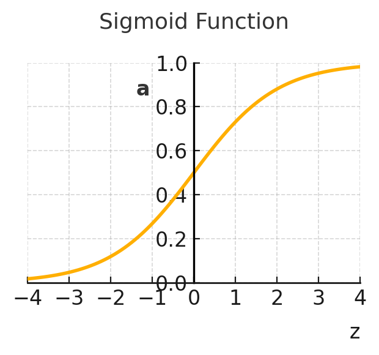
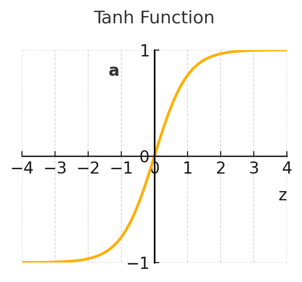
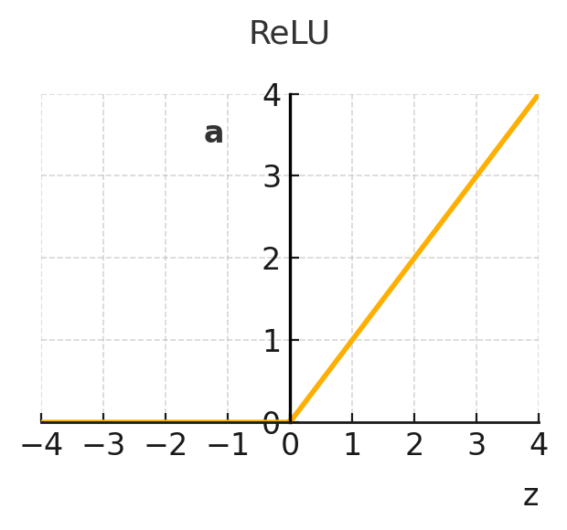
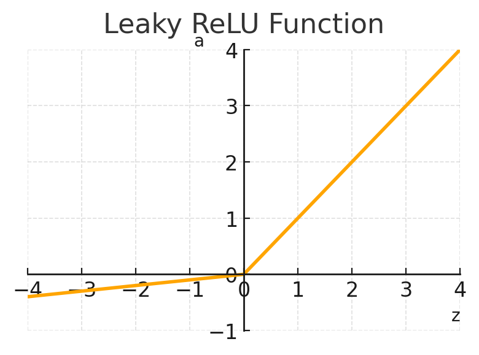

# Neural Networks and Deep Learning(4)_Shallow Neural Network

## 1. Neural Networks Overview

### From Single Decisions to Complex Thinking

> ***Have you ever wondered how your brain can recognize a friend's face in a crowd, understand spoken words in a noisy room, or decide whether to brake when driving? These aren't single, simple decisions—they're the result of countless interconnected processes working together. What if we could create artificial systems that work the same way?***

Welcome back to the **neural networks**—where we take the simple decision-making power of logistic regression and multiply it into something far more powerful.

### Building Complex Systems from Simple Objects

In our previous exploration of logistic regression, we discovered how a single computational unit could make binary decisions. Think of logistic regression as a basic **DecisionMaker** object:

```
LogisticRegression {
    properties:
        - weights (w)
        - bias (b)
    
    methods:
        - computeZ(): calculates w·x + b
        - computeA(): applies sigmoid to z
        - makePrediction(): outputs final decision
}
```

But what happens when we need to solve more complex problems? Problems that require multiple levels of understanding, pattern recognition, and decision-making?

This is where neural networks shine. From an object-oriented perspective, a neural network is a **system of interconnected DecisionMaker objects**, each contributing its own piece of understanding to create a more sophisticated whole.

### The Architecture: Layers as Object Collections

Imagine you're trying to identify whether a photo contains a cat. This isn't a simple yes/no decision based on raw pixels—it requires recognizing edges, then shapes, then features, and finally the complete animal. A neural network mirrors this hierarchical thinking through its **layer architecture**.

In our object-oriented framework, we can think of a neural network as having three types of layer objects:

**Input Layer (Layer 0)**
- Contains the raw data (features)
- Acts as the entry point for information
- Passes data to the next layer without transformation

**Hidden Layer (Layer 1)**
- Contains multiple DecisionMaker units working in parallel
- Each unit looks at all the input features but focuses on different patterns
- Transforms the raw input into more meaningful representations
- Called "hidden" because we don't directly observe what these units learn—they discover their own useful patterns

**Output Layer (Layer 2)**
- Takes the processed information from the hidden layer
- Makes the final decision or prediction
- In our case, outputs a single value (like the probability of something being a cat)

### The Flow of Information: Forward Propagation

When a neural network processes information, it follows a systematic flow called **forward propagation**. Think of it like an assembly line in a factory, where each station adds its own processing to create the final product.

The journey of data through our network follows this pattern:

1. **Input Processing**: Raw features - $x₁, x₂, x₃$ enter the network
2. **Hidden Layer Transformation**: Each unit in the hidden layer:
   - Computes its own z-value using its unique weights and bias
   - Applies the sigmoid function to get its activation value
   - Passes this activation forward
3. **Output Generation**: The output layer:
   - Collects all activations from the hidden layer
   - Computes its final z-value
   - Produces the final prediction

### The Power of Multiple Units

What makes neural networks so powerful compared to logistic regression? It's the **collaborative processing** of multiple units working together.

Consider this analogy: If logistic regression is like having one expert making a decision, a neural network is like having a team of specialists, each examining the data from their unique perspective, then combining their insights for a final decision.

Each hidden unit might learn to detect different patterns:
- One might become sensitive to certain color combinations
- Another might detect specific shapes
- A third might recognize textures
- Together, they provide a rich representation that the output layer can use for accurate prediction

### Learning Through Feedback: Backward Propagation

Just as important as forward propagation is the network's ability to learn from its mistakes through **backward propagation**. This is like a quality control process that works backwards through the assembly line:

1. **Error Assessment**: Compare the network's prediction with the actual answer
2. **Responsibility Attribution**: Determine how much each unit contributed to the error
3. **Parameter Adjustment**: Update weights and biases to reduce future errors

This creates a feedback loop that allows the network to improve over time, much like how a team learns to work better together through practice and feedback.

### The Notation System: Keeping Track of Complexity

As our systems grow more complex, we need a clear way to keep track of all the components. Neural networks use a clever notation system:

- **Superscript square brackets [1], [2]**: Indicate which layer we're referring to
  - $w^{[1]}$ means weights in layer 1
  - $a^{[2]}$ means activations from layer 2
  
- **Subscripts**: Indicate which unit within a layer
  - $a^{[1]}_1$ means the activation of the first unit in layer 1
  
- **Superscript round brackets $(i)$**: Still refer to training examples
  - $x^{(i)}$ means the ith training example

This notation system is like an addressing system in a large building—it tells us exactly which floor (layer) and which room (unit) we're referring to.

### Why "Two-Layer" Network?

One interesting convention in neural networks is that we don't count the input layer when naming the network. So our network with an input layer, one hidden layer, and one output layer is called a "two-layer neural network." 

Think of it this way: the input layer is like the lobby of a building—it's where you enter, but the real work happens on the floors above. We count the floors where transformation happens, not the entry point.

### The Key Insight: Repetition Creates Power

At its core, a neural network takes the computational pattern of logistic regression—compute $z$, then compute $a$—and repeats it multiple times across multiple units and layers. This repetition, combined with the interconnections between units, creates the network's ability to learn complex patterns.

It's similar to how individual neurons in your brain are simple, but connecting billions of them creates consciousness, thought, and intelligence. In artificial neural networks, we're applying the same principle: simple units, complex collective behavior.

### Looking Ahead

This overview has introduced the key concepts of neural networks through our object-oriented lens. We've seen how:
- Neural networks are collections of interconnected DecisionMaker objects
- Information flows forward through layers during prediction
- Errors flow backward during learning
- Multiple units working together can solve complex problems

In the next section, we'll dive deeper into the representation of neural networks, exploring exactly how we organize and connect these computational units to create intelligent systems.

> ***Remember: A neural network is like a team of specialists working together—each examining the data from their unique perspective, then combining insights to make better decisions than any individual could make alone.***

---

## 2. Computing a Neural Network's Output: From Individual Decisions to Collective Intelligence

### When Simple Patterns Create Complex Intelligence

> ***Have you ever wondered how a team of experts makes better decisions than any individual member? Or how a flock of birds coordinates their movements without a single leader? What if we could create artificial systems that work the same way - where simple units combine to produce sophisticated behavior?***

In our previous exploration, we discovered that neural networks consist of layers of interconnected neurons. Now, let's unveil the elegant mathematics that brings these networks to life - and you'll be surprised to discover it's just our familiar friend, logistic regression, orchestrated in a beautiful pattern!

### The Neural Network as a Team of Specialists

From an object-oriented perspective, a neural network is like a hierarchical organization where each neuron is a specialist object that inherits the basic decision-making capabilities of logistic regression but applies them in its own unique context.

Imagine a company making a complex decision - should they launch a new product? Instead of one person deciding, they have:
- Raw data (input layer): Customer surveys, market reports, financial data
- Market analysts (hidden layer neurons): Specialists who examine and interpret the raw data
- The CEO (output layer neuron): Makes the final decision based on analyst reports

Each specialist in this organization performs the same basic operation: they take inputs, weigh them according to their expertise, and produce an output. This is exactly how neurons in a neural network operate!

### The Neuron Object: A Familiar Pattern

Remember how logistic regression works? It performs two elegant steps:
1. Combines inputs: $z = w^T x + b$
2. Applies activation: $a = \sigma(z)$

Each neuron in our neural network is essentially a **logistic regression object** that implements these same two methods. Let's see how this works for a single neuron in the hidden layer.

#### The First Hidden Neuron: A Specialist at Work

Consider the first neuron in our hidden layer. Like a market analyst specializing in customer demographics, this neuron:

1. **Collects and weighs information**: It computes $z^{[1]}_1 = w^{[1]T}_1 x + b^{[1]}_1$
2. **Forms an opinion**: It calculates $a^{[1]}_1 = σ(z^{[1]}_1)$

The notation might look complex, but it's actually quite logical:
- **The superscript** ${[1]}$ tells us we're in layer 1 (the first hidden layer)
- **The subscript** $_1$ tells us this is neuron number 1 in that layer

This is like saying "the demographic analyst (neuron 1) in the market research department (layer 1)."

#### The Second Hidden Neuron: Another Perspective

The second neuron might be like an analyst focusing on competitor data. It performs the same operations but with its own unique parameters:
1. $z^{[1]}_2 = w^{[1]T}_2 x + b^{[1]}_2$
2. $a^{[1]}_2 = σ(z^{[1]}_2)$

Each neuron in the hidden layer follows this same pattern, but with different weights and biases - just like how different analysts bring different expertise and perspectives to the decision-making process.

### From Individual to Collective: The Power of Vectorization

Now, imagine if our company had to wait for each analyst to finish their report one by one before the next could start. That would be terribly inefficient! Instead, all analysts work in parallel, and their reports are collected simultaneously.

This is where the mathematical beauty of vectorization comes in. Instead of computing each neuron's output sequentially, we can **transform our individual neuron objects into a collective computation object**.

#### The Matrix Transformation

We stack all the weight vectors from our neurons into a matrix $W^{[1]}$:
- Row 1: The weights of the demographic analyst, $w^{[1]T}_1$
- Row 2: The weights of the competitor analyst, $w^{[1]T}_2$
- Row 3: The weights of the economic analyst, $w^{[1]T}_3$
- Row 4: The weights of the technology analyst, $w^{[1]T}_4$

Similarly, we stack all the biases into a vector $b^{[1]}$.

Now, the entire hidden layer's computation becomes elegantly simple:
- **$z^{[1]} = W^{[1]}x + b^{[1]}$**
- **$a^{[1]} = σ(z^{[1]})$**

This is the **polymorphism** of our object-oriented framework in action - the same operation (weighted sum + activation) is implemented differently at the individual neuron level versus the layer level, but the concept remains consistent.

### The Complete Forward Pass: Information Flow Through Layers

The true power of neural networks emerges when we connect multiple layers. The outputs from our hidden layer become inputs to the next layer:

```
Input (x) → Hidden Layer → Output Layer → Prediction (ŷ)
    ↓            ↓              ↓
   a^[0]        a^[1]        a^[2]          
```

For a network with one hidden layer, the complete forward pass requires just four lines of computation:
1. $z^{[1]} = W^{[1]}x + b^{[1]}$     (Hidden layer linear combination)
2. $a^{[1]} = σ(z^{[1]})$          (Hidden layer activation)
3. $z^{[2]} = W^{[2]}a^{[1]} + b^{[2]}$ (Output layer linear combination)
4. $a^{[2]} = σ(z^{[2]})$          (Output layer activation = ŷ)

Notice the beautiful pattern: each layer inherits the same computational structure but applies it to different inputs. The hidden layer processes raw features, $x$, while the output layer processes the hidden layer's representations, $a^{[1]}$.

### Real-World Analogy: The Symphony Orchestra

Think of a neural network's forward pass like a symphony orchestra performing a piece of music:

- **Input features (x)**: The musical notes on the sheet music
- **Hidden layer neurons**: Different instrument sections (strings, woodwinds, brass, percussion)
- **Weight matrices (W)**: How loudly each section plays each note
- **Biases (b)**: The baseline volume for each section
- **Activations (a)**: The actual sounds produced by each section
- **Output layer**: The conductor who blends all sections into the final performance

Just as each section processes the same sheet music differently based on their instruments (weights) and playing style (activation function), each layer in a neural network transforms the input data according to its learned parameters.

### The Inheritance Hierarchy

From an object-oriented perspective, we can see a clear inheritance hierarchy:

1. **LogisticRegression**: The base class with linear combination and sigmoid activation
2. **Neuron**: Inherits from LogisticRegression, adds layer and position identity
3. **Layer**: Composed of multiple Neuron objects, implements vectorized operations
4. **NeuralNetwork**: Composed of multiple Layer objects, orchestrates information flow

Each level **inherits** the fundamental computation pattern but **implements** it at a different scale of abstraction.

### From One Example to Many

Just as we vectorized across neurons in a layer, we can also vectorize across multiple training examples. Instead of processing one data point at a time, we can process our entire dataset simultaneously - like our company analyzing feedback from thousands of customers at once rather than one by one.

This double vectorization - across both neurons and examples - is what makes modern neural networks computationally efficient and practical for real-world applications.

### Summary

Computing a neural network's output is elegantly simple: it's just logistic regression applied in a structured, hierarchical pattern. Each neuron performs the familiar two-step dance of linear combination and activation, but when orchestrated together through matrix operations, these simple units create a powerful system capable of learning complex patterns.

> ***Remember: A neural network's forward pass is like a well-organized team where each member (neuron) applies the same basic decision-making process (logistic regression) to create a collective intelligence greater than any individual could achieve alone. The magic isn't in complexity - it's in the elegant repetition and combination of simple patterns.***

---

## 3. From One to Many: Processing Multiple Examples in Neural Networks

### When Neural Networks Meet Assembly Lines

> ***Have you ever wondered how streaming services can instantly recommend movies for millions of users at once? Or how social media platforms can analyze thousands of photos simultaneously to detect faces? What if I told you that neural networks use the same principle as factory assembly lines to process multiple examples at the same time?***

In our previous exploration, we learned how a neural network processes a single example—like analyzing one photo or making one prediction. But in the real world, we rarely work with just one example at a time. We need to process thousands, millions, or even billions of examples efficiently. This is where the magic of **vectorization** transforms our neural networks from careful artisans into high-speed factories.

### The Challenge: From Sequential to Simultaneous

Imagine you're a teacher grading exams. You have two approaches:

**The Sequential Approach**: Grade one exam completely, then move to the next, then the next... If each exam takes 5 minutes and you have 100 students, that's 500 minutes of grading.

**The Parallel Approach**: Grade question 1 for all exams at once, then question 2 for all exams, and so on. Because you're looking for the same patterns repeatedly, you get faster with each exam. You might finish all 100 exams in 200 minutes.

Neural networks face the same choice. When processing training examples, they can either handle them one by one (sequential) or process them all together (vectorized). The difference in speed is even more dramatic than our grading example!

### Understanding Through Object Collections

Let's think about this from an object-oriented perspective. Each training example is like an object with properties (features) that needs to be transformed by our neural network. Instead of processing these objects individually, we can organize them into a collection and process the entire collection at once.

Consider a simple scenario: a neural network that predicts whether customers will buy a product based on their age, income, and browsing time. Each customer is an object:

- Customer 1: age=25, income=50k, browsing_time=10min
- Customer 2: age=35, income=70k, browsing_time=5min
- Customer 3: age=45, income=90k, browsing_time=15min

Instead of running each customer through the network separately, we organize them into a **matrix structure** where each column represents a complete customer object.

### The Matrix Organization: A New Perspective

This is where our notation becomes powerful. We use:
- **Lowercase letters with superscripts** for individual examples: $x^{(1)}$, $x^{(2)}$, $x^{(3)}$
- **Capital letters** for collections: $X$ (containing all examples)

The transformation is elegant:
- Individual examples are column vectors
- The collection matrix has examples as columns
- Each row represents a specific feature across all examples

Think of it like organizing a parking lot. Each column is a parking space (one example), and each row represents a specific attribute (like car color, model, or year) across all the parked cars.

### The Power of Simultaneous Processing

When we vectorize our neural network computations, something remarkable happens. Instead of writing:

"For each training example from 1 to m:
- Calculate $z$ for this example
- Calculate $a$ for this example
- Move to the next layer
- Repeat"

We can simply say:

"For all training examples at once:
- Calculate $Z$ for all examples
- Calculate $A$ for all examples
- Move to the next layer"

This isn't just a notational convenience—it represents a fundamental shift in how computations are performed. Modern computers, especially GPUs, are designed to perform the same operation on multiple pieces of data simultaneously. By organizing our data into matrices, we tap into this parallel processing power.

Here's a summary in English to add to your document:

> **The Evolution of "Compute" as a Noun in AI**  
>  
> In recent years, particularly in AI/ML circles, "compute" has evolved from a verb into a noun, representing computational resources or processing power as a commodity. This linguistic shift reflects how fundamental computing power has become to AI development.  
>  
> Common usage includes:  
> - "Data & Compute" - the two pillars of modern AI systems  
> - "The amount of compute" - treating processing power as a measurable resource  
> - "Compute costs" - referring to the expense of computational resources  
> - "Global compute" - the worldwide stock of AI-relevant processing power  
>  
> This usage has become so prevalent that major AI reports now measure progress in terms of "H100-equivalents" and track the distribution of compute among leading AI companies. The term encapsulates not just raw processing power but the entire infrastructure needed for training and  running AI models.  
>  
> While some language purists object to this grammatical shift (arguing for "computing" or "computation"), the noun form of "compute" has become industry standard, particularly when discussing AI scalability and resource allocation. It represents a fundamental shift in how we conceptualize processing power - not as an activity, but as a tangible asset that can be owned, traded, and measured.  

### The Two-Dimensional View: Examples and Features

Here's a crucial insight that helps understand these matrix operations. In our matrices:

**Horizontal dimension (columns)**: Different training examples
- Moving left to right takes you from customer 1 to customer 2 to customer 3
- Each column is a complete example with all its features

**Vertical dimension (rows)**: Different nodes or features
- Moving top to bottom takes you through different neurons in a layer
- Or through different input features for the input matrix

This two-dimensional organization isn't arbitrary—it perfectly captures the structure of our neural network processing. When we perform matrix multiplication $W^{[1]}X$, we're essentially saying: "Apply all the weights of layer 1 to all training examples simultaneously."

### The Transformation Rules

The transformation from single-example to multi-example processing follows consistent patterns:

1. **Variables gain capital letters**: $x$ becomes $X$, $z$ becomes $Z$, $a$ becomes $A$
2. **Dimensions expand**: Vectors become matrices by stacking columns
3. **Operations scale naturally**: The same mathematical operations work on entire matrices
4. **Efficiency multiplies**: Processing time doesn't scale linearly with examples

### Why This Matters

This vectorization isn't just about speed—though the speed improvements are dramatic. It's about thinking differently about computation. Instead of seeing neural networks as sequential processors, we see them as parallel transformation engines.

When you use AI applications that process thousands of requests per second—whether it's translating languages, recognizing speech, or recommending content—they're all using this vectorized approach. The neural network isn't processing your request alone; it's likely processing hundreds or thousands of requests simultaneously in one giant matrix operation.

### The Bigger Picture

This vectorization principle extends beyond neural networks. It's a fundamental pattern in modern computing:
- Databases process multiple records simultaneously
- Graphics cards render millions of pixels at once
- Scientific simulations update millions of particles together

By understanding how neural networks vectorize across examples, you're grasping a core principle of efficient computation in the modern world.

### Summary

> ***Remember: Vectorization transforms neural networks from sequential processors to parallel processing powerhouses by organizing multiple training examples into matrices, where columns represent different examples and rows represent different features or neurons—enabling simultaneous processing that can be hundreds of times faster than handling examples one by one.***

---

## 4. Speed-Up Superpower: Vectorizing a Neural Network

> ***"The secret to doing good research is always to be a little underemployed. You waste years by not being able to waste hours."***  
> ― Amos Tversky

### The Matrix as a Collection of Objects

In object-oriented thinking, we often work with collections – arrays of objects, lists of items, sets of elements. Vectorization applies this same principle to our data:

**Before Vectorization**:
- Training example 1 → Process through network → Get result 1
- Training example 2 → Process through network → Get result 2
- Training example 3 → Process through network → Get result 3
- ... and so on, one at a time

**After Vectorization**:
- All training examples together → Process through network → Get all results at once!

The magic happens when we arrange our training examples as columns in a matrix. Each column represents one training example object, and the entire matrix represents our collection of examples.

### The Mathematical Symphony

When we stack our training examples as columns in a matrix X, something beautiful happens. Instead of computing:

- $z_1 = w · x_1 + b$ (for example 1)
- $z_2 = w · x_2 + b$ (for example 2)
- $z_3 = w · x_3 + b$ (for example 3)

We can compute all of them at once:  

$$
Z = W · X + b
$$

This single operation replaces potentially thousands of individual calculations! The weight matrix $W$ acts like a transformation factory that processes every column (example) of $X$ simultaneously.

### Why This Works: The Broadcasting Magic

Here's where Python's broadcasting becomes our weapon. When we add the bias term $b$ to our matrix multiplication result, Python automatically "broadcasts" or copies b to each column. It's like having a stamp that automatically applies itself to every document in a stack.

This broadcasting behavior perfectly matches our object-oriented intuition: the bias is a property shared by all computations, so it makes sense that it would apply uniformly across all examples.

### Layer-by-Layer Consistency

The beauty of vectorization extends throughout the entire network. Each layer follows the same pattern:

1. **Linear transformation**: $Z^{[i]} = W^{[i]} · A^{[i-1]} + b^{[i]}$
    - $Z^{[1]} = W^{[1]} · X + b^{[1]}$
2. **Activation**: $A^{[i]}$ = activation_function $(Z^{[i]})$
    - $A^{[1]} = σ(Z^{[1]})$

Where:
- $i$ represents the layer number
- $A^{[i-1]}$ is the activation from the previous layer - input $X$ for the first layer
- Each operation processes all examples simultaneously

This creates a powerful symmetry: every layer is just repeating the same two operations, but on increasingly transformed representations of our data.

### The Object-Oriented Perspective: Collections and Transformations

From our object-oriented perspective, vectorization represents a fundamental principle: **operations on collections should be as efficient as operations on individual elements**. 

When we vectorize a neural network:
- Individual examples become elements in a collection (matrix)
- Neurons transform from serial processors to parallel processors
- The entire network becomes a pipeline that processes collections rather than individuals

This shift in perspective – from individual objects to collections of objects – is what makes modern deep learning computationally feasible.

### Connecting Forward: What's Next?

Now that we understand how to make our neural networks blazingly fast through vectorization, we're ready to explore another crucial question: are all activation functions created equal? In our next section, we'll discover why the sigmoid function we've been using might not always be the best choice, and we'll meet new activation functions that can make our networks even more powerful.

### Summary

Vectorization transforms neural networks from slow, sequential processors into high-speed parallel computing engines. By organizing our training examples as columns in a matrix and leveraging matrix operations, we can process thousands of examples in the time it would take to process just one. This isn't just a computational trick – it's a fundamental shift in how we think about neural network operations, treating collections of examples as first-class objects that can be transformed all at once. 

---

## 5. The Personality of Neurons: Understanding Activation Functions

> ***"In the depth of winter, I finally learned that there was in me an invincible summer."***  
> — Albert Camus

### Finding the Voice Within: How Neurons Choose to Speak

> ***Have you ever noticed how different people react differently to the same situation? Some burst with excitement at good news while others respond more calmly. Some shut down completely when faced with negativity while others find a way to stay slightly positive. What if I told you that neurons in artificial neural networks have similar "personality types" that determine how they respond to incoming signals?***

In our previous exploration, we discovered how data flows through a neural network in forward propagation. But we glossed over a crucial detail: after a neuron calculates its weighted sum, it doesn't just pass that raw number forward. Instead, it transforms that value through what we call an **activation function** - essentially giving each neuron its own unique way of responding to inputs.

### The Object-Oriented Nature of Neuron Personalities

Let's think about neurons through our object-oriented lens. Each neuron is an object with properties (weights and bias) and behaviors (how it processes information). The activation function is like a **method** that can be overridden by different types of neurons, creating different "personalities."

Imagine a family of neurons where each member inherits the basic structure but implements their own unique response pattern:

**The Neuron Family Tree:**
- **Parent Class**: BasicNeuron (has weights, bias, and a response method)
  - **Child 1**: **Sigmoid**Neuron (responds with gentle S-shaped curves)
  - **Child 2**: **Tanh**Neuron (responds with centered S-shaped curves)
  - **Child 3**: **ReLU**Neuron (responds with straight-line simplicity)
  - **Child 4**: **LeakyReLU**Neuron (responds like ReLU but with a safety valve)

This is **polymorphism** in action - the same basic structure (neuron) exhibiting different behaviors (activation patterns) based on its specific type.

### Meeting the Activation Function Family

Let's get to know each personality type and understand when and why we'd choose one over another.

#### 1. The Sigmoid: The Probability Specialist



$$
\text{[Chart 1]} : \frac{1}{1 + e^{-z}}
$$

The sigmoid function is like a gentle diplomat who always speaks in probabilities. No matter how extreme the input, sigmoid carefully compresses it into a value between **0 and 1**.

**Personality Profile:**
- **Response Pattern**: Takes any input and smoothly transforms it to a value between 0 and 1
- **Mathematical Expression**: $σ(z) = \frac{1}{1 + e^{(-z)}}$
- **Real-World Analogy**: Like a dimmer switch that can smoothly adjust from completely off (0) to fully on (1)

**When Sigmoid Shines:**
Sigmoid is perfect for the output layer when you need a **probability**. For instance, in a spam detection system, sigmoid can tell you there's a 0.87 (87%) chance an email is spam.

**The Hidden Challenge:**
However, sigmoid has a weakness. When inputs are very large (positive or negative), the function becomes almost flat. This creates the "vanishing gradient problem" - imagine trying to learn by climbing a hill that's almost completely flat at the top and bottom. Progress becomes painfully slow!

#### 2. The Tanh: The Balanced Performer



$$
\text{[Chart 2]} : \frac{e^z - e^{-z}}{e^z + e^{-z}}
$$

Tanh (hyperbolic tangent) is sigmoid's more balanced cousin. Instead of ranging from 0 to 1, tanh centers itself around zero, outputting values between -1 and 1.

**Personality Profile:**
- **Response Pattern**: Transforms inputs to values between -1 and 1
- **Mathematical Expression**: $tanh(z) = \frac{e^z - e^{(-z)}}{e^z + e^{(-z)}}$
- **Real-World Analogy**: Like a seesaw that can tilt fully in either direction but naturally balances at the center

**Why Centering Matters:**
In many learning scenarios, having outputs centered around zero helps the network learn faster. It's like starting a conversation from a neutral position rather than always beginning with "yes."

#### 3. The ReLU: The Straight Shooter



$$
\text{[Chart 3]} : max(0, z)
$$

ReLU (Rectified Linear Unit) revolutionized deep learning with its beautifully simple approach: if the input is positive, pass it through unchanged; if negative, output zero.

**Personality Profile:**
- **Response Pattern**: $max(0, z)$ - outputs the input if positive, zero otherwise
- **Real-World Analogy**: Like a one-way valve that only allows positive flow

**Why ReLU Dominates:**
ReLU's simplicity is its superpower. Unlike **sigmoid** and **tanh**, **ReLU** doesn't compress its positive inputs, allowing gradients to flow freely during backpropagation. This makes training much faster and more effective.

**The Achilles' Heel:**
Sometimes ReLU neurons can "die" - if they output zero, they might get stuck in that state forever, becoming permanently inactive. It's like a valve that gets stuck closed. Because, when a ReLU neuron outputs zero, its gradient is also zero, which means no weight updates can flow back through it during backpropagation. This creates a vicious cycle: zero output → zero gradient → no learning → weights stay the same → still produces zero output.

#### 4. The Leaky ReLU: The Improved Design



$$
\text{[Chart 4]} : max(0.01z, z)
$$

Leaky ReLU addresses ReLU's death problem with a simple modification: instead of outputting exactly zero for negative inputs, it allows a small negative slope.

**Personality Profile:**
- **Response Pattern**: $max(0.01z, z)$ - outputs the input if positive, or $0.01z$ if negative
- **Real-World Analogy**: Like a one-way valve with a tiny controlled leak

This small change prevents neurons from dying while maintaining most of ReLU's advantages.

### Choosing the Right Personality for the Job

Just as you wouldn't send an introvert to host a party or ask an extrovert to work in isolation, different activation functions excel in different roles:

**For Hidden Layers:**
- **First Choice**: ReLU (fast, effective, simple)
- **If Neurons Die**: Leaky ReLU
- **For Special Cases**: Tanh (when you need centered outputs)

**For Output Layers:**
- **Binary Classification** (yes/no decisions): Sigmoid
- **Multi-class Classification**: Softmax (a cousin we've already met and will meet again)
- **Regression** (predicting values): Often no activation or ReLU for non-negative outputs

### The Bigger Picture: Why Activation Functions Matter

Without activation functions, even the deepest neural network would simply be performing linear transformations. It's like having a choir where everyone sings in monotone - no matter how many singers you add, you can't create harmony.

Activation functions introduce **non-linearity**, allowing networks to learn complex patterns. They're the secret ingredient that transforms a simple weighted sum into a powerful learning machine.

### Real-World Impact Across Domains

The choice of activation function affects performance across all applications:

**In Computer Vision:**
ReLU's ability to create sparse representations (many zeros) helps networks focus on important features in images, like edges and textures.

**In Natural Language Processing:**
The centered nature of tanh helps in understanding context, where both positive and negative signals carry meaning.

**In Game AI:**
Sigmoid functions help in making probability-based decisions, like determining the likelihood of taking a particular action.

### The Evolution Continues

The field of activation functions continues to evolve. Researchers have developed variations like ELU (Exponential Linear Unit), Swish, and GELU (Gaussian Error Linear Unit), each trying to capture the best properties while avoiding the pitfalls.

This ongoing evolution reflects a beautiful truth about neural networks: they're not rigid mathematical constructs but flexible, evolving systems that we continue to improve by understanding how their components - their "personalities" - work together.

### Summary

Activation functions are the personality traits of neurons, determining how they respond to inputs. Just as different situations call for different human responses, different parts of a neural network benefit from different activation functions. ReLU has become the workhorse of modern deep learning due to its simplicity and effectiveness, while sigmoid remains the go-to choice for probability outputs. By choosing the right activation function for each layer, we give our neural networks the expressive power to learn complex patterns and make intelligent decisions.

> ***Remember: Start simple with ReLU in hidden layers and sigmoid for binary outputs. Like choosing the right tool for a job, the right activation function can make the difference between a network that struggles and one that soars.***

---

## 6. Why Neural Networks Need to Bend: The Power of Non-Linear Activation Functions

> ***"The straight line leads to the downfall of humanity."***  
> — *Friedensreich Hundertwasser, Austrian artist and architect*

### When Straight Lines Meet the Curved World

> ***Have you ever tried to draw a circle using only a ruler? Or wondered why a staircase can't smoothly become a ramp? What if I told you that without the ability to bend and curve, neural networks would be as limited as trying to paint the Mona Lisa with only straight lines?***

One of the most elegant insights in deep learning: why neural networks need non-linear activation functions to capture the beautiful complexity of our world.

### The Linear Limitation: When Objects Can Only Add

Let's think about neural network layers through our object-oriented lens. Each layer is like a transformation object that takes inputs and produces outputs:

```
NeuralLayer {
    properties: weights (W), bias (b)
    methods: 
        linearTransform(x) → z = Wx + b
        activate(z) → output
}
```

Now here's the crucial insight: the `linearTransform` method always produces straight lines (or planes in higher dimensions). If our `activate` method also preserves this straightness (by doing nothing, just `activate(z) = z`), then we have a problem.

Imagine stacking multiple transparent rulers on top of each other. No matter how many you stack, when you look through them, you still see... a straight line! This is exactly what happens when we stack linear layers without non-linear activation functions.

### The Inheritance Problem: When Children Are Too Much Like Their Parents

In object-oriented thinking, we have inheritance hierarchies. But what if every child class behaves exactly like its parent? 

Consider this: if `Layer 1` draws a straight line, and `Layer 2` inherits this behavior and also draws a straight line, then combining them still gives us... a straight line! Mathematically, this looks like:

- Layer 1: $z^{[1]} = W^{[1]}x + b^{[1]}$ 
- Layer 2: $z^{[2]} = W^{[2]}z^{[1]} + b^{[2]}$

When we expand this, we get:  

$$
z^{[2]} = W^{[2]}(W^{[1]}x + b^{[1]}) + b^{[2]} = (W^{[2]}W^{[1]})x + (W^{[2]}b^{[1]} + b^{[2]})
$$

This is just another linear equation with combined weights and biases! It's as if we never added the second layer at all.

### Real-World Polymorphism: Different Curves for Different Purposes

This is where activation functions save the day. They're like giving each layer the ability to implement its own unique "bending" behavior:

**ReLU (Rectified Linear Unit)**: Like a one-way valve that lets positive signals through but blocks negative ones. Imagine a neuron that only fires when it receives enough stimulation - just like real neurons in your brain!

**Sigmoid**: Creates an S-shaped curve, perfect for probabilities. It's like a dimmer switch that smoothly transitions from "completely off" (0) to "completely on" (1).

**Tanh**: Similar to sigmoid but centered around zero, swinging from -1 to +1. Think of it as a balanced pendulum that can swing both ways.

Each activation function is a different implementation of the `activate` method, demonstrating polymorphism in action. The same layer structure can exhibit vastly different behaviors depending on which activation function it uses.

### Why Curves Unlock Intelligence

Let's explore why this "bending" ability is so crucial through different domains:

**In Computer Vision**: A face isn't made of straight edges - it has curves, shadows, and complex patterns. Non-linear activations let networks recognize the subtle curves of a smile or the complex patterns of eyes.

**In Natural Language**: The meaning of words isn't linear. "Bank" means something different next to "river" than next to "money." Non-linear functions capture these context-dependent relationships.

**In Game AI**: A character's decision to attack or defend isn't a simple linear calculation. It depends on health, distance, ammunition, and strategy in complex, non-linear ways.

**In Financial Modeling**: Stock prices don't move in straight lines. Market behaviors involve feedback loops, threshold effects, and complex interactions that only non-linear models can capture.

### The Power of Composition: Building Complex from Simple

Here's where the true magic happens. Each non-linear activation function might create just a simple bend or curve. But when you compose many of these together across multiple layers, you can approximate incredibly complex patterns.

Think of it like origami: each fold is simple, but combining many folds in the right sequence can create a beautiful swan or dragon. This is the essence of the Universal Approximation Theorem - with enough neurons and non-linear activations, a neural network can approximate any continuous function to arbitrary accuracy.

### The One Exception: Output Layers in Regression

There's one special case where we might want a linear activation: the output layer for regression problems. When predicting house prices or temperatures, we want our network to output any real number, not just values between 0 and 1. So we let the final layer stay linear (`activate(z) = z`) while keeping all hidden layers non-linear.

It's like having a sophisticated analysis system (non-linear hidden layers) that ultimately needs to report a simple number (linear output).

### Encapsulation in Practice: Different Activations for Different Layers

Modern neural networks demonstrate beautiful encapsulation - each layer can have its own activation function:

- Early layers might use **ReLU** for efficient feature detection
- Middle layers might use **LeakyReLU** to avoid "dead neurons"
- Output layers choose based on the task (sigmoid for binary classification, softmax for multiple classes, linear for regression)

Each layer encapsulates its transformation logic, hiding the complexity while exposing a clean interface to the next layer.

### The Bigger Picture: From Lines to Life

Without non-linear activation functions, neural networks would be forever trapped in the land of straight lines. They could never:
- Recognize the curve of a handwritten digit
- Understand the emotional arc of a movie review  
- Predict the complex patterns of weather systems
- Master the strategic depth of games like Go or Chess

Non-linear activations are what allow neural networks to escape the prison of linearity and model the rich, curved, interconnected patterns of the real world.

### Summary: The Bend That Makes the Difference

> ***Remember: Non-linear activation functions are the secret ingredient that transforms neural networks from sophisticated linear calculators into universal pattern recognizers. Without them, a hundred layers would collapse into one; with them, each layer adds new expressive power, building up the ability to model any pattern in our beautifully non-linear world.***

In the next section, we'll explore how these curved, bent, and twisted functions still allow us to calculate gradients and train our networks through the elegant mathematics of backpropagation. The curves may be complex, but the learning process remains beautifully systematic!

---

## 7. Derivatives of Activation Functions: Teaching Neurons to Learn from Their Mistakes

> ***"In mathematics, you don't understand things. You just get used to them."***  
> — *John von Neumann*

### The Hidden Power Behind Learning

> ***Have you ever wondered how a neural network knows which direction to adjust its weights? When your phone's face recognition improves over time, or when a game AI gets better at beating you, what mathematical magic makes this learning possible? The answer lies in a surprisingly simple concept: the slope of activation functions.***

In our journey through neural networks, we've discovered that neurons are objects that transform inputs into outputs using activation functions. But there's a secret method these neuron objects possess - one that makes all learning possible. It's their ability to tell us not just *what* they output, but *how sensitive* that output is to changes in input.

### The Neuron's Secret Method: Understanding Slopes

Think of our neuron as an object with these capabilities:

```
Neuron Object {
    Properties:
        - weights (W)
        - bias (b)
    
    Methods:
        - activate(z) → returns output 'a'
        - calculateSlope(z) → returns sensitivity to change
}
```

While the `activate()` method tells us what the neuron outputs for a given input, the `calculateSlope()` method reveals something more profound: how much the output would change if we slightly adjusted the input. This slope is the derivative of the activation function, and it's the secret compass that guides all learning in neural networks.

### Why Slopes Matter: The Mountain Climber's Dilemma

Imagine you're a mountain climber trying to reach the lowest point in a valley, but you're blindfolded. All you can do is feel the slope of the ground beneath your feet. If the ground slopes steeply downward to your left, you know that's the direction to move to descend quickly. If it's nearly flat, you know you need to search more carefully for the right direction.

This is exactly what happens during neural network training. Each weight adjustment is like taking a step, and the derivative (slope) of the activation function tells us:
- **Which direction** to adjust (uphill or downhill)
- **How confident** we should be in that adjustment (steep slope = confident, flat slope = uncertain)

### The Practical Magic: Common Activation Derivatives

Let's explore how different activation functions implement their slope calculation, viewing each as a unique implementation of the same fundamental method.

#### The Sigmoid Function: The S-Curve's Secret

Remember the sigmoid function that squashes any input into a value between 0 and 1? Its derivative has a beautiful property. If you've already calculated the output `a = sigmoid(z)`, then the slope at that point is simply:

**Slope = a × (1 - a)**

This elegant relationship means:
- When the output is near 0.5 (the middle of the S-curve), the slope is largest: 0.5 × 0.5 = 0.25
- When the output is near 0 or 1 (the flat regions), the slope approaches zero
- The neuron "knows" it's most sensitive to changes when it's uncertain (outputting around 0.5)

#### The Tanh Function: The Stretched S-Curve

The hyperbolic tangent function, which outputs values between -1 and 1, has an equally elegant derivative. If `a = tanh(z)`, then:

**Slope = 1 - a²**

This means:
- Maximum slope occurs when a = 0 (the center), giving us a slope of 1
- The slope diminishes as we approach the extremes (-1 or 1)
- It's like a spring that's stiffest in the middle and gets softer at the ends

#### The ReLU Family: The Speed Demons

ReLU (Rectified Linear Unit) and its variants have the simplest derivatives:

**ReLU slope:**
- If $z > 0$: slope = 1
- If $z \leq 0$: slope = 0

**Leaky ReLU slope:**
- If $z > 0$: slope = 1
- If $z \leq 0$: slope = 0.01

These simple on/off switches make ReLU incredibly fast to compute. It's like a door that's either fully open (slope = 1) or closed (slope = 0 or 0.01).

### The Car Suspension Analogy: Understanding Stiffness

To better understand how these derivatives affect learning, let's think about car suspensions - a perfect real-world analogy for activation functions:

- **The activation function** is like a spring in your car's suspension
- **The derivative** represents the spring's stiffness at different compression levels
- **Weight updates during training** are like adjusting the shock absorbers

When you hit a bump (error in prediction):
- A **stiff spring** (large derivative) transmits the force immediately - learning happens quickly
- A **soft spring** (small derivative) absorbs the impact slowly - learning is sluggish
- A **completely compressed spring** (zero derivative) can't respond at all - no learning occurs

This is why sigmoid and tanh can suffer from "vanishing gradients" in their flat regions - the spring is too soft to transmit useful learning signals!

### Cross-Domain Examples: Where Else Do We See This Pattern?

The concept of derivatives as sensitivity measures appears everywhere:

**In Economics:**
- Price elasticity tells us how sensitive demand is to price changes
- It's the economic equivalent of our activation derivative
- High elasticity = steep slope = small price changes cause big demand shifts

**In Biology:**
- Enzyme activity curves show how reaction rates change with substrate concentration
- The slope tells us how sensitive the enzyme is at different concentrations
- Similar to how our activation functions respond to different input levels

**In Music Production:**
- Compressor curves determine how audio volume responds to input levels
- The slope (ratio) determines how much compression occurs
- Gentle slopes preserve dynamics; steep slopes create dramatic effects

### Why These Formulas Are Computational Gold

You might wonder why we emphasize these specific derivative formulas. The answer reveals the elegance of computational optimization:

1. **Reuse, Don't Recalculate**: Since we already computed `a = g(z)` during the forward pass, calculating the derivative using our formulas requires no additional expensive operations

2. **Numerical Stability**: Computing derivatives directly from the original functions might involve dividing by very small numbers or exponentiating large values - both recipes for computational disaster

3. **Speed at Scale**: When training networks with millions of parameters, these shortcuts transform hours of computation into minutes

### Connecting to Our Calculus Foundation

Remember from our calculus chapters how we learned that derivatives measure instantaneous rate of change? Here, that abstract concept becomes concrete:

- In calculus sections, we found derivatives to understand function behavior
- In neural networks, we use derivatives to understand how to improve our predictions
- The chain rule we studied? That's exactly how we'll propagate these slopes backward through the network

[Calculus for ML and DS(1)_Derivatives](https://github.com/Atikers/Deep-Dive-into-Python-and-AI/blob/main/Ch%20008.%20Hello!%20Mathematics(for%20Machine%20Learning%20and%20Data%20Science)/008.%20Calculus%20for%20ML%20and%20DS(1)_Derivatives.md)
[Calculus for ML and DS(2)_Optimization](https://github.com/Atikers/Deep-Dive-into-Python-and-AI/blob/main/Ch%20008.%20Hello!%20Mathematics(for%20Machine%20Learning%20and%20Data%20Science)/009.%20Calculus%20for%20ML%20and%20DS(2)_Optimization.md)
[Calculus for ML and DS(3)_Gradients](https://github.com/Atikers/Deep-Dive-into-Python-and-AI/blob/main/Ch%20008.%20Hello!%20Mathematics(for%20Machine%20Learning%20and%20Data%20Science)/010.%20Calculus%20for%20ML%20and%20DS(3)_Gradients.md)
[Calculus for ML and DS(4)_Gradients Descent](https://github.com/Atikers/Deep-Dive-into-Python-and-AI/blob/main/Ch%20008.%20Hello!%20Mathematics(for%20Machine%20Learning%20and%20Data%20Science)/011.%20Calculus%20for%20ML%20and%20DS(4)_Gradients%20Descent.md)

The beauty is that all those "toy problems" from calculus - finding where functions increase or decrease, locating extrema, understanding curves - were actually preparing us for this moment where derivatives become the engine of artificial intelligence.

### The Learning Symphony: How It All Comes Together

When a neural network learns, it's like conducting an orchestra where:
- Each neuron plays its note (forward pass)
- The conductor hears the overall performance (calculate error)
- Using the sensitivity of each instrument (derivatives), the conductor provides feedback
- Each musician adjusts their playing (weight updates)
- The performance improves with each rehearsal (training iteration)

The derivatives are the crucial feedback mechanism - they translate the overall error into specific adjustments for each weight.

### Summary: The Slope is the Secret

Understanding activation derivatives transforms neural networks from mysterious black boxes into comprehensible learning machines. Each neuron object carries within it not just the ability to transform inputs, but also the wisdom to guide its own improvement through its derivative.

> ***Remember these key insights:***
> - **Sigmoid derivative**: a × (1 - a) - strongest in the middle, weakest at extremes
> - **Tanh derivative**: 1 - a² - similar pattern but with different scaling
> - **ReLU derivative**: binary switch (0 or 1) - simple but effective

These slopes are the microscopic guides that, when combined across millions of parameters, create the macroscopic intelligence we see in modern AI systems. They're proof that sometimes the most powerful ideas are also the most elegantly simple.