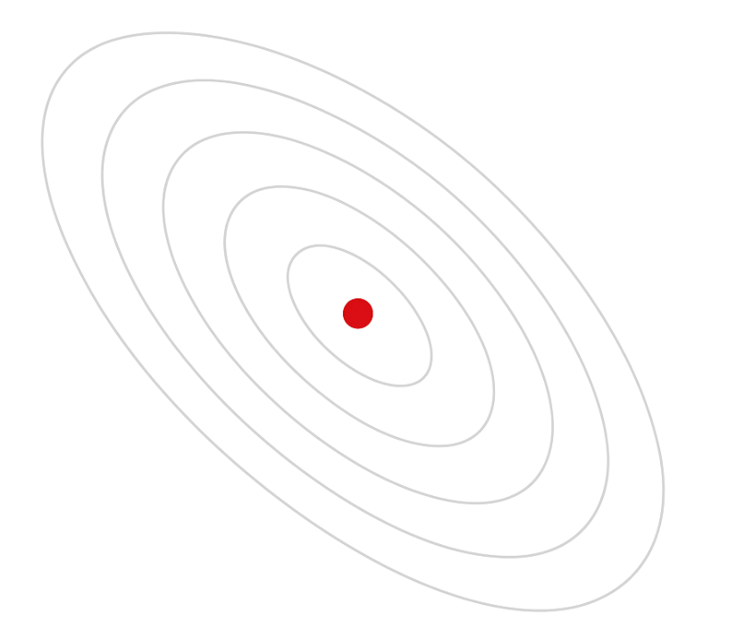

# Improving Deep Neural Networks(2)_Optimization

## 1. The Power of Small Steps: Mini-batch Gradient Descent

### Breaking Down the Mountain: Why Size Matters in Learning

> ***Have you ever wondered why marathon runners don't sprint the entire distance? What if I told you that neural networks face a similar challenge when learning from millions of examples? How can we make machines learn efficiently without exhausting their computational stamina?***

In the world of deep learning, we face a fundamental tension. On one hand, more data leads to better models. On the other hand, processing millions of examples at once can bring even powerful computers to their knees. This is where **mini-batch gradient descent** emerges as an elegant solution, transforming an overwhelming task into manageable chunks.

### Understanding the Object Hierarchy of Training

From an object-oriented perspective, our training process involves a beautiful hierarchy of data objects. At the top level, we have our **Dataset** object - a massive collection containing potentially millions of training examples. This Dataset can be viewed as a container class that holds all our training data.

Think of it like a massive library. The entire library is your Dataset, but you don't need to read every book simultaneously to learn. Instead, you can check out a reasonable number of books at a time, study them thoroughly, and then return for the next batch.

In traditional **batch gradient descent**, we process this entire Dataset object in one go. Imagine calculating the gradient using all 5 million training examples before taking a single step to update our weights. While this gives us the most accurate direction for our update, it's computationally expensive and time-consuming.

This is where the concept of **mini-batches** comes in. We divide our Dataset object into smaller Mini-batch objects, each containing a subset of the data. If our Dataset has 5 million examples and we choose a mini-batch size of 1,000, we create 5,000 Mini-batch objects.

### The Evolution of Gradient Descent: A Polymorphic Pattern

One of the most elegant aspects of gradient descent is how it exhibits polymorphism - the same algorithm adapts its behavior based on the batch size. The core algorithm remains unchanged; only the data it operates on varies:

**Batch Gradient Descent**: Processes the entire Dataset object (all 5 million examples)
- One cost calculation per epoch
- One gradient calculation per epoch  
- One weight update per epoch
- Most accurate but slowest

**Mini-batch Gradient Descent**: Processes Mini-batch objects (1,000 examples at a time)
- 5,000 cost calculations per epoch
- 5,000 gradient calculations per epoch
- 5,000 weight updates per epoch
- Balance between speed and accuracy

**Stochastic Gradient Descent**: Processes individual Sample objects (1 example at a time)
- 5 million cost calculations per epoch
- 5 million gradient calculations per epoch
- 5 million weight updates per epoch
- Fastest but noisiest

This polymorphic behavior demonstrates how the same fundamental algorithm can be implemented differently based on our needs. The gradient descent algorithm is like a universal method that different batch strategies implement in their own way.

### The Architecture of Notation: A Systematic Approach

Our notation system reflects the object-oriented nature of deep learning. Each type of bracket represents a different dimension in our data hierarchy:

**Round brackets ( )** index individual samples: $X^{(i)}$ represents the i-th training example, like accessing a specific element in an array.

**Square brackets [ ]** index neural network layers: $Z^{[l]}$ represents values from the l-th layer, similar to accessing properties at different levels of inheritance.

**Curly brackets { }** index mini-batches: $`X^{\{t\}}`$ represents the t-th mini-batch, like accessing different instances of the same class.

This systematic notation prevents confusion when we need to reference multiple dimensions simultaneously. For instance, $`A^{[l]\{t\}(i)}`$ clearly indicates the activation value for the i-th sample in the t-th mini-batch at layer l.

### The Epoch: A Complete Journey Through Data

An **epoch** represents one complete pass through the entire Dataset object. Think of it as a method that ensures every single training example has been seen exactly once. 

The relationship between epochs, iterations, and mini-batches forms another hierarchy:

- **Sample**: The atomic unit, a single training example
- **Mini-batch**: A collection of samples processed together
- **Iteration**: One forward and backward pass through a mini-batch
- **Epoch**: A complete traversal of all mini-batches

In our example with 5 million samples and mini-batches of 1,000:
- 1 epoch = 5,000 iterations
- 1 iteration = processing 1 mini-batch
- 1 mini-batch = 1,000 samples

This is analogous to reading a book: pages are samples, chapters are mini-batches, and reading the entire book once is an epoch. Reading the book three times means three epochs.

### The Cost Function Landscape: Local Views of Global Optimization

When using mini-batch gradient descent, we compute a cost $`J^{\{t\}}`$ for each mini-batch. This means instead of one global cost value, we get 5,000 local cost values per epoch. Each $`J^{\{t\}}`$ represents the loss on just that mini-batch:  

$`J^{\{t\}} = \frac{1}{m_{batch}} \sum_{i=1}^{m_{batch}} \mathcal{L}(\hat{y}^{{\{t\}}{(i)}}, y^{{\{t\}}{(i)}})`$

These local costs create a "noisy" optimization path. Unlike batch gradient descent which takes careful, calculated steps based on complete information, mini-batch gradient descent takes many quick steps based on partial information. This noise isn't necessarily bad - it can help escape shallow local minima and often leads to better generalization.

### The Historical Context: Why These Names?

The terminology might seem confusing at first. Why is processing all data at once called **"batch"** gradient descent? The naming evolved historically. Originally, when gradient descent was first developed, processing the entire dataset was the standard approach. It was simply called "gradient descent."

As datasets grew larger and computational limitations became apparent, researchers developed the mini-batch approach. To distinguish between methods, the original approach was retroactively named **"batch gradient descent"** (processing the full batch of data), while the new approach became **"mini-batch gradient descent"** (processing small batches).

This is similar to how we retroactively called traditional phones "landlines" after mobile phones appeared. The naming isn't perfect, but it's what the community has standardized on.

### Practical Implementation: From Theory to Practice

When implementing mini-batch gradient descent, we follow this pattern for each epoch:

```python
# One epoch of mini-batch gradient descent
for t in range(num_mini_batches):  # 5,000 mini-batches
    # Extract mini-batch t
    X_batch = X[:, t*1000:(t+1)*1000]  # Shape: (n_x, 1000)
    Y_batch = Y[:, t*1000:(t+1)*1000]  # Shape: (1, 1000)
    
    # Standard forward propagation on mini-batch
    # Standard backward propagation on mini-batch  
    # Update weights using gradients
```

Notice how the core algorithm remains identical to batch gradient descent. We've simply changed the data object we're operating on. This encapsulation allows the same neural network methods to work regardless of batch size.

### The Trade-offs: Speed, Accuracy, and Memory

Mini-batch gradient descent represents a careful balance between competing objectives:

**Computational Efficiency**: Processing 1,000 examples uses vectorization effectively while fitting in memory

**Update Frequency**: 5,000 weight updates per epoch instead of just one

**Gradient Quality**: Less noisy than single-sample updates, less accurate than full-batch

**Convergence Path**: Oscillates around the optimum but makes faster overall progress

The mini-batch size itself becomes a hyperparameter to tune. Common choices include powers of 2 (64, 128, 256, 512) due to computational efficiency on modern hardware. Too small, and you lose the benefits of vectorization. Too large, and you approach the limitations of batch gradient descent.

Interestingly, the inherent noise in mini-batch gradient descent acts like a form of regularization. It prevents the model from overfitting to specific mini-batches and often results in better generalization than full-batch training. Moreover, modern GPUs thrive on vectorized operations, and mini-batches allow efficient parallel computation that neither full-batch nor pure stochastic gradient descent can offer.

### Summary: Small Steps, Big Progress

Mini-batch gradient descent transforms an overwhelming optimization problem into a series of manageable steps. By treating our dataset as a collection of smaller objects, we can start making progress immediately rather than waiting for complete information. ***This approach mirrors many successful strategies in life - making consistent small improvements rather than waiting for the perfect moment to take one big leap.***

> ***Remember: When the mountain seems too high to climb in one step, break it into smaller hills and conquer them one at a time.***

---

## 2. The Dance of Learning: Understanding Mini-batch Gradient Descent

### The Symphony of Oscillations: Why Learning Isn't Always Smooth

> ***Have you ever watched a skilled dancer move across the floor? Sometimes they glide smoothly, sometimes they take quick, sharp steps, and occasionally they seem to wobble before finding their balance. What if I told you that neural networks learn in a remarkably similar way? How can we understand and harness these different "dancing styles" of optimization?***

In our previous exploration, we discovered how mini-batch gradient descent breaks down the overwhelming task of processing millions of examples into manageable chunks. Now, let's dive deeper into understanding why this approach creates such fascinating patterns in the learning process, and how we can choose the right "dance style" for our neural networks.

### The Tale of Three Optimization Strategies

From an object-oriented perspective, we can view gradient descent as an abstract base class with three distinct implementations, each exhibiting polymorphic(you got it!) behavior based on how they partition the data:

**Batch Gradient Descent**: The perfectionist that insists on seeing everything before making a move

**Stochastic Gradient Descent**: The impulsive learner that reacts to every single example

**Mini-batch Gradient Descent**: The balanced strategist that finds the middle path

Each implementation inherits the core gradient descent algorithm but **overrides** how it processes data and updates parameters. This **polymorphism** creates dramatically different learning behaviors.

To truly understand these differences, let's examine how each approach divides our dataset. Imagine we have 5,000,000 training examples, represented as $`X = [x^{(1)}, x^{(2)}, x^{(3)}, ..., x^{(5,000,000)}]`$.

**When mini-batch size = m (Batch Gradient Descent):**
Here's where the terminology can be confusing. When we set mini-batch size equal to m (the total number of examples), we're essentially saying "don't divide the data at all." The result is a single "mini-batch" that contains all 5,000,000 examples: $`X^{\{1\}} = [x^{(1)}, x^{(2)}, ..., x^{(5,000,000)}] = X`$. This is why we write $`(X^{\{1\}}, Y^{\{1\}}) = (X, Y)`$ - our one and only mini-batch is identical to the entire dataset. It's like cutting a cake into one piece - you haven't really cut it at all.

**When mini-batch size = 1,000 (Standard Mini-batch Gradient Descent):**
Now we divide our 5,000,000 examples into chunks of 1,000 each. This creates 5,000 mini-batches:
- $`X^{\{1\}}`$ contains examples 1 through 1,000
- $`X^{\{2\}}`$ contains examples 1,001 through 2,000
- $`X^{\{5000\}}`$ contains examples 4,999,001 through 5,000,000

Each mini-batch is a different slice of our data, like chapters in a book.

**When mini-batch size = 1 (Stochastic Gradient Descent):**
Here we process one example at a time, creating 5,000,000 mini-batches:
- $`X^{\{1\}} = [x^{(1)}]`$
- $`X^{\{2\}} = [x^{(2)}]`$
- $`X^{\{5,000,000\}} = [x^{(5,000,000)}]`$

Each "mini-batch" contains just a single example, like reading a book one word at a time.

The key insight is that the number of mini-batches equals the total data size divided by the mini-batch size. For Batch GD, that's 5,000,000 ÷ 5,000,000 = 1. For standard mini-batch, it's 5,000,000 ÷ 1,000 = 5,000. For SGD, it's 5,000,000 ÷ 1 = 5,000,000.


### The Mystery of the Oscillating Cost Function

When monitoring the cost function during training, you might expect a smooth, monotonic decrease toward the minimum. With batch gradient descent, that's exactly what you get - a clean, descending curve that would make any mathematician smile. But with mini-batch gradient descent, the story becomes more interesting.

Imagine you're a teacher evaluating the progress of your entire school. With batch gradient descent, you test all 5,000 students every time and calculate the average score. As your teaching improves, this average steadily increases.

But with mini-batch gradient descent, you're testing different classes each time:
- Class 1 (the morning class): Average score 70%
- Class 2 (the post-lunch class): Average score 65% 
- Class 3 (the advanced class): Average score 75%

The scores jump around not because your teaching is getting worse, but because each class has different characteristics. Some classes have more struggling students, others have more advanced learners, and some might have been having a particularly good or bad day.

In neural network terms, each mini-batch contains a different subset of your data:
- Mini-batch 1 might contain mostly "easy" examples that your network handles well
- Mini-batch 2 might have several mislabeled or ambiguous examples
- Mini-batch 3 might contain examples near decision boundaries that are inherently harder

This is why your cost function $`J^{\{t\}}`$ exhibits oscillations. Each value represents the cost on a different mini-batch, not the entire dataset. The overall trend should still be downward, but the path is noisy.

### The Continuous Flow of Learning

A crucial insight about mini-batch gradient descent is the continuous nature of parameter updates. Unlike batch gradient descent which takes one careful step after seeing all data, mini-batch gradient descent creates a flowing stream of improvements.

Think of it as a relay race where each runner (mini-batch) receives the baton (current parameters), runs their segment (computes gradients), and passes an improved baton to the next runner. The parameters evolve continuously:

Initial parameters → Process mini-batch 1 → Updated parameters → Process mini-batch 2 → Further updated parameters → ... 

This creates a cascade effect where early mini-batches influence how later ones are processed within the same epoch. By the time you process mini-batch 5,000, your network has already learned from the previous 4,999 mini-batches. This continuous learning is why mini-batch gradient descent can make progress so much faster than waiting to see the entire dataset.

### The Optimization Landscape: Three Different Journeys

Picture the cost function as a landscape with hills and valleys, where we're trying to reach the lowest valley. Each optimization strategy takes a different path:

**Batch Gradient Descent: The Calculated Hiker**
With complete visibility of the terrain, this hiker carefully calculates the optimal direction at each step. The path is smooth and efficient, always heading downhill. However, each step requires surveying the entire landscape, making progress slow for vast terrains.

**Stochastic Gradient Descent: The Energetic Explorer**
This explorer makes rapid decisions based on immediate surroundings. Sometimes they head uphill by mistake, sometimes they stumble sideways, but on average they descend toward the valley. The path is chaotic and never quite settles at the bottom, instead dancing around the minimum in an eternal jitter.

The key insight is that this "noise" isn't always bad. Like a ball with extra energy, **it might bounce out of shallow valleys (local minima) and find deeper ones (better solutions)**. However, the explorer loses the benefit of seeing patterns across the terrain and can't leverage efficient vectorized computations.

**Mini-batch Gradient Descent: The Practical Mountaineer**
This mountaineer surveys a reasonable area before each move - not the entire mountain, but more than just their immediate footstep. The path shows some wobble but maintains a general downward trajectory. They can spot patterns in the terrain (vectorization benefits) while still making frequent progress updates.

### The Art of Choosing Mini-batch Size

Selecting the mini-batch size is like choosing the right lens for a camera. Too wide (batch gradient descent), and you capture everything but process slowly. Too narrow (stochastic gradient descent), and you lose the bigger picture.

**The Spectrum of Choices:**

For small datasets (< 2,000 examples), batch gradient descent works well. The computational overhead is manageable, and you get the benefit of precise gradient estimates. It's like being able to see your entire garden at once - why use binoculars?

For larger datasets, mini-batch sizes typically range from 64 to 512, with powers of 2 being preferred due to computational efficiency. These sizes strike a balance between:
- **Computational efficiency**: Modern hardware (GPUs, CPUs) is optimized for matrix operations on power-of-2 sizes
- **Memory constraints**: The entire mini-batch must fit in memory along with model parameters and intermediate computations
- **Gradient quality**: Larger batches provide more stable gradient estimates, while smaller batches offer more frequent updates

**The Vectorization Advantage**

One critical factor often overlooked is vectorization. When you process examples one at a time (stochastic gradient descent), you lose the massive speedup from parallel matrix operations. Processing 256 examples together isn't just 256 times more data - it can be nearly as fast as processing a single example due to hardware parallelization.

This is why pure stochastic gradient descent, despite its theoretical benefits, is rarely used in practice. **The loss of vectorization efficiency outweighs the benefit of more frequent updates.**

### The Hidden Wisdom in Noise

The oscillations in mini-batch gradient descent aren't just tolerable - they can be beneficial. This controlled chaos serves several purposes:

**Implicit Regularization**: The noise acts as a form of regularization, preventing the model from perfectly memorizing the training data. But it doesn’t replace explicit regularization methods like weight decay, dropout, or data augmentation.

**Escaping Local Minima**: Like adding thermal energy to a physical system, the variations help the optimization escape suboptimal solutions

**Better Generalization**: Models trained with mini-batch gradient descent often generalize better to unseen data

For practitioners concerned about the oscillations near convergence, techniques like learning rate scheduling can help. As training progresses, reducing the learning rate allows the optimization to "cool down" and settle more precisely into a minimum.

### Summary: Finding Your Optimization Rhythm

Mini-batch gradient descent represents a beautiful compromise in the world of optimization. By understanding its behavior - the oscillating cost function, the continuous parameter updates, and the different optimization paths - we can better harness its power.

The key insights to remember:
- Cost function oscillations are natural and often beneficial
- Each mini-batch tells a different part of the data's story
- The "noise" in mini-batch gradient descent can help escape local minima
- Choosing the right mini-batch size balances computational efficiency with gradient quality

> ***Remember: In optimization, as in dance, perfect smoothness isn't always the goal. Sometimes, a bit

---

## 3. The Memory of Motion: Exponentially Weighted Averages

> ***"The past is never dead. It's not even past."***  
> ***— William Faulkner***

### Learning to Remember: How Systems Preserve Their History

> ***Have you ever noticed how your mood today is influenced by yesterday's events, which were influenced by the day before, creating a chain of memories that fade but never quite disappear? What if mathematical systems could capture this same pattern of fading influence? How would such a memory system help machines learn more intelligently?***

Before we explore the sophisticated optimization algorithms that accelerate neural network training, we need to understand a fundamental tool that makes them possible: **exponentially weighted averages**. This elegant mathematical concept captures how systems can maintain memory of their past while continuously adapting to the present.

### The Temperature of Time: A Story of Smoothing

Imagine you're tracking the daily temperature in Seoul throughout the year. On January 1st, your thermometer reads 4°C. The next day shows 9°C - quite a jump! As you continue recording, you notice the data is noisy, jumping up and down based on clouds, rain, or sudden weather changes. These raw measurements, which we'll call $θ_t$ (theta at time t), represent the actual observed temperatures - the unfiltered reality of Seoul's weather.

But what if you wanted to understand the underlying temperature trend, filtering out the day-to-day fluctuations? This is where exponentially weighted averages transform noisy observations into smooth insights.

### The Architecture of Memory: Building a Smoothing System

From an object-oriented perspective, we can think of exponentially weighted averages as a **MemorySystem** class that maintains state across time:

```
MemorySystem {
    properties:
        current_value (V_t): The smoothed estimate
        beta: The memory parameter (how much to remember)
        
    methods:
        update(new_observation): Incorporates new data
        get_smoothed_value(): Returns current estimate
}
```

The core formula that drives this system is beautifully simple:  

$$
V_t = β × V_{t-1} + (1-β) × θ_t
$$

Let's decode this equation through our object-oriented lens:
- $V_t$ is the smoothed value at time t (our filtered temperature)
- $V_{t-1}$ is the previous smoothed value (yesterday's filtered temperature)
- $θ_t$ is today's actual measurement (what the thermometer shows)
- $β$ (beta) is our memory parameter - how much weight we give to the past

This formula reveals a profound pattern: each new state **inherits** most of its value from the previous state $β × V_{t-1}$ while **incorporating** a small amount of new information $(1-β) × θ_t$. It's a perfect example of how objects maintain continuity while adapting to change.

### The Power of Beta: Controlling the Window of Memory

The parameter **beta** acts as a hyperparameter - a value we choose before the system starts running, much like selecting the aperture on a camera before taking photos. Different beta values create dramatically different behaviors, demonstrating polymorphism in action:

**When $β = 0.9$ (Like a Wide-Angle Lens):**
- Gives 90% weight to previous values, 10% to new observations
- Creates smooth curves that adapt slowly to changes
- Effectively averages over approximately 10 days of data
  - $t=0: (1-0.9) = 0.1$
  - $t=1: 0.9 \times 0.1 = 0.09$
  - $t=2: 0.9 \times 0.09 = 0.081$
  - ...
  - $t=10: 0.9^{10} \times 0.1 = 0.3487$ (After 10 days, the weight is 0.3487)
- Like having a patient friend who considers long-term patterns

**When $β = 0.98$ (Like a Telescope):**
- Gives 98% weight to history, only 2% to new data
- Produces very smooth curves that lag behind rapid changes
- Averages over roughly 50 days of data
- Like a historian who values long-term perspective over recent events

**When $β = 0.5$ (Like a Macro Lens):**
- Splits weight equally between past and present
- Creates **responsive curves** that closely follow the data
- Focuses on just the last 2 days or so
- Like an energetic friend who lives **in the moment**

### Why "Exponentially" Weighted?

The name might seem mysterious at first, but it reveals the mathematical elegance of this approach. When we expand the recursive formula, we discover that each past observation's influence decreases **exponentially** with time.

Consider what happens when we unroll the recursion:
- Today's observation $θ_t$ gets weight: $(1-β)$
- Yesterday's observation $θ_{t-1}$ gets weight: $β(1-β)$
- Two days ago $θ_{t-2}$ gets weight: $β²(1-β)$
- Three days ago $θ_{t-3}$ gets weight: $β³(1-β)$

With $β = 0.9$, these weights become $0.1, 0.09, 0.081, 0.0729...$ Each step back in time reduces the influence by another factor of $β$. This exponential **decay** ensures that very old observations fade smoothly into insignificance while recent ones maintain strong influence.

### The Rule of Thumb: Understanding the Effective Window

A practical insight emerges from the mathematics: when using $β$, you're effectively averaging over approximately $1/(1-β)$ time periods. This isn't a precise cutoff - exponential decay never reaches exactly zero - but rather indicates when past data's influence becomes negligible.

Think of it like the half-life of radioactive materials. While atoms never completely stop decaying, after several half-lives, the remaining radioactivity is practically insignificant. Similarly, after $1/(1-β)$ time periods, the influence of old data has decayed to about 37% ($1/e$) of its original weight - small enough to largely ignore.

- For $β = 0.9$: We get $1/(1-0.9) = 10$ days
- For $β = 0.98$: We get $1/(1-0.98) = 50$ days
- For $β = 0.5$: We get $1/(1-0.5) = 2$ days

This rule helps practitioners quickly choose appropriate $β$ values based on their **domain knowledge**. Weather forecasters might use lower $β$ values to capture rapid changes, while climate scientists studying long-term trends would choose higher values.

### Signal vs. Noise: The Universal Pattern

The true power of exponentially weighted averages lies in their ability to separate **signal** from **noise**. In our temperature example:
- $θ_t$ (raw measurements) = true temperature + random fluctuations
- $V_t$ (smoothed values) ≈ true temperature trend

This pattern appears everywhere:
- **Stock prices**: Daily closes $θ_t$ are noisy, moving averages $V_t$ reveal trends
- **Sensor readings**: Raw data includes measurement errors, smoothed values approximate truth
- **Human behavior**: Daily moods fluctuate, but underlying emotional states change gradually

From an object-oriented perspective, exponentially weighted averages implement a universal **Noise_Filter** interface that different domains can utilize. The same mathematical machinery that smooths temperature data will later help us navigate the optimization landscape of neural networks.

### The Continuous Evolution of State

One beautiful aspect of this system is how it maintains state across time without storing historical data. Unlike a traditional average that requires keeping all past values, exponentially weighted averages need only two pieces of information:
- The current smoothed value $V_t$
- The smoothing parameter $β$

This makes it incredibly memory-efficient - a **MemorySystem** object that truly lives in the present while carrying **the wisdom of the past!**. Each update transforms the object's state based on both **inheritance** (previous value) and **polymorphism** (new observation).

### Connecting to the Journey Ahead

You might wonder: why are we studying temperature smoothing in a deep learning course? The answer will become clear as we progress. The same exponentially weighted averages that smooth noisy temperature data will soon help us:

- **Momentum optimization**: Smooth gradient directions to accelerate learning
- **Adaptive learning rates**: Track the history of gradient magnitudes
- **Advanced optimizers**: Combine multiple smoothed quantities for sophisticated updates

Just as our temperature example showed how beta controls the trade-off between responsiveness and stability, we'll see how this same parameter helps neural networks navigate between quick adaptation and stable convergence.

### The Philosophy of Memory in Learning

There's something profound about how exponentially weighted averages capture the essence of memory and learning. They embody the principle that the past matters, but not equally - recent experiences should influence us more than distant ones. This mirrors how humans learn: yesterday's lesson is clearer than last month's, which is clearer than last year's.

For neural networks trying to find optimal parameters across millions of examples, this principle becomes crucial. Should the network react strongly to every gradient it sees (like using only today's temperature)? Or should it consider the accumulated wisdom of many gradients (like looking at temperature trends)? Exponentially weighted averages provide the mathematical framework to balance these competing needs.

### Summary: The Foundation for Smarter Optimization

Exponentially weighted averages transform streams of noisy observations into smooth, meaningful trends. Through the simple recursive formula $V_t = β × V_{t-1} + (1-β) × θ_t$, they create systems that remember their past while adapting to the present. The hyperparameter $β$ controls this balance, creating a spectrum of behaviors from responsive - low $β$ - to stable - high $β$.

Most importantly, this tool provides the foundation for advanced optimization algorithms. Just as smoothing temperature data reveals climate patterns hidden in daily fluctuations, smoothing gradients will reveal the true direction toward optimal neural network parameters hidden in the noise of mini-batch updates.

> ***Remember: True intelligence isn't just reacting to the present - it's maintaining the right balance between remembering the past and adapting to the new. Exponentially weighted averages give us the mathematical language to express this balance.***

---

## 4. The Inner Workings of Memory: Understanding Exponentially Weighted Averages

> ***"To understand recursion, one must first understand recursion."***  

### Peeling Back the Layers: How Recursive Memory Really Works

> ***Have you ever wondered how a Russian nesting doll contains its entire history within itself? What if mathematical formulas could work the same way - each calculation containing all previous calculations, telescoping back through time? How does a single equation remember everything that came before?***

In our previous exploration, we discovered how **exponentially weighted averages** act as memory systems, smoothing noisy data while adapting to change. Now, let's unveil the mathematical machinery that makes this possible. Like opening a beautifully crafted watch to see its gears, we'll examine how a simple recursive formula creates an elegant weighting system that stretches back through time.

### Unfolding the Recursion: From Formula to Understanding

Let's start with our familiar equation and see what happens when we expand it backwards through time. Consider calculating $V_{100}$ - the smoothed value on day 100:  

$$
V_{100} = \beta V_{99} + (1-\beta)\theta_{100}
$$

But what is $V_{99}$? Let's substitute:  

$$
V_{99} = \beta V_{98} + (1-\beta)\theta_{99}
$$

Continuing this pattern:  

$$
V_{98} = \beta V_{97} + (1-\beta)\theta_{98}
$$

Now, here's where the magic happens. When we substitute these expressions back into our original equation, a beautiful pattern emerges:  

$$
\begin{align}
V_{100} &= (1-\beta)\theta_{100} + \beta[(1-\beta)\theta_{99} + \beta V_{98}]\\
&= (1-\beta)\theta_{100} + \beta(1-\beta)\theta_{99} + \beta^2[(1-\beta)\theta_{98} + \beta V_{97}]\\
&= (1-\beta)\theta_{100} + \beta(1-\beta)\theta_{99} + \beta^2(1-\beta)\theta_{98} + \beta^3(1-\beta)\theta_{97} + ...
\end{align}
$$

### The Visual Symphony: How Past and Present Dance Together

This mathematical unfolding reveals something profound. Imagine two graphs laid one above the other:

**The Data Timeline**: Your actual temperature measurements stretching back through time - $θ_{100}, θ_{99}, θ_{98}, ...$ - each point representing a day's observation, scattered like stars across the temporal sky.

**The Weight Function**: An exponentially decaying curve that assigns importance to each past observation. Starting at $(1-β)$ for today and multiplying by $β$ for each step into the past: $(1-β), β(1-β), β^2(1-β), ...$

To compute $V_{100}$, we perform an elegant operation: multiply each temperature by its corresponding weight and sum everything up. It's like conducting an orchestra where recent instruments play loudly while distant ones fade to whispers, yet every instrument contributes to the final harmony.

This visualization helps us understand why it's called **"exponentially weighted"** - each step back in time reduces the influence by another factor of $β$, creating that characteristic exponential decay curve.

### The Mathematics of Forgetting: Understanding the Decay Rate

A fascinating property emerges from this exponential pattern. When $\beta = 0.9$, something special happens around day 10 in our lookback:  

$$
0.9^{10} \approx 0.35 \approx \frac{1}{e}
$$

This isn't coincidence - it's a fundamental mathematical truth. More generally, for any $\beta$:  

$$
(1-\epsilon)^{1/\epsilon} \approx \frac{1}{e}
$$

where $\epsilon = 1-\beta$.

This gives us a powerful rule of thumb: **an exponentially weighted average with parameter $\beta$ effectively focuses on roughly $\frac{1}{1-\beta}$ time periods**. After this many periods, the weight has decayed to about 37% of its initial value - significant enough to matter, but small enough that older data contributes minimally.

From an object-oriented perspective, this is like the **Memory** object having a "focal length" property. Just as a camera lens has a depth of field that determines what's in sharp focus, our **Memory** object has a temporal depth of field determined by $β$.

### The Elegance of Stateful Computation

Here's where exponentially weighted averages reveal their true genius. Despite incorporating information from all past observations, the system needs to store only **one number**: the current averaged value $V$.

Consider the implementation pattern:

```
Memory {
    state: V = 0  // Single state variable
    
    update(new_observation) {
        V = beta * V + (1-beta) * new_observation
        return V
    }
}
```

This is profoundly different from traditional moving averages that must maintain a buffer of recent values:

- **Traditional Moving Average**: Stores last N values, computes sum/N each time  
- **Exponentially Weighted Average**: Stores one value, updates with one calculation

The traditional approach requires $O(N)$ memory and $O(N)$ computation per update. The exponential approach needs $O(1)$ memory and $O(1)$ computation - constant resources regardless of history length!

### The Price of Efficiency: Understanding Initialization Bias

This elegant system has one quirk that emerges from its initialization. When we start with $V_0 = 0$, our early estimates are biased toward zero. Consider the first few values with $\beta = 0.9$:

- $V_1 = 0.9(0) + 0.1\theta_1 = 0.1\theta_1$ (only 10% of the first observation!)
- $V_2 = 0.9(0.1\theta_1) + 0.1\theta_2 = 0.09\theta_1 + 0.1\theta_2$
- $V_3 = 0.081\theta_1 + 0.09\theta_2 + 0.1\theta_3$

Notice how these weights $(0.1, 0.09, 0.081, ...)$ don't sum to 1 in the early stages! This creates **a systematic underestimation** - our **Memory** object hasn't yet accumulated enough "history mass" to provide accurate estimates.

In our next exploration, we'll discover how "bias correction" elegantly solves this initialization problem, allowing our memory system to provide accurate estimates from **the very first observation.**

### The Universal Pattern: From Temperature to Neural Networks

This mathematical framework - unfolding recursion into weighted sums, achieving efficiency through state, and managing initialization challenges - appears throughout machine learning. The same **Memory** object pattern that smooths temperature data will soon:

- **Track gradient momentum** in neural network optimization
- **Adapt learning rates** based on parameter history  
- **Stabilize training** in advanced optimizers like Adam and RMSprop

Each application inherits the same fundamental properties: exponential memory decay, constant computational cost, and the elegant balance between remembering and forgetting.

### Why This Matters: The Philosophy of Efficient Memory

There's something profound about how exponentially weighted averages embody a principle that appears throughout nature and computation: **the most elegant solutions often emerge from the simplest rules applied recursively**.

Just as DNA encodes complex organisms through simple base pairs, and fractals create infinite complexity through recursive patterns, exponentially weighted averages create sophisticated memory systems through elementary operations. One multiplication, one addition, one state variable - yet from these emerges a system that gracefully balances past and present across infinite time horizons.

### Summary: The Architecture of Adaptive Memory

Exponentially weighted averages achieve something remarkable: they compress an infinite history into a single number while maintaining a principled weighting scheme. Through recursive application of the formula $V_t = \beta V_{t-1} + (1-\beta)\theta_t$, each observation receives an exponentially decaying weight, creating a natural focal window of approximately $\frac{1}{1-\beta}$ time periods.

This mathematical framework provides constant-time updates and constant-space storage - a **Memory** object that scales perfectly regardless of history length. While initialization bias presents a temporary challenge, the overall architecture offers an elegant solution to the fundamental problem of learning systems: how to remember what matters while forgetting what doesn't.

> ***Remember: True computational elegance isn't about complex algorithms - it's about simple rules that, when applied recursively, create exactly the behavior we need. In exponentially weighted averages, we see this principle in its purest form.***

---

## 5. The Self-Correcting Memory: Bias Correction in Exponentially Weighted Averages

### The Initialization Paradox: When Starting from Zero Creates Problems

> ***Have you ever tried to calculate an average with no data? What happens when a system needs to remember before it has any memories? How can we bootstrap intelligence from nothing without distorting early estimates?***

In our previous section, we discovered how exponentially weighted averages elegantly compress infinite history into a single state variable. But we also uncovered a troubling initialization problem: when we start with $V_0 = 0$, our early estimates severely underestimate reality. Like a newborn trying to understand the world with no prior experience, our **Memory** object struggles in its first moments of existence.

Now, let's explore an elegant solution that transforms this cold start problem into a self-correcting system that provides accurate estimates from the very first observation.

### The Diagnosis: Understanding Why Early Estimates Fail

When we initialize our **Memory** object with $V_0 = 0$ and set $\beta = 0.98$, something counterintuitive happens. If the first day's temperature is 10°C, our estimate becomes:  

$$
V_1 = 0.98 \times 0 + 0.02 \times 10 = 0.2°C
$$

An estimate of 0.2°C when the actual temperature is 10°C! This isn't just wrong—it's absurdly wrong. The purple curve in our visualization shows this dramatic underestimation during the early phase.

To understand why this happens, let's examine the weights applied to each temperature observation:

| Day | Weight Applied to Each Temperature | Cumulative Weight Sum |
|-----|-------------------|----------------------|
| 1   | $θ₁: 0.02$              | $0.02$                 |
| 2   | $θ₁:0.0196, θ₂: 0.02$            | $0.0396$               |
| 3   | $θ₁:0.0192, θ₂:0.0196, θ₃: 0.02$            | $0.0588$               |
| ... | ...               | ...                  |

The critical insight: **these weights should sum to 1.0 for a proper weighted average, but in the early stages, they sum to much less**. It's like trying to bake a cake with only 2% of the required ingredients—no wonder the result is underwhelming!

### The Mathematical Medicine: A Self-Scaling Solution

Here's where mathematical elegance reveals itself. The sum of all weights at time $t$ equals exactly $1 - \beta^t$. This isn't coincidence—it's a beautiful property of geometric series:  

$$
\sum_{i=1}^{t} \beta^{i-1}(1-\beta) = 1 - \beta^t
$$

This discovery leads to a remarkably simple correction. Instead of using the biased estimate $V_t$, we compute:  

$$
V_t^{\text{corrected}} = \frac{V_t}{1 - \beta^t}
$$

From an object-oriented perspective, we can think of this as our **Memory** object having a built-in calibration method:

```
BiasCorrecting_Memory extends Memory {
    properties:
        t: current time step
        
    get_corrected_value():
        if t == 0:
            return 0
        else:
            scaling_factor = 1 / (1 - beta^t)
            return V * scaling_factor
}
```

### Watching the Correction in Action

Let's see how this correction transforms our estimates with $\beta = 0.98$:

**Day 1:**
- Raw estimate: $V_1 = 0.2°C$ (The temperature is 10°C)
- Correction factor: $\frac{1}{1-0.98^1} = \frac{1}{0.02} = 50$
- Corrected estimate: $0.2 \times 50 = 10°C$

**Day 2:**
- Raw estimate: $V_2 = 0.98 \times 0.2 + 0.02 \times 11 = 0.416°C$ (The temperature is 11°C)
- Correction factor: $\frac{1}{1-0.98^2} = \frac{1}{0.0396}$
- Corrected estimate: $0.416 \times \frac{1}{0.0396} = 10.5°C$

**Day 50:**
- Correction factor: $\frac{1}{1-0.98^{50}} ≈ 1.58$
- Much smaller correction needed as weights approach proper sum

**Day 200:**
- Correction factor: $\frac{1}{1-0.98^{200}} ≈ 1.02$
- Almost no correction needed—the system has "warmed up"

This creates the transformation from the biased estimated value to the corrected estimated value. The correction is strongest when most needed and naturally fades as the system accumulates history.

### The Engineering Trade-off: When to Apply Bias Correction

Here's a pragmatic insight from the trenches of machine learning: **most practitioners skip bias correction**. This might seem surprising given its mathematical elegance, but there are sound reasons:

1. **Computational Overhead**: Each evaluation requires computing $\beta^t$, adding a small but non-zero cost
2. **Temporary Impact**: The bias only affects the initial "warming up" period
3. **Acceptable Trade-off**: In many applications, slightly biased early estimates are tolerable

From an object-oriented perspective, this suggests bias correction should be an **optional feature** rather than a core requirement.

### When Bias Correction Matters

Despite being often skipped, bias correction becomes crucial in specific scenarios:

- **Short sequences**: When you only have dozens of observations, the warming-up period represents a significant fraction
- **High precision requirements**: Financial models where early estimates directly impact decisions
- **Cascading systems**: When biased estimates feed into other computations, errors can amplify
- **Comparative analysis**: When comparing models, eliminating bias ensures fair comparison

### The Deeper Pattern: Self-Bootstrapping Systems

Bias correction in exponentially weighted averages exemplifies a broader pattern in machine learning: **self-bootstrapping systems** that start from nothing but quickly converge to accuracy. This pattern appears in:

- **Neural network initialization**: Careful weight initialization prevents vanishing/exploding gradients
- **Reinforcement learning**: Exploration bonuses compensate for initial ignorance
- **Bayesian inference**: Prior distributions bootstrap learning from limited data

Each case involves a system that must function accurately despite starting from a state of complete ignorance—a fundamental challenge in creating learning systems.

### The Philosophical Angle: Perfect Memory from Imperfect Beginnings

There's something philosophically satisfying about bias correction. It shows that even systems starting from complete ignorance, $V₀ = 0$, can achieve perfect accuracy through mathematical self-awareness. The correction factor $\frac{1}{1-\beta^t}$ acts like a time-dependent lens that brings blurry early estimates into sharp focus.

This mirrors how human understanding develops: our early models of the world are crude approximations, but through continuous refinement and correction, we build increasingly accurate mental models! The mathematics of bias correction captures this universal pattern of learning.

### Summary: From Cold Start to Warm Intelligence

Bias correction transforms exponentially weighted averages from a system with an awkward initialization phase into one that provides accurate estimates from day one. The correction factor $\frac{1}{1-\beta^t}$ precisely compensates for the incomplete weight sum in early stages, scaling up underestimated values to their proper magnitude.

While many practitioners skip this correction due to its temporary nature and computational overhead, understanding it deepens our appreciation for how mathematical systems can be designed with self-correcting properties. Like a **Memory** object that knows its own limitations and compensates accordingly, bias correction exemplifies intelligent system design.

> ***Remember: The most elegant solutions don't just fix problems—they understand why problems exist and address them at their mathematical roots. Bias correction doesn't patch over initialization issues; it mathematically eliminates them.***

---

## 6. Learning to Navigate with Memory: Gradient Descent with Momentum

> ***In physics, momentum keeps objects moving in their established direction despite opposing forces. What if neural networks could learn the same way—building up velocity in productive directions while dampening unproductive oscillations?***

### The Challenge: When Learning Takes a Zigzag Path

In our exploration of mini-batch gradient descent, we discovered how breaking data into smaller chunks accelerates learning but introduces oscillations in the cost function. Now, imagine watching gradient descent navigate a elongated valley—like a ball rolling down a narrow canyon with steep sides and a gentle slope toward the minimum.



The red dot in our visualization marks the true minimum, but standard gradient descent takes a frustrating path to reach it. On each iteration, it computes the gradient and takes a step, but because the cost function has different curvatures in different directions—steep walls on the sides, gentle slope forward—the optimization oscillates dramatically. Like a drunk person trying to walk down a hallway, bouncing off the walls with each step, progress toward the destination is painfully slow.

This oscillation pattern reveals a fundamental limitation of standard gradient descent: it treats each gradient calculation independently, with no memory of previous steps. Each update responds only to the local landscape at that moment, leading to this characteristic zigzag pattern that slows convergence.

### The Momentum Solution: Building Velocity in the Right Direction

**Gradient descent with momentum** introduces a profound insight: instead of making independent steps based solely on the current gradient, what if we maintained a running average of recent gradients? This creates a form of **"velocity"** that accumulates in consistent directions while canceling out oscillations.

The algorithm's elegance lies in its use of **exponentially weighted averages**—the same mathematical tool we explored in detail when studying temperature smoothing. Just as we smoothed daily temperature fluctuations to reveal seasonal trends, **momentum** smooths gradient fluctuations to reveal the true descent direction.

### The Mathematical Architecture of Momentum

From our object-oriented perspective, momentum transforms our optimizer from a memoryless system into one with state:

```
Standard_Gradient_Descent {
    update(W, dW):
        W = W - α * dW  // No memory of past gradients
}

Momentum_Gradient_Descent {
    state:
        v_dW: accumulated gradient velocity
        v_db: accumulated bias velocity
        
    update(W, dW, b, db):
        v_dW = β * v_dW + (1-β) * dW
        v_db = β * v_db + (1-β) * db
        W = W - α * v_dW
        b = b - α * v_db
}
```

The momentum equations embody the same exponentially weighted average formula we studied:  

$$
V_{dW} = \beta V_{dW} + (1-\beta)dW
$$  

$$
V_{db} = \beta V_{db} + (1-\beta)db
$$

Here, $V_{dW}$ and $V_{db}$ represent our "velocity" terms—the exponentially weighted averages of gradients. The hyperparameter $\beta$ controls how much history we retain, typically set to 0.9.

### Understanding Beta: The Memory Window

When $\beta = 0.9$, we're effectively averaging over approximately 10 gradient computations. This follows directly from our temperature example where we learned that exponentially weighted averages focus on roughly $\frac{1}{1-\beta}$ time periods. But here, instead of days, our time unit is iterations—each gradient calculation represents one moment in time.

This means that after 10 iterations:
- The current gradient has weight $(1-0.9) = 0.1$
- The gradient from 10 iterations ago has weight $0.9^{10} \times 0.1 \approx 0.035$
- Gradients from 20 iterations ago have weight $0.9^{20} \times 0.1 \approx 0.012$

The mathematical beauty emerges when we consider what happens to oscillating gradients. In our canyon example:
- **Vertical direction** (steep walls): Gradients alternate between positive and negative
- **Horizontal direction** (toward minimum): Gradients consistently point the same way

When we average oscillating values, they cancel out—positive and negative contributions sum to near zero. But consistent values accumulate and reinforce each other. This is precisely why momentum dampens oscillations while accelerating progress in productive directions.

### The Physics Intuition: Rolling Ball Analogy

Some find it helpful to think of momentum through a **physics lens**. Imagine a ball rolling down our cost function landscape. The gradient provides acceleration (force), while the momentum term represents velocity. The parameter $\beta$ acts like friction, preventing the ball from accelerating without limit.

However, this analogy isn't perfect. In physics, velocity is the derivative of position, but here $V_{dW}$ is an average of gradients (which are themselves derivatives). The mathematical relationship differs from true physical momentum, though the intuition of "building up speed in consistent directions" remains valuable.

What matters more than the physics analogy is understanding that we're applying the exponentially weighted average pattern from our temperature example to smooth noisy gradient signals, revealing the true optimization direction hidden beneath mini-batch fluctuations.

### Critical Implementation Details

When implementing momentum, several technical details demand attention:

**Dimension Matching**: Each parameter needs its own momentum term with matching dimensions. If $W^{[1]}$ has shape (128, 784) for a layer connecting 784 inputs to 128 neurons, then $V_{dW}^{[1]}$ must also be (128, 784). This isn't just a technical requirement—it reflects the fact that each parameter has its own optimization trajectory and needs its own velocity tracking.

**Initialization**: We initialize all momentum terms to zero:
```python
V_dW = np.zeros_like(W)  # Same shape as W
V_db = np.zeros_like(b)  # Same shape as b
```

This creates the same cold-start problem we encountered with temperature smoothing—initial estimates are biased toward zero. However, practitioners rarely apply bias correction in momentum optimization. Why? Because neural network training differs from temperature estimation:
- Initial gradients are inherently noisy and uncertain
- Parameters start from random initialization anyway
- The "warming up" period of 10 iterations is negligible compared to thousands of training iterations
- Amplifying early, uncertain gradients by 10× (what bias correction would do) often hurts rather than helps

### The Two Faces of Momentum: A Tale of Two Formulations

The deep learning community uses two different momentum formulations, which can cause confusion:

**Version 1** (Our approach, with proper averaging):  

$$
V_{dW} = \beta V_{dW} + (1-\beta)dW
$$

**Version 2** (Common in literature, without the $(1-\beta)$ term):  

$$
V_{dW} = \beta V_{dW} + dW
$$

These aren't just notational differences—they have profound implications. In steady state (when gradients stabilize to some value $g$):
- Version 1: $dW$ converges to $g$ (same magnitude as gradient)
- Version 2: $dW$ converges to $\frac{g}{1-\beta}$ (because, $V=\beta V + g$)
  - 10× larger for $\beta=0.9$!

Both versions work, but they require different learning rates. Version 2 effectively multiplies your learning rate by $\frac{1}{1-\beta}$, creating a hidden coupling between $\beta$ and $\alpha$. If you change $\beta$ from 0.9 to 0.98 in Version 2, the effective learning rate increases by 5×, requiring careful retuning.

Version 1 (with the $(1-\beta)$ term) maintains cleaner separation between hyperparameters—you can adjust $\beta$ without dramatically affecting the learning rate scale. This mathematical clarity is why we prefer this formulation, even though many papers use Version 2 for historical reasons.

### The Practical Impact: From Theory to Results

Momentum optimization almost always outperforms standard gradient descent. Where standard gradient descent might take thousands of iterations bouncing back and forth across a valley, momentum can glide smoothly toward the minimum in hundreds of iterations. The acceleration is particularly dramatic in scenarios with:
- Elongated cost function contours
- Consistent gradient direction over many iterations
- High-dimensional parameter spaces where different dimensions have different scales

The hyperparameter $\beta = 0.9$ works remarkably well across diverse problems. This represents a sweet spot—enough memory to smooth oscillations (averaging over ~10 iterations) but not so much that the optimization becomes sluggish in responding to gradient changes. Some practitioners experiment with $\beta = 0.95$ or even $0.99$ for specific problems, but 0.9 remains a robust default.

### Memory Overhead: The Price of Velocity

Momentum doubles the memory requirements for optimization. For each parameter $W$, we must store its velocity $V_W$. In a large neural network with millions of parameters, this means millions of additional values to track. From an object-oriented view, each parameter object now maintains both its value and its velocity—two properties instead of one.

This trade-off—double memory for faster convergence—is almost always worthwhile. Modern deep learning frameworks handle this transparently, but understanding the memory implications helps when debugging out-of-memory errors or optimizing for resource-constrained environments.

### Connecting the Threads: From Exponential Averages to Modern Optimization

We've now seen how the exponentially weighted average pattern from temperature smoothing transforms gradient descent into a more intelligent optimizer. The same mathematical framework that revealed climate trends hidden in daily temperature noise now reveals optimization paths hidden in mini-batch gradient noise.

This connection runs deep. The success of momentum optimization validated the power of maintaining state across iterations, inspiring a family of advanced optimizers (RMSProp, Adam, and others) that apply exponential averaging to different aspects of the optimization process. Each builds on the fundamental insight that intelligent memory—**knowing not just where you are but where you've been**—dramatically improves navigation through complex landscapes.

### Summary: The Power of Optimization with Memory

Gradient descent with momentum solves the oscillation problem of standard gradient descent by maintaining exponentially weighted averages of gradients. Using the same mathematical framework we explored with temperature smoothing, it accumulates velocity in consistent directions while dampening oscillations in inconsistent ones. With $\beta = 0.9$, the optimizer effectively "remembers" the last 10 iterations, using this memory to navigate more intelligently toward the minimum.

The algorithm requires careful attention to implementation details—dimension matching, initialization, and choosing between different formulations—but rewards this care with dramatically faster convergence. Most importantly, it demonstrates how borrowing patterns from one domain (signal smoothing) can revolutionize another (neural network optimization).

> ***Remember: Like a skilled navigator who considers not just their current position but their recent trajectory, momentum optimization uses the wisdom of recent history to chart a smoother, faster path to the destination. The mathematics of memory transforms erratic wandering into purposeful progress.***

---

## 7. Adaptive Learning Rates for Each Parameter: RMSprop

> ***"In a complex landscape, different paths require different speeds. What if our optimizer could automatically slow down on treacherous terrain while maintaining speed on clear straightaways?"***

### The Persistent Challenge: When Momentum Isn't Enough

In our exploration of momentum, we discovered how maintaining a memory of past gradients helps smooth out oscillations and accelerate convergence. Yet even with momentum, we face a fundamental limitation: the same learning rate applies to all parameters. This is like driving a car with only one gear—you must choose a speed that works reasonably well everywhere but is optimal nowhere.

Recall our elongated valley visualization from the momentum section. Even with momentum damping the oscillations, we still face dramatic differences in the landscape's curvature across different directions. Some parameters need to change rapidly to make progress, while others oscillate wildly and need restraint. What if each parameter could have its own adaptive learning rate, automatically adjusted based on its historical behavior?

This is precisely what **RMSprop** (Root Mean Square propagation) achieves. Born not in an academic paper but in Geoffrey Hinton's Coursera course("Neural Networks for Machine Learning”(Lecture 6.5))—a testament to how online education can disseminate breakthrough ideas—RMSprop revolutionized optimization by giving each parameter its own personalized learning rate.

### Understanding the Core Insight: Observing Gradient Patterns

Let's revisit our cost function landscape, but now with a crucial shift in perspective. When we label the vertical axis as parameter $b$ and the horizontal axis as parameter $w$, we're not literally talking about single bias and weight values. Instead, these axes represent **directions in high-dimensional parameter space** where we observe distinct behaviors:

- The **vertical direction** captures parameters exhibiting large oscillations
- The **horizontal direction** represents parameters making consistent progress

In a real neural network with millions of parameters, the "vertical direction" might be a complex combination like $`[w_1^{[2]}, w_{17}^{[3]}, b_5^{[1]}, ...]`$—parameters that happen to oscillate together. Similarly, the "horizontal direction" combines parameters that consistently point toward the minimum.

Here's the key insight: we don't need to identify these directions manually. Instead, RMSprop observes each parameter's individual behavior and adapts accordingly. Parameters that oscillate wildly will naturally accumulate large squared gradients, while parameters with consistent gradients will maintain smaller accumulated values.

### The Mathematical Framework: Tracking Squared Gradients

RMSprop introduces a new state variable for each parameter—an exponentially weighted average of squared gradients. Using our familiar exponential averaging framework from earlier sections:  

$$
S_{dW} = \beta_2 S_{dW} + (1-\beta_2)(dW)^2
$$  

$$
S_{db} = \beta_2 S_{db} + (1-\beta_2)(db)^2
$$

Notice we use $\beta_2$ instead of $\beta$ to avoid confusion with momentum's hyperparameter. The squaring operation is **element-wise**, meaning each parameter's gradient is squared independently.

This formulation leverages the same mathematical machinery we studied with temperature smoothing, but with a crucial difference: we're tracking the **magnitude** of gradients (via squaring) rather than their signed values. This tells us about the **volatility** of each parameter's optimization landscape.

### From Observation to Action: The Adaptive Update Rule

Once we've measured each parameter's gradient volatility, RMSprop uses this information to scale the learning rate:  

$$
W = W - \alpha \frac{dW}{\sqrt{S_{dW} + \epsilon}}
$$  

$$
b = b - \alpha \frac{db}{\sqrt{S_{db} + \epsilon}}
$$

This update rule embodies a beautiful principle: parameters with large historical gradients (high volatility) **get smaller updates**, while parameters with small historical gradients (low volatility) maintain **normal-sized updates**.

Let's see this in action with concrete numbers:

**For an oscillating parameter:**
- Gradients alternate: +10, -10, +10, -10
- Squared gradients: 100, 100, 100, 100
- $S_{gradient} \approx 100$ (assuming $\beta_2 = 0.9$)
- Update scaling: $\frac{gradient}{\sqrt{100}} = \frac{gradient}{10}$
- Result: Updates reduced by factor of 10!

**For a consistent parameter:**
- Gradients steady: +1, +1, +1, +1
- Squared gradients: 1, 1, 1, 1
- $S_{gradient} \approx 1$
- Update scaling: $\frac{gradient}{\sqrt{1}} = gradient$
- Result: Updates maintain original size!

This automatic scaling achieves exactly what we want: aggressive damping of oscillations while preserving progress in productive directions.

### The Epsilon Safety Net: Preventing Mathematical Catastrophe

The mysterious $\epsilon$ term (typically $10^{-8}$) serves as a critical safety mechanism. Without it, we risk division by zero when a parameter's gradients become very small or zero. This isn't just theoretical—it happens in practice:

1. **Dead neurons**: In ReLU networks, neurons can "die" with zero gradients
2. **Perfect convergence**: Parameters that reach optimal values have near-zero gradients
3. **Sparse features**: Some parameters rarely receive updates

Consider what happens without epsilon when $S_{dW} \rightarrow 0$:  

$$
\frac{dW}{\sqrt{S_{dW}}} = \frac{\text{small number}}{0} = \infty
$$

The parameter would explode to infinity! Epsilon prevents this catastrophe:  

$$
\frac{dW}{\sqrt{S_{dW} + 10^{-8}}} = \frac{\text{small number}}{\text{small positive number}} = \text{reasonable update}
$$

This defensive programming principle—preparing for edge cases before they cause problems—exemplifies good engineering practice in machine learning.

### High-Dimensional Reality: Beyond the 2D Visualization

Our 2D visualization, while intuitive, dramatically simplifies reality. In a typical neural network:

- **Layer 1**: 100,000+ weight parameters, each with its own $S_{dW}$ value
- **Layer 2**: 10,000+ more parameters, each independently adapted
- **Total**: Millions of parameters, each learning at its own optimal rate

RMSprop treats each parameter as an independent entity with its own optimization landscape. Some parameters might be climbing steep cliffs (large gradients, small updates), while others cruise along gentle slopes (small gradients, normal updates), and yet others navigate volatile terrain (oscillating gradients, damped updates).

This parameter-wise adaptation happens automatically. You don't need to identify which parameters oscillate or which make steady progress—RMSprop discovers this through the accumulated squared gradients. It's like having millions of independent optimizers, each perfectly tuned to its parameter's local landscape.

### The Connection to Exponential Averaging

RMSprop's use of exponentially weighted averages for $S_{dW}$ and $S_{db}$ isn't arbitrary—it provides the same benefits we discovered earlier:

1. **Memory efficiency**: Only one extra value per parameter (doubling memory, like momentum)
2. **Recency bias**: Recent gradients matter more than ancient history
3. **Smooth adaptation**: Gradual changes prevent erratic behavior

With $\beta_2 = 0.9$ (sometimes written as 0.99), RMSprop effectively considers roughly the last 10-100 gradient computations. This window is long enough to identify persistent patterns but short enough to adapt to changing landscapes.

### Why "Root Mean Square"?

The name reveals the algorithm's mathematical heart:
1. We track the **mean** of **squared** gradients (via exponential averaging)
2. We divide by the **square root** of this mean
3. This is literally computing $\frac{gradient}{\text{root}(\text{mean}(\text{square}(gradients)))}$

This formulation ensures that we normalize by the typical gradient magnitude, not just the current gradient. It's the difference between judging someone's driving speed based on their average behavior versus a single moment.

### The Power of Adaptive Learning

RMSprop's impact extends beyond fixing oscillations. By giving each parameter its own adaptive learning rate, it enables:

1. **Larger global learning rates**: Since oscillating parameters are automatically controlled, you can use more aggressive base learning rates
2. **Feature scale robustness**: Parameters with different scales naturally get appropriate updates
3. **Sparse gradient handling**: Parameters updated infrequently maintain reasonable learning rates

This adaptivity proves especially powerful in:
- **Recurrent Neural Networks**: Where gradient magnitudes vary dramatically across time steps
- **Sparse data scenarios**: Where some parameters see updates rarely
- **Transfer learning**: Where different layers need different learning rates

### Practical Considerations and Trade-offs

While RMSprop offers powerful benefits, it comes with trade-offs:

**Memory cost**: Like momentum, RMSprop doubles memory requirements. Each parameter $W$ needs its companion $S_W$.

**Hyperparameter sensitivity**: The choice of $\beta_2$ affects the adaptation window. Too small might make adaptation too reactive; too large might make it too slow.

**Not always better**: For well-conditioned problems where all parameters have similar gradient scales, the added complexity might not help.

### The Road Ahead: Combining Forces

RMSprop solves the adaptive learning rate problem elegantly, while momentum solves the oscillation problem through averaging. What if we could combine both insights? This tantalizing possibility leads us toward Adam optimization—the synthesis of momentum and adaptive learning rates that has become the default optimizer for much of deep learning.

But before we reach that summit, we must fully understand how RMSprop's adaptive mechanism works independently. Like learning to play individual instruments before conducting an orchestra, mastering each component deepens our appreciation of their combined power.

### Summary: Intelligence Through Observation

RMSprop represents a profound shift in optimization philosophy. Instead of treating all parameters equally, it observes each parameter's behavior and adapts accordingly. Parameters exhibiting high gradient variance receive gentle updates to control oscillations, while parameters with consistent gradients maintain normal learning rates.

Through exponentially weighted averaging of squared gradients, RMSprop builds a memory of each parameter's volatility. This memory guides an adaptive learning rate that automatically slows down in treacherous terrain while maintaining speed on clear paths. The addition of epsilon ensures numerical stability, preventing the mathematical catastrophes that could arise from division by near-zero values.

Most remarkably, all this adaptation happens automatically. You don't need to identify which parameters oscillate or which directions need damping—RMSprop discovers this through experience, embodying the principle that intelligent systems should learn not just what to optimize, but how to optimize.

> ***Remember: True adaptability comes from observing patterns over time. RMSprop teaches us that by watching how each parameter behaves across many updates, we can automatically adjust our approach to match the terrain—turning a one-size-fits-all journey into millions of personalized paths to the optimum.***