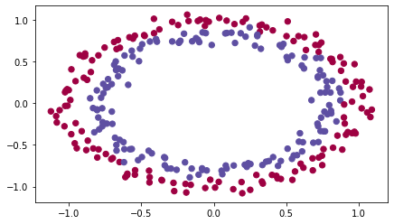
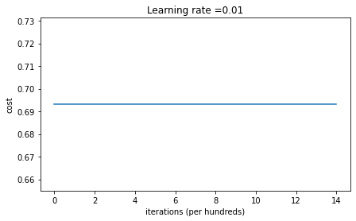
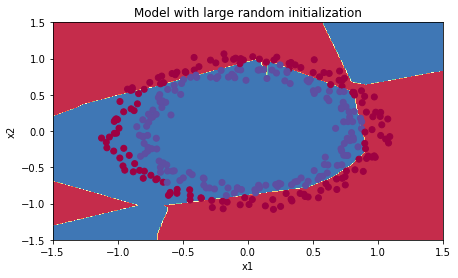
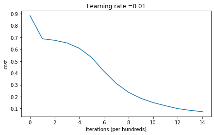
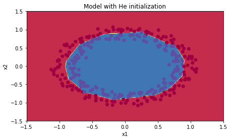

# A Hands-on Journey Through Weight Initialization

### The Genesis of Learning: Where Neural Networks Begin

> ***What if the success or failure of your entire neural network was determined in the first microsecond of its existence? What if, like a rocket's trajectory being set at launch, the initial values of your network's weights sealed its fate before training even began?***

Welcome to one of deep learning's most profound lessons: **initialization matters**. In this project, you'll experience firsthand why the "birth moment" of a neural network—when its weights receive their first values—can mean the difference between spectacular success and complete failure.

## Setting the Stage: Your Laboratory Awaits

You'll conduct three experiments with weight initialization, each revealing a fundamental truth about how neural networks learn. You'll implement the same network architecture three times, changing only how it begins life. The results will surprise you.

```python
import numpy as np
import matplotlib.pyplot as plt
from init_utils import sigmoid, relu, compute_loss, forward_propagation
from init_utils import backward_propagation, update_parameters, predict, load_dataset

# Load our dataset: blue and red dots in circular patterns
train_X, train_Y, test_X, test_Y = load_dataset()
```

This dataset presents a deceptively simple challenge: separate blue dots from red dots. But as you'll discover, how your network begins determines whether it can solve even this basic task.



## Experiment 1: The Curse of Perfect Symmetry

Let's start with what seems most natural—initializing all weights to zero. After all, zero is neutral, unbiased, a blank slate. What could go wrong?

### First Implementation Challenge

```python
def initialize_parameters_zeros(layers_dims):
    """
    Arguments:
    layer_dims -- list containing the size of each layer
    
    Returns:
    parameters -- dictionary containing weights "W1", "b1", ..., "WL", "bL"
    """
    parameters = {}
    L = len(layers_dims)
    
    for l in range(1, L):
        # YOUR CODE HERE: Initialize W and b to zero matrices
        # Hint: W[l] shape is (layers_dims[l], layers_dims[l-1])
        # Hint: b[l] shape is (layers_dims[l], 1)
        parameters['W' + str(l)] = np.zeros((layers_dims[l], layers_dims[l-1]))
        parameters['b' + str(l)] = np.zeros((layers_dims[l], 1))
        
    return parameters
```

Simple enough. But watch what happens when we train with these parameters...

When you run the training, you'll see something disturbing: the cost stays frozen at 0.693. The network isn't learning at all!



Let me explain this problem.

### Understanding the Symmetry Problem

"Why do they call it symmetry?" 

Think about identical twins forced to wear the same clothes, eat the same food, and make the same choices every day. They'd never develop individual personalities. That's exactly what happens with zero initialization:

**The Mathematical Reality:**
- All weights start at zero
- Forward pass: $z = W \cdot x + b = 0 \cdot x + 0 = 0$
- After ReLU: $a = \max(0, 0) = 0$
- Every neuron outputs the same value (zero)
- During backpropagation, every neuron receives the same gradient
- Every neuron updates identically

We call it **"symmetry"** because every neuron in a layer is perfectly symmetric—interchangeable, identical, indistinguishable. Like a hall of mirrors where every reflection is exactly the same, breaking this symmetry is essential for learning diverse features.

## Experiment 2: The Chaos of Random Initialization

Now let's swing to the opposite extreme. If zero is too orderly, what about complete randomness?

### Second Implementation Challenge

```python
def initialize_parameters_random(layers_dims):
    """
    Initialize parameters with large random values
    """
    np.random.seed(3)  # For reproducibility
    parameters = {}
    L = len(layers_dims)
    
    for l in range(1, L):
        # YOUR CODE HERE: Use np.random.randn() and multiply by 10
        parameters['W' + str(l)] = np.random.randn(layers_dims[l], layers_dims[l-1]) * 10
        parameters['b' + str(l)] = np.zeros((layers_dims[l], 1))
        
    return parameters
```

Notice we keep biases at zero—they don't need randomization since the weights already break symmetry.

### What Happens with Large Random Values?

This time, the network learns! The cost decreases, and it can separate some dots. But look carefully at the learning curve—it starts extremely high and decreases erratically. 




Remember from our section [Improving Deep Neural Networks(1)_Practical Aspects of Deep Learning_9. When Networks Break Down](https://github.com/Atikers/Deep-Dive-into-Python-and-AI/blob/main/Ch%20010.%20Hello!%20Deep%20Learning/007.%20Improving%20Deep%20Neural%20Networks(1)_Practical%20Aspects%20of%20Deep%20Learning.md)

When weights are too large, pre-activations $z = Wx + b$ become huge. For sigmoid activation:
- $\sigma(10) \approx 0.9999...$
- $\sigma(-10) \approx 0.0001...$

The activation function is "saturated"—stuck at extreme values where gradients are nearly zero. It's like trying to tune a guitar with strings already stretched to their breaking point.

## Experiment 3: The Goldilocks Zone - He Initialization

Finally, let's implement the elegant solution discovered by Kaiming He and his team.

### Final Implementation Challenge

```python
def initialize_parameters_he(layers_dims):
    """
    Initialize parameters using He initialization for ReLU
    """
    np.random.seed(3)
    parameters = {}
    L = len(layers_dims) - 1
    
    for l in range(1, L + 1):
        # YOUR CODE HERE: Scale by sqrt(2/layers_dims[l-1])
        parameters['W' + str(l)] = np.random.randn(layers_dims[l], layers_dims[l-1]) * np.sqrt(2. / layers_dims[l-1])
        parameters['b' + str(l)] = np.zeros((layers_dims[l], 1))
        
    return parameters
```

### The Mathematical Magic

Why $\sqrt{2/n}$? This isn't arbitrary—it's mathematically derived to maintain signal variance through ReLU layers. Remember from our section [Improving Deep Neural Networks(1)_Practical Aspects of Deep Learning_10. The Art of Beginning Right](https://github.com/Atikers/Deep-Dive-into-Python-and-AI/blob/main/Ch%20010.%20Hello!%20Deep%20Learning/007.%20Improving%20Deep%20Neural%20Networks(1)_Practical%20Aspects%20of%20Deep%20Learning.md):

- ReLU zeros out roughly half the signals
- This halves the variance
- The factor of 2 compensates for this loss
- The division by $n$ prevents variance explosion as signals combine

It's like tuning each guitar string to exactly the right tension—not too loose (signals vanish), not too tight (signals explode), but just right for beautiful music.




## Bringing It All Together: Your Results

After running all three experiments, you'll see dramatic differences:

| Initialization | Training Accuracy | Learning Behavior |
|----------------|-------------------|-------------------|
| **Zeros** | 50% | No learning—perfect symmetry |
| **Random(x10)** | 83% | Learns but unstable—saturation issues |
| **He** | 99% | Smooth, fast convergence |

The visualization tells the whole story. With He initialization, the decision boundary forms cleanly, separating blue and red dots with surgical precision.

## Deeper Insights from Our Journey

Through our conversation and experimentation, several profound insights emerged:

**1. Initial Conditions Determine Destiny**
Just as a small change in a satellite's launch angle results in vastly different orbits, weight initialization sets your network's entire learning trajectory.

**2. Mathematics Guides Engineering**
The $\sqrt{2/n}$ factor isn't a magic number or heuristic—it's a mathematical necessity derived from variance analysis.

**3. Different Activations Need Different Strategies**
- ReLU needs He initialization (factor of 2)
- Tanh/Sigmoid need Xavier initialization (factor of 1)
- The activation function's properties determine the right approach

## Implementation Checklist

Before moving forward with any deep learning project, remember:

1. **Never use zero initialization** (except for biases)
2. **Match initialization to activation function**:
   - ReLU → He initialization
   - Tanh/Sigmoid → Xavier initialization
3. **Verify your implementation** by checking initial activation distributions
4. **If training fails mysteriously**, initialization is the first suspect

## Summary

In deep learning, as in many complex systems, how you begin determines how you'll end. The difference between a network that achieves 50% accuracy and one that achieves 99% can be as simple as changing one line of code—**the initialization**.

You've seen symmetry create failure, chaos create instability, and mathematical precision create success.

> ***Remember: In deep learning, there are no small decisions. Even something as seemingly trivial as initial weight values can determine whether your network soars or crashes. Initialize wisely—your network's entire future depends on it.***