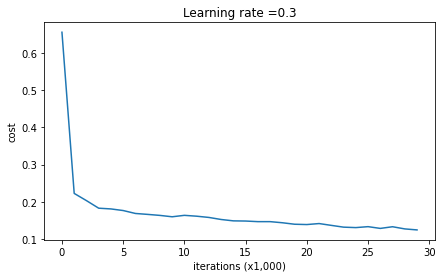
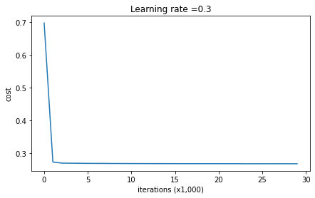
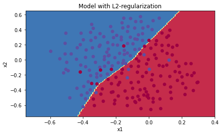
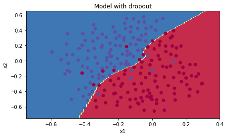

# A Hands-On Journey Through Regularization

> ***"In football as in neural networks, it's not about having the best individual players, but about creating a team that performs well under any conditions."***  
>
> ***― A wise football coach***

### The Challenge: When Perfect Training Leads to Match-Day Disasters

> ***What happens when a football team practices only on their home field, memorizing every bump and curve, but then fails spectacularly in away games? How can we train systems—whether football teams or neural networks—to perform well in situations they've never seen before?***

Welcome to real-world regularization project! You've just been hired by the French Football Corporation as their AI consultant. The stakes are high: the goal keeper needs to know exactly where to kick the ball so their teammates can score with headers. 

Let's start by understanding our mission through code:

```python
# Import our required packages
import numpy as np
import matplotlib.pyplot as plt
import sklearn
import sklearn.datasets
import scipy.io
from reg_utils import sigmoid, relu, plot_decision_boundary, initialize_parameters, load_2D_dataset, predict_dec
from reg_utils import compute_cost, predict, forward_propagation, backward_propagation, update_parameters

# Load the football field data
train_X, train_Y, test_X, test_Y = load_2D_dataset()
```

Each blue dot represents a successful header by a French player, while red dots show opponent successes. Our neural network must learn where the goalkeeper should aim.


### Exercise 1: Building Our Baseline Model (No Regularization)

First, let's see what happens without any regularization. Here's our complete model architecture:

```python
def model(X, Y, learning_rate = 0.3, num_iterations = 30000, print_cost = True, lambd = 0, keep_prob = 1):
    """
    Our 3-layer neural network: LINEAR->RELU->LINEAR->RELU->LINEAR->SIGMOID.
    
    Think of this as our 'Team' object that can be configured with different training strategies:
    - lambd = 0, keep_prob = 1: No regularization (overconfident team)
    - lambd > 0: L2 regularization (disciplined team) 
    - keep_prob < 1: Dropout (resilient team)
    """
    
    grads = {}
    costs = []
    m = X.shape[1]                        
    layers_dims = [X.shape[0], 20, 3, 1]  # Our network architecture
    
    # Initialize our team (parameters)
    parameters = initialize_parameters(layers_dims)

    # Training loop - where the magic happens
    for i in range(0, num_iterations):
        
        # Forward propagation - the team makes predictions
        if keep_prob == 1:
            a3, cache = forward_propagation(X, parameters)
        elif keep_prob < 1:
            a3, cache = forward_propagation_with_dropout(X, parameters, keep_prob)
        
        # Calculate how wrong we were
        if lambd == 0:
            cost = compute_cost(a3, Y)
        else:
            cost = compute_cost_with_regularization(a3, Y, parameters, lambd)
            
        # Learn from our mistakes (backward propagation)
        if lambd == 0 and keep_prob == 1:
            grads = backward_propagation(X, Y, cache)
        elif lambd != 0:
            grads = backward_propagation_with_regularization(X, Y, cache, lambd)
        elif keep_prob < 1:
            grads = backward_propagation_with_dropout(X, Y, cache, keep_prob)
        
        # Update our strategy
        parameters = update_parameters(parameters, grads, learning_rate)
        
        # Track our progress
        if print_cost and i % 10000 == 0:
            print("Cost after iteration {}: {}".format(i, cost))
        if print_cost and i % 1000 == 0:
            costs.append(cost)
    
    # Visualize our learning journey
    plt.plot(costs)
    plt.ylabel('cost')
    plt.xlabel('iterations (x1,000)')
    plt.title("Learning rate =" + str(learning_rate))
    plt.show()
    
    return parameters
```

Let's train our baseline model:

```python
# Train without any regularization - our overconfident model
parameters = model(train_X, train_Y)
print ("On the training set:")
predictions_train = predict(train_X, train_Y, parameters)
print ("On the test set:")
predictions_test = predict(test_X, test_Y, parameters)

# Visualize the decision boundary
plt.title("Model without regularization")
axes = plt.gca()
axes.set_xlim([-0.75,0.40])
axes.set_ylim([-0.75,0.65])
plot_decision_boundary(lambda x: predict_dec(parameters, x.T), train_X, train_Y)
```

**Results**: Training accuracy: 94.8%, Test accuracy: 91.5%

The model is overfitting! It memorizes every noisy training point instead of learning the general pattern.




### Exercise 2: Implementing L2 Regularization - The Discipline Coach

Now let's implement L2 regularization. Remember our insight: we need to penalize large weights in both the cost function and gradients.

```python
# GRADED FUNCTION: compute_cost_with_regularization

def compute_cost_with_regularization(A3, Y, parameters, lambd):
    """
    Implement the cost function with L2 regularization.
    
    The Object-Oriented insight: Our 'Cost' object now has two responsibilities:
    1. Measure prediction error (cross-entropy)
    2. Measure model complexity (L2 norm of weights)
    """
    m = Y.shape[1]
    W1 = parameters["W1"]
    W2 = parameters["W2"]
    W3 = parameters["W3"]
    
    # Original cost - how wrong our predictions are
    cross_entropy_cost = compute_cost(A3, Y)
    
    # NEW: Regularization cost - how complex our model is
    # As we discovered: sum all squared weights across all layers
    L2_regularization_cost = (lambd / (2 * m)) * (
        np.sum(np.square(W1)) + 
        np.sum(np.square(W2)) + 
        np.sum(np.square(W3))
    )
    
    # Total cost combines both objectives
    cost = cross_entropy_cost + L2_regularization_cost
    
    return cost
```

But that's only half the story! We must also modify backward propagation:

```python
# GRADED FUNCTION: backward_propagation_with_regularization

def backward_propagation_with_regularization(X, Y, cache, lambd):
    """
    Backward propagation with L2 regularization.
    
    Key insight from our exploration: Each weight's gradient gets an additional
    'pull toward zero' proportional to the weight's current value.
    """
    
    m = X.shape[1]
    (Z1, A1, W1, b1, Z2, A2, W2, b2, Z3, A3, W3, b3) = cache
    
    dZ3 = A3 - Y
    
    # Original gradient + regularization gradient
    # The (lambd/m) * W3 term is the "gentle nudge" toward zero
    dW3 = 1./m * np.dot(dZ3, A2.T) + (lambd/m) * W3
    db3 = 1./m * np.sum(dZ3, axis=1, keepdims=True)
    
    dA2 = np.dot(W3.T, dZ3)
    dZ2 = np.multiply(dA2, np.int64(A2 > 0))
    
    # Same pattern for layer 2
    dW2 = 1./m * np.dot(dZ2, A1.T) + (lambd/m) * W2
    db2 = 1./m * np.sum(dZ2, axis=1, keepdims=True)
    
    dA1 = np.dot(W2.T, dZ2)
    dZ1 = np.multiply(dA1, np.int64(A1 > 0))
    
    # And layer 1
    dW1 = 1./m * np.dot(dZ1, X.T) + (lambd/m) * W1
    db1 = 1./m * np.sum(dZ1, axis=1, keepdims=True)
    
    gradients = {"dZ3": dZ3, "dW3": dW3, "db3": db3,"dA2": dA2,
                 "dZ2": dZ2, "dW2": dW2, "db2": db2, "dA1": dA1, 
                 "dZ1": dZ1, "dW1": dW1, "db1": db1}
    
    return gradients
```

Let's test our L2 regularization:

```python
# Train with L2 regularization (lambda = 0.7)
parameters = model(train_X, train_Y, lambd = 0.7)
print ("On the train set:")
predictions_train = predict(train_X, train_Y, parameters)
print ("On the test set:")
predictions_test = predict(test_X, test_Y, parameters)

# Visualize the smoother decision boundary
plt.title("Model with L2-regularization")
axes = plt.gca()
axes.set_xlim([-0.75,0.40])
axes.set_ylim([-0.75,0.65])
plot_decision_boundary(lambda x: predict_dec(parameters, x.T), train_X, train_Y)
```

**Results**: Training accuracy: 94%, Test accuracy: 93%

Success! The model generalizes better by learning simpler patterns.




### Exercise 3: Implementing Dropout - Building Team Resilience

Now for the most fascinating technique: dropout. Let's implement the forward propagation with random neuron deactivation:

```python
# GRADED FUNCTION: forward_propagation_with_dropout

def forward_propagation_with_dropout(X, parameters, keep_prob = 0.5):
    """
    Forward propagation with dropout.
    
    Object-Oriented insight: Each layer becomes a 'Team' that must function
    even when random members are absent.
    """
    
    np.random.seed(1)
    
    # Retrieve parameters
    W1 = parameters["W1"]
    b1 = parameters["b1"]
    W2 = parameters["W2"]
    b2 = parameters["b2"]
    W3 = parameters["W3"]
    b3 = parameters["b3"]
    
    # LAYER 1
    Z1 = np.dot(W1, X) + b1
    A1 = relu(Z1)
    
    # Dropout for layer 1
    # Step 1: Create random matrix (like rolling dice for each neuron)
    D1 = np.random.rand(A1.shape[0], A1.shape[1])
    
    # Step 2: Convert to binary mask (1 if neuron stays active, 0 if dropped)
    D1 = (D1 < keep_prob).astype(int)
    
    # Step 3: Apply mask (shut down some neurons)
    A1 = A1 * D1
    
    # Step 4: Scale up to maintain expected value (inverted dropout)
    A1 = A1 / keep_prob
    
    # LAYER 2 - Same dropout pattern
    Z2 = np.dot(W2, A1) + b2
    A2 = relu(Z2)
    
    D2 = np.random.rand(A2.shape[0], A2.shape[1])
    D2 = (D2 < keep_prob).astype(int)
    A2 = A2 * D2
    A2 = A2 / keep_prob
    
    # LAYER 3 (output layer - no dropout)
    Z3 = np.dot(W3, A2) + b3
    A3 = sigmoid(Z3)
    
    # Cache includes dropout masks for backward pass
    cache = (Z1, D1, A1, W1, b1, Z2, D2, A2, W2, b2, Z3, A3, W3, b3)
    
    return A3, cache
```

The backward propagation must mirror the forward pass:

```python
# GRADED FUNCTION: backward_propagation_with_dropout

def backward_propagation_with_dropout(X, Y, cache, keep_prob):
    """
    Backward propagation with dropout.
    
    Critical insight: The same neurons dropped in forward pass must be
    dropped in backward pass - they didn't participate, so they shouldn't
    receive gradient updates!
    """
    
    m = X.shape[1]
    (Z1, D1, A1, W1, b1, Z2, D2, A2, W2, b2, Z3, A3, W3, b3) = cache
    
    dZ3 = A3 - Y
    dW3 = 1./m * np.dot(dZ3, A2.T)
    db3 = 1./m * np.sum(dZ3, axis=1, keepdims=True)
    dA2 = np.dot(W3.T, dZ3)
    
    # Apply dropout to gradients (same mask as forward pass!)
    dA2 = dA2 * D2
    dA2 = dA2 / keep_prob  # Scale to match forward pass
    
    dZ2 = np.multiply(dA2, np.int64(A2 > 0))
    dW2 = 1./m * np.dot(dZ2, A1.T)
    db2 = 1./m * np.sum(dZ2, axis=1, keepdims=True)
    
    dA1 = np.dot(W2.T, dZ2)
    
    # Apply dropout to layer 1 gradients
    dA1 = dA1 * D1
    dA1 = dA1 / keep_prob
    
    dZ1 = np.multiply(dA1, np.int64(A1 > 0))
    dW1 = 1./m * np.dot(dZ1, X.T)
    db1 = 1./m * np.sum(dZ1, axis=1, keepdims=True)
    
    gradients = {"dZ3": dZ3, "dW3": dW3, "db3": db3,"dA2": dA2,
                 "dZ2": dZ2, "dW2": dW2, "db2": db2, "dA1": dA1, 
                 "dZ1": dZ1, "dW1": dW1, "db1": db1}
    
    return gradients
```

Let's see dropout in action:

```python
# Train with dropout (keep_prob = 0.86)
parameters = model(train_X, train_Y, keep_prob = 0.86, learning_rate = 0.3)

print ("On the train set:")
predictions_train = predict(train_X, train_Y, parameters)
print ("On the test set:")
predictions_test = predict(test_X, test_Y, parameters)

# Visualize the robust decision boundary
plt.title("Model with dropout")
axes = plt.gca()
axes.set_xlim([-0.75,0.40])
axes.set_ylim([-0.75,0.65])
plot_decision_boundary(lambda x: predict_dec(parameters, x.T), train_X, train_Y)
```

**Results**: Training accuracy: 93%, Test accuracy: 95%

Our best result! The model has learned robust features that don't depend on any single neuron.




### Key Implementation Insights from Our Journey

Through our implementation and debugging conversations, we discovered several crucial patterns:

```python
class RegularizationInsights:
    
    def l2_regularization_pattern():
        """
        L2 Regularization modifies both cost and gradients
        """
        # In cost function:
        # cost = cross_entropy + (lambda/2m) * sum(W²)
        
        # In gradients:
        # dW = original_gradient + (lambda/m) * W
        
        # This creates weight decay: W_new = W_old * (1 - learning_rate * lambda/m) - ...
        pass
    
    def dropout_pattern():
        """
        Dropout requires perfect forward-backward symmetry
        """
        # Forward: Create mask -> Apply mask -> Scale up
        # Backward: Apply SAME mask -> Scale up
        
        # Critical: Test time uses ALL neurons with NO scaling
        pass
```

### Tips for Debugging

1. Test regularization terms separately before combining
2. Verify gradient calculations match between forward and backward
3. Use small lambda values initially (0.01) and increase gradually
4. Always set `np.random.seed()` for reproducible dropout
5. Visualize decision boundaries to understand regularization effects

### Summary

Through this hands-on project, we've transformed abstract regularization concepts into working code that saved the French Football Team! Key takeaways:

1. **L2 Regularization**: Adds weight penalties to both cost and gradients, creating "weight decay" that keeps models simple
2. **Dropout**: Randomly deactivates neurons during training, forcing robust distributed representations
3. **Implementation Details Matter**: Forward-backward symmetry, inverted dropout scaling, and proper testing procedures are crucial
4. **Visual Verification**: Always plot decision boundaries to understand what your regularization is actually doing

> ***Remember: The best code is not just functional but illuminating. By implementing regularization from scratch, you've gained insights that using a framework's one-line function could never provide. Now you truly understand why regularization works—and that understanding will guide you in choosing the right techniques for your future projects.***