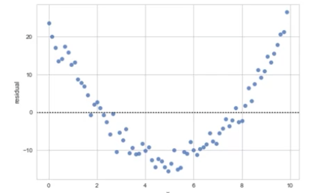

# Exploratory Data Analysis

## 1. Introduction

**Exploratory Data Analysis (EDA)** is an approach to analyzing data sets to summarize their main characteristics, often with visual methods. EDA is used to understand the data, get a sense of what it looks like, and understand the relationships between variables. EDA is a crucial step in the data analysis process. It helps identify patterns, relationships, and anomalies in the data. EDA is also used to identify missing values, outliers, and other data quality issues.

So, after this chapter, you will be able to answer the following questions:  

***What are the characteristics which have the most impact on the product price?***

Let's get started!

## 2. Descriptive Statistics

### 1) Why do we need Descriptive Statistics?

Let's think about drawing a picture of a person. Before drawing a picture, we need to take a glance at the person to understand their characteristics. Such as height, weight, hair color, eye color. These characteristics help us draw a picture of the person. Similarly, in data analysis, we need to take a glance at the data to understand its characteristics. Such as mean, median, mode, standard deviation, minimum and maximum values. In other words, we need to know the characteristics of the data to understand it. Descriptive statistics help us understand the data by summarizing its main characteristics.

Explore data before building complicated models. Calculate descriptive statistics for your data to describe basic features of the data and obtain a summary.

Then, you can understand the data better and build better models.

### 2) What is Descriptive Statistics?

**Descriptive** literally means "to describe". 

**Statistics** is a branch of mathematics that deals with collecting, analyzing, interpreting, presenting, and organizing data. You've probably heard of statistics in the context of sports, politics, or economics. But statistics is also used in many other fields, such as science, engineering, and medicine.

So, **Descriptive Statistics** is a branch of statistics that deals with summarizing and describing data. Descriptive statistics help us to understand the data by summarizing its main characteristics. 

### 3) How to get Descriptive Statistics?

#### *1. `Describe()` Function*

`df.describe()` is used to get basic statistics for all numerical(continuous) variables(but we can apply the method 'describe' on the variables of type 'object'). It shows the count, mean, standard deviation, minimum, maximum, and interquartile range(IQR : 25%, 50%, 75%). Any NaN values are automatically skipped in these statistics.

#### *2. `Value_Counts()` Function*

`df['column_name'].value_counts()` is used to summarize **categorical data**. 'Categorical data' refers data that can be divided into categories. For example, let's assume we have a dataset that contains information about cars, and the drive system is a categorical variable, consisting of categories like 4wd, fwd, and rwd. 

We can use the `value_counts()` function to summarize the drive system data. The `value_counts()` function returns the count of unique values in the drive system data. 

```python
drive_wheels_counts = df['drive-wheels'].value_counts() # Return a Series containing counts of unique values in the 'drive-wheels' column.
drive_wheels_counts.rename(columns={'drive-wheels':'value_counts'}, inplace=True) # Rename the column name from 'drive-wheels' to 'value_counts'. Without this line, the column in 'drive_wheels_counts' would still be named 'drive-wheels', which might be confusing because it actually contains the counts of those values, not the values themselves.
drive_wheels_counts.index.name = 'drive-wheels' # Set the name of the Series index to 'drive-wheels'. 
df['drive-wheels'].value_counts().to_frame() # Convert the Series to a DataFrame. 
```

> **What is a Series?**  
> A one-dimensional data structure that contains only a single column of data.

> **What are the differences between a DataFrame and a Series?**
>
> A DataFrame is a two-dimensional data structure, similar to a table, that contains multiple columns of data. Each column has a name, and the values in the columns are represented by Series objects. 
>
> In Pandas, a Series object is often used to represent a single column in a DataFrame. For example, when you use `df['column_name']`, it returns the corresponding column as a Series. Series is very useful when performing analysis or manipulation on a single column of data.
>
> So, when we use `value_counts()`, we only include one bracket `df['drive_wheels'], not two brackets `df[['drive_wheels']]`.

Then, you get the following :  

|drive-wheels| value_counts |
| --- | --- |
| fwd | 118 |
| rwd | 75 |
| 4wd | 8 |

#### *3. Box Plot*

A box plot is a graphical representation of the distribution of data. It shows the median, quartiles, and outliers of the data. A box plot is useful for visualizing the spread of the data and identifying outliers. 


In the box plot above,
- **Median** : Represents the middle value of the data, dividing the data into two equal parts
- **Upper Quartile(also known as the 3rd quartile, Q3)** : Indicates where the top 25% of the data lies
- **Lower Quartile(also known as the 1st quartile, Q1)** : Indicates where the bottom 25% of the data lies
- **Whiskers** : Typically extend to the smallest and largest values(not considered outliers) within 1.5 times the interquartile range (IQR=Q3-Q1 : a measure of statistical dispersion) of the lower and upper quartiles
- **Upper and Lower Extremes** : Represent the maximum and minimum values within the whiskers.

Now, let's create a box plot to visualize the distribution of the price data.

```python
sns.boxplot(x='drive-wheels', y='price', data=df)
```

Then, you get the following :  


In the box plot above, we can see the distribution of different categories of the drive-wheels feature over the price feature.

#### *4. Scatter Plot*

Each observation represented as a point. These data points are numbers contained in some range. For example, the price and engine size are **continuous variables(variables that may contain any value within some range, can be of type 'int64' or 'float64'**). Then, What if we want to see the relationship between two continuous variables? Could engine size possibly predict the price of a car? One good way to visualize this relationship is to use a scatter plot. 

- Predictor/independent variables on x(horizontal)-axis : The engine size
- Target/dependent variables on y(vertical)-axis : The Price

```python
y = df['price']
x = df['engine-size']
plt.scatter(x, y)
```
```python
plt.title('Scatterplot of Engine Size vs Price') # Label the title
plt.xlabel('Engine Size')   # Label the x-axis
plt.ylabel('Price')        # Label the y-axis
```

Then, you get the following :  


The scatter plot above shows the relationship between the engine size and the price of the car. We can see that there is a positive correlation between the engine size and the price of the car. As the engine size increases, the price of the car also increases.

## 3. GroupBy in Python

GroupBy is used to split the data into groups based on some criteria, apply a function to each group independently, and then combine the results into a new data structure.

### 1) Why do we need GroupBy?

Let's think about the question : ***"Which type of drive system adds the most value to a vehicle? Is it front-wheel drive, rear-wheel drive, or four-wheel drive?"***

To answer this question, we need to group the data by the drive system and calculate the average price for each group. Then, we can compare the average price of each group to determine which type of drive system adds the most value to a vehicle.

### 2) How to use GroupBy?

Our strong weapon is the `groupby()` function. The `groupby()` function can be applied to categorical variables. It groups the data into categories. You can group by a single or multiple variables.

Take a look at the following code :

```python
df['drive-wheels'].unique() # Return the unique values in the 'drive-wheels' column.
```

Then, you get the following :  

`array(['rwd', 'fwd', '4wd'], dtype=object)`

We see that there are 3 different categories of drive wheels.

And then, we can select the columns 'drive-wheels', 'body-style', and 'price', and assign it to the variable 'df_group_one'. 

```python
df_group_one = df[['drive-wheels', 'body-style', 'price']] # Select the columns 'drive-wheels', 'body-style', and 'price' from the DataFrame df and assign it to the DataFrame df_test.
```

We can then calculate the average price for each of the different categories of data.

```python
df_grouped = df_group_one.groupby(['drive-wheels'], as_index=False).agg({'price':'mean'})'
df_grouped
```

Then, you get the following :  


The table above shows that rear-wheel drive vehicles are, on average, the most expensive, while 4-wheel and front-wheel are approximately the same in price.

You can also group by multiple variables. For example, let's group by both 'drive-wheels' and 'body-style'.

```python
df_gptest = df[['drive-wheels','body-style','price']]
grouped_test1 = df_gptest.groupby(['drive-wheels','body-style'],as_index=False).mean()
grouped_test1
```

### 3) Pivot Method

The `pivot()` method is used to reshape the data. It creates a new table by rearranging the data. One variable is displayed along the columns, and another along the row. It's like an Excel spreadsheet, with one var

Take a look at the following code :

```python
grouped_pivot = grouped_test1.pivot(index='drive-wheels', columns='body-style') # Reshape the data by setting the 'drive-wheels' column as the index and the 'body-style' column as the columns.
```

Then, you get the following :  


#### *Heatmap(Pseudo Color Plot)*

A heatmap is a graphical representation of data where the individual values contained in a matrix are represented as colors. A heatmap is useful for visualizing the relationship between two variables. If you pivot the table, and then use the heatmap function to visualize the data, you can get a better understanding of the data.

Take a look at the following code :

```python
plt.pcolor(df_pivot, cmap='RdBu') # Create a heatmap of the data in the DataFrame df_pivot using the 'RdBu' color map.
plt.colorbar() # Add a color bar to the heatmap.
plt.show() # Display the heatmap.
```

Then, you get the following :  


The colors of the heatmap represent the average price of each group. The blue color represents the highest price, while the red color represents the lowest price.

> **We will talk about **Data Visulaization** in the next chapter. But, here is a brief  about it.**  
>
> *1. Import the library - Matplotlib*
>
> ```python
>from matplotlib.pyplot as plt
>```
>
> If you've been following my book so far, you know what `pyplot` is. It is a collection of command-style functions that make Matplotlib work like MATLAB.
>
> ```python
> %matplotlib inline
> ```
>
> matplotlib functions return a plot object which requires additional statements to display. While using Matplotlib in Jupyter Notebooks, we require the graph to be displayed inside the notebook interface itself. It is, therefore, essential to add the following 'magic' statement after loading the library.
>
> *2. Import the library - Seaborn*
>
> ```python
>import seaborn as sns
>```
>
> Seaborn is a Python data visualization library *based on Matplotlib*. It provides a high-level interface for drawing attractive and informative statistical graphics.
>
> *3. Standard line plot*  
>
>The simplest and most fundamental plot is a standard line plot. `x` is treated as an independent variable and `y` as the dependent one. 
>
>```python
>plt.plot(x, y)
>```
>
> *4. Scatter plot*
>
> Scatter plots are graphs that present the relationship between two variables in a data set. They represent data points on a two-dimensional plane. The independent variable(attribute) is plotted on the X-axis, while the dependent variable is plotted on the Y-axis.
>
>```python
>plt.scatter(x, y)
>```
>
> *5. Histogram*
>
>A histogram is an important visual representation of data in categorical form. The x-axis represents the data bins, and the y-axis represents the number of elements in each of the bins.
>
>```python
>plt.hist(x, bins=number_of_bins+1)
>```
>
> *6. Bar plot*
>
>A bar plot is used for visualizing catogorical data. The y-axis represents the average value of data points belonging to a particular category, while the x-axis represents the number of elements in the different categories.
>
>```python
>plt.bar(x,height)
>```
>
> *7. Heat Map*
>
>Heat Map displays matrix data as an array of colored cells(known as faces). The color of each face depends on the color of one of its four surrounding vertices. Of the four vertices, the one that comes first in the x-y grid determines the color of the face.
>```python
>plt.pcolor(grouped_pivot, cmap='RdBu')
>plt.colorbar()
>plt.show()
>```
>
> *8. Regression plot*
>
>A regression plot draws a scatter plot of two variables, x and y, and then fits the regression model and plots the resulting regression line along with a 95% confidence interval for that regression. The x and y parameters can be shared as the dataframe headers to be used, and the data frame itself is passed to the function as well.
>```python
>sns.regplot(x = 'header_1',y = 'header_2',data= df)
>```
> *9. Box and Whisker plot*
>
>A box plot (or box-and-whisker plot) shows the distribution of quantitative data in a way that facilitates comparisons between variables or across levels of a categorical variable. The box shows the quartiles of the dataset while the whiskers extend to show the rest of the distribution, except for points that are determined to be "outliers".
>
>```python
>sns.boxplot(x='header_1', y='header_2', data=df)
>```
>
> *10. KDE plot*
>
>A Kernel Density Estimate (KDE) plot is a graph that creates a probability distribution curve for the data based upon its likelihood of occurrence on a specific value. This is created for a single vector of information. It is used in the course in order to compare the likely curves of the actual data with that of the predicted data.
>
>```python
>sns.kdeplot(X)
>```
>
> *11. Distribution Plot*
>
>This plot has the capacity to *combine the histogram and the KDE plots*. This plot creates the distribution curve using the bins of the histogram as a reference for estimation. You can optionally keep or discard the histogram from being displayed. In the context of the course, this plot can be used interchangeably with the KDE plot.
>
>```python
>sns.distplot(X,hist=False)
>```

## 4. Correlation

We'll talk in depth about the correlation between variables in the next section(Statistics). But in this chapter, I'll cover the basics of correlation.

### 1) What is Correlation?

**Correlation** is a statistical metric that describes the relationship between two variables. It indicates how one variable changes when the other variable changes(over time). Correlation can be between -1 and 1.

### 2) Why do we need Correlation?

For example, let's think about the probability of developing cancer. If you have a family history of cancer, you are more likely to develop cancer. In this case, there is a correlation between family history and cancer. Correlation helps us to understand the relationship between variables. It helps us to identify patterns, relationships, and anomalies in the data.

But, be careful! **CORRELATION DOES NOT IMPLY CAUSATION**. Just because two variables are correlated does not mean that one variable causes the other. For instance, there is a correlation between ice cream sales and the number of drownings. But it does not mean that ice cream sales cause drownings. There is a third variable, the weather, that causes both ice cream sales and drownings.

### 3) The Types of Correlation

#### *1. Positive Strong Correlation*

```python
sns.regplot(x='engine-size', y='price', data=df)    # Create a regression plot of the 'engine-size' and 'price' columns in the DataFrame df.
plt.ylim(0,)    # Set the y-axis limit to 0.
```

The goal of this code is to create a scatter plot of the engine size and price columns. The `regplot` function creates a regression plot of **the engine size** and **price** columns. The scatter plot shows the relationship between the engine size and the price of the car - **the positive linear relationship**. As the engine size increases, the price of the car also increases.

#### *2. Negative Strong Correlation*

```python
sns.regplot(x='highway-mpg', y='price', data=df)
plt.ylim(0,)
```

The goal of this code is to create a scatter plot of **the highway-mpg** and **price** columns. The scatter plot shows the relationship between the *highway-mpg* and the price of the car - **the negative linear relationship**. As the highway-mpg increases, the price of the car decreases.

#### *3. Weak Correlation*

```python
sns.regplot(x='peak-rpm', y='price', data=df)
plt.ylim(0,)
```

The goal of this code is to create a scatter plot of **the peak-rpm** and **price** columns. The scatter plot shows the relationship between the *peak-rpm* and the price of the car - **the weak linear relationship**. As the peak-rpm increases, the price of the car does not change significantly.

### 4) How to get Correlation?

  ```python
  correlation_matrix=df[['horsepower', 'price']].corr()
  print(correlation_matrix)
  ```

- Method above calculates the **Pearson Correlation coefficient**.
- **Pearson Correlation Coefficient** is a specific type of correlation coefficient. It is the most widely used correlation coefficient, formally known as the Pearson Product-Moment Correlation Coefficient. It specifically measures the strength and direction of the linear relationship between two continuous variables(it assumes that the data are normally distributed and the relationship between the variable is linear).

  - **Correlation Coefficient** : It quantifies the strength and direction of the relationship between two variables. The correlation coefficient ranges from -1 to 1.

  > **How to calculate the Pearson Correlation Coefficient?(Statistics)**
  > 
  > The formula for the correlation coefficient, often denoted as **r**, is given by:  
  >  
  > where:
  > - *n* is the number of data points
  > -  is the sum of the product of the *x* and *y* data points
  > -  is the sum of the *x* data points
  > -  is the sum of the *y* data points
  > -  is the sum of the squares of the *x* data points
  > -  is the sum of the squares of the *y* data points    
  > - Let's break down the formula:
  >   - Numerator  : This part calculates the covariance between x and y, adjusted by the total number of data points. Covariance measures how x and y vary together.
  >   - Denominator  : The denominator is a normalization factor, calculating the product of the standard deviations of x and y. It scales the covariance to ensure that the correlation coefficient remains between -1 and 1.

- **P-value**: P-value is used to **assess the statistical significance** of the results, **not to measure the strength or certainty of the correlation** itself. We can get the P-value using the `stats.pearsonr()` function from the `Scipy.stats` package.

    > **How to calculate the P-value?(Statistics)**
    >
    > *1. State the Null Hypothesis ($H_0$)*
    > - Define the null hypothesis, which assumes that there is no association between the variables, implying that any observed differneces are due to random chance(cf. *Alternative Hypothesis(H₁)* : Assumes that there is a significatn association between the variables, indicating that the observed differences are not due to random chance).
    > - In every experiment, there is always the possibility that there is no effect or no difference between the groups. This lack of a effect or difference is called **the null hypothesis**. To find the reason, imagine an experiment for a drug that we know is totally ineffective. In hypothesis testing, we never actually prove that the null hypothesis is true. Instead, we either fail to reject or reject based on the evidence provided by the data. Saying "the null hypothesis is true" is can imply a level of certainty that we don't have.  
    > - To understand fully, you should know the concept of **population** and **sample**. But shortly, a **population** is the entire group that you want to draw conclusions about, while a **sample** is a subset of the population that you actually measure or observe.
    >
    > *2. Choose the Appropriate Test*
    > - Depending on the data and hypothesis, select a statistical test (e.g., t-test, chi-square test, ANOVA). Each test has its own formula for calculating the test statistic.
    >
    > *3. Calculate the Test Statistic*
    > - Compute the test statistic (e.g., t-value, z-value) based on your data using the chosen test. The formula varies depending on the test.
    >
    > *4. Determine the Distribution*
    > - Identify the probability distribution of the test statistic under the null hypothesis. Common distributions include the normal distribution, t-distribution, and chi-square distribution.
    >
    > *5. Calculate the P-value*
    > - Using the test statistic and its corresponding distribution, calculate the P-value. This can be done using statistical software, tables, or a calculator.
    >
    > *6. Interpret the P-value*
    > - P-values evaluate how well the sample data support that the null hypothesis is true. It measures how compatible your data are with the null hypothesis. How likely is the effect observed in your sample data if the null hypothesis is true?  
    >
    > - High P-values: your data are likely with a true null.  
    > Low P-values: your data are unlikely with a true null.  
    >
    > - A low P-value suggests that your sample provides enough evidence that you can reject the null hypothesis for the entire population.
    >
    > - Compare the P-value to your chosen significance level (usually 0.05). A P-value lower than the significance level suggests that you should reject the null hypothesis, indicating that your results are statistically significant. Simply put, **if the P-value is less than 0.05, you can reject the null hypothesis(H₀) : There is likely a significant effect or difference between the variables.**
    >
    > *7. The Courtroom Analogy*  
    >
    > Let's imagine a courtroom trial. In this trial, a person is accused of committing a crime. Here's how the courtroom scenario relates to null hypothesis testing:  
    >   - **Null Hypothesis ($H_0$)**: In the courtroom, the default assumption is that the accused person is innocent. This is like the null hypothesis in statistics, where we assume there's no effect or no difference between groups.
    >   - **Alternative Hypothesis ($H_1$)**: The prosecutor believes the accused person is guilty and presents evidence to prove it. This is like the alternative hypothesis in statistics, where we believe there is an effect or a difference, and we try to provide evidence for it.
    >   - **Evidence (Data)**: The prosecutor presents evidence to show that the accused person is guilty. Similarly, in statistics, we collect data to test whether the null hypothesis should be rejected in favor of the alternative hypothesis.
    >   - **The Judge/Jury (Statistical Test)**: The judge or jury evaluates the evidence. In null hypothesis testing, the statistical test evaluates the data to see if it's strong enough to reject the null hypothesis.
    >   - **Decision (Reject or Fail to Reject)**: If the evidence is strong enough(=low P-value), the jury might find the accused guilty. In statistics, this is like rejecting the null hypothesis and concluding there’s a significant effect or difference.
    >   - If the evidence is not strong enough, the jury cannot convict, meaning the accused remains innocent. In statistics, this is like failing to reject the null hypothesis, meaning we don't have enough evidence to conclude there’s an effect or difference.
    >   - **Important Note**: Just like in a courtroom, where a "not guilty" verdict doesn't necessarily mean the person is innocent (just that there wasn't enough evidence to prove guilt), **failing to reject the null hypothesis doesn't mean it's true. It just means there isn't enough evidence against it.**
    >   - **Summary:**
    >     - The null hypothesis ($H_0$) is like assuming someone is innocent.
    >     - The alternative hypothesis ($H_1$) is like believing someone is guilty.
    >     - Evidence (data) is collected to test these assumptions.
    >     - The decision (reject or fail to reject) is based on whether the evidence is strong enough to change the assumption.

- Example
  - You can easily calculate the Pearson Correlation Coefficient using the `Scipy.stats` package. And this method gives you **the Pearson Correlation Coefficient** and **the P-value**. The code below calculates the Pearson Correlation Coefficient and P-value of the 'horsepower' and 'price' columns.
  
    ```python
    pearson_coef, p_value = stats.pearsonr(df['horsepower'], df['price']) 
    ```

  If the output gives a **Pearson Correlation Coefficient** of **0.81** and a **P-value** of **9.35e-48**, it indicates a strong correlation between the 'horsepower' and 'price' columns. Because the Pearson Correlation Coefficient is close to 1, it indicates a strong positive correlation between the 'horsepower' and 'price' columns. Additionally, the P-value is less than 0.001, which indicates that this correlation is highly statistically significant, meaning it is very unlikely to have occurred by chance.

  > **Relationship between Pearson Correlation Coefficient and P-value**
  >
  > - Correlation Strength: *A high or low correlation coefficient* ($𝑟$ close to +1 or -1) indicates a strong relationship, but this doesn’t automatically mean the relationship is statistically significant.
  >
  > - Statistical Significance: *The P-value* tells you whether the observed correlation is statistically significant.
  >
  >  - If the P-value is less than the significance level (usually 0.05), you can reject the null hypothesis and conclude that the correlation is statistically significant.
  
  > **Chi-Square Test for Categorical Variables**
  >
  > *1. Introduction*  
  >
  > The chi-square test is a statistical method used to determine if there is a significant association between two categorical variables. This test is widely used in various fields, including social sciences, marketing, and healthcare, to analyze survey data, experimental results, and observational studies.
  >
  > *2. Concept*
  >
  > The chi-square test is a non-parametric statistical method used to examine the association between two categorical variables. It evaluates whether the frequencies of observed outcomes significantly deviate from expected frequencies, assuming the variables are independent. The test is grounded in the chi-square distribution, which is applied to count data and helps in determining if any observed deviations could have arisen by random chance.
  >
  >- *what is parametric and non-parametric statistics?*
  >
  >   - **Parametric statistics** are based on assumptions about the population distribution, such as normality(The data follows a normal distribution) and homogeneity of variance(The variance within each group being compared is equal), Linearity(In regression, the relationship between variables is linear).
  >
  >      - When the assumptions are met, parametric tests are generally more powerful, meaning they are better at detecting true or differences.
  >
  >      - Examples of parametric tests include t-tests, ANOVA(Analysis of Variance), and linear regression.
  >
  >    - **Non-Parmaetric Statistics** do not assume a specific distribution for the data. They are more flexible and can be used when the data does not meet the assumptions required for parametric tests.
  >
  >      - Useful when dealing with non-normal data, ordinal data, or data with outliers. And they are applicable for small sample sizes or when the assumptions of parametric tests are violated. They are generally less powerful than parametric tests.  
  >
  >      - Examples of Non-Parametric tests include the Mann-Whitney U test, Kruskal-Wallis test, and Chi-Square test.
  >
  > *3. Applications*
  >
  > - **Market Research**: Analyzing the association between customer demographics and product preferences.
  >
  > - **Healthcare**: Studying the relationship between patient characteristics and disease incidence.
  >
  > - **Social Sciences**: Investigating the link between social factors (e.g., education level) and behavioral outcomes (e.g., voting patterns)
  >
  > - **Education**: Examining the connection between teaching methods and student performance.>
  >
  > - **Quality Control**: Assessing the association between manufacturing conditions and product defects.
  >
  > *4. Formula*
  >
  > The chi-square statistic is calculated using the formula:
  >
  >
  >
  > where: 
  >
  > - $O_i$ is the observed frequency of each category $i$
  > - $E_i$ is the expected frequency of each category $i$, calculated as :
  >
  >
  > And then, the sum is taken over all cells in the contingency table.
  >
  > The calculated chi-square statistic is then compared to a critical value from the chi-square distribution table. This table provides critical values for different degrees of freedom($df$) and significance levels($α$).
  >
  > The degrees of freedom for the chi-square test are calculated as:
  >
  > $df = (r-1)(c-1)$
  >
  > where $r$ is the number of rows and $c$ is the number of columns in the contingency table.
  >
  > *5. Steps to Perform the Chi-Square Test*
  >
  > Suppose a researcher wants to determine if there is an association between gender (male, female) and preference for a new product (like, dislike). The researcher surveys 100 people and records the following data:
  >
  > |Category|Like|Dislike|Total|
  > |---|---|---|---|
  > |Male|20|30|50|
  > |Female|25|25|50|
  > |Total|45|55|100|
  >
  > - *Step 1: Calculate Expected Frequencies*
  >   - Using the formula(think of row and column totals as the expected frequencies) for expected frequencies:  
  >   
  >
  > - *Step 2: Calculate the Chi-Square Statistic*
  > 
  >   
  >
  > - *Step 3: Determine the Degrees of Freedom*
  >
  >   $df=(2-1)(2-1)=1$
  >
  > - *Step 4: Interpret the Result*
  >
  >   Using a chi-square distribution table, we compare **the calculated chi-square value (1.008)** with the critical value at one degree of freedom and a significance level (e.g., 0.05). The critical value, as determined from chi-square distribution tables, is approximately 3.841.
  >
  >   Since 1.008 < 3.841, we fail to reject the null hypothesis. Thus, there is no significant association between gender and product preference in this sample.

## 5. Summary

In this chapter, we explored various aspects of our dataset through Exploratory Data Analysis (EDA), focusing on descriptive statistics, visualizations, and correlation analysis. Here's a summary of the key insights:

**Descriptive Statistics**: We examined the basic characteristics of the data, such as mean, median, and standard deviation, to gain an understanding of the overall distribution and spread of the data. This helped us identify potential outliers, data anomalies, and the central tendency of various features.

**Data Visualization**: By utilizing visual tools like box plots, scatter plots, and heatmaps, we were able to better understand the relationships between different variables. Visualizations revealed important patterns, such as the positive correlation between engine size and car price.

**Correlation Analysis**: We calculated the Pearson correlation coefficient to quantify the strength and direction of the relationships between key numerical variables. The analysis showed that certain features, such as horsepower and engine size, are strongly correlated with the price, providing valuable insights for predictive modeling.

Features like horsepower and engine size show strong positive correlations with the price, indicating they are likely important predictors in any model designed to estimate car prices. Our EDA identified several outliers and data quality issues that may need to be addressed in future analysis or modeling.
