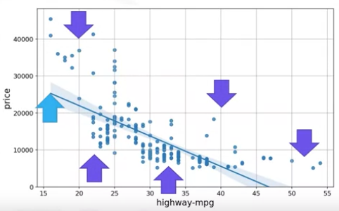
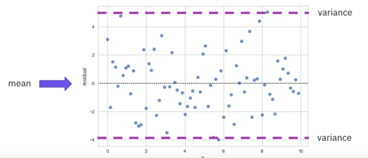
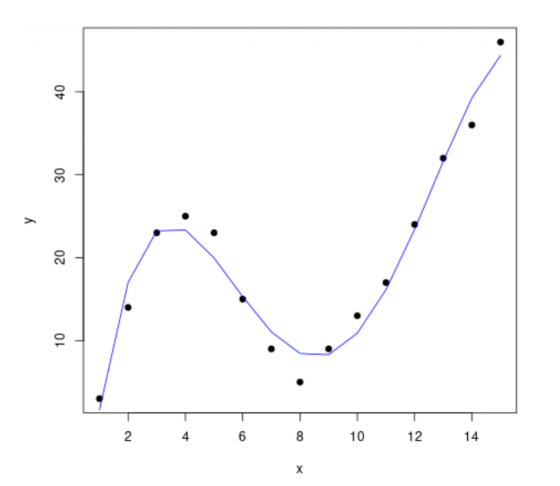

# Model Development

## 1. Introduction

A **model** can be thought of as a mathematical equation used to predict a value given one or more other values, relating one or more independent variables or features to a dependent variable. A model is similar to a black box: we input data and get an output.

You may have heard of **Regression**. What does it mean?
Regression is a statistical method used to predict the relationship between variables.

You may also have heard of **Linear**. What does it mean? That is a statistical term used to describe a specific type of relationship between parameters or variables.

There are two types of linear relationships:

1. **Linearity in Parameters**: This means that each parameter is multiplied by a predictor variable (or its transformation) and summed up, without being raised to a power or involved in a non-linear function (like sine, exponential, etc.). ***Linear regression always mean linearity in parameters,*** irrespective of linearity in explanatory variables.

    For example, $$Y = B_1 + B_2X$$ $$Y = B_1 + B_2X^2$$ Both equations are linear in parameters, and they are considered **linear regression models**.

2. **Linearity in Predictor variables** : A model can still be linear or non-linear in terms of the predictor variables. For example, a polynomial regression model includes terms like $X^2$, $X^3$, etc., which are non-linear transformations of the predictor variable $X$.

    For example, $$Y = B_1 + B_2X + B_3X^2 + B_4X^3$$ The equation above is a polynomial regression model, non-linear in predictor variables, but it is still linear in parameters. **So, it is considered a linear regression model.**

And there are some types of linear regression models:

1. **Simple Linear Regression:**

    - Equation : $Y = a + bX$
    - Linear in both the parameters and the variables.

2. **Multiple Linear Regression:**

    - Equation : $Y = a + b_1X_1 + b_2X_2 + b_3X_3$
    - Linear in both the parameters and the variables.

3. **Polynomial Linear Regression:**

    - Equation : $Y = a + bX + cX^2 + dX^3$
    - Linear in the parameters $a, b, c, d$
    - Non-linear in the variables $X, X^2, X^3$
    - But it is considered a linear regression model.

### 1) Simple Linear Regression

A **simple linear regression model** uses a single independent variable to predict a dependent variable. The model is represented by the equation.

$$
Y = a + bX
$$

- $Y$ is the dependent variable (e.g., car price).
- $X$ is the independent variable (e.g., engine size).
- $a$ is the intercept (e.g., the predicted price of a car with no engine).
- $b$ is the slope (e.g., the price increase for every unit increase in engine size).

### 2) Importance of Data

Usually, the more relevant data you have, the more accurate your model is. This means three things:

1. **Same Variables but More Data**: Increasing the amount of data for the same set of variables generally improves the model's ability to learn patterns and relationships, leading to more accurate predictions. With more data points, the model can better generalize from the training data to unseen data.
  
2. **More Variables**: Adding more relevant variables (features) can provide the model with additional information that might be critical in making accurate predictions. For instance, including features that were previously excluded (like the color of a car) can significantly improve the model's performance if those features are influential in determining the target variable.

3. **Relevant Data**: It's essential that the data used for modeling is relevant to the problem at hand. Irrelevant data, even in large quantities, can lead to misleading results.

### 3) Moving Beyond Simple Models

In addition to gathering more data or incorporating more variables, you can also experiment with different types of models. For example, you might use a **polynomial model**, which is a generalization of the simple linear regression model. The equation is given by:

$$
Y = a + b_1X + b_2X^2 + b_3X^3 + \cdots
$$

However, be careful! While a polynomial model can be a good approximation of the data, it can also lead to **overfitting**. Overfitting occurs when a model is too complex and starts to capture the noise in the data rather than the underlying pattern, leading to poor performance on new, unseen data.

Now, let's dive into how to develop a model using Python!

## 2. Simple Linear Regression and Multiple Linear Regression

Linear regression can refer to using one independent variable to make a prediction(simple linear regression) or to using multiple independent variables(multiple linear regression) to make a prediction.

### 1) Simple Linear Regression(SLR)

It is a method to help us understand the relationship between two variables:

- The predictor/independent variable ($X$)
- The target/dependent variable ($Y$)

The result of linear regression is a **linear function** that predicts the target variable as a function of the predictor variable.

For example, let's say we want to predict the car price using the engine size. The equation of the simple linear regression model is:

$$
Y = 10,000 + 320X
$$

We can use this equation to predict the car price given the engine size. The slope of the line is 320, meaning that for every unit increase in engine size, the price of the car increases by $320. The intercept of the line is 10,000, which is the **predicted** price of a car with no engine.

How do we find the best-fitting line? for example, we have data points for engine size and car price. We can use the data to estimate the coefficients $a$ and $b$ in the equation. The coefficients are chosen in such a way that they minimize the difference between the predicted value and the actual value.

we store the independent variable in the data frame or array `x` and the dependent variable in the data frame or array `y`. Each sample corresponds to a different row in each data frame or array.

In many cases, many factors influence how much people pay for a car, for example, the make or how old the car is. This uncertainty is taken into account by assuming a small random value is added to the point on the line. This is called **noise**.

I mentioned that "the difference between the predicted value and the actual value is minimized". This "difference" is actually the residual, noise is one of the components contributing to it. The best-fitting line is the one that has the smallest residuals. At specific points, usually small values are added or subracted from the predicted value to get the actual value. 

So, to briefly summarize the simple linear regression model : If we have a set of data points, we can use a simple linear regression model to predict the target variable(car price) as a function of the predictor variable(engine size). Then, we can use this model to predict values that we haven't seen before.

However, our model is not always correct. The model is an approximation of the real relationship between the variables.

We can create a simple linear regression model using the `scikit-learn` library in Python.

#### 1. *Importing Libraries*

```python
from sklearn.linear_model import LinearRegression   # Import linear_model from scikit-learn
lm = LinearRegression()  # Create a linear regression object using the constructor
lm
```

#### 2. *Training the model*

```python
X = df[['engine-size']]  # Independent variable
Y = df['price']  # Dependent variable
lm.fit(X, Y)  # Fit the linear model using the data
```

> **What is 'fit' function?**  
> The 'fit' function is used to train the model on the data. It takes the independent variable(s) and dependent variable(s) as input and returns the trained model.

#### 3. *Obtaining a prediction*

```python
Yhat = lm.predict(X)  # Predict the value of Y using the model
Yhat[0:5]  # Display the first 5 predicted values
```

#### 4. *Obtaining the value of the intercept and slope*

- intercept($a$) : `lm.intercept_`
- the slope($b$) : `lm.coef_`

#### 5. *Obtaining the final model*

- The final model is: $Price = a + b\cdot EngineSize$
- we can define $\hat{Y} = a + bX$, becuase we obtain the estimated value of $Y$ using the model, not the actual value of $Y$.
- However, $a$ and $b$ are the estimated parameters, not the actual ones. Therefore, strictly speaking, the model is $\hat{Y} = \hat{a} + \hat{b}X$.

### 2) Multiple Linear Regression(MLR)

This method is used to explain the relationship between one continuous target(dependent) variable and two or more predictor(independent) variables.

For example, let's say we want to predict the car price using *horsepower*, *curb-weight*, *engine-size* of the car. The equation of the multiple linear regression model is:

$$
\hat{Y} = a + b_1X_1 + b_2X_2 + b_3X_3
$$

where:
- $\hat{Y}$ is the predicted value of the target variable.
- $a$ is the intercept.
- $b_1, b_2, b_3$ are the coefficients of the predictors $X_1, X_2, X_3$.
- Strictly speaking, the model is $\hat{Y} = \hat{a} + \hat{b_1}X_1 + \hat{b_2}X_2 + \hat{b_3}X_3$.

we can visualze the values. Let's consider the following example:

| $X_1$ | $X_2$ | $Y$  |
|------|-----|--|
| 2.4  | 100 | 10,000|
| 3.5  | 200 | 20,000|
| 4.2  | 300 | 30,000|
| 5.0  | 400 | 40,000|

The table above can be visualized on a 3D plot. The x-axis represents $X_1$, the y-axis represents $X_2$, and the z-axis represents $Y$. The points on the plot represent the actual values of $X_1$, $X_2$, and $Y$. The plane represents the predicted values of $Y$ based on the values of $X_1$ and $X_2$. If the z-axis represents $\hat{Y}$, the plane represents the predicted values of $\hat{Y}$ based on the values of $X_1$ and $X_2$.

Now, we can create a multiple linear regression model using the `scikit-learn` library in Python.

#### 1. *Importing Libraries*

```python
from sklearn.linear_model import LinearRegression   
lm = LinearRegression()  
lm
```

#### 2. *Training the model*

```python
X = df[['horsepower', 'curb-weight', 'engine-size']]  # Independent variables
Y = df['price']  # Dependent variable
lm.fit(X, Y)  
```

#### 3. *Obtaining a prediction*

```python
Yhat = lm.predict(X)
Yhat[0:5]  
```

#### 4. *Obtaining the value of the intercept and slope*

- intercept($a$) : lm.intercept_
- the slope($b_1, b_2, b_3$) : lm.coef_

#### 5. *Obtaining the final model*

- The final model is: $Price = a + b_1 \cdot Horsepower + b_2 \cdot CurbWeight + b_3 \cdot EngineSize$
- We can define $\hat{Y} = a + b_1X_1 + b_2X_2 + b_3X_3$

### 3) Summary

On this page, we explored the fundamentals of regression models, particularly focusing on simple and multiple linear regression. Here are the key takeaways:

#### *1. Model Definition*

- A model is a mathematical equation that predicts a dependent variable (such as car price) based on one or more independent variables (such as engine size). Linear regression is one of the simplest and most widely used types of models.

#### *2. Simple Linear Regression (SLR):*

- Equation: The simple linear regression model is represented as $Y=a+bX$, where $Y$ is the dependent variable, $X$ is the independent variable, $a$ is the intercept, and $b$ is the slope.

- Application: SLR is used to understand the relationship between two variables. For instance, predicting car price based on engine size. The model estimates the slope and intercept to fit the best possible line through the data, minimizing the difference (residual) between the actual and predicted values.

#### *3. Noise:*

- In real-world data, predictions are often influenced by random variability or noise. Noise represents the small, unpredictable factors that cause deviations from the predicted values. The model aims to minimize this noise, but some level of noise is inherent and expected.

#### *4. Multiple Linear Regression (MLR):*

- Equation: MLR extends SLR by incorporating multiple independent variables, represented as $\hat{Y}=a+b_1X_1+b_2X_2+b_3X_3$. Here, $\hat{Y}$ is the predicted value, $X_1, X_2, X_3$ are the independent variables, and $b_1, b_2, b_3$ are their respective coefficients.

- Application: MLR is used when predicting an outcome based on several factors. For example, predicting car price using horsepower, curb weight, and engine size. The model fits a plane (in higher dimensions) to the data, optimizing the coefficients to minimize residuals across all data points.

#### *5. Model Implementation in Python:*

- Both SLR and MLR models can be implemented using the scikit-learn library in Python. The process involves importing necessary libraries, training the model with data, and using the model to make predictions.
Key outputs include the intercept and coefficients, which define the final regression equation used for prediction.

#### *6. Key Considerations:*

- While more data and more variables can improve model accuracy, careful attention must be paid to avoid overfitting, particularly with more complex models like polynomial regression.
- A model is always an approximation of the true relationship between variables, and its predictions should be interpreted with this in mind.

## 3. Model Evaluation using Visualization

Visualization is a powerful tool for evaluating regression models. Once you create the model, you should evaluate it. The wrong model can lead to wrong decisions. There isn't a reason to use the wrong model. Visualization allows us to quickly assess the relationship between variables, the strength of correlations, and the accuracy of our predictions. Let's explore some key visualization techniques:

### 1) Regression Plot

A **regression plot** provides a visual representation of the relationship between two variables:
- The horizontal axis represents the independent variable(the predictor variable).
- The vertical axis represents the dependent variable(the target variable).
- Each point on the plot represents a data point.
- The fitted line represents the predicted values: $\hat{Y} = \hat{a} + \hat{b}X$

    

To create a regression plot in Python, you can use the `regplot` function from the Seaborn library:

```python
import seaborn as sns
sns.regplot(x='engine-size', y='price', data=df)
plt.ylim(0,)
```

### 2) Residual Plot

A **residual plot** helps us visualize the errors between predicted and actual values.

- The horizontal axis represents the independent variable.
- The vertical axis represents the residuals (= actual value ($Y$) - predicted value ($\hat{Y}$)).
- We then plot the residuals on the vertical axis with the independent variable as the horizontal axis.



A good linear model should have **zero mean** residuals distributed evenly around the x-axis with **similar variance**. Imagine you are predicting the future. Sometimes you are right, sometimes wrong, but a good predictor's errors (residuals) should average to zero and be evenly spread around the x-axis.

If there is a pattern in the residual plot, it means that the linear assumption is incorrect.

- **Curvature**: Not randomly spread out around the x-axis. This suggests that the linear assumption is incorrect.

    

- **Heteroscedasticity**: Variance appears to change with the x-axis. This also suggests that the linear assumption is incorrect.

    

To create a residual plot using Seaborn:

```python
sns.residplot(df['engine-size'], df['price'])
```

### 3) Distribution Plot

A **distribution plot** compares the predicted values versus the actual values. These plots are useful for visualizing models with multiple independent variables.

Let's consider the following example - how to create a distribution plot :


- First, we plot the predictor values ($X$, e.g., engine-size) on the x-axis. And we plot the predicted values ($\hat{Y}$, e.g., estimated price) and target values ($Y$, e.g., actual price) on the y-axis.
- We then count and plot the number of predicted points that are approximately equal to one (in this case, 2).
- We then count and plot the number of predicted points that are approximately equal to two (in this case, 2).
- We repeat the process for predicted points that are approximately equal to three (in this case, 2). 
- And we repeat the process for the target values (actual values) (in this case, all the target values are 2).
- The values of the targets and predicted values are continuous. But a histogram is for discrete values. So, we need to convert them to a distribution.
- And compare the distribution plots: The fitted values and the actual values. If they are similar, it means the model is good.

> **What is the difference between continuous and discrete?**  
> Continuous values can take any value within a given range. Discrete values can only take specific, distinct values.

To create a distribution plot:

```python
import seaborn as sns
ax1 = sns.distplot(df['price'], hist=False, color="r", label="Actual Value") # Plot the actual values, 'hist=False' means no histogram
sns.distplot(Yhat, hist=False, color="b", label="Fitted Values", ax=ax1)
```

### 4) Summary

In this section, we explored various visualization techniques to evaluate regression models. Here are the key takeaways:

1. **Regression Plot**:
   - Provides a visual representation of the relationship between the independent variable and the dependent variable.
   - The fitted line represents the predicted values.

2. **Residual Plot**:
   - Visualizes the errors between predicted and actual values.
   - A good linear model should have residuals with zero mean, evenly distributed around the x-axis with similar variance.
   - Patterns in the residual plot indicate that the linear assumption may be incorrect.

3. **Distribution Plot**:
   - Compares the predicted values versus the actual values.
   - Useful for visualizing models with multiple independent variables.
   - Similar distribution plots for fitted and actual values indicate a good model.

## 4. Polynomial Regression and Pipelines

What if the relationship between the independent variable and the dependent variable appears curved or more complex than a simple straight line? In other words, what do we do when a simple or multiple linear regression model is not the best fit for the data?

We can use another type of linear regression model, **Polynomial Regression**. Polynomial regression is still a form of linear regression model. - it's linear in parameters, but allows for non-linear relationships with respect to the predictor variables.

A polynomial regression model extends a linear model by adding extra terms with higher powers of the independent variable. For example:

$$\hat{Y} = b_0 + b_1X + b_2X^2 + b_3X^3 + ... + b_nX^n$$

Despite including these higher-order terms, polynomial regression is still considered a linear model because it is linear in the parameters (the b coefficients). This allows us to use the same estimation techniques as in simple linear regression, while capturing more complex relationships in the data.

### 1) Polynomial Regression

a polynomial regression is a special case of the general linear regression model, and useful for describing curvilinear relationships.

#### *1. What is the Curvilinear Relationships?*

It's what you get by squaring or setting higher-order terms of the predictor variables in the model transforming the data. 

The model can be quadratic, which means that the predictor variable in the model is squared.

For example,

$$
\hat{Y} = a + bX + cX^2
$$
$$
\hat{y} = b_0 + b_1x_1 + b_2x_1^2
$$

This model can be represented as follows:


And the model can also be a cubic (3rd order), which means that the predictor variable in the model is cubed.

For example,

$$
\hat{Y} = a + bX + cX^2 + dX^3
$$
$$
\hat{y} = b_0 + b_1x_1 + b_2x_1^2 + b_3x_1^3
$$

This model can be represented as follows:



And the model can also be higher order, which means that the predictor variable in the model is raised to a power greater than 3. When a good fit has not been achieved by 2nd or 3rd order, we can use these models.

For example,

$$
\hat{Y} = a + bX + cX^2 + dX^3 + \cdots + nX^n
$$
$$
\hat{y} = b_0 + b_1x_1 + b_2x_1^2 + b_3x_1^3 + \cdots + b_nx_1^n
$$

The degree of the polynomial regression model makes a big difference and can result in a better fit if you pick the right value.

Don't forget that all models above are **linear regression models**. They are linear in the parameters, but not necessarily linear in the variables.

#### *2. How to calculate the polynomial regression model?*

- Calculate a Polynomial of 3rd order:
    ```python
    f=np.polyfit(x,y,3)
    p=np.poly1d(f)
    ```
- Print out the model:
    ```python
    print(p)
    ```

#### *3. Polynomial Regression with more than one dimension*

We can also use multi dimensional polynomial linear regression model.

For example,

$$
\hat{Y} = b + b_1X_1 + b_2X_2 + b_3X_1X_2+b_4X_1^2+b_5X_2^2+\cdots
$$

However, NumPy's `polyfit` function cannot perform this type of regression model. We use the `preprocessing` library in scikit-learn:

```python
from sklearn.preprocessing import PolynomialFeatures
```

Then, we transform the features into a polynomial feature:

```python
pr=PolynomialFeatures(degree=2, include_bias=False) # 'include_bias=False' means no bias term
x_poly=pr.fit_transform(X[['horsepower', 'engine-size']])
```

Let me explain intuitively:

|$X_1$|$X_2$|
|---|---|
|1|2|

Then, we transform the features into a polynomial feature:

```python
pr=PolynomialFeatures(degree=2, include_bias=False)
X_poly=pr.fit_transform(X[[1,2]])
```

We now have a new set of features that are a transformed version of our original features.

|$X_1$|$X_2$|$X_1X_2$|$X_1^2$|$X_2^2$|
|---|---|---|---|---|
|1|2|2|1|4|

As the dimension of the data gets larger, we may want to normalize multiple features in scikit-learn. Instead, we can use the preprocessing module to simplify many tasks. For example we can normalize the each feature simultaneously.

```python
from sklearn.preprocessing import StandardScaler
```
```python
SCALE=StandardScaler()  # train the object
SCALE.fit(X_data[['horsepower', 'engine-size']])  # fit the scale object
```

Then, transform the data into a new data frame on array_x_scale.

```python
x_scale=SCALE.transform(X_data[['horsepower', 'engine-size']])
```

### 2) Pipeline

Well, if you have to do all these steps manually, it would be a pain. There are many steps to getting a prediction:

1. Polynomial transform
2. Normalization
3. Linear Regression

But we can use a `Pipeline` library to do all these steps simply.

`Pipeline` sequentially perform a series of transformations(1. Polynomial transform, 2. Normalization). And the last step carries out a prediction.

First, we import all the modules we need.

```python
from sklearn.preprocessing import PolynomialFeatures
from sklearn.linear_model import LinearRegression
from sklearn.preprocessing import StandardScaler
```
Then, we import the `pipeline` library.

```python
from sklearn.pipeline import Pipeline
```

We create a list of tuples, the first element in the tuple contains the name of the esimator, model. And the second element contains model constructor.

```python
Input=[('polynomial',PolynomialFeatures(degree=2)),('scale',StandardScaler()),('Model',LinearRegression())]
```

Then, we input the list into the `Pipeline` constructor.

```python
pipe=Pipeline(Input)
```

And we can train the pipeline object.

```python
pipe.fit(df[['horsepower', 'curb-weight','engine-size', 'highway-mpg']], y)
```

We can also produce a prediction as well.

```python
Yhat=pipe.predict(df[['horsepower', 'curb-weight','engine-size', 'highway-mpg']])
```

### 3) Summary

#### 1. Polynomial Regression

- Polynomial Regression extends linear models by adding higher-order terms, allowing for curvilinear relationships.
- We discussed how to calculate polynomial regression models using NumPy and scikit-learn, including multi-dimensional polynomial regression.

#### 2. Pipeline

- `Pipeline` streamline the process of applying multiple transformations and fitting a model.
- By using `Pipeline`, we can efficiently perform polynomial transformations, normalization, and linear regression in a single workflow.

## 5. Measures for In-Sample Evaluation

## 6. Prediction and Decision Making