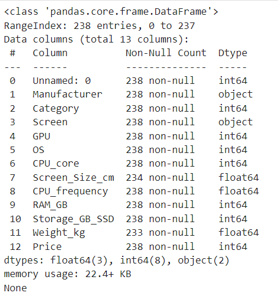
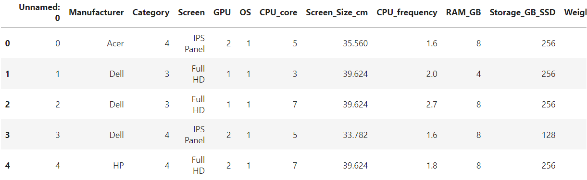
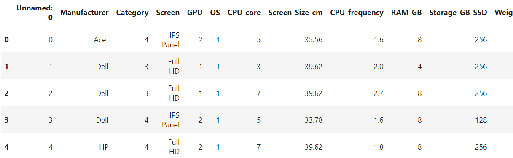
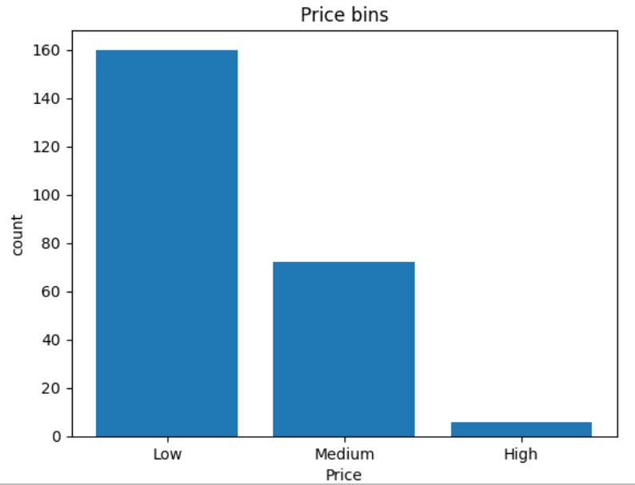
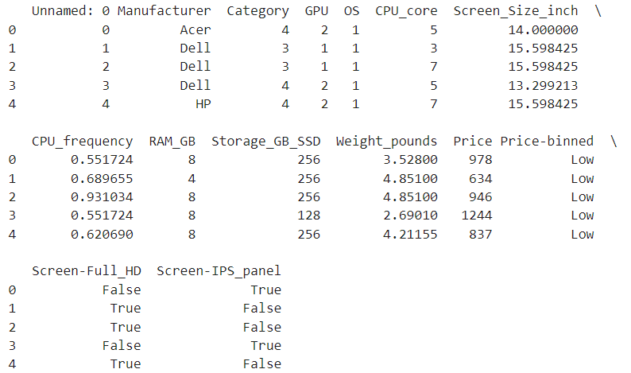

# Data Cleaning

## 1. Scenario
A leading e-commerce company, ***The river of Brazil*** has recuited me as a Data Scientist. I have been tasked with cleaning the data of the catalog of laptops. I will be working with a dataset that contains information about the laptops. And I also using data cleaning techniques for further analysis.

## 2. Steps

### 1) Step 1 : Importing Required Libraries

I will be using the following libraries for this task:
```python
import numpy as np           # For mathematical operations
import pandas as pd     # For data manipulation
import matplotlib.pyplot as plt # For data visualization, `pyplot` is a submodule of matplotlib, `plt` is an alias
%matplotlib inline         # For displaying plots in the notebook
```

> **Why do we use `%matplotlib inline`?**
> Matplotlib functions return a plot object which requires additional statements to display. While using matplotlib in Jupyter Notebooks, we require the graph to be displayed inside the notebook interface itself. It is, therefore, essential to add the following 'magic' statement after loading the library.

### 2) Step 2 : Loading the Data

The functions below will download the dataset into my browser:

```python
from pyodide.http import pyfetch   
# Import the `pyfetch` function from the pyodide.http module.
# pyfetch is used to asynchronously fetch data from a given URL.

async def download(url, filename):  
    # Define an asynchronous function called 'download'.
    # This function takes two arguments: 'url' (the URL to download the file from) and 'filename' (the name to save the file as).

    response = await pyfetch(url)   
    # Send an HTTP request to the given URL and wait for the response.
    # Since pyfetch is an asynchronous function, the 'await' keyword is used to pause the function until the response is received.

    if response.status == 200:
        # Check if the HTTP response status is 200 (OK).
        
        with open(filename, "wb") as f:
            # Open a file with the specified 'filename' in write-binary mode ("wb").
            
            f.write(await response.bytes())
            # Write the content of the response (in bytes) to the file.
            # The 'await' keyword is used because 'response.bytes()' is also an asynchronous operation.
```

```python
file_path = './sales_data.csv'
```

To obtain the dataset, utilize the download() function as defined above:

```python
await download(file_path, "sales_data.csv")
file_name = "sales_data.csv"
```

First I will load data into a `pandas.DataFrame`

```python
df=pd.read_csv(file_name, header=0)
```

Verify loading by displaying the dataframe summary

```python
print(df.info()
```

Then, I get the following :  



View the first 5 values of the updated dataframe

```python
df.head()
```

Then, I get the following :  



I can update the `Screen_size_cm` column such that all values are rounded to nearest 2 decimal places

```python
df[['Screen_Size_cm']] = np.round(df[['Screen_Size_cm']],2)
df.head()
```

Then, I get the following : 



### 3) Step 3 : Data Cleaning

#### *1. Handling Missing Values*

I will check for missing values in the dataset

```python
missing_data=df.isnull()
print(missing_data.head())
for column in missing_data.columns.values.tolist():
    print(column)
    print (missing_data[column].value_counts())
    print("")
```

#### *2. Replacing with mean*

I note that values in the "Weight_kg" attribute are continuous in nature, and some values are missing. I will replace the missing values with the average value of the attribute.

```python
avg_weight = df["Weight_kg"].astype("float").mean(axis=0)
df["Weight_kg"].replace(np.nan, avg_weight, inplace=True)
```

#### *3. Fixing the data types*

Both "Weight_kg" and "Screen_Size_cm" attributes are seen to have the data type **"Object"**, while both of them should be having a data type of **"float"**.

```python
df[["Weight_kg", "Screen_Size_cm"]] = df[["Weight_kg", "Screen_Size_cm"]].astype("float")
```

#### *4. Data Stadardization*

The value of `Screen_size` usually has a standard unit of inches. Similarly, weight of the laptop is needed to be in pounds. I will be using the below mentioned units of conversion and modify the columns of the dataframe accordingly.

```{math}
1 inch = 2.54 cm
1 kg   = 2.205 pounds
```

```python
# Data standardization: convert weight from kg to pounds
df["Weight_kg"] = df["Weight_kg"]*2.205
df.rename(columns={'Weight_kg':'Weight_pounds'}, inplace=True)

# Data standardization: convert screen size from cm to inch
df["Screen_Size_cm"] = df["Screen_Size_cm"]/2.54
df.rename(columns={'Screen_Size_cm':'Screen_Size_inch'}, inplace=True)
```

#### *5. Data Normalization*

I will normalize the "CPU_frequency" attribute with respect to the maximum value avaliable in the dataset.

```python
df['CPU_frequency'] = df['CPU_frequency']/df['CPU_frequency'].max()
```

#### *6. Data Binning*

I will create 3 bins for the attribute "Price" and bins would be named as "Low", "Medium", "High". The new attribute will be named "Price_binned".

```python
bins = np.linspace(min(df["Price"]), max(df["Price"]), 4)
group_names = ['Low', 'Medium', 'High']
df['Price-binned'] = pd.cut(df['Price'], bins, labels=group_names, include_lowest=True )
```

Also, I will plot the histogram of these bins.

```python
plt.bar(group_names, df["Price-binned"].value_counts())
plt.xlabel("Price")
plt.ylabel("count")
plt.title("Price bins")
```

Then, I get the following :  



#### *7. Indicator Variables*

I will convert the "Screen" attribute of the dataset into 2 dinicator variables, "Screen-IPS" and "Screen-Full_HD". Then drop the "Screen" attribute from the dataset. 

```python
#Indicator Variable: Screen
dummy_variable_1 = pd.get_dummies(df["Screen"])
dummy_variable_1.rename(columns={'IPS Panel':'Screen-IPS_panel', 'Full HD':'Screen-Full_HD'}, inplace=True)
df = pd.concat([df, dummy_variable_1], axis=1)

# drop original column "Screen" from "df"
df.drop("Screen", axis = 1, inplace=True)
```

### 4) Step 4 : Verification

I will verify the changes made to the dataset by displaying the first 5 values.

```python
df.head()
```

Then, I get the following :  



## 3. Conclusion

In this project, I successfully prepared the laptop catalog dataset for further analysis. I began by importing necessary libraries and loading the dataset into a pandas DataFrame. I then addressed missing values by replacing them with the mean, ensuring data completeness. Data types were corrected to reflect the appropriate formats, facilitating accurate computations. I standardized units for screen size and weight to maintain consistency across the dataset. Normalization was applied to the CPU frequency attribute to scale the data, and I performed data binning on the price attribute to categorize it into meaningful segments. Additionally, I created indicator variables for the screen attribute to enhance the dataset's analytical capabilities. Finally, I verified the changes by reviewing the updated dataset.  

These steps have ensured that the dataset is clean, consistent, and ready for insightful analysis, enabling the e-commerce company, The River of Brazil, to make informed business decisions based on accurate data insights.