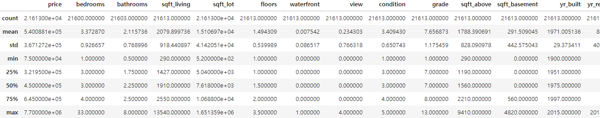
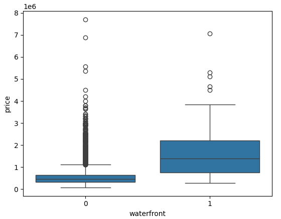
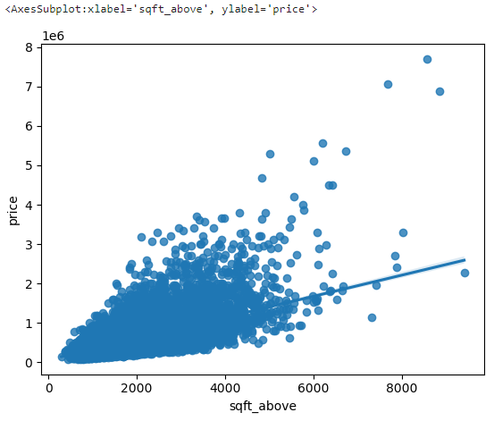

# Data Analysis(Model Development and Evaluation)

## ***Scenario***

I am a Data Scientist working at a Real Estate Investment Trust. The Trust would like to start investing in Residential real estate. I am tasked with determining the market price of a house given a set of features. 

I will analyze and predict housing prices using attributes or features such as `square footage`, `number of bedrooms`, `number of floors` and so on. 

## ***Setup***

```python
!pip install pandas        # When you are working on 'jupyter notebook'. 
!pip install numpy
!pip install seaborn
!pip install matplotlib
!pip install sckit-learn
```
```python
import pandas as pd                                                    
import matplotlib.pyplot as plt
import numpy as np
import seaborn as sns
from sklearn.pipeline import Pipeline
from sklearn.preprocessing import StandardScaler,PolynomialFeatures
from sklearn.linear_model import LinearRegression
%matplotlib inline
```

If you are working on 'Pyodide', you can use the following code to install the packages. 

```python
import piplite
await piplite.install('pandas')
await piplite.install('numpy')
await piplite.install('seaborn')
await piplite.install('matplotlib')
await piplite.install('scikit-learn')
```

## ***Steps***

### ***Step 1 : Importing Data Sets***

```python
import piplite      # For Installing packages in 'Pyodide'
await piplite.install('seaborn')    # Install 'seaborn' package
```
```python
from pyodide.http import pyfetch

# Define an asynchronous function to download a file from a URL and save it locally
async def download(url, filename):
    # Use pyfetch to make an HTTP request to the specified URL
    response = await pyfetch(url)
    
    # Check if the response status is 200 (OK), indicating the request was successful
    if response.status == 200:
        # Open a file in binary write mode ('wb') to save the downloaded content
        with open(filename, 'wb') as f:
            # Write the content of the response as bytes to the file
            f.write(await response.bytes())
```
```python
filepath = '~data/kc_house_data_NaN.csv'
```
```python
await download(filepath, "housing.csv")
file_name="housing.csv"
```
df = pd.read_csv(file_name)        # Load the data into a pandas DataFrame
```

**Note: If you are working on your local machines(Jupyter Anaconda), you can simply use the URL directly in the `pd.read_csv()` function. e.g. `df = pd.read_csv(filepath, header=None)`**

```python
df.head()        # Display the first 5 rows of the DataFrame.
```
```python
print(df.dtypes)        # Display the data types of each column in the DataFrame.
```

Then, I get the following :

```
Unnamed: 0         int64
id                 int64
date              object
price            float64
bedrooms         float64
bathrooms        float64
sqft_living        int64
sqft_lot           int64
floors           float64
waterfront         int64
view               int64
condition          int64
grade              int64
sqft_above         int64
sqft_basement      int64
yr_built           int64
yr_renovated       int64
zipcode            int64
lat              float64
long             float64
sqft_living15      int64
sqft_lot15         int64
dtype: object
```

```python
df.describe()        # describe to obtain a statistical summary of the dataframe.
```

### ***Step 2 : Data Cleaning***

```python
df.drop(['id', 'Unnamed: 0'], axis=1, inplace=True)        # Drop the 'id' and 'Unnamed: 0' columns.
```
Then, I get the following :



I can see I have missing values for the columns `bedrooms` and `bathrooms`. 

```python
print("number of NaN values for the column bedrooms :", df['bedrooms'].isnull().sum())
print("number of NaN values for the column bathrooms :", df['bathrooms'].isnull().sum())
```

And I will replace the missing values of the column `'bedrooms'`, `'bathrooms'` with the mean of the column `'bedrooms'`, `'bathrooms'` using the `replace()` method. 

```python
mean=df['bedrooms'].mean()
df['bedrooms'].replace(np.nan,mean, inplace=True)   # If you use `inplace=False`, you have to assign the result to a new DataFrame.

mean=df['bathrooms'].mean()
df['bathrooms'].replace(np.nan,mean, inplace=True)
```

And let's check if there are any missing values left.

```python
print("number of NaN values for the column bedrooms :", df['bedrooms'].isnull().sum())
print("number of NaN values for the column bathrooms :", df['bathrooms'].isnull().sum())
```

Then, I get the following :

```
number of NaN values for the column bedrooms : 0
number of NaN values for the column bathrooms : 0
```

### ***Step 3 : Exploratory Data Analysis***

Let's explore the data using 'Data Visualization'.

```python
df['floors'].value_counts().to_frame()        # Use the method value_counts to count the number of houses with unique floor values.
```

Then, I get the following :

```
floors
1.0      10680
2.0       8241
1.5       1910
3.0        613
2.5        161
3.5          8
```

```python
sns.boxplot(x='waterfront', y='price', data=df)        # Use the function boxplot in the seaborn library to determine whether houses with a waterfront view or without a waterfront view have more price outliers.
```

Then, I get the following :



```python
sns.regplot(x='sqft_above', y='price', data=df)        # Use the function regplot in the seaborn library to determine if the feature sqft_above is negatively or positively correlated with price.
```

Then, I get the following :



And I can use the `corr()` method to find the feature other than price that is most correlated with price.

```python
df.corr()['price'].sort_values()        
```

But, you have to convert 'string' to 'float' before using the `corr()` method. Because the `corr()` method only works with numerical values. 

`date` column is in 'string' format. So, I will convert it to 'float' using the `pd.to_datetime()` method.

```python
df['date'] = pd.to_datetime(df['date'], errors='coerce')  # `error='coerce'` will replace the invalid parsing with 'NaT'.

df.corr()['price'].sort_values()
```

Then, I get the following :

```
zipcode         -0.053203
date            -0.004357
long             0.021626
condition        0.036362
yr_built         0.054012
sqft_lot15       0.082447
sqft_lot         0.089661
yr_renovated     0.126434
floors           0.256794
waterfront       0.266369
lat              0.307003
bedrooms         0.308797
sqft_basement    0.323816
view             0.397293
bathrooms        0.525738
sqft_living15    0.585379
sqft_above       0.605567
grade            0.667434
sqft_living      0.702035
price            1.000000
Name: price, dtype: float64
```

### ***Step 4 : Model Development***

I can fit a linear regression model using the `LinearRegression()` function from the `scikit-learn` library, and I can calculate the R^2 using the `score()` method.

I will regress `price` on the `long` feature.

```python
X = df[['long']]
Y = df['price']
lm = LinearRegression()
lm.fit(X,Y)
lm.score(X, Y)
```

Then, I get the `0.00046769430149007363` as the $R^2$ value.

And I can also fit a linear regression model to predict the `price` using the `sqft_living` feature.

```python
X1 = df[['sqft_living']]
lm.fit(X1, Y)
lm.score(X1, Y)
```

Then, I get the `0.49285321790379316` as the $R^2$ value.

Now, I will fit a linear regression model to predict the `price` using the list of features.

```python
features =["floors", "waterfront","lat" ,"bedrooms" ,"sqft_basement" ,"view" ,"bathrooms","sqft_living15","sqft_above","grade","sqft_living"]
X2 = df[features]
lm.fit(X2, Y)
lm.score(X2, Y)
```

Then, I get the `0.6576951666037494` as the $R^2$ value.

I will use the list to create a pipeline object to predict the 'price'. So, I will create a list of tuples, the first element in the tuple contains the name of the estimator: `scale`, `polynomial`, and `model`, and the second element contains the model constructor: `StandardScaler()`, `PolynomialFeatures()`, and `LinearRegression()`.

```python
Input = [
    ('scale',StandardScaler()), # Data Scaling
    ('polynomial', PolynomialFeatures(include_bias=False)), # Polynomial Transformation, if `include_bias=True`, it will add a bias column to the data.
    ('model',LinearRegression()) # Model
]
```

Then, I will use the list to create a pipeline object to predict the 'price', and calculate the $R^2$.

```python
pipe=Pipeline(Input)
pipe.fit(X2, Y)
pipe.score(X2, Y)
```

Then, I get the `0.7512051345272872` as the $R^2$ value.

### ***Step 5 : Model Evaluation and Refinement***

I will split the data into training and testing sets using the `train_test_split` function in the `sklearn.model_selection` library. This will allow me to train the model using the training set and evaluate the model using the testing set.

Import the necessary modules:

```python
from sklearn.model_selection import cross_val_score
from sklearn.model_selection import train_test_split
```

I will split the data into training and testing sets:

```python
features =["floors", "waterfront","lat" ,"bedrooms" ,"sqft_basement" ,"view" ,"bathrooms","sqft_living15","sqft_above","grade","sqft_living"]    
X = df[features]
Y = df['price']

x_train, x_test, y_train, y_test = train_test_split(X, Y, test_size=0.15, random_state=1)


print("number of test samples:", x_test.shape[0])
print("number of training samples:",x_train.shape[0])
```

Then, I get the `number of test samples: 3242` and `number of training samples: 18371`.

I will create and fit a Ridge regression object using the training data, set the regularization parameter to `0.1`, and calculate the $R^2$ using the test data.

```python
from sklearn.linear_model import Ridge

RidgeModel = Ridge(alpha=0.1)
RidgeModel.fit(x_train, y_train)

RidgeModel.score(x_test, y_test)
```

Then, I get the `0.647875916393907` as the $R^2$ value.

Now, I will perform a second-order polynomial transform on both the training data and testing data. 

So, I will create and fit a Ridge regression object using the training data, set the regularization parameter to `0.1`, and calculate the $R^2$ using the provided test data.

```python
pr=PolynomialFeatures(degree=2)
x_train_pr=pr.fit_transform(x_train)
x_test_pr=pr.fit_transform(x_test)

RidgeModel = Ridge(alpha=0.1)
RidgeModel.fit(x_train_pr, y_train)

RidgeModel.score(x_test_pr, y_test)
```

Then, I get the `0.7002744263583341` as the $R^2$ value.

## ***Conclusion***

In this analysis, I successfully developed and evaluated models to predict housing prices using various features such as `square footage`, `number of bedrooms`, `number of floors`, and more. 

I began by importing the dataset and performing data cleaning to handle missing values in the `bedrooms` and `bathrooms` columns by replacing them with the mean values.

Through exploratory data analysis, I uncovered valuable insights into the data distribution and relationships between features. 

I observed that houses with waterfront views tend to have higher prices and more price outliers. The feature `sqft_living` showed a strong positive correlation with the `price`, making it a significant predictor.

In the model development phase, I started with simple linear regression models. Regressing `price` on the `long` feature yielded a low $R^2$ value of approximately 0.00047, indicating a weak predictive power. 

However, using `sqft_living` as the predictor improved the $R^2$ value to about 0.49. Expanding to a multiple linear regression model with a selection of significant features increased the $R^2$ value to approximately 0.66.

To enhance the model further, I implemented a 'pipeline' that included data scaling and polynomial feature transformation. This approach improved the $R^2$ value to around 0.75, demonstrating that polynomial features can capture nonlinear relationships and improve model performance.

During model evaluation and refinement, I employed Ridge regression to prevent overfitting by adding a regularization parameter. 

Splitting the data into training and testing sets allowed us to evaluate the model's generalization ability. 

The Ridge regression model with a regularization parameter of 0.1 achieved an $R^2$ value of approximately 0.65 on the test data. Applying a second-order polynomial transformation to the features further improved the $R^2$ value to about 0.70.

Overall, this analysis highlights the importance of **data preprocessing, exploratory analysis, and the use of appropriate modeling techniques in predicting housing prices**. 

By progressively refining the models and incorporating regularization and polynomial features, I achieved better predictive performance. 

Future work could explore more advanced algorithms, feature selection methods, or cross-validation techniques to further enhance the model's accuracy.