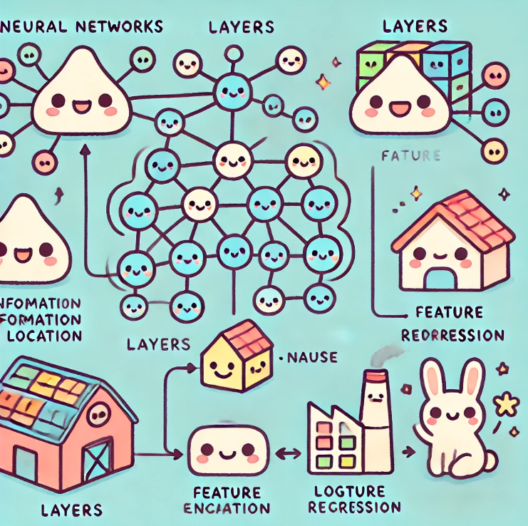
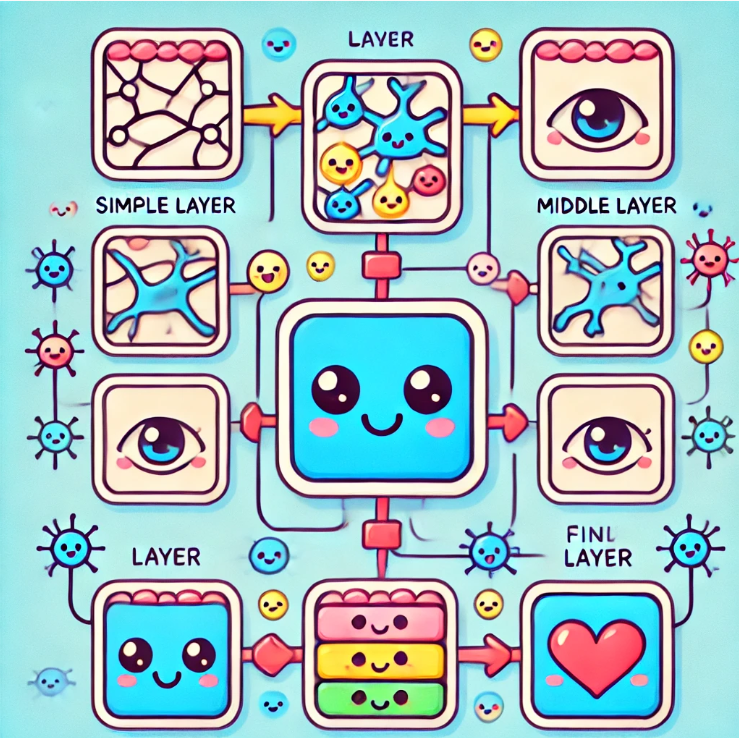
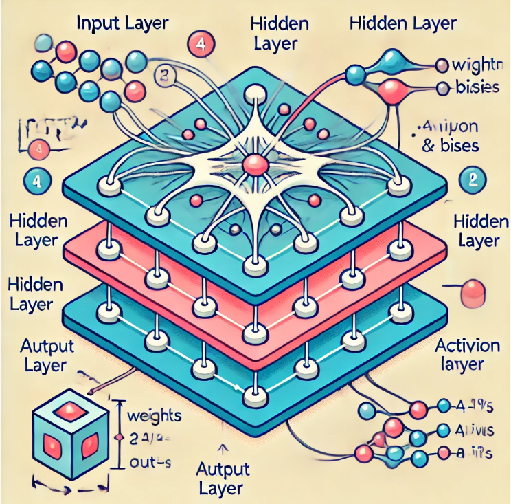

# Understanding Neural Networks: A Journey Inspired by the Brain

When we think about computers, we often picture something very different from our brains. Computers seem all about numbers, calculations, and perfect precision, while our brains feel more like a complex, organic web of thoughts and emotions. However, Neural Networks (NNs) are a special type of computer model that were inspired by the way our brains work. To really understand what Neural Networks are and why they matter, let’s imagine them in a way that’s a bit like how nature works.

From this section onward, you can think of it as a type of 'Advanced Learning Algorithms.' Previous algorithms like Linear Regression and Logistic Regression can be considered traditional algorithms.

## The Brain and Neural Networks: Two Peas in a Pod

Our brains are made up of billions of cells called **neurons**. Imagine neurons as little messengers passing notes in class. Each note a neuron passes helps decide whether you should feel happy, understand math, or even make your foot move. In this way, neurons connect and share messages with each other through tiny, electrical pulses—like sending messages in a secret code.

Neural Networks, or NNs, try to mimic this note-passing process. Imagine we have virtual neurons in a computer that also pass "notes" to each other. These notes are made up of numbers rather than feelings, but they follow a similar process:

- **Input Neurons** get data (just like you get information by looking at an image).
- They pass that information through several layers (like how one person might share a note with another until the message reaches the right person).
- Finally, **Output Neurons** produce the final answer, just like you come up with an idea after hearing everyone’s opinions.

## Linear Regression and Logistic Regression: The "Simple" Messengers

Before we get to modern Neural Networks, let's take a step back to understand two simpler types of models: Linear Regression and Logistic Regression. Imagine you are trying to predict the future—say, the grades you might get based on the hours you studied. **Linear Regression** is like a ruler; it draws a straight line between the number of hours studied and the grades. The idea is simple: more hours should mean better grades, and a line helps us measure that.

But what if it’s not that simple? What if you want to figure out whether you’ll pass or fail based on your study time? That’s where **Logistic Regression** comes in. It doesn’t draw a line but instead makes a simple "yes or no" decision: pass or fail. It’s like flipping a light switch based on the conditions—either there’s enough electricity, or there isn’t.

These models are like our basic messengers—they help, but they only understand things in a simple, straight line or an on/off way.

## Enter Neural Networks: The Big Picture Thinkers

Now imagine that instead of predicting grades with a simple straight line, you want to understand something super complex, like identifying a face in a crowded room. A Neural Network is like a whole school of messengers. Not just one straight line, but dozens, maybe hundreds, each working on different aspects of the problem. It’s like having an art class trying to paint the picture of a face:

- Some students focus only on drawing the eyes.
- Others are drawing the nose, the shape of the lips, or the color patterns.
- Each student passes their drawing to the next until, finally, one big complete picture emerges.

This is what makes Neural Networks so powerful. They use multiple layers of neurons called **hidden layers** that work together to solve very complex problems—layers that can see more than a single straight line, more than just on or off. These hidden layers allow the network to understand images, sounds, and even human language in ways that simple models never could.

## Deep Learning: Going Even Deeper

When you hear people talking about **Deep Learning**, they are really talking about Neural Networks with many hidden layers—"deep" meaning that there are so many steps between the input and the output that it’s like a maze. Imagine trying to solve a 1,000-piece puzzle. Each layer of the network is like a small group of pieces that make the picture a little clearer. The deeper the network, the better it can tackle really difficult problems—like understanding all the tiny differences that make a cat look different from a dog.

## A Real-Life Example: Detecting Handwriting

To make it even simpler, let’s look at how Neural Networks are used in something like handwriting recognition. If you give a computer a picture of a handwritten number, say "5," a simple model might not do very well because everyone writes differently. A Neural Network, though, will look at every curve and stroke. One layer might look at straight lines, another at loops, and another at connections between lines. Eventually, it combines all of these observations and confidently says, "This is a 5."

This is very similar to how we, as humans, recognize our friend's handwriting without even thinking. We learn from examples, and the more we see, the better we become—that’s the magic of Neural Networks.

## Wrapping It Up

Neural Networks are like supercharged versions of the simpler tools we started with, like Linear and Logistic Regression. Where those simple models look for a straight line, Neural Networks look for connections and deeper meanings, much like our own brains do. They’re able to solve complex problems because they take things step by step, layer by layer, until they understand the big picture—just like how a bunch of neurons in our brains work together to help us understand our world.

# Neural Networks: From Logistic Regression to Complex Learning

Let's discuss how neural networks build on traditional machine learning techniques like logistic regression and why they can learn in ways that traditional algorithms cannot.

## From Logistic Regression to Automatic Feature Engineering

Imagine you are trying to classify whether a house will be priced above a certain threshold (for example, whether it will be considered a "high-value" property). In the case of logistic regression, we use a formula like this:

$$
w \cdot x + b
$$

Here, $w \cdot x + b$ represents the combination of different features such as the size of the house, number of bedrooms, location, and more. This combination is then passed through a sigmoid function to generate a probability between 0 and 1, representing whether the house is likely to be classified as high-value or not.

The sigmoid function, which looks like this:

$$
\sigma(z) = \frac{1}{1 + e^{-z}}
$$

acts like a "squishing machine" that forces the output to be between 0 and 1. This makes the logistic regression model capable of predicting the probability of something happening (like the house being classified as high-value). The key here is that the features and their combinations are still relatively simple—it's up to us to decide which features to include and how they interact.

But what if we have more complex relationships? What if we can't manually combine features like size, number of bedrooms, and location in the most effective way? This is where neural networks truly shine.

## How Neural Networks Learn Without Manual Effort

Neural networks allow us to avoid manually defining every feature and their interactions. Instead, they perform automatic feature engineering through hidden layers. Think of a hidden layer as a workshop where a team of specialists takes in the basic ingredients (our original features like size, location, etc.) and mixes them together in various ways to create more advanced features, such as affordability, neighborhood desirability, and potential resale value.

For example, let’s say we have four features for predicting whether a house is high-value:

- Size of the house
- Number of bedrooms
- Location (e.g., proximity to good schools or city center)
- Age of the house

The neural network has a first hidden layer that might learn to combine these features into new ideas that are more abstract but more useful:

- **Affordability**: influenced by the price of the house, which depends on size, number of bedrooms, location, and age, in relation to market conditions and buyers' financial capacity.
- **Neighborhood Desirability**: influenced mostly by location and proximity to amenities.
- **Potential Resale Value**: influenced by a combination of all features, especially location and the age of the house.

These newly formed features then go through another neuron that combines them to predict the final outcome—whether the house is likely to be classified as high-value.

## Hidden Layers: How Many Do We Need?

One of the coolest aspects of neural networks is how they can learn complex relationships through multiple layers. But that also leads us to a practical question: how many hidden layers should we use? The answer depends on the problem's complexity.

- **Simple Problems**: If the problem is relatively straightforward, like predicting whether a house price is above or below a median value based on a few factors, one hidden layer might be enough. This is similar to following a simple recipe with just a few ingredients.

- **Complex Problems**: For tasks like image recognition, where you need to understand intricate details like edges, shapes, and even objects, having more hidden layers is necessary. Each layer in a deep neural network extracts progressively more abstract features, similar to how, in a factory, one stage might prepare raw materials, the next might assemble parts, and finally, a layer might put everything together to make a finished product.

However, adding too many layers can lead to **overfitting**, which is like trying to memorize every detail of a single recipe without understanding how to actually cook. The network becomes too good at remembering the training data but bad at generalizing to new, unseen examples.

## Automatic Feature Engineering

In traditional machine learning, we often need to engage in feature engineering, which means creating new features from raw data by hand. Imagine we want to predict housing prices, and we have the length and width of each lot. We might manually multiply them to get the area, which is a better feature for predicting price. This is a time-consuming process, and it requires domain expertise.

Time is money, and this manual feature engineering is money-consuming!

Neural networks, however, can learn to create these kinds of features on their own, through layers of neurons. Each neuron takes in some inputs, applies weights and biases, and then outputs an "activation" value. This process repeats across many neurons and layers, resulting in powerful, automatically generated features that make the learning process much more effective.

## Putting It All Together

So, what makes neural networks different from simpler algorithms like logistic regression? It’s their ability to learn their own features and build complex relationships without human intervention. Instead of having to decide ahead of time how size, number of bedrooms, and location are combined, the neural network can find the best combination for us, layer by layer, making it a truly powerful learning machine.

Imagine logistic regression as a basic calculator that takes inputs and performs a direct calculation. A neural network, on the other hand, is like a series of workstations in a factory. Each workstation transforms the inputs slightly, and by the time the inputs reach the end, they are no longer raw features but something much more insightful and useful for making decisions.

Next, let’s look at how neural networks can handle even more complex tasks, like recognizing faces or identifying objects in pictures. By stacking more layers, we create what's called a deep neural network, capable of handling the sophisticated patterns in complex data. 

# Understanding How Neural Networks Process Images

In the previous section, we explored how a neural network can be used to make predictions based on demand data. 

Now, let’s take a closer look at how neural networks apply a similar method in a field called computer vision, which enables applications like face recognition. 

Imagine that you want to build an application that identifies people in pictures. How can a neural network take a picture as input and correctly determine the identity of a person? To understand this process, let’s break it down and see how each layer in a neural network plays a specific role, similar to how a detective gathers clues in steps to solve a case.

Imagine you’re looking at a picture that’s made up of tiny squares, each with its own brightness level—these are called pixels. If the image is 1,000 by 1,000 pixels, then it’s essentially a giant grid of brightness values. Each pixel has an intensity from 0 to 255, where 0 is black, 255 is white, and everything in between represents shades of gray. When we unroll this grid into a list, we get a long list of one million pixel values. The challenge for the neural network is to take these million values and make sense of them, step by step, to recognize a face.

## Why Neural Networks Need Multiple Layers

Let’s imagine you’re trying to read a letter from a blurry picture. At first glance, you might just see faint lines and shapes. You can’t see the entire letter or its meaning right away; you have to piece together the smaller parts first. This is similar to how the neural network works—it needs to look at tiny details before moving on to bigger structures.

A neural network has multiple layers to capture different levels of detail, starting from very simple elements and progressing to complex structures. In the **first layer**, the network might look at very basic details, such as straight lines or edges. Think of these as the letters of a word. As we move to the **middle layers**, the network starts combining these lines and edges to form shapes that resemble specific parts of the face—like eyes, noses, or mouths. These middle layers are putting the letters together to make words. Finally, in the **last layer**, the network puts all these parts together to see the full “picture” and determine the identity of the person in the image, much like reading a complete sentence.

## How Each Layer Works: From Low-Level to High-Level Features

The process of understanding an image layer by layer is similar to building a puzzle. Imagine if each piece in the puzzle represents a part of the face—some pieces might show edges, others might show parts of an eye or mouth. The first layer of the network is like sorting the puzzle pieces that show just edges. The neural network at this stage isn’t seeing the big picture; it’s only picking up simple lines or edges, called **low-level features**.

As we move to deeper layers, the network combines these simple shapes into more detailed elements, like the outline of an eye or the corner of a mouth—these are **mid-level features**. It’s starting to see parts of the face, but it doesn’t yet see the entire face as a whole. Finally, in the last layers, the neural network sees the whole face structure, or **high-level features**, allowing it to understand not just small details but how those details come together to create a recognizable face.

## The Magic of Feature Extraction

The truly impressive part of neural networks is that they can **automatically learn these features** from data. No one has to tell the network, “Hey, that’s an eye” or “This is a nose.” Instead, the network learns to detect these features by training on lots of images. It’s similar to how we learn to recognize objects through experience. For instance, when you see enough pictures of cars, you start noticing common features like wheels or windows. In the same way, a neural network learns which parts of an image are important by analyzing patterns over thousands (or millions) of examples. 

For example, if you train a network to recognize faces, it will start picking up on facial features like eyes and mouths. But if you give it pictures of cars instead, it will learn to recognize car parts like wheels, headlights, or bumpers. The network adapts to the data it’s given, so the same neural network structure could be used for completely different recognition tasks.

## Understanding Relationships Between Pixels

At the start, each pixel in the image is treated as if it stands alone. However, as the network goes deeper, it begins to understand **how pixels relate to each other**. Just like connecting dots, the network realizes that certain arrangements of pixels are likely to form an eye, while others might form a nose. This spatial relationship is key to recognizing complex patterns.

## Reducing Complexity: Why the Network Can’t Look at Every Pixel in Detail

A 1,000 by 1,000 image has one million pixels. If the network tried to analyze every pixel separately, it would be like trying to read an entire library of books in one sitting. To make this process manageable, the network breaks down the data, focusing only on the most essential information at each layer. This way, it can quickly discard less important data and keep only what’s necessary to understand the image.

## From Pixels to People

Through these layers, the network transitions from seeing random pixels to identifying full objects or people. It starts with individual pixels, then recognizes edges, then parts of faces, and eventually understands entire facial structures. This journey from low-level to high-level features allows neural networks to excel in tasks like face recognition and other visual applications.

Later, you’ll learn how to implement a simple version of a neural network yourself to recognize handwritten digits. This will give you a hands-on understanding of how neural networks make decisions based on visual data, layer by layer. By understanding this process, you’ll gain a powerful tool to tackle other complex visual tasks and see how artificial intelligence is able to make sense of the world in ways similar to us.

# Understanding Neural Network Layers: From Inputs to Outputs

The fundamental building block of most modern neural networks is a layer of neurons. Imagine each layer as a team of small but hard-working units, each one called a neuron. In this section, you'll learn how to construct these layers and see how each layer works to transform inputs into meaningful outputs, step by step. By understanding the structure of individual layers, you can then stack them together to form a much larger and more powerful neural network. Let’s dive into how these layers work.

## Example: Predicting Product Demand

Consider an example where we want to predict the demand for a product. In this network, we have four input features that feed into a layer of three neurons. This layer is called the **hidden layer** because it’s hidden between the input and output. After passing through this hidden layer, the results are fed into the **output layer** with just one neuron, which gives the final prediction. Now, let's zoom in and understand what’s happening inside that hidden layer.

Alright, I'll explain using a bit of simple math to help your understanding.

## Input and the Role of Each Neuron

The hidden layer receives four input values, represented as a vector $\vec{X}$. This means each of the three neurons in this layer takes all four input values as its inputs. It might be confusing to think about this, but it's actually like giving each neuron the full story so that each can come up with its own interpretation. Imagine it like a cooking show, where each chef is given the same set of ingredients, but each chef can decide to weigh those ingredients differently to create their unique dish. Each neuron processes the inputs using its unique weights ($\vec{W}$) and bias ($b$).

## Computation in the Hidden Layer (Layer 1)

### First Neuron
Each neuron has two parameters: weights ($\vec{W}$) and bias ($b$). To denote this is the first hidden unit, we’ll subscript it as $\vec{W_1}$ and $b_1$. The neuron computes an output, the **activation value** $a_1$, as follows:

$$
a_1 = g(\vec{W_1} \cdot \vec{X} + b_1)
$$

where $g$ is the logistic function (sigmoid), calculated as:

$$
g(z) = \frac{1}{1 + e^{-z}}
$$

This results in $a_1$ (e.g., 0.3), representing the likelihood of the input suggesting high demand.

### Second Neuron
This neuron has parameters $\vec{W_2}$ and $b_2$. Similarly, it computes:

$$
a_2 = g(\vec{W_2} \cdot \vec{X} + b_2)
$$

yielding a different activation value (e.g., 0.7), which could represent awareness of the product among potential buyers.

### Third Neuron
The third neuron has its parameters, $\vec{W_3}$ and $b_3$, and computes:

$$
a_3 = g(\vec{W_3} \cdot \vec{X} + b_3)
$$

resulting in an activation value (e.g., 0.2).

The outputs of these three neurons ($a_1$, $a_2$, $a_3$) form an **activation vector** that passes to the next layer.

## Layer Numbering and Notation

In a neural network, each layer has a number. By convention:

- **Input layer** is called **Layer 0**.
- **First hidden layer** is **Layer 1**.
- **Output layer** is **Layer 2**.

To keep track, we use **superscripts** to denote layers. For example, $\vec{W_1}^{[1]}$ refers to the weights of the first unit in Layer 1, while $a^{[1]}$ indicates the output (activation) of Layer 1.

## Computation in the Output Layer (Layer 2)

Now, let’s examine the computation in the output layer. The output of Layer 1, the vector `[0.3, 0.7, 0.2]`, $\vec{a}^{[1]}$ becomes the input to Layer 2. Layer 2 has only one neuron, so it uses the weights $\vec{W_1}^{[2]}$ and bias ${b_1}^{[2]}$ to compute $a^{[2]}$ as follows:

### Output Calculation

$$
{a_1}^{[2]} = g(\vec{W_1}^{[2]} \cdot \vec{a}^{[1]} + {b_1}^{[2]})
$$

where $g$ is again the sigmoid function.

If $a_1^{[2]}$ is greater than 0.5, we predict “yes”; otherwise, we predict “no”. This **thresholding** approach is commonly used in binary classification.

### Notational Consistency
By adding superscripts, we consistently denote quantities associated with each layer. For example:

- $a_1^{[2]}$ represents the final output of Layer 2.
- $w_1^{[2]}$ and $b_1^{[2]}$ represent the parameters in Layer 2.

## Final Prediction

Once the network computes $a_1^{[2]}$, there’s an optional final step for binary classification. For instance, if we threshold $a_1^{[2]}$ at 0.5:

- **If $a_1^{[2]} \geq 0.5$**: Predict $\hat{y} = 1$.
- **If $a_1^{[2]} < 0.5$**: Predict $\hat{y} = 0$.

This gives the final prediction, $\hat{y}$, as either a 1 or 0.

## From Low-Level to High-Level Decisions

To put it all together, each neuron in the first layer looks at all the input features and forms an opinion based on the weights and bias it has. 

This first layer is good at picking up low-level features like edges or basic correlations in the data. The second layer then takes the opinions from the first layer and makes a higher-level decision. Think of Layer 1 as a group of friends each giving their individual opinions on a movie, and Layer 2 as you making a decision based on your friends’ input. Each friend (neuron) may weigh different factors—like acting, plot, or soundtrack—differently, and you aggregate their perspectives to make a final judgment.

## Summary

In this section, we've seen how each layer in a neural network works to transform inputs into outputs. By understanding the structure of individual layers, you can then stack them together to form a much larger and more powerful neural network. This approach allows neural networks to handle complex tasks by breaking them down into simpler, more manageable steps.
