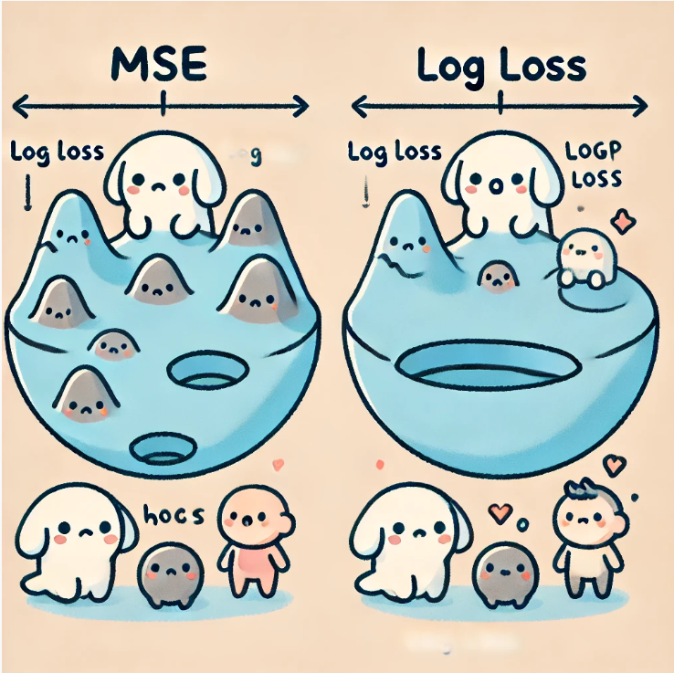

# Why Do We Use Log Loss Instead of MSE in Logistic Regression?

To begin with, it's important to note that we use different cost function for Linear Regression and Logistic Regression.

When you learn about Logistic Regression, you might wonder, "Why do we use a different cost function instead of the one (MSE) we used for Linear Regression?" Before we dive into that, it's important to understand that Logistic Regression outputs values between 0 and 1, which can be interpreted as probabilities rather than continuous numeric predictions. 

This difference brings challenges if we try to use MSE (Mean Squared Error) as the cost function, leading to inefficiencies and poor performance. 

In this section, I'll explain why Log Loss is a better choice, focusing on the questions you might have.

## Differences Between Linear Regression and Logistic Regression

First, let's talk about how Linear Regression and Logistic Regression are different. Linear Regression is used when we want to predict continuous numeric values.

Think about predicting the price of a house based on its size. Here, we use a cost function called MSE, which measures how far off our predictions are from the actual values by taking the squared difference and averaging it. The goal is to make this value as small as possible, meaning our model is doing a great job.

On the other hand, Logistic Regression is used for binary classification problems, which means we want to predict one of two possible outcomes—like whether a patient has cancer or does not have cancer. Instead of predicting a continuous value, Logistic Regression predicts a value between 0 and 1, which can be interpreted as a probability. This value tells us how likely it is that the answer is true (like the patient having cancer).

## Why Not Use MSE in Logistic Regression?

At first glance, it might seem logical to use MSE for Logistic Regression too. But it turns out that this creates a big problem. Let me explain why.

Imagine you're hiking in the mountains, and your goal is to reach the lowest point in a valley. If the valley is shaped like a smooth bowl, it's easy to walk down and reach the bottom—this is like how MSE works in Linear Regression: it's a convex function, which means it's shaped like a bowl. No matter where you start, if you keep walking downhill (which is like using gradient descent), you will eventually reach the bottom, or the global minimum.

But when we use MSE with Logistic Regression, the landscape changes. The cost function graph now looks more like a series of hills and valleys, rather than a smooth bowl. This is because the sigmoid function (which Logistic Regression uses to calculate probabilities) is a non-linear function. When combined with MSE, it makes the cost function non-convex—full of local minima. This means that, instead of smoothly walking down to the lowest point, you could easily get stuck in one of the smaller valleys along the way, never reaching the true lowest point. This is why using MSE in Logistic Regression makes it hard for the algorithm to find the best solution; it keeps getting stuck in the wrong places.

## Enter Log Loss: A Better Cost Function for Logistic Regression

To solve this problem, we use Log Loss (also called Cross-Entropy Loss). Log Loss is specially designed to work well with the sigmoid function and helps the model learn in a more effective way. Let's see how it works.

### Understanding Log Loss with Graphs

In Logistic Regression, we want our model to predict probabilities that are as close as possible to the actual outcomes. To do this, Log Loss assigns a penalty depending on how far off the prediction is from the true value.

When the actual value y is 1 (let's say the patient has cancer), the Log Loss function is $-log(f(x))$, where $f(x)$ is the predicted probability. If the model predicts $f(x) = 1$ (which means it’s almost certain the patient has cancer), then $-log(1)$ equals $0$. This means the loss is 0, which is exactly what we want—no penalty for a correct prediction.

However, if $f(x)$ is 0.1 (the model predicts only a 10% chance of cancer), then $-log(0.1)$ results in a high loss value, meaning the model gets a strong penalty for being so wrong. The further the prediction is from the true value, the larger the penalty.

Similarly, when $y = 0$ (the patient does not have cancer), we use $-log(1 - f(x))$. If $f(x)$ is close to 0, the loss is small, indicating a good prediction. But if $f(x)$ is close to 1, the penalty becomes very large, discouraging the model from making such incorrect predictions.

### Why This Makes Log Loss Better

Using Log Loss makes the cost function convex again—meaning it’s shaped like a smooth bowl. This way, when we use gradient descent, we can reliably find the global minimum, ensuring our model finds the best possible parameters for accurate predictions.

Think of Log Loss like a very strict teacher. If the model is even a little bit wrong, it gets a big penalty, pushing it to improve. This is different from MSE, which can sometimes be more forgiving in the context of classification, leading the model to get confused and stuck in the wrong places.

## Summary: Why Log Loss Works and MSE Doesn’t for Logistic Regression

To summarize, the reason we use Log Loss instead of MSE in Logistic Regression comes down to how these cost functions interact with the sigmoid function:

- MSE combined with the sigmoid function leads to a cost function with multiple peaks and valleys (local minima), making it difficult for the model to find the best solution.
- Log Loss, on the other hand, creates a smooth, bowl-shaped cost function, making it easier for the model to learn and converge to the best possible parameters.
- Log Loss uses the properties of $-log(f(x))$ (no penalty for a perfect prediction) and $-log(1 - f(x))$ (huge penalty for a completely wrong prediction) to ensure that the model gets rewarded for correct predictions and heavily penalized for incorrect ones. This helps the model become more accurate and reliable, especially in classification tasks where we need to decide between two outcomes.

By using Log Loss, we help our Logistic Regression model become better at making predictions that are not just numbers between 0 and 1, but meaningful probabilities that tell us something valuable about the real world.

## Mathematical Explanation of Log Loss

To further understand why **Log Loss** is a better choice, let’s dive into the math behind it and visualize it with relevant graphs. First, recall that Logistic Regression uses the **sigmoid function** to map predictions to probabilities:

$$
f_{\vec W, b}(\vec X) = \frac{1}{1 + e^{-(\vec W \cdot \vec X + b)}}
$$

The sigmoid function takes in the weighted sum of input features and outputs a value that can be interpreted as a probability. Now, to evaluate how well the predicted probability $f_{\vec W, b}(\vec X)$ aligns with the actual binary label $y$, we use **Log Loss**, which is defined as:

$$
\text{Log Loss}(f_{\vec W, b}(\vec X^{(i)}), y^{(i)}) = - \left[\log(f_{\vec W, b}(\vec X^{(i)})) + \log(1 - f_{\vec W, b}(\vec X^{(i)})) \right]
$$

This function penalizes incorrect predictions, and its shape ensures convexity, which is important for gradient-based optimization algorithms like **Gradient Descent** to work effectively.

### Case 1: When $y = 1$

If the true label is 1, we want the predicted probability $f(\vec X)$ to be as close to 1 as possible. In this case, the Log Loss function simplifies to:

$$
\text{Loss} = - \log(f(\vec X))
$$

- If $f(\vec X) = 1$, the model predicts correctly, and $- \log(1) = 0$. This is what we want—no penalty for a correct prediction.
- If $f(\vec X) = 0.1$, the model predicts that the probability of the positive class is 10%, but the true label is 1. In this case, the loss is:

$$
- \log(0.1) \approx 2.3
$$

This is a large penalty, indicating that the prediction is very wrong.

### Case 2: When $y = 0$

When the true label is 0, the Log Loss function becomes:

$$
\text{Loss} = - \log(1 - f(\vec X))
$$

- If $f(\vec X) = 0$, the model predicts correctly, and $- \log(1 - 0) = 0$.
- If $f(\vec X) = 0.9$, the model predicts a high probability for the positive class (90%), but the true label is 0. In this case, the loss becomes:

$$
- \log(1 - 0.9) = - \log(0.1) \approx 2.3
$$

Again, this is a large penalty for making an incorrect prediction.

## Convexity of Log Loss

One of the key reasons why **Log Loss** is preferred in Logistic Regression is that it is **convex**. A convex function has a single global minimum, meaning gradient descent can reliably converge to the best solution. This is not the case when using MSE with the sigmoid function, which results in a non-convex cost function with multiple local minima, making optimization difficult.

Graphically, the Log Loss function looks like a smooth bowl. No matter where the optimization algorithm starts, it will move towards the global minimum, ensuring the model finds the best possible parameters. 

In contrast, MSE with Logistic Regression would result in a jagged surface with many peaks and valleys, causing the algorithm to get stuck in suboptimal solutions.
