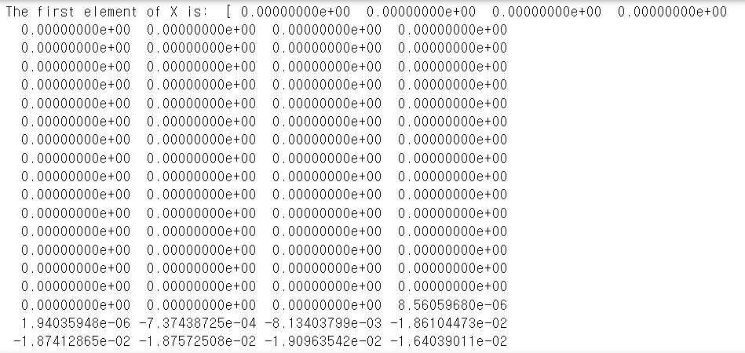
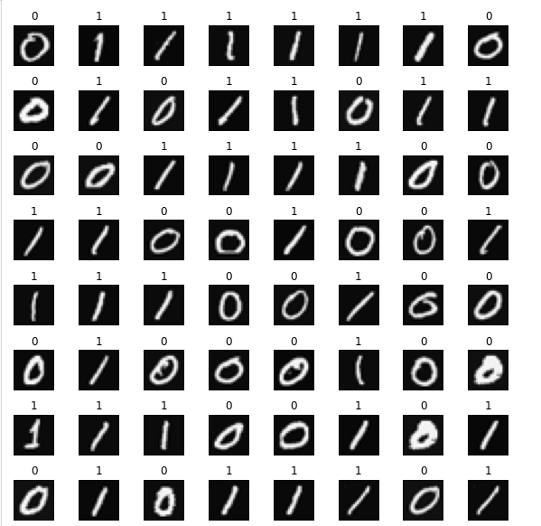

# 1. Scenario

As a data scientist at a company, I've been tasked with developing a system to automate the recognition of handwritten digits for secure access codes on physical devices. The goal is to enhance security by accurately identifying handwritten inputs from users. To begin this project, I will use a neural network to recognize two handwritten digits, zero and one. This binary classification task will allow me to test the fundamental methods required for digit recognition.

Automated handwritten digit recognition is widely used today—from reading postal codes on envelopes to processing amounts on bank checks. By successfully implementing this neural network, I will gain valuable insights into the techniques and challenges involved in this field. 

# 2. Steps

## Step 1 : Importing Required Libraries

First, let's run the cell below to import all the packages that we will need during this project.

- ***Numpy*** is the fundamental package for scientific computing with Python.
- ***TensorFlow*** is an end-to-end platform for machine learning to build, train, and deploy models.
- ***Matplotlib*** is a popular library to plot graphs in Python.

```python
import numpy as np                      
import tensorflow as tf
from tensorflow.keras.models import Sequential
from tensorflow.keras.layers import Dense
import matplotlib.pyplot as plt
from autils import *
%matplotlib inline
```
```python
import logging
logging.getLogger("tensorflow").setLevel(logging.ERROR)
tf.autograph.set_verbosity(0)
```

Keras is a high-level neural networks API integrated within TensorFlow. It simplifies the creation of deep learning models.

## Step 2 : Neural Networks

### 1. Dataset
 
I will start by loading the dataset for this task. 

- The `load_data()` function shown below loads the data into variables `X` and `y`
- The data set contains 1,000 training examples of handwritten digits, here limited to zero and one.  

  - Each training example is a 20-pixel x 20-pixel grayscale image of the digit $^1$. 
    - Each pixel is represented by a floating-point number indicating the grayscale intensity at that location. 
    - The 20 by 20 grid of pixels is "unrolled" into a 400-dimensional vector. 
    - Each training example becomes a single row in our data matrix `X`. 
    - This gives us a 1000 x 400 matrix `X` where every row is a training example of a handwritten digit image.

$$X = 
\left(\begin{array}{cc} 
--- (x^{(1)}) --- \\
--- (x^{(2)}) --- \\
\vdots \\ 
--- (x^{(m)}) --- 
\end{array}\right)$$ 

For your understanding:

1. What a 20x20 Pixel Image Means
    - Each image in this dataset is 20 pixels wide and 20 pixels tall, like a small grid.
    - Since 20x20 = 400, each image has 400 individual pixels.
2. Converting the Image to a 400-Dimensional Vector
    - Normally, a 20x20 image is like a grid or table of values, but for our neural network to work, we need to turn it into a list.
    - I take each pixel in the image and line them up in a row. Now I have a list of 400 numbers (each number is the intensity or brightness of a pixel).
    - Each image becomes a row of 400 numbers.
3. Structure of X (1000 x 400 Matrix)
    - X is a matrix with 1000 rows and 400 columns.
    - 1000 rows because there are 1000 images in our dataset.
    - 400 columns because each image has 400 pixel values.
    - So, in X, each row represents one image as a list of 400 numbers. This lets our neural network process each image separately and learn to identify if it shows a 0 or a 1.

- The second part of the training set is a 1000 x 1 dimensional vector `y` that contains labels for the training set
    - `y = 0` if the image is of the digit `0`, `y = 1` if the image is of the digit `1`.

$^1$<sub> This is a subset of the MNIST handwritten digit dataset (http://yann.lecun.com/exdb/mnist/)</sub>

```python
X, y = load_data()
```

### 2. View the variables

Let's get more familiar with the dataset.  
- A good place to start is to print out each variable and see what it contains.

The code below prints elements of the variables `X` and `y`. 

```python
print('The first element of X is: ', X[0])
  # this code prints the first element of X, which is a 400-dimensional vector representing a 20x20 grayscale image of a handwritten digit.
```

output:  



```python
print('The first element of y is: ', y[0,0])
print('The last element of y is: ', y[-1,0])
```

output:
```
The first element of y is: 0
The last element of y is: 1
```

### 3. Check the dimensions of the variables

Another way to get familiar with the data is to view its dimensions. I will print the shape of `X` and `y` and see how many training examples I have in my dataset.

```python
print('The shape of X is: ' + str(X.shape))
print('The shape of y is: ' + str(y.shape))
```

output:
```
The shape of X is: (1000, 400)
The shape of y is: (1000, 1)
```

### 4. Visualize the data

I will begin by visualizing a subset of the training set. 
- In the cell below, the code randomly selects 64 rows from `X`, maps each row back to a 20 pixel by 20 pixel grayscale image and displays the images together. 
- The label for each image is displayed above the image 

```python
import warnings
warnings.simplefilter(action='ignore', category=FutureWarning)
  # This line suppresses any FutureWarning messages that may be generated by the code.

m, n = X.shape

fig, axes = plt.subplots(8,8, figsize=(8,8))
fig.tight_layout(pad=0.1)

for i,ax in enumerate(axes.flat):
    # Select random indices
    random_index = np.random.randint(m)
    
    # Select rows corresponding to the random indices and
    # reshape the image
    X_random_reshaped = X[random_index].reshape((20,20)).T
    
    # Display the image
    ax.imshow(X_random_reshaped, cmap='gray')
    
    # Display the label above the image
    ax.set_title(y[random_index,0])
    ax.set_axis_off()
```

output:  



### 5. Model representation

The neural network I will use in this project is shown in the figure below. 

- This has **three dense layers** with sigmoid activations.
  - Recall that our inputs are pixel values of digit images.
  - Since the images are of size $20\times20$, this gives us $400$ inputs  

For your understanding:

1. Structure of X (1000 x 400 Matrix)
    - X is a matrix with 1000 rows and 400 columns.
    - 1000 rows represent 1000 images in the dataset.
    - Each row has 400 values, which represent the pixel values of one image.
    - So, each row in X is one image flattened into a list of 400 numbers.

2. Why the Input Layer Has 400 Units
    - The neural network takes in one image at a time.
    - Each image has 400 pixel values.
    - This is why the input layer of the neural network has 400 units—one for each pixel value in a single image.
    - Even though X has 1000 rows (1000 images), the neural network processes one row at a time. So, it only needs 400 input units for the 400 values in each image.

3. Summary
    - The 1000 rows in X just mean we have 1000 images.
    - 400 units in the input layer mean each image has 400 pixels that the neural network will use as input values.

- The parameters have dimensions that are sized for a neural network with $25$ units in layer 1, $15$ units in layer 2 and $1$ output unit in layer 3. 

    - Recall that the dimensions of these parameters are determined as follows:
        - If network has $s_{in}$ units in a layer and $s_{out}$ units in the next layer, then 
            - $W$ will be of dimension $s_{in} \times s_{out}$.
            - $b$ will be a vector with $s_{out}$ elements
  
    - Therefore, the shapes of `W`, and `b`,  are 
        - layer1: The shape of `W1` is (400, 25) and the shape of `b1` is (25,)
        - layer2: The shape of `W2` is (25, 15) and the shape of `b2` is: (15,)
        - layer3: The shape of `W3` is (15, 1) and the shape of `b3` is: (1,)

### 6. TensorFlow Model Implementation

Tensorflow models are built layer by layer. A layer's input dimensions ($s_{in}$ above) are calculated. I will specify a layer's *output dimensions* and this determines the next layer's input dimension. The input dimension of the first layer is derived from the size of the input data specified in the `model.fit` statement below. 

Below, I will be using Keras Sequential model and Dense Layer with a sigmoid activation to construct the network described above.

```python
model = Sequential([               
        tf.keras.Input(shape=(400,)),    #specify input size
        Dense(25, activation='sigmoid'),
        Dense(15, activation='sigmoid'),
        Dense(1, activation='sigmoid')
    ], name = "my_model")
```
```python
model.summary()
  # This function displays a useful summary of the model. Because we have specified an input layer size, the shape of the weight and bias arrays are determined and the total number of parameters per layer can be shown. Note, the names of the layers may vary as they are auto-generated.
```

output:  
```
Model: "my_model"
-----------------------------------------------------------------
 Layer (type)                Output Shape              Param #   
=================================================================
 dense_3 (Dense)             (None, 25)                10025     
                                                                 
 dense_4 (Dense)             (None, 15)                390       
                                                                 
 dense_5 (Dense)             (None, 1)                 16        
                                                                 
=================================================================
Total params: 10,431
Trainable params: 10,431
Non-trainable params: 0
-----------------------------------------------------------------
```

The parameter counts shown in the summary correspond to the number of elements in the weight and bias arrays as shown below.

```python
L1_num_params = 400 * 25 + 25  # W1 parameters  + b1 parameters
L2_num_params = 25 * 15 + 15   # W2 parameters  + b2 parameters
L3_num_params = 15 * 1 + 1     # W3 parameters  + b3 parameters
print("L1 params = ", L1_num_params, ", L2 params = ", L2_num_params, ",  L3 params = ", L3_num_params )
```

output:
```
L1 params =  10025 , L2 params =  390 ,  L3 params =  16 
```

And I can examine details of the model by first extracting the layers with `model.layers` and then extracting the weights with `layerx.get_weights()` as shown below.

```python
[layer1, layer2, layer3] = model.layers
```
```python
W1,b1 = layer1.get_weights()
W2,b2 = layer2.get_weights()
W3,b3 = layer3.get_weights()
print(f"W1 shape = {W1.shape}, b1 shape = {b1.shape}")
print(f"W2 shape = {W2.shape}, b2 shape = {b2.shape}")
print(f"W3 shape = {W3.shape}, b3 shape = {b3.shape}")
```

output:
```
W1 shape = (400, 25), b1 shape = (25,)
W2 shape = (25, 15), b2 shape = (15,)
W3 shape = (15, 1), b3 shape = (1,)
```

`xx.get_weights` returns a NumPy array. One can also access the weights directly in their tensor form. Note the shape of the tensors in the final layer.

```python
print(model.layers[2].weights)
```

output:
```
[<tf.Variable 'dense_5/kernel:0' shape=(15, 1) dtype=float32, numpy=
array([[ 0.43579835],
       [ 0.49430472],
       [ 0.11403406],
       [-0.05390096],
       [-0.41784894],
       [ 0.50865465],
       [ 0.55843526],
       [ 0.33164442],
       [ 0.44174832],
       [-0.00439787],
       [ 0.401995  ],
       [-0.07459742],
       [ 0.45604557],
       [-0.37958294],
       [ 0.4596135 ]], dtype=float32)>, <tf.Variable 'dense_5/bias:0' shape=(1,) dtype=float32, numpy=array([0.], dtype=float32)>]
```

The following code will define a loss function and run gradient descent to fit the weights of the model to the training data.

```python
# Compile the model with the specified settings for training
model.compile(
    # The loss function measures the difference between the predicted value and the actual value
    # BinaryCrossentropy is used here because this is a binary classification problem (0 or 1)
    loss=tf.keras.losses.BinaryCrossentropy(),
    
    # The optimizer helps to adjust weights in the neural network to reduce the loss during training
    # Adam is a popular optimization algorithm that combines the benefits of two other optimizers:
    # AdaGrad and RMSProp. It adapts the learning rate during training for better convergence.
    # Here, we set the learning rate (0.001) which controls the speed of weight updates
    optimizer=tf.keras.optimizers.Adam(0.001),
)

# Start the training process
model.fit(
    # X is the input data, containing the images represented as 400-dimensional vectors
    # Each vector represents one image that will be used as input to the neural network
    X, 
    
    # y is the target data (labels), where each value indicates if an image is a 0 or 1
    y,
    
    # epochs=20 means the model will go through the entire dataset 20 times
    # Each epoch updates the model’s weights based on the loss calculated from each batch
    # More epochs generally allow the model to learn better, but too many can lead to overfitting
    epochs=20
)
```

output:
```
Epoch 1/20
32/32 [==============================] - 0s 1ms/step - loss: 0.7820
Epoch 2/20
32/32 [==============================] - 0s 1ms/step - loss: 0.5483
Epoch 3/20
32/32 [==============================] - 0s 2ms/step - loss: 0.4133
Epoch 4/20
32/32 [==============================] - 0s 1ms/step - loss: 0.3102
Epoch 5/20
32/32 [==============================] - 0s 2ms/step - loss: 0.2392
Epoch 6/20
32/32 [==============================] - 0s 1ms/step - loss: 0.1908
Epoch 7/20
32/32 [==============================] - 0s 2ms/step - loss: 0.1566
Epoch 8/20
32/32 [==============================] - 0s 2ms/step - loss: 0.1320
Epoch 9/20
32/32 [==============================] - 0s 1ms/step - loss: 0.1133
Epoch 10/20
32/32 [==============================] - 0s 2ms/step - loss: 0.0989
Epoch 11/20
32/32 [==============================] - 0s 1ms/step - loss: 0.0878
Epoch 12/20
32/32 [==============================] - 0s 2ms/step - loss: 0.0783
Epoch 13/20
32/32 [==============================] - 0s 1ms/step - loss: 0.0703
Epoch 14/20
32/32 [==============================] - 0s 2ms/step - loss: 0.0638
Epoch 15/20
32/32 [==============================] - 0s 1ms/step - loss: 0.0582
Epoch 16/20
32/32 [==============================] - 0s 2ms/step - loss: 0.0534
Epoch 17/20
32/32 [==============================] - 0s 1ms/step - loss: 0.0493
Epoch 18/20
32/32 [==============================] - 0s 2ms/step - loss: 0.0457
Epoch 19/20
32/32 [==============================] - 0s 2ms/step - loss: 0.0426
Epoch 20/20
32/32 [==============================] - 0s 1ms/step - loss: 0.0398
<keras.callbacks.History at 0x751fa3158bd0>
```

To run the model on an example to make a prediction, use [Keras `predict`]. The input to `predict` is an array so the single example is reshaped to be two dimensional.

```python
prediction = model.predict(X[0].reshape(1,400))  # a zero
print(f" predicting a zero: {prediction}")
prediction = model.predict(X[500].reshape(1,400))  # a one
print(f" predicting a one:  {prediction}")
```

output:
```
predicting a zero: [[0.05199105]]
predicting a one:  [[0.9869224]]
```

The output of the model is interpreted as a probability. In the first example above, the input is a zero. The model predicts the probability that the input is a one is nearly zero. In the second example, the input is a one. The model predicts the probability that the input is a one is nearly one. As in the case of logistic regression, the probability is compared to a threshold to make a final prediction.

```python
if prediction >= 0.5:
    yhat = 1
else:
    yhat = 0
print(f"prediction after threshold: {yhat}")
```

output:
```
prediction after threshold: 1
```

# 3. Conclusion

In this project, I successfully implemented a neural network to recognize handwritten digits, specifically zero and one. 

This binary classification task provided a foundational understanding of the methods required for digit recognition. 

By leveraging TensorFlow and Keras, I was able to build, train, and evaluate the model effectively. 

This experience laid the groundwork for more complex and real-world digit recognition applications in future projects!